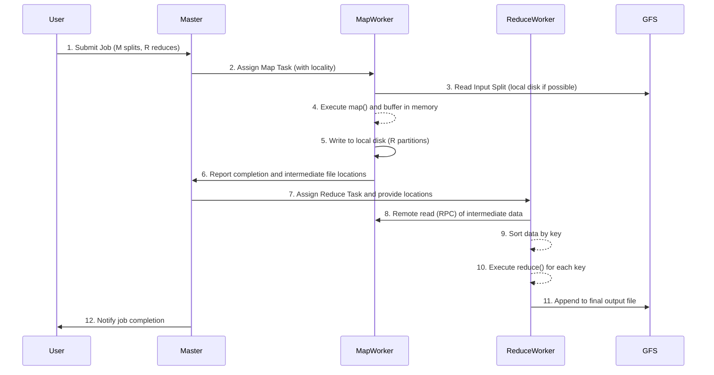

# L09b MapReduce

> [!summary] TL;DR
> MapReduce is a programming model and implementation for processing and generating large data sets in a highly parallel, fault-tolerant manner.
> It abstracts away the complex details of parallelization, data distribution, load balancing, and fault tolerance from the developer.
> The developer simply provides two functions: a map function to process key-value pairs into intermediate pairs, and a reduce function to aggregate these intermediate values by key.

## Learning outcomes

- Explain the motivation and target environment for MapReduce.
- Describe the programming model and the roles of the Map and Reduce functions.
- Trace the execution of a MapReduce job from input splitting to final output.
- Analyze how MapReduce handles fault tolerance, stragglers, and data locality.
- Evaluate the use of partitioners, combiners, and ordering guarantees in MapReduce computations.
- Contrast MapReduce with earlier parallel programming paradigms like MPI or shared-memory models.

## Motivation and the problem

Big data applications process massive datasets that are too large for a single machine and take a long time to compute.
These computations are typically "embarrassingly parallel," meaning they require little to no synchronization or coordination between independent pieces of work.
However, implementing these distributed computations requires dealing with the messy details of parallelization, partitioning data across thousands of machines, handling machine and network failures, and balancing the load dynamically.
Developers previously had to write significant amounts of complex infrastructure code to manage these issues for every new task.
This complexity obscured the core logic of the application.
The need for an abstraction that hides this distributed systems complexity while allowing developers to express their simple computational logic natively led to the creation of the MapReduce framework.
By taking inspiration from Lisp and functional programming primitives, MapReduce provides a scalable, easy-to-use solution for internet-scale processing.

## Core concepts

### Big data applications

<!-- coverage: L09b-01 -->
> [!note] Big Data Applications
> Computations operating over extremely large datasets, taking substantial time and resources, typically possessing the "embarrassingly parallel" property.

These applications are independent computations that can be run in parallel without the need for complex locking or synchronization mechanisms.
Examples include processing crawled web documents to create inverted indices, analyzing web request logs, or computing graph structures.
Because the tasks are independent, the primary challenge is scaling the work across a large cluster rather than orchestrating complex inter-process communication.

### MapReduce programming model

<!-- coverage: L09b-02 -->
> [!note] MapReduce Model
> A functional programming abstraction where the user specifies a map function to generate intermediate key-value pairs and a reduce function to merge all values associated with the same intermediate key.

The MapReduce framework is responsible for parallelizing big data applications across thousands of commodity nodes.
It automates building the task pipeline, scheduling tasks, handling data distribution, monitoring progress, and recovering from failed nodes.
By strictly separating the user's domain logic (the Map and Reduce functions) from the system's execution logic, the framework can optimize the execution environment independently.

### Map and reduce functions with an example

<!-- coverage: L09b-03 -->
> [!note] Map and Reduce
> The two user-defined functions: `map(k1, v1) -> list(k2, v2)` and `reduce(k2, list(v2)) -> list(v2)`.

For example, to find the number of occurrences of words in a set of documents, the map function receives `<filename, file_content>` pairs.
It parses the text and emits `<word, 1>` for each word encountered.
The MapReduce runtime then groups these intermediate pairs by key (the word) and passes them to the reduce function.
The reduce function receives `<word, [1, 1, 1, ...]>` and sums the counts, emitting `<word, total_count>`.
The number of reduce functions typically matches the number of unique keys or partitions.

### Execution overview and heavy lifting by the runtime

<!-- coverage: L09b-04 -->
> [!note] Heavy Lifting
> The automated process managed by the MapReduce runtime, including data splitting, task scheduling, intermediate file transfer, and sorting.

The MapReduce runtime starts by spawning one Master thread and multiple worker threads.
It automatically splits the input files into M chunks (typically 16-64 MB each).
The Master assigns these M Map tasks to idle workers.
A Map worker reads its assigned split, applies the user-defined map function, and buffers the intermediate output in memory.
This data is periodically flushed to the local disk, partitioned into R regions.
After Map tasks complete, the Master assigns R Reduce tasks to workers, who use remote procedure calls (RPCs) to fetch their partition of the intermediate data from the Map workers' local disks.
The Reducer sorts the data by key, applies the reduce function, and appends the result to a final output file.

### Master data structures

<!-- coverage: L09b-05 -->
> [!note] Master State
> The centralized data structures kept by the Master to track task status, worker assignments, and intermediate file locations.

The Master maintains a scoreboard for each Map and Reduce task, recording its state (idle, in-progress, or completed) and the identity of the assigned worker.
Crucially, the Master serves as the conduit for routing data.
For each completed Map task, the Master records the locations and sizes of the R intermediate file regions.
This information is incrementally pushed to the Reduce workers so they know where to pull their input data.

### Fault tolerance and re-execution

<!-- coverage: L09b-06 -->
> [!note] Re-execution
> The primary mechanism for fault tolerance, where tasks assigned to failed workers are simply rerun on healthy nodes.

The Master periodically pings every worker.
If a worker becomes unresponsive, the Master marks it as failed.
Any Map tasks completed by that failed worker are reset to "idle" and rescheduled because their output was stored on the failed machine's local disk and is now inaccessible.
In-progress tasks are also reset and rescheduled.
Completed Reduce tasks do not need re-execution since their final output is stored in a highly available global file system.
If the Master fails, the entire job is typically aborted, though checkpoints can theoretically be used for recovery.

### Locality and task granularity

<!-- coverage: L09b-07 -->
> [!note] Data Locality
> Scheduling computations near the data they need to process to conserve network bandwidth.

The Master uses location information from the underlying distributed file system to schedule Map tasks on the exact machine (or at least the same network switch) that holds a replica of the input split.
This locality management ensures that most data is read from local disks rather than sent across the network.
For task granularity, M (Map tasks) and R (Reduce tasks) are chosen to be much larger than the number of worker machines.
This fine-grained division improves dynamic load balancing and speeds up recovery from failures, as the work of a failed node can be distributed across many other machines.

### Stragglers and backup tasks

<!-- coverage: L09b-08 -->
> [!note] Stragglers
> Machines that take an unusually long time to complete a task, often due to bad disks, CPU contention, or misconfiguration.

Stragglers can severely delay the completion time of a MapReduce job, as the entire job is not finished until the last task completes.
To mitigate this, MapReduce uses a general mechanism called backup tasks.
When a MapReduce operation is close to completion, the Master schedules redundant executions of the remaining in-progress tasks.
The task is marked as complete as soon as either the primary or the backup execution finishes.
This consumes slightly more resources but dramatically reduces the job's tail latency.

### Partitioning, combiners, and ordering guarantees

<!-- coverage: L09b-09 -->
> [!note] Refinements
> Optimizations that allow user-defined partitioning, partial local aggregation, and predictable key ordering.

By default, MapReduce uses a hash function (`hash(key) mod R`) to partition intermediate data across Reduce tasks.
Users can provide a custom partitioning function (for example, to ensure all URLs for a single host go to the same reducer).
To reduce network traffic, users can specify a Combiner function, which performs a partial local reduction on the Map worker's machine before the data is sent over the network (for example, locally summing word counts).
Furthermore, MapReduce guarantees that within a given partition, the intermediate key-value pairs are processed in strictly increasing key order, which is highly useful when sorted output is required.

## Mechanisms step by step

## Worked examples

**Word Count Example with Combiner**:
Suppose an input split has 1,000,000 words, of which 50,000 are the word "the".
- **Without a Combiner**: The Map worker emits 50,000 individual `<"the", 1>` pairs.
These 50,000 records are sent over the network to a Reduce worker.
The Reducer processes them, adding 1 fifty thousand times to get a final sum of 50,000.
- **With a Combiner**: The Map worker emits the 50,000 `<"the", 1>` pairs.
Before network transfer, the Combiner function runs on the Map worker's machine.
It aggregates these pairs into a single `<"the", 50000>` record.
Only this single record is sent over the network to the Reduce worker, saving massive network bandwidth and reducing the load on the Reducer.
The Reducer processes the `<"the", 50000>` record, which is a massive performance win.

## Comparison

| Feature | MapReduce | MPI (Message Passing Interface) | Shared Memory (e.g., OpenMP) |
| :--- | :--- | :--- | :--- |
| **Target Environment** | Thousands of commodity, unreliable machines | Highly reliable, low-latency HPC clusters | Single machine with multiple cores |
| **Fault Tolerance** | Automatic via task re-execution | Developer must handle (often via checkpointing) | Typically crashes entire process |
| **Data Distribution** | Handled automatically, locality-aware | Manual distribution by the developer | Implicitly shared in memory |
| **Programming Model** | Functional `map`/`reduce`, embarrassingly parallel | Explicit message passing (`send`/`receive`) | Shared variables, explicit locks/barriers |
| **Use Case** | Batch processing of internet-scale data | Scientific computing, complex simulations | Fine-grained parallel algorithms |

## Paper deep dives

- [MapReduce: Simplified Data Processing on Large Clusters](../Papers/L09-MapReduce.md)
This foundational paper by Dean and Ghemawat introduced the MapReduce programming model to the world.
It detailed how Google abstracted the complexities of internet-scale distributed computing into a simple functional interface, relying heavily on data locality and automated fault tolerance through re-execution.

- [Lessons from Giant-Scale Services](../Papers/L09-Giant-Scale-Services.md)
This paper explores the unique challenges of building giant-scale internet services, emphasizing that failures are the norm rather than the exception.
It highlights the necessity of designing systems that degrade gracefully and use redundancy, principles directly embodied by the MapReduce framework's approach to worker failures and stragglers.

- [Web Search for a Planet: The Google Cluster Architecture](../Papers/L09-Web-Search-for-a-Planet.md)
This paper describes the physical and software architecture of Google's commodity clusters, which form the environment MapReduce runs within.
It explains the economic and performance rationales for using large numbers of inexpensive PCs connected by commodity networking, making software-level fault tolerance a hard requirement.

- [Democratizing Content Publication with Coral](../Papers/L09-Coral.md)
While focusing on a decentralized content distribution network, this paper shares the theme of Internet-scale systems design.
It illustrates alternative approaches to distributing load and handling massive concurrent demand across untrusted nodes using a distributed sloppy hash table.

- [Dynamo: Amazon's Highly Available Key-value Store](../Papers/L09-Dynamo.md)
This paper introduces Dynamo, emphasizing extreme availability and eventual consistency for shopping cart operations.
It contrasts with MapReduce's focus on batch processing by focusing on real-time, highly available transactional storage.

- [Unraveling the Web Services Web: An Introduction to SOAP, WSDL, and UDDI](../Papers/L09-Web-Services-SOAP-WSDL-UDDI.md)
This paper details the early standards for web services, providing a different perspective on distributed computing focused on interoperable, language-agnostic RPC protocols across organizational boundaries.

- [The Next Step in Web Services](../Papers/L09-Next-Step-in-Web-Services.md)
This reading builds upon the foundational web services protocols, discussing the evolution of service-oriented architectures and how complex distributed applications can be composed from smaller, loosely coupled web services.

## Modern descendants

The concepts pioneered by MapReduce heavily influenced the big data landscape.
Open-source implementations like Apache Hadoop brought the paradigm to the broader industry.
Later systems like Apache Spark generalized the model, retaining fault tolerance through lineage but keeping intermediate data in memory (Resilient Distributed Datasets) to drastically speed up iterative algorithms.
Today, cloud data warehouses and serverless computing engines incorporate similar automated scale-out and fault-tolerance concepts for massive data parallel processing.

## Pitfalls and exam traps

> [!warning] Exam Traps
> - **Assuming Reduce tasks are re-executed upon worker failure:** A completed Reduce task does not need to be re-executed if the worker subsequently fails because its final output is safely stored in a distributed file system (like GFS), unlike Map task outputs which are on ephemeral local disks.
> - **Misunderstanding the Combiner:** A Combiner is just a local Reduce step to save network bandwidth. It must be commutative and associative. It does not change the final result.
> - **Master failures:** If the Master node fails, the entire MapReduce job aborts in the standard implementation. Fault tolerance applies only to worker nodes.
> - **Locality for Reduce tasks:** Data locality optimizations apply to Map tasks (reading from local GFS replicas). Reduce tasks must perform remote reads across the network to gather data from all Map workers, so they do not benefit from input data locality in the same way.

## Practice

- [Practice L09](../Practice/Practice-L09.md)

## Lab

- [lab-20-mapreduce](../labs/lab-20-mapreduce/README.md): MapReduce as a model: Unix pipelines and a master scheduling simulator

## Further reading

- Dean, J., & Ghemawat, S. (2004). MapReduce: Simplified Data Processing on Large Clusters. OSDI'04.
- White, T. (2012). Hadoop: The Definitive Guide. O'Reilly Media.
