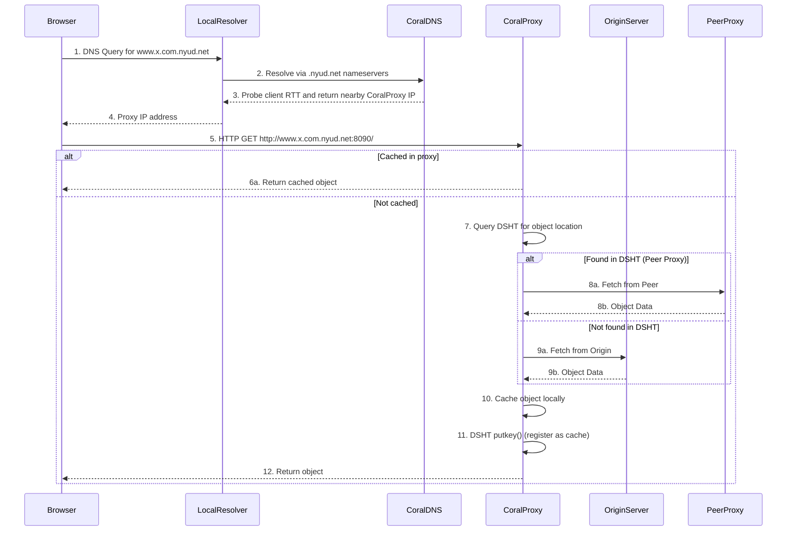

# L09c Content Delivery Networks

> [!summary] TL;DR
> Content Delivery Networks (CDNs) are globally distributed overlay networks of proxy servers designed to efficiently serve cached content to end-users.
> They improve web performance, reduce origin server load, and enhance availability by caching data close to clients.
> Modern systems leverage Distributed Hash Tables (DHTs) to organize content placement, using specialized techniques like sloppy storage (Coral) and consistent hashing with virtual nodes (Dynamo) to handle extreme scale, prevent metadata server overload, and ensure high availability even during network partitions.

## Learning outcomes

- Describe the motivation for deploying Content Delivery Networks (CDNs) and the problem of origin server overload.
- Explain the role of Distributed Hash Tables (DHTs) in building decentralized overlay networks.
- Compare traditional greedy key-based routing with Coral's distance halving algorithm.
- Analyze the tree saturation problem and how sloppy DHTs mitigate metadata server overload.
- Evaluate Dynamo's consistent hashing mechanism, including the use of virtual nodes for load balancing.
- Apply concepts of quorums, vector clocks, and hinted handoff to ensure high availability in Dynamo.

## Motivation and the problem

Hosting a popular web service requires scaling to meet massive global demand, which can be prohibitively expensive and technically challenging.
When a specific piece of content becomes highly popular suddenly (e.g., the "Slashdot effect"), an under-provisioned origin server can become overwhelmed with traffic, leading to degraded performance or complete failure.
Content Delivery Networks (CDNs) solve this by mirroring content to distributed proxy servers situated closer to end-users.
This offloads traffic from the origin server, improves latency for clients, and provides resilience against denial-of-service attacks by absorbing the traffic spike across a large, globally distributed infrastructure.

## Core concepts

### Distributed hash tables

<!-- coverage: L09c-01 -->
> [!note] Distributed Hash Table (DHT)
> A decentralized distributed system that provides a lookup service similar to a hash table: (key, value) pairs are stored in a DHT, and any participating node can efficiently retrieve the value associated with a given key.

CDNs often exploit DHT technology to manage the location of cached content across the internet.
Instead of relying on a centralized directory - which would become a massive bottleneck and a single point of failure - a DHT allows nodes to cooperatively maintain the routing table.
When a CDN needs to store a video, it uses the DHT to place the metadata (e.g., a hash of the file and the ID of the node storing it) so that clients from various geographic locations can independently discover and retrieve the content.
This fully decentralized approach is crucial for internet-scale systems.

### DHT details: key and node id space

<!-- coverage: L09c-02 -->
> [!note] Key and Node ID Space
> In a DHT, both the data identifiers (keys) and the participating proxy servers (nodes) are mapped into the same mathematical identifier space, typically using a consistent cryptographic hash function like SHA-1.

To store a file in a DHT-based CDN, the system generates a unique hash of the file's contents, producing a 160-bit key.
Simultaneously, each node in the network is assigned a unique ID (often the SHA-1 hash of its IP address) within the same 160-bit space.
The primary objective is to store the metadata tuple `<ContentHash, ContentNodeId>` at a node whose ID is numerically closest to the `ContentHash`.
This mathematical closeness allows nodes to navigate the namespace efficiently.
The DHT exposes two primary API calls: `putkey(ContentHash, ContentNodeId)` to insert the location of the cached content, and `getkey(ContentHash)` to retrieve the node ID hosting the content.

### CDN as an overlay network

<!-- coverage: L09c-03 -->
> [!note] Overlay Network
> A virtual network built on top of an existing physical network (like the internet), where nodes are connected by logical or virtual links rather than physical ones.

Because a DHT returns a node ID rather than a direct physical IP address, the CDN must operate as an overlay network.
At the user level, the CDN maintains routing tables that map these virtual node IDs to physical IP addresses.
A node does not need to know the entire network topology.
Instead, if a node wishes to send a request to a distant node ID, it routes the request to a friend node (a known neighbor) whose ID is closer to the destination.
This process repeats, routing the message through the virtual topology until it reaches the target, similar to how the IP network is an overlay on top of physical LANs.

### Traditional greedy key-based routing

<!-- coverage: L09c-04 -->
> [!note] Greedy Key-Based Routing
> A routing strategy where each node forwards a message to the neighbor in its routing table that is mathematically closest to the destination key, aiming to minimize the number of hops.

In a traditional DHT approach, when a node wants to place or retrieve a `<key, value>` pair, it selects the known node whose ID minimizes the distance to the key.
The system tries to jump to the destination as quickly as possible.
While this greedy approach minimizes the number of hops within the virtual network overlay, it creates significant bottlenecks.
If an item becomes intensely popular, all nodes across the network will greedily route requests toward the exact same metadata server responsible for that key, overwhelming both the server and the network paths leading to it.

### Tree saturation and the metadata server overload problem

<!-- coverage: L09c-05 -->
> [!warning] Pitfall: Tree Saturation
> Network congestion that forms a tree structure rooted at a highly targeted destination node.
> As traffic converges from multiple sources toward a single hot spot, the links nearest the destination become completely saturated.

When a piece of content goes viral, thousands of nodes might simultaneously perform `putkey` or `getkey` operations for the same key.
In a traditional greedy DHT, all these requests zero in on the single node whose ID is closest to the key.
This causes metadata server overload.
Furthermore, because the routing paths converge as they get closer to the destination, the intermediate network links near the destination become violently congested.
This tree saturation problem means that not only does the target node fail, but the surrounding network infrastructure is also severely degraded, affecting completely unrelated traffic that shares those links.

### Coral sloppy DHT

<!-- coverage: L09c-06 -->
> [!note] Sloppy DHT
> A variation of a DHT that intentionally avoids storing popular keys at the numerically closest node.
> Instead, it caches key/value pairs at intermediate nodes further away from the key to distribute load and prevent hot spots.

Coral CDN solves the metadata overload problem by deploying a Sloppy DHT.
Rather than forcing every `putkey` and `getkey` operation to reach the absolute closest node, Coral allows operations to be satisfied by nodes that are mathematically further apart from the key.
If an intermediate node already holds the data or is heavily loaded with requests for it, Coral will stop routing and cache the data there.
This naturally disperses the load over a wider area of the network, preventing any single metadata server from being crushed.
While this might increase the number of virtual hops, the common good of avoiding tree saturation far outweighs the slight latency penalty.

### Coral key-based routing with distance halving

<!-- coverage: L09c-07 -->
> [!note] Distance Halving
> Coral's routing algorithm intentionally progresses slowly, choosing the next hop such that the distance to the destination is cut by approximately half, rather than jumping as close to the target as possible.

Instead of the traditional greedy approach, Coral uses a non-greedy, rate-limited routing algorithm based on XOR distances.
When a node routes a request, it looks for a peer whose distance to the key is roughly half of its own distance.
By limiting the jump distance (correcting only a few bits at a time), requests from different parts of the network take longer, more distributed paths.
This deliberate slow progression ensures that requests for a popular key are scattered across numerous intermediate nodes, maximizing the chance that these nodes can serve as early caches and intercept subsequent requests before they reach the hot spot.

### Coral put and get

<!-- coverage: L09c-08 -->
> [!note] Full and Loaded States
> A Coral node is considered Full for a key if it stores the maximum allowed values for it.
> It is considered Loaded if it receives more than a maximum request rate for that key within a minute.

Coral's `putkey` operation operates in two phases.
In the forward phase, it routes towards the destination using distance halving.
If it hits an intermediate node that is either Full or Loaded, it infers that the path ahead is congested.
It then transitions to the retract phase, stepping back to the previous hop and storing the metadata there.
Similarly, the `getkey` operation slowly routes toward the destination.
Since `putkey` drops pointers along the way when congestion occurs, a `getkey` for popular content is highly likely to intercept a cached pointer at an intermediate node long before reaching the root metadata server.
This democratizes the load, safely absorbing flash crowds.

### Dynamo: consistent hashing with virtual nodes

<!-- coverage: L09c-09 -->
> [!note] Consistent Hashing
> A partitioning scheme where the output range of a hash function is treated as a fixed circular ring.
> Data and nodes are hashed onto the ring, and data is assigned to the first node encountered moving clockwise.

Dynamo is designed for an always writeable experience, requiring incremental scalability.
It uses consistent hashing to partition data across storage hosts.
To solve the problem of non-uniform data distribution and hardware heterogeneity in standard consistent hashing, Dynamo introduces virtual nodes.
Instead of mapping a physical server to a single point on the ring, Dynamo assigns each physical server multiple tokens (positions) on the ring.
A powerful server can be assigned more virtual nodes than a weaker one.
When a node is added or removed, it only affects the virtual nodes adjacent to it on the ring, minimizing data movement while perfectly balancing the load.

```text
          [ Token: A1 ]
        /               \
 [ Token: C2 ]       [ Token: B1 ]
      |                 |
 [ Token: B2 ]       [ Token: C1 ]
        \               /
          [ Token: A2 ]
```

### Dynamo: quorums, vector clocks, and hinted handoff

<!-- coverage: L09c-10 -->
> [!note] Hinted Handoff
> If a target node is temporarily down, Dynamo sends the replica to a healthy proxy node with a hint indicating the true destination.
> The proxy stores it temporarily and forwards it when the target recovers.

To achieve extreme availability, Dynamo sacrifices strong consistency for eventual consistency.
It uses a sloppy quorum system (R + W <= N, where updates are accepted even if some replicas are unreachable) and hinted handoff to ensure writes never fail.
Because writes are always accepted, divergent versions of data can emerge during network partitions.
Dynamo uses vector clocks (a list of node and counter pairs) to capture the causal history of an object.
If a read encounters conflicting versions (sibling objects), it returns all of them to the application.
The application - which understands the business logic, such as a shopping cart - merges these conflicts and writes back a unified version.

## Mechanisms step by step

Here is the step-by-step mechanism of a Coral CDN lookup:



## Worked examples

**Example 1: Coral Distance Halving**
Assume an XOR metric space of 160 bits, but for simplicity, we use a 5-bit space (0 to 31).
- Key K: 00100 (4)
- Source Node S: 01110 (14)
- XOR distance: S XOR K = 01110 XOR 00100 = 01010 (10).
- Halved distance: 10 / 2 = 5.
- Node S searches its routing table for a neighbor whose XOR distance to K is closest to 5.
- It finds Node A with ID 00000 (0).
- Distance A XOR K: 00000 XOR 00100 = 00100 (4).
- The new distance is 4.
- Halved distance: 4 / 2 = 2.
- Node A looks for a neighbor whose distance to K is closest to 2.
- It finds Node B with ID 00101 (5).
- Distance B XOR K: 00101 XOR 00100 = 00001 (1).
- The progression of distances to the key is exactly 10, then 4, then 1.
- This methodical halving prevents greedy tree saturation.

**Example 2: Dynamo Sloppy Quorum**
- Configuration: N=3 (replicas), W=2 (write quorum), R=2 (read quorum).
- A write arrives at the coordinator (Node A).
- Node A hashes the key and finds it belongs to nodes A, B, and C.
- Node C is temporarily down due to a network partition.
- Node A performs a hinted handoff, sending the replica intended for C to Node D.
- The write succeeds because W=2 nodes (A and B) acknowledged it.
- Node D acts as a temporary proxy for Node C.
- Total replicas written: 2 + 1 (hinted) = 3.
- Arithmetic holds.

## Comparison

| Feature | Traditional Greedy DHT | Coral Sloppy DHT | Dynamo |
| :--- | :--- | :--- | :--- |
| **Primary Goal** | Minimize lookup hops | Avoid tree saturation and hot spots | Always writeable high availability |
| **Routing Algorithm** | Jump to numerically closest ID | Distance halving (slow progression) | Zero-hop (full routing table at each node) |
| **Storage Placement** | Exactly at the closest node | Intermediate nodes (if path is loaded) | Coordinator and N-1 successors on the ring |
| **Consistency** | Strong (one location per key) | Soft-state (multiple cached copies) | Eventual (Vector clocks, read-time resolution) |
| **When to Use** | General lookup services without high skew | Open internet CDNs with viral flash crowds | Core backend services requiring zero downtime |

## Paper deep dives

- [MapReduce: Simplified Data Processing on Large Clusters](../Papers/L09-MapReduce.md)
  MapReduce provides a programming model and an associated implementation for processing and generating large data sets.
  Users specify a map function that processes a key/value pair to generate a set of intermediate key/value pairs, and a reduce function that merges all intermediate values associated with the same intermediate key.

- [Lessons from Giant-Scale Services](../Papers/L09-Giant-Scale-Services.md)
  This paper reflects on the engineering challenges of building giant-scale internet services like Google and Yahoo.
  It highlights that at immense scale, component failures are the norm rather than the exception.
  It argues for designing software architectures that gracefully tolerate hardware failures, utilize commodity components, and prioritize availability and graceful degradation over absolute consistency.

- [Web Search for a Planet: The Google Cluster Architecture](../Papers/L09-Web-Search-for-a-Planet.md)
  Google's architecture leverages clusters of inexpensive commodity PCs to achieve high performance and fault tolerance for web search.
  By distributing the search index across thousands of machines, the system can execute parallel queries with minimal latency, handling hardware failures seamlessly through software-level replication and redundancy.

- [Democratizing Content Publication with Coral](../Papers/L09-Coral.md)
  Coral is a decentralized peer-to-peer CDN that enables publishers to serve massive audiences using only basic broadband.
  By utilizing a sloppy DHT and distance-halving routing, Coral allows nodes to cache content naturally along routing paths.
  This prevents metadata server overload and democratizes content distribution without requiring expensive commercial CDN contracts.

- [Dynamo: Amazon's Highly Available Key-value Store](../Papers/L09-Dynamo.md)
  Dynamo was built to satisfy Amazon's strict requirements for high availability and low latency, specifically targeting a fully decentralized, always-on data store for critical services like shopping carts.
  It synthesizes several techniques: consistent hashing with virtual nodes for partitioning, vector clocks for versioning, and quorum-like hinted handoffs to ensure updates are never rejected, pushing conflict resolution to the application on read.

- [Unraveling the Web Services Web: An Introduction to SOAP, WSDL, and UDDI](../Papers/L09-Web-Services-SOAP-WSDL-UDDI.md)
  This paper details the foundational XML-based protocols that standardized web services.
  SOAP provides the messaging framework, WSDL offers an XML format for describing network services, and UDDI acts as the registry for businesses to list themselves on the internet.

- [The Next Step in Web Services](../Papers/L09-Next-Step-in-Web-Services.md)
  This paper explores the evolution of web services beyond basic SOAP/WSDL, focusing on higher-level compositions, orchestration, and the shift towards service-oriented architectures (SOA) that enable complex, cross-organizational business processes over the web.

## Modern descendants

The principles laid out in Coral and Dynamo have deeply influenced modern distributed systems.
Dynamo's consistent hashing, vector clocks, and eventual consistency gave rise to a whole generation of NoSQL databases.
Apache Cassandra and Riak are direct descendants that implement Dynamo's ring topology, tunable quorums, and hinted handoffs.
Amazon's own DynamoDB is a managed cloud evolution of this system.
Coral's overlay and caching concepts are mirrored in modern peer-to-peer content distribution like IPFS (InterPlanetary File System), which uses Kademlia-based routing and distributes load across a decentralized swarm.
Similarly, commercial CDNs like Cloudflare and Akamai employ massive distributed proxy architectures to absorb DDoS attacks and slashdot effects, functioning structurally similar to the global edge network Coral proposed.

## Pitfalls and exam traps

> [!warning] Exam Trap: Dynamo vs. Traditional Databases
> Do not confuse Dynamo's consistency model with ACID databases.
> Dynamo provides Eventual Consistency.
> If an exam question asks what happens during a network partition, remember that Dynamo always accepts writes.
> It will hand off the write to a proxy (hinted handoff) rather than rejecting the write, causing temporary inconsistency.

> [!warning] Exam Trap: Conflict Resolution in Dynamo
> Remember who resolves conflicts in Dynamo.
> While Dynamo can fall back to a last-write-wins strategy, the primary design pushes conflict resolution to the application (e.g., the shopping cart service) during a read operation.
> The application receives sibling versions with vector clocks and merges them.

> [!warning] Exam Trap: Coral Routing
> Do not assume Coral routes to the exact closest node.
> The entire point of Coral's Sloppy DHT is to stop routing when it finds a loaded intermediate node, caching the data further away from the mathematical key to prevent tree saturation.

## Practice

- [Practice L09](../Practice/Practice-L09.md)

## Lab

- [lab-21-dht](../labs/lab-21-dht/README.md): DHTs: consistent hashing, key-based routing, Coral sloppy DHT, Dynamo quorums

## Further reading

- [Kademlia: A Peer-to-peer Information System Based on the XOR Metric](https://pdos.csail.mit.edu/~petar/papers/maymounkov-kademlia-lncs.pdf)
- [Cassandra - A Decentralized Structured Storage System](https://www.cs.cornell.edu/projects/ladis2009/papers/lakshman-ladis2009.pdf)
