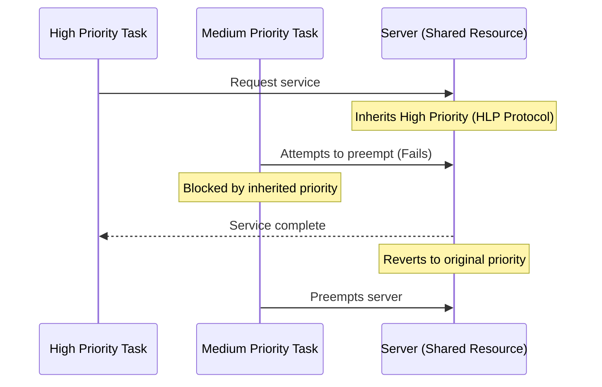
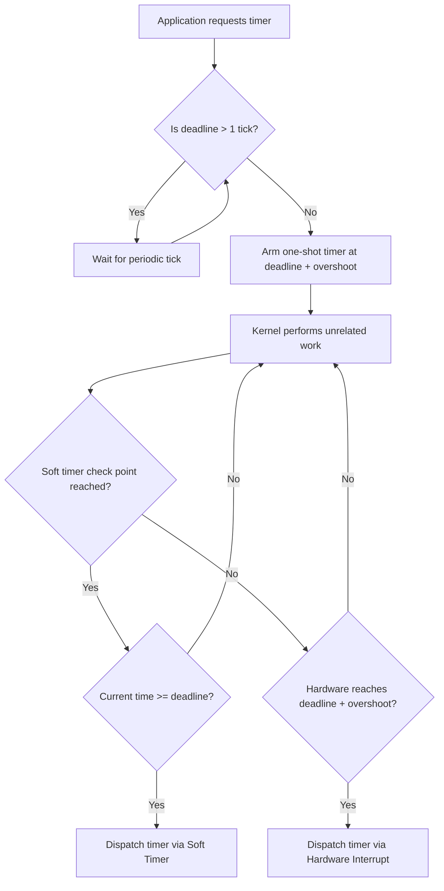

# L10a TS-Linux

> [!summary] TL;DR
> Time-Sensitive Linux (TSL) modifies a commodity operating system to support the strict timing constraints of multimedia and soft real-time applications without crippling the throughput of traditional tasks.
> It achieves this by combining high-precision firm timers, fine-grained kernel preemptibility, and proportion-period CPU scheduling with priority inheritance.
> For virtualized environments, a feed-forward synchronization architecture (like RADclock) provides a dependent clock paradigm, ensuring consistent time across virtual machines and allowing seamless live migration.
> Together, these techniques dramatically reduce latency and jitter for time-sensitive workloads.

## Learning outcomes

- Differentiate between the needs of time-sensitive applications and throughput-oriented applications.
- Identify the three primary sources of kernel latency: timer resolution, preemption latency, and scheduling latency.
- Explain how firm timers combine the advantages of one-shot timers and soft timers while mitigating their overhead.
- Analyze how fine-grained kernel preemptibility reduces the size of non-preemptible sections in the kernel.
- Evaluate the mechanisms used to resolve priority inversion, specifically the highest locking priority protocol.
- Compare dependent and independent clock paradigms for timekeeping in virtualized environments like Xen.

## Motivation and the problem

Commodity operating systems have historically been designed to maximize overall system throughput, often at the expense of precise, low-latency responsiveness.
Time-sensitive applications, such as soft modems, audio/video synchronization tools, and high-frequency trading platforms, require resources to be allocated at exact moments with minimal jitter.
When a commodity OS relies on coarse-grained periodic timers and non-preemptible kernel paths, time-sensitive applications experience severe latency spikes, causing dropped frames or broken audio.
Furthermore, in virtualized environments, clock synchronization algorithms like NTP struggle with variable delays induced by the hypervisor and power management, making features like live migration severely disruptive to guest OS timekeeping.

## Core concepts

### Time-sensitive versus throughput-oriented applications

<!-- coverage: L10a-01 -->
> [!note] Definition: Time-Sensitive Application
> An application driven by real-world demands that possesses strict timing constraints (e.g., periodic execution with low jitter) which must be satisfied for correct operation.

Time-sensitive applications prioritize predictability, responsiveness, and low latency over raw computational volume.
For instance, an audio playback tool needs guaranteed CPU access every few milliseconds to prevent buffer underruns, even if the total processing time required is tiny.
In contrast, throughput-oriented applications, such as large file compilations or batch data processing, aim to complete massive amounts of work as quickly as possible.
They benefit from large scheduling quantums and coarse timers, which minimize context-switching overhead.
The core challenge in modern OS design is accommodating both paradigms simultaneously, ensuring that background batch tasks do not monopolize the system or cause latency spikes that disrupt soft real-time applications.

### Sources of latency: timer, preemption, scheduler

<!-- coverage: L10a-02 -->
> [!note] Definition: Kernel Latency
> The time elapsed between a wall-clock event (when an application should execute) and its actual activation (when the application does execute).

Kernel latency is composed of three distinct sources that must all be minimized to guarantee responsiveness.
Timer latency arises from the resolution of the system's hardware timers; if a timer ticks every 10 ms, an event occurring immediately after a tick will be delayed by up to 10 ms before the kernel even notices it.
Preemption latency occurs when the kernel is executing a critical section with interrupts disabled or preemption locked, forcing the newly awakened task to wait until the current task yields.
Scheduling latency is the time the CPU scheduler takes to select the awakened task and perform the context switch.
Why does this matter?
Because fixing only one source is insufficient.
An infinitely precise timer is useless if the kernel cannot be preempted to process the timer interrupt.

### Periodic timers, one-shot timers, and soft timers

<!-- coverage: L10a-03 -->
> [!note] Definition: Soft Timers
> A timing mechanism that polls for expired timers at strategic, low-overhead points in the kernel (e.g., system call returns) rather than relying exclusively on hardware interrupts.

Periodic timers generate interrupts at fixed intervals, providing a predictable but coarse resolution.
To improve accuracy without generating a massive number of interrupts, systems can use one-shot timers, which are explicitly programmed to fire exactly at the next needed deadline.
However, one-shot timers incur significant overhead from constant reprogramming and asynchronous interrupt handling, which pollutes the CPU cache.
Soft timers mitigate this by checking for expired timers voluntarily when the kernel is already transitioning states, such as returning from an interrupt or exception.
This amortizes the cost of the check since the cache is likely already disrupted.
By understanding these three mechanisms, system designers can navigate the trade-off between timing accuracy and interrupt overhead.

| Timer Type | Strengths | Weaknesses |
| :--- | :--- | :--- |
| Periodic | Low overhead, simple data structures. | Coarse resolution, high latency. |
| One-shot | High precision, exact wakeups. | High interrupt overhead, expensive reprogramming. |
| Soft | Low interrupt overhead, efficient cache usage. | Potential for late wakeups if polling events are rare. |

### Firm timers and overshoot

<!-- coverage: L10a-04 -->
> [!note] Definition: Firm Timers
> A hybrid timer implementation combining one-shot timers, soft timers, and periodic timers, regulated by an overshoot parameter to balance accuracy and overhead.

Firm timers achieve high precision with low overhead by leveraging the strengths of multiple timer types.
For events far in the future, they rely on efficient periodic timers.
As the deadline approaches within a single tick, they switch to a high-resolution one-shot timer.
To avoid the interrupt penalty of one-shot timers, firm timers employ soft timers.
They use a global overshoot parameter: the one-shot timer is deliberately programmed to fire slightly after the actual deadline.
Why use an overshoot?
Because it gives the soft timer mechanism a window of opportunity to discover and process the expired timer during regular kernel transitions.
If a soft timer point is reached during this overshoot window, the timer is handled without an asynchronous interrupt.
If no soft timer point is reached, the one-shot timer fires as a fail-safe, bounding the maximum latency.

```text
Time-line of Firm Timer execution:
|------- Normal tick -------|--- Overshoot window ---|
                            ^                        ^
                         Deadline              Hardware Fire
                      (Task is ready)        (Interrupt occurs)
                      
   * If a soft timer check happens inside the overshoot window, the interrupt is avoided.
```

### Reducing kernel preemption latency

<!-- coverage: L10a-05 -->
> [!note] Definition: Fine-Grained Kernel Preemptibility
> An OS design where kernel code can be preempted at almost any time, except when explicitly holding a spinlock to protect shared data structures.

Standard commodity kernels often execute entire system calls or interrupt handlers atomically, leading to preemption latencies exceeding 30 to 100 ms during heavy I/O.
To reduce this, developers can insert explicit preemption points (yielding the CPU manually) or adopt fine-grained kernel preemptibility.
In a preemptible kernel, preemption is only disabled when critical shared state is protected by locks.
However, if a lock is held for a massive data copy, latency spikes again.
The ultimate solution, utilized by TSL, is lock-breaking: strategically releasing and reacquiring spinlocks during long operations.
This limits the maximum time a non-preemptible section executes.
Why is this critical?
Because it ensures that when a firm timer wakes up a time-sensitive task, the kernel can immediately context-switch to it, translating timer precision into actual application responsiveness.

### Proportional period scheduling

<!-- coverage: L10a-06 -->
> [!note] Definition: Proportion-Period Scheduling
> A scheduling model that allocates a specific percentage of CPU time (proportion) over a defined recurring interval (period) to guarantee temporal protection.

While assigning the highest priority to a time-sensitive task ensures it runs quickly, it risks starving the entire system if the task misbehaves or loops infinitely.
Proportion-period scheduling solves this by offering temporal protection.
A task specifies its required period (e.g., it needs to process data every 16 ms) and its proportion (e.g., it needs 10 percent of the CPU).
The scheduler guarantees this allocation.
Once the task exhausts its reserved time slice within the period, it is preempted or downgraded to a background priority, allowing throughput-oriented tasks to run.
This enforces strict isolation.
Why is this model preferred for mixed workloads?
It allows an OS to seamlessly run multimedia players, soft modems, and heavy background compilations without any single workload fatally compromising the others.

### Priority-based scheduling and priority inversion

<!-- coverage: L10a-07 -->
> [!note] Definition: Priority Inversion
> A scenario where a high-priority task is indirectly preempted by a lower-priority task because they share a resource, violating expected scheduling behavior.

When using a fixed-priority scheduler, interdependent tasks can break the scheduling logic.
For example, if a high-priority video player needs the X display server to render a frame, but the X server runs at a lower priority, a medium-priority background task can preempt the X server.
This stalls the high-priority video player indefinitely.
TSL addresses this using the Highest Locking Priority (HLP) protocol, a variant of priority inheritance.
When a server task (like the X server) acquires a shared resource or handles a request, it temporarily inherits the highest priority of any client accessing it.
This ensures the server is not preempted by medium-priority tasks, bounding the blocking time for the high-priority client.



### Supporting time-sensitive tasks alongside throughput tasks

<!-- coverage: L10a-08 -->
> [!note] Definition: Mixed Workload Environment
> An operating system context where strict soft real-time tasks (like audio playback) coexist seamlessly with heavy batch processing (like compiling or file copying).

The synthesis of accurate timers, a preemptible kernel, and advanced scheduling allows an OS to handle mixed workloads effectively.
In TSL, fixed-priority tasks are scheduled in the background with respect to proportion-period tasks, providing a predictable hierarchy.
However, shared servers executing under the HLP protocol become an exception, potentially running at the highest priority to resolve inversions.
To prevent these trusted servers from destroying the proportion-period guarantees, their execution time must be strictly bounded.
When these elements are tuned correctly, a commodity OS can serve video frames with sub-millisecond jitter while simultaneously copying gigabytes of data over a file system, proving that strict isolation between time-sensitive and throughput-oriented tasks is achievable.

### Virtualize everything but time: clock synchronization in VMs

<!-- coverage: L10a-09 -->
> [!note] Definition: Dependent Clock Paradigm
> An architecture where only the host machine (or privileged domain) runs a full synchronization algorithm, while guest VMs stateless-ly derive their time from the host.

In a virtualized environment, using an independent clock paradigm (where each guest OS runs its own NTP daemon) leads to disaster.
Virtualization introduces variable latencies, CPU multiplexing, and power management sleep states, which destabilize NTP's feedback loops and cause massive timing errors.
To fix this, systems use a dependent clock paradigm powered by a feed-forward algorithm like RADclock.
The privileged domain (Dom0) synchronizes with external servers and writes the calculated clock parameters to a shared memory space (e.g., XenStore).
Guest domains (DomU) execute a stateless read of these parameters to convert raw hardware counter ticks into absolute time.
This eliminates redundant network polling and ensures every VM on the host shares a perfectly synchronized, highly robust notion of time.

## Mechanisms step by step

The execution of a firm timer relies on the interplay of hardware interrupts and software polling.

1. Schedule: An application requests a wakeup at a specific microsecond.
2. The kernel calculates if the deadline is far away or imminent.
3. Long-term wait: If the deadline is beyond the next periodic tick, the kernel enqueues a standard periodic timer.
4. Short-term arming: Once within the current tick, the kernel arms the one-shot APIC timer.
5. Crucially, it sets the timer to fire at the deadline plus the overshoot value.
6. Soft poll (Success Case): The kernel handles a completely unrelated system call.
7. During the return-to-user path, it checks the soft timer queue.
8. If the current time is past the deadline (but before the deadline plus overshoot), the timer is dispatched immediately without an interrupt.
9. Hard fire (Fallback Case): If the kernel is entirely idle, the deadline plus overshoot time is reached, and the APIC hardware generates a physical interrupt to enforce the boundary.



## Worked examples

**Firm Timer Overshoot Calculation**

Consider a time-sensitive task that requests a timer expiration at $T = 5000\ \mu\text{s}$.
The system administrator has configured a firm timer overshoot of $50\ \mu\text{s}$.
1. The kernel arms the one-shot APIC timer to generate a hardware interrupt at $T_{hw} = 5050\ \mu\text{s}$.
2. At $T = 5010\ \mu\text{s}$, a background task completes a system call.
3. During the return-to-user transition, the kernel executes a soft timer check.
4. The soft timer subsystem sees that current time ($5010\ \mu\text{s}$) $\ge$ deadline ($5000\ \mu\text{s}$).
5. The timer is dispatched.
6. The hardware interrupt originally scheduled for $5050\ \mu\text{s}$ is canceled.
Arithmetic check: Latency is $5010 - 5000 = 10\ \mu\text{s}$.
No hardware interrupt was fired, saving CPU context switch overhead, while maintaining a strict $50\ \mu\text{s}$ worst-case latency bound.

**Proportion-Period Allocation**

A soft modem task requires $4\text{ ms}$ of computation every $16\text{ ms}$.
1. Proportion is $4 / 16 = 25\%$.
2. If the task begins at $T = 0$, it is guaranteed $4\text{ ms}$ of CPU time by $T = 16$.
3. If a trusted shared server causes a blocking time of $1\text{ ms}$, the available unreserved CPU time must be evaluated.
4. The admission test requires $\sum P_i + \text{blocking factor} \le 1$.
5. If total CPU utilization is kept to a safe threshold (e.g., $90\%$), the task will meet its deadline despite the inversion.

## Comparison

| Feature | Standard Commodity OS (e.g., legacy Linux) | Real-Time OS (RTOS) | Time-Sensitive Linux (TSL) |
| :--- | :--- | :--- | :--- |
| **Timer Resolution** | Coarse (typically 1 to 10 ms based on periodic ticks). | Very high (microsecond level). | High (microsecond level via firm timers). |
| **Kernel Preemptibility** | Non-preemptible (monolithic execution of syscalls). | Fully preemptible. | Fine-grained preemptibility with lock-breaking. |
| **Throughput Impact** | Excellent (minimal interrupt overhead). | Poor (cache thrashing from interrupts). | Good (soft timers mitigate interrupt overhead). |
| **Scheduling Model** | Fairness and heuristics (CFS). | Strict priority. | Proportion-period and Priority with HLP. |
| **Best Use Case** | Web servers, batch processing, heavy I/O. | Embedded systems, avionics, robotics. | Desktop multimedia, soft modems, generic mixed workloads. |

## Paper deep dives

- [Supporting Time-Sensitive Applications on a Commodity OS](../Papers/L10-Time-Sensitive-Commodity-OS.md): This paper details the architecture of Time-Sensitive Linux (TSL), demonstrating that supporting multimedia and soft real-time applications requires a triad of solutions involving firm timers, fine-grained kernel preemptibility, and proportion-period scheduling. By combining soft timers with one-shot APIC timers, TSL heavily reduces the overhead associated with traditional high-resolution timers, ensuring throughput tasks are not crippled.
- [Virtualize Everything but Time](../Papers/L10-Virtualize-Everything-but-Time.md): This paper explores the catastrophic effects of virtual machine migration on standard feedback-based clock synchronization algorithms like NTP. It proposes a feed-forward synchronization architecture using the RADclock algorithm, where a privileged domain calculates clock parameters and guest domains use a stateless read function to compute time. This dependent clock paradigm successfully eliminates the massive multi-second timing shocks normally experienced during live VM migration.
- [Persistent Temporal Streams](../Papers/L10-Persistent-Temporal-Streams.md): Covers mechanisms for streaming sensor data and managing bounded latency in networked environments (see dedicated note for details).
- [Yima: A Second-Generation Continuous Media Server](../Papers/L10-Yima.md): Explores scalable architectures for serving continuous media with strict timing constraints across distributed nodes (see dedicated note for details).

## Modern descendants

The push for low latency in commodity kernels has become mainstream.
The `PREEMPT_RT` patchset, which makes Linux almost fully preemptible by converting spinlocks to mutexes and threading interrupt handlers, is being progressively merged into the mainline Linux kernel.
Modern Linux utilizes the Completely Fair Scheduler (CFS) and its successor EEVDF (Earliest Eligible Virtual Deadline First), which provide excellent latency bounds for interactive tasks without requiring explicit proportion-period reservations.
For virtualization, para-virtualized clocks (like `kvm-clock`) have become the standard.
They allow the hypervisor to inject clock parameters directly into the guest OS memory, conceptually mirroring the stateless, dependent clock paradigm advocated by RADclock.

## Pitfalls and exam traps

> [!warning] Exam Trap: Assuming one solution fixes latency
> You cannot fix kernel latency by simply installing a high-resolution timer.
> If the kernel remains non-preemptible, the high-resolution timer interrupt will fire, but the scheduler will not be able to switch tasks until the critical section completes.
> All three pillars involving timers, preemption, and scheduling are strictly required.

> [!warning] Exam Trap: NTP and VM Migration
> Do not assume that running NTP inside a virtual machine provides robust time.
> When a VM undergoes live migration, the underlying hardware oscillator changes, and the VM is paused during the final memory copy phase.
> NTP's stateful feedback loop violently miscalculates these sudden jumps, leading to massive clock skew.
> A stateless, feed-forward clock is necessary for stable migration.

> [!warning] Pitfall: Soft Timers and Idle Systems
> Soft timers rely on the kernel performing transitions (like syscalls) to opportunistically check for expired timers.
> If a system is completely idle, there are no transitions, and a pure soft timer would never fire.
> This is why firm timers use a hardware one-shot timer as a fail-safe backstop.

## Practice

- [Practice L10](../Practice/Practice-L10.md)

## Lab

- [lab-22-realtime](../labs/lab-22-realtime/README.md): Timeliness on Linux: cyclictest, SCHED_FIFO and SCHED_DEADLINE, timers

## Further reading

- [Real-Time Linux Collaborative Project (PREEMPT_RT)](https://wiki.linuxfoundation.org/realtime/start)
- [The RADclock Project](http://www.cubinlab.ee.unimelb.edu.au/radclock/)
