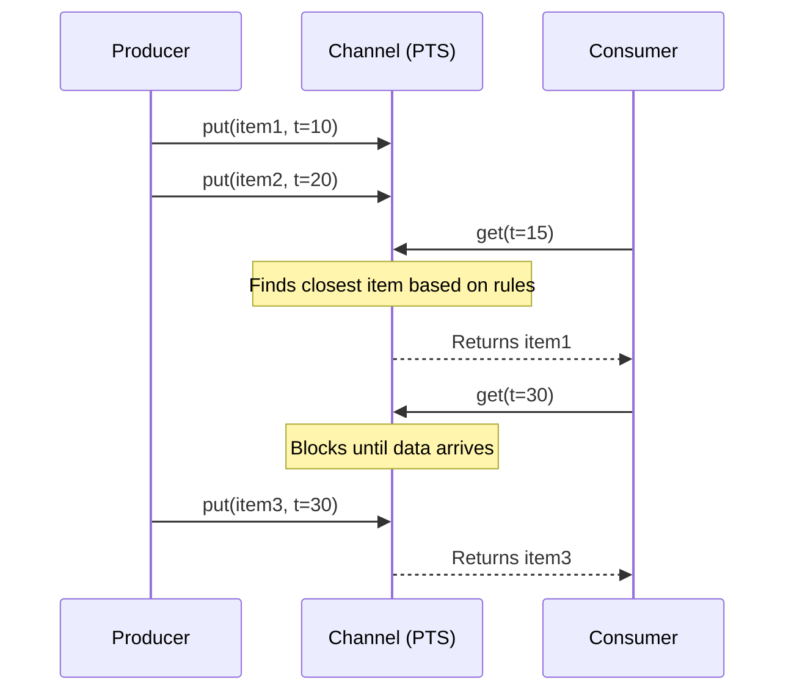

# L10b Persistent Temporal Streams

> [!summary] TL;DR
> Persistent Temporal Streams (PTS) provides a programming model and middleware for situation awareness applications that process live, time-indexed data.
> It introduces channels with time-based get and put operations, handling persistence and garbage collection automatically.
> Yima complements this as a continuous media server using pseudorandom block placement and bipartite architecture to scale seamlessly and synchronize multiple real-time streams.

## Learning outcomes

- Explain the motivation for the PTS programming model in situation awareness applications.
- Contrast time-based get and put semantics with traditional stream processing mechanisms.
- Describe the SCADDAR pseudorandom data placement algorithm used in Yima.
- Evaluate the scalability benefits of bipartite architectures in continuous media servers.
- Compute the percentage of block movements required when scaling a Yima storage cluster.

## Motivation and the problem

Traditional stream processing paradigms treat data as ephemeral, flowing from producer to consumer and then disappearing.
Situation awareness applications, such as large-scale surveillance or environmental monitoring, require more than just passing data along.
They need the ability to look back in time, correlate streams from multiple independent sensors, and handle variable data rates without losing synchronization.
Manually managing temporal correlations, buffering, and garbage collection in application code leads to fragile and complex systems.
The problem is how to provide an abstraction that handles continuous, time-indexed data with built-in persistence and correlation.

## Core concepts

### Situation awareness applications

<!-- coverage: L10b-01 -->
Situation awareness applications involve the continuous monitoring and analysis of environments through distributed sensors.
These applications ingest live streams of data - such as video feeds, audio, or temperature readings - to detect events and inform decision-making in real-time.
Because events unfold over time, applications must analyze data not just at the present moment, but over a temporal window.
They require a robust middleware that can store streaming data temporarily and allow historical queries without burdening the application logic with buffer management.

> [!note] Situation Awareness
> The perception of environmental elements and events with respect to time or space, the comprehension of their meaning, and the projection of their future status.

### Programming model challenges for live streams

<!-- coverage: L10b-02 -->
Programming applications that consume live streams involves significant challenges regarding synchronization and state management.
When multiple streams arrive at different rates or experience variable network delays, correlating their data points temporally becomes difficult.
Developers usually have to implement custom buffering, time-stamping, and synchronization logic.
Additionally, handling the transition of data from active memory to persistent storage and eventually discarding old data (garbage collection) requires complex, low-level coding.

### PTS programming model: channels and time-indexed items

<!-- coverage: L10b-03 -->
The Persistent Temporal Streams (PTS) model abstracts continuous media into "channels" containing "time-indexed items".
A channel represents a stream of data from a single source, where every data item is explicitly tagged with a temporal index (timestamp) reflecting when it was generated.
This abstraction decouples the generation of data from its consumption.
Consumers can access items based on their timestamps rather than just their order of arrival, enabling precise temporal queries and correlation across multiple channels.

### Time-based get and put

<!-- coverage: L10b-04 -->
Instead of traditional blocking reads or asynchronous callbacks, PTS provides get(time) and put(item, time) operations.
A producer uses put to insert an item into the channel with its specific timestamp.
A consumer uses get(time) to request the item that was active or closest to the specified time.
If the requested time is in the future, the get operation blocks until the data becomes available.
If it is in the past, the middleware retrieves it from its persistent buffer.
This simplifies the application by pushing the temporal synchronization burden down into the middleware.

### Persistence and garbage collection

<!-- coverage: L10b-05 -->
PTS channels are inherently persistent for a defined window of time.
The middleware automatically buffers items in memory and on disk, allowing consumers to rewind and examine recent history.
To prevent unbounded storage growth, PTS employs automatic garbage collection based on time bounds.
An application specifies a temporal window (e.g., "keep data for the last 5 minutes"), and the middleware transparently discards items whose timestamps fall outside this window, ensuring predictable memory and disk usage.

### Bundling streams and temporal correlation

<!-- coverage: L10b-06 -->
In many applications, insights are derived by analyzing multiple streams simultaneously, such as combining a video feed with an audio feed or multiple camera angles.
PTS supports "bundling", where multiple channels are logically grouped together.
Consumers can then issue a bundled get(time) to retrieve a synchronized set of items from all bundled channels at the exact same temporal index.
The middleware handles the complex buffering and alignment required to ensure that the retrieved items are perfectly correlated in time.

### Continuous media servers (Yima)

<!-- coverage: L10b-07 -->
Yima is a continuous media server designed for the high-performance delivery of isochronous streams like video and audio.
It addresses the challenge of scaling multimedia delivery by using a bipartite architecture that separates client interactions from data storage nodes.
Yima relies on a pseudorandom data placement algorithm called SCADDAR across multiple independent disks.
This ensures that the load is perfectly balanced across all disks without needing a central metadata directory, avoiding a single point of failure and allowing the system to scale seamlessly.

## Mechanisms step by step

The SCADDAR block placement algorithm in Yima works in steps to organize data and serve clients smoothly.

> [!note] Yima Data Retrieval Workflow
> 1. Client connects to any server node's RTSP module (acting as the controller).
> 2. The client requests a media file.
> 3. The server computes the pseudorandom locations of the file's data blocks across all cluster nodes using the SCADDAR algorithm seeded by the file ID.
> 4. All nodes independently retrieve their assigned blocks and stream them via RTP directly to the client.
> 5. The client uses a multithreshold buffer to issue speedup/slowdown commands (delta-p) to regulate flow.

## Worked examples

**Yima SCADDAR Block Reorganization**
When adding a new disk to a Yima cluster, data blocks must be reorganized to maintain load balance, but we want to minimize data movement.
Suppose a cluster has N = 4 disks, and each disk currently holds 1000 blocks (total 4000 blocks).
We add a new disk, making N = 5.
To maintain perfect load balancing, each of the 5 disks must hold 4000 / 5 = 800 blocks.
With round-robin striping, almost every block changes its absolute index location mod(5), forcing nearly 100 percent of blocks to move.
With SCADDAR's pseudorandom placement, the target state requires exactly 1/5 (20 percent) of the total blocks to move to the new disk.
The number of blocks moved is 4000 * (1 / 5) = 800 blocks.
The 4 original disks each keep 800 blocks and send 200 blocks to the new disk.
This is optimal and minimizes the I/O cost of scaling the cluster online.

**PTS Garbage Collection Window**
Assume a PTS channel has a garbage collection window W = 300 seconds.
A producer generates video frames at a constant rate of 30 frames per second.
The channel holds 300 * 30 = 9000 frames.
If the current time index is T = 1000, any frame with a timestamp t <= 700 is eligible for garbage collection.
If the consumer asks for get(650), the channel will return an error or null, as the data has been purged.

## Comparison

| Feature | Round-Robin Placement | Pseudorandom Placement (SCADDAR) |
| :--- | :--- | :--- |
| **Load Balancing** | Excellent, deterministic block access. | Excellent, probabilistically even distribution. |
| **Scaling Cost** | High. Adding a disk requires relocating almost all blocks. | Low. Only 1/(N+1) of data moves when adding a disk. |
| **Metadata Size** | Minimal (just start block). | Minimal (just the random seed). |
| **Multiple Delivery Rates** | Requires specific block sizes to match zones. | Naturally adapts to different transfer rates and multi-zoned disks. |

| Feature | Traditional Socket Streams | Persistent Temporal Streams (PTS) |
| :--- | :--- | :--- |
| **Data Access** | Sequential read/write. | Time-indexed get(t) and put(item, t). |
| **Persistence** | None, explicitly managed by app. | Built-in windowed persistence and garbage collection. |
| **Correlation** | Application must buffer and align. | Handled automatically via channel bundling. |

## Paper deep dives

- [Supporting Time-Sensitive Applications on a Commodity OS](../Papers/L10-Time-Sensitive-Commodity-OS.md)
This paper explores how to modify commodity operating systems to support real-time and time-sensitive applications.
It demonstrates mechanisms to provide predictable scheduling and minimize latency without requiring a hard real-time operating system, allowing multimedia applications to run efficiently on standard kernels.

- [Virtualize Everything but Time](../Papers/L10-Virtualize-Everything-but-Time.md)
This paper discusses the challenges of virtualization for time-sensitive applications.
While CPU, memory, and I/O can be virtualized effectively, virtualizing the passage of time distorts scheduling and event handling for real-time applications.
The authors argue for exposing true physical time to guest operating systems to maintain temporal accuracy.

- [Persistent Temporal Streams](../Papers/L10-Persistent-Temporal-Streams.md)
This paper introduces the PTS programming model, designed specifically for situation awareness applications.
It details the architecture of time-indexed channels, time-based get and put operations, and built-in garbage collection, demonstrating how moving temporal synchronization to the middleware drastically simplifies application development.

- [Yima: A Second-Generation Continuous Media Server](../Papers/L10-Yima.md)
This paper details the architecture of Yima, emphasizing its bipartite, multinode design and the SCADDAR pseudorandom data placement algorithm.
It highlights how Yima achieves high scalability, fault tolerance, and precise multistream synchronization for continuous media delivery over IP networks, improving upon master-slave architectures.

## Modern descendants

Modern distributed event streaming platforms like Apache Kafka share the concept of persistent, append-only logs of immutable events.
While Kafka relies on offset-based retrieval rather than explicit time-based get(t) operations by default, its time-index capabilities and windowed streams (e.g., in Kafka Streams) directly descend from the need to manage persistent streams and temporal correlations.
Systems like InfluxDB and Prometheus are heavily optimized for storing and retrieving time-indexed data points, handling the persistence, garbage collection (retention policies), and temporal alignment that PTS pioneered for continuous media.
Yima's pseudorandom data placement and its goal of minimizing data movement when scaling disks conceptually parallel the consistent hashing mechanisms used in Dynamo, Cassandra, and other scalable key-value stores to minimize data redistribution when adding or removing nodes.

## Pitfalls and exam traps

> [!warning] Exam Trap: SCADDAR vs Metadata
> A common misconception is that random block placement requires massive central metadata to store the location of every block.
> SCADDAR is pseudorandom, meaning it uses a predictable seed to compute block locations mathematically on the fly, entirely eliminating the need for per-block metadata.

> [!warning] Exam Trap: Yima Bipartite Architecture
> Do not confuse Yima-1's master-slave design with Yima-2's bipartite design.
> In Yima-2, all nodes act as independent peers streaming directly to the client, effectively removing the master node bottleneck present in Yima-1.

## Practice

- [Practice L10](../Practice/Practice-L10.md)

## Lab

- [lab-23-temporal-streams](../labs/lab-23-temporal-streams/README.md): A time-indexed stream store and clock synchronization

## Further reading

- [Apache Kafka Documentation on Time-Based Searching](https://kafka.apache.org/documentation/#upgrade_10_1_0)
- [Consistent Hashing and Random Trees](https://dl.acm.org/doi/10.1145/258533.258660)
