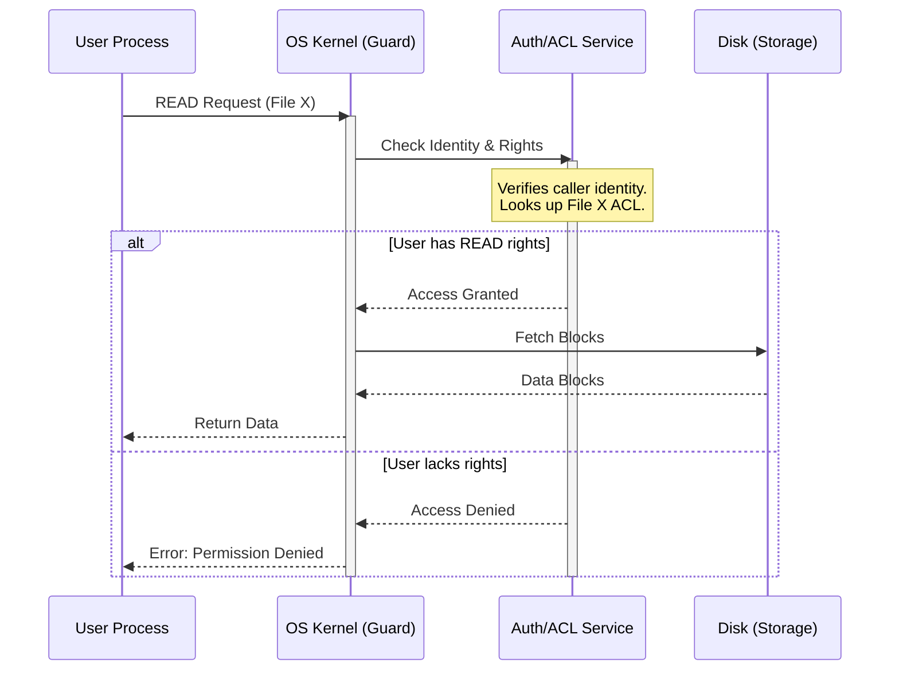

# L11a Principles of Information Security

> [!summary] TL;DR
> Information security in operating systems relies on a structured approach to controlling access to shared resources.
> By distinguishing between privacy, security, and protection, architects can design robust boundaries that restrict unauthorized release, modification, and denial of use.
> Applying core design principles like least privilege, complete mediation, and fail-safe defaults minimizes the attack surface.
> Key implementations contrast capabilities, which are unforgeable tickets for objects, with access control lists, which associate permissions directly with the objects.

## Learning outcomes

- Differentiate between privacy, security, and protection in the context of computer systems.
- Identify the three primary security concerns and provide examples of each vulnerability.
- Evaluate the eight design principles of information security to identify flaws in an architecture.
- Calculate the work factor for password-based or key-based security systems.
- Compare and contrast capabilities and access control lists for enforcing protection.

## Motivation and the problem

Modern computer systems inherently multiplex shared hardware and software resources among multiple concurrent users and programs.
Whenever resources are shared, the system must enforce strict isolation and controlled sharing to prevent malicious or accidental interference.
The fundamental problem is designing a protection infrastructure that grants legitimate access dynamically while rejecting unauthorized actions without imposing excessive overhead or crippling complexity.
If a system fails to enforce these boundaries, any executing program could silently compromise the confidentiality, integrity, or availability of another user's data.

## Core concepts

### Privacy, security, and protection terminology

<!-- coverage: L11a-01 -->
> [!note] Definition
> **Privacy** is the socially defined ability to determine whether, when, and to whom personal information is released.
> **Security** describes the mechanisms that control who may use or modify a computer system.
> **Protection** refers specifically to the mechanisms that control the access of executing programs to stored information.

These three terms are often used interchangeably, but they represent distinct layers of the information security hierarchy.
Privacy is the ultimate policy goal defined by human or organizational needs.
Security encompasses the broad operational strategies - including physical locks, encryption, and operational policies - used to achieve that privacy.
Protection is the narrowest layer, focusing exclusively on the architectural and operating system mechanisms that constrain what an executing thread or process can do.
Without robust protection primitives in the hardware and operating system, higher-level security measures cannot guarantee privacy when software is executed in a shared environment.

### Security concerns: unauthorized release, modification, denial of use

<!-- coverage: L11a-02 -->
> [!note] Definition
> Security violations fall into three categories: **unauthorized release** (reading secret data), **unauthorized modification** (tampering with data or code), and **unauthorized denial of use** (preventing legitimate access).

Unauthorized release breaks confidentiality, occurring when an unprivileged user accesses sensitive information.
This also includes traffic analysis, where an adversary infers information merely by observing usage patterns.
Unauthorized modification breaches integrity.
This involves altering stored data, injecting malicious code, or corrupting a database.
It is a form of sabotage that does not require the attacker to even read the modified data.
Finally, unauthorized denial of use disrupts availability.
Often called a denial-of-service attack, this happens when an adversary exhausts system resources, crashes the system, or corrupts scheduling algorithms, effectively locking out legitimate users.
A secure system must actively defend against all three vectors simultaneously.

### Levels of protection

<!-- coverage: L11a-03 -->
> [!note] Definition
> Protection systems range across different **levels of functional capability**: from unprotected systems and all-or-nothing isolation to controlled sharing, user-programmed controls, and finally putting dynamic restrictions on information flow.

In unprotected batch systems, any program can potentially access any file.
The baseline for multiprogramming is the all-or-nothing system, which heavily isolates users into virtual machines but might offer a single public library for sharing.
More advanced controlled sharing requires intricate tracking of who can access specific items, often using granular permissions like read, write, or execute.
Beyond this, user-programmed sharing allows customized constraints - such as allowing access only during certain hours or to aggregated statistics - using protected subsystems.
The most complex level involves putting "strings" on information, where the system tracks data even after releasing it to an authorized user to ensure it is not subsequently leaked or misused.

### Design principles: economy of mechanism

<!-- coverage: L11a-04 -->
> [!note] Definition
> **Economy of mechanism** dictates that a system's design and implementation should be as simple and small as possible, facilitating rigorous testing and verification.

A complex protection mechanism is highly susceptible to subtle implementation errors.
Because security flaws often involve unintended access paths that are rarely exercised during normal system use, standard functional testing is insufficient to find them.
The protection boundary must be audited line-by-line or verified formally.
If the mechanism is overly intricate, the cost and feasibility of verifying its correctness become prohibitive.
By keeping the design small and simple, developers can thoroughly inspect the logic, minimizing the likelihood of silent vulnerabilities.
This principle warns against adding unnecessary features or complex optimizations to critical security paths.

### Design principles: fail-safe defaults

<!-- coverage: L11a-05 -->
> [!note] Definition
> **Fail-safe defaults** demand that access decisions be based on explicit permission rather than exclusion.
> The default state should always deny access.

If a protection mechanism fails or encounters an unanticipated condition, it should fail in a secure manner - namely, by rejecting access.
A conservative design builds an argument for why access should be granted.
If the default were to permit access unless specifically blocked, any configuration omission or software bug would inadvertently expose sensitive data.
In contrast, when the default is restrictive, an error in the authorization logic results in a false negative (a user is denied legitimate access).
This is a safe failure mode that is quickly reported and fixed, whereas a false positive (an attacker is granted access) might remain undetected indefinitely.

### Design principles: complete mediation

<!-- coverage: L11a-06 -->
> [!note] Definition
> **Complete mediation** requires that every access to every object be systematically checked for authority, with no exceptions for performance or convenience.

It is not enough to verify permissions only when a file is initially opened; the system must ensure that the access constraints are respected on every subsequent read or write.
Caching the result of an authorization check can improve performance, but it violates complete mediation if changes in permissions are not instantly synchronized with the cache.
This principle also forces administrators to consider all edge cases: initialization, shutdown, maintenance modes, and recovery procedures.
If an adversary discovers a backdoor or a maintenance hook that bypasses the standard authorization flow, the entire protection model is compromised.

### Design principles: open design

<!-- coverage: L11a-07 -->
> [!note] Definition
> **Open design** states that the security of a system should not depend on the secrecy of its design or implementation, but rather on the secrecy of explicit keys or passwords.

Security through obscurity is notoriously fragile.
If an attacker discovers the undocumented algorithms or hidden mechanisms - whether through reverse engineering, insider leaks, or accidental disclosure - the system instantly becomes vulnerable.
An open design ensures that the mechanisms can be subjected to public scrutiny and rigorous peer review, identifying flaws before they can be exploited.
This decouples the protection machinery from the cryptographic keys or passwords; the system remains secure even if the attacker possesses the full source code, as long as the specific access tokens remain protected.

### Design principles: separation of privilege

<!-- coverage: L11a-08 -->
> [!note] Definition
> **Separation of privilege** recommends that access should depend on multiple independent conditions or keys being satisfied simultaneously, rather than a single check.

Much like a bank vault requiring two different keys held by two different employees, separation of privilege prevents a single point of failure.
If an adversary manages to compromise one component of the security check - through a stolen credential, a software bug, or coercion - they still cannot gain access without defeating the independent secondary mechanism.
In computer architectures, this is often implemented by requiring multi-factor authentication or distributing the authority across distinct software modules.
This significantly increases the difficulty of a successful attack by forcing the intruder to string together multiple independent exploits.

### Design principles: least privilege

<!-- coverage: L11a-09 -->
> [!note] Definition
> **Least privilege** asserts that every program and user should operate using the minimum set of privileges necessary to accomplish their specific task.

By stripping away unneeded permissions, the system limits the potential damage from accidents, bugs, or compromised applications.
If a text editor only has permission to read and write the specific file being edited, a vulnerability in the editor cannot be used to delete the entire filesystem or access password databases.
This principle minimizes the impact of security breaches and simplifies auditing, because fewer programs have access to sensitive resources.
Adhering to least privilege requires fine-grained access control mechanisms and dynamic privilege dropping, ensuring that elevated rights are acquired only for the exact duration they are strictly required.

### Design principles: least common mechanism

<!-- coverage: L11a-10 -->
> [!note] Definition
> **Least common mechanism** advises minimizing the amount of shared infrastructure that all users depend upon, reducing the risk of a single flaw compromising everyone.

Shared variables, common buffers, and universal supervisor procedures represent potential covert channels or global attack vectors.
If all processes rely on a single central authorization service and that service crashes, the entire system is paralyzed.
If the shared service has a vulnerability, every user is exposed.
By isolating mechanisms - for instance, providing each user with their own instance of a library or service rather than a globally shared one - the system confines the blast radius of a failure.
This approach inherently supports fault tolerance and limits the pathways for unauthorized information flow between otherwise isolated execution domains.

### Design principles: psychological acceptability

<!-- coverage: L11a-11 -->
> [!note] Definition
> **Psychological acceptability** highlights that security mechanisms must be intuitive and easy to use; if they impose excessive burden, users will actively circumvent them.

A theoretically perfect security model is useless if it confuses the end user or causes extreme friction in their daily workflow.
When users are confronted with overly complex password rules, frequent expiration mandates, or baffling authorization menus, they will write their passwords on sticky notes or grant blanket "allow all" permissions just to get their work done.
The human interface to the protection system must naturally align with the user's mental model of their security goals.
Effective protection is virtually transparent during normal operations and only surfaces to cleanly block malicious or dangerous actions.

### Work factor and compromise recording

<!-- coverage: L11a-12 -->
> [!note] Definition
> **Work factor** represents the estimated computational cost or effort required for an attacker to defeat a security mechanism.
> **Compromise recording** focuses on reliably logging a breach when complete prevention is impossible.

Evaluating the work factor involves comparing the cost of an attack against the resources of a potential adversary.
For example, a 4-character password yields only $26^4 = 456,976$ combinations - trivial for modern hardware but perhaps sufficient against manual entry.
However, many software vulnerabilities bypass exhaustive search entirely, making work factor irrelevant for logical flaws.
When a mechanism cannot guarantee prevention, compromise recording provides a vital fallback.
A tamper-evident audit log acts like a broken padlock: while it did not stop the intrusion, it ensures the legitimate owner is alerted to the compromise so they can take remedial action, invalidate compromised data, or track down the intruder.

### Authentication, authorization, and capabilities versus access control lists

<!-- coverage: L11a-13 -->
> [!note] Definition
> **Capabilities** and **Access Control Lists (ACLs)** are the two dominant architectures for controlling access.
> A capability is an unforgeable ticket held by the user, while an ACL is a permissions roster attached directly to the object.

In a capability system, if a process holds the ticket for a file, it inherently possesses the rights specified by that ticket; authorization is fast and decentralized.
However, revoking a specific capability can be difficult since tickets can be duplicated or passed around.
Conversely, an ACL system checks the identity of the requesting user against a central list attached to the file.
Revocation is trivial - an administrator just removes the user from the list.
But ACLs require a robust authentication phase to verify the user's identity before checking the list, and traversing the list on every access can degrade performance.

## Mechanisms step by step

The sequence below illustrates how an operating system conceptually enforces protection using complete mediation when a user process attempts to read a file using an Access Control List (ACL) system.

In a capability-based system, the flow changes: the user process provides an unforgeable token (the capability) along with the request.
The Kernel directly validates the capability's cryptographic signature or hardware tag.
If valid, the Kernel accesses the disk immediately, avoiding the secondary lookup to an external ACL service.

## Worked examples

### Calculating Work Factor

Assume an adversary is attempting an offline brute-force attack on a system with a 6-character password consisting only of lowercase letters.
- The alphabet size is 26.
- The total number of combinations is $26^6 = 308,915,776$.

If the attacker's hardware can process $1,000,000$ guesses per second:
- Time to exhaust all combinations = $308,915,776 / 1,000,000 = 308.9$ seconds, or roughly $5.1$ minutes.

If the system enforces a 12-character alphanumeric password (uppercase, lowercase, and digits):
- The alphabet size is $26 + 26 + 10 = 62$.
- Total combinations = $62^{12} \approx 3.22 \times 10^{21}$.
- Time to exhaust at $1,000,000$ guesses/sec = $3.22 \times 10^{15}$ seconds, or over $100$ million years.

This arithmetic explicitly shows how the work factor scales exponentially with password length and complexity.

### Revocation Cost Comparison

Imagine a directory with 1,000 files, and User B leaves the company.
- **ACL System**: The administrator identifies User B's identifier and removes it from the central directory lists or individual file lists.
It is a targeted $O(N)$ sweep through the ACLs, but absolute and immediate.
- **Capability System**: The administrator must invalidate the capabilities User B held.
If the capabilities are distributed, the system must either change the cryptographic keys of all 1,000 files (forcing all legitimate users to acquire new capabilities) or implement a central revocation list that capability checks must query - which introduces the very bottleneck that capability systems aim to avoid.

## Comparison

| Feature | Access Control Lists (ACLs) | Capabilities |
| :--- | :--- | :--- |
| **Concept** | Attached to the object; lists who can access. | Held by the subject; an unforgeable ticket to an object. |
| **Authentication** | Checked on every access (or at least on file open) against the user's identity. | Implicit. Holding the ticket proves authorization. |
| **Revocation** | Easy and targeted. Remove the user from the list. | Difficult. Requires global revocation lists, changing the object's key, or indirection. |
| **Delegation** | Hard. To let User A pass rights to User B, User A must instruct the OS to update the object's ACL. | Easy. User A just hands a copy of the capability ticket to User B. |
| **Auditing** | Easy to answer: "Who has access to this object?" | Hard to answer: "Who has access to this object?" (Tickets can be anywhere). |
| **When to use** | Traditional filesystems, enterprise environments requiring strict auditing. | Distributed systems, microkernels, fast IPC, user-space object sharing. |

## Paper deep dives

Saltzer and Schroeder's fundamental tutorial, [The Protection of Information in Computer Systems](../Papers/L11-Protection-Control-of-Information.md), laid down the eight design principles that continue to guide secure system architecture today.
It distinguishes the concepts of privacy, security, and protection, and provides deep analyses of the operational mechanics for both capability-based and access control list systems.

The Andrew File System security architecture, described in [Integrating Security in a Large Distributed System](../Papers/L11-Andrew-Security.md), demonstrates how to adapt these principles to a massive distributed network.
It replaces centralized, fully trusted time-sharing boundaries with a model of mutually suspicious clients and servers, utilizing a secure RPC mechanism, hardware-assisted authentication, and scalable encrypted handshakes.

## Modern descendants

The core protection principles laid out by Saltzer and Schroeder echo loudly through modern system architectures:
- **Capabilities in Microkernels**: Systems like seL4 and Fuchsia rely heavily on capability-based access control.
In these architectures, everything (threads, address spaces, IPC endpoints) is an object controlled by a capability.
- **eBPF (Extended Berkeley Packet Filter)**: eBPF allows safe execution of user-defined code within the Linux kernel.
It enforces the *complete mediation* and *fail-safe defaults* principles via a rigorous static verifier that proves the code will not crash or access unprivileged memory before it is allowed to execute.
- **Unikernels**: Unikernels compile the application and the necessary kernel components into a single executable, stripping out unused modules.
This perfectly illustrates *least privilege* and *economy of mechanism* by drastically reducing the attack surface.
- **Hardware Enclaves**: Intel SGX and ARM TrustZone implement *isolated virtual machines* and *protected subsystems* at the hardware level, ensuring that even a compromised operating system cannot read the protected enclave's memory.

## Pitfalls and exam traps

> [!warning] Exam Trap: Confusing ACLs and Capabilities
> Be prepared to explain why revocation is trivial in an ACL system but difficult in a Capability system, while delegation is trivial in a Capability system but difficult with ACLs.
> Do not mix up the subjects (who holds the capability) with the objects (which hold the ACL).

> [!warning] Exam Trap: Misidentifying the Principles
> A common mistake is confusing *separation of privilege* with *least privilege*.
> Least privilege restricts the *amount* of access a process has.
> Separation of privilege requires *multiple independent checks* to grant that access.

## Practice

- [Practice L11](../Practice/Practice-L11.md)

## Lab

- [lab-24-security](../labs/lab-24-security/README.md): Protection in practice: capabilities, namespaces, seccomp, and an Andrew-style handshake

## Further reading

- Saltzer, J. H., & Schroeder, M. D. (1975).
[The Protection of Information in Computer Systems](https://doi.org/10.1109/PROC.1975.9939).
*Proceedings of the IEEE*.
- Loscocco, P. A., et al. (1998).
The Inevitability of Failure: The Flawed Assumption of Security in Modern Computing Environments.
*21st National Information Systems Security Conference*.
- Klein, G., et al. (2009).
seL4: Formal Verification of an OS Kernel.
*SOSP '09*.
