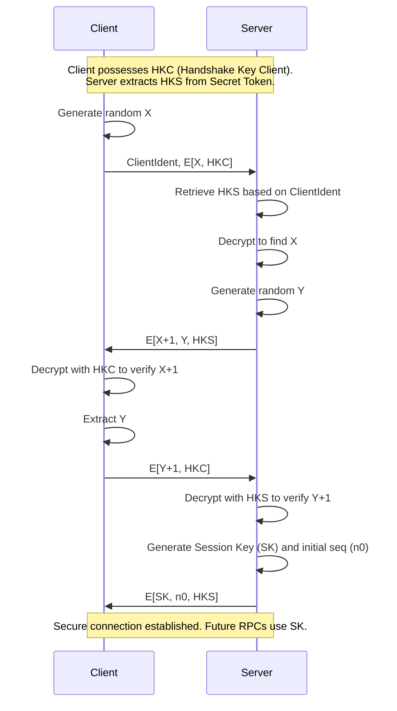

# L11b Security in the Andrew System

> [!summary] TL;DR
> The Andrew File System introduces a scalable, distributed security architecture designed for environments with untrusted client workstations and insecure networks.
> It relies on a trusted core of servers, called Vice, which communicate with client workstations, called Virtue, using end-to-end encryption.
> Authentication is achieved through a two-step process involving an authentication server and the distribution of secure tokens.
> File access is governed by access control lists that support both users and hierarchical groups, including the explicit use of negative rights.
> This design heavily influenced modern distributed authentication systems like Kerberos.

## Learning outcomes

- Describe the Vice and Virtue architecture and explain why client workstations are considered untrusted.
- Detail the two-step authentication process using secret and clear tokens.
- Trace the sequence of encryption and decryption steps in the secure RPC handshake.
- Evaluate the use of access control lists with negative rights in distributed file systems.
- Compare different levels of secure RPC in terms of their performance and security tradeoffs.

## Motivation and the problem

Traditional timesharing systems rely on a centralized mainframe where the operating system enforces security policies and protects users from one another.
In a distributed environment like the Andrew system, this model breaks down due to the vast scale of thousands of individual workstations connected over public or physically accessible networks.
Users have physical control over their own workstations, meaning they can modify the local operating system, boot standalone disks, or install malicious software.
Furthermore, network segments cannot be physically secured, making them vulnerable to eavesdropping, packet interception, and replay attacks.
The core problem is how to provide secure, shared file access when neither the network nor the client machines can be trusted to enforce access controls or protect data in transit.

## Core concepts

### Andrew architecture: Vice and Virtue

<!-- coverage: L11b-01 -->
> [!note] Vice and Virtue
> Vice represents the trusted collection of dedicated servers and secure infrastructure, while Virtue represents the untrusted client workstations running the Venus process.

The Andrew architecture explicitly separates the system into trusted and untrusted components to handle the massive scale of a university campus.
Vice consists of file servers and authentication servers located in physically secure rooms and managed only by trusted administrators.
These servers never run arbitrary user code, ensuring that their operating systems remain uncompromised.
Virtue consists of thousands of personal workstations, which are assumed to be fully vulnerable to user modification and physical tampering.
Because Vice cannot trust the operating system of a Virtue workstation to identify the user accurately, all security checks must be enforced at the server side based on cryptographic proofs rather than operating system identities.

### Security challenges in a distributed file system

<!-- coverage: L11b-02 -->
> [!note] Distributed Security
> Securing a distributed file system requires addressing unauthorized data release, data modification, and identity spoofing over insecure channels.

When files are shared across a large network, the fundamental challenge is ensuring that only authorized users can read or modify them.
Since the network can be easily tapped, data transmitted in the clear is vulnerable to eavesdropping, leading to unauthorized information release.
Attackers could also inject or modify packets in transit, potentially corrupting files or altering administrative commands.
Additionally, malicious users could masquerade as legitimate users by forging network requests, known as spoofing.
Andrew addresses these challenges by moving away from reliance on client-side integrity and instead implementing strict end-to-end encryption and mutual authentication protocols.

### Private-key encryption for communication

<!-- coverage: L11b-03 -->
> [!note] End-to-End Encryption
> The use of shared secret keys to encrypt network traffic between clients and servers, protecting it from interception and tampering.

To combat the inherent insecurity of the network, Andrew uses private-key encryption as the foundation of its secure communication channels.
Clients and servers share secret keys that are used to encrypt and decrypt the remote procedure calls (RPC) they exchange.
This end-to-end encryption ensures that even if an attacker intercepts the network traffic, they cannot read the contents without the appropriate key.
The RPC mechanism supports multiple security levels, ranging from OpenKimono (no encryption) to fully Secure (both headers and data encrypted).
By pushing the encryption down to the RPC layer, Andrew provides a transparent security guarantee to higher-level applications like the distributed file system.

### Secret tokens and clear tokens

<!-- coverage: L11b-04 -->
> [!note] Authentication Tokens
> A pair of tokens (clear and secret) issued by the authentication server that prove a user's identity to file servers without exposing their password.

Instead of transmitting the user's password for every file server connection, Andrew uses a token-based authentication scheme.
When a user logs in, the authentication server issues a Clear Token and a Secret Token, which are cached by the Venus process on the workstation.
The Clear Token contains the user's Vice ID, a token identifier, timestamps, and a handshake key, and is meant to be transmitted over secure channels.
The Secret Token contains identical information but is fully encrypted with a key known only to the authentication server and the Vice file servers.
Possession of these tokens acts as a capability, proving the user's identity to any file server without requiring the workstation to store the user's actual password in memory for prolonged periods.

### Login process and the authentication server

<!-- coverage: L11b-05 -->
> [!note] Authentication Server
> A dedicated Vice server responsible for verifying user passwords and issuing the initial authentication tokens.

The login process in Andrew is designed to establish trust between the user and the system without sending plaintext passwords over the network.
A specialized login program on the Virtue workstation takes the user's password and uses it to derive a handshake key.
This key is used to establish a secure RPC connection directly to the authentication server.
The authentication server looks up the user in its database, derives the expected key, and verifies the connection.
Once authenticated, the server generates a new token pair and sends it back to the workstation, after which the login program terminates and Venus handles subsequent file server connections.

### RPC session establishment and mutual authentication

<!-- coverage: L11b-06 -->
> [!note] Mutual Authentication
> A cryptographic handshake procedure where both the client and the server prove their identities to each other before communicating.

When Venus needs to communicate with a new file server, it initiates a BIND operation to set up a secure connection.
This initiates a three-phase handshake based on the Needham-Schroeder protocol.
The client sends a random number encrypted with its handshake key (derived from the token), and the server decrypts it using the Secret Token.
The server responds with the modified random number and its own encrypted random number, which the client then decrypts and verifies.
This process achieves mutual authentication because the handshake can only be completed successfully if both parties possess the correct, matching handshake key.

### Nonces and replay prevention

<!-- coverage: L11b-07 -->
> [!note] Replay Attacks
> A security breach where an attacker captures legitimate network packets and re-transmits them later to produce an unauthorized effect.

A critical vulnerability in distributed systems is the replay attack, where an adversary records a valid authentication sequence and plays it back to spoof an identity.
Andrew mitigates this by using randomly chosen numbers, often called nonces, for each new BIND handshake.
Because the nonces are different every time, an intercepted handshake from the past will contain the wrong random numbers and will be rejected by the server.
Furthermore, the final step of the handshake establishes a randomly chosen initial sequence number for the RPC connection.
Subsequent RPC packets must use monotonically increasing sequence numbers, preventing an attacker from successfully replaying individual file operation packets within an established session.

### Session keys and bind

<!-- coverage: L11b-08 -->
> [!note] Session Key
> A temporary, randomly generated cryptographic key used exclusively to encrypt traffic for the duration of a single RPC connection.

To minimize the exposure of the long-term handshake key contained in the tokens, the BIND handshake concludes by generating a new session key.
The server generates this session key and securely transmits it to the client in the final step of the handshake.
Once the connection is established, all subsequent RPC traffic between the client and the server is encrypted using this session key.
This ensures that even if an attacker manages to compromise a session key, they only gain access to that specific connection and cannot forge new connections or access other servers.
The use of session keys limits the cryptographic material available to attackers for cryptanalysis on the primary token keys.

### Protection domain: users and groups

<!-- coverage: L11b-09 -->
> [!note] Protection Domain
> The set of entities (users and groups) that can be assigned access rights within the file system.

Andrew structures its protection domain hierarchically to simplify administration across thousands of users.
The domain consists of individual users and groups, where a group can contain users or other groups as members.
Permissions are evaluated based on a user's Current Protection Subdomain (CPS), which is the transitive closure of all groups the user belongs to.
This means that if a user is added to a specific course group, they automatically inherit the access rights granted to that group.
This hierarchical grouping significantly reduces the administrative overhead compared to maintaining individual permissions for every single user on every shared file.

### Access control lists with negative rights

<!-- coverage: L11b-10 -->
> [!note] Negative Rights
> Explicit Access Control List (ACL) entries that deny specific permissions to a user or group, overriding any permissions granted elsewhere.

Andrew uses Access Control Lists (ACLs) attached to directories to specify which users or groups can read, write, or manage files.
A unique feature of the Andrew ACL system is the inclusion of negative rights, which explicitly revoke access.
When checking permissions, the system first accumulates all positive rights granted to the user's CPS, and then subtracts any negative rights explicitly assigned to them.
This allows for powerful and concise policy definitions, such as granting read access to a large group like "System:AnyUser" but explicitly denying it to a specific problematic user or a restricted subgroup.
Negative rights provide administrators with the flexibility to create exceptions without having to restructure the entire group hierarchy.

### Defensive design and its limits

<!-- coverage: L11b-11 -->
> [!note] Resource Denial
> Attacks that aim to consume system resources, such as network bandwidth or server CPU cycles, thereby denying service to legitimate users.

While the Andrew security architecture provides strong protections against unauthorized release and modification of data, it has inherent limits.
The system is fundamentally designed around defending against malicious clients, but it struggles with resource control and denial-of-service (DoS) attacks.
An attacker could flood the network with garbage packets, forcing the routers or servers to exhaust their processing capacity, effectively denying service to others.
Andrew's design acknowledges these limits, recognizing that completely solving resource denial in an open campus network is impractical without substantial hardware support.
Administrators must rely on external monitoring tools and audit logs to detect and physically isolate misbehaving nodes when such attacks occur.

## Mechanisms step by step

The core mechanism of Andrew's security is the three-phase mutual authentication handshake during an RPC BIND operation. 
This process ensures both the client and server prove possession of a shared key without transmitting it in the clear.

1. The client generates a random number `X`, encrypts it with its handshake key (`HKC`), and sends it to the server along with its identity string.
2. The server uses the identity string to locate the appropriate secret token, extracts its handshake key (`HKS`), and decrypts `X`.
3. The server adds 1 to `X`, generates a new random number `Y`, encrypts both with `HKS`, and sends the result back to the client.
4. The client decrypts the message and verifies that the first value is exactly `X+1`, proving the server successfully decrypted the first message and possesses the correct key.
5. The client adds 1 to `Y`, encrypts it with `HKC`, and sends it to the server.
6. The server decrypts this message and verifies that the value is `Y+1`, proving the client successfully decrypted the second message and possesses the correct key.
7. The server generates a new Session Key (`SK`) and an initial sequence number (`n0`), encrypts them with `HKS`, and sends them to the client to finalize the connection.

## Worked examples

Consider the computational overhead and sequence numbering during a secure BIND and subsequent RPC operations.

**Encryption Operations per Handshake**
During the BIND handshake, multiple encryption and decryption steps occur.
Step 1 requires the client to encrypt `X`, taking 1 operation.
Step 2 requires the server to decrypt `X`, taking 1 operation.
Step 3 requires the server to encrypt `(X+1, Y)`, taking 1 operation.
Step 4 requires the client to decrypt `(X+1, Y)`, taking 1 operation.
Step 5 requires the client to encrypt `Y+1`, taking 1 operation.
Step 6 requires the server to decrypt `Y+1`, taking 1 operation.
Step 7 requires the server to encrypt `(SK, n0)`, taking 1 operation.
Step 8 requires the client to decrypt `(SK, n0)`, taking 1 operation.
Total cryptographic operations for a successful BIND is 4 encryptions and 4 decryptions across the two machines.

**Sequence Number Progression**
To prevent replay attacks, sequence numbers strictly increase over time.
The server generates an initial sequence number, for example, `n0 = 1500`.
The first RPC request from the client must use sequence number `1501`.
The server's reply to the first RPC will use sequence number `1502`.
A second RPC request from the client will use sequence number `1503`.
An attacker attempting to replay the first request with sequence `1501` will be rejected because the server expects `1503` or higher.

## Comparison

The Andrew system supports four levels of security for its RPC connections, allowing users and administrators to trade off performance for security.

| Security Level | Authentication | Packet Headers | Packet Data | Performance Overhead | Best Use Case |
| :--- | :--- | :--- | :--- | :--- | :--- |
| **OpenKimono** | No | Plaintext | Plaintext | Minimal | Trusted peers on a physically secure, isolated backend network. |
| **AuthOnly** | Yes | Plaintext | Plaintext | Low | Mutually suspicious entities on a secure channel. |
| **HeadersOnly** | Yes | Encrypted | Plaintext | Medium | Insecure networks where data privacy is not required, but request spoofing must be prevented. |
| **Secure** | Yes | Encrypted | Encrypted | High | Insecure networks like public campus Wi-Fi transmitting sensitive user data. |

## Paper deep dives

- [The Protection of Information in Computer Systems](../Papers/L11-Protection-Control-of-Information.md)
This foundational paper by Saltzer and Schroeder outlines the core principles of security design in computer systems, such as economy of mechanism, fail-safe defaults, complete mediation, and least privilege.
Andrew relies heavily on these principles, particularly in its architectural separation of trusted servers (Vice) and untrusted clients (Virtue), and its use of explicitly verified authentication tokens to mediate all file access securely.

- [Integrating Security in a Large Distributed System](../Papers/L11-Andrew-Security.md)
Satyanarayanan's paper describes the specific implementation details of the Andrew file system's security model.
It explains how the system scales to thousands of workstations using a two-step token authentication process and end-to-end RPC encryption based on the Needham-Schroeder protocol.
The paper highlights the practical challenges of distributed security, noting that while unauthorized release and modification are well-handled, resource denial remains an open vulnerability.

## Modern descendants

The security concepts pioneered by the Andrew system have directly influenced several modern authentication and security protocols.
The two-step token approach and the use of the Needham-Schroeder handshake formed the conceptual basis for **Kerberos**, developed at MIT, which is now the standard authentication protocol for Microsoft Active Directory.
The idea of issuing a short-lived token to an untrusted client, which then presents it to resource servers, is the exact mechanism used by modern **OAuth 2.0** and **JSON Web Tokens (JWT)**.
Modern distributed file systems, such as **Ceph** and **NFSv4**, continue to use cryptographic tokens and ACLs to manage permissions across untrusted networks.

## Pitfalls and exam traps

> [!warning] Exam Trap: Client Operating System Integrity
> Do not assume the client operating system can enforce security policies in a distributed environment.
> In Andrew, the client operating system (Virtue) is fundamentally untrusted.
> All access control and authentication enforcement must happen on the trusted servers (Vice).

> [!warning] Exam Trap: Secret vs. Clear Tokens
> Be careful to distinguish between the two tokens.
> The Secret Token is fully encrypted and can only be read by Vice servers.
> The Clear Token contains the handshake key and must be protected by the client from local malicious software.

> [!warning] Pitfall: Resource Denial
> Remember that while Andrew protects data privacy and integrity, it does not solve denial-of-service or resource denial attacks.
> A compromised network router can still drop packets or flood the network.

## Practice

- [Practice L11](../Practice/Practice-L11.md)

## Lab

- [lab-24-security](../labs/lab-24-security/README.md): Protection in practice: capabilities, namespaces, seccomp, and an Andrew-style handshake

## Further reading

- [Kerberos: An Authentication Service for Open Network Systems](https://web.mit.edu/kerberos/papers/usenix-tc_1988.pdf)
- [RFC 4120: The Kerberos Network Authentication Service (V5)](https://datatracker.ietf.org/doc/html/rfc4120)
