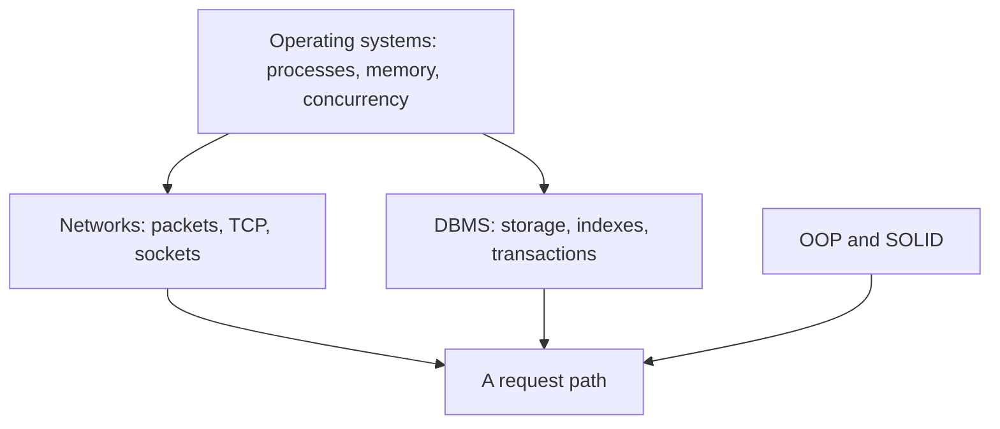

# CS Foundations

Core computer science: operating systems, computer networks, databases, and object-oriented programming, with notes, quizzes, and runnable code.

Read the four section notes in that order when you are building the base.
The later system-design and distinguished-engineering diagrams assume this picture.
<!-- moc:start (generated by tools/build_mocs.py; edits inside are overwritten) -->
## Contents

**Sections**

- [Computer Networks](Computer-Networks/README.md)
- [DBMS](DBMS/README.md)
- [Object Oriented Programming](Object-Oriented-Programming/README.md)
- [Operating Systems](Operating-Systems/README.md)

<!-- moc:end -->
