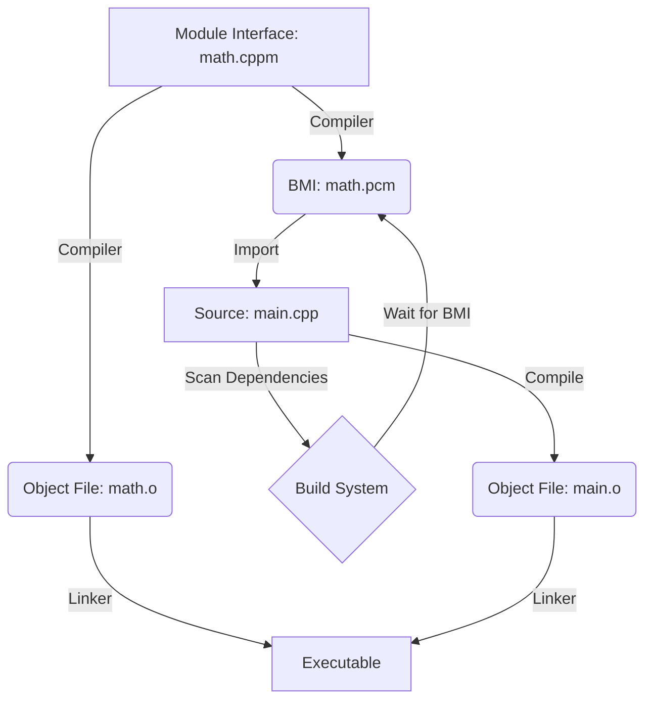
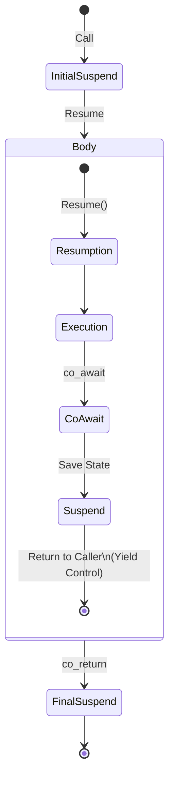

# C20 STANDARD LIBRARY ADDITIONS


# C++20 STANDARD LIBRARY ADDITIONS

## 1. `std::format` (Python-style Formatting)

Type-safe, fast, and readable string formatting. Replaces `printf` and `iostream`.

```cpp
#include <format>
#include <iostream>

std::string s = std::format("Hello, {}! The answer is {}.", "World", 42);
// "Hello, World! The answer is 42."

// Positional arguments
std::string s2 = std::format("{1} {0}", "World", "Hello"); 
```

## 2. `std::span`

A non-owning view of a contiguous sequence (array, vector). Replaces `pointer + size`.

```cpp
#include <span>

void process(std::span<int> data) {
    for (int& x : data) x *= 2;
}

int arr[] = {1, 2, 3};
std::vector<int> vec = {4, 5, 6};

process(arr); // Works
process(vec); // Works
```

## 3. `std::jthread` (Joinable Thread)

Automatically joins on destruction. Supports cooperative interruption (`stop_token`).

```cpp
#include <thread>

void worker(std::stop_token st) {
    while (!st.stop_requested()) {
        // work...
    }
}

{
    std::jthread t(worker);
} // t requests stop and joins automatically here
```

## 4. Concurrency Primitives (`<semaphore>`, `<barrier>`, `<latch>`)

*   `std::binary_semaphore`, `std::counting_semaphore`: Lightweight signaling.
*   `std::latch`: Single-use countdown barrier.
*   `std::barrier`: Reusable barrier for phases of work.

## 5. Mathematical Constants (`<numbers>`)

```cpp
#include <numbers>
double pi = std::numbers::pi;
double e = std::numbers::e;
```

## 6. Bit Manipulation (`<bit>`)

*   `std::popcount`: Count set bits.
*   `std::bit_ceil`: Next power of 2.
*   `std::endian`: Check system endianness.
---

## 7. Professional Notes: C++20 Deep Dives

### 7.1 Modules: The Semantic Revolution
Modules replace textual inclusion with a binary semantic model, fundamentally changing the Compilation Pipeline.

*   **Physical Structure & BMI**: A Module Interface Unit (`.cppm`/`.ixx`) is compiled into a **Binary Module Interface (BMI)**. Unlike headers, which are re-parsed in every translation unit, the BMI contains a serialized AST (Abstract Syntax Tree). Importing a BMI is a constant-time operation rather than a linear-time parsing task.
*   **Build System Integration**: Modules introduce a strict compilation order. If `main.cpp` imports `math`, the BMI for `math` must exist first. Modern build systems (CMake 3.28+, Ninja) now include a "scanning" phase to dynamically generate the dependency DAG before compilation begins.

#### Compilation Pipeline with Modules


### 7.2 Coroutines: Stackless State Machines
C++ coroutines are stackless, meaning they don't have a private call stack. Their state is stored in a heap-allocated **Coroutine Frame**.

*   **Lifecycle of `promise_type`**: 
    1.  **Allocation**: Frame is allocated on the heap.
    2.  **Initial Suspend**: `co_await promise.initial_suspend()` determines if the coroutine starts immediately or waits.
    3.  **Body**: Executes until a suspension point.
    4.  **Final Suspend**: `promise.final_suspend()` allows the frame to persist so the caller can retrieve values before destruction.
*   **The `co_await` Sequence**: When `co_await` is hit:
    1.  `await_ready()` is checked.
    2.  If false, `await_suspend(handle)` saves the CPU registers and instruction pointer to the frame and returns control to the caller.
    3.  On `handle.resume()`, the state is restored, and execution continues.

#### Coroutine State Machine


### 7.3 Ranges & Views: Lazy Composition
*   **Range vs. View**: A Range owns or provides access to data; a **View** is a lightweight, lazy range that doesn't own data. 
*   **Performance**: Views use expression templates to collapse multiple operations (filter, transform) into a single loop. This avoids intermediate allocations but can lead to "Template Bloat" and increased compile times in extremely deep pipe chains.

---

# VOLUME 05: GODHOOD SUMMARY

C++20 was the **Gigantic Leap**. It is as significant as C++11 was a decade prior, introducing four "Great Pillars" that redefine how we write C++.
1. **Concepts**: Type-safe templates with readable errors.
2. **Modules**: The end of the "Header/Source" and `#include` era.
3. **Coroutines**: Native support for asynchronous programming and generators.
4. **Ranges**: Composable, functional-style container operations.

**The Golden Rule of C++20**: Constraints over SFINAE, Modules over Headers, and Ranges over Iterators. You have leaped into a new era of C++ architecture.

---


---


# VOLUME 06 LATEST EVOLUTION C23