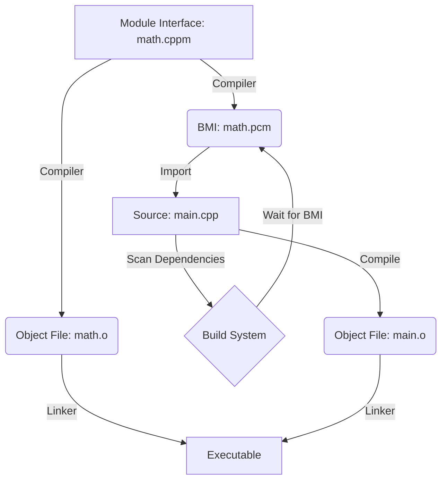
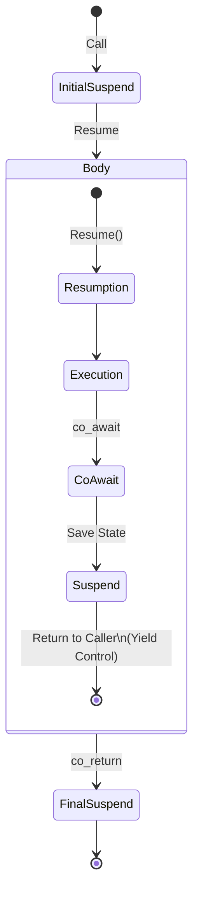

# Preface

## The Complete C++ Programmer's Guide: From Zero to Godhood (C++98 to C++26)

**Author:** Shreejit Verma

### About the Book

This book is the culmination of a decade-long journey through the depths of C++. It is written not just as a reference, but as a comprehensive guide for those who wish to transcend the level of a "user" and become a "master" of the language.

The "Zero to Godhood" series was born from a frustration with existing resources. Tutorials often stop at syntax, leaving engineers ill-equipped for the brutal reality of high-frequency trading, kernel development, and large-scale distributed systems. This book bridges that gap.

**We cover the entire spectrum:**
*   **The Archaic**: Understanding C++98/03 legacy codebases that still power the world's infrastructure.
*   **The Modern**: Mastering C++11 through C++20, where the language found its renaissance.
*   **The Future**: A forward-looking view into C++23 and C++26, preparing you for the next decade.
*   **The Metal**: Deep dives into memory models, lock-free concurrency, custom allocators, and compiler intrinsics.

This is a book for those who want to know *how* the machine works, not just how to talk to it.

### About the Author

**Shreejit Verma** is a Senior Software Engineer and Quantitative Developer specializing in low-latency systems and high-performance computing. With extensive experience in building distributed trading platforms, optimizing critical infrastructure, and architecting scalable C++ solutions, Shreejit brings a practical, engineering-first perspective to the language.

His philosophy is simple: **"Performance is not an accident. It is an architectural decision."**

Shreejit has mentored hundreds of engineers, helping them transition from junior roles to architects by demystifying the complexities of C++ and the hardware it runs on. This book is the crystallized essence of that mentorship.

### How to Use This Book

1.  **The Foundations (Volume 01)**: Essential for everyone. Even experts should review the compilation model and object virtualization chapters.
2.  **The Modern Era (Volumes 02-07)**: The core toolkit for the professional developer, covering C++11 through C++26.
3.  **The Expert Domains (Volumes 08-09)**: For those seeking mastery in specific fields like HFT, Systems, and Graphics.

---

## TABLE OF CONTENTS

### [VOLUME 01: FOUNDATION (C++98/03)](#volume-01-foundation-c98-03)
*   Chapter 1: [Foundations & Compilation Model](#chapter-1-foundations-and-compilation)
*   Chapter 2: [Memory Types & Pointers](#chapter-2-memory-types-and-pointers)
*   Chapter 3: [Control Flow & Preprocessor](#chapter-3-control-flow-and-preprocessor)
*   Chapter 4: [Advanced Functions & Callbacks](#chapter-4-advanced-functions-and-callbacks)
*   Chapter 5: [OOP & Encapsulation](#chapter-5-oop-and-encapsulation)
*   Chapter 6: [Polymorphism & Virtualization](#chapter-6-polymorphism-and-virtualization)
*   Chapter 7: [Standard Template Library Core](#chapter-7-standard-template-library-core)
*   Chapter 8: [STL Under the Hood](#chapter-8-stl-under-the-hood)
*   Chapter 9: [Error Handling & Robustness](#chapter-9-error-handling-and-robustness)

### [VOLUME 02: MODERN REVOLUTION (C++11)](#volume-02-modern-revolution-c11)
*   Chapter 10: [The Modern C++11 Core](#chapter-10-the-modern-c11-core)
*   Chapter 11: [Move Semantics & Smart Pointers](#chapter-11-move-semantics-and-smart-pointers)
*   Chapter 12: [Functional Programming (Lambdas)](#chapter-12-functional-programming)
*   Chapter 13: [Template Metaprogramming (Variadics)](#chapter-13-template-metaprogramming)
*   Chapter 14: [Standard Library Expansion](#chapter-14-standard-library-expansion)
*   Chapter 15: [Concurrency & Multithreading](#chapter-15-concurrency)

### [VOLUME 03: REFINEMENT (C++14)](#volume-03-refinement-generics-c14)
*   Chapter 16: [C++14 Core Language Upgrades](#chapter-16-c14-core-language-upgrades)
*   Chapter 17: [Functions & Generic Lambdas](#chapter-17-c14-functions-and-lambdas)
*   Chapter 18: [Templates & Metaprogramming](#chapter-18-c14-templates-and-metaprogramming)
*   Chapter 19: [Standard Library Enhancements](#chapter-19-c14-standard-library-enhancements)

### [VOLUME 04: MODERNIZATION (C++17)](#volume-04-modernization-c17)
*   Chapter 20: [C++17 Core Language Features](#chapter-20-c17-core-language-features)
*   Chapter 21: [Template Metaprogramming Enhancements](#chapter-21-c17-template-metaprogramming)
*   Chapter 22: [Vocabulary Types (Optional, Variant)](#chapter-22-c17-vocabulary-types)
*   Chapter 23: [Filesystem & I/O](#chapter-23-c17-filesystem-and-io)
*   Chapter 24: [Parallel Algorithms](#chapter-24-c17-parallel-algorithms-and-concurrency)
*   Chapter 25: [Standard Library Additions](#chapter-25-c17-standard-library-additions)

### [VOLUME 05: GIGANTIC LEAP (C++20)](#volume-05-gigantic-leap-c20)
*   Chapter 26: [Concepts & Constraints](#chapter-26-c20-concepts)
*   Chapter 27: [Modules (The Death of Headers)](#chapter-27-c20-modules)
*   Chapter 28: [Coroutines (Stackless State Machines)](#chapter-28-c20-coroutines)
*   Chapter 29: [Ranges & Views](#chapter-29-c20-ranges)
*   Chapter 30: [C++20 Core Language Features](#chapter-30-c20-core-language-features)
*   Chapter 31: [Standard Library Additions](#chapter-31-c20-standard-library-additions)

### [VOLUME 06: LATEST EVOLUTION (C++23)](#volume-06-latest-evolution-c23)
*   Chapter 32: [C++23 Core Language (Deducing This)](#chapter-32-c23-core-language)
*   Chapter 33: [Modern I/O (std::print)](#chapter-33-c23-std-print)
*   Chapter 34: [Monadic Operations & std::expected](#chapter-34-c23-monadic-operations-and-expected)
*   Chapter 35: [Containers & Views (mdspan)](#chapter-35-c23-containers-and-views)
*   Chapter 36: [Coroutines & Stacktrace](#chapter-36-c23-coroutines-and-stacktrace)
*   Chapter 37: [Library Utilities](#chapter-37-c23-library-utilities)

### [VOLUME 07: THE NEXT FRONTIER (C++26)](#volume-07-the-next-frontier-c26)
*   Chapter 38: [C++26 - Reflection & Contracts](#chapter-38-c26---the-next-frontier)

### [VOLUME 08: ADVANCED SYSTEMS](#volume-08-advanced-systems)
*   Chapter 39: [Advanced Template Metaprogramming](#chapter-39-advanced-template-metaprogramming)
*   Chapter 40: [Compile Time Programming](#chapter-40-compile-time-programming)
*   Chapter 41: [The C++ Memory Model](#chapter-41-the-cpp-memory-model)
*   Chapter 42: [Lock Free Programming](#chapter-42-lock-free-programming)
*   Chapter 43: [Advanced Concurrency Patterns](#chapter-43-advanced-concurrency-patterns)
*   Chapter 44: [Custom Memory Allocators](#chapter-44-custom-memory-allocators)
*   Chapter 45: [High Performance Optimization](#chapter-45-high-performance-optimization)
*   Chapter 46: [Writing a C Compiler Basics](#chapter-46-writing-a-c-compiler-basics)
*   Chapter 47: [Writing a Garbage Collector](#chapter-47-writing-a-garbage-collector)
*   Chapter 48: [The Standard Library From Scratch](#chapter-48-the-standard-library-from-scratch)

### [VOLUME 09: SPECIALIZED MASTERY](#volume-09-specialized-mastery)
*   Chapter 49: [Distributed C++](#chapter-49-distributed-c)
*   Chapter 50: [Networking From Scratch](#chapter-50-networking-from-scratch)
*   Chapter 51: [C++ In The Cloud](#chapter-51-c-in-the-cloud)
*   Chapter 52: [Cross-Platform Development](#chapter-52-cross-platform-development)
*   Chapter 53: [GUI Development With C++](#chapter-53-gui-development-with-c)
*   Chapter 54: [Scientific Computing & GPU](#chapter-54-scientific-computing-gpu)
*   Chapter 55: [Interoperability](#chapter-55-interoperability)
*   Chapter 56: [Security Engineering](#chapter-56-security-engineering)
*   Chapter 57: [Specialized Domains](#chapter-57-specialized-domains)
*   Chapter 58: [ABA Problem & Memory Reclamation](#chapter-58-aba-problem-memory-reclamation)
*   Chapter 59: [Template Metaprogramming Patterns](#chapter-59-template-metaprogramming-patterns)
*   Chapter 60: [High-Performance Data Structures](#chapter-60-high-performance-data-structures)
*   Chapter 61: [Real-Time Audio & Signal Processing](#chapter-61-real-time-audio-signal-processing)
*   Chapter 62: [Robotics & ROS2 Development](#chapter-62-robotics-ros2-development)
*   Chapter 63: [Machine Learning Infrastructure](#chapter-63-machine-learning-infrastructure)
*   Chapter 64: [Database Internals (LSM Trees)](#chapter-64-database-internals-lsm-trees)
*   Chapter 65: [The Ultimate Algorithm Reference](#chapter-65-the-ultimate-algorithm-reference)
*   Chapter 66: [Capstone Project: HFT Order Book](#chapter-66-capstone-project---high-performance-order-book)

---

Prepare yourself. We are about to master the beast.

# VOLUME 01 FOUNDATION C98 03

## CHAPTER 1: FOUNDATIONS AND COMPILATION

# FOUNDATIONS & COMPILATION MODEL

# ABSOLUTE BASICS (C++98)

## Getting Started

### What is C++?

C++ is a statically-typed, compiled programming language that combines low-level memory manipulation with high-level abstractions. It's the language of choice for performance-critical applications.

### Your First Program (C++98)

```cpp
#include <iostream>

int main() {
    std::cout << "Hello, World!" << std::endl;
    return 0;
}
```

---
### Professional Notes: Basics & I/O

#### 1. The Compilation Pipeline (Deep Dive)
Compilation in C++ is a multi-stage process that transforms human-readable source code into machine-executable binaries.
1.  **Preprocessing**: The preprocessor (`cpp`) handles directives starting with `#`. It includes headers (`#include`) and expands macros (`#define`).
2.  **Compilation**: The compiler (`g++`, `clang++`) translates the preprocessed source into assembly code.
3.  **Assembly**: The assembler (`as`) converts assembly into machine-readable object files (`.o` or `.obj`).
4.  **Linking**: The linker (`ld`) combines multiple object files and libraries into a single executable, resolving symbols and addresses.

#### 2. Standard Streams and Buffered I/O
C++ provides a robust I/O system based on streams.
*   **`std::cout`**: Buffered output stream (standard output).
*   **`std::cin`**: Buffered input stream (standard input).
*   **`std::cerr`**: Unbuffered output stream (standard error).
*   **`std::clog`**: Buffered output stream (logging standard error).

**Godhood Tip**: Use `std::endl` only when you need to flush the buffer (e.g., in real-time logging). For performance, use `'\n'` to avoid unnecessary flushes.

#### 3. Stream State and Error Handling
Always check the state of a stream after an operation:
```cpp
int x;
if (!(std::cin >> x)) {
    std::cin.clear(); // Clear the error flags
    std::cin.ignore(std::numeric_limits<std::streamsize>::max(), '\n'); // Discard bad input
    std::cerr << "Invalid input received!" << std::endl;
}
```
Stream states include `good()`, `bad()`, `fail()`, and `eof()`.

---

**Breakdown:**
- `#include <iostream>` - Include input/output library
- `std::cout` - Standard output stream (print to console)
- `std::endl` - End line and flush buffer
- `main()` - Entry point of program
- `return 0` - Exit code (0 = success)

**Compile and run:**
```bash
g++ -o hello hello.cpp
./hello
```

---

## Basic Types & Variables

### Fundamental Types (C++98)

```cpp
#include <iostream>
#include <limits>

int main() {
    // Integer types
    int x = 42;                  // 32-bit integer
    short y = 10;                // 16-bit integer
    long z = 1000000;            // 32 or 64-bit integer
    long long w = 9999999999;    // 64-bit integer

    // Floating-point types
    float f = 3.14f;             // 32-bit (4 bytes)
    double d = 3.14159265;       // 64-bit (8 bytes)
    long double ld = 3.14159265359L;  // 80+ bits

    // Character and boolean types
    char c = 'A';                // Single byte
    bool b = true;               // true or false

    // Print sizes
    std::cout << "int: " << sizeof(int) << " bytes\n";
    std::cout << "double: " << sizeof(double) << " bytes\n";

    // Min/max values
    std::cout << "int max: " << std::numeric_limits<int>::max() << "\n";
    std::cout << "int min: " << std::numeric_limits<int>::min() << "\n";

    return 0;
}
```

---
### Professional Notes: Literals & Keywords

#### 1. Integer and Floating Point Literals
*   **Decimal**: `42`
*   **Octal**: `052` (Starts with 0)
*   **Hexadecimal**: `0x2A`
*   **Binary (C++14)**: `0b101010`
*   **Suffixes**: `u` (unsigned), `l` (long), `ll` (long long), `f` (float).
*   **Digit Separators (C++14)**: Use single quotes to improve readability: `1'000'000` or `0b1111'0000`.

#### 2. String Literals and Encodings
*   **Raw Strings (C++11)**: `R"(string with \ and " without escaping)"`
*   **Encodings**: `u8""` (UTF-8), `u""` (char16_t), `U""` (char32_t), `L""` (wchar_t).

#### 3. Core Keywords and Type Qualifiers
*   **`const`**: Declares a variable as read-only.
*   **`volatile`**: Tells the compiler that the value can change outside the program's control (e.g., hardware registers). Prevents aggressive optimization.
*   **`mutable`**: Allows a member of a `const` object to be modified (Chapter 5).
*   **`explicit`**: Prevents the compiler from using a constructor for implicit conversions.
*   **`inline`**: Suggests to the compiler to replace function calls with the actual code to save overhead.

---

### Variable Declaration & Initialization

```cpp
#include <iostream>

int main() {
    // C-style initialization
    int x = 5;
    float f = 3.14f;

    // Multiple variables
    int a, b, c;

    // Uninitialized (dangerous - contains garbage)
    int uninitialized;
    std::cout << uninitialized << "\n";  // Undefined behavior!

    // Constants
    const int MAX_SIZE = 100;
    // MAX_SIZE = 200;  // Error: can't modify const

    return 0;
}
```

### Scope & Lifetime (C++98)

```cpp
#include <iostream>

int global = 100;  // Global scope - lives entire program

void function() {
    int local = 5;      // Local scope - lives only in function
    {
        int nested = 10;  // Block scope - lives only in block
        std::cout << nested << "\n";
    }
    // std::cout << nested << "\n";  // Error: nested out of scope
}

int main() {
    {
        int x = 5;
    }
    // std::cout << x << "\n";  // Error: x out of scope

    return 0;
}
```

### Deep Dive: The Memory Model of Variables

Understanding *where* your variables live is the first step to Godhood.

1.  **The Stack (Automatic Storage)**:
    *   **What**: Local variables (`int x`).
    *   **Speed**: Extremely fast (just moving a pointer).
    *   **Lifetime**: Scope-based (die at `}`).
    *   **Limit**: Small (typically 1MB-8MB). Recursion depth is limited by this.

2.  **The Heap (Dynamic Storage)**:
    *   **What**: `new int`, `malloc`.
    *   **Speed**: Slower (allocation requires finding free block).
    *   **Lifetime**: Manual (until `delete` / `free`).
    *   **Limit**: RAM size (Gigabytes).

3.  **Static/Global (Static Storage)**:
    *   **What**: Global variables, `static` locals.
    *   **Speed**: Fast access, but initialization order is tricky.
    *   **Lifetime**: Program start to program end.

4.  **Registers**:
    *   **What**: CPU internal storage.
    *   **Speed**: Instant (0 cycles).
    *   **Note**: Variables are often optimized into registers, never touching RAM!

---

## Operators & Control Flow

### Arithmetic Operators (C++98)

```cpp
#include <iostream>

int main() {
    int a = 10, b = 3;

    std::cout << a + b << "\n";   // 13 (addition)
    std::cout << a - b << "\n";   // 7 (subtraction)
    std::cout << a * b << "\n";   // 30 (multiplication)
    std::cout << a / b << "\n";   // 3 (integer division)
    std::cout << a % b << "\n";   // 1 (modulo)

    // Compound assignment
    int x = 5;
    x += 3;   // x = 8
    x -= 2;   // x = 6
    x *= 2;   // x = 12
    x /= 3;   // x = 4

    // Increment/Decrement
    int y = 5;
    y++;      // Post-increment: 6
    ++y;      // Pre-increment: 7
    y--;      // Post-decrement: 6
    --y;      // Pre-decrement: 5

    return 0;
}
```

### Comparison & Logical Operators (C++98)

```cpp
#include <iostream>

int main() {
    int a = 10, b = 5;

    // Comparison (return true/false)
    std::cout << (a > b) << "\n";   // 1 (true)
    std::cout << (a < b) << "\n";   // 0 (false)
    std::cout << (a == b) << "\n";  // 0 (false)
    std::cout << (a != b) << "\n";  // 1 (true)
    std::cout << (a >= b) << "\n";  // 1 (true)
    std::cout << (a <= b) << "\n";  // 0 (false)

    // Logical operators
    bool x = true, y = false;
    std::cout << (x && y) << "\n";  // 0 (AND)
    std::cout << (x || y) << "\n";  // 1 (OR)
    std::cout << (!x) << "\n";      // 0 (NOT)

    return 0;
}
```

### If-Else Statements (C++98)

```cpp
#include <iostream>

int main() {
    int score = 85;

    // Basic if-else
    if (score >= 90) {
        std::cout << "Grade: A\n";
    } else if (score >= 80) {
        std::cout << "Grade: B\n";
    } else if (score >= 70) {
        std::cout << "Grade: C\n";
    } else {
        std::cout << "Grade: F\n";
    }

    // Ternary operator
    std::string grade = (score >= 80) ? "Pass" : "Fail";
    std::cout << grade << "\n";

    return 0;
}
```

### Loops (C++98)

```cpp
#include <iostream>

int main() {
    // While loop
    int i = 0;
    while (i < 5) {
        std::cout << i << " ";
        i++;
    }
    std::cout << "\n";

    // Do-while loop (executes at least once)
    int j = 0;
    do {
        std::cout << j << " ";
        j++;
    } while (j < 5);
    std::cout << "\n";

    // For loop
    for (int k = 0; k < 5; k++) {
        std::cout << k << " ";
    }
    std::cout << "\n";

    // Break and continue
    for (int m = 0; m < 10; m++) {
        if (m == 3) continue;  // Skip 3
        if (m == 7) break;     // Exit at 7
        std::cout << m << " ";
    }
    std::cout << "\n";

    return 0;
}
```

### Switch Statement (C++98)

```cpp
#include <iostream>

int main() {
    int day = 3;

    switch (day) {
        case 1:
            std::cout << "Monday\n";
            break;
        case 2:
            std::cout << "Tuesday\n";
            break;
        case 3:
            std::cout << "Wednesday\n";
            break;
        default:
            std::cout << "Unknown day\n";
    }

    return 0;
}
```

---
### Professional Notes: Operators & Control Flow

#### 1. Operator Precedence and Associativity
C++ has a strict hierarchy for operator evaluation. When multiple operators appear in an expression, precedence determines the grouping.
*   **High Precedence**: `()`, `[]`, `->`, `::`, `++` (postfix).
*   **Medium Precedence**: `*`, `/`, `%` followed by `+`, `-`.
*   **Low Precedence**: Bitwise shifts `<<`, `>>`, then comparisons `<`, `>`, then logical `&&`, `||`, and finally assignment `=`.

**Godhood Warning**: Never write ambiguous code like `a = b++ + ++b;`. This is **Undefined Behavior (UB)** because it attempts to modify `b` twice between sequence points.

#### 2. Advanced Loop Patterns
*   **Range-based for (C++11)**: Iterate directly over containers: `for (const auto& x : vec)`.
*   **Empty Loop Body**: A semicolon or empty braces can be used for loops that perform all work in the header: `while (*dest++ = *src++);`.
*   **The `for` Loop as a `while` Loop**: `for (; condition ;) {}` is identical to `while (condition) {}`.

#### 3. Flow Control Quirks
*   **`switch` Fallthrough**: Without a `break`, execution continues to the next case. In C++17, use `[[fallthrough]];` to signal intent and silence warnings.
*   **`goto` Statement**: While generally discouraged, `goto` is acceptable for breaking out of deeply nested loops or for error-cleanup blocks in low-level code.
*   **The Comma Operator**: `a, b` evaluates `a`, discards the result, then returns `b`. Useful in for-loop headers: `for (int i=0, j=10; i<j; ++i, --j)`.

---

## Functions

### Function Declaration & Definition (C++98)

```cpp
#include <iostream>

// Function declaration (prototype)
int add(int a, int b);
void print_hello();

// Function definition
int add(int a, int b) {
    return a + b;
}

void print_hello() {
    std::cout << "Hello!\n";
}

int main() {
    print_hello();
    std::cout << add(5, 3) << "\n";  // 8
    return 0;
}
```

### Parameters & Return Values (C++98)

```cpp
#include <iostream>

// Pass by value (copy)
void increment_value(int x) {
    x++;
    std::cout << "Inside: " << x << "\n";
}

// Pass by reference (same variable)
void increment_ref(int& x) {
    x++;
    std::cout << "Inside: " << x << "\n";
}

// Pass by const reference (can't modify)
void print_value(const int& x) {
    std::cout << x << "\n";
}

// Returning by value
int get_value() {
    return 42;
}

// Returning by reference (dangerous!)
int& get_global() {
    static int x = 100;
    return x;
}

int main() {
    int a = 5;

    increment_value(a);   // Copy passed
    std::cout << a << "\n";  // Still 5

    increment_ref(a);      // Reference passed
    std::cout << a << "\n";  // Now 6

    print_value(a);        // Can't modify a

    return 0;
}
```

### Default Parameters (C++98)

```cpp
#include <iostream>

void greet(const std::string& name = "World") {
    std::cout << "Hello, " << name << "!\n";
}

int main() {
    greet();                // Uses default: "World"
    greet("Alice");         // Uses provided: "Alice"
    return 0;
}
```

### Function Overloading (C++98)

```cpp
#include <iostream>

// Same function name, different parameters
int add(int a, int b) {
    return a + b;
}

double add(double a, double b) {
    return a + b;
}

void print(int x) {
    std::cout << "Integer: " << x << "\n";
}

void print(double x) {
    std::cout << "Double: " << x << "\n";
}

void print(const std::string& s) {
    std::cout << "String: " << s << "\n";
}

int main() {
    std::cout << add(5, 3) << "\n";      // 8 (int version)
    std::cout << add(2.5, 3.7) << "\n";  // 6.2 (double version)

    print(42);           // Integer version
    print(3.14);         // Double version
    print("Hello");      // String version

    return 0;
}
```

---

## Arrays & Pointers

### Arrays (C++98)

```cpp
#include <iostream>

int main() {
    // Array declaration and initialization
    int arr[5] = {1, 2, 3, 4, 5};

    // Access elements (0-indexed)
    std::cout << arr[0] << "\n";  // 1
    std::cout << arr[4] << "\n";  // 5

    // Array size (local arrays only)
    int size = 5;
    for (int i = 0; i < size; i++) {
        std::cout << arr[i] << " ";
    }
    std::cout << "\n";

    // 2D array
    int matrix[3][3] = {
        {1, 2, 3},
        {4, 5, 6},
        {7, 8, 9}
    };

    std::cout << matrix[1][2] << "\n";  // 6

    return 0;
}
```

### Pointers (C++98)

```cpp
#include <iostream>

int main() {
    int x = 42;

    // Create a pointer
    int* ptr = &x;  // & = address-of operator

    // Dereference pointer
    std::cout << *ptr << "\n";   // 42 (dereference with *)

    // Modify through pointer
    *ptr = 100;
    std::cout << x << "\n";      // 100

    // Pointer arithmetic
    int arr[5] = {10, 20, 30, 40, 50};
    int* p = arr;           // Array decays to pointer

    std::cout << p[0] << "\n";     // 10
    std::cout << *(p+1) << "\n";   // 20
    std::cout << p[2] << "\n";     // 30

    // Null pointer
    int* null_ptr = nullptr;  // or NULL in C++98

    // Pointer to pointer
    int** pp = &ptr;
    std::cout << **pp << "\n";  // 100

    return 0;
}
```

### Dynamic Memory (C++98)

```cpp
#include <iostream>

int main() {
    // Allocate single value on heap
    int* ptr = new int;
    *ptr = 42;
    std::cout << *ptr << "\n";
    delete ptr;          // Must deallocate
    ptr = nullptr;       // Good practice

    // Allocate array on heap
    int* arr = new int[10];
    for (int i = 0; i < 10; i++) {
        arr[i] = i * i;
    }
    delete[] arr;        // Note the [] for arrays

    // Forgetting to delete = memory leak
    int* leaked = new int(100);
    // delete leaked;  // Forgot this!

    return 0;
}
```

<!-- Merged content from Chapter_17_THE_C_COMPILATION__EXECUTION_MODEL.md -->

# THE C++ COMPILATION & EXECUTION MODEL

To truly understand C++, you must understand how your code transforms from text to a running process. This section demystifies the "black box" of the compiler.

### 1.5.1 The Build Pipeline: From Source to Binary

The "compilation" process actually consists of four distinct stages:

1.  **Preprocessing**: Text substitution.
    *   Removes comments.
    *   Expands macros (`#define`).
    *   Includes headers (`#include`) recursively.
    *   Handles conditionals (`#ifdef`).
    *   *Output*: A single "Translation Unit" (pure C++ source code).

2.  **Compilation**: Syntax to Assembly.
    *   **Lexical Analysis**: Tokenizes source (e.g., `int`, `main`, `{`).
    *   **Parsing**: Builds Abstract Syntax Tree (AST).
    *   **Semantic Analysis**: Type checking, overload resolution.
    *   **Optimization**: Dead code elimination, loop unrolling, inlining (O1, O2, O3).
    *   **Code Generation**: Generates assembly code for the target architecture (x86_64, ARM64).
    *   *Output*: Assembly file (`.s` or `.asm`).

3.  **Assembly**: Assembly to Machine Code.
    *   Translates mnemonics (`MOV`, `ADD`) to opcodes (`0x89`, `0x01`).
    *   *Output*: Object file (`.o` or `.obj`). Contains machine code but with *unresolved symbols*.

4.  **Linking**: Combining Object Files.
    *   Combines multiple `.o` files and static libraries (`.a`/`.lib`).
    *   Resolves symbols: Matches function calls in one TU to definitions in another.
    *   Relocates addresses: Adjusts internal pointers.
    *   *Output*: Executable (`.exe` or ELF/Mach-O) or Shared Library (`.so`/`.dll`).

### 1.5.2 Translation Units (TU) & Linkage

A **Translation Unit** is the input to the compiler after preprocessing. It is the fundamental unit of compilation.

#### Linkage Types
Linkage determines if a name (variable/function) is visible to other TUs.

1.  **No Linkage**:
    *   Visible only within the current scope (block).
    *   Example: Local variables.

2.  **Internal Linkage**:
    *   Visible only within the current Translation Unit.
    *   Hidden from the linker.
    *   Examples: `static` global variables, `static` free functions, `const` globals (by default).
    *   *Use Case*: Private helper functions.

3.  **External Linkage**:
    *   Visible to the linker and other TUs.
    *   Examples: Global variables, non-static functions, `extern` variables.
    *   *Danger*: Requires strict ODR compliance.

```cpp
// TU1.cpp
static int internal_var = 10; // Internal Linkage
int global_var = 20;          // External Linkage

// TU2.cpp
extern int global_var;        // Declares existence of external symbol
// extern int internal_var;   // ERROR: Linker error (symbol not found)
```

### 1.5.3 The One Definition Rule (ODR)

The ODR is the most important rule in C++ linking.

1.  **ODR for Translation Units**: A function/variable can have only **one definition** in a single TU. (Declarations can be repeated).
2.  **ODR for Programs**: A non-inline function/variable can have only **one definition** in the entire program.
3.  **ODR for Classes/Templates**: Can be defined in multiple TUs (via headers), but definitions must be **token-for-token identical**.

**Violation Example:**
```cpp
// header.h
int x = 10; // DEFINITION (allocates memory)

// a.cpp
#include "header.h"

// b.cpp
#include "header.h"

// Linker Error: multiple definition of `x`
// Fix: Use 'extern int x;' in header, definition in one .cpp
// Fix (C++17): Use 'inline int x = 10;'
```

### 1.5.4 Process Memory Layout

When your C++ program runs, the OS allocates virtual memory segments:

1.  **Text Segment (.text)**:
    *   Contains executable machine instructions.
    *   Read-Only (prevents self-modifying code exploits).
    *   Shared between multiple instances of the app.

2.  **Data Segment (.data)**:
    *   Initialized global and static variables.
    *   `int g = 10;` lives here.

3.  **BSS Segment (.bss)**:
    *   Uninitialized global/static variables.
    *   `int g;` lives here.
    *   Automatically zero-initialized by OS before `main()`.

4.  **Heap**:
    *   Dynamic memory (`new`, `malloc`).
    *   Grows upwards (typically).
    *   Managed manually or by smart pointers.

5.  **Stack**:
    *   Local variables, function parameters, return addresses.
    *   Grows downwards (typically).
    *   LIFO (Last-In, First-Out).
    *   *Stack Overflow*: Exceeding stack size (e.g., deep recursion).

### 1.5.5 Program Startup: Before main()

`main()` is NOT the first thing to run.

1.  **OS Loader**: Loads EXE into memory.
2.  **Entry Point (`_start`)**: Defined by C Runtime (CRT).
3.  **Global Initialization**:
    *   Constructors of global/static objects run **before** `main`.
    *   *Static Initialization Order Fiasco*: Order between TUs is undefined.
4.  **`main()`**: Your code runs.
5.  **Global Destruction**:
    *   Destructors of global/static objects run **after** `main` returns.
    *   `atexit` handlers run.

### 1.5.6 Deep Dive into Data Representation

To understand bugs like integer overflow and floating-point inaccuracy, you must know how data is stored bits-by-bits.

#### Integer Representation (Two's Complement)
Most modern systems use **Two's Complement** for signed integers.
*   **Positive Numbers**: Standard binary. `0000 0101` (5).
*   **Negative Numbers**: Invert all bits and add 1.
    *   `5` = `0000 0101`
    *   Invert: `1111 1010`
    *   Add 1: `1111 1011` (-5)
*   **Advantage**: Addition/Subtraction works identically for signed/unsigned.
*   **Range**: `-2^(N-1)` to `2^(N-1) - 1`. (One extra negative number).

#### Floating Point (IEEE 754)
`float` (32-bit) and `double` (64-bit) follow IEEE 754.
*   **Components**:
    1.  **Sign Bit**: 0 (+) or 1 (-).
    2.  **Exponent**: Biased integer (allows very large/small numbers).
    3.  **Mantissa (Significand)**: The precision bits (normalized to 1.xxxxx).
*   **Implication**:
    *   `0.1 + 0.2 != 0.3` because 0.1 cannot be represented exactly in binary (infinite repeating fraction).
    *   **NaN (Not a Number)**: Result of 0/0 or sqrt(-1). `NaN != NaN` is always true.
    *   **Infinity**: Result of 1.0/0.0.

```cpp
#include <iostream>
#include <cmath>
#include <limits>

int main() {
    float a = 0.1f;
    float b = 0.2f;
    if (a + b == 0.3f) {
        std::cout << "Math works!\n";
    } else {
        std::cout << "Math is broken: " << (a+b) << "\n"; // Prints 0.30000001
    }

    // Correct comparison
    if (std::abs((a + b) - 0.3f) < 1e-5) {
        std::cout << "Close enough!\n";
    }
}
```

---

# Professional Notes: Chapter 1: Getting started with C++

Version
C++98 ISO/IEC 14882:1998 1998-09-01
Standard
Release Date
C++03 ISO/IEC 14882:2003 2003-10-16
C++11 ISO/IEC 14882:2011 2011-09-01
C++14 ISO/IEC 14882:2014 2014-12-15
C++17 TBD
C++20 TBD
2017-01-01
2020-01-01
Section 1.1: Hello World
This program prints Hello World! to the standard output stream:
#include <iostream>
int main()
{
    std::cout << "Hello World!" << std::endl;
}
See it live on Coliru.
Analysis
Let's examine each part of this code in detail:
#include <iostream> is a preprocessor directive that includes the content of the standard C++ header file
iostream.
iostream is a standard library header file that contains definitions of the standard input and output
streams. These definitions are included in the std namespace, explained below.
The standard input/output (I/O) streams provide ways for programs to get input from and output to an
external system -- usually the terminal.
int main() { ... } defines a new function named main. By convention, the main function is called upon
execution of the program. There must be only one main function in a C++ program, and it must always return
a number of the int type.
Here, the int is what is called the function's return type. The value returned by the main function is an exit
code.
By convention, a program exit code of 0 or EXIT_SUCCESS is interpreted as success by a system that executes
the program. Any other return code is associated with an error.
If no return statement is present, the main function (and thus, the program itself) returns 0 by default. In this
example, we don't need to explicitly write return 0;.
All other functions, except those that return the void type, must explicitly return a value according to their
return type, or else must not return at all.
std::cout << "Hello World!" << std::endl; prints "Hello World!" to the standard output stream:
std is a namespace, and :: is the scope resolution operator that allows look-ups for objects by name
within a namespace.
There are many namespaces. Here, we use :: to show we want to use cout from the std namespace.
For more information refer to Scope Resolution Operator - Microsoft Documentation.
std::cout is the standard output stream object, defined in iostream, and it prints to the standard
output (stdout).
<< is, in this context, the stream insertion operator, so called because it inserts an object into the
stream object.
The standard library defines the << operator to perform data insertion for certain data types into
output streams. stream << content inserts content into the stream and returns the same, but
updated stream. This allows stream insertions to be chained: std::cout << "Foo" << " Bar"; prints
"FooBar" to the console.
"Hello World!" is a character string literal, or a "text literal." The stream insertion operator for
character string literals is defined in file iostream.
std::endl is a special I/O stream manipulator object, also defined in file iostream. Inserting a
manipulator into a stream changes the state of the stream.
The stream manipulator std::endl does two things: first it inserts the end-of-line character and then it
flushes the stream buffer to force the text to show up on the console. This ensures that the data
inserted into the stream actually appear on your console. (Stream data is usually stored in a buffer and
then "flushed" in batches unless you force a flush immediately.)
An alternate method that avoids the flush is:
std::cout << "Hello World!\n";
where \n is the character escape sequence for the newline character.
The semicolon (;) notifies the compiler that a statement has ended. All C++ statements and class
definitions require an ending/terminating semicolon.
Section 1.2: Comments
A comment is a way to put arbitrary text inside source code without having the C++ compiler interpret it with any
functional meaning. Comments are used to give insight into the design or method of a program.
There are two types of comments in C++:
Single-Line Comments
The double forward-slash sequence // will mark all text until a newline as a comment:
int main()
{
   // This is a single-line comment.
   int a;  // this also is a single-line comment
   int i;  // this is another single-line comment
}
C-Style/Block Comments
The sequence /* is used to declare the start of the comment block and the sequence */ is used to declare the end
of comment. All text between the start and end sequences is interpreted as a comment, even if the text is
otherwise valid C++ syntax. These are sometimes called "C-style" comments, as this comment syntax is inherited
from C++'s predecessor language, C:
int main()
{
   /*
    *  This is a block comment.
    */
   int a;
}
In any block comment, you can write anything you want. When the compiler encounters the symbol */, it
terminates the block comment:
int main()
{
   /* A block comment with the symbol /*
      Note that the compiler is not affected by the second /*
      however, once the end-block-comment symbol is reached,
      the comment ends.
   */
   int a;
}
The above example is valid C++ (and C) code. However, having additional /* inside a block comment might result in
a warning on some compilers.
Block comments can also start and end within a single line. For example:
void SomeFunction(/* argument 1 */ int a, /* argument 2 */ int b);
Importance of Comments
As with all programming languages, comments provide several benefits:
Explicit documentation of code to make it easier to read/maintain
Explanation of the purpose and functionality of code
Details on the history or reasoning behind the code
Placement of copyright/licenses, project notes, special thanks, contributor credits, etc. directly in the source
code.
However, comments also have their downsides:
They must be maintained to reflect any changes in the code
Excessive comments tend to make the code less readable
The need for comments can be reduced by writing clear, self-documenting code. A simple example is the use of
explanatory names for variables, functions, and types. Factoring out logically related tasks into discrete functions
goes hand-in-hand with this.
Comment markers used to disable code
During development, comments can also be used to quickly disable portions of code without deleting it. This is
often useful for testing or debugging purposes, but is not good style for anything other than temporary edits. This
is often referred to as “commenting out”.
Similarly, keeping old versions of a piece of code in a comment for reference purposes is frowned upon, as it
clutters files while offering little value compared to exploring the code's history via a versioning system.
Section 1.3: The standard C++ compilation process
Executable C++ program code is usually produced by a compiler.
A compiler is a program that translates code from a programming language into another form which is (more)
directly executable for a computer. Using a compiler to translate code is called compilation.
C++ inherits the form of its compilation process from its "parent" language, C. Below is a list showing the four major
steps of compilation in C++:
1.
The C++ preprocessor copies the contents of any included header files into the source code file, generates
macro code, and replaces symbolic constants defined using #define with their values.
2.
The expanded source code file produced by the C++ preprocessor is compiled into assembly language
appropriate for the platform.
3.
4.
The assembler code generated by the compiler is assembled into appropriate object code for the platform.
The object code file generated by the assembler is linked together with the object code files for any library
functions used to produce an executable file.
Note: some compiled code is linked together, but not to create a final program. Usually, this "linked" code
can also be packaged into a format that can be used by other programs. This "bundle of packaged, usable
code" is what C++ programmers refer to as a library.
Many C++ compilers may also merge or un-merge certain parts of the compilation process for ease or for additional
analysis. Many C++ programmers will use different tools, but all of the tools will generally follow this generalized
process when they are involved in the production of a program.
The link below extends this discussion and provides a nice graphic to help. [1]:
http://faculty.cs.niu.edu/~mcmahon/CS241/Notes/compile.html
Section 1.4: Function
A function is a unit of code that represents a sequence of statements.
Functions can accept arguments or values and return a single value (or not). To use a function, a function call is
used on argument values and the use of the function call itself is replaced with its return value.
Every function has a type signature -- the types of its arguments and the type of its return type.
Functions are inspired by the concepts of the procedure and the mathematical function.
Note: C++ functions are essentially procedures and do not follow the exact definition or rules of
mathematical functions.
Functions are often meant to perform a specific task. and can be called from other parts of a program. A function
must be declared and defined before it is called elsewhere in a program.
Note: popular function definitions may be hidden in other included files (often for convenience and reuse
across many files). This is a common use of header files.
Function Declaration
A function declaration is declares the existence of a function with its name and type signature to the compiler.
The syntax is as the following:
int add2(int i); // The function is of the type (int) -> (int)
In the example above, the int add2(int i) function declares the following to the compiler:
The return type is int.
The name of the function is add2.
The number of arguments to the function is 1:
The first argument is of the type int.
The first argument will be referred to in the function's contents by the name i.
The argument name is optional; the declaration for the function could also be the following:
int add2(int); // Omitting the function arguments' name is also permitted.
Per the one-definition rule, a function with a certain type signature can only be declared or defined once in an
entire C++ code base visible to the C++ compiler. In other words, functions with a specific type signature cannot be
re-defined -- they must only be defined once. Thus, the following is not valid C++:
int add2(int i);  // The compiler will note that add2 is a function (int) -> int
int add2(int j);  // As add2 already has a definition of (int) -> int, the compiler
                  // will regard this as an error.
If a function returns nothing, its return type is written as void. If it takes no parameters, the parameter list should
be empty.
void do_something(); // The function takes no parameters, and does not return anything.
                     // Note that it can still affect variables it has access to.
Function Call
A function can be called after it has been declared. For example, the following program calls add2 with the value of
2 within the function of main:
#include <iostream>
int add2(int i);    // Declaration of add2
// Note: add2 is still missing a DEFINITION.
// Even though it doesn't appear directly in code,
// add2's definition may be LINKED in from another object file.
int main()
{
    std::cout << add2(2) << "\n";  // add2(2) will be evaluated at this point,
                                   // and the result is printed.
    return 0;
}
Here, add2(2) is the syntax for a function call.
Function Definition
A function definition* is similar to a declaration, except it also contains the code that is executed when the function
is called within its body.
An example of a function definition for add2 might be:
int add2(int i)       // Data that is passed into (int i) will be referred to by the name i
{                     // while in the function's curly brackets or "scope."
    int j = i + 2;    // Definition of a variable j as the value of i+2.
    return j;         // Returning or, in essence, substitution of j for a function call to
                      // add2.
}
Function Overloading
You can create multiple functions with the same name but different parameters.
int add2(int i)           // Code contained in this definition will be evaluated
{                         // when add2() is called with one parameter.
    int j = i + 2;
    return j;
}
int add2(int i, int j)    // However, when add2() is called with two parameters, the
{                         // code from the initial declaration will be overloaded,
    int k = i + j + 2 ;   // and the code in this declaration will be evaluated
    return k;             // instead.
}
Both functions are called by the same name add2, but the actual function that is called depends directly on the
amount and type of the parameters in the call. In most cases, the C++ compiler can compute which function to call.
In some cases, the type must be explicitly stated.
Default Parameters
Default values for function parameters can only be specified in function declarations.
int multiply(int a, int b = 7); // b has default value of 7.
int multiply(int a, int b)
{
    return a * b;               // If multiply() is called with one parameter, the
}                               // value will be multiplied by the default, 7.
In this example, multiply() can be called with one or two parameters. If only one parameter is given, b will have
default value of 7. Default arguments must be placed in the latter arguments of the function. For example:
int multiply(int a = 10, int b = 20); // This is legal
int multiply(int a = 10, int b);      // This is illegal since int a is in the former
Special Function Calls - Operators
There exist special function calls in C++ which have different syntax than name_of_function(value1, value2,
value3). The most common example is that of operators.
Certain special character sequences that will be reduced to function calls by the compiler, such as !, +, -, *, %, and
<< and many more. These special characters are normally associated with non-programming usage or are used for
aesthetics (e.g. the + character is commonly recognized as the addition symbol both within C++ programming as
well as in elementary math).
C++ handles these character sequences with a special syntax; but, in essence, each occurrence of an operator is
reduced to a function call. For example, the following C++ expression:
3+3
is equivalent to the following function call:
operator+(3, 3)
All operator function names start with operator.
While in C++'s immediate predecessor, C, operator function names cannot be assigned different meanings by
providing additional definitions with different type signatures, in C++, this is valid. "Hiding" additional function
definitions under one unique function name is referred to as operator overloading in C++, and is a relatively
common, but not universal, convention in C++.
Section 1.5: Visibility of function prototypes and declarations
In C++, code must be declared or defined before usage. For example, the following produces a compile time error:
int main()
{
  foo(2); // error: foo is called, but has not yet been declared
}
void foo(int x) // this later definition is not known in main
{
}
There are two ways to resolve this: putting either the definition or declaration of foo() before its usage in main().
Here is one example:
void foo(int x) {}  //Declare the foo function and body first
int main()
{
  foo(2); // OK: foo is completely defined beforehand, so it can be called here.
}
However it is also possible to "forward-declare" the function by putting only a "prototype" declaration before its
usage and then defining the function body later:
void foo(int);  // Prototype declaration of foo, seen by main
                // Must specify return type, name, and argument list types
int main()
{
  foo(2); // OK: foo is known, called even though its body is not yet defined
}
void foo(int x) //Must match the prototype
{
    // Define body of foo here
}
The prototype must specify the return type (void), the name of the function (foo), and the argument list variable
types (int), but the names of the arguments are NOT required.
One common way to integrate this into the organization of source files is to make a header file containing all of the
prototype declarations:
// foo.h
void foo(int); // prototype declaration
and then provide the full definition elsewhere:
// foo.cpp --> foo.o
#include "foo.h" // foo's prototype declaration is "hidden" in here
void foo(int x) { } // foo's body definition
and then, once compiled, link the corresponding object file foo.o into the compiled object file where it is used in
the linking phase, main.o:
// main.cpp --> main.o
#include "foo.h" // foo's prototype declaration is "hidden" in here
int main() { foo(2); } // foo is valid to call because its prototype declaration was beforehand.
// the prototype and body definitions of foo are linked through the object files
An “unresolved external symbol” error occurs when the function prototype and call exist, but the function body is
not defined. These can be trickier to resolve as the compiler won't report the error until the final linking stage, and
it doesn't know which line to jump to in the code to show the error.
Section 1.6: Preprocessor
The preprocessor is an important part of the compiler.
It edits the source code, cutting some bits out, changing others, and adding other things.
In source files, we can include preprocessor directives. These directives tells the preprocessor to perform specific
actions. A directive starts with a # on a new line. Example:
#define ZERO 0
The first preprocessor directive you will meet is probably the
#include <something>
directive. What it does is takes all of something and inserts it in your file where the directive was. The hello world
program starts with the line
#include <iostream>
This line adds the functions and objects that let you use the standard input and output.
The C language, which also uses the preprocessor, does not have as many header files as the C++ language, but in
C++ you can use all the C header files.
The next important directive is probably the
#define something something_else
directive. This tells the preprocessor that as it goes along the file, it should replace every occurrence of something
with something_else. It can also make things similar to functions, but that probably counts as advanced C++.
The something_else is not needed, but if you define something as nothing, then outside preprocessor directives, all
occurrences of something will vanish.
This actually is useful, because of the #if,#else and #ifdef directives. The format for these would be the following:
#if something==true
//code
#else
//more code
#endif
#ifdef thing_that_you_want_to_know_if_is_defined
//code
#endif
These directives insert the code that is in the true bit, and deletes the false bits. this can be used to have bits of
code that are only included on certain operating systems, without having to rewrite the whole code.

# Professional Notes: Chapter 2: Literals

Traditionally, a literal is an expression denoting a constant whose type and value are evident from its spelling. For
example, 42 is a literal, while x is not since one must see its declaration to know its type and read previous lines of
code to know its value.
However, C++11 also added user-defined literals, which are not literals in the traditional sense but can be used as a
shorthand for function calls.
Section 2.1: this
Within a member function of a class, the keyword this is a pointer to the instance of the class on which the
function was called. this cannot be used in a static member function.
struct S {
    int x;
    S& operator=(const S& other) {
        x = other.x;
        // return a reference to the object being assigned to
        return *this;
    }
};
The type of this depends on the cv-qualification of the member function: if X::f is const, then the type of this
within f is const X*, so this cannot be used to modify non-static data members from within a const member
function. Likewise, this inherits volatile qualification from the function it appears in.
Version ≥ C++11
this can also be used in a brace-or-equal-initializer for a non-static data member.
struct S;
struct T {
    T(const S* s);
    // ...
};
struct S {
    // ...
    T t{this};
};
this is an rvalue, so it cannot be assigned to.
Section 2.2: Integer literal
An integer literal is a primary expression of the form
decimal-literal
It is a non-zero decimal digit (1, 2, 3, 4, 5, 6, 7, 8, 9), followed by zero or more decimal digits (0, 1, 2, 3, 4, 5, 6, 7, 8, 9)
int d = 42;
octal-literal
It is the digit zero (0) followed by zero or more octal digits (0, 1, 2, 3, 4, 5, 6, 7)
int o = 052
hex-literal
It is the character sequence 0x or the character sequence 0X followed by one or more hexadecimal digits (0, 1, 2, 3,
4, 5, 6, 7, 8, 9, a, A, b, B, c, C, d, D, e, E, f, F)
int x = 0x2a; int X = 0X2A;
binary-literal (since C++14)
It is the character sequence 0b or the character sequence 0B followed by one or more binary digits (0, 1)
int b = 0b101010; // C++14
Integer-suffix, if provided, may contain one or both of the following (if both are provided, they may appear in any
order:
unsigned-suffix (the character u or the character U)
unsigned int u_1 = 42u;
long-suffix (the character l or the character L) or the long-long-suffix (the character sequence ll or the
character sequence LL) (since C++11)
The following variables are also initialized to the same value:
unsigned long long l1 = 18446744073709550592ull; // C++11
unsigned long long l2 = 18'446'744'073'709'550'592llu; // C++14
unsigned long long l3 = 1844'6744'0737'0955'0592uLL; // C++14
unsigned long long l4 = 184467'440737'0'95505'92LLU; // C++14
Notes
Letters in the integer literals are case-insensitive: 0xDeAdBaBeU and 0XdeadBABEu represent the same number
(one exception is the long-long-suffix, which is either ll or LL, never lL or Ll)
There are no negative integer literals. Expressions such as -1 apply the unary minus operator to the value
represented by the literal, which may involve implicit type conversions.
In C prior to C99 (but not in C++), unsuffixed decimal values that do not fit in long int are allowed to have the type
unsigned long int.
When used in a controlling expression of #if or #elif, all signed integer constants act as if they have type
std::intmax_t and all unsigned integer constants act as if they have type std::uintmax_t.
Section 2.3: true
A keyword denoting one of the two possible values of type bool.
bool ok = true;
if (!f()) {
    ok = false;
    goto end;
}
Section 2.4: false
A keyword denoting one of the two possible values of type bool.
bool ok = true;
if (!f()) {
    ok = false;
    goto end;
}
Section 2.5: nullptr
Version ≥ C++11
A keyword denoting a null pointer constant. It can be converted to any pointer or pointer-to-member type, yielding
a null pointer of the resulting type.
Widget* p = new Widget();
delete p;
p = nullptr; // set the pointer to null after deletion
Note that nullptr is not itself a pointer. The type of nullptr is a fundamental type known as std::nullptr_t.
void f(int* p);
template <class T>
void g(T* p);
void h(std::nullptr_t p);
int main() {
    f(nullptr); // ok
    g(nullptr); // error
    h(nullptr); // ok
}

# Professional Notes: Chapter 4: Floating Point Arithmetic

Section 4.1: Floating Point Numbers are Weird
The first mistake that nearly every single programmer makes is presuming that this code will work as intended:
float total = 0;
for(float a = 0; a != 2; a += 0.01f) {
    total += a;
}
The novice programmer assumes that this will sum up every single number in the range 0, 0.01, 0.02, 0.03,
..., 1.97, 1.98, 1.99, to yield the result 199—the mathematically correct answer.
Two things happen that make this untrue:
1.
2.
The program as written never concludes. a never becomes equal to 2, and the loop never terminates.
If we rewrite the loop logic to check a < 2 instead, the loop terminates, but the total ends up being
something different from 199. On IEEE754-compliant machines, it will often sum up to about 201 instead.
The reason that this happens is that Floating Point Numbers represent Approximations of their assigned
values.
The classical example is the following computation:
double a = 0.1;
double b = 0.2;
double c = 0.3;
if(a + b == c)
    //This never prints on IEEE754-compliant machines
    std::cout << "This Computer is Magic!" << std::endl;
else
    std::cout << "This Computer is pretty normal, all things considered." << std::endl;
Though what we the programmer see is three numbers written in base10, what the compiler (and the underlying
hardware) see are binary numbers. Because 0.1, 0.2, and 0.3 require perfect division by 10—which is quite easy in
a base-10 system, but impossible in a base-2 system—these numbers have to be stored in imprecise formats,
similar to how the number 1/3 has to be stored in the imprecise form 0.333333333333333... in base-10.
//64-bit floats have 53 digits of precision, including the whole-number-part.
double a =     0011111110111001100110011001100110011001100110011001100110011010; //imperfect
representation of 0.1
double b =     0011111111001001100110011001100110011001100110011001100110011010; //imperfect
representation of 0.2
double c =     0011111111010011001100110011001100110011001100110011001100110011; //imperfect
representation of 0.3
double a + b = 0011111111010011001100110011001100110011001100110011001100110100; //Note that this
is not quite equal to the "canonical" 0.3!
---
### Professional Notes: Build Systems & Automation

#### 1. The Build Process (Architectural View)
A build system automates the invocation of the compiler, assembler, and linker.
*   **Makefile**: Uses a dependency graph to determine which files need recompilation. Only rebuilds changed files.
*   **CMake**: A meta-build system that generates native build files (Makefiles, Ninja, VS Solutions).

#### 2. Linker Symbols and Name Mangling
Use tools like `nm` or `objdump` to inspect object files. Demangle names with `c++filt`.

## CHAPTER 2: MEMORY TYPES AND POINTERS

# MEMORY, TYPES, AND POINTERS

# ADVANCED POINTERS & MEMORY

## 1.1 Pointer to Const vs Const Pointer

```cpp
#include <iostream>
using namespace std;

int main() {
    int x = 5, y = 10;

    // Pointer to const - can't modify data
    const int* ptr1 = &x;
    // *ptr1 = 10;  // ERROR
    ptr1 = &y;      // OK - can change pointer

    // Const pointer - can't modify pointer
    int* const ptr2 = &x;
    *ptr2 = 10;     // OK - can change data
    // ptr2 = &y;   // ERROR

    // Const pointer to const - can't modify either
    const int* const ptr3 = &x;
    // *ptr3 = 10;  // ERROR
    // ptr3 = &y;   // ERROR

    return 0;
}
```

## 1.2 Void Pointers

```cpp
#include <iostream>
using namespace std;

int main() {
    int x = 42;
    double y = 3.14;

    // Void pointer can point to any type
    void* ptr = &x;
    cout << *(int*)ptr << endl;  // 42

    ptr = &y;
    cout << *(double*)ptr << endl;  // 3.14

    // Generic function using void*
    void print_value(void* ptr, char type) {
        if (type == 'i') {
            cout << *(int*)ptr << endl;
        } else if (type == 'd') {
            cout << *(double*)ptr << endl;
        }
    }

    print_value(&x, 'i');  // 42
    print_value(&y, 'd');  // 3.14

    return 0;
}
```

---
### Professional Notes: Pointers & References

#### 1. Arrays as Pointers
In C++, an array name decays to a pointer to its first element in most contexts.
*   **Accessing**: `arr[i]` is equivalent to `*(arr + i)`.
*   **Size**: `sizeof(arr)` returns the total size in bytes, whereas `sizeof(ptr)` returns the size of the pointer (usually 4 or 8 bytes).

#### 2. References vs. Pointers
*   **References**: Must be initialized upon declaration. Cannot be NULL. Cannot be reseated (re-pointed).
*   **Pointers**: Can be initialized later. Can be NULL. Can point to different objects over time.

**Godhood Tip**: Use references for function parameters to avoid copying and for operator overloading. Use pointers for dynamic memory management and optional parameters.

#### 3. Pointers to Members
Pointers to members are a specialized feature allowing you to point to a data member or function inside a class without an instance.
```cpp
struct Point { int x, y; };
int Point::*p_x = &Point::x; // Pointer to member x

Point p = {10, 20};
std::cout << p.*p_x << std::endl; // Accessing via pointer to member
```

#### 4. The `this` Pointer
Inside every non-static member function, `this` is a hidden pointer to the current instance.
*   **Type**: `T* const` (or `const T* const` in const methods).
*   **Usage**: Returning `*this` allows for method chaining (e.g., in a Fluent API).

---
### Professional Notes: Language Boundary & Storage

#### 1. C Incompatibilities: The Parent's Shadow
While C++ evolved from C, they are distinct languages.
*   **`void*` Conversion**: C allows `int* p = malloc(10);`. C++ requires `int* p = static_cast<int*>(malloc(10));`.
*   **Enumerations**: In C, enums are effectively integers. In C++, they are distinct types.
*   **Tentative Definitions**: C allows `int x; int x;` at file scope. C++ considers the second one a redefinition (ODR violation).

#### 2. Storage Class Specifiers
*   **`static`**: Internal linkage for globals; persistent lifetime for locals.
*   **`extern`**: External linkage. Tells the compiler the variable is defined elsewhere.
*   **`thread_local` (C++11)**: Unique instance per thread.
*   **`register`**: (Deprecated in C++11, removed in C++17) Hint to use a CPU register.
*   **`auto`**: (C++98) Automatic storage. (C++11) Type deduction.

#### 3. Digit Separators and Binary Literals (C++14)
Use `'` to separate digits for readability: `int x = 1'000'000;`. Use `0b` for binary: `int b = 0b1101;`.

---

## 1.3 Null Pointer Safety

```cpp
#include <iostream>
using namespace std;

int main() {
    int* ptr = NULL;  // Set to null

    // Always check before dereferencing
    if (ptr != NULL) {
        cout << *ptr << endl;
    } else {
        cout << "Pointer is NULL" << endl;
    }

    // Safer approach
    ptr = new int(42);
    if (ptr) {
        cout << *ptr << endl;
        delete ptr;
        ptr = NULL;
    }

    return 0;
}
```

## 1.4 Memory Layout & Alignment

```cpp
#include <iostream>
using namespace std;

int main() {
    struct Data {
        char a;     // 1 byte
        int b;      // 4 bytes
        double c;   // 8 bytes
    };

    cout << "Size of Data: " << sizeof(Data) << endl;
    // Likely 16 or 24 (due to alignment padding)

    cout << "Size of char: " << sizeof(char) << endl;      // 1
    cout << "Size of int: " << sizeof(int) << endl;        // 4
    cout << "Size of double: " << sizeof(double) << endl;  // 8

    Data data;
    cout << "Address of a: " << (void*)&data.a << endl;
    cout << "Address of b: " << (void*)&data.b << endl;
    cout << "Address of c: " << (void*)&data.c << endl;

    return 0;
}
```

---

# ADVANCED ARRAYS

## 4.1 Dynamic Arrays

```cpp
#include <iostream>
using namespace std;

int main() {
    // 1D dynamic array
    int size = 5;
    int* arr = new int[size];

    for (int i = 0; i < size; i++) {
        arr[i] = i * 10;
    }

    for (int i = 0; i < size; i++) {
        cout << arr[i] << " ";
    }
    cout << endl;

    delete[] arr;
    arr = NULL;

    // 2D dynamic array
    int rows = 3, cols = 4;
    int** matrix = new int*[rows];
    for (int i = 0; i < rows; i++) {
        matrix[i] = new int[cols];
    }

    // Fill matrix
    for (int i = 0; i < rows; i++) {
        for (int j = 0; j < cols; j++) {
            matrix[i][j] = i * cols + j;
        }
    }

    // Delete matrix
    for (int i = 0; i < rows; i++) {
        delete[] matrix[i];
    }
    delete[] matrix;

    return 0;
}
```

## 4.2 Variable Length Arrays (Non-standard)

```cpp
#include <iostream>
using namespace std;

int main() {
    int size;
    cout << "Enter size: ";
    cin >> size;

    // VLA - not standard but supported by many compilers
    int arr[size];  // GCC extension

    for (int i = 0; i < size; i++) {
        arr[i] = i;
    }

    for (int i = 0; i < size; i++) {
        cout << arr[i] << " ";
    }
    cout << endl;

    return 0;
}
```

## 4.3 Array Bounds & Safety

```cpp
#include <iostream>
using namespace std;

int main() {
    int arr[5] = {10, 20, 30, 40, 50};

    // No bounds checking in C++
    cout << arr[0] << endl;   // 10 (OK)
    cout << arr[10] << endl;  // Undefined behavior!

    // Manual bounds checking
    int index = 5;
    if (index >= 0 && index < 5) {
        cout << arr[index] << endl;
    } else {
        cout << "Index out of bounds" << endl;
    }

    return 0;
}
```

---

<!-- Merged content from Chapter_12_CONST__VOLATILE.md -->

# CONST & VOLATILE

## 11.1 Const Correctness

```cpp
#include <iostream>
using namespace std;

int main() {
    int x = 10;

    // const variable
    const int constant = 5;
    // constant = 10;  // ERROR

    // pointer to const
    const int* ptr1 = &x;
    // *ptr1 = 20;  // ERROR
    ptr1 = &constant;  // OK

    // const pointer
    int* const ptr2 = &x;
    *ptr2 = 20;  // OK
    // ptr2 = &constant;  // ERROR

    // const reference
    const int& ref = x;
    // ref = 20;  // ERROR

    cout << x << endl;
    cout << *ptr1 << endl;
    cout << *ptr2 << endl;
    cout << ref << endl;

    return 0;
}
```

## 11.2 Volatile Keyword

```cpp
#include <iostream>
using namespace std;

int main() {
    // volatile - tells compiler value may change unexpectedly
    volatile int sensor_reading = 0;  // From hardware

    // Compiler won't optimize away reads
    while (sensor_reading < 100) {
        // Check actual value each time, not cached
    }

    // Common use: hardware registers
    volatile int* hardware_register = (volatile int*)0x1000;

    // Each access reads from actual location
    int val1 = *hardware_register;
    int val2 = *hardware_register;

    // Without volatile, compiler might optimize one read

    return 0;
}
```

---

<!-- Merged content from Chapter_9_TYPE_CASTING.md -->

# TYPE CASTING

## 8.1 C-Style Casting

```cpp
#include <iostream>
#include <cmath>
using namespace std;

int main() {
    double d = 3.14;

    // C-style cast (avoid in modern C++)
    int i = (int)d;  // 3
    cout << i << endl;

    int x = 65;
    char c = (char)x;  // 'A'
    cout << c << endl;

    float f = (float)d;
    cout << f << endl;

    return 0;
}
```

## 8.2 Implicit Conversions

```cpp
#include <iostream>
using namespace std;

int main() {
    // Implicit conversions
    int x = 5;
    double d = x;  // int to double (automatic)
    cout << d << endl;  // 5.0

    double d2 = 3.9;
    int y = d2;  // double to int (loses precision)
    cout << y << endl;  // 3

    // Char arithmetic
    char c = 'A';
    int code = c;  // char to int (gets ASCII)
    cout << code << endl;  // 65

    return 0;
}
```

---

<!-- Merged content from Chapter_11_ENUMERATION__UNIONS.md -->

# ENUMERATION & UNIONS

## 10.1 Enumerations

```cpp
#include <iostream>
using namespace std;

// Enum definition
enum Color { RED, GREEN, BLUE };

enum Direction {
    NORTH = 0,
    EAST = 1,
    SOUTH = 2,
    WEST = 3
};

int main() {
    Color c = RED;
    cout << c << endl;  // 0

    Color colors[3] = {RED, GREEN, BLUE};

    // Switching on enum
    switch (c) {
        case RED:
            cout << "Red" << endl;
            break;
        case GREEN:
            cout << "Green" << endl;
            break;
        case BLUE:
            cout << "Blue" << endl;
            break;
    }

    // Iterate through enum values
    for (int dir = NORTH; dir <= WEST; dir++) {
        cout << "Direction: " << dir << endl;
    }

    return 0;
}
```

## 10.2 Unions

```cpp
#include <iostream>
using namespace std;

// Union - all members share same memory
union Data {
    int i;
    float f;
    char c;
};

int main() {
    Data data;

    cout << "Size of Data: " << sizeof(data) << endl;  // 4 (size of largest member)

    data.i = 10;
    cout << "data.i: " << data.i << endl;     // 10
    cout << "data.f: " << data.f << endl;     // Garbage (overwrites data.i)

    data.f = 3.14;
    cout << "data.i: " << data.i << endl;     // Garbage (overwrites by data.f)
    cout << "data.f: " << data.f << endl;     // 3.14

    // Union useful for memory-constrained systems
    union Variant {
        int int_val;
        double double_val;
        char char_val;
    };

    cout << "Size of Variant: " << sizeof(Variant) << endl;

    return 0;
}
```

---

<!-- Merged content from Chapter_7_BITWISE_OPERATIONS.md -->

# BITWISE OPERATIONS

## 6.1 Bitwise Operators

```cpp
#include <iostream>
using namespace std;

int main() {
    unsigned char a = 5;   // 0101
    unsigned char b = 3;   // 0011

    // AND
    cout << (a & b) << endl;  // 0001 = 1

    // OR
    cout << (a | b) << endl;  // 0111 = 7

    // XOR
    cout << (a ^ b) << endl;  // 0110 = 6

    // NOT (bitwise complement)
    cout << (~a) << endl;     // 1010 = 250 (for unsigned char)

    // Left shift
    cout << (a << 1) << endl; // 1010 = 10

    // Right shift
    cout << (b >> 1) << endl; // 0001 = 1

    return 0;
}
```

## 6.2 Bit Manipulation Techniques

```cpp
#include <iostream>
using namespace std;

int main() {
    unsigned int num = 5;  // 0101

    // Check if bit is set
    int bit_pos = 2;
    bool is_set = (num >> bit_pos) & 1;
    cout << "Bit " << bit_pos << " is: " << is_set << endl;

    // Set a bit
    num |= (1 << 1);  // Set bit 1
    cout << "After setting bit 1: " << num << endl;  // 7 (0111)

    // Clear a bit
    num &= ~(1 << 1);  // Clear bit 1
    cout << "After clearing bit 1: " << num << endl;  // 5 (0101)

    // Toggle a bit
    num ^= (1 << 0);  // Toggle bit 0
    cout << "After toggling bit 0: " << num << endl;  // 4 (0100)

    // Count set bits
    unsigned int count = 0;
    unsigned int temp = num;
    while (temp) {
        count += temp & 1;
        temp >>= 1;
    }
    cout << "Number of set bits: " << count << endl;

    return 0;
}
```

---

# Professional Notes: Chapter 8: Arrays

Arrays are elements of the same type placed in adjoining memory locations. The elements can be individually
referenced by a unique identifier with an added index.
This allows you to declare multiple variable values of a specific type and access them individually without needing
to declare a variable for each value.
Section 8.1: Array initialization
An array is just a block of sequential memory locations for a specific type of variable. Arrays are allocated the same
way as normal variables, but with square brackets appended to its name [] that contain the number of elements
that fit into the array memory.
The following example of an array uses the typ int, the variable name arrayOfInts, and the number of elements
[5] that the array has space for:
int arrayOfInts[5];
An array can be declared and initialized at the same time like this
int arrayOfInts[5] = {10, 20, 30, 40, 50};
When initializing an array by listing all of its members, it is not necessary to include the number of elements inside
the square brackets. It will be automatically calculated by the compiler. In the following example, it's 5:
int arrayOfInts[] = {10, 20, 30, 40, 50};
It is also possible to initialize only the first elements while allocating more space. In this case, defining the length in
brackets is mandatory. The following will allocate an array of length 5 with partial initialization, the compiler
initializes all remaining elements with the standard value of the element type, in this case zero.
int arrayOfInts[5] = {10,20}; // means 10, 20, 0, 0, 0
Arrays of other basic data types may be initialized in the same way.
char arrayOfChars[5]; // declare the array and allocate the memory, don't initialize
char arrayOfChars[5] = { 'a', 'b', 'c', 'd', 'e' } ; //declare and initialize
double arrayOfDoubles[5] = {1.14159, 2.14159, 3.14159, 4.14159, 5.14159};
string arrayOfStrings[5] = { "C++", "is", "super", "duper", "great!"};
It is also important to take note that when accessing array elements, the array's element index(or position) starts
from 0.
int array[5] = { 10/*Element no.0*/, 20/*Element no.1*/, 30, 40, 50/*Element no.4*/};
std::cout << array[4]; //outputs 50
std::cout << array[0]; //outputs 10
Section 8.2: A fixed size raw array matrix (that is, a 2D raw
array)
// A fixed size raw array matrix (that is, a 2D raw array).
#include <iostream>
#include <iomanip>
using namespace std;
auto main() -> int
{
    int const   n_rows  = 3;
    int const   n_cols  = 7;
    int const   m[n_rows][n_cols] =             // A raw array matrix.
    {
        {  1,  2,  3,  4,  5,  6,  7 },
        {  8,  9, 10, 11, 12, 13, 14 },
        { 15, 16, 17, 18, 19, 20, 21 }
    };
    for( int y = 0; y < n_rows; ++y )
    {
        for( int x = 0; x < n_cols; ++x )
        {
            cout << setw( 4 ) << m[y][x];       // Note: do NOT use m[y,x]!
        }
        cout << '\n';
    }
}
Output:
1 2 3 4 5 6 7 8 9 10 11 12 13 14 15 16 17 18 19 20 21
C++ doesn't support special syntax for indexing a multi-dimensional array. Instead such an array is viewed as an
array of arrays (possibly of arrays, and so on), and the ordinary single index notation [i] is used for each level. In
the example above m[y] refers to row y of m, where y is a zero-based index. Then this row can be indexed in turn,
e.g. m[y][x], which refers to the xth item – or column – of row y.
I.e. the last index varies fastest, and in the declaration the range of this index, which here is the number of columns
per row, is the last and “innermost” size specified.
Since C++ doesn't provide built-in support for dynamic size arrays, other than dynamic allocation, a dynamic size
matrix is often implemented as a class. Then the raw array matrix indexing notation m[y][x] has some cost, either
by exposing the implementation (so that e.g. a view of a transposed matrix becomes practically impossible) or by
adding some overhead and slight inconvenience when it's done by returning a proxy object from operator[]. And
so the indexing notation for such an abstraction can and will usually be different, both in look-and-feel and in the
order of indices, e.g. m(x,y) or m.at(x,y) or m.item(x,y).
Section 8.3: Dynamically sized raw array
// Example of raw dynamic size array. It's generally better to use std::vector.
#include <algorithm>            // std::sort
#include <iostream>
using namespace std;
auto int_from( istream& in ) -> int { int x; in >> x; return x; }
auto main()
    -> int
{
    cout << "Sorting n integers provided by you.\\n";
    cout << "n? ";
    int const   n   = int_from( cin );
    int*        a   = new int[n];       // ← Allocation of array of n items.
    for( int i = 1; i <= n; ++i )
    {
        cout << "The #" << i << " number, please: ";
        a[i-1] = int_from( cin );
    }
    sort( a, a + n );
    for( int i = 0; i < n; ++i ) { cout << a[i] << ' '; }
    cout << '\\n';
    delete[] a;
}
A program that declares an array T a[n]; where n is determined a run-time, can compile with certain compilers
that support C99 variadic length arrays (VLAs) as a language extension. But VLAs are not supported by standard C++.
This example shows how to manually allocate a dynamic size array via a new[]-expression,
int*        a   = new int[n];       // ← Allocation of array of n items.
… then use it, and finally deallocate it via a delete[]-expression:
delete[] a;
The array allocated here has indeterminate values, but it can be zero-initialized by just adding an empty
parenthesis (), like this: new int[n](). More generally, for arbitrary item type, this performs a value-initialization.
As part of a function down in a call hierarchy this code would not be exception safe, since an exception before the
delete[] expression (and after the new[]) would cause a memory leak. One way to address that issue is to
automate the cleanup via e.g. a std::unique_ptr smart pointer. But a generally better way to address it is to just
use a std::vector: that's what std::vector is there for.
Section 8.4: Array size: type safe at compile time
#include      // size_t, ptrdiff_t
//----------------------------------- Machinery:
using Size = ptrdiff_t;
template< class Item, size_t n >
constexpr auto n_items( Item (&)[n] ) noexcept
-> Size
{ return n; }
//----------------------------------- Usage:
#include
using namespace std;
auto main()
-> int
{
int const   a[]     = {3, 1, 4, 1, 5, 9, 2, 6, 5, 4};
Size const  n       = n_items( a );
int         b[n]    = {};       // An array of the same size as a.
(void) b;
cout <}
The C idiom for array size, sizeof(a)/sizeof(a[0]), will accept a pointer as argument and will then generally yield
an incorrect result.
For C++11
using C++11 you can do:
std::extent<decltype(MyArray)>::value;
Example:
char MyArray[] = { 'X','o','c','e' };
const auto n = std::extent<decltype(MyArray)>::value;
std::cout << n << "\n"; // Prints 4
Up till C++17 (forthcoming as of this writing) C++ had no built-in core language or standard library utility to obtain
the size of an array, but this can be implemented by passing the array by reference to a function template, as shown
above. Fine but important point: the template size parameter is a size_t, somewhat inconsistent with the signed
Size function result type, in order to accommodate the g++ compiler which sometimes insists on size_t for
template matching.
With C++17 and later one may instead use std::size, which is specialized for arrays.
Section 8.5: Expanding dynamic size array by using
std::vector
// Example of std::vector as an expanding dynamic size array.
#include <algorithm>            // std::sort
#include <iostream>
#include <vector>               // std::vector
using namespace std;
int int_from( std::istream& in ) { int x = 0; in >> x; return x; }
int main()
{
    cout << "Sorting integers provided by you.\n";
    cout << "You can indicate EOF via F6 in Windows or Ctrl+D in Unix-land.\n";
    vector<int> a;      // ← Zero size by default.
    while( cin )
    {
        cout << "One number, please, or indicate EOF: ";
        int const x = int_from( cin );
        if( !cin.fail() ) { a.push_back( x ); }  // Expands as necessary.
    }
    sort( a.begin(), a.end() );
    int const n = a.size();
    for( int i = 0; i < n; ++i ) { cout << a[i] << ' '; }
    cout << '\n';
}
std::vector is a standard library class template that provides the notion of a variable size array. It takes care of all
the memory management, and the buffer is contiguous so a pointer to the buffer (e.g. &v[0] or v.data()) can be
passed to API functions requiring a raw array. A vector can even be expanded at run time, via e.g. the push_back
member function that appends an item.
The complexity of the sequence of n push_back operations, including the copying or moving involved in the vector
expansions, is amortized O(n). “Amortized”: on average.
Internally this is usually achieved by the vector doubling its buffer size, its capacity, when a larger buffer is needed.
E.g. for a buffer starting out as size 1, and being repeatedly doubled as needed for n=17 push_back calls, this
involves 1 + 2 + 4 + 8 + 16 = 31 copy operations, which is less than 2×n = 34. And more generally the sum of this
sequence can't exceed 2×n.
Compared to the dynamic size raw array example, this vector-based code does not require the user to supply (and
know) the number of items up front. Instead the vector is just expanded as necessary, for each new item value
specified by the user.
Section 8.6: A dynamic size matrix using std::vector for
storage
Unfortunately as of C++14 there's no dynamic size matrix class in the C++ standard library. Matrix classes that
support dynamic size are however available from a number of 3rd party libraries, including the Boost Matrix library
(a sub-library within the Boost library).
If you don't want a dependency on Boost or some other library, then one poor man's dynamic size matrix in C++ is
just like
vector<vector<int>> m( 3, vector<int>( 7 ) );
… where vector is std::vector. The matrix is here created by copying a row vector n times where n is the number
of rows, here 3. It has the advantage of providing the same m[y][x] indexing notation as for a fixed size raw array
matrix, but it's a bit inefficient because it involves a dynamic allocation for each row, and it's a bit unsafe because
it's possible to inadvertently resize a row.
A more safe and efficient approach is to use a single vector as storage for the matrix, and map the client code's (x, y)
to a corresponding index in that vector:
// A dynamic size matrix using std::vector for storage.
//--------------------------------------------- Machinery:
#include         // std::copy
#include          // assert
#include  // std::initializer_list
#include            // std::vector
#include          // ptrdiff_t
namespace my {
using Size = ptrdiff_t;
using std::initializer_list;
using std::vector;
template< class Item >
class Matrix
{
private:
vector    items_;
Size            n_cols_;
auto index_for( Size const x, Size const y ) const
-> Size
{ return y*n_cols_ + x; }
public:
auto n_rows() const -> Size { return items_.size()/n_cols_; }
auto n_cols() const -> Size { return n_cols_; }
auto item( Size const x, Size const y )
-> Item&
{ return items_[index_for(x, y)]; }
auto item( Size const x, Size const y ) const
-> Item const&
{ return items_[index_for(x, y)]; }
Matrix(): n_cols_( 0 ) {}
Matrix( Size const n_cols, Size const n_rows )
: items_( n_cols*n_rows )
, n_cols_( n_cols )
{}
Matrix( initializer_list< initializer_list > const& values )
: items_()
, n_cols_( values.size() == 0? 0 : values.begin()->size() )
{
for( auto const& row : values )
{
assert( Size( row.size() ) == n_cols_ );
items_.insert( items_.end(), row.begin(), row.end() );
}
}
};
}  // namespace my
//--------------------------------------------- Usage:
using my::Matrix;
auto some_matrix()
-> Matrix
{
return
{
{  1,  2,  3,  4,  5,  6,  7 },
{  8,  9, 10, 11, 12, 13, 14 },
{ 15, 16, 17, 18, 19, 20, 21 }
};
}
#include
#include
using namespace std;
auto main() -> int
{
Matrix const m = some_matrix();
assert( m.n_cols() == 7 );
assert( m.n_rows() == 3 );
for( int y = 0, y_end = m.n_rows(); y < y_end; ++y )
{
for( int x = 0, x_end = m.n_cols(); x < x_end; ++x )
{
cout <← Note: not `m[y][x]`!
}
cout <}
}
Output:
1 2 3 4 5 6 7 8 9 10 11 12 13 14 15 16 17 18 19 20 21
The above code is not industrial grade: it's designed to show the basic principles, and serve the needs of students
learning C++.
For example, one may define operator() overloads to simplify the indexing notation.

## CHAPTER 3: CONTROL FLOW AND PREPROCESSOR

# CONTROL FLOW & PREPROCESSOR

<!-- Merged content from Chapter_10_ADVANCED_CONTROL_FLOW.md -->

# ADVANCED CONTROL FLOW

## 9.1 Ternary Operator

```cpp
#include <iostream>
using namespace std;

int main() {
    int x = 10, y = 5;

    // condition ? true_value : false_value
    int max = (x > y) ? x : y;
    cout << "Max: " << max << endl;  // 10

    // Nested ternary (use with caution)
    int age = 20;
    string status = (age < 18) ? "Minor" : (age < 65) ? "Adult" : "Senior";
    cout << status << endl;

    // String ternary
    cout << (x % 2 == 0 ? "Even" : "Odd") << endl;

    return 0;
}
```

## 9.2 goto Statement (Avoid)

```cpp
#include <iostream>
using namespace std;

int main() {
    // goto is generally discouraged
    int x = 0;

loop:
    cout << x << " ";
    x++;

    if (x < 5) {
        goto loop;
    }
    cout << endl;

    // Better alternative: use loops
    for (int i = 0; i < 5; i++) {
        cout << i << " ";
    }
    cout << endl;

    return 0;
}
```

## 9.3 Label & Goto for Error Handling

```cpp
#include <iostream>
#include <cstdlib>
using namespace std;

int main() {
    FILE* file = NULL;
    char* buffer = NULL;

    // Using goto for cleanup (rare acceptable use)
    file = fopen("test.txt", "r");
    if (!file) {
        cout << "Failed to open file" << endl;
        goto cleanup;
    }

    buffer = new char[100];
    if (!buffer) {
        cout << "Memory allocation failed" << endl;
        goto cleanup;
    }

    // Do work...

cleanup:
    if (buffer) delete[] buffer;
    if (file) fclose(file);

    return 0;
}
```

---

<!-- Merged content from Chapter_8_PREPROCESSOR_DIRECTIVES.md -->

# PREPROCESSOR DIRECTIVES

## 7.1 #define and #include

```cpp
// Define constants
#define PI 3.14159
#define MAX_SIZE 100
#define SQUARE(x) ((x) * (x))

// Conditional compilation
#define DEBUG

#ifdef DEBUG
    #define LOG(msg) cout << msg << endl
#else
    #define LOG(msg)  // Do nothing in release
#endif

#include <iostream>
using namespace std;

int main() {
    cout << "PI = " << PI << endl;

    int arr[MAX_SIZE];
    cout << "Array size: " << sizeof(arr) << endl;

    cout << "Square of 5: " << SQUARE(5) << endl;

    LOG("Debug message");

    return 0;
}
```

## 7.2 Conditional Compilation

```cpp
#include <iostream>
using namespace std;

// Platform-specific code
#ifdef _WIN32
    #define OS "Windows"
#elif __APPLE__
    #define OS "macOS"
#elif __linux__
    #define OS "Linux"
#else
    #define OS "Unknown"
#endif

int main() {
    cout << "Running on: " << OS << endl;

#if defined(DEBUG)
    cout << "Debug mode" << endl;
#else
    cout << "Release mode" << endl;
#endif

    return 0;
}
```

## 7.3 Pragma Directives

```cpp
#include <iostream>
using namespace std;

// Disable specific warnings
#pragma warning(disable: 4996)  // MSVC

// Pack structure
#pragma pack(1)
struct PackedData {
    char a;
    int b;
    double c;
};
#pragma pack()

int main() {
    cout << "Size of PackedData: " << sizeof(PackedData) << endl;
    // Without pragma pack: 24 (aligned)
    // With pragma pack: 13 (packed)

    return 0;
}
```

---

<!-- Merged content from Chapter_13_INLINE_FUNCTIONS__MACROS.md -->

# INLINE FUNCTIONS & MACROS

## 12.1 Macro Functions vs Inline Functions

```cpp
#include <iostream>
using namespace std;

// Macro function - preprocessor substitution
#define ADD_MACRO(a, b) ((a) + (b))

// Inline function - type-safe
inline int add_inline(int a, int b) {
    return a + b;
}

int main() {
    cout << ADD_MACRO(5, 3) << endl;         // 8
    cout << add_inline(5, 3) << endl;       // 8

    // Macro danger: side effects
    int x = 5, y = 3;
    cout << ADD_MACRO(x++, y++) << endl;    // Evaluates as: ((x++) + (y++))
    cout << "x = " << x << ", y = " << y << endl;  // x = 6, y = 4

    // Inline function is safer
    x = 5, y = 3;
    cout << add_inline(x++, y++) << endl;   // 8
    cout << "x = " << x << ", y = " << y << endl;  // x = 6, y = 4 (correct)

    return 0;
}
```

---

# Professional Notes: Chapter 3: operator precedence

Section 3.1: Logical && and || operators: short-circuit
&& has precedence over ||, this means that parentheses are placed to evaluate what would be evaluated together.
c++ uses short-circuit evaluation in && and || to not do unnecessary executions.
If the left hand side of || returns true the right hand side does not need to be evaluated anymore.
#include <iostream>
#include <string>
using namespace std;
bool True(string id){
    cout << "True" << id << endl;
    return true;
}
bool False(string id){
    cout << "False" << id << endl;
    return false;
}
int main(){
    bool result;
    //let's evaluate 3 booleans with || and && to illustrate operator precedence
    //precedence does not mean that && will be evaluated first but rather where
    //parentheses would be added
    //example 1
    result =
        False("A") || False("B") && False("C");
                // eq. False("A") || (False("B") && False("C"))
    //FalseA
    //FalseB
    //"Short-circuit evaluation skip of C"
    //A is false so we have to evaluate the right of ||,
    //B being false we do not have to evaluate C to know that the result is false
    result =
        True("A") || False("B") && False("C");
                // eq. True("A") || (False("B") && False("C"))
    cout << result << " :=====================" << endl;
    //TrueA
    //"Short-circuit evaluation skip of B"
    //"Short-circuit evaluation skip of C"
    //A is true so we do not have to evaluate
    //        the right of || to know that the result is true
    //If || had precedence over && the equivalent evaluation would be:
    // (True("A") || False("B")) && False("C")
    //What would print
    //TrueA
    //"Short-circuit evaluation skip of B"
    //FalseC
    //Because the parentheses are placed differently
    //the parts that get evaluated are differently
    //which makes that the end result in this case would be False because C is false
}
Section 3.2: Unary Operators
Unary operators act on the object upon which they are called and have high precedence. (See Remarks)
When used postfix, the action occurs only after the entire operation is evaluated, leading to some interesting
arithmetics:
int a = 1;
++a;            // result: 2
a--;            // result: 1
int minusa=-a;  // result: -1
bool b = true;
!b; // result: true
a=4;
int c = a++/2;      // equal to: (a==4) 4 / 2   result: 2 ('a' incremented postfix)
cout << a << endl;  // prints 5!
int d = ++a/2;      // equal to: (a+1) == 6 / 2 result: 3
int arr[4] =  {1,2,3,4};
int *ptr1 = &arr[0];    // points to arr[0] which is 1
int *ptr2 = ptr1++;     // ptr2 points to arr[0] which is still 1; ptr1 incremented
std::cout << *ptr1++ << std::endl;  // prints  2
int e = arr[0]++;       // receives the value of arr[0] before it is incremented
std::cout << e << std::endl;      // prints 1
std::cout << *ptr2 << std::endl;  // prints arr[0] which is now 2
Section 3.3: Arithmetic operators
Arithmetic operators in C++ have the same precedence as they do in mathematics:
Multiplication and division have left associativity(meaning that they will be evaluated from left to right) and they
have higher precedence than addition and subtraction, which also have left associativity.
We can also force the precedence of expression using parentheses ( ). Just the same way as you would do that in
normal mathematics.
// volume of a spherical shell = 4 pi R^3 - 4 pi r^3
double vol = 4.0*pi*R*R*R/3.0 - 4.0*pi*r*r*r/3.0;
//Addition:
int a = 2+4/2;          // equal to: 2+(4/2)         result: 4
int b = (3+3)/2;        // equal to: (3+3)/2         result: 3
//With Multiplication
int c = 3+4/2*6;        // equal to: 3+((4/2)*6)     result: 15
int d = 3*(3+6)/9;      // equal to: (3*(3+6))/9     result: 3
//Division and Modulo
int g = 3-3%1;          // equal to: 3 % 1 = 0  3 - 0 = 3
int h = 3-(3%1);        // equal to: 3 % 1 = 0  3 - 0 = 3
int i = 3-3/1%3;        // equal to: 3 / 1 = 3  3 % 3 = 0  3 - 0 = 3
int l = 3-(3/1)%3;      // equal to: 3 / 1 = 3  3 % 3 = 0  3 - 0 = 3
int m = 3-(3/(1%3));    // equal to: 1 % 3 = 1  3 / 1 = 3  3 - 3 = 0
Section 3.4: Logical AND and OR operators
These operators have the usual precedence in C++: AND before OR.
// You can drive with a foreign license for up to 60 days
bool can_drive = has_domestic_license || has_foreign_license && num_days <= 60;
This code is equivalent to the following:
// You can drive with a foreign license for up to 60 days
bool can_drive = has_domestic_license || (has_foreign_license && num_days <= 60);
Adding the parenthesis does not change the behavior, though, it does make it easier to read. By adding these
parentheses, no confusion exist about the intent of the writer.

# Professional Notes: Chapter 5: Bit Operators

Section 5.1: | - bitwise OR
int a = 5;     // 0101b  (0x05)
int b = 12;    // 1100b  (0x0C)
int c = a | b; // 1101b  (0x0D)
std::cout << "a = " << a << ", b = " << b << ", c = " << c << std::endl;
Output
a = 5, b = 12, c = 13
Why
A bit wise OR operates on the bit level and uses the following Boolean truth table:
true OR true = true
true OR false = true
false OR false = false
When the binary value for a (0101) and the binary value for b (1100) are OR'ed together we get the binary value of
1101:
int a = 0 1 0 1
int b = 1 1 0 0 |
        ---------
int c = 1 1 0 1
The bit wise OR does not change the value of the original values unless specifically assigned to using the bit wise
assignment compound operator |=:
int a = 5;  // 0101b  (0x05)
a |= 12;    // a = 0101b | 1101b
Section 5.2: ^ - bitwise XOR (exclusive OR)
int a = 5;     // 0101b  (0x05)
int b = 9;     // 1001b  (0x09)
int c = a ^ b; // 1100b  (0x0C)
std::cout << "a = " << a << ", b = " << b << ", c = " << c << std::endl;
Output
a = 5, b = 9, c = 12
Why
A bit wise XOR (exclusive or) operates on the bit level and uses the following Boolean truth table:
true OR true = false
true OR false = true
false OR false = false
Notice that with an XOR operation true OR true = false where as with operations true AND/OR true = true,
hence the exclusive nature of the XOR operation.
Using this, when the binary value for a (0101) and the binary value for b (1001) are XOR'ed together we get the binary
value of 1100:
int a = 0 1 0 1
int b = 1 0 0 1 ^
        ---------
int c = 1 1 0 0
The bit wise XOR does not change the value of the original values unless specifically assigned to using the bit wise
assignment compound operator ^=:
int a = 5;  // 0101b  (0x05)
a ^= 9;    // a = 0101b ^ 1001b
The bit wise XOR can be utilized in many ways and is often utilized in bit mask operations for encryption and
compression.
Note: The following example is often shown as an example of a nice trick. But should not be used in production
code (there are better ways std::swap() to achieve the same result).
You can also utilize an XOR operation to swap two variables without a temporary:
int a = 42;
int b = 64;
// XOR swap
a ^= b;
b ^= a;
a ^= b;
std::cout << "a = " << a << ", b = " << b << "\n";
To productionalize this you need to add a check to make sure it can be used.
void doXORSwap(int& a, int& b)
{
    // Need to add a check to make sure you are not swapping the same
    // variable with itself. Otherwise it will zero the value.
    if (&a != &b)
    {
        // XOR swap
        a ^= b;
        b ^= a;
        a ^= b;
    }
}
So though it looks like a nice trick in isolation it is not useful in real code. xor is not a base logical operation,but a
combination of others: a^c=~(a&c)&(a|c)
also in 2015+ compilers variables may be assigned as binary:
int cn=0b0111;
Section 5.3: & - bitwise AND
int a = 6;     // 0110b  (0x06)
int b = 10;    // 1010b  (0x0A)
int c = a & b; // 0010b  (0x02)
std::cout << "a = " << a << ", b = " << b << ", c = " << c << std::endl;
Output
a = 6, b = 10, c = 2
Why
A bit wise AND operates on the bit level and uses the following Boolean truth table:
TRUE  AND TRUE  = TRUE
TRUE  AND FALSE = FALSE
FALSE AND FALSE = FALSE
When the binary value for a (0110) and the binary value for b (1010) are AND'ed together we get the binary value of
0010:
int a = 0 1 1 0
int b = 1 0 1 0 &
        ---------
int c = 0 0 1 0
The bit wise AND does not change the value of the original values unless specifically assigned to using the bit wise
assignment compound operator &=:
int a = 5;  // 0101b  (0x05)
a &= 10;    // a = 0101b & 1010b
Section 5.4: << - left shift
int a = 1;      // 0001b
int b = a << 1; // 0010b
std::cout << "a = " << a << ", b = " << b << std::endl;
Output
a = 1, b = 2
Why
The left bit wise shift will shift the bits of the left hand value (a) the number specified on the right (1), essentially
padding the least significant bits with 0's, so shifting the value of 5 (binary 0000 0101) to the left 4 times (e.g. 5 <<
4) will yield the value of 80 (binary 0101 0000). You might note that shifting a value to the left 1 time is also the same
as multiplying the value by 2, example:
int a = 7;
while (a < 200) {
    std::cout << "a = " << a << std::endl;
    a <<= 1;
}
a = 7;
while (a < 200) {
    std::cout << "a = " << a << std::endl;
    a *= 2;
}
But it should be noted that the left shift operation will shift all bits to the left, including the sign bit, example:
int a = 2147483647; // 0111 1111 1111 1111 1111 1111 1111 1111
int b = a << 1;     // 1111 1111 1111 1111 1111 1111 1111 1110
std::cout << "a = " << a << ", b = " << b << std::endl;
Possible output: a = 2147483647, b = -2
While some compilers will yield results that seem expected, it should be noted that if you left shift a signed number
so that the sign bit is affected, the result is undefined. It is also undefined if the number of bits you wish to shift by
is a negative number or is larger than the number of bits the type on the left can hold, example:
int a = 1;
int b = a << -1;  // undefined behavior
char c = a << 20; // undefined behavior
The bit wise left shift does not change the value of the original values unless specifically assigned to using the bit
wise assignment compound operator <<=:
int a = 5;  // 0101b
a <<= 1;    // a = a << 1;
Section 5.5: >> - right shift
int a = 2;      // 0010b
int b = a >> 1; // 0001b
std::cout << "a = " << a << ", b = " << b << std::endl;
Output
a = 2, b = 1
Why
The right bit wise shift will shift the bits of the left hand value (a) the number specified on the right (1); it should be
noted that while the operation of a right shift is standard, what happens to the bits of a right shift on a signed
negative number is implementation defined and thus cannot be guaranteed to be portable, example:
int a = -2;
int b = a >> 1; // the value of b will be depend on the compiler
It is also undefined if the number of bits you wish to shift by is a negative number, example:
int a = 1;
int b = a >> -1;  // undefined behavior
The bit wise right shift does not change the value of the original values unless specifically assigned to using the bit
wise assignment compound operator >>=:
int a = 2;  // 0010b
a >>= 1;    // a = a >> 1;

# Professional Notes: Chapter 11: Loops

A loop statement executes a group of statements repeatedly until a condition is met. There are 3 types of primitive
loops in C++: for, while, and do...while.
Section 11.1: Range-Based For
Version ≥ C++11
for loops can be used to iterate over the elements of a iterator-based range, without using a numeric index or
directly accessing the iterators:
vector<float> v = {0.4f, 12.5f, 16.234f};
for(auto val: v)
{
    std::cout << val << " ";
}
std::cout << std::endl;
This will iterate over every element in v, with val getting the value of the current element. The following statement:
for (for-range-declaration : for-range-initializer ) statement
is equivalent to:
{
    auto&& __range = for-range-initializer;
    auto __begin = begin-expr, __end = end-expr;
    for (; __begin != __end; ++__begin) {
        for-range-declaration = *__begin;
        statement
    }
}
Version ≥ C++17
{
    auto&& __range = for-range-initializer;
    auto __begin = begin-expr;
    auto __end = end-expr; // end is allowed to be a different type than begin in C++17
    for (; __begin != __end; ++__begin) {
        for-range-declaration = *__begin;
        statement
    }
}
This change was introduced for the planned support of Ranges TS in C++20.
In this case, our loop is equivalent to:
{
    auto&& __range = v;
    auto __begin = v.begin(), __end = v.end();
    for (; __begin != __end; ++__begin) {
        auto val = *__begin;
        std::cout << val << " ";
    }
}
Note that auto val declares a value type, which will be a copy of a value stored in the range (we are copy-initializing
it from the iterator as we go). If the values stored in the range are expensive to copy, you may want to use const
auto &val. You are also not required to use auto; you can use an appropriate typename, so long as it is implicitly
convertible from the range's value type.
If you need access to the iterator, range-based for cannot help you (not without some effort, at least).
If you wish to reference it, you may do so:
vector<float> v = {0.4f, 12.5f, 16.234f};
for(float &val: v)
{
    std::cout << val << " ";
}
You could iterate on const reference if you have const container:
const vector<float> v = {0.4f, 12.5f, 16.234f};
for(const float &val: v)
{
    std::cout << val << " ";
}
One would use forwarding references when the sequence iterator returns a proxy object and you need to operate
on that object in a non-const way. Note: it will most likely confuse readers of your code.
vector<bool> v(10);
for(auto&& val: v)
{
    val = true;
}
The "range" type provided to range-based for can be one of the following:
Language arrays:
float arr[] = {0.4f, 12.5f, 16.234f};
for(auto val: arr)
{
    std::cout << val << " ";
}
Note that allocating a dynamic array does not count:
float *arr = new float[3]{0.4f, 12.5f, 16.234f};
for(auto val: arr) //Compile error.
{
    std::cout << val << " ";
}
Any type which has member functions begin() and end(), which return iterators to the elements of the type.
The standard library containers qualify, but user-defined types can be used as well:
struct Rng
{
    float arr[3];
    // pointers are iterators
    const float* begin() const {return &arr[0];}
    const float* end() const   {return &arr[3];}
    float* begin() {return &arr[0];}
    float* end()   {return &arr[3];}
};
int main()
{
    Rng rng = {{0.4f, 12.5f, 16.234f}};
    for(auto val: rng)
    {
        std::cout << val << " ";
    }
}
Any type which has non-member begin(type) and end(type) functions which can found via argument
dependent lookup, based on type. This is useful for creating a range type without having to modify class type
itself:
namespace Mine
{
    struct Rng {float arr[3];};
    // pointers are iterators
    const float* begin(const Rng &rng) {return &rng.arr[0];}
    const float* end(const Rng &rng) {return &rng.arr[3];}
    float* begin(Rng &rng) {return &rng.arr[0];}
    float* end(Rng &rng) {return &rng.arr[3];}
}
int main()
{
    Mine::Rng rng = {{0.4f, 12.5f, 16.234f}};
    for(auto val: rng)
    {
        std::cout << val << " ";
    }
}
Section 11.2: For loop
A for loop executes statements in the loop body, while the loop condition is true. Before the loop initialization
statement is executed exactly once. After each cycle, the iteration execution part is executed.
A for loop is defined as follows:
for (/*initialization statement*/; /*condition*/; /*iteration execution*/)
{
    // body of the loop
}
Explanation of the placeholder statements:
initialization statement: This statement gets executed only once, at the beginning of the for loop. You
can enter a declaration of multiple variables of one type, such as int i = 0, a = 2, b = 3. These variables
are only valid in the scope of the loop. Variables defined before the loop with the same name are hidden
during execution of the loop.
condition: This statement gets evaluated ahead of each loop body execution, and aborts the loop if it
evaluates to false.
iteration execution: This statement gets executed after the loop body, ahead of the next condition
evaluation, unless the for loop is aborted in the body (by break, goto, return or an exception being thrown).
You can enter multiple statements in the iteration execution part, such as a++, b+=10, c=b+a.
The rough equivalent of a for loop, rewritten as a while loop is:
/*initialization*/
while (/*condition*/)
{
    // body of the loop; using 'continue' will skip to increment part below
    /*iteration execution*/
}
The most common case for using a for loop is to execute statements a specific number of times. For example,
consider the following:
for(int i = 0; i < 10; i++) {
    std::cout << i << std::endl;
}
A valid loop is also:
for(int a = 0, b = 10, c = 20; (a+b+c < 100); c--, b++, a+=c) {
    std::cout << a << " " << b << " " << c << std::endl;
}
An example of hiding declared variables before a loop is:
int i = 99; //i = 99
for(int i = 0; i < 10; i++) { //we declare a new variable i
    //some operations, the value of i ranges from 0 to 9 during loop execution
}
//after the loop is executed, we can access i with value of 99
But if you want to use the already declared variable and not hide it, then omit the declaration part:
int i = 99; //i = 99
for(i = 0; i < 10; i++) { //we are using already declared variable i
    //some operations, the value of i ranges from 0 to 9 during loop execution
}
//after the loop is executed, we can access i with value of 10
Notes:
The initialization and increment statements can perform operations unrelated to the condition statement, or
nothing at all - if you wish to do so. But for readability reasons, it is best practice to only perform operations
directly relevant to the loop.
A variable declared in the initialization statement is visible only inside the scope of the for loop and is
released upon termination of the loop.
Don't forget that the variable which was declared in the initialization statement can be modified during
the loop, as well as the variable checked in the condition.
Example of a loop which counts from 0 to 10:
for (int counter = 0; counter <= 10; ++counter)
{
    std::cout << counter << '\n';
}
// counter is not accessible here (had value 11 at the end)
Explanation of the code fragments:
int counter = 0 initializes the variable counter to 0. (This variable can only be used inside of the for loop.)
counter <= 10 is a Boolean condition that checks whether counter is less than or equal to 10. If it is true,
the loop executes. If it is false, the loop ends.
++counter is an increment operation that increments the value of counter by 1 ahead of the next condition
check.
By leaving all statements empty, you can create an infinite loop:
// infinite loop
for (;;)
    std::cout << "Never ending!\n";
The while loop equivalent of the above is:
// infinite loop
while (true)
    std::cout << "Never ending!\n";
However, an infinite loop can still be left by using the statements break, goto, or return or by throwing an
exception.
The next common example of iterating over all elements from an STL collection (e.g., a vector) without using the
<algorithm> header is:
std::vector<std::string> names = {"Albert Einstein", "Stephen Hawking", "Michael Ellis"};
for(std::vector<std::string>::iterator it = names.begin(); it != names.end(); ++it) {
    std::cout << *it << std::endl;
}
Section 11.3: While loop
A while loop executes statements repeatedly until the given condition evaluates to false. This control statement is
used when it is not known, in advance, how many times a block of code is to be executed.
For example, to print all the numbers from 0 up to 9, the following code can be used:
int i = 0;
while (i < 10)
{
    std::cout << i << " ";
    ++i; // Increment counter
}
std::cout << std::endl; // End of line; "0 1 2 3 4 5 6 7 8 9" is printed to the console
Version ≥ C++17
Note that since C++17, the first 2 statements can be combined
while (int i = 0; i < 10)
//... The rest is the same
To create an infinite loop, the following construct can be used:
while (true)
{
    // Do something forever (however, you can exit the loop by calling 'break'
}
There is another variant of while loops, namely the do...while construct. See the do-while loop example for more
information.
Section 11.4: Do-while loop
A do-while loop is very similar to a while loop, except that the condition is checked at the end of each cycle, not at
the start. The loop is therefore guaranteed to execute at least once.
The following code will print 0, as the condition will evaluate to false at the end of the first iteration:
int i =0;
do
{
    std::cout << i;
    ++i; // Increment counter
}
while (i < 0);
std::cout << std::endl; // End of line; 0 is printed to the console
Note: Do not forget the semicolon at the end of while(condition);, which is needed in the do-while construct.
In contrast to the do-while loop, the following will not print anything, because the condition evaluates to false at
the beginning of the first iteration:
int i =0;
while (i < 0)
{
    std::cout << i;
    ++i; // Increment counter
}
std::cout << std::endl; // End of line; nothing is printed to the console
Note: A while loop can be exited without the condition becoming false by using a break, goto, or return statement.
int i = 0;
do
{
    std::cout << i;
    ++i; // Increment counter
    if (i > 5)
    {
        break;
    }
}
while (true);
std::cout << std::endl; // End of line; 0 1 2 3 4 5 is printed to the console
A trivial do-while loop is also occasionally used to write macros that require their own scope (in which case the
trailing semicolon is omitted from the macro definition and required to be provided by the user):
#define BAD_MACRO(x) f1(x); f2(x); f3(x);
// Only the call to f1 is protected by the condition here
if (cond) BAD_MACRO(var);
#define GOOD_MACRO(x) do { f1(x); f2(x); f3(x); } while(0)
// All calls are protected here
if (cond) GOOD_MACRO(var);
Section 11.5: Loop Control statements : Break and Continue
Loop control statements are used to change the flow of execution from its normal sequence. When execution
leaves a scope, all automatic objects that were created in that scope are destroyed. The break and continue are
loop control statements.
The break statement terminates a loop without any further consideration.
for (int i = 0; i < 10; i++)
{
    if (i == 4)
        break; // this will immediately exit our loop
    std::cout << i << '\n';
}
The above code will print out:
The continue statement does not immediately exit the loop, but rather skips the rest of the loop body and goes to
the top of the loop (including checking the condition).
for (int i = 0; i < 6; i++)
{
    if (i % 2 == 0) // evaluates to true if i is even
        continue; // this will immediately go back to the start of the loop
    /* the next line will only be reached if the above "continue" statement
       does not execute  */
    std::cout << i << " is an odd number\n";
}
The above code will print out:
1 is an odd number
3 is an odd number
5 is an odd number
Because such control flow changes are sometimes difficult for humans to easily understand, break and continue
are used sparingly. More straightforward implementation are usually easier to read and understand. For example,
the first for loop with the break above might be rewritten as:
for (int i = 0; i < 4; i++)
{
    std::cout << i << '\n';
}
The second example with continue might be rewritten as:
for (int i = 0; i < 6; i++)
{
    if (i % 2 != 0) {
        std::cout << i << " is an odd number\n";
    }
}
Section 11.6: Declaration of variables in conditions
In the condition of the for and while loops, it's also permitted to declare an object. This object will be considered to
be in scope until the end of the loop, and will persist through each iteration of the loop:
for (int i = 0; i < 5; ++i) {
    do_something(i);
}
// i is no longer in scope.
for (auto& a : some_container) {
    a.do_something();
}
// a is no longer in scope.
while(std::shared_ptr<Object> p = get_object()) {
   p->do_something();
}
// p is no longer in scope.
However, it is not permitted to do the same with a do...while loop; instead, declare the variable before the loop,
and (optionally) enclose both the variable and the loop within a local scope if you want the variable to go out of
scope after the loop ends:
//This doesn't compile
do {
    s = do_something();
} while (short s > 0);
// Good
short s;
do {
    s = do_something();
} while (s > 0);
This is because the statement portion of a do...while loop (the loop's body) is evaluated before the expression
portion (the while) is reached, and thus, any declaration in the expression will not be visible during the first iteration
of the loop.
Section 11.7: Range-for over a sub-range
Using range-base loops, you can loop over a sub-part of a given container or other range by generating a proxy
object that qualifies for range-based for loops.
template<class Iterator, class Sentinel=Iterator>
struct range_t {
  Iterator b;
  Sentinel e;
  Iterator begin() const { return b; }
  Sentinel end() const { return e; }
  bool empty() const { return begin()==end(); }
  range_t without_front( std::size_t count=1 ) const {
    if (std::is_same< std::random_access_iterator_tag, typename
std::iterator_traits<Iterator>::iterator_category >{} ) {
      count = (std::min)(std::size_t(std::distance(b,e)), count);
    }
    return {std::next(b, count), e};
  }
  range_t without_back( std::size_t count=1 ) const {
    if (std::is_same< std::random_access_iterator_tag, typename
std::iterator_traits<Iterator>::iterator_category >{} ) {
      count = (std::min)(std::size_t(std::distance(b,e)), count);
    }
    return {b, std::prev(e, count)};
  }
};
template<class Iterator, class Sentinel>
range_t<Iterator, Sentinel> range( Iterator b, Sentinal e ) {
  return {b,e};
}
template<class Iterable>
auto range( Iterable& r ) {
  using std::begin; using std::end;
  return range(begin(r),end(r));
}
template<class C>
auto except_first( C& c ) {
  auto r = range(c);
  if (r.empty()) return r;
  return r.without_front();
}
now we can do:
std::vector<int> v = {1,2,3,4};
for (auto i : except_first(v))
  std::cout << i << '\n';
and print out
Be aware that intermediate objects generated in the for(:range_expression) part of the for loop will have
expired by the time the for loop starts.

# Professional Notes: Chapter 15: Flow Control

Section 15.1: case
Introduces a case label of a switch statement. The operand must be a constant expression and match the switch
condition in type. When the switch statement is executed, it will jump to the case label with operand equal to the
condition, if any.
char c = getchar();
bool confirmed;
switch (c) {
  case 'y':
    confirmed = true;
    break;
  case 'n':
    confirmed = false;
    break;
  default:
    std::cout << "invalid response!\n";
    abort();
}
Section 15.2: switch
According to the C++ standard,
The switch statement causes control to be transferred to one of several statements depending on the
value of a condition.
The keyword switch is followed by a parenthesized condition and a block, which may contain case labels and an
optional default label. When the switch statement is executed, control will be transferred either to a case label
with a value matching that of the condition, if any, or to the default label, if any.
The condition must be an expression or a declaration, which has either integer or enumeration type, or a class type
with a conversion function to integer or enumeration type.
char c = getchar();
bool confirmed;
switch (c) {
  case 'y':
    confirmed = true;
    break;
  case 'n':
    confirmed = false;
    break;
  default:
    std::cout << "invalid response!\n";
    abort();
}
Section 15.3: catch
The catch keyword introduces an exception handler, that is, a block into which control will be transferred when an
exception of compatible type is thrown. The catch keyword is followed by a parenthesized exception declaration,
which is similar in form to a function parameter declaration: the parameter name may be omitted, and the ellipsis
... is allowed, which matches any type. The exception handler will only handle the exception if its declaration is
compatible with the type of the exception. For more details, see catching exceptions.
try {
    std::vector<int> v(N);
    // do something
} catch (const std::bad_alloc&) {
    std::cout << "failed to allocate memory for vector!" << std::endl;
} catch (const std::runtime_error& e) {
    std::cout << "runtime error: " << e.what() << std::endl;
} catch (...) {
    std::cout << "unexpected exception!" << std::endl;
    throw;
}
Section 15.4: throw
1.
When throw occurs in an expression with an operand, its effect is to throw an exception, which is a copy of
the operand.
void print_asterisks(int count) {
    if (count < 0) {
        throw std::invalid_argument("count cannot be negative!");
    }
    while (count--) { putchar('*'); }
}
2.
When throw occurs in an expression without an operand, its effect is to rethrow the current exception. If
there is no current exception, std::terminate is called.
try {
    // something risky
} catch (const std::bad_alloc&) {
    std::cerr << "out of memory" << std::endl;
} catch (...) {
    std::cerr << "unexpected exception" << std::endl;
    // hope the caller knows how to handle this exception
    throw;
}
3.
When throw occurs in a function declarator, it introduces a dynamic exception specification, which lists the
types of exceptions that the function is allowed to propagate.
// this function might propagate a std::runtime_error,
// but not, say, a std::logic_error
void risky() throw(std::runtime_error);
// this function can't propagate any exceptions
void safe() throw();
Dynamic exception specifications are deprecated as of C++11.
Note that the first two uses of throw listed above constitute expressions rather than statements. (The type of a
throw expression is void.) This makes it possible to nest them within expressions, like so:
unsigned int predecessor(unsigned int x) {
    return (x > 0) ? (x - 1) : (throw std::invalid_argument("0 has no predecessor"));
}
Section 15.5: default
In a switch statement, introduces a label that will be jumped to if the condition's value is not equal to any of the
case labels' values.
char c = getchar();
bool confirmed;
switch (c) {
  case 'y':
    confirmed = true;
    break;
  case 'n':
    confirmed = false;
    break;
  default:
    std::cout << "invalid response!\n";
    abort();
}
Version ≥ C++11
Defines a default constructor, copy constructor, move constructor, destructor, copy assignment operator, or move
assignment operator to have its default behaviour.
class Base {
    // ...
    // we want to be able to delete derived classes through Base*,
    // but have the usual behaviour for Base's destructor.
    virtual ~Base() = default;
};
Section 15.6: try
The keyword try is followed by a block, or by a constructor initializer list and then a block (see here). The try block is
followed by one or more catch blocks. If an exception propagates out of the try block, each of the corresponding
catch blocks after the try block has the opportunity to handle the exception, if the types match.
std::vector<int> v(N);     // if an exception is thrown here,
                           // it will not be caught by the following catch block
try {
    std::vector<int> v(N); // if an exception is thrown here,
                           // it will be caught by the following catch block
    // do something with v
} catch (const std::bad_alloc&) {
    // handle bad_alloc exceptions from the try block
}
Section 15.7: if
Introduces an if statement. The keyword if must be followed by a parenthesized condition, which can be either an
expression or a declaration. If the condition is truthy, the substatement after the condition will be executed.
int x;
std::cout << "Please enter a positive number." << std::endl;
std::cin >> x;
if (x <= 0) {
    std::cout << "You didn't enter a positive number!" << std::endl;
    abort();
}
Section 15.8: else
The first substatement of an if statement may be followed by the keyword else. The substatement after the else
keyword will be executed when the condition is falsey (that is, when the first substatement is not executed).
int x;
std::cin >> x;
if (x%2 == 0) {
    std::cout << "The number is even\n";
} else {
    std::cout << "The number is odd\n";
}
Section 15.9: Conditional Structures: if, if..else
if and else:
it used to check whether the given expression returns true or false and acts as such:
if (condition) statement
the condition can be any valid C++ expression that returns something that be checked against truth/falsehood for
example:
if (true) { /* code here */ }  // evaluate that true is true and execute the code in the brackets
if (false) { /* code here */ } // always skip the code since false is always false
the condition can be anything, a function, a variable, or a comparison for example
if(istrue()) { } // evaluate the function, if it returns true, the if will execute the code
if(isTrue(var)) { } //evaluate the return of the function after passing the argument var
if(a == b) { } // this will evaluate the return of the experssion (a==b) which will be true if
equal and false if unequal
if(a) { } //if a is a boolean type, it will evaluate for its value, if it's an integer, any non
zero value will be true,
if we want to check for a multiple expressions we can do it in two ways :
using binary operators :
if (a && b) { } // will be true only if both a and b are true (binary operators are outside the
scope here
if (a || b ) { } //true if a or b is true
using if/ifelse/else:
for a simple switch either if or else
if (a== "test") {
    //will execute if a is a string "test"
} else {
    // only if the first failed, will execute
}
for multiple choices :
if (a=='a') {
// if a is a char valued 'a'
} else if (a=='b') {
// if a is a char valued 'b'
} else if (a=='c') {
// if a is a char valued 'c'
} else {
//if a is none of the above
}
however it must be noted that you should use 'switch' instead if your code checks for the same variable's value
Section 15.10: goto
Jumps to a labelled statement, which must be located in the current function.
bool f(int arg) {
    bool result = false;
    hWidget widget = get_widget(arg);
    if (!g()) {
        // we can't continue, but must do cleanup still
        goto end;
    }
    // ...
    result = true;
  end:
    release_widget(widget);
    return result;
}
Section 15.11: Jump statements : break, continue, goto, exit
The break instruction:
Using break we can leave a loop even if the condition for its end is not fulfilled. It can be used to end an infinite
loop, or to force it to end before its natural end
The syntax is
break;
Example: we often use break in switch cases,ie once a case i switch is satisfied then the code block of that
condition is executed .
switch(conditon){
case 1: block1;
case 2: block2;
case 3: block3;
default: blockdefault;
}
in this case if case 1 is satisfied then block 1 is executed , what we really want is only the block1 to be processed but
instead once the block1 is processed remaining blocks,block2,block3 and blockdefault are also processed even
though only case 1 was satified.To avoid this we use break at the end of each block like :
switch(condition){
case 1: block1;
        break;
case 2: block2;
        break;
case 3: block3;
        break;
default: blockdefault;
        break;
}
so only one block is processed and the control moves out of the switch loop.
break can also be used in other conditional and non conditional loops like if,while,for etc;
example:
if(condition1){
   if(condition2){
    break;
    }
}
The continue instruction:
The continue instruction causes the program to skip the rest of the loop in the present iteration as if the end of the
statement block would have been reached, causing it to jump to the following iteration.
The syntax is
continue;
Example consider the following :
for(int i=0;i<10;i++){
if(i%2==0)
continue;
cout<<"\n @"<<i;
}
which produces the output:
 @1
 @3
 @5
 @7
 @9
i this code whenever the condition i%2==0 is satisfied continue is processed,this causes the compiler to skip all the
remaining code( printing @ and i) and increment/decrement statement of the loop gets executed.

## CHAPTER 4: ADVANCED FUNCTIONS AND CALLBACKS

# ADVANCED FUNCTIONS & CALLBACKS

<!-- Merged content from Chapter_3_ADVANCED_FUNCTIONS.md -->

# ADVANCED FUNCTIONS

## 2.1 Variadic Functions

```cpp
#include <iostream>
#include <cstdarg>
using namespace std;

// Function with variable number of arguments
int sum(int count, ...) {
    va_list args;
    va_start(args, count);

    int total = 0;
    for (int i = 0; i < count; i++) {
        total += va_arg(args, int);
    }

    va_end(args);
    return total;
}

int main() {
    cout << sum(3, 10, 20, 30) << endl;     // 60
    cout << sum(5, 1, 2, 3, 4, 5) << endl;  // 15

    return 0;
}
```

## 2.2 Function Recursion

```cpp
#include <iostream>
using namespace std;

// Factorial using recursion
int factorial(int n) {
    if (n <= 1) {
        return 1;  // Base case
    }
    return n * factorial(n - 1);  // Recursive case
}

// Fibonacci using recursion (inefficient)
int fibonacci(int n) {
    if (n <= 1) return n;
    return fibonacci(n - 1) + fibonacci(n - 2);
}

// Fibonacci with memoization (efficient)
int fib_memo(int n, int memo[]) {
    if (n <= 1) return n;
    if (memo[n] != -1) return memo[n];

    memo[n] = fib_memo(n - 1, memo) + fib_memo(n - 2, memo);
    return memo[n];
}

int main() {
    cout << factorial(5) << endl;  // 120
    cout << fibonacci(10) << endl; // 55

    int memo[11];
    for (int i = 0; i < 11; i++) memo[i] = -1;
    cout << fib_memo(10, memo) << endl;  // 55

    return 0;
}
```

## 2.3 Inline Functions

```cpp
#include <iostream>
using namespace std;

// Inline function - compiler may expand code
inline int square(int x) {
    return x * x;
}

// Inline with condition
inline double max_value(double a, double b) {
    return (a > b) ? a : b;
}

int main() {
    cout << square(5) << endl;      // 25
    cout << max_value(3.5, 2.1) << endl;  // 3.5

    return 0;
}
```

---
### Professional Notes: Functional Depth

#### 1. Recursion and Tail-Call Optimization (TCO)
Recursion is a technique where a function calls itself.
*   **Base Case**: The condition where recursion stops.
*   **Stack Overflow**: Deep recursion can exhaust the stack.
*   **Tail-Call Optimization**: If the recursive call is the *last* action in the function, some compilers can transform it into a loop, saving stack space.
```cpp
// Tail-recursive factorial
int factorial_tail(int n, int acc = 1) {
    if (n <= 1) return acc;
    return factorial_tail(n - 1, n * acc);
}
```

#### 2. Callable Objects (Functors)
In C++, anything that can be invoked with `()` is a callable.
*   **Function Pointers**: `void (*ptr)(int)`.
*   **Functors**: Classes that overload `operator()`.
*   **Lambdas (C++11)**: Anonymous functions.
*   **`std::function` (C++11)**: A polymorphic wrapper for any callable.

#### 3. Argument Dependent Lookup (ADL) - Recap
Functions are found in the namespaces of their arguments. This is why you can call `std::cout << obj` without qualifying the operator if it's defined in the same namespace as `obj`.

---

## 2.4 Static Functions

```cpp
#include <iostream>
using namespace std;

// File scope - only visible in this file
static void internal_function() {
    cout << "Internal function" << endl;
}

// Static with counter
int get_call_count() {
    static int count = 0;  // Persists between calls
    return ++count;
}

int main() {
    cout << get_call_count() << endl;  // 1
    cout << get_call_count() << endl;  // 2
    cout << get_call_count() << endl;  // 3

    internal_function();  // OK in same file

    return 0;
}
```

---

<!-- Merged content from Chapter_4_FUNCTION_POINTERS__CALLBACKS.md -->

# FUNCTION POINTERS & CALLBACKS

## 3.1 Function Pointers

```cpp
#include <iostream>
using namespace std;

// Function pointer declaration: return_type (*name)(parameters)
int add(int a, int b) {
    return a + b;
}

int subtract(int a, int b) {
    return a - b;
}

int multiply(int a, int b) {
    return a * b;
}

int main() {
    // Declare function pointer
    int (*operation)(int, int);

    // Assign function to pointer
    operation = add;
    cout << operation(5, 3) << endl;  // 8

    operation = subtract;
    cout << operation(5, 3) << endl;  // 2

    operation = multiply;
    cout << operation(5, 3) << endl;  // 15

    return 0;
}
```

## 3.2 Function Pointer Arrays

```cpp
#include <iostream>
using namespace std;

int add(int a, int b) { return a + b; }
int subtract(int a, int b) { return a - b; }
int multiply(int a, int b) { return a * b; }
int divide(int a, int b) { return a / b; }

int main() {
    // Array of function pointers
    int (*operations[4])(int, int) = {
        add, subtract, multiply, divide
    };

    int a = 20, b = 4;

    for (int i = 0; i < 4; i++) {
        cout << "Result: " << operations[i](a, b) << endl;
    }
    // Output: 24, 16, 80, 5

    return 0;
}
```

## 3.3 Callbacks

```cpp
#include <iostream>
#include <vector>
using namespace std;

// Callback function type
typedef void (*Callback)(const string&);

class Button {
private:
    Callback on_click;

public:
    void set_click_handler(Callback callback) {
        on_click = callback;
    }

    void click() {
        if (on_click) {
            on_click("Button clicked!");
        }
    }
};

void handle_click(const string& message) {
    cout << message << endl;
}

int main() {
    Button button;
    button.set_click_handler(handle_click);
    button.click();  // Output: Button clicked!

    return 0;
}
```

---

# Chapter 4: Floating Point & Bit Manipulation

Understanding how data is stored at the bit level and how floating-point numbers approximate real values is essential for high-performance C++ engineering.

## 4.1 Floating Point Arithmetic

Floating point numbers represent approximations of their assigned values. This is due to the binary representation of base-10 decimals.

### 1. The Imprecision Pitfall
A common mistake is assuming floating point equality will work as expected:
```cpp
double a = 0.1;
double b = 0.2;
double c = 0.3;
if (a + b == c) {
    std::cout << "Exact match!" << std::endl;
} else {
    std::cout << "Imprecise!" << std::endl; // Usually prints this
}
```
In IEEE 754 standard (used by most C++ compilers), 0.1 and 0.2 cannot be represented exactly in binary, leading to a small rounding error when added.

### 2. Comparison Strategy
Never use `==` with floats. Use an "epsilon" (a small tolerance):
```cpp
#include <cmath>
#include <limits>

bool nearly_equal(double a, double b) {
    return std::abs(a - b) < std::numeric_limits<double>::epsilon();
}
```

### 3. Special Values: NaN and Infinity
*   **`std::numeric_limits<double>::quiet_NaN()`**: Not a Number (e.g., 0/0).
*   **`std::numeric_limits<double>::infinity()`**: Infinity (e.g., 1/0).

---

## 4.2 Bitwise Mastery (Low-Level Optimization)

Bitwise operators manipulate individual bits. Essential for embedded systems, graphics, and cryptography.

### The Operators
*   `&` (AND): Both bits must be 1.
*   `|` (OR): At least one bit must be 1.
*   `^` (XOR): Bits must be different.
*   `~` (NOT): Flip all bits.
*   `<<` (Left Shift): Multiply by 2^N.
*   `>>` (Right Shift): Divide by 2^N.

### God-Tier Tricks
1.  **Check Odd/Even**: `(x & 1) == 0` (Even). Faster than `% 2`.
2.  **Multiply by 2**: `x << 1`.
3.  **Divide by 2**: `x >> 1`.
4.  **Clear Last Set Bit**: `x & (x - 1)`. Used to count set bits (Kernighan's Algorithm).
5.  **Check Power of 2**: `(x > 0) && ((x & (x - 1)) == 0)`.
6.  **Toggle Bit N**: `x ^= (1 << N)`.
7.  **Set Bit N**: `x |= (1 << N)`.
8.  **Clear Bit N**: `x &= ~(1 << N)`.

```cpp
// Fast Power of 2 check
bool isPowerOf2(int x) {
    return x && !(x & (x - 1));
}
```

---

## 4.3 Bit Fields

Bit fields allow you to specify the number of bits each member of a struct or class should occupy. This is crucial for matching hardware protocols or saving space.

```cpp
struct HardwareRegister {
    unsigned int enable : 1;  // 1 bit
    unsigned int mode   : 3;  // 3 bits
    unsigned int value  : 4;  // 4 bits
};
```
**Professional Note**: The exact layout of bit fields is implementation-defined and depends on the platform's endianness and alignment rules.

---
### Professional Notes: Bits & Floats

#### 1. Bit Manipulation Hacks
*   **Swapping without temp**: `a ^= b; b ^= a; a ^= b;` (Warning: Slower than a temp variable on modern CPUs due to pipeline stalls).
*   **Absolute value without branching**: `(x + (x >> 31)) ^ (x >> 31)` for 32-bit signed integers.

#### 2. Floating Point Models
*   **`fast-math`**: A compiler flag (e.g., `-ffast-math` in GCC) that allows the compiler to ignore some IEEE 754 rules for speed, potentially breaking precision.
*   **`long double`**: On many systems, this provides 80-bit or 128-bit precision for high-precision scientific calculations.

## CHAPTER 5: OOP AND ENCAPSULATION

# OBJECT-ORIENTED PROGRAMMING: ENCAPSULATION & DESIGN

# OBJECT-ORIENTED PROGRAMMING FUNDAMENTALS (C++98)

## CLASSES & OBJECTS

### 1.1 Basic Class Structure

A class is a blueprint for objects. It encapsulates data and behavior.

```cpp
#include <iostream>
#include <string>

class Person {
public:      // Access modifier: Public
    std::string name;
    int age;

    // Member function (Method)
    void introduce() {
        std::cout << "I am " << name << ", age " << age << "\n";
    }
};

int main() {
    Person p;
    p.name = "Alice";
    p.age = 30;
    p.introduce();
    return 0;
}
```

---
### Professional Notes: Overloading Mastery

#### 1. Function Overloading and Name Mangling
Function overloading allows multiple functions with the same name but different parameter lists.
*   **Resolution**: The compiler chooses the best match based on argument types.
*   **Name Mangling**: C++ compilers encode parameter types into the function's name in the object file (e.g., `void func(int)` might become `_Z4funci`). This allows the linker to distinguish between overloads.
*   **`extern "C"`**: Disables name mangling for a function, allowing it to be called from C code.

#### 2. Operator Overloading: Giving Syntax to Objects
Operator overloading allows custom types to behave like built-in types.
*   **Member vs. Non-member**: Overload operators like `+`, `-` as non-member friend functions to allow symmetric conversions (e.g., `complex + 1.0` and `1.0 + complex`).
*   **Rules**: You cannot create new operators, change precedence, or overload operators for built-in types only.

```cpp
class Complex {
    double r, i;
public:
    Complex(double r, double i) : r(r), i(i) {}
    // Overloading + as member
    Complex operator+(const Complex& other) const {
        return Complex(r + other.r, i + other.i);
    }
    // Overloading << for output
    friend std::ostream& operator<<(std::ostream& os, const Complex& c) {
        os << "(" << c.r << ", " << c.i << "i)";
        return os;
    }
};
```

#### 3. Copying vs. Assignment
*   **Copy Constructor**: Initializes a *new* object from an existing one (`T a = b;`).
*   **Assignment Operator**: Modifies an *existing* object from another existing one (`a = b;`).
*   **Self-Assignment**: Always check for `if (this == &other)` in `operator=` to prevent deleting your own data before copying.

---

### 1.2 Access Modifiers & Encapsulation

Encapsulation hides internal state to prevent invalid access.

*   `public`: Accessible from anywhere.
*   `private`: Accessible only from within the class.
*   `protected`: Accessible from the class and its derived classes.

```cpp
class BankAccount {
private:
    double balance; // Hidden data

public:
    void deposit(double amount) {
        if (amount > 0) balance += amount;
    }

    double get_balance() const { // Read-only access
        return balance;
    }
};
```

### 1.3 Constructors & Destructors

Constructors initialize objects. Destructors clean up resources.

```cpp
class Car {
    std::string brand;
    int* buffer;

public:
    // Default Constructor
    Car() : brand("Unknown"), buffer(new int[10]) {
        std::cout << "Default Constructor\n";
    }

    // Parameterized Constructor
    Car(const std::string& b) : brand(b), buffer(new int[10]) {
        std::cout << "Param Constructor\n";
    }

    // Copy Constructor (Deep Copy)
    Car(const Car& other) : brand(other.brand) {
        buffer = new int[10];
        // memcpy or loop to copy buffer content
        std::cout << "Copy Constructor\n";
    }

    // Destructor
    ~Car() {
        delete[] buffer; // Cleanup
        std::cout << "Destructor\n";
    }
};
```

### 1.4 The Rule of Three (C++98)

If you explicitly define one of the following, you likely need all three to manage resources correctly:
1.  **Destructor**: To free resources (e.g., `delete` memory).
2.  **Copy Constructor**: To perform deep copies.
3.  **Copy Assignment Operator**: To handle assignment (`a = b`).

```cpp
class Buffer {
    int* ptr;
public:
    Buffer() { ptr = new int[10]; }
    ~Buffer() { delete[] ptr; }

    // Copy Constructor
    Buffer(const Buffer& other) {
        ptr = new int[10];
        // copy data...
    }

    // Assignment Operator
    Buffer& operator=(const Buffer& other) {
        if (this != &other) { // Self-assignment check
            delete[] ptr;     // Free old
            ptr = new int[10]; // Allocate new
            // copy data...
        }
        return *this;
    }
};
```

---

## INHERITANCE & POLYMORPHISM

### 2.1 Inheritance Basics

Inheritance allows a class to derive features from another.

```cpp
class Animal {
public:
    void eat() { std::cout << "Eating...\n"; }
};

class Dog : public Animal { // Dog inherits from Animal
public:
    void bark() { std::cout << "Woof!\n"; }
};
```

### 2.2 Virtual Functions (Polymorphism)

Polymorphism allows objects to be treated as instances of their base class, but behave like their actual derived class.

```cpp
class Shape {
public:
    // Virtual function: Can be overridden
    virtual void draw() { std::cout << "Drawing Shape\n"; }

    // Virtual Destructor (Crucial for inheritance)
    virtual ~Shape() {}
};

class Circle : public Shape {
public:
    void draw() { std::cout << "Drawing Circle\n"; } // Override
};

int main() {
    Shape* s = new Circle();
    s->draw(); // Prints "Drawing Circle" (Dynamic Dispatch)
    delete s;  // Properly calls ~Circle then ~Shape
    return 0;
}
```

### 2.3 Pure Virtual Functions (Abstract Classes)

A pure virtual function (`= 0`) makes a class **Abstract**. It cannot be instantiated and must be subclassed.

```cpp
class Interface {
public:
    virtual void execute() = 0; // Pure virtual
    virtual ~Interface() {}
};

class Concrete : public Interface {
public:
    void execute() { std::cout << "Executed.\n"; }
};
```

---

## ADVANCED CLASS FEATURES

### 3.1 Static Members

Shared by all instances of the class.

```cpp
class User {
public:
    static int userCount; // Declaration
    User() { userCount++; }
};

// Definition (Must be outside class)
int User::userCount = 0;
```

### 3.2 Friend Classes/Functions

Friends can access private members.

```cpp
class Box {
    int width;
public:
    Box(int w) : width(w) {}
    friend void printWidth(Box& b);
};

void printWidth(Box& b) {
    // Can access private 'width'
    std::cout << b.width << "\n";
}
```

---

## PART 2: GENERIC PROGRAMMING (TEMPLATES)

Templates are the foundation of Generic Programming in C++. They allow writing code that works with any data type. This is how the STL is implemented.

### 4.1 Function Templates

A function template defines a family of functions.

```cpp
// Template declaration
template <typename T>
T myMax(T a, T b) {
    return (a > b) ? a : b;
}

int main() {
    std::cout << myMax(10, 20) << "\n";       // T is int
    std::cout << myMax(3.14, 2.71) << "\n";   // T is double
    // std::cout << myMax(10, 3.14) << "\n";  // Error: Mismatched types
    return 0;
}
```

### 4.2 Class Templates

Classes can also be templated to hold data of any type.

```cpp
template <typename T>
class Box {
private:
    T content;
public:
    Box(T val) : content(val) {}

    T getContent() const { return content; }
    void setContent(T val) { content = val; }
};

int main() {
    Box<int> intBox(123);
    Box<std::string> strBox("Hello");

    std::cout << intBox.getContent() << "\n";
    return 0;
}
```

### 4.3 Multiple Template Parameters

Templates can accept multiple types.

```cpp
template <typename T1, typename T2>
struct Pair {
    T1 first;
    T2 second;

    Pair(T1 a, T2 b) : first(a), second(b) {}
};

int main() {
    Pair<std::string, int> p("Alice", 30);
    return 0;
}
```

### 4.4 Non-Type Template Parameters

Templates can take values (integers, pointers) as parameters, not just types.

```cpp
// N is a compile-time constant
template <typename T, int N>
class Array {
    T data[N];
public:
    int size() const { return N; }
};

int main() {
    Array<int, 5> arr; // Fixed size array of 5 ints
    // Array<int, 10> arr2 = arr; // Error: Different types
    return 0;
}
```

### 4.5 Template Specialization

You can define specific implementations for specific types.

#### Full Specialization

```cpp
template <typename T>
class Formatter {
public:
    void format(T val) { std::cout << "General: " << val << "\n"; }
};

// Specialized for bool
template <>
class Formatter<bool> {
public:
    void format(bool val) {
        std::cout << "Boolean: " << (val ? "true" : "false") << "\n";
    }
};
```

#### Partial Specialization (Class Templates Only)

```cpp
template <typename T1, typename T2>
class MyMap { /* ... */ };

// Partial specialization for when both types are the same
template <typename T>
class MyMap<T, T> { /* Optimized implementation */ };
```

### 4.6 The `typename` Keyword

When a type depends on a template parameter (dependent type), you must use `typename`.

```cpp
template <typename T>
void func() {
    // T::iterator *iter; // Ambiguous: Is iterator a type or a static member?

    typename T::iterator *iter; // Correct: Tells compiler iterator is a type
}
```

### 4.7 Templates vs Macros

Templates are type-safe and processed by the compiler. Macros are text substitution processed by the preprocessor. Always prefer templates.

**Summary:**
- **Templates** allow code reuse for different types.
- **Function Templates** deduce types automatically.
- **Class Templates** require explicit type arguments.
- **Specialization** allows handling specific types differently.

```

<!-- Merged content from Chapter_14_NAMESPACES.md -->

# NAMESPACES

## 13.1 Namespace Basics

```cpp
#include <iostream>
using namespace std;

// Define namespace
namespace Math {
    double PI = 3.14159;

    double circle_area(double radius) {
        return PI * radius * radius;
    }
}

namespace Graphics {
    double PI = 3.14;  // Different PI

    void draw_circle(double radius) {
        cout << "Drawing circle with radius: " << radius << endl;
    }
}

int main() {
    // Access with namespace::name
    cout << Math::PI << endl;
    cout << Graphics::PI << endl;

    cout << Math::circle_area(5) << endl;
    Graphics::draw_circle(5);

    return 0;
}
```

## 13.2 Namespace Aliases

```cpp
#include <iostream>
using namespace std;

namespace Very {
    namespace Long {
        namespace Namespace {
            void function() {
                cout << "Long namespace function" << endl;
            }
        }
    }
}

int main() {
    // Use alias to shorten
    namespace VLN = Very::Long::Namespace;

    VLN::function();

    // or use using
    using namespace Very::Long::Namespace;
    function();

    return 0;
}
```

---

# Professional Notes: Chapter 31: Pointers to members

Section 31.1: Pointers to static member functions
Section 31.2: Pointers to member functions
Section 31.3: Pointers to member variables
Section 31.4: Pointers to static member variables

# Professional Notes: Chapter 34: Classes/Structures

Section 34.1: Class basics
Section 34.2: Final classes and structs
Section 34.3: Access specifiers
Section 34.4: Inheritance
Section 34.5: Friendship
Section 34.6: Virtual Inheritance
Section 34.7: Private inheritance: restricting base class interface
Section 34.8: Accessing class members
Section 34.9: Member Types and Aliases
Section 34.10: Nested Classes/Structures
Section 34.11: Unnamed struct/class
Section 34.12: Static class members
Section 34.13: Multiple Inheritance
Section 34.14: Non-static member functions

# Professional Notes: Chapter 19: Friend keyword

Well-designed classes encapsulate their functionality, hiding their implementation while providing a clean,
documented interface. This allows redesign or change so long as the interface is unchanged.
In a more complex scenario, multiple classes that rely on each others' implementation details may be required.
Friend classes and functions allow these peers access to each others' details, without compromising the
encapsulation and information hiding of the documented interface.
Section 19.1: Friend function
A class or a structure may declare any function it's friend. If a function is a friend of a class, it may access all it's
protected and private members:
// Forward declaration of functions.
void friend_function();
void non_friend_function();
class PrivateHolder {
public:
    PrivateHolder(int val) : private_value(val) {}
private:
    int private_value;
    // Declare one of the function as a friend.
    friend void friend_function();
};
void non_friend_function() {
    PrivateHolder ph(10);
    // Compilation error: private_value is private.
    std::cout << ph.private_value << std::endl;
}
void friend_function() {
    // OK: friends may access private values.
    PrivateHolder ph(10);
    std::cout << ph.private_value << std::endl;
}
Access modifiers do not alter friend semantics. Public, protected and private declarations of a friend are equivalent.
Friend declarations are not inherited. For example, if we subclass PrivateHolder:
class PrivateHolderDerived : public PrivateHolder {
public:
    PrivateHolderDerived(int val) : PrivateHolder(val) {}
private:
    int derived_private_value = 0;
};
and try to access it's members, we'll get the following:
void friend_function() {
    PrivateHolderDerived pd(20);
    // OK.
    std::cout << pd.private_value << std::endl;
    // Compilation error: derived_private_value is private.
    std::cout << pd.derived_private_value << std::endl;
}
Note that PrivateHolderDerived member function cannot access PrivateHolder::private_value, while friend
function can do it.
Section 19.2: Friend method
Methods may declared as friends as well as functions:
class Accesser {
public:
    void private_accesser();
};
class PrivateHolder {
public:
    PrivateHolder(int val) : private_value(val) {}
    friend void Accesser::private_accesser();
private:
    int private_value;
};
void Accesser::private_accesser() {
    PrivateHolder ph(10);
    // OK: this method is declares as friend.
    std::cout << ph.private_value << std::endl;
}
Section 19.3: Friend class
A whole class may be declared as friend. Friend class declaration means that any member of the friend may access
private and protected members of the declaring class:
class Accesser {
public:
    void private_accesser1();
    void private_accesser2();
};
class PrivateHolder {
public:
    PrivateHolder(int val) : private_value(val) {}
    friend class Accesser;
private:
    int private_value;
};
void Accesser::private_accesser1() {
    PrivateHolder ph(10);
    // OK.
    std::cout << ph.private_value << std::endl;
}
void Accesser::private_accesser2() {
    PrivateHolder ph(10);
    // OK.
    std::cout << ph.private_value + 1 << std::endl;
}
Friend class declaration is not reflexive. If classes need private access in both directions, both of them need friend
declarations.
class Accesser {
public:
    void private_accesser1();
    void private_accesser2();
private:
    int private_value = 0;
};
class PrivateHolder {
public:
    PrivateHolder(int val) : private_value(val) {}
    // Accesser is a friend of PrivateHolder
    friend class Accesser;
    void reverse_accesse() {
        // but PrivateHolder cannot access Accesser's members.
        Accesser a;
        std::cout << a.private_value;
    }
private:
    int private_value;
};

# Professional Notes: Chapter 31: Pointers to members

Section 31.1: Pointers to static member functions
A static member function is just like an ordinary C/C++ function, except with scope:
It is inside a class, so it needs its name decorated with the class name;
It has accessibility, with public, protected or private.
So, if you have access to the static member function and decorate it correctly, then you can point to the function
like any normal function outside a class:
typedef int Fn(int); // Fn is a type-of function that accepts an int and returns an int
// Note that MyFn() is of type 'Fn'
int MyFn(int i) { return 2*i; }
class Class {
public:
    // Note that Static() is of type 'Fn'
    static int Static(int i) { return 3*i; }
}; // Class
int main() {
    Fn *fn;    // fn is a pointer to a type-of Fn
    fn = &MyFn;          // Point to one function
    fn(3);               // Call it
    fn = &Class::Static; // Point to the other function
    fn(4);               // Call it
 } // main()
Section 31.2: Pointers to member functions
To access a member function of a class, you need to have a "handle" to the particular instance, as either the
instance itself, or a pointer or reference to it. Given a class instance, you can point to various of its members with a
pointer-to-member, IF you get the syntax correct! Of course, the pointer has to be declared to be of the same type
as what you are pointing to...
typedef int Fn(int); // Fn is a type-of function that accepts an int and returns an int
class Class {
public:
    // Note that A() is of type 'Fn'
    int A(int a) { return 2*a; }
    // Note that B() is of type 'Fn'
    int B(int b) { return 3*b; }
}; // Class
int main() {
    Class c;          // Need a Class instance to play with
    Class *p = &c;    // Need a Class pointer to play with
    Fn Class::*fn;    // fn is a pointer to a type-of Fn within Class
    fn = &Class::A;   // fn now points to A within any Class
    (c.*fn)(5);       // Pass 5 to c's function A (via fn)
    fn = &Class::B;   // fn now points to B within any Class
    (p->*fn)(6);      // Pass 6 to c's (via p) function B (via fn)
} // main()
Unlike pointers to member variables (in the previous example), the association between the class instance and the
member pointer need to be bound tightly together with parentheses, which looks a little strange (as though the .*
and ->* aren't strange enough!)
Section 31.3: Pointers to member variables
To access a member of a class, you need to have a "handle" to the particular instance, as either the instance itself,
or a pointer or reference to it. Given a class instance, you can point to various of its members with a pointer-to-
member, IF you get the syntax correct! Of course, the pointer has to be declared to be of the same type as what you
are pointing to...
class Class {
public:
    int x, y, z;
    char m, n, o;
}; // Class
int x;  // Global variable
int main() {
    Class c;        // Need a Class instance to play with
    Class *p = &c;  // Need a Class pointer to play with
    int *p_i;       // Pointer to an int
    p_i = &x;       // Now pointing to x
    p_i = &c.x;     // Now pointing to c's x
    int Class::*p_C_i; // Pointer to an int within Class
    p_C_i = &Class::x; // Point to x within any Class
    int i = c.*p_C_i;  // Use p_c_i to fetch x from c's instance
    p_C_i = &Class::y; // Point to y within any Class
    i = c.*p_C_i;      // Use p_c_i to fetch y from c's instance
    p_C_i = &Class::m; // ERROR! m is a char, not an int!
    char Class::*p_C_c = &Class::m; // That's better...
} // main()
The syntax of pointer-to-member requires some extra syntactic elements:
To define the type of the pointer, you need to mention the base type, as well as the fact that it is inside a
class: int Class::*ptr;.
If you have a class or reference and want to use it with a pointer-to-member, you need to use the .* operator
(akin to the . operator).
If you have a pointer to a class and want to use it with a pointer-to-member, you need to use the ->*
operator (akin to the -> operator).
Section 31.4: Pointers to static member variables
A static member variable is just like an ordinary C/C++ variable, except with scope:
It is inside a class, so it needs its name decorated with the class name;
It has accessibility, with public, protected or private.
So, if you have access to the static member variable and decorate it correctly, then you can point to the variable
like any normal variable outside a class:
class Class {
public:
    static int i;
}; // Class
int Class::i = 1; // Define the value of i (and where it's stored!)
int j = 2;   // Just another global variable
int main() {
    int k = 3; // Local variable
    int *p;
    p = &k;   // Point to k
    *p = 2;   // Modify it
    p = &j;   // Point to j
    *p = 3;   // Modify it
    p = &Class::i; // Point to Class::i
    *p = 4;   // Modify it
} // main()

# Professional Notes: Chapter 34: Classes/Structures

Section 34.1: Class basics
A class is a user-defined type. A class is introduced with the class, struct or union keyword. In colloquial usage, the
term "class" usually refers only to non-union classes.
A class is a collection of class members, which can be:
member variables (also called "fields"),
member functions (also called "methods"),
member types or typedefs (e.g. "nested classes"),
member templates (of any kind: variable, function, class or alias template)
The class and struct keywords, called class keys, are largely interchangeable, except that the default access
specifier for members and bases is "private" for a class declared with the class key and "public" for a class declared
with the struct or union key (cf. Access modifiers).
For example, the following code snippets are identical:
struct Vector
{
    int x;
    int y;
    int z;
};
// are equivalent to
class Vector
{
public:
    int x;
    int y;
    int z;
};
By declaring a class` a new type is added to your program, and it is possible to instantiate objects of that class by
Vector my_vector;
Members of a class are accessed using dot-syntax.
my_vector.x = 10;
my_vector.y = my_vector.x + 1; // my_vector.y = 11;
my_vector.z = my_vector.y - 4; // my:vector.z = 7;
Section 34.2: Final classes and structs
Version ≥ C++11
Deriving a class may be forbidden with final specifier. Let's declare a final class:
class A final {
};
Now any attempt to subclass it will cause a compilation error:
// Compilation error: cannot derive from final class:
class B : public A {
};
Final class may appear anywhere in class hierarchy:
class A {
};
// OK.
class B final : public A {
};
// Compilation error: cannot derive from final class B.
class C : public B {
};
Section 34.3: Access specifiers
There are three keywords that act as access specifiers. These limit the access to class members following the
specifier, until another specifier changes the access level again:
Keyword
public
Everyone has access
Description
protected Only the class itself, derived classes and friends have access
private Only the class itself and friends have access
When the type is defined using the class keyword, the default access specifier is private, but if the type is defined
using the struct keyword, the default access specifier is public:
struct MyStruct { int x; };
class MyClass { int x; };
MyStruct s;
s.x = 9; // well formed, because x is public
MyClass c;
c.x = 9; // ill-formed, because x is private
Access specifiers are mostly used to limit access to internal fields and methods, and force the programmer to use a
specific interface, for example to force use of getters and setters instead of referencing a variable directly:
class MyClass {
public: /* Methods: */
    int x() const noexcept { return m_x; }
    void setX(int const x) noexcept { m_x = x; }
private: /* Fields: */
    int m_x;
};
Using protected is useful for allowing certain functionality of the type to be only accessible to the derived classes,
for example, in the following code, the method calculateValue() is only accessible to classes deriving from the
base class Plus2Base, such as FortyTwo:
struct Plus2Base {
    int value() noexcept { return calculateValue() + 2; }
protected: /* Methods: */
    virtual int calculateValue() noexcept = 0;
};
struct FortyTwo: Plus2Base {
protected: /* Methods: */
    int calculateValue() noexcept final override { return 40; }
};
Note that the friend keyword can be used to add access exceptions to functions or types for accessing protected
and private members.
The public, protected, and private keywords can also be used to grant or limit access to base class subobjects.
See the Inheritance example.
Section 34.4: Inheritance
Classes/structs can have inheritance relations.
If a class/struct B inherits from a class/struct A, this means that B has as a parent A. We say that B is a derived
class/struct from A, and A is the base class/struct.
struct A
{
public:
    int p1;
protected:
    int p2;
private:
    int p3;
};
//Make B inherit publicly (default) from A
struct B : A
{
};
There are 3 forms of inheritance for a class/struct:
public
private
protected
Note that the default inheritance is the same as the default visibility of members: public if you use the struct
keyword, and private for the class keyword.
It's even possible to have a class derive from a struct (or vice versa). In this case, the default inheritance is
controlled by the child, so a struct that derives from a class will default to public inheritance, and a class that
derives from a struct will have private inheritance by default.
public inheritance:
struct B : public A // or just `struct B : A`
{
    void foo()
    {
        p1 = 0; //well formed, p1 is public in B
        p2 = 0; //well formed, p2 is protected in B
        p3 = 0; //ill formed, p3 is private in A
    }
};
B b;
b.p1 = 1; //well formed, p1 is public
b.p2 = 1; //ill formed, p2 is protected
b.p3 = 1; //ill formed, p3 is inaccessible
private inheritance:
struct B : private A
{
    void foo()
    {
        p1 = 0; //well formed, p1 is private in B
        p2 = 0; //well formed, p2 is private in B
        p3 = 0; //ill formed, p3 is private in A
    }
};
B b;
b.p1 = 1; //ill formed, p1 is private
b.p2 = 1; //ill formed, p2 is private
b.p3 = 1; //ill formed, p3 is inaccessible
protected inheritance:
struct B : protected A
{
    void foo()
    {
        p1 = 0; //well formed, p1 is protected in B
        p2 = 0; //well formed, p2 is protected in B
        p3 = 0; //ill formed, p3 is private in A
    }
};
B b;
b.p1 = 1; //ill formed, p1 is protected
b.p2 = 1; //ill formed, p2 is protected
b.p3 = 1; //ill formed, p3 is inaccessible
Note that although protected inheritance is allowed, the actual use of it is rare. One instance of how protected
inheritance is used in application is in partial base class specialization (usually referred to as "controlled
polymorphism").
When OOP was relatively new, (public) inheritance was frequently said to model an "IS-A" relationship. That is,
public inheritance is correct only if an instance of the derived class is also an instance of the base class.
This was later refined into the Liskov Substitution Principle: public inheritance should only be used when/if an
instance of the derived class can be substituted for an instance of the base class under any possible circumstance
(and still make sense).
Private inheritance is typically said to embody a completely different relationship: "is implemented in terms of"
(sometimes called a "HAS-A" relationship). For example, a Stack class could inherit privately from a Vector class.
Private inheritance bears a much greater similarity to aggregation than to public inheritance.
Protected inheritance is almost never used, and there's no general agreement on what sort of relationship it
embodies.
Section 34.5: Friendship
The friend keyword is used to give other classes and functions access to private and protected members of the
class, even through they are defined outside the class`s scope.
class Animal{
private:
    double weight;
    double height;
public:
    friend void printWeight(Animal animal);
    friend class AnimalPrinter;
    // A common use for a friend function is to overload the operator<< for streaming.
    friend std::ostream& operator<<(std::ostream& os, Animal animal);
};
void printWeight(Animal animal)
{
    std::cout << animal.weight << "\n";
}
class AnimalPrinter
{
public:
    void print(const Animal& animal)
    {
        // Because of the `friend class AnimalPrinter;" declaration, we are
        // allowed to access private members here.
        std::cout << animal.weight << ", " << animal.height << std::endl;
    }
}
std::ostream& operator<<(std::ostream& os, Animal animal)
{
    os << "Animal height: " << animal.height << "\n";
    return os;
}
int main() {
    Animal animal = {10, 5};
    printWeight(animal);
    AnimalPrinter aPrinter;
    aPrinter.print(animal);
    std::cout << animal;
}
10, 5
Animal height: 5
Section 34.6: Virtual Inheritance
When using inheritance, you can specify the virtual keyword:
struct A{};
struct B: public virtual A{};
When class B has virtual base A it means that A will reside in most derived class of inheritance tree, and thus that
most derived class is also responsible for initializing that virtual base:
struct A
{
    int member;
    A(int param)
    {
        member = param;
    }
};
struct B: virtual A
{
    B(): A(5){}
};
struct C: B
{
    C(): /*A(88)*/ {}
};
void f()
{
    C object; //error since C is not initializing it's indirect virtual base `A`
}
If we un-comment /*A(88)*/ we won't get any error since C is now initializing it's indirect virtual base A.
Also note that when we're creating variable object, most derived class is C, so C is responsible for creating(calling
constructor of) A and thus value of A::member is 88, not 5 (as it would be if we were creating object of type B).
It is useful when solving the diamond problem.:
  A                                        A   A
 / \                                       |   |
B   C                                      B   C
 \ /                                        \ /
  D                                          D
virtual inheritance                   normal inheritance
B and C both inherit from A, and D inherits from B and C, so there are 2 instances of A in D! This results in ambiguity
when you're accessing member of A through D, as the compiler has no way of knowing from which class do you
want to access that member (the one which B inherits, or the one that is inherited byC?).
Virtual inheritance solves this problem: Since virtual base resides only in most derived object, there will be only one
instance of A in D.
struct A
{
    void foo() {}
};
struct B : public /*virtual*/ A {};
struct C : public /*virtual*/ A {};
struct D : public B, public C
{
    void bar()
    {
        foo(); //Error, which foo? B::foo() or C::foo()? - Ambiguous
    }
};
Removing the comments resolves the ambiguity.
Section 34.7: Private inheritance: restricting base class
interface
Private inheritance is useful when it is required to restrict the public interface of the class:
class A {
public:
    int move();
    int turn();
};
class B : private A {
public:
    using A::turn;
};
B b;
b.move();  // compile error
b.turn();  // OK
This approach efficiently prevents an access to the A public methods by casting to the A pointer or reference:
B b;
A& a = static_cast<A&>(b); // compile error
In the case of public inheritance such casting will provide access to all the A public methods despite on alternative
ways to prevent this in derived B, like hiding:
class B : public A {
private:
    int move();
};
or private using:
class B : public A {
private:
    using A::move;
};
then for both cases it is possible:
B b;
A& a = static_cast<A&>(b); // OK for public inheritance
a.move(); // OK
Section 34.8: Accessing class members
To access member variables and member functions of an object of a class, the . operator is used:
struct SomeStruct {
  int a;
  int b;
  void foo() {}
};
SomeStruct var;
// Accessing member variable a in var.
std::cout << var.a << std::endl;
// Assigning member variable b in var.
var.b = 1;
// Calling a member function.
var.foo();
When accessing the members of a class via a pointer, the -> operator is commonly used. Alternatively, the instance
can be dereferenced and the . operator used, although this is less common:
struct SomeStruct {
  int a;
  int b;
  void foo() {}
};
SomeStruct var;
SomeStruct *p = &var;
// Accessing member variable a in var via pointer.
std::cout << p->a << std::endl;
std::cout << (*p).a << std::endl;
// Assigning member variable b in var via pointer.
p->b = 1;
(*p).b = 1;
// Calling a member function via a pointer.
p->foo();
(*p).foo();
When accessing static class members, the :: operator is used, but on the name of the class instead of an instance
of it. Alternatively, the static member can be accessed from an instance or a pointer to an instance using the . or ->
operator, respectively, with the same syntax as accessing non-static members.
struct SomeStruct {
  int a;
  int b;
  void foo() {}
  static int c;
  static void bar() {}
};
int SomeStruct::c;
SomeStruct var;
SomeStruct* p = &var;
// Assigning static member variable c in struct SomeStruct.
SomeStruct::c = 5;
// Accessing static member variable c in struct SomeStruct, through var and p.
var.a = var.c;
var.b = p->c;
// Calling a static member function.
SomeStruct::bar();
var.bar();
p->bar();
Background
The -> operator is needed because the member access operator . has precedence over the dereferencing operator
*.
One would expect that *p.a would dereference p (resulting in a reference to the object p is pointing to) and then
accessing its member a. But in fact, it tries to access the member a of p and then dereference it. I.e. *p.a is
equivalent to *(p.a). In the example above, this would result in a compiler error because of two facts: First, p is a
pointer and does not have a member a. Second, a is an integer and, thus, can't be dereferenced.
The uncommonly used solution to this problem would be to explicitly control the precedence: (*p).a
Instead, the -> operator is almost always used. It is a short-hand for first dereferencing the pointer and then
accessing it. I.e. (*p).a is exactly the same as p->a.
The :: operator is the scope operator, used in the same manner as accessing a member of a namespace. This is
because a static class member is considered to be in that class' scope, but isn't considered a member of instances
of that class. The use of normal . and -> is also allowed for static members, despite them not being instance
members, for historical reasons; this is of use for writing generic code in templates, as the caller doesn't need to be
concerned with whether a given member function is static or non-static.
Section 34.9: Member Types and Aliases
A class or struct can also define member type aliases, which are type aliases contained within, and treated as
members of, the class itself.
struct IHaveATypedef {
    typedef int MyTypedef;
};
struct IHaveATemplateTypedef {
    template<typename T>
    using MyTemplateTypedef = std::vector<T>;
};
Like static members, these typedefs are accessed using the scope operator, ::.
IHaveATypedef::MyTypedef i = 5; // i is an int.
IHaveATemplateTypedef::MyTemplateTypedef<int> v; // v is a std::vector<int>.
As with normal type aliases, each member type alias is allowed to refer to any type defined or aliased before, but
not after, its definition. Likewise, a typedef outside the class definition can refer to any accessible typedefs within
the class definition, provided it comes after the class definition.
template<typename T>
struct Helper {
    T get() const { return static_cast<T>(42); }
};
struct IHaveTypedefs {
//    typedef MyTypedef NonLinearTypedef; // Error if uncommented.
    typedef int MyTypedef;
    typedef Helper<MyTypedef> MyTypedefHelper;
};
IHaveTypedefs::MyTypedef        i; // x_i is an int.
IHaveTypedefs::MyTypedefHelper hi; // x_hi is a Helper<int>.
typedef IHaveTypedefs::MyTypedef TypedefBeFree;
TypedefBeFree ii;                  // ii is an int.
Member type aliases can be declared with any access level, and will respect the appropriate access modifier.
class TypedefAccessLevels {
    typedef int PrvInt;
  protected:
    typedef int ProInt;
  public:
    typedef int PubInt;
};
TypedefAccessLevels::PrvInt prv_i; // Error: TypedefAccessLevels::PrvInt is private.
TypedefAccessLevels::ProInt pro_i; // Error: TypedefAccessLevels::ProInt is protected.
TypedefAccessLevels::PubInt pub_i; // Good.
class Derived : public TypedefAccessLevels {
    PrvInt prv_i; // Error: TypedefAccessLevels::PrvInt is private.
    ProInt pro_i; // Good.
    PubInt pub_i; // Good.
};
This can be used to provide a level of abstraction, allowing a class' designer to change its internal workings without
breaking code that relies on it.
class Something {
    friend class SomeComplexType;
    short s;
    // ...
  public:
    typedef SomeComplexType MyHelper;
    MyHelper get_helper() const { return MyHelper(8, s, 19.5, "shoe", false); }
    // ...
};
// ...
Something s;
Something::MyHelper hlp = s.get_helper();
In this situation, if the helper class is changed from SomeComplexType to some other type, only the typedef and the
friend declaration would need to be modified; as long as the helper class provides the same functionality, any code
that uses it as Something::MyHelper instead of specifying it by name will usually still work without any
modifications. In this manner, we minimise the amount of code that needs to be modified when the underlying
implementation is changed, such that the type name only needs to be changed in one location.
This can also be combined with decltype, if one so desires.
class SomethingElse {
    AnotherComplexType<bool, int, SomeThirdClass> helper;
  public:
    typedef decltype(helper) MyHelper;
  private:
    InternalVariable<MyHelper> ivh;
    // ...
  public:
    MyHelper& get_helper() const { return helper; }
    // ...
};
In this situation, changing the implementation of SomethingElse::helper will automatically change the typedef for
us, due to decltype. This minimises the number of modifications necessary when we want to change helper, which
minimises the risk of human error.
As with everything, however, this can be taken too far. If the typename is only used once or twice internally and
zero times externally, for example, there's no need to provide an alias for it. If it's used hundreds or thousands of
times throughout a project, or if it has a long enough name, then it can be useful to provide it as a typedef instead
of always using it in absolute terms. One must balance forwards compatibility and convenience with the amount of
unnecessary noise created.
This can also be used with template classes, to provide access to the template parameters from outside the class.
template<typename T>
class SomeClass {
    // ...
  public:
    typedef T MyParam;
    MyParam getParam() { return static_cast<T>(42); }
};
template<typename T>
typename T::MyParam some_func(T& t) {
    return t.getParam();
}
SomeClass<int> si;
int i = some_func(si);
This is commonly used with containers, which will usually provide their element type, and other helper types, as
member type aliases. Most of the containers in the C++ standard library, for example, provide the following 12
helper types, along with any other special types they might need.
template<typename T>
class SomeContainer {
    // ...
  public:
    // Let's provide the same helper types as most standard containers.
    typedef T                                     value_type;
    typedef std::allocator<value_type>            allocator_type;
    typedef value_type&                           reference;
    typedef const value_type&                     const_reference;
    typedef value_type*                           pointer;
    typedef const value_type*                     const_pointer;
    typedef MyIterator<value_type>                iterator;
    typedef MyConstIterator<value_type>           const_iterator;
    typedef std::reverse_iterator<iterator>       reverse_iterator;
    typedef std::reverse_iterator<const_iterator> const_reverse_iterator;
    typedef size_t                                size_type;
    typedef ptrdiff_t                             difference_type;
};
Prior to C++11, it was also commonly used to provide a "template typedef" of sorts, as the feature wasn't yet
available; these have become a bit less common with the introduction of alias templates, but are still useful in some
situations (and are combined with alias templates in other situations, which can be very useful for obtaining
individual components of a complex type such as a function pointer). They commonly use the name type for their
type alias.
template<typename T>
struct TemplateTypedef {
    typedef T type;
}
TemplateTypedef<int>::type i; // i is an int.
This was often used with types with multiple template parameters, to provide an alias that defines one or more of
the parameters.
template<typename T, size_t SZ, size_t D>
class Array { /* ... */ };
template<typename T, size_t SZ>
struct OneDArray {
    typedef Array<T, SZ, 1> type;
};
template<typename T, size_t SZ>
struct TwoDArray {
    typedef Array<T, SZ, 2> type;
};
template<typename T>
struct MonoDisplayLine {
    typedef Array<T, 80, 1> type;
};
OneDArray<int, 3>::type     arr1i; // arr1i is an Array<int, 3, 1>.
TwoDArray<short, 5>::type   arr2s; // arr2s is an Array<short, 5, 2>.
MonoDisplayLine<char>::type arr3c; // arr3c is an Array<char, 80, 1>.
Section 34.10: Nested Classes/Structures
A class or struct can also contain another class/struct definition inside itself, which is called a "nested class"; in
this situation, the containing class is referred to as the "enclosing class". The nested class definition is considered to
be a member of the enclosing class, but is otherwise separate.
struct Outer {
    struct Inner { };
};
From outside of the enclosing class, nested classes are accessed using the scope operator. From inside the
enclosing class, however, nested classes can be used without qualifiers:
struct Outer {
    struct Inner { };
    Inner in;
};
// ...
Outer o;
Outer::Inner i = o.in;
As with a non-nested class/struct, member functions and static variables can be defined either within a nested
class, or in the enclosing namespace. However, they cannot be defined within the enclosing class, due to it being
considered to be a different class than the nested class.
// Bad.
struct Outer {
    struct Inner {
        void do_something();
    };
    void Inner::do_something() {}
};
// Good.
struct Outer {
    struct Inner {
        void do_something();
    };
};
void Outer::Inner::do_something() {}
As with non-nested classes, nested classes can be forward declared and defined later, provided they are defined
before being used directly.
class Outer {
    class Inner1;
    class Inner2;
    class Inner1 {};
    Inner1 in1;

## CHAPTER 6: POLYMORPHISM AND VIRTUALIZATION

# POLYMORPHISM & VIRTUALIZATION

<!-- Merged content from Chapter_19_DEEP_OBJECT_MODEL__VIRTUALIZATION.md -->

# DEEP OBJECT MODEL & VIRTUALIZATION

Understanding the "C++ Object Model" distinguishes a user from a master. This section explains what the compiler generates for your classes.

### 2.5.1 The Cost of Polymorphism (vptr & vtable)

Every class with *at least one* virtual function has a hidden overhead.

1.  **vptr (Virtual Pointer)**: A hidden member added to the *layout* of the object.
2.  **vtable (Virtual Table)**: A static table of function pointers for that class.

```cpp
class Base {
    int data;
    virtual void func() {}
};
// sizeof(Base) = sizeof(int) + sizeof(void*) + padding
// On 64-bit: 4 bytes (int) + 4 bytes (padding) + 8 bytes (ptr) = 16 bytes
```

---
### Professional Notes: Polymorphism & Virtual Mechanics

#### 1. Polymorphism and Virtual Destructors
Always declare the destructor as `virtual` in a polymorphic base class.
*   **The Danger**: If you delete a derived object via a base class pointer without a virtual destructor, only the base part is destroyed, leading to **Memory Leaks**.
```cpp
class Base {
public:
    virtual ~Base() {} // Essential!
};
```

#### 2. Pure Virtual Functions and Abstract Classes
A function with `= 0` is pure virtual. It forces derived classes to provide an implementation.
*   **Abstract Class**: A class with at least one pure virtual function cannot be instantiated.
*   **Interface**: In C++, interfaces are typically classes with only public pure virtual functions and a virtual destructor.

#### 3. Virtual Functions in Constructors/Destructors
**Godhood Warning**: Never call virtual functions in constructors or destructors.
*   **Reason**: During the base class constructor, the derived class members haven't been initialized yet. The vtable still points to the base class implementation. This is a common source of bugs.

#### 4. The `override` and `final` Keywords (C++11)
*   **`override`**: Ensures the function actually overrides a base class virtual function. Catches signature mismatches at compile time.
*   **`final`**: Prevents further overriding or inheritance.

---

### 2.5.2 Multiple Inheritance & Thunks

When inheriting from multiple classes, pointer arithmetic gets tricky.

```cpp
class A { int a; virtual void f() {} };
class B { int b; virtual void g() {} };
class C : public A, public B { int c; };

C obj;
A* pa = &obj; // Points to start of obj
B* pb = &obj; // Points to obj + sizeof(A) !!
```

*   **Thunk**: A small piece of assembly code generated by the compiler to adjust the `this` pointer when calling a virtual function from a base class pointer that isn't at offset 0.

### 2.5.3 Virtual Inheritance (The Diamond Problem)

```cpp
class Top { int t; };
class Left : virtual public Top { int l; };
class Right : virtual public Top { int r; };
class Bottom : public Left, public Right { int b; };
```

To solve the Diamond Problem (Top appearing twice), `virtual` inheritance ensures `Top` is shared.
*   **Cost**: `Left` and `Right` now contain a **vbptr** (Virtual Base Pointer) pointing to the shared `Top` instance. Accessing members of `Top` becomes slower (indirection).

### 2.5.4 Alignment & Padding Rules

CPU reads are efficient at specific addresses (multiples of 4 or 8). Compilers insert "padding bytes".

**Rule**: A member of size $N$ must sit at an offset divisible by $N$.

```cpp
struct Mixed {
    char a;     // 1 byte
                // 3 bytes PADDING
    int b;      // 4 bytes
    short c;    // 2 bytes
                // 6 bytes PADDING (to align structure size to 8)
};
// sizeof(Mixed) = 16 (on 64-bit)
```

**Optimization**: Sort members by size (Largest to Smallest) to minimize padding.

---

# Professional Notes: Chapter 25: Polymorphism

Section 25.1: Define polymorphic classes
Section 25.2: Safe downcasting
Section 25.3: Polymorphism & Destructors

# Professional Notes: Chapter 38: Virtual Member Functions

Section 38.1: Final virtual functions
Section 38.2: Using override with virtual in C++11 and later
Section 38.3: Virtual vs non-virtual member functions
Section 38.4: Behaviour of virtual functions in constructors and destructors
Section 38.5: Pure virtual functions

# Professional Notes: Chapter 40: Special Member Functions

Section 40.1: Default Constructor
Section 40.2: Destructor
Section 40.3: Copy and swap
Section 40.4: Implicit Move and Copy

# Professional Notes: Chapter 25: Polymorphism

Section 25.1: Define polymorphic classes
The typical example is an abstract shape class, that can then be derived into squares, circles, and other concrete
shapes.
The parent class:
Let's start with the polymorphic class:
class Shape {
public:
    virtual ~Shape() = default;
    virtual double get_surface() const = 0;
    virtual void describe_object() const { std::cout << "this is a shape" << std::endl; }
    double get_doubled_surface() const { return 2 * get_surface(); }
};
How to read this definition ?
You can define polymorphic behavior by introduced member functions with the keyword virtual. Here
get_surface() and describe_object() will obviously be implemented differently for a square than for a
circle. When the function is invoked on an object, function corresponding to the real class of the object will be
determined at runtime.
It makes no sense to define get_surface() for an abstract shape. This is why the function is followed by = 0.
This means that the function is pure virtual function.
A polymorphic class should always define a virtual destructor.
You may define non virtual member functions. When these function will be invoked for an object, the
function will be chosen depending on the class used at compile-time. Here get_double_surface() is defined
in this way.
A class that contains at least one pure virtual function is an abstract class. Abstract classes cannot be
instantiated. You may only have pointers or references of an abstract class type.
Derived classes
Once a polymorphic base class is defined you can derive it. For example:
class Square : public Shape {
    Point top_left;
    double side_length;
public:
    Square (const Point& top_left, double side)
       : top_left(top_left), side_length(side_length) {}
    double get_surface() override { return side_length * side_length; }
    void describe_object() override {
        std::cout << "this is a square starting at " << top_left.x << ", " << top_left.y
                  << " with a length of " << side_length << std::endl;
    }
};
Some explanations:
You can define or override any of the virtual functions of the parent class. The fact that a function was virtual
in the parent class makes it virtual in the derived class. No need to tell the compiler the keyword virtual
again. But it's recommended to add the keyword override at the end of the function declaration, in order to
prevent subtle bugs caused by unnoticed variations in the function signature.
If all the pure virtual functions of the parent class are defined you can instantiate objects for this class, else it
will also become an abstract class.
You are not obliged to override all the virtual functions. You can keep the version of the parent if it suits your
need.
Example of instantiation
int main() {
    Square square(Point(10.0, 0.0), 6); // we know it's a square, the compiler also
    square.describe_object();
    std::cout << "Surface: " << square.get_surface() << std::endl;
    Circle circle(Point(0.0, 0.0), 5);
    Shape *ps = nullptr;  // we don't know yet the real type of the object
    ps = &circle;         // it's a circle, but it could as well be a square
    ps->describe_object();
    std::cout << "Surface: " << ps->get_surface() << std::endl;
}
Section 25.2: Safe downcasting
Suppose that you have a pointer to an object of a polymorphic class:
Shape *ps;                       // see example on defining a polymorphic class
ps =  get_a_new_random_shape();  // if you don't have such a function yet, you
                                 // could just write ps = new Square(0.0,0.0, 5);
a downcast would be to cast from a general polymorphic Shape down to one of its derived and more specific shape
like Square or Circle.
Why to downcast ?
Most of the time, you would not need to know which is the real type of the object, as the virtual functions allow you
to manipulate your object independently of its type:
std::cout << "Surface: " << ps->get_surface() << std::endl;
If you don't need any downcast, your design would be perfect.
However, you may need sometimes to downcast. A typical example is when you want to invoke a non virtual
function that exist only for the child class.
Consider for example circles. Only circles have a diameter. So the class would be defined as :
class Circle: public Shape { // for Shape, see example on defining a polymorphic class
    Point center;
    double radius;
public:
    Circle (const Point& center, double radius)
       : center(center), radius(radius) {}
    double get_surface() const override { return r * r * M_PI; }
    // this is only for circles. Makes no sense for other shapes
    double get_diameter() const { return 2 * r; }
};
The get_diameter() member function only exist for circles. It was not defined for a Shape object:
Shape* ps = get_any_shape();
ps->get_diameter(); // OUCH !!! Compilation error
How to downcast ?
If you'd know for sure that ps points to a circle you could opt for a static_cast:
std::cout << "Diameter: " << static_cast<Circle*>(ps)->get_diameter() << std::endl;
This will do the trick. But it's very risky: if ps appears to by anything else than a Circle the behavior of your code
will be undefined.
So rather than playing Russian roulette, you should safely use a dynamic_cast. This is specifically for polymorphic
classes :
int main() {
    Circle circle(Point(0.0, 0.0), 10);
    Shape &shape = circle;
    std::cout << "The shape has a surface of " << shape.get_surface() << std::endl;
    //shape.get_diameter();   // OUCH !!! Compilation error
    Circle *pc = dynamic_cast<Circle*>(&shape); // will be nullptr if ps wasn't a circle
    if (pc)
        std::cout << "The shape is a circle of diameter " << pc->get_diameter() << std::endl;
    else
        std::cout << "The shape isn't a circle !" << std::endl;
}
Note that dynamic_cast is not possible on a class that is not polymorphic. You'd need at least one virtual function in
the class or its parents to be able to use it.
Section 25.3: Polymorphism & Destructors
If a class is intended to be used polymorphically, with derived instances being stored as base pointers/references,
its base class' destructor should be either virtual or protected. In the former case, this will cause object
destruction to check the vtable, automatically calling the correct destructor based on the dynamic type. In the
latter case, destroying the object through a base class pointer/reference is disabled, and the object can only be
deleted when explicitly treated as its actual type.
struct VirtualDestructor {
    virtual ~VirtualDestructor() = default;
};
struct VirtualDerived : VirtualDestructor {};
struct ProtectedDestructor {
  protected:
    ~ProtectedDestructor() = default;
};
struct ProtectedDerived : ProtectedDestructor {
    ~ProtectedDerived() = default;
};
// ...
VirtualDestructor* vd = new VirtualDerived;
delete vd; // Looks up VirtualDestructor::~VirtualDestructor() in vtable, sees it's
           // VirtualDerived::~VirtualDerived(), calls that.
ProtectedDestructor* pd = new ProtectedDerived;
delete pd; // Error: ProtectedDestructor::~ProtectedDestructor() is protected.
delete static_cast<ProtectedDerived*>(pd); // Good.
Both of these practices guarantee that the derived class' destructor will always be called on derived class instances,
preventing memory leaks.

# Professional Notes: Chapter 38: Virtual Member Functions

Section 38.1: Final virtual functions
C++11 introduced final specifier which forbids method overriding if appeared in method signature:
class Base {
public:
    virtual void foo() {
        std::cout << "Base::Foo\n";
    }
};
class Derived1 : public Base {
public:
    // Overriding Base::foo
    void foo() final {
        std::cout << "Derived1::Foo\n";
    }
};
class Derived2 : public Derived1 {
public:
    // Compilation error: cannot override final method
    virtual void foo() {
        std::cout << "Derived2::Foo\n";
    }
};
The specifier final can only be used with `virtual' member function and can't be applied to non-virtual member
functions
Like final, there is also an specifier caller 'override' which prevent overriding of virtual functions in the derived
class.
The specifiers override and final may be combined together to have desired effect:
class Derived1 : public Base {
public:
    void foo() final override {
        std::cout << "Derived1::Foo\n";
    }
};
Section 38.2: Using override with virtual in C++11 and later
The specifier override has a special meaning in C++11 onwards, if appended at the end of function signature. This
signifies that a function is
Overriding the function present in base class &
The Base class function is virtual
There is no run time significance of this specifier as is mainly meant as an indication for compilers
The example below will demonstrate the change in behaviour with our without using override.
Without override:
#include <iostream>
struct X {
    virtual void f() { std::cout << "X::f()\n"; }
};
struct Y : X {
    // Y::f() will not override X::f() because it has a different signature,
    // but the compiler will accept the code (and silently ignore Y::f()).
    virtual void f(int a) { std::cout << a << "\n"; }
};
With override:
#include <iostream>
struct X {
    virtual void f() { std::cout << "X::f()\n"; }
};
struct Y : X {
    // The compiler will alert you to the fact that Y::f() does not
    // actually override anything.
    virtual void f(int a) override { std::cout << a << "\n"; }
};
Note that override is not a keyword, but a special identifier which only may appear in function signatures. In all
other contexts override still may be used as an identifier:
void foo() {
    int override = 1; // OK.
    int virtual = 2;  // Compilation error: keywords can't be used as identifiers.
}
Section 38.3: Virtual vs non-virtual member functions
With virtual member functions:
#include <iostream>
struct X {
    virtual void f() { std::cout << "X::f()\n"; }
};
struct Y : X {
    // Specifying virtual again here is optional
    // because it can be inferred from X::f().
    virtual void f() { std::cout << "Y::f()\n"; }
};
void call(X& a) {
    a.f();
}
int main() {
    X x;
    Y y;
    call(x); // outputs "X::f()"
    call(y); // outputs "Y::f()"
}
Without virtual member functions:
#include <iostream>
struct X {
   void f() { std::cout << "X::f()\n"; }
};
struct Y : X {
   void f() { std::cout << "Y::f()\n"; }
};
void call(X& a) {
    a.f();
}
int main() {
    X x;
    Y y;
    call(x); // outputs "X::f()"
    call(y); // outputs "X::f()"
}
Section 38.4: Behaviour of virtual functions in constructors
and destructors
The behaviour of virtual functions in constructors and destructors is often confusing when first encountered.
#include <iostream>
using namespace std;
class base {
public:
    base() { f("base constructor"); }
    ~base() { f("base destructor"); }
    virtual const char* v() { return "base::v()"; }
    void f(const char* caller) {
        cout << "When called from " << caller << ", "  << v() << " gets called.\n";
    }
};
class derived : public base {
public:
    derived() { f("derived constructor"); }
    ~derived() { f("derived destructor"); }
    const char* v() override { return "derived::v()"; }
};
int main() {
     derived d;
}
Output:
When called from base constructor, base::v() gets called.
When called from derived constructor, derived::v() gets called.
When called from derived destructor, derived::v() gets called.
When called from base destructor, base::v() gets called.
The reasoning behind this is that the derived class may define additional members which are not yet initialized (in
the constructor case) or already destroyed (in the destructor case), and calling its member functions would be
unsafe. Therefore during construction and destruction of C++ objects, the dynamic type of *this is considered to be
the constructor's or destructor's class and not a more-derived class.
Example:
#include <iostream>
#include <memory>
using namespace std;
class base {
public:
    base()
    {
        std::cout << "foo is " << foo() << std::endl;
    }
    virtual int foo() { return 42; }
};
class derived : public base {
    unique_ptr<int> ptr_;
public:
    derived(int i) : ptr_(new int(i*i)) { }
    // The following cannot be called before derived::derived due to how C++ behaves,
    // if it was possible... Kaboom!
    int foo() override   { return *ptr_; }
};
int main() {
    derived d(4);
}
Section 38.5: Pure virtual functions
We can also specify that a virtual function is pure virtual (abstract), by appending = 0 to the declaration. Classes
with one or more pure virtual functions are considered to be abstract, and cannot be instantiated; only derived
classes which define, or inherit definitions for, all pure virtual functions can be instantiated.
struct Abstract {
    virtual void f() = 0;
};
struct Concrete {
    void f() override {}
};
Abstract a; // Error.
Concrete c; // Good.
Even if a function is specified as pure virtual, it can be given a default implementation. Despite this, the function will
still be considered abstract, and derived classes will have to define it before they can be instantiated. In this case,
the derived class' version of the function is even allowed to call the base class' version.
struct DefaultAbstract {
    virtual void f() = 0;
};
void DefaultAbstract::f() {}
struct WhyWouldWeDoThis : DefaultAbstract {
    void f() override { DefaultAbstract::f(); }
};
There are a couple of reasons why we might want to do this:
If we want to create a class that can't itself be instantiated, but doesn't prevent its derived classes from being
instantiated, we can declare the destructor as pure virtual. Being the destructor, it must be defined anyways,
if we want to be able to deallocate the instance. And as the destructor is most likely already virtual to prevent
memory leaks during polymorphic use, we won't incur an unnecessary performance hit from declaring
another function virtual. This can be useful when making interfaces.
  struct Interface {
      virtual ~Interface() = 0;
  };
  Interface::~Interface() = default;
  struct Implementation : Interface {};
  // ~Implementation() is automatically defined by the compiler if not explicitly
  //  specified, meeting the "must be defined before instantiation" requirement.
If most or all implementations of the pure virtual function will contain duplicate code, that code can instead
be moved to the base class version, making the code easier to maintain.
  class SharedBase {
      State my_state;
      std::unique_ptr<Helper> my_helper;
      // ...
    public:
      virtual void config(const Context& cont) = 0;
      // ...
  };
  /* virtual */ void SharedBase::config(const Context& cont) {
      my_helper = new Helper(my_state, cont.relevant_field);
      do_this();
      and_that();
  }
  class OneImplementation : public SharedBase {
      int i;
      // ...
    public:
      void config(const Context& cont) override;
      // ...
  };
  void OneImplementation::config(const Context& cont) /* override */ {
      my_state = { cont.some_field, cont.another_field, i };
      SharedBase::config(cont);
      my_unique_setup();
  };
  // And so on, for other classes derived from SharedBase.

# Professional Notes: Chapter 40: Special Member Functions

Section 40.1: Default Constructor
A default constructor is a type of constructor that requires no parameters when called. It is named after the type it
constructs and is a member function of it (as all constructors are).
class C{
    int i;
public:
    // the default constructor definition
    C()
    : i(0){ // member initializer list -- initialize i to 0
        // constructor function body -- can do more complex things here
    }
};
C c1; // calls default constructor of C to create object c1
C c2 = C(); // calls default constructor explicitly
C c3(); // ERROR: this intuitive version is not possible due to "most vexing parse"
C c4{}; // but in C++11 {} CAN be used in a similar way
C c5[2]; // calls default constructor for both array elements
C* c6 = new C[2]; // calls default constructor for both array elements
Another way to satisfy the "no parameters" requirement is for the developer to provide default values for all
parameters:
class D{
    int i;
    int j;
public:
    // also a default constructor (can be called with no parameters)
    D( int i = 0, int j = 42 )
    : i(i), j(j){
    }
};
D d; // calls constructor of D with the provided default values for the parameters
Under some circumstances (i.e., the developer provides no constructors and there are no other disqualifying
conditions), the compiler implicitly provides an empty default constructor:
class C{
    std::string s; // note: members need to be default constructible themselves
};
C c1; // will succeed -- C has an implicitly defined default constructor
Having some other type of constructor is one of the disqualifying conditions mentioned earlier:
class C{
    int i;
public:
    C( int i ) : i(i){}
};
C c1; // Compile ERROR: C has no (implicitly defined) default constructor
Version < c++11
To prevent implicit default constructor creation, a common technique is to declare it as private (with no definition).
The intention is to cause a compile error when someone tries to use the constructor (this either results in an Access
to private error or a linker error, depending on the compiler).
To be sure a default constructor (functionally similar to the implicit one) is defined, a developer could write an
empty one explicitly.
Version ≥ c++11
In C++11, a developer can also use the delete keyword to prevent the compiler from providing a default
constructor.
class C{
    int i;
public:
    // default constructor is explicitly deleted
    C() = delete;
};
C c1; // Compile ERROR: C has its default constructor deleted
Furthermore, a developer may also be explicit about wanting the compiler to provide a default constructor.
class C{
    int i;
public:
    // does have automatically generated default constructor (same as implicit one)
    C() = default;
    C( int i ) : i(i){}
};
C c1; // default constructed
C c2( 1 ); // constructed with the int taking constructor
Version ≥ c++14
You can determine whether a type has a default constructor (or is a primitive type) using
std::is_default_constructible from <type_traits>:
class C1{ };
class C2{ public: C2(){} };
class C3{ public: C3(int){} };
using std::cout; using std::boolalpha; using std::endl;
using std::is_default_constructible;
cout << boolalpha << is_default_constructible<int>() << endl; // prints true
cout << boolalpha << is_default_constructible<C1>() << endl; // prints true
cout << boolalpha << is_default_constructible<C2>() << endl; // prints true
cout << boolalpha << is_default_constructible<C3>() << endl; // prints false
Version = c++11
In C++11, it is still possible to use the non-functor version of std::is_default_constructible:
cout << boolalpha << is_default_constructible<C1>::value << endl; // prints true
Section 40.2: Destructor
A destructor is a function without arguments that is called when a user-defined object is about to be destroyed. It is
named after the type it destructs with a ~ prefix.
class C{
    int* is;
    string s;
public:
    C()
    : is( new int[10] ){
    }
    ~C(){  // destructor definition
        delete[] is;
    }
};
class C_child : public C{
    string s_ch;
public:
    C_child(){}
    ~C_child(){} // child destructor
};
void f(){
    C c1; // calls default constructor
    C c2[2]; // calls default constructor for both elements
    C* c3 = new C[2]; // calls default constructor for both array elements
    C_child c_ch;  // when destructed calls destructor of s_ch and of C base (and in turn s)
    delete[] c3; // calls destructors on c3[0] and c3[1]
} // automatic variables are destroyed here -- i.e. c1, c2 and c_ch
Under most circumstances (i.e., a user provides no destructor, and there are no other disqualifying conditions), the
compiler provides a default destructor implicitly:
class C{
    int i;
    string s;
};
void f(){
    C* c1 = new C;
    delete c1; // C has a destructor
}
class C{
    int m;
private:
    ~C(){} // not public destructor!
};
class C_container{
    C c;
};
void f(){
    C_container* c_cont = new C_container;
    delete c_cont; // Compile ERROR: C has no accessible destructor
}
Version > c++11
In C++11, a developer can override this behavior by preventing the compiler from providing a default destructor.
class C{
    int m;
public:
    ~C() = delete; // does NOT have implicit destructor
};
void f{
    C c1;
} // Compile ERROR: C has no destructor
Furthermore, a developer may also be explicit about wanting the compiler to provide a default destructor.
class C{
    int m;
public:
    ~C() = default; // saying explicitly it does have implicit/empty destructor
};
void f(){
    C c1;
} // C has a destructor -- c1 properly destroyed
Version > c++11
You can determine whether a type has a destructor (or is a primitive type) using std::is_destructible from
<type_traits>:
class C1{ };
class C2{ public: ~C2() = delete };
class C3 : public C2{ };
using std::cout; using std::boolalpha; using std::endl;
using std::is_destructible;
cout << boolalpha << is_destructible<int>() << endl; // prints true
cout << boolalpha << is_destructible<C1>() << endl; // prints true
cout << boolalpha << is_destructible<C2>() << endl; // prints false
cout << boolalpha << is_destructible<C3>() << endl; // prints false
Section 40.3: Copy and swap
If you're writing a class that manages resources, you need to implement all the special member functions (see Rule
of Three/Five/Zero). The most direct approach to writing the copy constructor and assignment operator would be:
person(const person &other)
    : name(new char[std::strlen(other.name) + 1])
    , age(other.age)
{
    std::strcpy(name, other.name);
}
person& operator=(person const& rhs) {
    if (this != &other) {
        delete [] name;
        name = new char[std::strlen(other.name) + 1];
        std::strcpy(name, other.name);
        age = other.age;
    }
    return *this;
}
But this approach has some problems. It fails the strong exception guarantee - if new[] throws, we've already
cleared the resources owned by this and cannot recover. We're duplicating a lot of the logic of copy construction in
copy assignment. And we have to remember the self-assignment check, which usually just adds overhead to the
copy operation, but is still critical.
To satisfy the strong exception guarantee and avoid code duplication (double so with the subsequent move
assignment operator), we can use the copy-and-swap idiom:
class person {
    char* name;
    int age;
public:
    /* all the other functions ... */
    friend void swap(person& lhs, person& rhs) {
        using std::swap; // enable ADL
        swap(lhs.name, rhs.name);
        swap(lhs.age, rhs.age);
    }
    person& operator=(person rhs) {
        swap(*this, rhs);
        return *this;
    }
};
Why does this work? Consider what happens when we have
person p1 = ...;
person p2 = ...;
p1 = p2;
First, we copy-construct rhs from p2 (which we didn't have to duplicate here). If that operation throws, we don't do
anything in operator= and p1 remains untouched. Next, we swap the members between *this and rhs, and then
rhs goes out of scope. When operator=, that implicitly cleans the original resources of this (via the destructor,
which we didn't have to duplicate). Self-assignment works too - it's less efficient with copy-and-swap (involves an
extra allocation and deallocation), but if that's the unlikely scenario, we don't slow down the typical use case to
account for it.
Version ≥ C++11
The above formulation works as-is already for move assignment.
p1 = std::move(p2);
Here, we move-construct rhs from p2, and all the rest is just as valid. If a class is movable but not copyable, there is
no need to delete the copy-assignment, since this assignment operator will simply be ill-formed due to the deleted
copy constructor.
Section 40.4: Implicit Move and Copy
Bear in mind that declaring a destructor inhibits the compiler from generating implicit move constructors and move
assignment operators. If you declare a destructor, remember to also add appropriate definitions for the move
operations.
Furthermore, declaring move operations will suppress the generation of copy operations, so these should also be
added (if the objects of this class are required to have copy semantics).
class Movable {
public:
    virtual ~Movable() noexcept = default;
    //    compiler won't generate these unless we tell it to
    //    because we declared a destructor
    Movable(Movable&&) noexcept = default;
    Movable& operator=(Movable&&) noexcept = default;
    //    declaring move operations will suppress generation
    //    of copy operations unless we explicitly re-enable them
    Movable(const Movable&) = default;
    Movable& operator=(const Movable&) = default;
};

## CHAPTER 7: STANDARD TEMPLATE LIBRARY CORE

# THE STANDARD TEMPLATE LIBRARY (STL) CORE

<!-- Merged content from Chapter_20_C9803_STANDARD_LIBRARY.md -->

# C++98/03 STANDARD LIBRARY

## Standard Template Library (STL)

---

## Introduction to STL

The Standard Template Library (STL) is a collection of template classes and functions that provide:
- **Containers** - Data structures to hold objects (e.g., vectors, lists, maps).
- **Iterators** - Objects to traverse containers (generalization of pointers).
- **Algorithms** - Functions to manipulate data (e.g., sorting, searching).
- **Function Objects (Functors)** - Objects that act like functions.

### Key Advantages
- **Generic Programming**: Write code that works with any data type.
- **Performance**: Heavily optimized implementations.
- **Reusability**: Standardized components prevent reinventing the wheel.
- **Type Safety**: Templates ensure type correctness at compile time.

---

## STL Components Overview

```
          STL (Standard Template Library)
                       |
   -----------------------------------------
   |              |            |           |
CONTAINERS     ITERATORS    ALGORITHMS   FUNCTORS
   |              |            |           |
Sequence       Input        Searching    Predicates
Associative    Output       Sorting      Comparators
Adapters       Forward      Modifying
               Bidir        Numeric
               Random
```

---
### Professional Notes: STL Core Depth

#### 1. Iterators: The Bridge between Algorithms and Containers
Iterators provide a uniform interface for traversing data.
*   **Input/Output**: Single pass, read or write once.
*   **Forward**: Multiple passes, read/write, move forward only (e.g., `std::forward_list`).
*   **Bidirectional**: Move forward and backward (e.g., `std::list`, `std::map`).
*   **Random Access**: Jump to any element in constant time (e.g., `std::vector`, `std::deque`).

**Godhood Tip**: Prefer prefix increment (`++it`) over postfix increment (`it++`) for iterators. Postfix creates a temporary copy of the iterator, which can be costly for complex types.

#### 2. Container Choice and Memory Layout
*   **`std::vector`**: The gold standard. Contiguous memory ensures high **Cache Locality**. Always `reserve()` if you know the final size to avoid reallocations.
*   **`std::deque`**: A "Double-Ended Queue." Implemented as a sequence of fixed-size memory blocks. Offers $O(1)$ at both ends but is slower for random access than vector.
*   **`std::list`**: Doubly linked list. $O(1)$ insertions anywhere if you have the iterator, but terrible cache locality and high memory overhead per element (2 pointers).

#### 3. Associative Containers and Custom Comparators
`std::map` and `std::set` are typically implemented as **Red-Black Trees**.
*   **Complexity**: $O(\log N)$ for all major operations.
*   **Comparators**: You can provide a custom function or functor to define the ordering.
```cpp
struct CaseInsensitiveCompare {
    bool operator()(const std::string& a, const std::string& b) const {
        return strcasecmp(a.c_str(), b.c_str()) < 0;
    }
};
std::set<std::string, CaseInsensitiveCompare> my_set;
```

---
### Professional Notes: Data Structures Internals

#### 1. Binary Search Trees (std::map, std::set)
Typically implemented as **Red-Black Trees**.
*   **Self-Balancing**: Ensures $O(\log N)$ height.
*   **Node Overhead**: Each element is stored in a separate node with pointers to parent and children, plus a color bit.

#### 2. Hash Tables (std::unordered_map)
Typically implemented as an array of buckets (linked lists).
*   **Load Factor**: When the number of elements exceeds `bucket_count * max_load_factor`, the table is rehashed (size doubled).
*   **Hash Collisions**: Handled via chaining (linked lists) or open addressing.

#### 3. Heap (std::priority_queue)
Implemented using `std::make_heap`, `std::push_heap`, and `std::pop_heap` on an underlying `std::vector`.
*   **Invariant**: The parent is always greater than (or equal to) its children.

---

## CONTAINERS - COMPLETE REFERENCE

### Container Characteristics (C++98)

| Container | Type | Insert | Delete | Search | Random Access | Memory |
|-----------|------|--------|--------|--------|---------------|--------|
| `vector` | Sequence | O(n) | O(n) | O(n) | O(1) | Contiguous |
| `list` | Sequence | O(1) | O(1) | O(n) | - | Scattered |
| `deque` | Sequence | O(n) | O(n) | O(n) | O(1) | Chunks |
| `map` | Associative | O(log n) | O(log n) | O(log n) | - | Tree |
| `set` | Associative | O(log n) | O(log n) | O(log n) | - | Tree |
| `multimap` | Associative | O(log n) | O(log n) | O(log n) | - | Tree |
| `multiset` | Associative | O(log n) | O(log n) | O(log n) | - | Tree |
| `priority_queue` | Adapter | O(log n) | O(log n) | - | - | Heap |
| `queue` | Adapter | O(1) | O(1) | - | - | - |
| `stack` | Adapter | O(1) | O(1) | - | - | - |

---

## 1.1 VECTOR - Dynamic Array

### What is Vector?
A dynamic array that grows automatically. Use this as your default container.

### Declaration & Initialization

```cpp
#include <vector>
using namespace std;

// Empty vector
vector<int> v1;

// Vector with initial size (10 elements initialized to 0)
vector<int> v2(10);

// Vector with initial size and value (5 elements, all 10)
vector<int> v3(5, 10);

// Copy constructor
vector<int> v4(v3);

// From array (using pointers)
int arr[] = {1, 2, 3, 4, 5};
vector<int> v5(arr, arr + 5);
```

### Accessing Elements

```cpp
vector<int> v;
v.push_back(10);
v.push_back(20);

// 1. Using operator[] (No bounds check)
cout << v[0] << "\n";  // 10

// 2. Using at() (With bounds check, throws std::out_of_range)
cout << v.at(1) << "\n"; // 20

// 3. Front and back
cout << v.front() << "\n"; // 10
cout << v.back() << "\n";  // 20
```

### Modifying Elements

```cpp
vector<int> v;

// Adding elements
v.push_back(10);
v.push_back(20);
v.push_back(30); // {10, 20, 30}

// Inserting elements (Iterators required)
v.insert(v.begin() + 1, 15); // {10, 15, 20, 30}

// Removing elements
v.pop_back();           // Removes 30
v.erase(v.begin() + 1); // Removes 15

// Clearing
v.clear();              // Empty
```

### Size & Capacity

```cpp
vector<int> v(10);

cout << v.size() << "\n";      // 10
cout << v.capacity() << "\n";  // >= 10
cout << v.empty() << "\n";     // 0 (false)

// Reserve space (Optimization to avoid reallocations)
v.reserve(100);

// Resize (Changes size, fills new elements with default or value)
v.resize(20);    // Size becomes 20
v.resize(5);     // Size becomes 5, extra elements destroyed
```

### Iterating Through Vector

```cpp
vector<int> v;
v.push_back(10); v.push_back(20); v.push_back(30);

// 1. Index loop
for (size_t i = 0; i < v.size(); ++i) {
    cout << v[i] << " ";
}

// 2. Iterator loop (Recommended)
for (vector<int>::iterator it = v.begin(); it != v.end(); ++it) {
    cout << *it << " ";
}

// 3. Reverse Iterator
for (vector<int>::reverse_iterator rit = v.rbegin(); rit != v.rend(); ++rit) {
    cout << *rit << " ";
}
```

---

## 1.2 DEQUE - Double Ended Queue

### What is Deque?
Fast insertion/deletion at both ends. Unlike vector, storage is not guaranteed to be contiguous.

```cpp
#include <deque>
using namespace std;

deque<int> dq;

dq.push_back(10);
dq.push_front(5);  // {5, 10}

dq.pop_back();     // {5}
dq.pop_front();    // {}

// Supports random access
dq.push_back(100);
cout << dq[0] << "\n";
```

---

## 1.3 LIST - Doubly Linked List

### What is List?
Efficient insertion/deletion anywhere (O(1) if iterator is known). No random access.

```cpp
#include <list>
using namespace std;

list<int> lst;
lst.push_back(10);
lst.push_front(5);

// Insert at position
list<int>::iterator it = lst.begin();
++it; // Move to second position
lst.insert(it, 7); // {5, 7, 10}

// Remove
lst.remove(7); // Remove all elements with value 7

// Unique (Removes consecutive duplicates)
lst.push_back(10);
lst.unique(); // {5, 10} (second 10 removed)

// Sort
lst.sort(); // Internal sort (std::sort doesn't work on lists)
```

---

## 1.4 MAP - Sorted Key-Value Pairs

### What is Map?
Associative container storing key-value pairs sorted by key. Implemented as a Balanced BST (usually Red-Black Tree).

```cpp
#include <map>
#include <string>
using namespace std;

map<string, int> ages;

// Insertion
ages["Alice"] = 30;
ages["Bob"] = 25;
ages.insert(make_pair("Charlie", 28));

// Access / Search
cout << ages["Alice"] << "\n"; // 30

map<string, int>::iterator it = ages.find("Bob");
if (it != ages.end()) {
    cout << "Bob is " << it->second << " years old.\n";
}

// Iteration (Sorted by key)
for (it = ages.begin(); it != ages.end(); ++it) {
    cout << it->first << ": " << it->second << "\n";
}
```

---

## 1.5 SET - Sorted Unique Keys

### What is Set?
Stores unique elements sorted by value.

```cpp
#include <set>
using namespace std;

set<int> s;
s.insert(10);
s.insert(5);
s.insert(10); // Duplicate ignored

// {5, 10}

if (s.find(5) != s.end()) {
    cout << "5 is present.\n";
}

// Range erase
s.erase(s.begin()); // Removes 5
```

---

## 1.6 MULTIMAP & MULTISET

Allow duplicate keys (multimap) or duplicate values (multiset).

```cpp
#include <map>
using namespace std;

multimap<string, int> scores;
scores.insert(make_pair("Alice", 90));
scores.insert(make_pair("Alice", 85)); // Allowed

// Finding all values for a key
pair<multimap<string, int>::iterator, multimap<string, int>::iterator> range;
range = scores.equal_range("Alice");

for (multimap<string, int>::iterator it = range.first; it != range.second; ++it) {
    cout << it->second << " ";
}
// Output: 90 85
```

---

## 1.7 STACK (Adapter)

LIFO (Last In, First Out). Wraps `deque` (default), `vector`, or `list`.

```cpp
#include <stack>
using namespace std;

stack<int> st;
st.push(10);
st.push(20);

cout << st.top() << "\n"; // 20
st.pop();                 // Removes 20
```

---

## 1.8 QUEUE (Adapter)

FIFO (First In, First Out). Wraps `deque` (default) or `list`.

```cpp
#include <queue>
using namespace std;

queue<int> q;
q.push(10);
q.push(20);

cout << q.front() << "\n"; // 10
q.pop();                   // Removes 10
```

---

## 1.9 PRIORITY_QUEUE (Adapter)

Sorted queue (Heap). Max element is always at `top()`.

```cpp
#include <queue>
#include <vector>
#include <functional> // for greater<int>
using namespace std;

// Max Heap (Default)
priority_queue<int> pq;
pq.push(10);
pq.push(30);
pq.push(20);

cout << pq.top() << "\n"; // 30

// Min Heap
priority_queue<int, vector<int>, greater<int> > min_pq;
min_pq.push(10);
min_pq.push(30);

cout << min_pq.top() << "\n"; // 10
```

---

## ITERATORS

Iterators are the glue between Containers and Algorithms.

### Categories
1.  **Input**: Read-only, single pass (e.g., `istream_iterator`).
2.  **Output**: Write-only, single pass (e.g., `ostream_iterator`).
3.  **Forward**: Read/Write, multi-pass (e.g., `slist` - non-std).
4.  **Bidirectional**: Forward + Backward (e.g., `list`, `map`, `set`).
5.  **Random Access**: O(1) jump (e.g., `vector`, `deque`, arrays).

### Operations
- `*it`: Dereference.
- `++it`: Advance.
- `--it`: Retreat (Bidirectional+).
- `it + n`: Jump (Random Access only).
- `it1 - it2`: Distance (Random Access only).

```cpp
vector<int> v(5, 1);
vector<int>::iterator it = v.begin();
advance(it, 2); // Move 2 steps
cout << distance(v.begin(), it); // 2
```

---

## ALGORITHMS

Found in `<algorithm>` and `<numeric>`. They work on iterator ranges `[first, last)`.

### 1. Non-Modifying
- `find(begin, end, val)`
- `count(begin, end, val)`
- `equal(b1, e1, b2)`
- `search(b1, e1, b2, e2)`

---
### Professional Notes: Algorithm Mastery

#### 1. Range Integrity and End Iterators
All STL algorithms operate on half-open ranges `[first, last)`.
*   **The "Last" Iterator**: Points *beyond* the last element. Dereferencing it is **Undefined Behavior**.
*   **Empty Range**: If `first == last`, the range is empty. Algorithms correctly handle this (e.g., `find` returns `last`).

#### 2. Sorting and Stability
*   **`std::sort`**: Usually implemented as **Introsort** (Hybrid of Quicksort, Heapsort, and Insertion Sort). Average complexity $O(N \log N)$.
*   **`std::stable_sort`**: Maintains the relative order of equal elements. Requires extra memory for its work buffer.
*   **`std::partial_sort`**: Find the top $K$ elements without sorting the whole range.

#### 3. The Lambda Evolution (C++11)
Algorithms are most powerful when combined with lambdas:
```cpp
// Find first even number
auto it = std::find_if(vec.begin(), vec.end(), [](int x){ return x % 2 == 0; });
```

#### 4. Binary Search and Sorted Ranges
Functions like `binary_search`, `lower_bound`, and `upper_bound` require the range to be **sorted** or at least partitioned by the search value. Using them on unsorted ranges is UB.

---

### 2. Modifying
- `copy(b1, e1, b2)`
- `transform(b1, e1, out, op)`
- `replace(b1, e1, old, new)`
- `fill(b, e, val)`
- `swap(a, b)`
- `reverse(b, e)`
- `rotate(b, mid, e)`
- `random_shuffle(b, e)`

### 3. Sorting
- `sort(b, e)`: O(N log N).
- `stable_sort(b, e)`: Preserves order of equal elements.
- `partial_sort(b, mid, e)`: Top K elements.

### 4. Binary Search (On Sorted Ranges)
- `binary_search(b, e, val)`: Returns bool.
- `lower_bound(b, e, val)`: First element >= val.
- `upper_bound(b, e, val)`: First element > val.

### 5. Set Operations (On Sorted Ranges)
- `set_union`, `set_intersection`, `set_difference`.

### 6. Numeric (<numeric>)
- `accumulate(b, e, init)`: Sum.
- `inner_product`: Dot product.
- `adjacent_difference`.

### Example: Sort and Find

```cpp
#include <algorithm>
#include <vector>
#include <iostream>
using namespace std;

bool descending(int a, int b) {
    return a > b;
}

int main() {
    int arr[] = {5, 2, 9, 1, 5, 6};
    vector<int> v(arr, arr + 6);

    // Sort ascending
    sort(v.begin(), v.end());

    // Binary Search
    if (binary_search(v.begin(), v.end(), 9)) {
        cout << "Found 9\n";
    }

    // Sort descending with predicate
    sort(v.begin(), v.end(), descending);

    return 0;
}
```

---

## STRINGS (std::string)

A specialization of `basic_string<char>`. Replaces C-style `char*` strings.

```cpp
#include <string>
#include <iostream>
using namespace std;

string s = "Hello";
s += " World"; // Concatenation

// Substring
string sub = s.substr(0, 5); // "Hello"

// Find
size_t pos = s.find("World");
if (pos != string::npos) {
    cout << "Found at " << pos << "\n";
}

// C-string compatibility
const char* cstr = s.c_str();
```

---

## STREAMS (IOSTREAM)

### File I/O (<fstream>)

```cpp
#include <fstream>
#include <iostream>
using namespace std;

int main() {
    // Write
    ofstream out("test.txt");
    if (out) {
        out << "Line 1" << endl;
        out << 123 << endl;
    }
    out.close();

    // Read
    ifstream in("test.txt");
    string line;
    int num;

    if (in >> line >> num) { // Reads "Line" then fails on "1" vs int? No.
                             // "Line" goes to line. "1" goes to num?
                             // Need careful parsing.
    }
    // Better: getline
    getline(in, line);

    return 0;
}
```

### String Streams (<sstream>)

Useful for parsing strings or formatting.

```cpp
#include <sstream>
using namespace std;

// Int to String
int x = 42;
stringstream ss;
ss << x;
string s = ss.str();

// String to Int
string s2 = "100";
stringstream ss2(s2);
int y;
ss2 >> y;
```

---

## FUNCTORS (Function Objects)

Classes that overload `operator()`. Used by algorithms.

```cpp
struct AddX {
    int x;
    AddX(int val) : x(val) {}

    int operator()(int y) const {
        return x + y;
    }
};

// Usage with transform
vector<int> v(5, 1); // {1, 1, 1, 1, 1}
transform(v.begin(), v.end(), v.begin(), AddX(10));
// v is now {11, 11, 11, 11, 11}
```

This covers the foundational C++98 Standard Library components necessary for mastery.

<!-- Merged content from Chapter_6_ADVANCED_STRINGS.md -->

# ADVANCED STRINGS

## 5.1 String Manipulation

```cpp
#include <iostream>
#include <string>
#include <cstring>
using namespace std;

int main() {
    string s = "Hello World";

    // Length and capacity
    cout << "Length: " << s.length() << endl;
    cout << "Capacity: " << s.capacity() << endl;

    // Access characters
    cout << "First char: " << s[0] << endl;
    cout << "Last char: " << s[s.length() - 1] << endl;

    // Finding substrings
    size_t pos = s.find("World");
    if (pos != string::npos) {
        cout << "Found at position: " << pos << endl;
    }

    // Replace
    s.replace(6, 5, "C++");
    cout << s << endl;  // Hello C++

    // Insert
    s.insert(5, " there");
    cout << s << endl;  // Hello there C++

    // Erase
    s.erase(5, 6);
    cout << s << endl;  // Hello C++

    // Substring
    cout << s.substr(0, 5) << endl;  // Hello

    // Reverse
    reverse(s.begin(), s.end());
    cout << s << endl;  // ++C olleH

    return 0;
}
```

## 5.2 String Conversion

```cpp
#include <iostream>
#include <string>
#include <sstream>
#include <cstdlib>
using namespace std;

int main() {
    // String to number (C style)
    string s1 = "42";
    int num = atoi(s1.c_str());
    cout << num << endl;

    string s2 = "3.14";
    double dbl = atof(s2.c_str());
    cout << dbl << endl;

    // Number to string (using stringstream)
    stringstream ss;
    ss << 42 << " " << 3.14 << " " << true;
    string result = ss.str();
    cout << result << endl;  // 42 3.14 1

    // Reverse conversion
    stringstream ss2("100 200 300");
    int a, b, c;
    ss2 >> a >> b >> c;
    cout << a << " " << b << " " << c << endl;  // 100 200 300

    return 0;
}
```

## 5.3 String Tokenization

```cpp
#include <iostream>
#include <string>
#include <cstring>
using namespace std;

int main() {
    string line = "apple,banana,orange,grape";

    // Using stringstream and getline
    stringstream ss(line);
    string token;

    while (getline(ss, token, ',')) {
        cout << token << endl;
    }
    // Output: apple, banana, orange, grape

    // Using strtok (C style)
    char str[] = "hello world how are you";
    char* ptr = strtok(str, " ");

    while (ptr != NULL) {
        cout << ptr << endl;
        ptr = strtok(NULL, " ");
    }
    // Output: hello, world, how, are, you

    return 0;
}
```

---

<!-- Merged content from Chapter_15_FILE_IO_ADVANCED.md -->

# FILE I/O ADVANCED

## 14.1 Binary File I/O

```cpp
#include <iostream>
#include <fstream>
using namespace std;

int main() {
    // Write binary data
    ofstream outfile("data.bin", ios::binary);

    int numbers[] = {10, 20, 30, 40, 50};
    outfile.write((char*)numbers, sizeof(numbers));
    outfile.close();

    // Read binary data
    ifstream infile("data.bin", ios::binary);

    int buffer[5];
    infile.read((char*)buffer, sizeof(buffer));

    for (int i = 0; i < 5; i++) {
        cout << buffer[i] << " ";
    }
    cout << endl;

    infile.close();

    return 0;
}
```

## 14.2 Stream Positioning

```cpp
#include <iostream>
#include <fstream>
using namespace std;

int main() {
    // Write to file
    ofstream outfile("test.txt");
    outfile << "0123456789";
    outfile.close();

    // Read with positioning
    ifstream infile("test.txt");

    // Tell position
    cout << "Current position: " << infile.tellg() << endl;

    // Seek to position
    infile.seekg(5);
    char c;
    infile.get(c);
    cout << "Character at position 5: " << c << endl;  // '5'

    // Seek from end
    infile.seekg(-3, ios::end);
    infile.get(c);
    cout << "Third from end: " << c << endl;  // '7'

    infile.close();

    return 0;
}
```

---

# Professional Notes: Chapter 47: std::string

Section 47.1: Tokenize
Section 47.2: Conversion to (const) char*
Section 47.3: Using the std::string_view class
Section 47.4: Conversion to std::wstring
Section 47.5: Lexicographical comparison
Section 47.6: Trimming characters at start/end
Section 47.7: String replacement
Section 47.8: Converting to std::string
Section 47.9: Splitting
Section 47.10: Accessing a character
Section 47.11: Checking if a string is a prefix of another
Section 47.12: Looping through each character
Section 47.13: Conversion to integers/floating point types
Section 47.14: Concatenation
Section 47.15: Converting between character encodings
Section 47.16: Finding character(s) in a string

# Professional Notes: Chapter 49: std::vector

Section 49.1: Accessing Elements
Section 49.2: Initializing a std::vector
Section 49.3: Deleting Elements
Section 49.4: Iterating Over std::vector
Section 49.5: vector<bool>: The Exception To So Many, So Many Rules
Section 49.6: Inserting Elements
Section 49.7: Using std::vector as a C array
Section 49.8: Finding an Element in std::vector
Section 49.9: Concatenating Vectors
Section 49.10: Matrices Using Vectors
Section 49.11: Using a Sorted Vector for Fast Element Lookup
Section 49.12: Reducing the Capacity of a Vector
Section 49.13: Vector size and capacity
Section 49.14: Iterator/Pointer Invalidation
Section 49.15: Find max and min Element and Respective Index in a Vector
Section 49.16: Converting an array to std::vector
Section 49.17: Functions Returning Large Vectors

# Professional Notes: Chapter 50: std::map

Section 50.1: Accessing elements
Section 50.2: Inserting elements
Section 50.3: Searching in std::map or in std::multimap
Section 50.4: Initializing a std::map or std::multimap
Section 50.5: Checking number of elements
Section 50.6: Types of Maps
Section 50.7: Deleting elements
Section 50.8: Iterating over std::map or std::multimap
Section 50.9: Creating std::map with user-defined types as key

# Professional Notes: Chapter 62: Standard Library Algorithms

Section 62.1: std::next_permutation
Section 62.2: std::for_each
Section 62.3: std::accumulate
Section 62.4: std::find
Section 62.5: std::min_element
Section 62.6: std::find_if
Section 62.7: Using std::nth_element To Find The Median (Or Other Quantiles)
Section 62.8: std::count
Section 62.9: std::count_if

# Professional Notes: Chapter 67: Sorting

Section 67.1: Sorting and sequence containers
Section 67.2: sorting with std::map (ascending and descending)
Section 67.3: Sorting sequence containers by overloaded less operator
Section 67.4: Sorting sequence containers using compare function
Section 67.5: Sorting sequence containers using lambda expressions (C++11)
Section 67.6: Sorting built-in arrays
Section 67.7: Sorting sequence containers with specifed ordering

# Professional Notes: Chapter 43: C++ Containers

C++ containers store a collection of elements. Containers include vectors, lists, maps, etc. Using Templates, C++
containers contain collections of primitives (e.g. ints) or custom classes (e.g. MyClass).
Section 43.1: C++ Containers Flowchart
Choosing which C++ Container to use can be tricky, so here's a simple flowchart to help decide which Container is
right for the job.
This flowchart was based on Mikael Persson's post. This little graphic in the flowchart is from Megan Hopkins

# Professional Notes: Chapter 47: std::string

Strings are objects that represent sequences of characters. The standard string class provides a simple, safe and
versatile alternative to using explicit arrays of chars when dealing with text and other sequences of characters. The
C++ string class is part of the std namespace and was standardized in 1998.
Section 47.1: Tokenize
Listed from least expensive to most expensive at run-time:
1.
std::strtok is the cheapest standard provided tokenization method, it also allows the delimiter to be
modified between tokens, but it incurs 3 difficulties with modern C++:
std::strtok cannot be used on multiple strings at the same time (though some implementations do
extend to support this, such as: strtok_s)
For the same reason std::strtok cannot be used on multiple threads simultaneously (this may
however be implementation defined, for example: Visual Studio's implementation is thread safe)
Calling std::strtok modifies the std::string it is operating on, so it cannot be used on const
strings, const char*s, or literal strings, to tokenize any of these with std::strtok or to operate on a
std::string who's contents need to be preserved, the input would have to be copied, then the copy
could be operated on
Generally any of these options cost will be hidden in the allocation cost of the tokens, but if the cheapest
algorithm is required and std::strtok's difficulties are not overcomable consider a hand-spun solution.
// String to tokenize
std::string str{ "The quick brown fox" };
// Vector to store tokens
vector<std::string> tokens;
for (auto i = strtok(&str[0], " "); i != NULL; i = strtok(NULL, " "))
    tokens.push_back(i);
Live Example
2.
The std::istream_iterator uses the stream's extraction operator iteratively. If the input std::string is
white-space delimited this is able to expand on the std::strtok option by eliminating its difficulties, allowing
inline tokenization thereby supporting the generation of a const vector<string>, and by adding support for
multiple delimiting white-space character:
// String to tokenize
const std::string str("The  quick \tbrown \nfox");
std::istringstream is(str);
// Vector to store tokens
const std::vector<std::string> tokens = std::vector<std::string>(
                                        std::istream_iterator<std::string>(is),
                                        std::istream_iterator<std::string>());
Live Example
3.
The std::regex_token_iterator uses a std::regex to iteratively tokenize. It provides for a more flexible
delimiter definition. For example, non-delimited commas and white-space:
Version ≥ C++11
// String to tokenize
const std::string str{ "The ,qu\\,ick ,\tbrown, fox" };
const std::regex re{ "\\s*((?:[^\\\\,]|\\\\.)*?)\\s*(?:,|$)" };
// Vector to store tokens
const std::vector<std::string> tokens{
    std::sregex_token_iterator(str.begin(), str.end(), re, 1),
    std::sregex_token_iterator()
};
Live Example
See the regex_token_iterator Example for more details.
Section 47.2: Conversion to (const) char*
In order to get const char* access to the data of a std::string you can use the string's c_str() member function.
Keep in mind that the pointer is only valid as long as the std::string object is within scope and remains
unchanged, that means that only const methods may be called on the object.
Version ≥ C++17
The data() member function can be used to obtain a modifiable char*, which can be used to manipulate the
std::string object's data.
Version ≥ C++11
A modifiable char* can also be obtained by taking the address of the first character: &s[0]. Within C++11, this is
guaranteed to yield a well-formed, null-terminated string. Note that &s[0] is well-formed even if s is empty,
whereas &s.front() is undefined if s is empty.
Version ≥ C++11
std::string str("This is a string.");
const char* cstr = str.c_str(); // cstr points to: "This is a string.\0"
const char* data = str.data();  // data points to: "This is a string.\0"
std::string str("This is a string.");
// Copy the contents of str to untie lifetime from the std::string object
std::unique_ptr<char []> cstr = std::make_unique<char[]>(str.size() + 1);
// Alternative to the line above (no exception safety):
// char* cstr_unsafe = new char[str.size() + 1];
std::copy(str.data(), str.data() + str.size(), cstr);
cstr[str.size()] = '\0'; // A null-terminator needs to be added
// delete[] cstr_unsafe;
std::cout << cstr.get();
Section 47.3: Using the std::string_view class
Version ≥ C++17
C++17 introduces std::string_view, which is simply a non-owning range of const chars, implementable as either
a pair of pointers or a pointer and a length. It is a superior parameter type for functions that requires non-
modifiable string data. Before C++17, there were three options for this:
void foo(std::string const& s);      // pre-C++17, single argument, could incur
                                     // allocation if caller's data was not in a string
                                     // (e.g. string literal or vector<char> )
void foo(const char* s, size_t len); // pre-C++17, two arguments, have to pass them
                                     // both everywhere
void foo(const char* s);             // pre-C++17, single argument, but need to call
                                     // strlen()
template <class StringT>
void foo(StringT const& s);          // pre-C++17, caller can pass arbitrary char data
                                     // provider, but now foo() has to live in a header
All of these can be replaced with:
void foo(std::string_view s);        // post-C++17, single argument, tighter coupling
                                     // zero copies regardless of how caller is storing
                                     // the data
Note that std::string_view cannot modify its underlying data.
string_view is useful when you want to avoid unnecessary copies.
It offers a useful subset of the functionality that std::string does, although some of the functions behave
differently:
std::string str = "lllloooonnnngggg sssstttrrriiinnnggg"; //A really long string
//Bad way - 'string::substr' returns a new string (expensive if the string is long)
std::cout << str.substr(15, 10) << '\n';
//Good way - No copies are created!
std::string_view view = str;
// string_view::substr returns a new string_view
std::cout << view.substr(15, 10) << '\n';
Section 47.4: Conversion to std::wstring
In C++, sequences of characters are represented by specializing the std::basic_string class with a native
character type. The two major collections defined by the standard library are std::string and std::wstring:
std::string is built with elements of type char
std::wstring is built with elements of type wchar_t
To convert between the two types, use wstring_convert:
#include <string>
#include <codecvt>
#include <locale>
std::string input_str = "this is a -string-, which is a sequence based on the -char- type.";
std::wstring input_wstr = L"this is a -wide- string, which is based on the -wchar_t- type.";
// conversion
std::wstring str_turned_to_wstr =
std::wstring_convert<std::codecvt_utf8<wchar_t>>().from_bytes(input_str);
std::string wstr_turned_to_str =
std::wstring_convert<std::codecvt_utf8<wchar_t>>().to_bytes(input_wstr);
In order to improve usability and/or readability, you can define functions to perform the conversion:
#include <string>
#include <codecvt>
#include <locale>
using convert_t = std::codecvt_utf8<wchar_t>;
std::wstring_convert<convert_t, wchar_t> strconverter;
std::string to_string(std::wstring wstr)
{
    return strconverter.to_bytes(wstr);
}
std::wstring to_wstring(std::string str)
{
    return strconverter.from_bytes(str);
}
Sample usage:
std::wstring a_wide_string = to_wstring("Hello World!");
That's certainly more readable than std::wstring_convert<std::codecvt_utf8<wchar_t>>().from_bytes("Hello
World!").
Please note that char and wchar_t do not imply encoding, and gives no indication of size in bytes. For instance,
wchar_t is commonly implemented as a 2-bytes data type and typically contains UTF-16 encoded data under
Windows (or UCS-2 in versions prior to Windows 2000) and as a 4-bytes data type encoded using UTF-32 under
Linux. This is in contrast with the newer types char16_t and char32_t, which were introduced in C++11 and are
guaranteed to be large enough to hold any UTF16 or UTF32 "character" (or more precisely, code point) respectively.
Section 47.5: Lexicographical comparison
Two std::strings can be compared lexicographically using the operators ==, !=, <, <=, >, and >=:
std::string str1 = "Foo";
std::string str2 = "Bar";
assert(!(str1 < str2));
assert(str > str2);
assert(!(str1 <= str2));
assert(str1 >= str2);
assert(!(str1 == str2));
assert(str1 != str2);
All these functions use the underlying std::string::compare() method to perform the comparison, and return for
convenience boolean values. The operation of these functions may be interpreted as follows, regardless of the
actual implementation:
operator==:
If str1.length() == str2.length() and each character pair matches, then returns true, otherwise returns
false.
operator!=:
If str1.length() != str2.length() or one character pair doesn't match, returns true, otherwise it returns
false.
operator< or operator>:
Finds the first different character pair, compares them then returns the boolean result.
operator<= or operator>=:
Finds the first different character pair, compares them then returns the boolean result.
Note: The term character pair means the corresponding characters in both strings of the same positions. For
better understanding, if two example strings are str1 and str2, and their lengths are n and m respectively, then
character pairs of both strings means each str1[i] and str2[i] pairs where i = 0, 1, 2, ..., max(n,m). If for any i
where the corresponding character does not exist, that is, when i is greater than or equal to n or m, it would be
considered as the lowest value.
Here is an example of using <:
std::string str1 = "Barr";
std::string str2 = "Bar";
assert(str2 < str1);
The steps are as follows:
1.
2.
3.
4.
Compare the first characters, 'B' == 'B' - move on.
Compare the second characters, 'a' == 'a' - move on.
Compare the third characters, 'r' == 'r' - move on.
The str2 range is now exhausted, while the str1 range still has characters. Thus, str2 < str1.
Section 47.6: Trimming characters at start/end
This example requires the headers <algorithm>, <locale>, and <utility>.
Version ≥ C++11
To trim a sequence or string means to remove all leading and trailing elements (or characters) matching a certain
predicate. We first trim the trailing elements, because it doesn't involve moving any elements, and then trim the
leading elements. Note that the generalizations below work for all types of std::basic_string (e.g. std::string
and std::wstring), and accidentally also for sequence containers (e.g. std::vector and std::list).
template <typename Sequence, // any basic_string, vector, list etc.
          typename Pred>     // a predicate on the element (character) type
Sequence& trim(Sequence& seq, Pred pred) {
    return trim_start(trim_end(seq, pred), pred);
}
Trimming the trailing elements involves finding the last element not matching the predicate, and erasing from there
on:
template <typename Sequence, typename Pred>
Sequence& trim_end(Sequence& seq, Pred pred) {
    auto last = std::find_if_not(seq.rbegin(),
                                 seq.rend(),
                                 pred);
    seq.erase(last.base(), seq.end());
    return seq;
}
Trimming the leading elements involves finding the first element not matching the predicate and erasing up to
there:
template <typename Sequence, typename Pred>
Sequence& trim_start(Sequence& seq, Pred pred) {
    auto first = std::find_if_not(seq.begin(),
                                  seq.end(),
                                  pred);
    seq.erase(seq.begin(), first);
    return seq;
}
To specialize the above for trimming whitespace in a std::string we can use the std::isspace() function as a
predicate:
std::string& trim(std::string& str, const std::locale& loc = std::locale()) {
    return trim(str, [&loc](const char c){ return std::isspace(c, loc); });
}
std::string& trim_start(std::string& str, const std::locale& loc = std::locale()) {
    return trim_start(str, [&loc](const char c){ return std::isspace(c, loc); });
}
std::string& trim_end(std::string& str, const std::locale& loc = std::locale()) {
    return trim_end(str, [&loc](const char c){ return std::isspace(c, loc); });
}
Similarly, we can use the std::iswspace() function for std::wstring etc.
If you wish to create a new sequence that is a trimmed copy, then you can use a separate function:
template <typename Sequence, typename Pred>
Sequence trim_copy(Sequence seq, Pred pred) { // NOTE: passing seq by value
    trim(seq, pred);
    return seq;
}
Section 47.7: String replacement
Replace by position
To replace a portion of a std::string you can use the method replace from std::string.
replace has a lot of useful overloads:
//Define string
std::string str = "Hello foo, bar and world!";
std::string alternate = "Hello foobar";
//1)
str.replace(6, 3, "bar"); //"Hello bar, bar and world!"
//2)
str.replace(str.begin() + 6, str.end(), "nobody!"); //"Hello nobody!"
//3)
str.replace(19, 5, alternate, 6, 6); //"Hello foo, bar and foobar!"
Version ≥ C++14
//4)
str.replace(19, 5, alternate, 6); //"Hello foo, bar and foobar!"
//5)
str.replace(str.begin(), str.begin() + 5, str.begin() + 6, str.begin() + 9);
//"foo foo, bar and world!"
//6)
str.replace(0, 5, 3, 'z'); //"zzz foo, bar and world!"
//7)
str.replace(str.begin() + 6, str.begin() + 9, 3, 'x'); //"Hello xxx, bar and world!"
Version ≥ C++11
//8)
str.replace(str.begin(), str.begin() + 5, { 'x', 'y', 'z' }); //"xyz foo, bar and world!"
Replace occurrences of a string with another string
Replace only the first occurrence of replace with with in str:
std::string replaceString(std::string str,
                          const std::string& replace,
                          const std::string& with){
    std::size_t pos = str.find(replace);
    if (pos != std::string::npos)
        str.replace(pos, replace.length(), with);
    return str;
}
Replace all occurrence of replace with with in str:
std::string replaceStringAll(std::string str,
                             const std::string& replace,
                             const std::string& with) {
    if(!replace.empty()) {
        std::size_t pos = 0;
        while ((pos = str.find(replace, pos)) != std::string::npos) {
            str.replace(pos, replace.length(), with);
            pos += with.length();
        }
    }
    return str;
}
Section 47.8: Converting to std::string
std::ostringstream can be used to convert any streamable type to a string representation, by inserting the object
into a std::ostringstream object (with the stream insertion operator <<) and then converting the whole
std::ostringstream to a std::string.
For int for instance:
#include <sstream>
int main()
{
    int val = 4;
    std::ostringstream str;
    str << val;
    std::string converted = str.str();
    return 0;
}
Writing your own conversion function, the simple:
template<class T>
std::string toString(const T& x)
{
  std::ostringstream ss;
  ss << x;
  return ss.str();
}
works but isn't suitable for performance critical code.
User-defined classes may implement the stream insertion operator if desired:
std::ostream operator<<( std::ostream& out, const A& a )
{
    // write a string representation of a to out
    return out;
}
Version ≥ C++11
Aside from streams, since C++11 you can also use the std::to_string (and std::to_wstring) function which is
overloaded for all fundamental types and returns the string representation of its parameter.
std::string s = to_string(0x12f3);  // after this the string s contains "4851"
Section 47.9: Splitting
Use std::string::substr to split a string. There are two variants of this member function.
The first takes a starting position from which the returned substring should begin. The starting position must be
valid in the range (0, str.length()]:
std::string str = "Hello foo, bar and world!";
std::string newstr = str.substr(11); // "bar and world!"
The second takes a starting position and a total length of the new substring. Regardless of the length, the substring
will never go past the end of the source string:
std::string str = "Hello foo, bar and world!";
std::string newstr = str.substr(15, 3); // "and"
Note that you can also call substr with no arguments, in this case an exact copy of the string is returned
std::string str = "Hello foo, bar and world!";
std::string newstr = str.substr(); // "Hello foo, bar and world!"
Section 47.10: Accessing a character
There are several ways to extract characters from a std::string and each is subtly different.
std::string str("Hello world!");
operator[](n)
Returns a reference to the character at index n.
std::string::operator[] is not bounds-checked and does not throw an exception. The caller is responsible for
asserting that the index is within the range of the string:
char c = str[6]; // 'w'
at(n)
Returns a reference to the character at index n.
std::string::at is bounds checked, and will throw std::out_of_range if the index is not within the range of the
string:
char c = str.at(7); // 'o'
Version ≥ C++11
Note: Both of these examples will result in undefined behavior if the string is empty.
front()
Returns a reference to the first character:
char c = str.front(); // 'H'
back()
Returns a reference to the last character:
char c = str.back(); // '!'
Section 47.11: Checking if a string is a prefix of another
Version ≥ C++14
In C++14, this is easily done by std::mismatch which returns the first mismatching pair from two ranges:
std::string prefix = "foo";
std::string string = "foobar";
bool isPrefix = std::mismatch(prefix.begin(), prefix.end(),
    string.begin(), string.end()).first == prefix.end();
Note that a range-and-a-half version of mismatch() existed prior to C++14, but this is unsafe in the case that the
second string is the shorter of the two.
Version < C++14
We can still use the range-and-a-half version of std::mismatch(), but we need to first check that the first string is at
most as big as the second:
bool isPrefix = prefix.size() <= string.size() &&
    std::mismatch(prefix.begin(), prefix.end(),
        string.begin(), string.end()).first == prefix.end();
Version ≥ C++17
With std::string_view, we can write the direct comparison we want without having to worry about allocation
overhead or making copies:
bool isPrefix(std::string_view prefix, std::string_view full)
{
    return prefix == full.substr(0, prefix.size());
}
Section 47.12: Looping through each character
Version ≥ C++11
std::string supports iterators, and so you can use a ranged based loop to iterate through each character:
std::string str = "Hello World!";
for (auto c : str)
    std::cout << c;
You can use a "traditional" for loop to loop through every character:
std::string str = "Hello World!";
for (std::size_t i = 0; i < str.length(); ++i)
    std::cout << str[i];
Section 47.13: Conversion to integers/floating point types
A std::string containing a number can be converted into an integer type, or a floating point type, using
conversion functions.
Note that all of these functions stop parsing the input string as soon as they encounter a non-numeric character, so
"123abc" will be converted into 123.
The std::ato* family of functions converts C-style strings (character arrays) to integer or floating-point types:
std::string ten = "10";
double num1 = std::atof(ten.c_str());
int num2 = std::atoi(ten.c_str());
long num3 = std::atol(ten.c_str());
Version ≥ C++11
long long num4 = std::atoll(ten.c_str());
However, use of these functions is discouraged because they return 0 if they fail to parse the string. This is bad
because 0 could also be a valid result, if for example the input string was "0", so it is impossible to determine if the
conversion actually failed.
The newer std::sto* family of functions convert std::strings to integer or floating-point types, and throw
exceptions if they could not parse their input. You should use these functions if possible:
Version ≥ C++11
std::string ten = "10";
int num1 = std::stoi(ten);
long num2 = std::stol(ten);
long long num3 = std::stoll(ten);
float num4 = std::stof(ten);
double num5 = std::stod(ten);
long double num6 = std::stold(ten);
Furthermore, these functions also handle octal and hex strings unlike the std::ato* family. The second parameter
is a pointer to the first unconverted character in the input string (not illustrated here), and the third parameter is
the base to use. 0 is automatic detection of octal (starting with 0) and hex (starting with 0x or 0X), and any other
value is the base to use
std::string ten = "10";
std::string ten_octal = "12";
std::string ten_hex = "0xA";
int num1 = std::stoi(ten, 0, 2); // Returns 2
int num2 = std::stoi(ten_octal, 0, 8); // Returns 10
long num3 = std::stol(ten_hex, 0, 16);  // Returns 10
long num4 = std::stol(ten_hex);  // Returns 0
long num5 = std::stol(ten_hex, 0, 0); // Returns 10 as it detects the leading 0x
Section 47.14: Concatenation
You can concatenate std::strings using the overloaded + and += operators. Using the + operator:
std::string hello = "Hello";
std::string world = "world";
std::string helloworld = hello + world; // "Helloworld"
Using the += operator:
std::string hello = "Hello";
std::string world = "world";
hello += world; // "Helloworld"
You can also append C strings, including string literals:
std::string hello = "Hello";
std::string world = "world";
const char *comma = ", ";
std::string newhelloworld = hello + comma + world + "!"; // "Hello, world!"
You can also use push_back() to push back individual chars:
std::string s = "a, b, ";
s.push_back('c'); // "a, b, c"
There is also append(), which is pretty much like +=:
std::string app = "test and ";
app.append("test"); // "test and test"
Section 47.15: Converting between character encodings
Converting between encodings is easy with C++11 and most compilers are able to deal with it in a cross-platform
manner through <codecvt> and <locale> headers.
#include <iostream>
#include <codecvt>
#include <locale>
#include <string>
using namespace std;
int main() {
    // converts between wstring and utf8 string
    wstring_convert<codecvt_utf8_utf16<wchar_t>> wchar_to_utf8;
    // converts between u16string and utf8 string
    wstring_convert<codecvt_utf8_utf16<char16_t>, char16_t> utf16_to_utf8;
    wstring wstr = L"foobar";
    string utf8str = wchar_to_utf8.to_bytes(wstr);
    wstring wstr2 = wchar_to_utf8.from_bytes(utf8str);
    wcout << wstr << endl;
    cout << utf8str << endl;
    wcout << wstr2 << endl;
    u16string u16str = u"foobar";
    string utf8str2 = utf16_to_utf8.to_bytes(u16str);
    u16string u16str2 = utf16_to_utf8.from_bytes(utf8str2);
    return 0;
}
Mind that Visual Studio 2015 provides supports for these conversion but a bug in their library implementation
requires to use a different template for wstring_convert when dealing with char16_t:
using utf16_char = unsigned short;
wstring_convert<codecvt_utf8_utf16<utf16_char>, utf16_char> conv_utf8_utf16;
void strings::utf16_to_utf8(const std::u16string& utf16, std::string& utf8)
{
  std::basic_string<utf16_char> tmp;
  tmp.resize(utf16.length());
  std::copy(utf16.begin(), utf16.end(), tmp.begin());
  utf8 = conv_utf8_utf16.to_bytes(tmp);
}
void strings::utf8_to_utf16(const std::string& utf8, std::u16string& utf16)
{
  std::basic_string<utf16_char> tmp = conv_utf8_utf16.from_bytes(utf8);
  utf16.clear();
  utf16.resize(tmp.length());
  std::copy(tmp.begin(), tmp.end(), utf16.begin());
}
Section 47.16: Finding character(s) in a string
To find a character or another string, you can use std::string::find. It returns the position of the first character
of the first match. If no matches were found, the function returns std::string::npos
std::string str = "Curiosity killed the cat";
auto it = str.find("cat");
if (it != std::string::npos)
    std::cout << "Found at position: " << it << '\n';
else
    std::cout << "Not found!\n";
Found at position: 21
The search opportunities are further expanded by the following functions:
find_first_of     // Find first occurrence of characters
find_first_not_of // Find first absence of characters
find_last_of      // Find last occurrence of characters
find_last_not_of  // Find last absence of characters
These functions can allow you to search for characters from the end of the string, as well as find the negative case
(ie. characters that are not in the string). Here is an example:
std::string str = "dog dog cat cat";
std::cout << "Found at position: " << str.find_last_of("gzx") << '\n';
Found at position: 6
Note: Be aware that the above functions do not search for substrings, but rather for characters contained in the
search string. In this case, the last occurrence of 'g' was found at position 6 (the other characters weren't found).

# Professional Notes: Chapter 49: std::vector

A vector is a dynamic array with automatically handled storage. The elements in a vector can be accessed just as
efficiently as those in an array with the advantage being that vectors can dynamically change in size.
In terms of storage the vector data is (usually) placed in dynamically allocated memory thus requiring some minor
overhead; conversely C-arrays and std::array use automatic storage relative to the declared location and thus do
not have any overhead.
Section 49.1: Accessing Elements
There are two primary ways of accessing elements in a std::vector
index-based access
iterators
Index-based access:
This can be done either with the subscript operator [], or the member function at().
Both return a reference to the element at the respective position in the std::vector (unless it's a vector<bool>), so
that it can be read as well as modified (if the vector is not const).
[] and at() differ in that [] is not guaranteed to perform any bounds checking, while at() does. Accessing
elements where index < 0 or index >= size is undefined behavior for [], while at() throws a std::out_of_range
exception.
Note: The examples below use C++11-style initialization for clarity, but the operators can be used with all versions
(unless marked C++11).
Version ≥ C++11
std::vector<int> v{ 1, 2, 3 };
// using []
int a = v[1];    // a is 2
v[1] = 4;        // v now contains { 1, 4, 3 }
// using at()
int b = v.at(2); // b is 3
v.at(2) = 5;     // v now contains { 1, 4, 5 }
int c = v.at(3); // throws std::out_of_range exception
Because the at() method performs bounds checking and can throw exceptions, it is slower than []. This makes []
preferred code where the semantics of the operation guarantee that the index is in bounds. In any case, accesses
to elements of vectors are done in constant time. That means accessing to the first element of the vector has the
same cost (in time) of accessing the second element, the third element and so on.
For example, consider this loop
for (std::size_t i = 0; i < v.size(); ++i) {
    v[i] = 1;
}
Here we know that the index variable i is always in bounds, so it would be a waste of CPU cycles to check that i is
in bounds for every call to operator[].
The front() and back() member functions allow easy reference access to the first and last element of the vector,
respectively. These positions are frequently used, and the special accessors can be more readable than their
alternatives using []:
std::vector<int> v{ 4, 5, 6 }; // In pre-C++11 this is more verbose
int a = v.front();   // a is 4, v.front() is equivalent to v[0]
v.front() = 3;       // v now contains {3, 5, 6}
int b = v.back();    // b is 6, v.back() is equivalent to v[v.size() - 1]
v.back() = 7;        // v now contains {3, 5, 7}
Note: It is undefined behavior to invoke front() or back() on an empty vector. You need to check that the
container is not empty using the empty() member function (which checks if the container is empty) before calling
front() or back(). A simple example of the use of 'empty()' to test for an empty vector follows:
int main ()
{
  std::vector<int> v;
  int sum (0);
  for (int i=1;i<=10;i++) v.push_back(i);//create and initialize the vector
  while (!v.empty())//loop through until the vector tests to be empty
  {
     sum += v.back();//keep a running total
     v.pop_back();//pop out the element which removes it from the vector
  }
  std::cout << "total: " << sum << '\n';//output the total to the user
  return 0;
}
The example above creates a vector with a sequence of numbers from 1 to 10. Then it pops the elements of the
vector out until the vector is empty (using 'empty()') to prevent undefined behavior. Then the sum of the numbers
in the vector is calculated and displayed to the user.
Version ≥ C++11
The data() method returns a pointer to the raw memory used by the std::vector to internally store its elements.
This is most often used when passing the vector data to legacy code that expects a C-style array.
std::vector<int> v{ 1, 2, 3, 4 }; // v contains {1, 2, 3, 4}
int* p = v.data(); // p points to 1
*p = 4;            // v now contains {4, 2, 3, 4}
++p;               // p points to 2
*p = 3;            // v now contains {4, 3, 3, 4}
p[1] = 2;          // v now contains {4, 3, 2, 4}
*(p + 2) = 1;      // v now contains {4, 3, 2, 1}
Version < C++11
Before C++11, the data() method can be simulated by calling front() and taking the address of the returned
value:
std::vector<int> v(4);
int* ptr = &(v.front()); // or &v[0]
This works because vectors are always guaranteed to store their elements in contiguous memory locations,
assuming the contents of the vector doesn't override unary operator&. If it does, you'll have to re-implement
std::addressof in pre-C++11. It also assumes that the vector isn't empty.
Iterators:
Iterators are explained in more detail in the example "Iterating over std::vector" and the article Iterators. In short,
they act similarly to pointers to the elements of the vector:
Version ≥ C++11
std::vector<int> v{ 4, 5, 6 };
auto it = v.begin();
int i = *it;        // i is 4
++it;
i = *it;            // i is 5
*it = 6;            // v contains { 4, 6, 6 }
auto e = v.end();   // e points to the element after the end of v. It can be
                    // used to check whether an iterator reached the end of the vector:
++it;
it == v.end();      // false, it points to the element at position 2 (with value 6)
++it;
it == v.end();      // true
It is consistent with the standard that a std::vector<T>'s iterators actually be T*s, but most standard libraries do
not do this. Not doing this both improves error messages, catches non-portable code, and can be used to
instrument the iterators with debugging checks in non-release builds. Then, in release builds, the class wrapping
around the underlying pointer is optimized away.
You can persist a reference or a pointer to an element of a vector for indirect access. These references or pointers
to elements in the vector remain stable and access remains defined unless you add/remove elements at or before
the element in the vector, or you cause the vector capacity to change. This is the same as the rule for invalidating
iterators.
Version ≥ C++11
std::vector<int> v{ 1, 2, 3 };
int* p = v.data() + 1;     // p points to 2
v.insert(v.begin(), 0);    // p is now invalid, accessing *p is a undefined behavior.
p = v.data() + 1;          // p points to 1
v.reserve(10);             // p is now invalid, accessing *p is a undefined behavior.
p = v.data() + 1;          // p points to 1
v.erase(v.begin());        // p is now invalid, accessing *p is a undefined behavior.
Section 49.2: Initializing a std::vector
A std::vector can be initialized in several ways while declaring it:
Version ≥ C++11
std::vector<int> v{ 1, 2, 3 };  // v becomes {1, 2, 3}
// Different from std::vector<int> v(3, 6)
std::vector<int> v{ 3, 6 };     // v becomes {3, 6}
// Different from std::vector<int> v{3, 6} in C++11
std::vector<int> v(3, 6);  // v becomes {6, 6, 6}
std::vector<int> v(4);     // v becomes {0, 0, 0, 0}
A vector can be initialized from another container in several ways:
Copy construction (from another vector only), which copies data from v2:
std::vector<int> v(v2);
std::vector<int> v = v2;
Version ≥ C++11
Move construction (from another vector only), which moves data from v2:
std::vector<int> v(std::move(v2));
std::vector<int> v = std::move(v2);
Iterator (range) copy-construction, which copies elements into v:
// from another vector
std::vector<int> v(v2.begin(), v2.begin() + 3); // v becomes {v2[0], v2[1], v2[2]}
// from an array
int z[] = { 1, 2, 3, 4 };
std::vector<int> v(z, z + 3);                   // v becomes {1, 2, 3}
// from a list
std::list<int> list1{ 1, 2, 3 };
std::vector<int> v(list1.begin(), list1.end()); // v becomes {1, 2, 3}
Version ≥ C++11
Iterator move-construction, using std::make_move_iterator, which moves elements into v:
// from another vector
std::vector<int> v(std::make_move_iterator(v2.begin()),
                   std::make_move_iterator(v2.end());
// from a list
std::list<int> list1{ 1, 2, 3 };
std::vector<int> v(std::make_move_iterator(list1.begin()),
                   std::make_move_iterator(list1.end()));
With the help of the assign() member function, a std::vector can be reinitialized after its construction:
v.assign(4, 100);                      // v becomes {100, 100, 100, 100}
v.assign(v2.begin(), v2.begin() + 3);  // v becomes {v2[0], v2[1], v2[2]}
int z[] = { 1, 2, 3, 4 };
v.assign(z + 1, z + 4);                // v becomes {2, 3, 4}
Section 49.3: Deleting Elements
Deleting the last element:
std::vector<int> v{ 1, 2, 3 };
v.pop_back();                           // v becomes {1, 2}
Deleting all elements:
std::vector<int> v{ 1, 2, 3 };
v.clear();                              // v becomes an empty vector
Deleting element by index:
std::vector<int> v{ 1, 2, 3, 4, 5, 6 };
v.erase(v.begin() + 3);                 // v becomes {1, 2, 3, 5, 6}
Note: For a vector deleting an element which is not the last element, all elements beyond the deleted element have
to be copied or moved to fill the gap, see the note below and std::list.
Deleting all elements in a range:
std::vector<int> v{ 1, 2, 3, 4, 5, 6 };
v.erase(v.begin() + 1, v.begin() + 5);  // v becomes {1, 6}
Note: The above methods do not change the capacity of the vector, only the size. See Vector Size and Capacity.
The erase method, which removes a range of elements, is often used as a part of the erase-remove idiom. That is,
first std::remove moves some elements to the end of the vector, and then erase chops them off. This is a relatively
inefficient operation for any indices less than the last index of the vector because all elements after the erased
segments must be relocated to new positions. For speed critical applications that require efficient removal of
arbitrary elements in a container, see std::list.
Deleting elements by value:
std::vector<int> v{ 1, 1, 2, 2, 3, 3 };
int value_to_remove = 2;
v.erase(std::remove(v.begin(), v.end(), value_to_remove), v.end()); // v becomes {1, 1, 3, 3}
Deleting elements by condition:
// std::remove_if needs a function, that takes a vector element as argument and returns true,
// if the element shall be removed
bool _predicate(const int& element) {
    return (element > 3); // This will cause all elements to be deleted that are larger than 3
}
std::vector<int> v{ 1, 2, 3, 4, 5, 6 };
v.erase(std::remove_if(v.begin(), v.end(), _predicate), v.end()); // v becomes {1, 2, 3}
Deleting elements by lambda, without creating additional predicate function
Version ≥ C++11
std::vector<int> v{ 1, 2, 3, 4, 5, 6 };
v.erase(std::remove_if(v.begin(), v.end(),
     [](auto& element){return element > 3;} ), v.end()
);
Deleting elements by condition from a loop:
std::vector<int> v{ 1, 2, 3, 4, 5, 6 };
std::vector<int>::iterator it = v.begin();
while (it != v.end()) {
    if (condition)
        it = v.erase(it); // after erasing, 'it' will be set to the next element in v
    else
        ++it;             // manually set 'it' to the next element in v
}
While it is important not to increment it in case of a deletion, you should consider using a different method when
then erasing repeatedly in a loop. Consider remove_if for a more efficient way.
Deleting elements by condition from a reverse loop:
std::vector<int> v{ -1, 0, 1, 2, 3, 4, 5, 6 };
typedef std::vector<int>::reverse_iterator rev_itr;
rev_itr it = v.rbegin();
while (it != v.rend()) { // after the loop only '0' will be in v
    int value = *it;
    if (value) {
        ++it;
        // See explanation below for the following line.
        it = rev_itr(v.erase(it.base()));
    } else
        ++it;
}
Note some points for the preceding loop:
Given a reverse iterator it pointing to some element, the method base gives the regular (non-reverse)
iterator pointing to the same element.
vector::erase(iterator) erases the element pointed to by an iterator, and returns an iterator to the
element that followed the given element.
reverse_iterator::reverse_iterator(iterator) constructs a reverse iterator from an iterator.
Put altogether, the line it = rev_itr(v.erase(it.base())) says: take the reverse iterator it, have v erase the
element pointed by its regular iterator; take the resulting iterator, construct a reverse iterator from it, and assign it
to the reverse iterator it.
Deleting all elements using v.clear() does not free up memory (capacity() of the vector remains unchanged). To
reclaim space, use:
std::vector<int>().swap(v);
Version ≥ C++11
shrink_to_fit() frees up unused vector capacity:
v.shrink_to_fit();
The shrink_to_fit does not guarantee to really reclaim space, but most current implementations do.
Section 49.4: Iterating Over std::vector
You can iterate over a std::vector in several ways. For each of the following sections, v is defined as follows:
std::vector<int> v;
Iterating in the Forward Direction
Version ≥ C++11
// Range based for
for(const auto& value: v) {
    std::cout << value << "\n";
}
// Using a for loop with iterator
for(auto it = std::begin(v); it != std::end(v); ++it) {
    std::cout << *it << "\n";
}
// Using for_each algorithm, using a function or functor:
void fun(int const& value) {
    std::cout << value << "\n";
}
std::for_each(std::begin(v), std::end(v), fun);
// Using for_each algorithm. Using a lambda:
std::for_each(std::begin(v), std::end(v), [](int const& value) {
    std::cout << value << "\n";
});
Version < C++11
// Using a for loop with iterator
for(std::vector<int>::iterator it = std::begin(v); it != std::end(v); ++it) {
    std::cout << *it << "\n";
}
// Using a for loop with index
for(std::size_t i = 0; i < v.size(); ++i) {
    std::cout << v[i] << "\n";
}
Iterating in the Reverse Direction
Version ≥ C++14
// There is no standard way to use range based for for this.
// See below for alternatives.
// Using for_each algorithm
// Note: Using a lambda for clarity. But a function or functor will work
std::for_each(std::rbegin(v), std::rend(v), [](auto const& value) {
    std::cout << value << "\n";
});
// Using a for loop with iterator
for(auto rit = std::rbegin(v); rit != std::rend(v); ++rit) {
    std::cout << *rit << "\n";
}
// Using a for loop with index
for(std::size_t i = 0; i < v.size(); ++i) {
    std::cout << v[v.size() - 1 - i] << "\n";
}
Though there is no built-in way to use the range based for to reverse iterate; it is relatively simple to fix this. The
range based for uses begin() and end() to get iterators and thus simulating this with a wrapper object can achieve
the results we require.
Version ≥ C++14
template<class C>
struct ReverseRange {
  C c; // could be a reference or a copy, if the original was a temporary
  ReverseRange(C&& cin): c(std::forward<C>(cin)) {}
  ReverseRange(ReverseRange&&)=default;
  ReverseRange& operator=(ReverseRange&&)=delete;
  auto begin() const {return std::rbegin(c);}
  auto end()   const {return std::rend(c);}
};
// C is meant to be deduced, and perfect forwarded into
template<class C>
ReverseRange<C> make_ReverseRange(C&& c) {return {std::forward<C>(c)};}
int main() {
    std::vector<int> v { 1,2,3,4};
    for(auto const& value: make_ReverseRange(v)) {
        std::cout << value << "\n";
    }
}
Enforcing const elements
Since C++11 the cbegin() and cend() methods allow you to obtain a constant iterator for a vector, even if the vector
is non-const. A constant iterator allows you to read but not modify the contents of the vector which is useful to
enforce const correctness:
Version ≥ C++11
// forward iteration
for (auto pos = v.cbegin(); pos != v.cend(); ++pos) {
   // type of pos is vector<T>::const_iterator
   // *pos = 5; // Compile error - can't write via const iterator
}
// reverse iteration
for (auto pos = v.crbegin(); pos != v.crend(); ++pos) {
   // type of pos is vector<T>::const_iterator
   // *pos = 5; // Compile error - can't write via const iterator
}
// expects Functor::operand()(T&)
for_each(v.begin(), v.end(), Functor());
// expects Functor::operand()(const T&)
for_each(v.cbegin(), v.cend(), Functor())
Version ≥ C++17
as_const extends this to range iteration:
for (auto const& e : std::as_const(v)) {
  std::cout << e << '\n';
}
This is easy to implement in earlier versions of C++:
Version ≥ C++14
template <class T>
constexpr std::add_const_t<T>& as_const(T& t) noexcept {
  return t;
}
A Note on Efficiency
Since the class std::vector is basically a class that manages a dynamically allocated contiguous array, the same
principle explained here applies to C++ vectors. Accessing the vector's content by index is much more efficient
when following the row-major order principle. Of course, each access to the vector also puts its management
content into the cache as well, but as has been debated many times (notably here and here), the difference in
performance for iterating over a std::vector compared to a raw array is negligible. So the same principle of
efficiency for raw arrays in C also applies for C++'s std::vector.
Section 49.5: vector<bool>: The Exception To So Many, So
Many Rules
The standard (section 23.3.7) specifies that a specialization of vector<bool> is provided, which optimizes space by
packing the bool values, so that each takes up only one bit. Since bits aren't addressable in C++, this means that
several requirements on vector are not placed on vector<bool>:
The data stored is not required to be contiguous, so a vector<bool> can't be passed to a C API which expects
a bool array.
at(), operator [], and dereferencing of iterators do not return a reference to bool. Rather they return a
proxy object that (imperfectly) simulates a reference to a bool by overloading its assignment operators. As an
example, the following code may not be valid for std::vector<bool>, because dereferencing an iterator
does not return a reference:
Version ≥ C++11
std::vector<bool> v = {true, false};
for (auto &b: v) { } // error
Similarly, functions expecting a bool& argument cannot be used with the result of operator [] or at() applied to
vector<bool>, or with the result of dereferencing its iterator:
  void f(bool& b);
  f(v[0]);             // error
  f(*v.begin());       // error
The implementation of std::vector<bool> is dependent on both the compiler and architecture. The specialisation
is implemented by packing n Booleans into the lowest addressable section of memory. Here, n is the size in bits of
the lowest addressable memory. In most modern systems this is 1 byte or 8 bits. This means that one byte can
store 8 Boolean values. This is an improvement over the traditional implementation where 1 Boolean value is
stored in 1 byte of memory.
Note: The below example shows possible bitwise values of individual bytes in a traditional vs. optimized
vector<bool>. This will not always hold true in all architectures. It is, however, a good way of visualising the
optimization. In the below examples a byte is represented as [x, x, x, x, x, x, x, x].
Traditional std::vector<char> storing 8 Boolean values:
Version ≥ C++11
std::vector<char> trad_vect = {true, false, false, false, true, false, true, true};
Bitwise representation:
[0,0,0,0,0,0,0,1], [0,0,0,0,0,0,0,0], [0,0,0,0,0,0,0,0], [0,0,0,0,0,0,0,0],
[0,0,0,0,0,0,0,1], [0,0,0,0,0,0,0,0], [0,0,0,0,0,0,0,1], [0,0,0,0,0,0,0,1]
Specialized std::vector<bool> storing 8 Boolean values:
Version ≥ C++11
std::vector<bool> optimized_vect = {true, false, false, false, true, false, true, true};
Bitwise representation:
[1,0,0,0,1,0,1,1]
Notice in the above example, that in the traditional version of std::vector<bool>, 8 Boolean values take up 8 bytes
of memory, whereas in the optimized version of std::vector<bool>, they only use 1 byte of memory. This is a
significant improvement on memory usage. If you need to pass a vector<bool> to an C-style API, you may need to
copy the values to an array, or find a better way to use the API, if memory and performance are at risk.
Section 49.6: Inserting Elements
Appending an element at the end of a vector (by copying/moving):
struct Point {
  double x, y;
  Point(double x, double y) : x(x), y(y) {}
};
std::vector<Point> v;
Point p(10.0, 2.0);
v.push_back(p);  // p is copied into the vector.
Version ≥ C++11
Appending an element at the end of a vector by constructing the element in place:
std::vector<Point> v;
v.emplace_back(10.0, 2.0); // The arguments are passed to the constructor of the
                           // given type (here Point). The object is constructed
                           // in the vector, avoiding a copy.
Note that std::vector does not have a push_front() member function due to performance reasons. Adding an
element at the beginning causes all existing elements in the vector to be moved. If you want to frequently insert
elements at the beginning of your container, then you might want to use std::list or std::deque instead.
Inserting an element at any position of a vector:
std::vector<int> v{ 1, 2, 3 };
v.insert(v.begin(), 9);          // v now contains {9, 1, 2, 3}
Version ≥ C++11
Inserting an element at any position of a vector by constructing the element in place:
std::vector<int> v{ 1, 2, 3 };
v.emplace(v.begin()+1, 9);     // v now contains {1, 9, 2, 3}
Inserting another vector at any position of the vector:
std::vector<int> v(4);      // contains: 0, 0, 0, 0
std::vector<int> v2(2, 10); // contains: 10, 10
v.insert(v.begin()+2, v2.begin(), v2.end()); // contains: 0, 0, 10, 10, 0, 0
Inserting an array at any position of a vector:
std::vector<int> v(4); // contains: 0, 0, 0, 0
int a [] = {1, 2, 3}; // contains: 1, 2, 3
v.insert(v.begin()+1, a, a+sizeof(a)/sizeof(a[0])); // contains: 0, 1, 2, 3, 0, 0, 0
Use reserve() before inserting multiple elements if resulting vector size is known beforehand to avoid multiple
reallocations (see vector size and capacity):
std::vector<int> v;
v.reserve(100);
for(int i = 0; i < 100; ++i)
    v.emplace_back(i);
Be sure to not make the mistake of calling resize() in this case, or you will inadvertently create a vector with 200
elements where only the latter one hundred will have the value you intended.
Section 49.7: Using std::vector as a C array
There are several ways to use a std::vector as a C array (for example, for compatibility with C libraries). This is
possible because the elements in a vector are stored contiguously.
Version ≥ C++11
std::vector<int> v{ 1, 2, 3 };
int* p = v.data();
In contrast to solutions based on previous C++ standards (see below), the member function .data() may also be
applied to empty vectors, because it doesn't cause undefined behavior in this case.
Before C++11, you would take the address of the vector's first element to get an equivalent pointer, if the vector
isn't empty, these both methods are interchangeable:
int* p = &v[0];      // combine subscript operator and 0 literal
int* p = &v.front(); // explicitly reference the first element
Note: If the vector is empty, v[0] and v.front() are undefined and cannot be used.
When storing the base address of the vector's data, note that many operations (such as push_back, resize, etc.) can
change the data memory location of the vector, thus invalidating previous data pointers. For example:
std::vector<int> v;
int* p = v.data();
v.resize(42);      // internal memory location changed; value of p is now invalid
Section 49.8: Finding an Element in std::vector
The function std::find, defined in the <algorithm> header, can be used to find an element in a std::vector.
std::find uses the operator== to compare elements for equality. It returns an iterator to the first element in the
range that compares equal to the value.
If the element in question is not found, std::find returns std::vector::end (or std::vector::cend if the vector is
const).
Version < C++11
static const int arr[] = {5, 4, 3, 2, 1};
std::vector<int> v (arr, arr + sizeof(arr) / sizeof(arr[0]) );
std::vector<int>::iterator it = std::find(v.begin(), v.end(), 4);
std::vector<int>::difference_type index = std::distance(v.begin(), it);
// `it` points to the second element of the vector, `index` is 1
std::vector<int>::iterator missing = std::find(v.begin(), v.end(), 10);
std::vector<int>::difference_type index_missing = std::distance(v.begin(), missing);
// `missing` is v.end(), `index_missing` is 5 (ie. size of the vector)
Version ≥ C++11
std::vector<int> v { 5, 4, 3, 2, 1 };
auto it = std::find(v.begin(), v.end(), 4);
auto index = std::distance(v.begin(), it);
// `it` points to the second element of the vector, `index` is 1
auto missing = std::find(v.begin(), v.end(), 10);
auto index_missing = std::distance(v.begin(), missing);
// `missing` is v.end(), `index_missing` is 5 (ie. size of the vector)
If you need to perform many searches in a large vector, then you may want to consider sorting the vector first,
before using the binary_search algorithm.
To find the first element in a vector that satisfies a condition, std::find_if can be used. In addition to the two
parameters given to std::find, std::find_if accepts a third argument which is a function object or function
pointer to a predicate function. The predicate should accept an element from the container as an argument and
return a value convertible to bool, without modifying the container:
Version < C++11
bool isEven(int val) {
    return (val % 2 == 0);
}
struct moreThan {
    moreThan(int limit) : _limit(limit) {}
    bool operator()(int val) {
        return val > _limit;
    }
    int _limit;
};
static const int arr[] = {1, 3, 7, 8};
std::vector<int> v (arr, arr + sizeof(arr) / sizeof(arr[0]) );
std::vector<int>::iterator it = std::find_if(v.begin(), v.end(), isEven);
// `it` points to 8, the first even element
std::vector<int>::iterator missing = std::find_if(v.begin(), v.end(), moreThan(10));
// `missing` is v.end(), as no element is greater than 10
Version ≥ C++11
// find the first value that is even
std::vector<int> v = {1, 3, 7, 8};
auto it = std::find_if(v.begin(), v.end(), [](int val){return val % 2 == 0;});
// `it` points to 8, the first even element
auto missing = std::find_if(v.begin(), v.end(), [](int val){return val > 10;});
// `missing` is v.end(), as no element is greater than 10
Section 49.9: Concatenating Vectors
One std::vector can be append to another by using the member function insert():
std::vector<int> a = {0, 1, 2, 3, 4};
std::vector<int> b = {5, 6, 7, 8, 9};
a.insert(a.end(), b.begin(), b.end());
However, this solution fails if you try to append a vector to itself, because the standard specifies that iterators given
to insert() must not be from the same range as the receiver object's elements.
Version ≥ c++11
Instead of using the vector's member functions, the functions std::begin() and std::end() can be used:
a.insert(std::end(a), std::begin(b), std::end(b));
This is a more general solution, for example, because b can also be an array. However, also this solution doesn't
allow you to append a vector to itself.
If the order of the elements in the receiving vector doesn't matter, considering the number of elements in each
vector can avoid unnecessary copy operations:
if (b.size() < a.size())
  a.insert(a.end(), b.begin(), b.end());
else
  b.insert(b.end(), a.begin(), a.end());
Section 49.10: Matrices Using Vectors
Vectors can be used as a 2D matrix by defining them as a vector of vectors.
A matrix with 3 rows and 4 columns with each cell initialised as 0 can be defined as:
std::vector<std::vector<int> > matrix(3, std::vector<int>(4));
Version ≥ C++11
The syntax for initializing them using initialiser lists or otherwise are similar to that of a normal vector.
  std::vector<std::vector<int>> matrix = { {0,1,2,3},
                                           {4,5,6,7},
                                           {8,9,10,11}
                                         };
Values in such a vector can be accessed similar to a 2D array
int var = matrix[0][2];
Iterating over the entire matrix is similar to that of a normal vector but with an extra dimension.
for(int i = 0; i < 3; ++i)
{
    for(int j = 0; j < 4; ++j)
    {
        std::cout << matrix[i][j] << std::endl;
    }
}
Version ≥ C++11
for(auto& row: matrix)
{
    for(auto& col : row)
    {
        std::cout << col << std::endl;
    }
}
A vector of vectors is a convenient way to represent a matrix but it's not the most efficient: individual vectors are
scattered around memory and the data structure isn't cache friendly.
Also, in a proper matrix, the length of every row must be the same (this isn't the case for a vector of vectors). The
additional flexibility can be a source of errors.
Section 49.11: Using a Sorted Vector for Fast Element Lookup
The <algorithm> header provides a number of useful functions for working with sorted vectors.
An important prerequisite for working with sorted vectors is that the stored values are comparable with <.
An unsorted vector can be sorted by using the function std::sort():
std::vector<int> v;
// add some code here to fill v with some elements
std::sort(v.begin(), v.end());
Sorted vectors allow efficient element lookup using the function std::lower_bound(). Unlike std::find(), this
performs an efficient binary search on the vector. The downside is that it only gives valid results for sorted input
ranges:
// search the vector for the first element with value 42
std::vector<int>::iterator it = std::lower_bound(v.begin(), v.end(), 42);
if (it != v.end() && *it == 42) {
    // we found the element!
}
Note: If the requested value is not part of the vector, std::lower_bound() will return an iterator to the first element
that is greater than the requested value. This behavior allows us to insert a new element at its right place in an
already sorted vector:
int const new_element = 33;
v.insert(std::lower_bound(v.begin(), v.end(), new_element), new_element);
If you need to insert a lot of elements at once, it might be more efficient to call push_back() for all them first and
then call std::sort() once all elements have been inserted. In this case, the increased cost of the sorting can pay
off against the reduced cost of inserting new elements at the end of the vector and not in the middle.
If your vector contains multiple elements of the same value, std::lower_bound() will try to return an iterator to the
first element of the searched value. However, if you need to insert a new element after the last element of the
searched value, you should use the function std::upper_bound() as this will cause less shifting around of
elements:
v.insert(std::upper_bound(v.begin(), v.end(), new_element), new_element);
If you need both the upper bound and the lower bound iterators, you can use the function std::equal_range() to
retrieve both of them efficiently with one call:
std::pair<std::vector<int>::iterator,
          std::vector<int>::iterator> rg = std::equal_range(v.begin(), v.end(), 42);
std::vector<int>::iterator lower_bound = rg.first;
std::vector<int>::iterator upper_bound = rg.second;
In order to test whether an element exists in a sorted vector (although not specific to vectors), you can use the
function std::binary_search():
bool exists = std::binary_search(v.begin(), v.end(), value_to_find);
Section 49.12: Reducing the Capacity of a Vector
A std::vector automatically increases its capacity upon insertion as needed, but it never reduces its capacity after
element removal.
// Initialize a vector with 100 elements
std::vector<int> v(100);
// The vector's capacity is always at least as large as its size
auto const old_capacity = v.capacity();
// old_capacity >= 100
// Remove half of the elements
v.erase(v.begin() + 50, v.end());  // Reduces the size from 100 to 50 (v.size() == 50),
                                   // but not the capacity (v.capacity() == old_capacity)
To reduce its capacity, we can copy the contents of a vector to a new temporary vector. The new vector will have the
minimum capacity that is needed to store all elements of the original vector. If the size reduction of the original
vector was significant, then the capacity reduction for the new vector is likely to be significant. We can then swap
the original vector with the temporary one to retain its minimized capacity:
std::vector<int>(v).swap(v);
Version ≥ C++11
In C++11 we can use the shrink_to_fit() member function for a similar effect:
v.shrink_to_fit();
Note: The shrink_to_fit() member function is a request and doesn't guarantee to reduce capacity.
Section 49.13: Vector size and capacity
Vector size is simply the number of elements in the vector:
1.
Current vector size is queried by size() member function. Convenience empty() function returns true if size
is 0:
vector<int> v = { 1, 2, 3 }; // size is 3
const vector<int>::size_type size = v.size();
cout << size << endl; // prints 3
cout << boolalpha << v.empty() << endl; // prints false
2.
Default constructed vector starts with a size of 0:
vector<int> v; // size is 0
cout << v.size() << endl; // prints 0
3.
Adding N elements to vector increases size by N (e.g. by push_back(), insert() or resize() functions).
4.
Removing N elements from vector decreases size by N (e.g. by pop_back(), erase() or clear() functions).
5.
Vector has an implementation-specific upper limit on its size, but you are likely to run out of RAM before
reaching it:
vector<int> v;
const vector<int>::size_type max_size = v.max_size();
cout << max_size << endl; // prints some large number
v.resize( max_size ); // probably won't work
v.push_back( 1 ); // definitely won't work
Common mistake: size is not necessarily (or even usually) int:
// !!!bad!!!evil!!!
vector<int> v_bad( N, 1 ); // constructs large N size vector
for( int i = 0; i < v_bad.size(); ++i ) { // size is not supposed to be int!
    do_something( v_bad[i] );
}
Vector capacity differs from size. While size is simply how many elements the vector currently has, capacity is for
how many elements it allocated/reserved memory for. That is useful, because too frequent (re)allocations of too
large sizes can be expensive.
1.
Current vector capacity is queried by capacity() member function. Capacity is always greater or equal to
size:
vector<int> v = { 1, 2, 3 }; // size is 3, capacity is >= 3
const vector<int>::size_type capacity = v.capacity();
cout << capacity << endl; // prints number >= 3
2.
You can manually reserve capacity by reserve( N ) function (it changes vector capacity to N):
// !!!bad!!!evil!!!
vector<int> v_bad;
for( int i = 0; i < 10000; ++i ) {
    v_bad.push_back( i ); // possibly lot of reallocations
}
// good
vector<int> v_good;
v_good.reserve( 10000 ); // good! only one allocation
for( int i = 0; i < 10000; ++i ) {
    v_good.push_back( i ); // no allocations needed anymore
}
3.
You can request for the excess capacity to be released by shrink_to_fit() (but the implementation doesn't
have to obey you). This is useful to conserve used memory:
vector<int> v = { 1, 2, 3, 4, 5 }; // size is 5, assume capacity is 6
v.shrink_to_fit(); // capacity is 5 (or possibly still 6)
cout << boolalpha << v.capacity() == v.size() << endl; // prints likely true (but possibly
false)
Vector partly manages capacity automatically, when you add elements it may decide to grow. Implementers like to
use 2 or 1.5 for the grow factor (golden ratio would be the ideal value - but is impractical due to being rational
number). On the other hand vector usually do not automatically shrink. For example:
vector<int> v; // capacity is possibly (but not guaranteed) to be 0
v.push_back( 1 ); // capacity is some starter value, likely 1
v.clear(); // size is 0 but capacity is still same as before!

# Professional Notes: Chapter 50: std::map

To use any of std::map or std::multimap the header file <map> should be included.
std::map and std::multimap both keep their elements sorted according to the ascending order of keys. In
case of std::multimap, no sorting occurs for the values of the same key.
The basic difference between std::map and std::multimap is that the std::map one does not allow duplicate
values for the same key where std::multimap does.
Maps are implemented as binary search trees. So search(), insert(), erase() takes Θ(log n) time in
average. For constant time operation use std::unordered_map.
size() and empty() functions have Θ(1) time complexity, number of nodes is cached to avoid walking
through tree each time these functions are called.
Section 50.1: Accessing elements
An std::map takes (key, value) pairs as input.
Consider the following example of std::map initialization:
std::map < std::string, int > ranking { std::make_pair("stackoverflow", 2),
                                        std::make_pair("docs-beta", 1) };
In an std::map , elements can be inserted as follows:
ranking["stackoverflow"]=2;
ranking["docs-beta"]=1;
In the above example, if the key stackoverflow is already present, its value will be updated to 2. If it isn't already
present, a new entry will be created.
In an std::map, elements can be accessed directly by giving the key as an index:
std::cout << ranking[ "stackoverflow" ] << std::endl;
Note that using the operator[] on the map will actually insert a new value with the queried key into the map. This
means that you cannot use it on a const std::map, even if the key is already stored in the map. To prevent this
insertion, check if the element exists (for example by using find()) or use at() as described below.
Version ≥ C++11
Elements of a std::map can be accessed with at():
std::cout << ranking.at("stackoverflow") << std::endl;
Note that at() will throw an std::out_of_range exception if the container does not contain the requested
element.
In both containers std::map and std::multimap, elements can be accessed using iterators:
Version ≥ C++11
// Example using begin()
std::multimap < int, std::string > mmp { std::make_pair(2, "stackoverflow"),
                                         std::make_pair(1, "docs-beta"),
                                         std::make_pair(2, "stackexchange")  };
auto it = mmp.begin();
std::cout << it->first << " : " << it->second << std::endl; // Output: "1 : docs-beta"
it++;
std::cout << it->first << " : " << it->second << std::endl; // Output: "2 : stackoverflow"
it++;
std::cout << it->first << " : " << it->second << std::endl; // Output: "2 : stackexchange"
// Example using rbegin()
std::map < int, std::string > mp {  std::make_pair(2, "stackoverflow"),
                                    std::make_pair(1, "docs-beta"),
                                    std::make_pair(2, "stackexchange")  };
auto it2 = mp.rbegin();
std::cout << it2->first << " : " << it2->second << std::endl; // Output: "2 : stackoverflow"
it2++;
std::cout << it2->first << " : " << it2->second << std::endl; // Output: "1 : docs-beta"
Section 50.2: Inserting elements
An element can be inserted into a std::map only if its key is not already present in the map. Given for example:
std::map< std::string, size_t > fruits_count;
A key-value pair is inserted into a std::map through the insert() member function. It requires a pair as an
argument:
fruits_count.insert({"grapes", 20});
fruits_count.insert(make_pair("orange", 30));
fruits_count.insert(pair<std::string, size_t>("banana", 40));
fruits_count.insert(map<std::string, size_t>::value_type("cherry", 50));
The insert() function returns a pair consisting of an iterator and a bool value:
If the insertion was successful, the iterator points to the newly inserted element, and the bool value is
true.
If there was already an element with the same key, the insertion fails. When that happens, the iterator
points to the element causing the conflict, and the bool is value is false.
The following method can be used to combine insertion and searching operation:
auto success = fruits_count.insert({"grapes", 20});
if (!success.second) {           // we already have 'grapes' in the map
    success.first->second += 20; // access the iterator to update the value
}
For convenience, the std::map container provides the subscript operator to access elements in the map and
to insert new ones if they don't exist:
fruits_count["apple"] = 10;
While simpler, it prevents the user from checking if the element already exists. If an element is missing,
std::map::operator[] implicitly creates it, initializing it with the default constructor before overwriting it
with the supplied value.
insert() can be used to add several elements at once using a braced list of pairs. This version of insert()
returns void:
fruits_count.insert({{"apricot", 1}, {"jackfruit", 1}, {"lime", 1}, {"mango", 7}});
insert() can also be used to add elements by using iterators denoting the begin and end of value_type
values:
std::map< std::string, size_t > fruit_list{ {"lemon", 0}, {"olive", 0}, {"plum", 0}};
fruits_count.insert(fruit_list.begin(), fruit_list.end());
Example:
std::map<std::string, size_t> fruits_count;
std::string fruit;
while(std::cin >> fruit){
    // insert an element with 'fruit' as key and '1' as value
    // (if the key is already stored in fruits_count, insert does nothing)
    auto ret = fruits_count.insert({fruit, 1});
    if(!ret.second){            // 'fruit' is already in the map
        ++ret.first->second;    // increment the counter
    }
}
Time complexity for an insertion operation is O(log n) because std::map are implemented as trees.
Version ≥ C++11
A pair can be constructed explicitly using make_pair() and emplace():
std::map< std::string , int > runs;
runs.emplace("Babe Ruth", 714);
runs.insert(make_pair("Barry Bonds", 762));
If we know where the new element will be inserted, then we can use emplace_hint() to specify an iterator hint. If
the new element can be inserted just before hint, then the insertion can be done in constant time. Otherwise it
behaves in the same way as emplace():
std::map< std::string , int > runs;
auto it = runs.emplace("Barry Bonds", 762); // get iterator to the inserted element
// the next element will be before "Barry Bonds", so it is inserted before 'it'
runs.emplace_hint(it, "Babe Ruth", 714);
Section 50.3: Searching in std::map or in std::multimap
There are several ways to search a key in std::map or in std::multimap.
To get the iterator of the first occurrence of a key, the find() function can be used. It returns end() if the key
does not exist.
  std::multimap< int , int > mmp{ {1, 2}, {3, 4}, {6, 5}, {8, 9}, {3, 4}, {6, 7} };
  auto it = mmp.find(6);
  if(it!=mmp.end())
      std::cout << it->first << ", " << it->second << std::endl; //prints: 6, 5
  else
      std::cout << "Value does not exist!" << std::endl;
  it = mmp.find(66);
  if(it!=mmp.end())
      std::cout << it->first << ", " << it->second << std::endl;
  else
      std::cout << "Value does not exist!" << std::endl; // This line would be executed.
Another way to find whether an entry exists in std::map or in std::multimap is using the count() function,
which counts how many values are associated with a given key. Since std::map associates only one value
with each key, its count() function can only return 0 (if the key is not present) or 1 (if it is). For
std::multimap, count() can return values greater than 1 since there can be several values associated with
the same key.
 std::map< int , int > mp{ {1, 2}, {3, 4}, {6, 5}, {8, 9}, {3, 4}, {6, 7} };
 if(mp.count(3) > 0) // 3 exists as a key in map
     std::cout << "The key exists!" << std::endl; // This line would be executed.
 else
     std::cout << "The key does not exist!" << std::endl;
If you only care whether some element exists, find is strictly better: it documents your intent and, for
multimaps, it can stop once the first matching element has been found.
In the case of std::multimap, there could be several elements having the same key. To get this range, the
equal_range() function is used which returns std::pair having iterator lower bound (inclusive) and upper
bound (exclusive) respectively. If the key does not exist, both iterators would point to end().
  auto eqr = mmp.equal_range(6);
  auto st = eqr.first, en = eqr.second;
  for(auto it = st; it != en; ++it){
      std::cout << it->first << ", " << it->second << std::endl;
  }
      // prints: 6, 5
      //         6, 7
Section 50.4: Initializing a std::map or std::multimap
std::map and std::multimap both can be initialized by providing key-value pairs separated by comma. Key-value
pairs could be provided by either {key, value} or can be explicitly created by std::make_pair(key, value). As
std::map does not allow duplicate keys and comma operator performs right to left, the pair on right would be
overwritten with the pair with same key on the left.
std::multimap < int, std::string > mmp { std::make_pair(2, "stackoverflow"),
                                     std::make_pair(1, "docs-beta"),
                                     std::make_pair(2, "stackexchange")  };
// 1 docs-beta
// 2 stackoverflow
// 2 stackexchange
std::map < int, std::string > mp {  std::make_pair(2, "stackoverflow"),
                                std::make_pair(1, "docs-beta"),
                                std::make_pair(2, "stackexchange")  };
// 1 docs-beta
// 2 stackoverflow
Both could be initialized with iterator.
// From std::map or std::multimap iterator
std::multimap< int , int > mmp{ {1, 2}, {3, 4}, {6, 5}, {8, 9}, {6, 8}, {3, 4},
                               {6, 7} };
                       // {1, 2}, {3, 4}, {3, 4}, {6, 5}, {6, 8}, {6, 7}, {8, 9}
auto it = mmp.begin();
std::advance(it,3); //moved cursor on first {6, 5}
std::map< int, int > mp(it, mmp.end()); // {6, 5}, {8, 9}
//From std::pair array
std::pair< int, int > arr[10];
arr[0] = {1, 3};
arr[1] = {1, 5};
arr[2] = {2, 5};
arr[3] = {0, 1};
std::map< int, int > mp(arr,arr+4); //{0 , 1}, {1, 3}, {2, 5}
//From std::vector of std::pair
std::vector< std::pair<int, int> > v{ {1, 5}, {5, 1}, {3, 6}, {3, 2} };
std::multimap< int, int > mp(v.begin(), v.end());
                        // {1, 5}, {3, 6}, {3, 2}, {5, 1}
Section 50.5: Checking number of elements
The container std::map has a member function empty(), which returns true or false, depending on whether the
map is empty or not. The member function size() returns the number of element stored in a std::map container:
std::map<std::string , int> rank {{"facebook.com", 1} ,{"google.com", 2}, {"youtube.com", 3}};
if(!rank.empty()){
    std::cout << "Number of elements in the rank map: " << rank.size() << std::endl;
}
else{
    std::cout << "The rank map is empty" << std::endl;
}
Section 50.6: Types of Maps
Regular Map
A map is an associative container, containing key-value pairs.
#include <string>
#include <map>
std::map<std::string, size_t> fruits_count;
In the above example, std::string is the key type, and size_t is a value.
The key acts as an index in the map. Each key must be unique, and must be ordered.
If you need mutliple elements with the same key, consider using multimap (explained below)
If your value type does not specify any ordering, or you want to override the default ordering, you may
provide one:
#include <string>
#include <map>
#include <cstring>
struct StrLess {
    bool operator()(const std::string& a, const std::string& b) {
        return strncmp(a.c_str(), b.c_str(), 8)<0;
               //compare only up to 8 first characters
    }
}
std::map<std::string, size_t, StrLess> fruits_count2;
If StrLess comparator returns false for two keys, they are considered the same even if their actual contents
differ.
Multi-Map
Multimap allows multiple key-value pairs with the same key to be stored in the map. Otherwise, its interface and
creation is very similar to the regular map.
 #include <string>
 #include <map>
 std::multimap<std::string, size_t> fruits_count;
 std::multimap<std::string, size_t, StrLess> fruits_count2;
Hash-Map (Unordered Map)
A hash map stores key-value pairs similar to a regular map. It does not order the elements with respect to the key
though. Instead, a hash value for the key is used to quickly access the needed key-value pairs.
#include <string>
#include <unordered_map>
std::unordered_map<std::string, size_t> fruits_count;
Unordered maps are usually faster, but the elements are not stored in any predictable order. For example, iterating
over all elements in an unordered_map gives the elements in a seemingly random order.
Section 50.7: Deleting elements
Removing all elements:
std::multimap< int , int > mmp{ {1, 2}, {3, 4}, {6, 5}, {8, 9}, {3, 4}, {6, 7} };
mmp.clear(); //empty multimap
Removing element from somewhere with the help of iterator:
std::multimap< int , int > mmp{ {1, 2}, {3, 4}, {6, 5}, {8, 9}, {3, 4}, {6, 7} };
                            // {1, 2}, {3, 4}, {3, 4}, {6, 5}, {6, 7}, {8, 9}
auto it = mmp.begin();
std::advance(it,3); // moved cursor on first {6, 5}
mmp.erase(it); // {1, 2}, {3, 4}, {3, 4}, {6, 7}, {8, 9}
Removing all elements in a range:
std::multimap< int , int > mmp{ {1, 2}, {3, 4}, {6, 5}, {8, 9}, {3, 4}, {6, 7} };
                            // {1, 2}, {3, 4}, {3, 4}, {6, 5}, {6, 7}, {8, 9}
auto it = mmp.begin();
auto it2 = it;
it++; //moved first cursor on first {3, 4}
std::advance(it2,3);  //moved second cursor on first {6, 5}
mmp.erase(it,it2); // {1, 2}, {6, 5}, {6, 7}, {8, 9}
Removing all elements having a provided value as key:
std::multimap< int , int > mmp{ {1, 2}, {3, 4}, {6, 5}, {8, 9}, {3, 4}, {6, 7} };
                            // {1, 2}, {3, 4}, {3, 4}, {6, 5}, {6, 7}, {8, 9}
mmp.erase(6); // {1, 2}, {3, 4}, {3, 4}, {8, 9}
Removing elements that satisfy a predicate pred:
std::map<int,int> m;
auto it = m.begin();
while (it != m.end())
{
   if (pred(*it))
       it = m.erase(it);
   else
       ++it;
}
Section 50.8: Iterating over std::map or std::multimap
std::map or std::multimap could be traversed by the following ways:
std::multimap< int , int > mmp{ {1, 2}, {3, 4}, {6, 5}, {8, 9}, {3, 4}, {6, 7} };
//Range based loop - since C++11
for(const auto &x: mmp)
    std::cout<< x.first <<":"<< x.second << std::endl;
//Forward iterator for loop: it would loop through first element to last element
//it will be a std::map< int, int >::iterator
for (auto it = mmp.begin(); it != mmp.end(); ++it)
std::cout<< it->first <<":"<< it->second << std::endl; //Do something with iterator
//Backward iterator for loop: it would loop through last element to first element
//it will be a std::map< int, int >::reverse_iterator
for (auto it = mmp.rbegin(); it != mmp.rend(); ++it)
std::cout<< it->first <<" "<< it->second << std::endl; //Do something with iterator
While iterating over a std::map or a std::multimap, the use of auto is preferred to avoid useless implicit
conversions (see this SO answer for more details).
Section 50.9: Creating std::map with user-defined types as
key
In order to be able to use a class as the key in a map, all that is required of the key is that it be copiable and
assignable. The ordering within the map is defined by the third argument to the template (and the argument to
the constructor, if used). This defaults to std::less<KeyType>, which defaults to the < operator, but there's no
requirement to use the defaults. Just write a comparison operator (preferably as a functional object):
struct CmpMyType
{
    bool operator()( MyType const& lhs, MyType const& rhs ) const
    {
        //  ...
    }
};
In C++, the "compare" predicate must be a strict weak ordering. In particular, compare(X,X) must return false for
any X. i.e. if CmpMyType()(a, b) returns true, then CmpMyType()(b, a) must return false, and if both return false,
the elements are considered equal (members of the same equivalence class).
Strict Weak Ordering
This is a mathematical term to define a relationship between two objects.
Its definition is:
Two objects x and y are equivalent if both f(x, y) and f(y, x) are false. Note that an object is always (by the
irreflexivity invariant) equivalent to itself.
In terms of C++ this means if you have two objects of a given type, you should return the following values when
compared with the operator <.
X    a;
X    b;
Condition:                  Test:     Result
a is equivalent to b:       a < b     false
a is equivalent to b        b < a     false
a is less than b            a < b     true
a is less than b            b < a     false
b is less than a            a < b     false
b is less than a            b < a     true
How you define equivalent/less is totally dependent on the type of your object.

# Professional Notes: Chapter 62: Standard Library Algorithms

Section 62.1: std::next_permutation
template< class Iterator >
bool next_permutation( Iterator first, Iterator last );
template< class Iterator, class Compare >
bool next_permutation( Iterator first, Iterator last, Compare cmpFun );
Effects:
Sift the data sequence of the range [first, last) into the next lexicographically higher permutation. If cmpFun is
provided, the permutation rule is customized.
Parameters:
first- the beginning of the range to be permutated, inclusive
last - the end of the range to be permutated, exclusive
Return Value:
Returns true if such permutation exists.
Otherwise the range is swaped to the lexicographically smallest permutation and return false.
Complexity:
O(n), n is the distance from first to last.
Example:
std::vector< int > v { 1, 2, 3 };
do
{
   for( int i = 0; i < v.size(); i += 1 )
   {
       std::cout << v[i];
   }
   std::cout << std::endl;
}while( std::next_permutation( v.begin(), v.end() ) );
print all the permutation cases of 1,2,3 in lexicographically-increasing order.
output:
Section 62.2: std::for_each
template<class InputIterator, class Function>
    Function for_each(InputIterator first, InputIterator last, Function f);
Effects:
Applies f to the result of dereferencing every iterator in the range [first, last) starting from first and
proceeding to last - 1.
Parameters:
first, last - the range to apply f to.
f - callable object which is applied to the result of dereferencing every iterator in the range [first, last).
Return value:
f (until C++11) and std::move(f) (since C++11).
Complexity:
Applies f exactly last - first times.
Example:
Version ≥ c++11
std::vector<int> v { 1, 2, 4, 8, 16 };
std::for_each(v.begin(), v.end(), [](int elem) { std::cout << elem << " "; });
Applies the given function for every element of the vector v printing this element to stdout.
Section 62.3: std::accumulate
Defined in header <numeric>
template<class InputIterator, class T>
T accumulate(InputIterator first, InputIterator last, T init); // (1)
template<class InputIterator, class T, class BinaryOperation>
T accumulate(InputIterator first, InputIterator last, T init, BinaryOperation f); // (2)
Effects:
std::accumulate performs fold operation using f function on range [first, last) starting with init as
accumulator value.
Effectively it's equivalent of:
T acc = init;
for (auto it = first; first != last; ++it)
    acc = f(acc, *it);
return acc;
In version (1) operator+ is used in place of f, so accumulate over container is equivalent of sum of container
elements.
Parameters:
first, last - the range to apply f to.
init - initial value of accumulator.
f - binary folding function.
Return value:
Accumulated value of f applications.
Complexity:
O(n×k), where n is the distance from first to last, O(k) is complexity of f function.
Example:
Simple sum example:
std::vector<int> v { 2, 3, 4 };
auto sum = std::accumulate(v.begin(), v.end(), 1);
std::cout << sum << std::endl;
Output:
Convert digits to number:
Version < c++11
class Converter {
public:
    int operator()(int a, int d) const { return a * 10 + d; }
};
and later
const int ds[3] = {1, 2, 3};
int n = std::accumulate(ds, ds + 3, 0, Converter());
std::cout << n << std::endl;
Version ≥ c++11
const std::vector<int> ds = {1, 2, 3};
int n = std::accumulate(ds.begin(), ds.end(),
                        0,
                        [](int a, int d) { return a * 10 + d; });
std::cout << n << std::endl;
Output:
Section 62.4: std::find
template <class InputIterator, class T>
InputIterator find (InputIterator first, InputIterator last, const T& val);
Effects
Finds the first occurrence of val within the range [first, last)
Parameters
first => iterator pointing to the beginning of the range last => iterator pointing to the end of the range val => The
value to find within the range
Return
An iterator that points to the first element within the range that is equal(==) to val, the iterator points to last if val is
not found.
Example
#include <vector>
#include <algorithm>
#include <iostream>
using namespace std;
int main(int argc, const char * argv[]) {
  //create a vector
  vector<int> intVec {4, 6, 8, 9, 10, 30, 55,100, 45, 2, 4, 7, 9, 43, 48};
  //define iterators
  vector<int>::iterator  itr_9;
  vector<int>::iterator  itr_43;
  vector<int>::iterator  itr_50;
  //calling find
  itr_9 = find(intVec.begin(), intVec.end(), 9); //occurs twice
  itr_43 = find(intVec.begin(), intVec.end(), 43); //occurs once
  //a value not in the vector
  itr_50 = find(intVec.begin(), intVec.end(), 50); //does not occur
  cout << "first occurrence of: " << *itr_9 << endl;
  cout << "only occurrence of: " << *itr_43 << Lendl;
  /*
    let's prove that itr_9 is pointing to the first occurrence
    of 9 by looking at the element after 9, which should be 10
    not 43
  */
  cout << "element after first 9: " << *(itr_9 + 1) << ends;
  /*
    to avoid dereferencing intVec.end(), lets look at the
    element right before the end
  */
  cout << "last element: " << *(itr_50 - 1) << endl;
  return 0;
}
Output
first occurrence of: 9
only occurrence of: 43
element after first 9: 10
last element: 48
Section 62.5: std::min_element
template <class ForwardIterator>
ForwardIterator min_element (ForwardIterator first, ForwardIterator last);
template <class ForwardIterator, class Compare>
ForwardIterator min_element (ForwardIterator first, ForwardIterator last,Compare comp);
Effects
Finds the minimum element in a range
Parameters
first - iterator pointing to the beginning of the range
last - iterator pointing to the end of the range comp - a function pointer or function object that takes two
arguments and returns true or false indicating whether argument is less than argument 2. This function should not
modify inputs
Return
Iterator to the minimum element in the range
Complexity
Linear in one less than the number of elements compared.
Example
#include <iostream>
#include <algorithm>
#include <vector>
#include <utility>  //to use make_pair
using namespace std;
//function compare two pairs
bool pairLessThanFunction(const pair<string, int> &p1, const pair<string, int> &p2)
{
  return p1.second < p2.second;
}
int main(int argc, const char * argv[]) {
  vector<int> intVec {30,200,167,56,75,94,10,73,52,6,39,43};
  vector<pair<string, int>> pairVector = {make_pair("y", 25), make_pair("b", 2), make_pair("z",
26), make_pair("e", 5) };
  // default using < operator
  auto minInt = min_element(intVec.begin(), intVec.end());
  //Using pairLessThanFunction
  auto minPairFunction = min_element(pairVector.begin(), pairVector.end(), pairLessThanFunction);
  //print minimum of intVector
  cout << "min int from default: " << *minInt << endl;
  //print minimum of pairVector
  cout << "min pair from PairLessThanFunction: " << (*minPairFunction).second << endl;
  return 0;
}
Output
min int from default: 6
min pair from PairLessThanFunction: 2
Section 62.6: std::find_if
template <class InputIterator, class UnaryPredicate>
InputIterator find_if (InputIterator first, InputIterator last, UnaryPredicate pred);
Effects
Finds the first element in a range for which the predicate function pred returns true.
Parameters
first => iterator pointing to the beginning of the range last => iterator pointing to the end of the range pred =>
predicate function(returns true or false)
Return
An iterator that points to the first element within the range the predicate function pred returns true for. The
iterator points to last if val is not found
Example
#include <iostream>
#include <vector>
#include <algorithm>
using namespace std;
/*
    define some functions to use as predicates
*/
//Returns true if x is multiple of 10
bool multOf10(int x) {
  return x % 10 == 0;
}
//returns true if item greater than passed in parameter
class Greater {
  int _than;
public:
  Greater(int th):_than(th){
  }
  bool operator()(int data) const
  {
    return data > _than;
  }
};
int main()
{
  vector<int> myvec {2, 5, 6, 10, 56, 7, 48, 89, 850, 7, 456};
  //with a lambda function
  vector<int>::iterator gt10 = find_if(myvec.begin(), myvec.end(), [](int x){return x>10;}); // >=
C++11
  //with a function pointer
  vector<int>::iterator pow10 = find_if(myvec.begin(), myvec.end(), multOf10);
  //with functor
  vector<int>::iterator gt5 = find_if(myvec.begin(), myvec.end(), Greater(5));
  //not Found
  vector<int>::iterator nf = find_if(myvec.begin(), myvec.end(), Greater(1000)); // nf points to
myvec.end()
  //check if pointer points to myvec.end()
  if(nf != myvec.end()) {
    cout << "nf points to: " << *nf << endl;
  }
  else {
    cout << "item not found" << endl;
  }
  cout << "First item >   10: " << *gt10  << endl;
  cout << "First Item n * 10: " << *pow10 << endl;
  cout << "First Item >    5: " << *gt5   << endl;
  return 0;
}
Output
item not found
First item >   10: 56
First Item n * 10: 10
First Item >    5: 6
Section 62.7: Using std::nth_element To Find The Median (Or
Other Quantiles)
The std::nth_element algorithm takes three iterators: an iterator to the beginning, nth position, and end. Once the
function returns, the nth element (by order) will be the nth smallest element. (The function has more elaborate
overloads, e.g., some taking comparison functors; see the above link for all the variations.)
Note This function is very efficient - it has linear complexity.
For the sake of this example, let's define the median of a sequence of length n as the element that would be in
position ⌈n / 2⌉. For example, the median of a sequence of length 5 is the 3rd smallest element, and so is the
median of a sequence of length 6.
To use this function to find the median, we can use the following. Say we start with
std::vector<int> v{5, 1, 2, 3, 4};
std::vector<int>::iterator b = v.begin();
std::vector<int>::iterator e = v.end();
std::vector<int>::iterator med = b;
std::advance(med, v.size() / 2);
// This makes the 2nd position hold the median.
std::nth_element(b, med, e);
// The median is now at v[2].
To find the pth quantile, we would change some of the lines above:
const std::size_t pos = p * std::distance(b, e);
std::advance(nth, pos);
and look for the quantile at position pos.
Section 62.8: std::count
template <class InputIterator, class T>
typename iterator_traits<InputIterator>::difference_type
count (InputIterator first, InputIterator last, const T& val);
Effects
Counts the number of elements that are equal to val
Parameters
first => iterator pointing to the beginning of the range
last => iterator pointing to the end of the range
val => The occurrence of this value in the range will be counted
Return
The number of elements in the range that are equal(==) to val.
Example
#include <vector>
#include <algorithm>
#include <iostream>
using namespace std;
int main(int argc, const char * argv[]) {
  //create vector
  vector<int> intVec{4,6,8,9,10,30,55,100,45,2,4,7,9,43,48};
  //count occurrences of 9, 55, and 101
  size_t count_9 = count(intVec.begin(), intVec.end(), 9); //occurs twice
  size_t count_55 = count(intVec.begin(), intVec.end(), 55); //occurs once
  size_t count_101 = count(intVec.begin(), intVec.end(), 101); //occurs once
  //print result
  cout << "There are " << count_9  << " 9s"<< endl;
  cout << "There is " << count_55  << " 55"<< endl;
  cout << "There is " << count_101  << " 101"<< ends;
  //find the first element == 4 in the vector
  vector<int>::iterator itr_4 = find(intVec.begin(), intVec.end(), 4);
  //count its occurrences in the vector starting from the first one
  size_t count_4 = count(itr_4, intVec.end(), *itr_4); // should be 2
  cout << "There are " << count_4  << " " << *itr_4 << endl;
  return 0;
}
Output
There are 2 9s
There is 1 55
There is 0 101
There are 2 4
Section 62.9: std::count_if
template <class InputIterator, class UnaryPredicate>
typename iterator_traits<InputIterator>::difference_type
count_if (InputIterator first, InputIterator last, UnaryPredicate red);
Effects
Counts the number of elements in a range for which a specified predicate function is true
Parameters
first => iterator pointing to the beginning of the range last => iterator pointing to the end of the range red =>
predicate function(returns true or false)
Return
The number of elements within the specified range for which the predicate function returned true.
Example
#include <iostream>
#include <vector>
#include <algorithm>
using namespace std;
/*
    Define a few functions to use as predicates
*/
//return true if number is odd
bool isOdd(int i){
  return i%2 == 1;
}
//functor that returns true if number is greater than the value of the constructor parameter
provided
class Greater {
  int _than;
public:
  Greater(int th): _than(th){}
  bool operator()(int i){
    return i > _than;
  }
};
int main(int argc, const char * argv[]) {
  //create a vector
  vector<int> myvec = {1,5,8,0,7,6,4,5,2,1,5,0,6,9,7};
  //using a lambda function to count even numbers
  size_t evenCount = count_if(myvec.begin(), myvec.end(), [](int i){return i % 2 == 0;}); // >=
C++11
  //using function pointer to count odd number in the first half of the vector
  size_t oddCount = count_if(myvec.begin(), myvec.end()- myvec.size()/2, isOdd);
  //using a functor to count numbers greater than 5
  size_t greaterCount = count_if(myvec.begin(), myvec.end(), Greater(5));
  cout << "vector size: " << myvec.size() << endl;
  cout << "even numbers: " << evenCount << " found" << endl;
  cout << "odd numbers: " << oddCount << " found" << endl;
  cout << "numbers > 5: " << greaterCount << " found"<< endl;
  return 0;
}
Output
vector size: 15
even numbers: 7 found
odd numbers: 4 found
numbers > 5: 6 found

# Professional Notes: Chapter 67: Sorting

Section 67.1: Sorting and sequence containers
std::sort, found in the standard library header algorithm, is a standard library algorithm for sorting a range of
values, defined by a pair of iterators. std::sort takes as the last parameter a functor used to compare two values;
this is how it determines the order. Note that std::sort is not stable.
The comparison function must impose a Strict, Weak Ordering on the elements. A simple less-than (or greater-than)
comparison will suffice.
A container with random-access iterators can be sorted using the std::sort algorithm:
Version ≥ C++11
#include <vector>
#include <algorithm>
std::vector<int> MyVector = {3, 1, 2}
//Default comparison of <
std::sort(MyVector.begin(), MyVector.end());
std::sort requires that its iterators are random access iterators. The sequence containers std::list and
std::forward_list (requiring C++11) do not provide random access iterators, so they cannot be used with
std::sort. However, they do have sort member functions which implement a sorting algorithm that works with
their own iterator types.
Version ≥ C++11
#include <list>
#include <algorithm>
std::list<int> MyList = {3, 1, 2}
//Default comparison of <
//Whole list only.
MyList.sort();
Their member sort functions always sort the entire list, so they cannot sort a sub-range of elements. However,
since list and forward_list have fast splicing operations, you could extract the elements to be sorted from the
list, sort them, then stuff them back where they were quite efficiently like this:
void sort_sublist(std::list<int>& mylist, std::list<int>::const_iterator start,
std::list<int>::const_iterator end) {
    //extract and sort half-open sub range denoted by start and end iterator
    std::list<int> tmp;
    tmp.splice(tmp.begin(), list, start, end);
    tmp.sort();
    //re-insert range at the point we extracted it from
    list.splice(end, tmp);
}
Section 67.2: sorting with std::map (ascending and
descending)
This example sorts elements in ascending order of a key using a map. You can use any type, including class,
instead of std::string, in the example below.
#include <iostream>
#include <utility>
#include <map>
int main()
{
    std::map<double, std::string> sorted_map;
    // Sort the names of the planets according to their size
    sorted_map.insert(std::make_pair(0.3829, "Mercury"));
    sorted_map.insert(std::make_pair(0.9499, "Venus"));
    sorted_map.insert(std::make_pair(1,      "Earth"));
    sorted_map.insert(std::make_pair(0.532,  "Mars"));
    sorted_map.insert(std::make_pair(10.97,  "Jupiter"));
    sorted_map.insert(std::make_pair(9.14,   "Saturn"));
    sorted_map.insert(std::make_pair(3.981,  "Uranus"));
    sorted_map.insert(std::make_pair(3.865,  "Neptune"));
    for (auto const& entry: sorted_map)
    {
        std::cout << entry.second << " (" << entry.first << " of Earth's radius)" << '\n';
    }
}
Output:
Mercury (0.3829 of Earth's radius)
Mars (0.532 of Earth's radius)
Venus (0.9499 of Earth's radius)
Earth (1 of Earth's radius)
Neptune (3.865 of Earth's radius)
Uranus (3.981 of Earth's radius)
Saturn (9.14 of Earth's radius)
Jupiter (10.97 of Earth's radius)
If entries with equal keys are possible, use multimap instead of map (like in the following example).
To sort elements in descending manner, declare the map with a proper comparison functor (std::greater<>):
#include <iostream>
#include <utility>
#include <map>
int main()
{
    std::multimap<int, std::string, std::greater<int>> sorted_map;
    // Sort the names of animals in descending order of the number of legs
    sorted_map.insert(std::make_pair(6,   "bug"));
    sorted_map.insert(std::make_pair(4,   "cat"));
    sorted_map.insert(std::make_pair(100, "centipede"));
    sorted_map.insert(std::make_pair(2,   "chicken"));
    sorted_map.insert(std::make_pair(0,   "fish"));
    sorted_map.insert(std::make_pair(4,   "horse"));
    sorted_map.insert(std::make_pair(8,   "spider"));
    for (auto const& entry: sorted_map)
    {
        std::cout << entry.second << " (has " << entry.first << " legs)" << '\n';
    }
}
Output
centipede (has 100 legs)
spider (has 8 legs)
bug (has 6 legs)
cat (has 4 legs)
horse (has 4 legs)
chicken (has 2 legs)
fish (has 0 legs)
Section 67.3: Sorting sequence containers by overloaded less
operator
If no ordering function is passed, std::sort will order the elements by calling operator< on pairs of elements,
which must return a type contextually convertible to bool (or just bool). Basic types (integers, floats, pointers etc)
have already build in comparison operators.
We can overload this operator to make the default sort call work on user-defined types.
// Include sequence containers
#include <vector>
#include <deque>
#include <list>
// Insert sorting algorithm
#include <algorithm>
class Base {
 public:
    // Constructor that set variable to the value of v
    Base(int v): variable(v) {
    }
    // Use variable to provide total order operator less
    //`this` always represents the left-hand side of the compare.
    bool operator<(const Base &b) const {
        return this->variable < b.variable;
    }
    int variable;
};
int main() {
    std::vector <Base> vector;
    std::deque <Base> deque;
    std::list <Base> list;
    // Create 2 elements to sort
    Base a(10);
    Base b(5);
    // Insert them into backs of containers
    vector.push_back(a);
    vector.push_back(b);
    deque.push_back(a);
    deque.push_back(b);
    list.push_back(a);
    list.push_back(b);
    // Now sort data using operator<(const Base &b) function
    std::sort(vector.begin(), vector.end());
    std::sort(deque.begin(), deque.end());
    // List must be sorted differently due to its design
    list.sort();
    return 0;
}
Section 67.4: Sorting sequence containers using compare
function
// Include sequence containers
#include <vector>
#include <deque>
#include <list>
// Insert sorting algorithm
#include <algorithm>
class Base {
 public:
    // Constructor that set variable to the value of v
    Base(int v): variable(v) {
    }
    int variable;
};
bool compare(const Base &a, const Base &b) {
    return a.variable < b.variable;
}
int main() {
    std::vector <Base> vector;
    std::deque <Base> deque;
    std::list <Base> list;
    // Create 2 elements to sort
    Base a(10);
    Base b(5);
    // Insert them into backs of containers
    vector.push_back(a);
    vector.push_back(b);
    deque.push_back(a);
    deque.push_back(b);
    list.push_back(a);
    list.push_back(b);
    // Now sort data using comparing function
    std::sort(vector.begin(), vector.end(), compare);
    std::sort(deque.begin(), deque.end(), compare);
    list.sort(compare);
    return 0;
}
Section 67.5: Sorting sequence containers using lambda
expressions (C++11)
Version ≥ C++11
// Include sequence containers
#include <vector>
#include <deque>
#include <list>
#include <array>
#include <forward_list>
// Include sorting algorithm
#include <algorithm>
class Base {
 public:
    // Constructor that set variable to the value of v
    Base(int v): variable(v) {
    }
    int variable;
};
int main() {
    // Create 2 elements to sort
    Base a(10);
    Base b(5);
    // We're using C++11, so let's use initializer lists to insert items.
    std::vector <Base> vector = {a, b};
    std::deque <Base> deque = {a, b};
    std::list <Base> list = {a, b};
    std::array <Base, 2> array = {a, b};
    std::forward_list<Base> flist = {a, b};
    // We can sort data using an inline lambda expression
    std::sort(std::begin(vector), std::end(vector),
      [](const Base &a, const Base &b) { return a.variable < b.variable;});
    // We can also pass a lambda object as the comparator
    // and reuse the lambda multiple times
    auto compare = [](const Base &a, const Base &b) {
                     return a.variable < b.variable;};
    std::sort(std::begin(deque), std::end(deque), compare);
    std::sort(std::begin(array), std::end(array), compare);
    list.sort(compare);
    flist.sort(compare);
    return 0;
}
Section 67.6: Sorting built-in arrays
The sort algorithm sorts a sequence defined by two iterators. This is enough to sort a built-in (also known as c-
style) array.
Version ≥ C++11
int arr1[] = {36, 24, 42, 60, 59};
// sort numbers in ascending order
sort(std::begin(arr1), std::end(arr1));
// sort numbers in descending order
sort(std::begin(arr1), std::end(arr1), std::greater<int>());
Prior to C++11, end of array had to be "calculated" using the size of the array:
Version < C++11
// Use a hard-coded number for array size
sort(arr1, arr1 + 5);
// Alternatively, use an expression
const size_t arr1_size = sizeof(arr1) / sizeof(*arr1);
sort(arr1, arr1 + arr1_size);
Section 67.7: Sorting sequence containers with specifed
ordering
If the values in a container have certain operators already overloaded, std::sort can be used with specialized
functors to sort in either ascending or descending order:
Version ≥ C++11
#include <vector>
#include <algorithm>
#include <functional>
std::vector<int> v = {5,1,2,4,3};
//sort in ascending order (1,2,3,4,5)
std::sort(v.begin(), v.end(), std::less<int>());
// Or just:
std::sort(v.begin(), v.end());
//sort in descending order (5,4,3,2,1)
std::sort(v.begin(), v.end(), std::greater<int>());
//Or just:
std::sort(v.rbegin(), v.rend());
Version ≥ C++14
In C++14, we don't need to provide the template argument for the comparison function objects and instead let the
object deduce based on what it gets passed in:
std::sort(v.begin(), v.end(), std::less<>());     // ascending order
std::sort(v.begin(), v.end(), std::greater<>());  // descending order

## CHAPTER 8: STL UNDER THE HOOD

# STL INTERNALS DEEP DIVE

<!-- Merged content from Chapter_21_STL_INTERNALS_DEEP_DIVE.md -->

# STL INTERNALS DEEP DIVE (C++98)

To master the STL, you must understand what happens under the hood.

### 1. The Truth About std::vector
`std::vector` is a dynamic array. It guarantees contiguous memory.

*   **Layout**: Three pointers: `start`, `finish`, `end_of_storage`.
    *   `start`: Points to first element.
    *   `finish`: Points to one-past-the-last active element (size).
    *   `end_of_storage`: Points to end of allocated buffer (capacity).

*   **Growth Strategy**: Geometric growth.
    *   When `size() == capacity()`, a new buffer is allocated (usually 2x or 1.5x larger).
    *   **Elements are Copied** to the new buffer (C++98 does not have Move semantics).
    *   Old buffer is deleted.
    *   *Cost*: Amortized O(1) push_back, but worst-case O(N).

*   **Iterator Invalidation**:
    *   **Reallocation**: Invalidates ALL iterators, pointers, and references.
    *   **Insertion/Erasure**: Invalidates iterators at and after the point of operation.

### 2. The std::deque Implementation
`std::deque` (Double-Ended Queue) is NOT a contiguous array.

*   **Layout**: A "Map" (dynamic array) of pointers to fixed-size "Chunks" (blocks).
    *   Iterators are smart pointers that know how to jump between chunks.
*   **Performance**:
    *   O(1) random access (double dereference).
    *   O(1) push/pop at BOTH ends (no full reallocation needed, just add a new chunk).
*   **Cache Locality**: Worse than vector, better than list.

### 3. Why std::list is (Almost) Always Wrong
`std::list` is a Doubly Linked List.

*   **Layout**: Nodes allocated individually on the heap.
    *   `struct Node { T val; Node* prev; Node* next; }`
*   **The Cache Problem**: Nodes are scattered in memory. Traversing a list causes constant **Cache Misses**.
*   **Benchmark**: Iterating a `vector` is orders of magnitude faster than a `list`, even for large types, due to prefetching.
*   **Use Case**: Only when you need **Reference Stability** (insertions never invalidate references to other elements) or frequent splicing.

### 4. Associative Containers (Map/Set)
`std::map`, `std::set`, `std::multimap`, `std::multiset`.

*   **Implementation**: Balanced Binary Search Tree (usually **Red-Black Tree**).
*   **Node Layout**: `struct Node { T val; Node* left; Node* right; Node* parent; Color color; }`
*   **Complexity**: O(log N) for insert, lookup, delete.
*   **Overhead**: 3 pointers + enum per element (heavy memory overhead).

### 5. Iterator Invalidation Cheat Sheet

| Container | Operation | Invalidates |
| :--- | :--- | :--- |
| **Vector** | Capacity Change | **ALL** |
| **Vector** | Insert/Erase | Current & After |
| **Deque** | Insert/Erase (ends) | Iterators only (Refs valid!) |
| **Deque** | Insert/Erase (middle) | **ALL** |
| **List** | Insert/Erase | Only deleted element |
| **Map/Set** | Insert/Erase | Only deleted element |

## CHAPTER 9: ERROR HANDLING AND ROBUSTNESS

# ERROR HANDLING & ROBUSTNESS

<!-- Merged content from Chapter_16_ERROR_HANDLING__DEBUGGING.md -->

# ERROR HANDLING & DEBUGGING (C++98)

## 1. ASSERTIONS

Use `assert` to catch programming logic errors during development.

```cpp
#include <iostream>
#include <cassert>

int divide(int a, int b) {
    assert(b != 0);  // Terminates program if b is 0
    return a / b;
}

int main() {
    std::cout << divide(10, 2) << "\n";
    return 0;
}
```

---

## 2. EXCEPTIONS

C++ uses exceptions to handle runtime errors gracefully.

### 2.1 Basic Try-Catch

```cpp
#include <iostream>

int safe_divide(int a, int b) {
    if (b == 0) {
        throw "Division by zero condition!";
    }
    return a / b;
}

int main() {
    try {
        int result = safe_divide(10, 0);
        std::cout << result << "\n";
    } catch (const char* msg) {
        std::cerr << "Error: " << msg << "\n";
    }
    return 0;
}
```

### 2.2 Catching Multiple Types

```cpp
try {
    // code...
} catch (int e) {
    std::cerr << "Integer exception: " << e << "\n";
} catch (const char* e) {
    std::cerr << "String exception: " << e << "\n";
} catch (...) {
    std::cerr << "Unknown exception caught!\n";
}
```

### 2.3 Standard Exceptions

Inherit from `std::exception` for custom exceptions.

```cpp
#include <iostream>
#include <exception>
#include <stdexcept> // runtime_error, logic_error

class MyError : public std::exception {
public:
    virtual const char* what() const throw() {
        return "My Custom Error";
    }
};

void test() {
    throw std::runtime_error("Standard Runtime Error");
}

int main() {
    try {
        test();
    } catch (const std::exception& e) {
        std::cerr << "Caught: " << e.what() << "\n";
    }
    return 0;
}
```

---
### Professional Notes: Debugging & Quality Assurance

#### 1. Unit Testing in C++
Testing is essential for maintaining large codebases. Modern C++ typically uses third-party frameworks:
*   **Google Test (GTest)**: The industry standard. Uses macros like `EXPECT_EQ`, `ASSERT_TRUE`.
*   **Catch2**: Header-only, very easy to integrate. Uses natural BDD style: `REQUIRE(x == 42)`.

#### 2. Debugging with GDB and LLDB
Command-line debuggers allow you to inspect the program state at runtime.
*   **`break [file]:[line]`**: Set a breakpoint.
*   **`print [var]`**: Inspect variable value.
*   **`backtrace` (bt)**: Show the current call stack.
*   **`watch [var]`**: Pause whenever a variable's value changes.

#### 3. Defensive Programming Techniques
*   **Static Assertions (C++11)**: `static_assert(sizeof(int) == 4, "32-bit int required");`. Checks conditions at compile time.
*   **`noexcept`**: Mark functions that are guaranteed not to throw. Allows the compiler to generate more optimized code and skip stack unwinding logic.
*   **Core Dumps**: On Linux, enable core dumps (`ulimit -c unlimited`) to capture the memory state of a crashed program for post-mortem analysis.

---

### 2.4 Exception Specifications (C++98)

In C++98, you can specify what a function might throw. (Note: Deprecated in C++11, but valid here).

```cpp
// Can throw only int
void func() throw(int) {
    throw 42;
}

// Cannot throw anything
void no_throw() throw() {
    // logic...
}
```

### 2.5 Stack Unwinding & RAII

When an exception is thrown, the stack is unwound, identifying destructors for all local objects.

```cpp
class Resource {
public:
    Resource() { std::cout << "Acquired\n"; }
    ~Resource() { std::cout << "Released\n"; }
};

void risky() {
    Resource r; // Destructor guaranteed to run
    throw 1;
}

int main() {
    try {
        risky();
    } catch (...) {
        std::cout << "Caught\n";
    }
    return 0;
}
// Output: Acquired -> Released -> Caught
```

---

## 3. DEBUGGING STRATEGIES

### 3.1 Debug Macros (C++98 Style)

```cpp
#include <iostream>

#ifdef DEBUG
    #define LOG(x) std::cout << "DEBUG: " << x << "\n"
#else
    #define LOG(x)
#endif

int main() {
    int x = 10;
    LOG("x is " << x);
    return 0;
}
```

# Professional Notes: Chapter 72: Exceptions

Section 72.1: Catching exceptions
Section 72.2: Rethrow (propagate) exception
Section 72.3: Best practice: throw by value, catch by const reference
Section 72.4: Custom exception
Section 72.5: std::uncaught_exceptions
Section 72.6: Function Try Block for regular function
Section 72.7: Nested exception
Section 72.8: Function Try Blocks In constructor
Section 72.9: Function Try Blocks In destructor

# Professional Notes: Chapter 72: Exceptions

Section 72.1: Catching exceptions
A try/catch block is used to catch exceptions. The code in the try section is the code that may throw an exception,
and the code in the catch clause(s) handles the exception.
#include <iostream>
#include <string>
#include <stdexcept>
int main() {
  std::string str("foo");
  try {
      str.at(10); // access element, may throw std::out_of_range
  } catch (const std::out_of_range& e) {
      // what() is inherited from std::exception and contains an explanatory message
      std::cout << e.what();
  }
}
Multiple catch clauses may be used to handle multiple exception types. If multiple catch clauses are present, the
exception handling mechanism tries to match them in order of their appearance in the code:
std::string str("foo");
try {
    str.reserve(2); // reserve extra capacity, may throw std::length_error
    str.at(10); // access element, may throw std::out_of_range
} catch (const std::length_error& e) {
    std::cout << e.what();
} catch (const std::out_of_range& e) {
    std::cout << e.what();
}
Exception classes which are derived from a common base class can be caught with a single catch clause for the
common base class. The above example can replace the two catch clauses for std::length_error and
std::out_of_range with a single clause for std:exception:
std::string str("foo");
try {
    str.reserve(2); // reserve extra capacity, may throw std::length_error
    str.at(10); // access element, may throw std::out_of_range
} catch (const std::exception& e) {
    std::cout << e.what();
}
Because the catch clauses are tried in order, be sure to write more specific catch clauses first, otherwise your
exception handling code might never get called:
try {
    /* Code throwing exceptions omitted. */
} catch (const std::exception& e) {
    /* Handle all exceptions of type std::exception. */
} catch (const std::runtime_error& e) {
    /* This block of code will never execute, because std::runtime_error inherits
       from std::exception, and all exceptions of type std::exception were already
       caught by the previous catch clause. */
}
Another possibility is the catch-all handler, which will catch any thrown object:
try {
    throw 10;
} catch (...) {
    std::cout << "caught an exception";
}
Section 72.2: Rethrow (propagate) exception
Sometimes you want to do something with the exception you catch (like write to log or print a warning) and let it
bubble up to the upper scope to be handled. To do so, you can rethrow any exception you catch:
try {
    ... // some code here
} catch (const SomeException& e) {
    std::cout << "caught an exception";
    throw;
}
Using throw; without arguments will re-throw the currently caught exception.
Version ≥ C++11
To rethrow a managed std::exception_ptr, the C++ Standard Library has the rethrow_exception function that
can be used by including the <exception> header in your program.
#include <iostream>
#include <string>
#include <exception>
#include <stdexcept>
void handle_eptr(std::exception_ptr eptr) // passing by value is ok
{
    try {
        if (eptr) {
            std::rethrow_exception(eptr);
        }
    } catch(const std::exception& e) {
        std::cout << "Caught exception \"" << e.what() << "\"\n";
    }
}
int main()
{
    std::exception_ptr eptr;
    try {
        std::string().at(1); // this generates an std::out_of_range
    } catch(...) {
        eptr = std::current_exception(); // capture
    }
    handle_eptr(eptr);
} // destructor for std::out_of_range called here, when the eptr is destructed
Section 72.3: Best practice: throw by value, catch by const
reference
In general, it is considered good practice to throw by value (rather than by pointer), but catch by (const) reference.
try {
    // throw new std::runtime_error("Error!");   // Don't do this!
    // This creates an exception object
    // on the heap and would require you to catch the
    // pointer and manage the memory yourself. This can
    // cause memory leaks!
    throw std::runtime_error("Error!");
} catch (const std::runtime_error& e) {
    std::cout << e.what() << std::endl;
}
One reason why catching by reference is a good practice is that it eliminates the need to reconstruct the object
when being passed to the catch block (or when propagating through to other catch blocks). Catching by reference
also allows the exceptions to be handled polymorphically and avoids object slicing. However, if you are rethrowing
an exception (like throw e;, see example below), you can still get object slicing because the throw e; statement
makes a copy of the exception as whatever type is declared:
#include <iostream>
struct BaseException {
    virtual const char* what() const { return "BaseException"; }
};
struct DerivedException : BaseException {
    // "virtual" keyword is optional here
    virtual const char* what() const { return "DerivedException"; }
};
int main(int argc, char** argv) {
    try {
        try {
            throw DerivedException();
        } catch (const BaseException& e) {
            std::cout << "First catch block: " << e.what() << std::endl;
            // Output ==> First catch block: DerivedException
            throw e; // This changes the exception to BaseException
                     // instead of the original DerivedException!
        }
    } catch (const BaseException& e) {
        std::cout << "Second catch block: " << e.what() << std::endl;
        // Output ==> Second catch block: BaseException
    }
    return 0;
}
If you are sure that you are not going to do anything to change the exception (like add information or modify the
message), catching by const reference allows the compiler to make optimizations and can improve performance.
But this can still cause object splicing (as seen in the example above).
Warning: Beware of throwing unintended exceptions in catch blocks, especially related to allocating extra memory
or resources. For example, constructing logic_error, runtime_error or their subclasses might throw bad_alloc
due to memory running out when copying the exception string, I/O streams might throw during logging with
respective exception masks set, etc.
Section 72.4: Custom exception
You shouldn't throw raw values as exceptions, instead use one of the standard exception classes or make your
own.
Having your own exception class inherited from std::exception is a good way to go about it. Here's a custom
exception class which directly inherits from std::exception:
#include <exception>
class Except: virtual public std::exception {
protected:
    int error_number;               ///< Error number
    int error_offset;               ///< Error offset
    std::string error_message;      ///< Error message
public:
    /** Constructor (C++ STL string, int, int).
     *  @param msg The error message
     *  @param err_num Error number
     *  @param err_off Error offset
     */
    explicit
    Except(const std::string& msg, int err_num, int err_off):
        error_number(err_num),
        error_offset(err_off),
        error_message(msg)
        {}
    /** Destructor.
     *  Virtual to allow for subclassing.
     */
    virtual ~Except() throw () {}
    /** Returns a pointer to the (constant) error description.
     *  @return A pointer to a const char*. The underlying memory
     *  is in possession of the Except object. Callers must
     *  not attempt to free the memory.
     */
    virtual const char* what() const throw () {
       return error_message.c_str();
    }
    /** Returns error number.
     *  @return #error_number
     */
    virtual int getErrorNumber() const throw() {
        return error_number;
    }
    /**Returns error offset.
     * @return #error_offset
     */
    virtual int getErrorOffset() const throw() {
        return error_offset;
    }
};
An example throw catch:
try {
    throw(Except("Couldn't do what you were expecting", -12, -34));
} catch (const Except& e) {
    std::cout<<e.what()
             <<"\nError number: "<<e.getErrorNumber()
             <<"\nError offset: "<<e.getErrorOffset();
}
As you are not only just throwing a dumb error message, also some other values representing what the error
exactly was, your error handling becomes much more efficient and meaningful.
There's an exception class that let's you handle error messages nicely :std::runtime_error
You can inherit from this class too:
#include <stdexcept>
class Except: virtual public std::runtime_error {
protected:
    int error_number;               ///< Error number
    int error_offset;               ///< Error offset
public:
    /** Constructor (C++ STL string, int, int).
     *  @param msg The error message
     *  @param err_num Error number
     *  @param err_off Error offset
     */
    explicit
    Except(const std::string& msg, int err_num, int err_off):
        std::runtime_error(msg)
        {
            error_number = err_num;
            error_offset = err_off;
        }
    /** Destructor.
     *  Virtual to allow for subclassing.
     */
    virtual ~Except() throw () {}
    /** Returns error number.
     *  @return #error_number
     */
    virtual int getErrorNumber() const throw() {
        return error_number;
    }
    /**Returns error offset.
     * @return #error_offset
     */
    virtual int getErrorOffset() const throw() {
        return error_offset;
    }
};
Note that I haven't overridden the what() function from the base class (std::runtime_error) i.e we will be using
the base class's version of what(). You can override it if you have further agenda.
Section 72.5: std::uncaught_exceptions
Version ≥ c++17
C++17 introduces int std::uncaught_exceptions() (to replace the limited bool std::uncaught_exception()) to
know how many exceptions are currently uncaught. That allows for a class to determine if it is destroyed during a
stack unwinding or not.
#include <exception>
#include <string>
#include <iostream>
// Apply change on destruction:
// Rollback in case of exception (failure)
// Else Commit (success)
class Transaction
{
public:
    Transaction(const std::string& s) : message(s) {}
    Transaction(const Transaction&) = delete;
    Transaction& operator =(const Transaction&) = delete;
    void Commit() { std::cout << message << ": Commit\n"; }
    void RollBack() noexcept(true) { std::cout << message << ": Rollback\n"; }
    // ...
    ~Transaction() {
        if (uncaughtExceptionCount == std::uncaught_exceptions()) {
            Commit(); // May throw.
        } else { // current stack unwinding
            RollBack();
        }
    }
private:
    std::string message;
    int uncaughtExceptionCount = std::uncaught_exceptions();
};
class Foo
{
public:
    ~Foo() {
        try {
            Transaction transaction("In ~Foo"); // Commit,
                                            // even if there is an uncaught exception
            //...
        } catch (const std::exception& e) {
            std::cerr << "exception/~Foo:" << e.what() << std::endl;
        }
    }
};
int main()
{
    try {
        Transaction transaction("In main"); // RollBack
        Foo foo; // ~Foo commit its transaction.
        //...
        throw std::runtime_error("Error");
    } catch (const std::exception& e) {
        std::cerr << "exception/main:" << e.what() << std::endl;
    }
}
Output:
In ~Foo: Commit
In main: Rollback
exception/main:Error
Section 72.6: Function Try Block for regular function
void function_with_try_block()
try
{
    // try block body
}
catch (...)
{
    // catch block body
}
Which is equivalent to
void function_with_try_block()
{
    try
    {
        // try block body
    }
    catch (...)
    {
        // catch block body
    }
}
Note that for constructors and destructors, the behavior is different as the catch block re-throws an exception
anyway (the caught one if there is no other throw in the catch block body).
The function main is allowed to have a function try block like any other function, but main's function try block will
not catch exceptions that occur during the construction of a non-local static variable or the destruction of any static
variable. Instead, std::terminate is called.
Section 72.7: Nested exception
Version ≥ C++11
During exception handling there is a common use case when you catch a generic exception from a low-level
function (such as a filesystem error or data transfer error) and throw a more specific high-level exception which
indicates that some high-level operation could not be performed (such as being unable to publish a photo on Web).
This allows exception handling to react to specific problems with high level operations and also allows, having only
error an message, the programmer to find a place in the application where an exception occurred. Downside of this
solution is that exception callstack is truncated and original exception is lost. This forces developers to manually
include text of original exception into a newly created one.
Nested exceptions aim to solve the problem by attaching low-level exception, which describes the cause, to a high
level exception, which describes what it means in this particular case.
std::nested_exception allows to nest exceptions thanks to std::throw_with_nested:
#include <stdexcept>
#include <exception>
#include <string>
#include <fstream>
#include <iostream>
struct MyException
{
    MyException(const std::string& message) : message(message) {}
    std::string message;
};
void print_current_exception(int level)
{
    try {
        throw;
    } catch (const std::exception& e) {
        std::cerr << std::string(level, ' ') << "exception: " << e.what() << '\n';
    } catch (const MyException& e) {
        std::cerr << std::string(level, ' ') << "MyException: " << e.message << '\n';
    } catch (...) {
        std::cerr << "Unkown exception\n";
    }
}
void print_current_exception_with_nested(int level =  0)
{
    try {
        throw;
    } catch (...) {
        print_current_exception(level);
    }
    try {
        throw;
    } catch (const std::nested_exception& nested) {
        try {
            nested.rethrow_nested();
        } catch (...) {
            print_current_exception_with_nested(level + 1); // recursion
        }
    } catch (...) {
        //Empty // End recursion
    }
}
// sample function that catches an exception and wraps it in a nested exception
void open_file(const std::string& s)
{
    try {
        std::ifstream file(s);
        file.exceptions(std::ios_base::failbit);
    } catch(...) {
        std::throw_with_nested(MyException{"Couldn't open " + s});
    }
}
// sample function that catches an exception and wraps it in a nested exception
void run()
{
    try {
        open_file("nonexistent.file");
    } catch(...) {
        std::throw_with_nested( std::runtime_error("run() failed") );
    }
}
// runs the sample function above and prints the caught exception
int main()
{
    try {
        run();
    } catch(...) {
        print_current_exception_with_nested();
    }
}
Possible output:
exception: run() failed
 MyException: Couldn't open nonexistent.file
  exception: basic_ios::clear
If you work only with exceptions inherited from std::exception, code can even be simplified.
Section 72.8: Function Try Blocks In constructor
The only way to catch exception in initializer list:
struct A : public B
{
    A() try : B(), foo(1), bar(2)
    {
        // constructor body
    }
    catch (...)
    {
        // exceptions from the initializer list and constructor are caught here
        // if no exception is thrown here
        // then the caught exception is re-thrown.
    }
private:
    Foo foo;
    Bar bar;
};
Section 72.9: Function Try Blocks In destructor
struct A
{
    ~A() noexcept(false) try
    {
        // destructor body
    }
    catch (...)
    {
        // exceptions of destructor body are caught here
        // if no exception is thrown here
        // then the caught exception is re-thrown.
    }
};
Note that, although this is possible, one needs to be very careful with throwing from destructor, as if a destructor
called during stack unwinding throws an exception, std::terminate is called.

---

# Chapter 10: Advanced Streams & File I/O

This chapter explores the full power of the C++ `<iostream>`, `<fstream>`, and `<sstream>` libraries, deconstructing how they interact with the filesystem and formatted data.

## 10.1 File I/O Foundations

Working with files involves the `std::fstream`, `std::ifstream`, and `std::ofstream` classes.

### 1. Opening Modes
*   `std::ios::in`: Open for reading.
*   `std::ios::out`: Open for writing (overwrites existing).
*   `std::ios::app`: Append to end of file.
*   `std::ios::ate`: Open and seek to end.
*   `std::ios::binary`: Binary mode (no CRLF translation).

### 2. Binary vs Text Mode
In text mode, special characters like `\n` might be translated (e.g., to `\r\n` on Windows). Binary mode ensures that exactly what you write is what appears on disk.
```cpp
std::ofstream file("data.bin", std::ios::binary);
double d = 3.14;
file.write(reinterpret_cast<const char*>(&d), sizeof(d));
```

---

## 10.2 Stream Manipulators

Manipulators allow you to change how data is formatted on the fly.

### 1. Numeric Formatting
*   `std::hex`, `std::oct`, `std::dec`: Change base.
*   `std::setprecision(n)`: Set floating point precision (requires `<iomanip>`).
*   `std::fixed`, `std::scientific`: Change notation.

### 2. Padding and Alignment
*   `std::setw(n)`: Set width of next field.
*   `std::setfill(c)`: Set fill character.
*   `std::left`, `std::right`, `std::internal`: Change alignment.

---

## 10.3 String Streams (`sstream`)

`std::stringstream` allows you to treat a string like a stream, enabling easy conversion between types and strings.
```cpp
#include <sstream>
std::stringstream ss;
ss << "The answer is " << 42;
std::string s = ss.str();
```

---
### Professional Notes: Stream Architecture

#### 1. The `ios_base` State Machine
Every stream inherits from `ios_base`, which maintains internal flags for formatting and errors.
*   **Performance Trap**: Streams are significantly slower than C's `printf`/`scanf` due to the overhead of object construction and virtual function calls.
*   **Optimization**: `std::ios::sync_with_stdio(false);` disables the synchronization between C++ and C streams, making `std::cin` as fast as `scanf`.

#### 2. Stream Buffering (`streambuf`)
The actual data transfer is handled by a buffer object (`rdbuf`).
*   **Redirection**: You can redirect `cout` to a file by swapping its buffer:
```cpp
std::ofstream out("log.txt");
std::streambuf *coutbuf = std::cout.rdbuf();
std::cout.rdbuf(out.rdbuf()); // cout now writes to log.txt
```

#### 3. Custom Manipulators
You can create your own manipulators by defining functions that take and return a reference to a stream:
```cpp
std::ostream& tab(std::ostream& os) {
    return os << "\t";
}
std::cout << "Data1" << tab << "Data2" << std::endl;
```

# VOLUME 01: GODHOOD SUMMARY

Volume 01 established the "Archaic" foundations of C++. By mastering C++98/03, you have learned the manual labor of the language:
1. **Memory Management**: The raw power and danger of pointers and `new/delete`.
2. **OOP Mechanics**: How virtualization and the object model work under the hood.
3. **The Classic STL**: The original containers and algorithms that still form the backbone of modern systems.

**The Golden Rule of C++98**: Everything is explicit. There are no shortcuts. To achieve Godhood, you must respect these roots while preparing to transcend them with the features of the Modern Revolution.

# VOLUME 02 MODERN REVOLUTION C11

## CHAPTER 10: THE MODERN C11 CORE

# THE MODERN C++11 CORE: SYNTAX & TYPE SYSTEM

## 1. Type Inference & Safety

### 1.1 `auto`: Automatic Type Deduction
C++11 introduced `auto` to let the compiler deduce the type of a variable from its initializer.

```cpp
auto i = 42;        // int
auto d = 3.14;      // double
auto s = "hello";   // const char*
auto& ref = i;      // int&
const auto* ptr = &i; // const int*
```

**Crucial Rules:**
1.  **Reference Dropping:** `auto` drops top-level references and `const` by default (like template deduction).
    ```cpp
    int x = 0;
    int& y = x;
    auto z = y; // z is int, NOT int&
    ```
2.  **Keeping Qualifiers:** Use `auto&` or `const auto&` to preserve them.
    ```cpp
    const int cx = 10;
    auto copy = cx;       // int (const dropped)
    const auto& ref = cx; // const int&
    ```

### 1.2 `decltype`: Inspecting Types
Unlike `auto`, `decltype` gives the *exact* declared type of an expression, including references and const.

```cpp
int x = 0;
decltype(x) y = 5;      // int
decltype((x)) z = y;    // int& (because (x) is an lvalue expression)
```

**Use Case: Trailing Return Types**
Allows return types to depend on parameter types.

```cpp
template<typename T, typename U>
auto add(T a, U b) -> decltype(a + b) {
    return a + b;
}
```

### 1.3 `nullptr`: The Null Pointer Literal
Replaces `NULL` and `0`. Type-safe and unambiguous.

```cpp
void f(int);
void f(char*);

f(0);       // Calls f(int) -> Ambiguity resolved!
f(NULL);    // Implementation-defined (often f(int))
f(nullptr); // Calls f(char*)
```

---

## 2. Initialization Uniformity

### 2.1 Uniform Initialization (Brace Initialization)
Consistent syntax for initializing everything.

```cpp
int x{5};               // Direct initialization
int y = {5};            // Copy list initialization
std::vector<int> v{1, 2, 3};
std::map<int, std::string> m{{1, "a"}, {2, "b"}};
```

**Narrowing Prevention:**
```cpp
int x = 3.14;  // Compiles (warning), x becomes 3
// int y{3.14}; // ERROR: Narrowing conversion not allowed
```

### 2.2 `std::initializer_list`
Allows objects to accept a list of elements (used in constructors of containers).

```cpp
#include <initializer_list>

class MyVector {
public:
    MyVector(std::initializer_list<int> list) {
        for (int x : list) {
            // ...
        }
    }
};
```

---

## 3. Control Flow & Iteration

### 3.1 Range-Based For Loops
Syntactic sugar for iterating over arrays and containers.

```cpp
std::vector<int> v = {1, 2, 3};

// By Value (Copy)
for (int x : v) { /* ... */ }

// By Reference (Modify)
for (auto& x : v) { x *= 2; }

// By Const Reference (Read-only, avoids copy)
for (const auto& x : v) { /* ... */ }
```

Works on anything with `begin()` and `end()` iterators (or arrays).

---

## 4. Class Features

### 4.1 Explicit Overrides (`override`, `final`)
Compiler-checked inheritance safety.

*   `override`: Ensures you are actually overriding a base virtual function.
*   `final`: Prevents further overriding or inheritance.

```cpp
class Base {
    virtual void foo(int);
};

class Derived : public Base {
    void foo(int) override;   // OK
    // void foo(float) override; // Error: signature mismatch
};

class Last final : public Base { // Cannot be inherited from
    void foo(int) final;         // Cannot be overridden
};
```

### 4.2 Defaulted and Deleted Functions
Control compiler-generated functions.

```cpp
class Widget {
public:
    Widget() = default; // Force generation of default constructor

    // Disable copying
    Widget(const Widget&) = delete;
    Widget& operator=(const Widget&) = delete;
};
```

### 4.3 Strongly Typed Enums (`enum class`)
Scoped, strongly typed, and safe.

```cpp
enum class Color : char { Red, Green, Blue }; // Underlying type char

Color c = Color::Red;
// int i = c; // Error: No implicit conversion
```

### 4.4 Delegating Constructors
One constructor calls another.

```cpp
class Box {
    int w, h;
public:
    Box(int width, int height) : w(width), h(height) {}
    Box() : Box(1, 1) {} // Delegate
};
```

---

## 5. `constexpr` (C++11 Version)
Compile-time constants and functions. In C++11, `constexpr` functions must contain a *single return statement*.

```cpp
constexpr int square(int x) {
    return x * x;
}

int array[square(5)]; // Valid: array size 25 determined at compile time
```

---

## 6. Static Assert
Compile-time assertions.

```cpp
static_assert(sizeof(void*) == 8, "64-bit system required");
```

## CHAPTER 11: MOVE SEMANTICS AND SMART POINTERS

# MOVE SEMANTICS & SMART POINTERS

## 1. Rvalue References & Move Semantics

C++11 solves the problem of unnecessary copying with **Move Semantics**.

### 1.1 Lvalues vs Rvalues
*   **Lvalue (Left Value):** Has a name, has an address (identity). Persists beyond the expression.
*   **Rvalue (Right Value):** Temporary, no name (or about to die). Cannot take address.

```cpp
int x = 10; // x is lvalue, 10 is rvalue
int y = x;  // y is lvalue
int z = x + y; // (x+y) is rvalue
```

### 1.2 Rvalue References (`T&&`)
A reference that binds *only* to rvalues. Represents an object we can "steal" from.

```cpp
void f(int& x)  { cout << "Lvalue ref"; }
void f(int&& x) { cout << "Rvalue ref"; }

int a = 5;
f(a); // Lvalue ref
f(5); // Rvalue ref
```

### 1.3 Move Constructor & Move Assignment
Instead of copying data (slow), we steal pointers (fast).

```cpp
class Buffer {
    int* data;
    size_t size;
public:
    // Move Constructor
    Buffer(Buffer&& other) noexcept : data(other.data), size(other.size) {
        other.data = nullptr; // Nullify source to prevent double free
        other.size = 0;
    }

    // Move Assignment
    Buffer& operator=(Buffer&& other) noexcept {
        if (this != &other) {
            delete[] data;       // Free own resources
            data = other.data;   // Steal resources
            size = other.size;
            other.data = nullptr;// Nullify source
            other.size = 0;
        }
        return *this;
    }
};
```

### 1.4 `std::move`
Casts an lvalue to an rvalue, enabling move semantics.

```cpp
Buffer b1;
Buffer b2 = std::move(b1); // Calls Move Constructor
// b1 is now in valid but unspecified state (empty)
```

**Warning:** Do not use `b1` after moving from it.

---

## 2. Smart Pointers (RAII)

Manual `new`/`delete` is prone to leaks. C++11 introduces strict ownership models.

### 2.1 `std::unique_ptr`
*   **Ownership:** Exclusive. Only one pointer owns the object.
*   **Copying:** Disabled (`delete`).
*   **Moving:** Allowed.
*   **Overhead:** Zero (same as raw pointer).

```cpp
#include <memory>

std::unique_ptr<int> p1(new int(5));
// std::unique_ptr<int> p2 = p1; // ERROR: Cannot copy
std::unique_ptr<int> p3 = std::move(p1); // OK: Ownership transferred
```

### 2.2 `std::shared_ptr`
*   **Ownership:** Shared (Reference Counted).
*   **Destruction:** Object deleted when last `shared_ptr` dies.
*   **Overhead:** Control block on heap (ref counts).

```cpp
auto sp1 = std::make_shared<int>(10); // Efficient allocation
auto sp2 = sp1; // Ref count = 2
```

---
### Professional Notes: Memory & Resource Management

#### 1. RAII: Resource Acquisition Is Initialization
RAII is the core of modern C++ resource management. It ensures that resources (memory, file handles, sockets) are tied to object lifetime.
*   **Acquisition**: In the constructor.
*   **Release**: In the destructor.
*   **Benefit**: Exception safety. If an exception occurs, stack unwinding automatically calls destructors, preventing leaks.

#### 2. The C++11 Memory Model and Atomics
Before C++11, the language had no formal definition of threads or shared memory.
*   **The Problem**: Compilers and CPUs often reorder instructions for performance, which can break multi-threaded logic.
*   **The Solution**: `std::atomic<T>` and memory barriers. They ensure that operations are visible across threads in a predictable order (`std::memory_order`).
*   **Data Races**: Accessing the same memory location from multiple threads where at least one is a write is **Undefined Behavior** unless synchronized.

#### 3. Smart Pointer Gotchas
*   **`std::make_shared` vs. `new`**: `make_shared` is faster and more exception-safe because it performs a single allocation for both the object and the control block.
*   **Circular References**: If two `shared_ptr` objects point to each other, they will never be deleted. Use `std::weak_ptr` for one of the links to break the cycle.
*   **`this` as shared**: Use `std::enable_shared_from_this<T>` if you need to pass a `shared_ptr` to the current object from inside a member function.

---

### 2.3 `std::weak_ptr`
*   **Ownership:** Non-owning observer of `shared_ptr`.
*   **Use Case:** Break cyclic references (A->B, B->A).

```cpp
std::shared_ptr<int> sp = std::make_shared<int>(42);
std::weak_ptr<int> wp = sp;

if (auto locked = wp.lock()) { // Check if object exists
    std::cout << *locked;
}
```

### 2.4 `std::make_shared` vs `new`
Always use `std::make_shared`. It allocates the object and control block in a single heap allocation (cache efficient).

---

## 3. Perfect Forwarding

Used in templates to preserve value category (lvalue vs rvalue).

```cpp
template<typename T>
void wrapper(T&& arg) {
    // std::forward passes arg as lvalue if given lvalue,
    // rvalue if given rvalue.
    func(std::forward<T>(arg));
}
```

# Professional Notes: Chapter 33: Smart Pointers

Section 33.1: Unique ownership (std::unique_ptr)
Section 33.2: Sharing ownership (std::shared_ptr)
Section 33.3: Sharing with temporary ownership (std::weak_ptr)
Section 33.4: Using custom deleters to create a wrapper to a C interface
Section 33.5: Unique ownership without move semantics (auto_ptr)
Section 33.6: Casting std::shared_ptr pointers
Section 33.7: Writing a smart pointer: value_ptr
Section 33.8: Getting a shared_ptr referring to this

# Professional Notes: Chapter 106: Move Semantics

Section 106.1: Move semantics
Section 106.2: Using std::move to reduce complexity from O(n²) to O(n)
Section 106.3: Move constructor
Section 106.4: Re-use a moved object
Section 106.5: Move assignment
Section 106.6: Using move semantics on containers

# Professional Notes: Chapter 33: Smart Pointers

Section 33.1: Unique ownership (std::unique_ptr)
Version ≥ C++11
A std::unique_ptr is a class template that manages the lifetime of a dynamically stored object. Unlike for
std::shared_ptr, the dynamic object is owned by only one instance of a std::unique_ptr at any time,
// Creates a dynamic int with value of 20 owned by a unique pointer
std::unique_ptr<int> ptr = std::make_unique<int>(20);
(Note: std::unique_ptr is available since C++11 and std::make_unique since C++14.)
Only the variable ptr holds a pointer to a dynamically allocated int. When a unique pointer that owns an object
goes out of scope, the owned object is deleted, i.e. its destructor is called if the object is of class type, and the
memory for that object is released.
To use std::unique_ptr and std::make_unique with array-types, use their array specializations:
// Creates a unique_ptr to an int with value 59
std::unique_ptr<int> ptr = std::make_unique<int>(59);
// Creates a unique_ptr to an array of 15 ints
std::unique_ptr<int[]> ptr = std::make_unique<int[]>(15);
You can access the std::unique_ptr just like a raw pointer, because it overloads those operators.
You can transfer ownership of the contents of a smart pointer to another pointer by using std::move, which will
cause the original smart pointer to point to nullptr.
// 1. std::unique_ptr
std::unique_ptr<int> ptr = std::make_unique<int>();
// Change value to 1
*ptr = 1;
// 2. std::unique_ptr (by moving 'ptr' to 'ptr2', 'ptr' doesn't own the object anymore)
std::unique_ptr<int> ptr2 = std::move(ptr);
int a = *ptr2; // 'a' is 1
int b = *ptr;  // undefined behavior! 'ptr' is 'nullptr'
               // (because of the move command above)
Passing unique_ptr to functions as parameter:
void foo(std::unique_ptr<int> ptr)
{
    // Your code goes here
}
std::unique_ptr<int> ptr = std::make_unique<int>(59);
foo(std::move(ptr))
Returning unique_ptr from functions. This is the preferred C++11 way of writing factory functions, as it clearly
conveys the ownership semantics of the return: the caller owns the resulting unique_ptr and is responsible for it.
std::unique_ptr<int> foo()
{
    std::unique_ptr<int> ptr = std::make_unique<int>(59);
    return ptr;
}
std::unique_ptr<int> ptr = foo();
Compare this to:
int* foo_cpp03();
int* p = foo_cpp03(); // do I own p? do I have to delete it at some point?
                      // it's not readily apparent what the answer is.
Version < C++14
The class template make_unique is provided since C++14. It's easy to add it manually to C++11 code:
template<typename T, typename... Args>
typename std::enable_if<!std::is_array<T>::value, std::unique_ptr<T>>::type
make_unique(Args&&... args)
{ return std::unique_ptr<T>(new T(std::forward<Args>(args)...)); }
// Use make_unique for arrays
template<typename T>
typename std::enable_if<std::is_array<T>::value, std::unique_ptr<T>>::type
make_unique(size_t n)
{ return std::unique_ptr<T>(new typename std::remove_extent<T>::type[n]()); }
Version ≥ C++11
Unlike the dumb smart pointer (std::auto_ptr), unique_ptr can also be instantiated with vector allocation (not
std::vector). Earlier examples were for scalar allocations. For example to have a dynamically allocated integer
array for 10 elements, you would specify int[] as the template type (and not just int):
std::unique_ptr<int[]> arr_ptr = std::make_unique<int[]>(10);
Which can be simplified with:
auto arr_ptr = std::make_unique<int[]>(10);
Now, you use arr_ptr as if it is an array:
arr_ptr[2] =  10; // Modify third element
You need not to worry about de-allocation. This template specialized version calls constructors and destructors
appropriately. Using vectored version of unique_ptr or a vector itself - is a personal choice.
In versions prior to C++11, std::auto_ptr was available. Unlike unique_ptr it is allowed to copy auto_ptrs, upon
which the source ptr will lose the ownership of the contained pointer and the target receives it.
Section 33.2: Sharing ownership (std::shared_ptr)
The class template std::shared_ptr defines a shared pointer that is able to share ownership of an object with
other shared pointers. This contrasts to std::unique_ptr which represents exclusive ownership.
The sharing behavior is implemented through a technique known as reference counting, where the number of
shared pointers that point to the object is stored alongside it. When this count reaches zero, either through the
destruction or reassignment of the last std::shared_ptr instance, the object is automatically destroyed.
// Creation: 'firstShared' is a shared pointer for a new instance of 'Foo'
std::shared_ptr<Foo> firstShared = std::make_shared<Foo>(/*args*/);
To create multiple smart pointers that share the same object, we need to create another shared_ptr that aliases
the first shared pointer. Here are 2 ways of doing it:
std::shared_ptr<Foo> secondShared(firstShared);  // 1st way: Copy constructing
std::shared_ptr<Foo> secondShared;
secondShared = firstShared;                      // 2nd way: Assigning
Either of the above ways makes secondShared a shared pointer that shares ownership of our instance of Foo with
firstShared.
The smart pointer works just like a raw pointer. This means, you can use * to dereference them. The regular ->
operator works as well:
secondShared->test(); // Calls Foo::test()
Finally, when the last aliased shared_ptr goes out of scope, the destructor of our Foo instance is called.
Warning: Constructing a shared_ptr might throw a bad_alloc exception when extra data for shared ownership
semantics needs to be allocated. If the constructor is passed a regular pointer it assumes to own the object pointed
to and calls the deleter if an exception is thrown. This means shared_ptr<T>(new T(args)) will not leak a T object if
allocation of shared_ptr<T> fails. However, it is advisable to use make_shared<T>(args) or
allocate_shared<T>(alloc, args), which enable the implementation to optimize the memory allocation.
Allocating Arrays([]) using shared_ptr
Version ≥ C++11 Version < C++17
Unfortunately, there is no direct way to allocate Arrays using make_shared<>.
It is possible to create arrays for shared_ptr<> using new and std::default_delete.
For example, to allocate an array of 10 integers, we can write the code as
shared_ptr<int> sh(new int[10], std::default_delete<int[]>());
Specifying std::default_delete is mandatory here to make sure that the allocated memory is correctly cleaned up
using delete[].
If we know the size at compile time, we can do it this way:
template<class Arr>
struct shared_array_maker {};
template<class T, std::size_t N>
struct shared_array_maker<T[N]> {
  std::shared_ptr<T> operator()const{
    auto r = std::make_shared<std::array<T,N>>();
    if (!r) return {};
    return {r.data(), r};
  }
};
template<class Arr>
auto make_shared_array()
-> decltype( shared_array_maker<Arr>{}() )
{ return shared_array_maker<Arr>{}(); }
then make_shared_array<int[10]> returns a shared_ptr<int> pointing to 10 ints all default constructed.
Version ≥ C++17
With C++17, shared_ptr gained special support for array types. It is no longer necessary to specify the array-deleter
explicitly, and the shared pointer can be dereferenced using the [] array index operator:
std::shared_ptr<int[]> sh(new int[10]);
sh[0] = 42;
Shared pointers can point to a sub-object of the object it owns:
struct Foo { int x; };
std::shared_ptr<Foo> p1 = std::make_shared<Foo>();
std::shared_ptr<int> p2(p1, &p1->x);
Both p2 and p1 own the object of type Foo, but p2 points to its int member x. This means that if p1 goes out of
scope or is reassigned, the underlying Foo object will still be alive, ensuring that p2 does not dangle.
Important: A shared_ptr only knows about itself and all other shared_ptr that were created with the alias
constructor. It does not know about any other pointers, including all other shared_ptrs created with a reference to
the same Foo instance:
Foo *foo = new Foo;
std::shared_ptr<Foo> shared1(foo);
std::shared_ptr<Foo> shared2(foo); // don't do this
shared1.reset(); // this will delete foo, since shared1
                 // was the only shared_ptr that owned it
shared2->test(); // UNDEFINED BEHAVIOR: shared2's foo has been
                 // deleted already!!
Ownership Transfer of shared_ptr
By default, shared_ptr increments the reference count and doesn't transfer the ownership. However, it can be
made to transfer the ownership using std::move:
shared_ptr<int> up = make_shared<int>();
// Transferring the ownership
shared_ptr<int> up2 = move(up);
// At this point, the reference count of up = 0 and the
// ownership of the pointer is solely with up2 with reference count = 1
Section 33.3: Sharing with temporary ownership
(std::weak_ptr)
Instances of std::weak_ptr can point to objects owned by instances of std::shared_ptr while only becoming
temporary owners themselves. This means that weak pointers do not alter the object's reference count and
therefore do not prevent an object's deletion if all of the object's shared pointers are reassigned or destroyed.
In the following example instances of std::weak_ptr are used so that the destruction of a tree object is not
inhibited:
#include <memory>
#include <vector>
struct TreeNode {
    std::weak_ptr<TreeNode> parent;
    std::vector< std::shared_ptr<TreeNode> > children;
};
int main() {
    // Create a TreeNode to serve as the root/parent.
    std::shared_ptr<TreeNode> root(new TreeNode);
    // Give the parent 100 child nodes.
    for (size_t i = 0; i < 100; ++i) {
        std::shared_ptr<TreeNode> child(new TreeNode);
        root->children.push_back(child);
        child->parent = root;
    }
    // Reset the root shared pointer, destroying the root object, and
    // subsequently its child nodes.
    root.reset();
}
As child nodes are added to the root node's children, their std::weak_ptr member parent is set to the root node.
The member parent is declared as a weak pointer as opposed to a shared pointer such that the root node's
reference count is not incremented. When the root node is reset at the end of main(), the root is destroyed. Since
the only remaining std::shared_ptr references to the child nodes were contained in the root's collection children,
all child nodes are subsequently destroyed as well.
Due to control block implementation details, shared_ptr allocated memory may not be released until shared_ptr
reference counter and weak_ptr reference counter both reach zero.
#include <memory>
int main()
{
    {
         std::weak_ptr<int> wk;
         {
             // std::make_shared is optimized by allocating only once
             // while std::shared_ptr<int>(new int(42)) allocates twice.
             // Drawback of std::make_shared is that control block is tied to our integer
             std::shared_ptr<int> sh = std::make_shared<int>(42);
             wk = sh;
             // sh memory should be released at this point...
         }
         // ... but wk is still alive and needs access to control block
     }
     // now memory is released (sh and wk)
}
Since std::weak_ptr does not keep its referenced object alive, direct data access through a std::weak_ptr is not
possible. Instead it provides a lock() member function that attempts to retrieve a std::shared_ptr to the
referenced object:
#include <cassert>
#include <memory>
int main()
{
    {
         std::weak_ptr<int> wk;
         std::shared_ptr<int> sp;
         {
             std::shared_ptr<int> sh = std::make_shared<int>(42);
             wk = sh;
             // calling lock will create a shared_ptr to the object referenced by wk
             sp = wk.lock();
             // sh will be destroyed after this point, but sp is still alive
         }
         // sp still keeps the data alive.
         // At this point we could even call lock() again
         // to retrieve another shared_ptr to the same data from wk
         assert(*sp == 42);
         assert(!wk.expired());
         // resetting sp will delete the data,
         // as it is currently the last shared_ptr with ownership
         sp.reset();
         // attempting to lock wk now will return an empty shared_ptr,
         // as the data has already been deleted
         sp = wk.lock();
         assert(!sp);
         assert(wk.expired());
     }
}
Section 33.4: Using custom deleters to create a wrapper to a
C interface
Many C interfaces such as SDL2 have their own deletion functions. This means that you cannot use smart pointers
directly:
std::unique_ptr<SDL_Surface> a; // won't work, UNSAFE!
Instead, you need to define your own deleter. The examples here use the SDL_Surface structure which should be
freed using the SDL_FreeSurface() function, but they should be adaptable to many other C interfaces.
The deleter must be callable with a pointer argument, and therefore can be e.g. a simple function pointer:
std::unique_ptr<SDL_Surface, void(*)(SDL_Surface*)> a(pointer, SDL_FreeSurface);
Any other callable object will work, too, for example a class with an operator():
struct SurfaceDeleter {
    void operator()(SDL_Surface* surf) {
        SDL_FreeSurface(surf);
    }
};
std::unique_ptr<SDL_Surface, SurfaceDeleter> a(pointer, SurfaceDeleter{}); // safe
std::unique_ptr<SDL_Surface, SurfaceDeleter> b(pointer); // equivalent to the above
                                                         // as the deleter is value-initialized
This not only provides you with safe, zero overhead (if you use unique_ptr) automatic memory management, you
also get exception safety.
Note that the deleter is part of the type for unique_ptr, and the implementation can use the empty base
optimization to avoid any change in size for empty custom deleters. So while std::unique_ptr<SDL_Surface,
SurfaceDeleter> and std::unique_ptr<SDL_Surface, void(*)(SDL_Surface*)> solve the same problem in a
similar way, the former type is still only the size of a pointer while the latter type has to hold two pointers: both the
SDL_Surface* and the function pointer! When having free function custom deleters, it is preferable to wrap the
function in an empty type.
In cases where reference counting is important, one could use a shared_ptr instead of an unique_ptr. The
shared_ptr always stores a deleter, this erases the type of the deleter, which might be useful in APIs. The
disadvantages of using shared_ptr over unique_ptr include a higher memory cost for storing the deleter and a
performance cost for maintaining the reference count.
// deleter required at construction time and is part of the type
std::unique_ptr<SDL_Surface, void(*)(SDL_Surface*)> a(pointer, SDL_FreeSurface);
// deleter is only required at construction time, not part of the type
std::shared_ptr<SDL_Surface> b(pointer, SDL_FreeSurface);
Version ≥ C++17
With template auto, we can make it even easier to wrap our custom deleters:
template <auto DeleteFn>
struct FunctionDeleter {
    template <class T>
    void operator()(T* ptr) {
        DeleteFn(ptr);
    }
};
template <class T, auto DeleteFn>
using unique_ptr_deleter = std::unique_ptr<T, FunctionDeleter<DeleteFn>>;
With which the above example is simply:
unique_ptr_deleter<SDL_Surface, SDL_FreeSurface> c(pointer);
Here, the purpose of auto is to handle all free functions, whether they return void (e.g. SDL_FreeSurface) or not
(e.g. fclose).
Section 33.5: Unique ownership without move semantics
(auto_ptr)
Version < C++11
NOTE: std::auto_ptr has been deprecated in C++11 and will be removed in C++17. You should only use this if you
are forced to use C++03 or earlier and are willing to be careful. It is recommended to move to unique_ptr in
combination with std::move to replace std::auto_ptr behavior.
Before we had std::unique_ptr, before we had move semantics, we had std::auto_ptr. std::auto_ptr provides
unique ownership but transfers ownership upon copy.
As with all smart pointers, std::auto_ptr automatically cleans up resources (see RAII):
{
    std::auto_ptr<int> p(new int(42));
    std::cout << *p;
} // p is deleted here, no memory leaked
but allows only one owner:
std::auto_ptr<X> px = ...;
std::auto_ptr<X> py = px;
  // px is now empty
This allows to use std::auto_ptr to keep ownership explicit and unique at the danger of losing ownership
unintended:
void f(std::auto_ptr<X> ) {
    // assumes ownership of X
    // deletes it at end of scope
};
std::auto_ptr<X> px = ...;
f(px); // f acquires ownership of underlying X
       // px is now empty
px->foo(); // NPE!
// px.~auto_ptr() does NOT delete
The transfer of ownership happened in the "copy" constructor. auto_ptr's copy constructor and copy assignment
operator take their operands by non-const reference so that they could be modified. An example implementation
might be:
template <typename T>
class auto_ptr {
    T* ptr;
public:
    auto_ptr(auto_ptr& rhs)
    : ptr(rhs.release())
    { }
    auto_ptr& operator=(auto_ptr& rhs) {
        reset(rhs.release());
        return *this;
    }
    T* release() {
        T* tmp = ptr;
        ptr = nullptr;
        return tmp;
    }
    void reset(T* tmp = nullptr) {
        if (ptr != tmp) {
            delete ptr;
            ptr = tmp;
        }
    }
    /* other functions ... */
};
This breaks copy semantics, which require that copying an object leaves you with two equivalent versions of it. For
any copyable type, T, I should be able to write:
T a = ...;
T b(a);
assert(b == a);
But for auto_ptr, this is not the case. As a result, it is not safe to put auto_ptrs in containers.
Section 33.6: Casting std::shared_ptr pointers
It is not possible to directly use static_cast, const_cast, dynamic_cast and reinterpret_cast on
std::shared_ptr to retrieve a pointer sharing ownership with the pointer being passed as argument. Instead, the
functions std::static_pointer_cast, std::const_pointer_cast, std::dynamic_pointer_cast and
std::reinterpret_pointer_cast should be used:
struct Base { virtual ~Base() noexcept {}; };
struct Derived: Base {};
auto derivedPtr(std::make_shared<Derived>());
auto basePtr(std::static_pointer_cast<Base>(derivedPtr));
auto constBasePtr(std::const_pointer_cast<Base const>(basePtr));
auto constDerivedPtr(std::dynamic_pointer_cast<Derived const>(constBasePtr));
Note that std::reinterpret_pointer_cast is not available in C++11 and C++14, as it was only proposed by N3920
and adopted into Library Fundamentals TS in February 2014. However, it can be implemented as follows:
template <typename To, typename From>
inline std::shared_ptr<To> reinterpret_pointer_cast(
    std::shared_ptr<From> const & ptr) noexcept
{ return std::shared_ptr<To>(ptr, reinterpret_cast<To *>(ptr.get())); }
Section 33.7: Writing a smart pointer: value_ptr
A value_ptr is a smart pointer that behaves like a value. When copied, it copies its contents. When created, it
creates its contents.
// Like std::default_delete:
template<class T>
struct default_copier {
  // a copier must handle a null T const* in and return null:
  T* operator()(T const* tin)const {
    if (!tin) return nullptr;
    return new T(*tin);
  }
  void operator()(void* dest, T const* tin)const {
    if (!tin) return;
    return new(dest) T(*tin);
  }
};
// tag class to handle empty case:
struct empty_ptr_t {};
constexpr empty_ptr_t empty_ptr{};
// the value pointer type itself:
template<class T, class Copier=default_copier<T>, class Deleter=std::default_delete<T>,
  class Base=std::unique_ptr<T, Deleter>
>
struct value_ptr:Base, private Copier {
  using copier_type=Copier;
  // also typedefs from unique_ptr
  using Base::Base;
  value_ptr( T const& t ):
    Base( std::make_unique<T>(t) ),
    Copier()
  {}
  value_ptr( T && t ):
    Base( std::make_unique<T>(std::move(t)) ),
    Copier()
  {}
  // almost-never-empty:
      value_ptr():
    Base( std::make_unique<T>() ),
    Copier()
  {}
  value_ptr( empty_ptr_t ) {}
  value_ptr( Base b, Copier c={} ):
    Base(std::move(b)),
    Copier(std::move(c))
  {}
  Copier const& get_copier() const {
    return *this;
  }
  value_ptr clone() const {
    return {
      Base(
        get_copier()(this->get()),
        this->get_deleter()
      ),
      get_copier()
    };
  }
  value_ptr(value_ptr&&)=default;
  value_ptr& operator=(value_ptr&&)=default;
  value_ptr(value_ptr const& o):value_ptr(o.clone()) {}
  value_ptr& operator=(value_ptr const&o) {
    if (o && *this) {
      // if we are both non-null, assign contents:
      **this = *o;
    } else {
      // otherwise, assign a clone (which could itself be null):
      *this = o.clone();
    }
    return *this;
  }
  value_ptr& operator=( T const& t ) {
    if (*this) {
      **this = t;
    } else {
      *this = value_ptr(t);
    }
    return *this;
  }
  value_ptr& operator=( T && t ) {
    if (*this) {
      **this = std::move(t);
    } else {
      *this = value_ptr(std::move(t));
    }
    return *this;
  }
  T& get() { return **this; }
  T const& get() const { return **this; }
  T* get_pointer() {
    if (!*this) return nullptr;
    return std::addressof(get());
  }
  T const* get_pointer() const {
    if (!*this) return nullptr;
    return std::addressof(get());
  }
  // operator-> from unique_ptr
};
template<class T, class...Args>
value_ptr<T> make_value_ptr( Args&&... args ) {
  return {std::make_unique<T>(std::forward<Args>(args)...)};
}
This particular value_ptr is only empty if you construct it with empty_ptr_t or if you move from it. It exposes the fact
it is a unique_ptr, so explicit operator bool() const works on it. .get() has been changed to return a
reference (as it is almost never empty), and .get_pointer() returns a pointer instead.
This smart pointer can be useful for pImpl cases, where we want value-semantics but we also don't want to expose
the contents of the pImpl outside of the implementation file.
With a non-default Copier, it can even handle virtual base classes that know how to produce instances of their
derived and turn them into value-types.
Section 33.8: Getting a shared_ptr referring to this
enable_shared_from_this enables you to get a valid shared_ptr instance to this.
By deriving your class from the class template enable_shared_from_this, you inherit a method shared_from_this
that returns a shared_ptr instance to this.
Note that the object must be created as a shared_ptr in first place:
#include <memory>
class A: public enable_shared_from_this<A> {
};
A* ap1 =new A();
shared_ptr<A> ap2(ap1); // First prepare a shared pointer to the object and hold it!
// Then get a shared pointer to the object from the object itself
shared_ptr<A> ap3 = ap1->shared_from_this();
int c3 =ap3.use_count(); // =2: pointing to the same object
Note(2) you cannot call enable_shared_from_this inside the constructor.
#include <memory> // enable_shared_from_this
class Widget : public std::enable_shared_from_this< Widget >
{
public:
    void DoSomething()
    {
        std::shared_ptr< Widget > self = shared_from_this();
        someEvent -> Register( self );
    }
private:
};
int main()
{
    auto w = std::make_shared< Widget >();
    w -> DoSomething();
}
If you use shared_from_this() on an object not owned by a shared_ptr, such as a local automatic object or a
global object, then the behavior is undefined. Since C++17 it throws std::bad_alloc instead.
Using shared_from_this() from a constructor is equivalent to using it on an object not owned by a shared_ptr,
because the objects is possessed by the shared_ptr after the constructor returns.

# Professional Notes: Chapter 106: Move Semantics

Section 106.1: Move semantics
Move semantics are a way of moving one object to another in C++. For this, we empty the old object and place
everything it had in the new object.
For this, we must understand what an rvalue reference is. An rvalue reference (T&& where T is the object type) is not
much different than a normal reference (T&, now called lvalue references). But they act as 2 different types, and so,
we can make constructors or functions that take one type or the other, which will be necessary when dealing with
move semantics.
The reason why we need two different types is to specify two different behaviors. Lvalue reference constructors are
related to copying, while rvalue reference constructors are related to moving.
To move an object, we will use std::move(obj). This function returns an rvalue reference to the object, so that we
can steal the data from that object into a new one. There are several ways of doing this which are discussed below.
Important to note is that the use of std::move creates just an rvalue reference. In other words the statement
std::move(obj) does not change the content of obj, while auto obj2 = std::move(obj) (possibly) does.
Section 106.2: Using std::move to reduce complexity from
O(n²) to O(n)
C++11 introduced core language and standard library support for moving an object. The idea is that when an
object o is a temporary and one wants a logical copy, then its safe to just pilfer o's resources, such as a dynamically
allocated buffer, leaving o logically empty but still destructible and copyable.
The core language support is mainly
the rvalue reference type builder &&, e.g., std::string&& is an rvalue reference to a std::string, indicating
that that referred to object is a temporary whose resources can just be pilfered (i.e. moved)
special support for a move constructor T( T&& ), which is supposed to efficiently move resources from the
specified other object, instead of actually copying those resources, and
special support for a move assignment operator auto operator=(T&&) -> T&, which also is supposed to
move from the source.
The standard library support is mainly the std::move function template from the <utility> header. This function
produces an rvalue reference to the specified object, indicating that it can be moved from, just as if it were a
temporary.
For a container actual copying is typically of O(n) complexity, where n is the number of items in the container, while
moving is O(1), constant time. And for an algorithm that logically copies that container n times, this can reduce the
complexity from the usually impractical O(n²) to just linear O(n).
In his article “Containers That Never Change” in Dr. Dobbs Journal in September 19 2013, Andrew Koenig presented
an interesting example of algorithmic inefficiency when using a style of programming where variables are
immutable after initialization. With this style loops are generally expressed using recursion. And for some
algorithms such as generating a Collatz sequence, the recursion requires logically copying a container:
// Based on an example by Andrew Koenig in his Dr. Dobbs Journal article
// “Containers That Never Change” September 19, 2013, available at
// <url: http://www.drdobbs.com/cpp/containters-that-never-change/240161543>
// Includes here, e.g. <vector>
namespace my {
    template< class Item >
    using Vector_ = /* E.g. std::vector<Item> */;
    auto concat( Vector_<int> const& v, int const x )
        -> Vector_<int>
    {
        auto result{ v };
        result.push_back( x );
        return result;
    }
    auto collatz_aux( int const n, Vector_<int> const& result )
        -> Vector_<int>
    {
        if( n == 1 )
        {
            return result;
        }
        auto const new_result = concat( result, n );
        if( n % 2 == 0 )
        {
            return collatz_aux( n/2, new_result );
        }
        else
        {
            return collatz_aux( 3*n + 1, new_result );
        }
    }
    auto collatz( int const n )
        -> Vector_<int>
    {
        assert( n != 0 );
        return collatz_aux( n, Vector_<int>() );
    }
}  // namespace my
#include <iostream>
using namespace std;
auto main() -> int
{
    for( int const x : my::collatz( 42 ) )
    {
        cout << x << ' ';
    }
    cout << '\n';
}
Output:
42 21 64 32 16 8 4 2
The number of item copy operations due to copying of the vectors is here roughly O(n²), since it's the sum 1 + 2 + 3
+ ... n.
In concrete numbers, with g++ and Visual C++ compilers the above invocation of collatz(42) resulted in a Collatz
sequence of 8 items and 36 item copy operations (8*7/2 = 28, plus some) in vector copy constructor calls.
All of these item copy operations can be removed by simply moving vectors whose values are not needed anymore.
To do this it's necessary to remove const and reference for the vector type arguments, passing the vectors by value.
The function returns are already automatically optimized. For the calls where vectors are passed, and not used
again further on in the function, just apply std::move to move those buffers rather than actually copying them:
using std::move;
auto concat( Vector_<int> v, int const x )
    -> Vector_<int>
{
    v.push_back( x );
    // warning: moving a local object in a return statement prevents copy elision [-Wpessimizing-
move]
    // See https://stackoverflow.com/documentation/c%2b%2b/2489/copy-elision
    // return move( v );
    return v;
}
auto collatz_aux( int const n, Vector_<int> result )
    -> Vector_<int>
{
    if( n == 1 )
    {
        return result;
    }
    auto new_result = concat( move( result ), n );
    struct result;      // Make absolutely sure no use of `result` after this.
    if( n % 2 == 0 )
    {
        return collatz_aux( n/2, move( new_result ) );
    }
    else
    {
        return collatz_aux( 3*n + 1, move( new_result ) );
    }
}
auto collatz( int const n )
    -> Vector_<int>
{
    assert( n != 0 );
    return collatz_aux( n, Vector_<int>() );
}
Here, with g++ and Visual C++ compilers, the number of item copy operations due to vector copy constructor
invocations, was exactly 0.
The algorithm is necessarily still O(n) in the length of the Collatz sequence produced, but this is a quite dramatic
improvement: O(n²) → O(n).
With some language support one could perhaps use moving and still express and enforce the immutability of a
variable between its initialization and final move, after which any use of that variable should be an error. Alas, as of
C++14 C++ does not support that. For loop-free code the no use after move can be enforced via a re-declaration of
the relevant name as an incomplete struct, as with struct result; above, but this is ugly and not likely to be
understood by other programmers; also the diagnostics can be quite misleading.
Summing up, the C++ language and library support for moving allows drastic improvements in algorithm
complexity, but due the support's incompleteness, at the cost of forsaking the code correctness guarantees and
code clarity that const can provide.
For completeness, the instrumented vector class used to measure the number of item copy operations due to copy
constructor invocations:
template< class Item >
class Copy_tracking_vector
{
private:
    static auto n_copy_ops()
        -> int&
    {
        static int value;
        return value;
    }
    vector<Item>    items_;
public:
    static auto n() -> int { return n_copy_ops(); }
    void push_back( Item const& o ) { items_.push_back( o ); }
    auto begin() const { return items_.begin(); }
    auto end() const { return items_.end(); }
    Copy_tracking_vector(){}
    Copy_tracking_vector( Copy_tracking_vector const& other )
        : items_( other.items_ )
    { n_copy_ops() += items_.size(); }
    Copy_tracking_vector( Copy_tracking_vector&& other )
        : items_( move( other.items_ ) )
    {}
};
Section 106.3: Move constructor
Say we have this code snippet.
class A {
public:
    int a;
    int b;
    A(const A &other) {
        this->a = other.a;
        this->b = other.b;
    }
};
To create a copy constructor, that is, to make a function that copies an object and creates a new one, we normally
would choose the syntax shown above, we would have a constructor for A that takes an reference to another object
of type A, and we would copy the object manually inside the method.
Alternatively, we could have written A(const A &) = default; which automatically copies over all members,
making use of its copy constructor.
To create a move constructor, however, we will be taking an rvalue reference instead of an lvalue reference, like
here.
class Wallet {
public:
    int nrOfDollars;
    Wallet() = default; //default ctor
    Wallet(Wallet &&other) {
        this->nrOfDollars = other.nrOfDollars;
        other.nrOfDollars = 0;
    }
};
Please notice that we set the old values to zero. The default move constructor (Wallet(Wallet&&) = default;)
copies the value of nrOfDollars, as it is a POD.
As move semantics are designed to allow 'stealing' state from the original instance, it is important to consider how
the original instance should look like after this stealing. In this case, if we would not change the value to zero we
would have doubled the amount of dollars into play.
Wallet a;
a.nrOfDollars = 1;
Wallet b (std::move(a)); //calling B(B&& other);
std::cout << a.nrOfDollars << std::endl; //0
std::cout << b.nrOfDollars << std::endl; //1
Thus we have move constructed an object from an old one.
While the above is a simple example, it shows what the move constructor is intended to do. It becomes more useful
in more complex cases, such as when resource management is involved.
    // Manages operations involving a specified type.
    // Owns a helper on the heap, and one in its memory (presumably on the stack).
    // Both helpers are DefaultConstructible, CopyConstructible, and MoveConstructible.
    template<typename T,
             template<typename> typename HeapHelper,
             template<typename> typename StackHelper>
    class OperationsManager {
        using MyType = OperationsManager<T, HeapHelper, StackHelper>;
        HeapHelper<T>* h_helper;
        StackHelper<T> s_helper;
        // ...
      public:
        // Default constructor & Rule of Five.
        OperationsManager() : h_helper(new HeapHelper<T>) {}
        OperationsManager(const MyType& other)
          : h_helper(new HeapHelper<T>(*other.h_helper)), s_helper(other.s_helper) {}
        MyType& operator=(MyType copy) {
            swap(*this, copy);
            return *this;
        }
        ~OperationsManager() {
            if (h_helper) { delete h_helper; }
        }
        // Move constructor (without swap()).
        // Takes other's HeapHelper<T>*.
        // Takes other's StackHelper<T>, by forcing the use of StackHelper<T>'s move constructor.
        // Replaces other's HeapHelper<T>* with nullptr, to keep other from deleting our shiny
        //  new helper when it's destroyed.
        OperationsManager(MyType&& other) noexcept
          : h_helper(other.h_helper),
            s_helper(std::move(other.s_helper)) {
            other.h_helper = nullptr;
        }
        // Move constructor (with swap()).
        // Places our members in the condition we want other's to be in, then switches members
        //  with other.
        // OperationsManager(MyType&& other) noexcept : h_helper(nullptr) {
        //     swap(*this, other);
        // }
        // Copy/move helper.
        friend void swap(MyType& left, MyType& right) noexcept {
            std::swap(left.h_helper, right.h_helper);
            std::swap(left.s_helper, right.s_helper);
        }
    };
Section 106.4: Re-use a moved object
You can re-use a moved object:
void consumingFunction(std::vector<int> vec) {
    // Some operations
}
int main() {
    // initialize vec with 1, 2, 3, 4
    std::vector<int> vec{1, 2, 3, 4};
    // Send the vector by move
    consumingFunction(std::move(vec));
    // Here the vec object is in an indeterminate state.
    // Since the object is not destroyed, we can assign it a new content.
    // We will, in this case, assign an empty value to the vector,
    // making it effectively empty
    vec = {};
    // Since the vector as gained a determinate value, we can use it normally.
    vec.push_back(42);
    // Send the vector by move again.
    consumingFunction(std::move(vec));
}
Section 106.5: Move assignment
Similarly to how we can assign a value to an object with an lvalue reference, copying it, we can also move the values
from an object to another without constructing a new one. We call this move assignment. We move the values from
one object to another existing object.
For this, we will have to overload operator =, not so that it takes an lvalue reference, like in copy assignment, but
so that it takes an rvalue reference.
class A {
    int a;
    A& operator= (A&& other) {
        this->a = other.a;
        other.a = 0;
        return *this;
    }
};
This is the typical syntax to define move assignment. We overload operator = so that we can feed it an rvalue
reference and it can assign it to another object.
A a;
a.a = 1;
A b;
b = std::move(a); //calling A& operator= (A&& other)
std::cout << a.a << std::endl; //0
std::cout << b.a << std::endl; //1
Thus, we can move assign an object to another one.
Section 106.6: Using move semantics on containers
You can move a container instead of copying it:
void print(const std::vector<int>& vec) {
    for (auto&& val : vec) {
        std::cout << val << ", ";
    }
    std::cout << std::endl;
}
int main() {
    // initialize vec1 with 1, 2, 3, 4 and vec2 as an empty vector
    std::vector<int> vec1{1, 2, 3, 4};
    std::vector<int> vec2;
    // The following line will print 1, 2, 3, 4
    print(vec1);
    // The following line will print a new line
    print(vec2);
    // The vector vec2 is assigned with move assingment.
    // This will "steal" the value of vec1 without copying it.
    vec2 = std::move(vec1);
    // Here the vec1 object is in an indeterminate state, but still valid.
    // The object vec1 is not destroyed,
    // but there's is no guarantees about what it contains.
    // The following line will print 1, 2, 3, 4
    print(vec2);
}

## CHAPTER 12: FUNCTIONAL PROGRAMMING

# FUNCTIONAL PROGRAMMING IN C++11

## 1. Lambda Expressions

Anonymous functions defined inline.

### 1.1 Basic Syntax
`[captures](params) -> return_type { body }`

```cpp
auto add = [](int a, int b) { return a + b; };
int result = add(2, 3);
```

### 1.2 Capture Lists
Controls access to outer scope variables.

*   `[]`: No capture.
*   `[x]`: Capture `x` by value (copy).
*   `[&x]`: Capture `x` by reference.
*   `[=]`: Capture all by value.
*   `[&]`: Capture all by reference.
*   `[this]`: Capture class members.

```cpp
int x = 10;
auto addX = [x](int y) { return x + y; }; // x is read-only inside
```

### 1.3 Mutable Lambdas
By default, value captures are `const`. `mutable` allows modification.

```cpp
int x = 0;
auto increment = [x]() mutable { return ++x; }; // Modifies local copy
```

---

## 2. `std::function`

A polymorphic wrapper for any callable (function pointer, lambda, functor).

```cpp
#include <functional>

void freeFunc(int) {}

std::function<void(int)> f;
f = freeFunc;
f = [](int x) {};
```

**Cost:** Can incur heap allocation and virtual call overhead.

---

## 3. `std::bind`

Binds arguments to function parameters (Partial Application).

```cpp
int add(int a, int b) { return a + b; }

// Creates a function taking 1 argument (placeholder _1)
auto add5 = std::bind(add, 5, std::placeholders::_1);
// add5(10) calls add(5, 10)
```

*Note: Lambdas largely replace `std::bind` in modern C++ due to readability and optimization.*

# Professional Notes: Chapter 52: std::function: To wrap any element that is callable

Section 52.1: Simple usage
Section 52.2: std::function used with std::bind
Section 52.3: Binding std::function to a dierent callable types
Section 52.4: Storing function arguments in std::tuple
Section 52.5: std::function with lambda and std::bind
Section 52.6: `function` overhead

# Professional Notes: Chapter 73: Lambdas

Section 73.1: What is a lambda expression?
Section 73.2: Specifying the return type
Section 73.3: Capture by value
Section 73.4: Recursive lambdas
Section 73.5: Default capture
Section 73.6: Class lambdas and capture of this
Section 73.7: Capture by reference
Section 73.8: Generic lambdas
Section 73.9: Using lambdas for inline parameter pack unpacking
Section 73.10: Generalized capture
Section 73.11: Conversion to function pointer
Section 73.12: Porting lambda functions to C++03 using functors

# Professional Notes: Chapter 52: std::function: To wrap any

element that is callable
Section 52.1: Simple usage
#include <iostream>
#include <functional>
std::function<void(int , const std::string&)> myFuncObj;
void theFunc(int i, const std::string& s)
{
    std::cout << s << ": " << i << std::endl;
}
int main(int argc, char *argv[])
{
    myFuncObj = theFunc;
    myFuncObj(10, "hello world");
}
Section 52.2: std::function used with std::bind
Think about a situation where we need to callback a function with arguments. std::function used with std::bind
gives a very powerful design construct as shown below.
class A
{
public:
    std::function<void(int, const std::string&)> m_CbFunc = nullptr;
    void foo()
    {
        if (m_CbFunc)
        {
            m_CbFunc(100, "event fired");
        }
    }
};
class B
{
public:
    B()
    {
        auto aFunc = std::bind(&B::eventHandler, this, std::placeholders::_1,
std::placeholders::_2);
        anObjA.m_CbFunc = aFunc;
    }
    void eventHandler(int i, const std::string& s)
    {
        std::cout << s << ": " << i << std::endl;
    }
    void DoSomethingOnA()
    {
        anObjA.foo();
    }
    A anObjA;
};
int main(int argc, char *argv[])
{
     B anObjB;
     anObjB.DoSomethingOnA();
}
Section 52.3: Binding std::function to a dierent callable
types
/*
 * This example show some ways of using std::function to call
 *  a) C-like function
 *  b) class-member function
 *  c) operator()
 *  d) lambda function
 *
 * Function call can be made:
 *  a) with right arguments
 *  b) argumens with different order, types and count
 */
#include <iostream>
#include <functional>
#include <iostream>
#include <vector>
using std::cout;
using std::endl;
using namespace std::placeholders;
// simple function to be called
double foo_fn(int x, float y, double z)
{
  double res = x + y + z;
  std::cout << "foo_fn called with arguments: "
            << x << ", " << y << ", " << z
            << " result is : " << res
            << std::endl;
  return res;
}
// structure with member function to call
struct foo_struct
{
    // member function to call
    double foo_fn(int x, float y, double z)
    {
        double res = x + y + z;
        std::cout << "foo_struct::foo_fn called with arguments: "
                << x << ", " << y << ", " << z
                << " result is : " << res
                << std::endl;
        return res;
    }
    // this member function has different signature - but it can be used too
    // please not that argument order is changed too
    double foo_fn_4(int x, double z, float y, long xx)
    {
        double res = x + y + z + xx;
        std::cout << "foo_struct::foo_fn_4 called with arguments: "
                << x << ", " << z << ", " << y << ", " << xx
                << " result is : " << res
                << std::endl;
        return res;
    }
    // overloaded operator() makes whole object to be callable
    double operator()(int x, float y, double z)
    {
        double res = x + y + z;
        std::cout << "foo_struct::operator() called with arguments: "
                << x << ", " << y << ", " << z
                << " result is : " << res
                << std::endl;
        return res;
    }
};
int main(void)
{
  // typedefs
  using function_type = std::function<double(int, float, double)>;
  // foo_struct instance
  foo_struct fs;
  // here we will store all binded functions
  std::vector<function_type> bindings;
  // var #1 - you can use simple function
  function_type var1 = foo_fn;
  bindings.push_back(var1);
  // var #2 - you can use member function
  function_type var2 = std::bind(&foo_struct::foo_fn, fs, _1, _2, _3);
  bindings.push_back(var2);
  // var #3 - you can use member function with different signature
  // foo_fn_4 has different count of arguments and types
  function_type var3 = std::bind(&foo_struct::foo_fn_4, fs, _1, _3, _2, 0l);
  bindings.push_back(var3);
  // var #4 - you can use object with overloaded operator()
  function_type var4 = fs;
  bindings.push_back(var4);
  // var #5 - you can use lambda function
  function_type var5 = [](int x, float y, double z)
    {
        double res = x + y + z;
        std::cout << "lambda  called with arguments: "
                << x << ", " << y << ", " << z
                << " result is : " << res
                << std::endl;
        return res;
    };
  bindings.push_back(var5);
  std::cout << "Test stored functions with arguments: x = 1, y = 2, z = 3"
            << std::endl;
  for (auto f : bindings)
      f(1, 2, 3);
}
Live
Output:
Test stored functions with arguments: x = 1, y = 2, z = 3
foo_fn called with arguments: 1, 2, 3 result is : 6
foo_struct::foo_fn called with arguments: 1, 2, 3 result is : 6
foo_struct::foo_fn_4 called with arguments: 1, 3, 2, 0 result is : 6
foo_struct::operator() called with arguments: 1, 2, 3 result is : 6
lambda  called with arguments: 1, 2, 3 result is : 6
Section 52.4: Storing function arguments in std::tuple
Some programs need so store arguments for future calling of some function.
This example shows how to call any function with arguments stored in std::tuple
#include <iostream>
#include <functional>
#include <tuple>
#include <iostream>
// simple function to be called
double foo_fn(int x, float y, double z)
{
   double res =  x + y + z;
   std::cout << "foo_fn called. x = " << x << " y = " << y << " z = " << z
             << " res=" << res;
   return res;
}
// helpers for tuple unrolling
template<int ...> struct seq {};
template<int N, int ...S> struct gens : gens<N-1, N-1, S...> {};
template<int ...S> struct gens<0, S...>{ typedef seq<S...> type; };
// invocation helper
template<typename FN, typename P, int ...S>
double call_fn_internal(const FN& fn, const P& params, const seq<S...>)
{
   return fn(std::get<S>(params) ...);
}
// call function with arguments stored in std::tuple
template<typename Ret, typename ...Args>
Ret call_fn(const std::function<Ret(Args...)>& fn,
            const std::tuple<Args...>& params)
{
    return call_fn_internal(fn, params, typename gens<sizeof...(Args)>::type());
}
int main(void)
{
  // arguments
  std::tuple<int, float, double> t = std::make_tuple(1, 5, 10);
  // function to call
  std::function<double(int, float, double)> fn = foo_fn;
  // invoke a function with stored arguments
  call_fn(fn, t);
}
Live
Output:
foo_fn called. x = 1 y = 5 z = 10 res=16
Section 52.5: std::function with lambda and std::bind
#include <iostream>
#include <functional>
using std::placeholders::_1; // to be used in std::bind example
int stdf_foobar (int x, std::function<int(int)> moo)
{
    return x + moo(x); // std::function moo called
}
int foo (int x) { return 2+x; }
int foo_2 (int x, int y) { return 9*x + y; }
int main()
{
    int a = 2;
    /* Function pointers */
    std::cout << stdf_foobar(a, &foo) << std::endl; // 6 ( 2 + (2+2) )
    // can also be: stdf_foobar(2, foo)
    /* Lambda expressions */
    /* An unnamed closure from a lambda expression can be
     * stored in a std::function object:
     */
    int capture_value = 3;
    std::cout << stdf_foobar(a,
                             [capture_value](int param) -> int { return 7 + capture_value * param;
})
              << std::endl;
    // result: 15 ==  value + (7 * capture_value * value) == 2 + (7 + 3 * 2)
    /* std::bind expressions */
    /* The result of a std::bind expression can be passed.
     * For example by binding parameters to a function pointer call:
     */
    int b = stdf_foobar(a, std::bind(foo_2, _1, 3));
    std::cout << b << std::endl;
    // b == 23 == 2 + ( 9*2 + 3 )
    int c = stdf_foobar(a, std::bind(foo_2, 5, _1));
    std::cout << c << std::endl;
    // c == 49 == 2 + ( 9*5 + 2 )
    return 0;
}
Section 52.6: `function` overhead
std::function can cause significant overhead. Because std::function has [value semantics][1], it must copy or
move the given callable into itself. But since it can take callables of an arbitrary type, it will frequently have to
allocate memory dynamically to do this.
Some function implementations have so-called "small object optimization", where small types (like function
pointers, member pointers, or functors with very little state) will be stored directly in the function object. But even
this only works if the type is noexcept move constructible. Furthermore, the C++ standard does not require that all
implementations provide one.
Consider the following:
//Header file
using MyPredicate = std::function<bool(const MyValue &, const MyValue &)>;
void SortMyContainer(MyContainer &C, const MyPredicate &pred);
//Source file
void SortMyContainer(MyContainer &C, const MyPredicate &pred)
{
    std::sort(C.begin(), C.end(), pred);
}
A template parameter would be the preferred solution for SortMyContainer, but let us assume that this is not
possible or desirable for whatever reason. SortMyContainer does not need to store pred beyond its own call. And
yet, pred may well allocate memory if the functor given to it is of some non-trivial size.
function allocates memory because it needs something to copy/move into; function takes ownership of the
callable it is given. But SortMyContainer does not need to own the callable; it's just referencing it. So using function
here is overkill; it may be efficient, but it may not.
There is no standard library function type that merely references a callable. So an alternate solution will have to be
found, or you can choose to live with the overhead.
Also, function has no effective means to control where the memory allocations for the object come from. Yes, it
has constructors that take an allocator, but [many implementations do not implement them correctly... or even at
all][2].
Version ≥ C++17
The function constructors that take an allocator no longer are part of the type. Therefore, there is no way to
manage the allocation.
Calling a function is also slower than calling the contents directly. Since any function instance could hold any
callable, the call through a function must be indirect. The overhead of calling function is on the order of a virtual
function call.

# Professional Notes: Chapter 73: Lambdas

Parameter
default-capture
Details
Specifies how all non-listed variables are captured. Can be = (capture by value) or & (capture by
reference). If omitted, non-listed variables are inaccessible within the lambda-body. The default-
capture must precede the capture-list.
capture-list
Specifies how local variables are made accessible within the lambda-body. Variables without
prefix are captured by value. Variables prefixed with & are captured by reference. Within a class
method, this can be used to make all its members accessible by reference. Non-listed variables
are inaccessible, unless the list is preceded by a default-capture.
argument-list
Specifies the arguments of the lambda function.
mutable
(optional) Normally variables captured by value are const. Specifying mutable makes them non-
const. Changes to those variables are retained between calls.
throw-specification
(optional) Specifies the exception throwing behavior of the lambda function. For example:
noexcept or throw(std::exception).
attributes
(optional) Any attributes for the lambda function. For example, if the lambda-body always throws
an exception then [[noreturn]] can be used.
-> return-type
(optional) Specifies the return type of the lambda function. Required when the return type
cannot be determined by the compiler.
lambda-body
A code block containing the implementation of the lambda function.
Section 73.1: What is a lambda expression?
A lambda expression provides a concise way to create simple function objects. A lambda expression is a prvalue
whose result object is called closure object, which behaves like a function object.
The name 'lambda expression' originates from lambda calculus, which is a mathematical formalism invented in the
1930s by Alonzo Church to investigate questions about logic and computability. Lambda calculus formed the basis
of LISP, a functional programming language. Compared to lambda calculus and LISP, C++ lambda expressions share
the properties of being unnamed, and to capture variables from the surrounding context, but they lack the ability to
operate on and return functions.
A lambda expression is often used as an argument to functions that take a callable object. That can be simpler than
creating a named function, which would be only used when passed as the argument. In such cases, lambda
expressions are generally preferred because they allow defining the function objects inline.
A lambda consists typically of three parts: a capture list [], an optional parameter list () and a body {}, all of which
can be empty:
[](){}                // An empty lambda, which does and returns nothing
Capture list
[] is the capture list. By default, variables of the enclosing scope cannot be accessed by a lambda. Capturing a
variable makes it accessible inside the lambda, either as a copy or as a reference. Captured variables become a part
of the lambda; in contrast to function arguments, they do not have to be passed when calling the lambda.
int a = 0;                       // Define an integer variable
auto f = []()   { return a*9; }; // Error: 'a' cannot be accessed
auto f = [a]()  { return a*9; }; // OK, 'a' is "captured" by value
auto f = [&a]() { return a++; }; // OK, 'a' is "captured" by reference
                                 //      Note: It is the responsibility of the programmer
                                 //      to ensure that a is not destroyed before the

## CHAPTER 13: TEMPLATE METAPROGRAMMING

# TEMPLATE METAPROGRAMMING & POWER FEATURES

## 1. Variadic Templates

Templates that accept an arbitrary number of parameters.

```cpp
// Base case (recursion terminator)
void print() {}

// Recursive step
template<typename T, typename... Args>
void print(T first, Args... args) {
    std::cout << first << " ";
    print(args...); // Unpack
}

int main() {
    print(1, "hello", 3.14);
}
```

---
### Professional Notes: Metaprogramming Depth

#### 1. Recursive Template Evaluation
Templates are effectively a functional language evaluated at compile time.
*   **Base Case**: Essential to stop the infinite recursion (as seen in `print()`).
*   **Arithmetic Metaprogramming**: Computing values at compile time using constant expressions and template specialization.
```cpp
template<int N>
struct Factorial {
    static const int value = N * Factorial<N - 1>::value;
};
template<>
struct Factorial<0> {
    static const int value = 1;
};
// Factorial<5>::value is computed as 120 by the compiler.
```

#### 2. Advanced Parameter Packs
*   **Fold Expressions (C++17)**: Binary operators can be applied to all elements of a pack without manual recursion:
```cpp
template<typename... Args>
auto sum(Args... args) {
    return (... + args); // Unary left fold
}
```
*   **Perfect Forwarding**: Use `std::forward<Args>(args)...` when passing packs to another function to preserve lvalue/rvalue properties.

#### 3. SFINAE (Substitution Failure Is Not An Error)
A core principle of C++ templates. If a template argument substitution results in an invalid type or expression, the compiler doesn't throw an error—it simply discards that overload.
*   **`std::void_t` (C++17)**: A powerful helper for creating traits that check for the existence of members or types within a class.

---

### 1.1 Parameter Packing (`...`)
*   `typename... Args`: Template parameter pack.
*   `Args... args`: Function parameter pack.
*   `sizeof...(Args)`: Number of arguments.

---

## 2. Type Traits

Compile-time type inspection and modification.

```cpp
#include <type_traits>

static_assert(std::is_integral<int>::value, "Must be int");
static_assert(std::is_pointer<int*>::value, "Must be ptr");

// Conditional compilation (SFINAE)
template<typename T>
typename std::enable_if<std::is_integral<T>::value>::type
process(T x) {
    // Only compiles for integers
}
```

---

## 3. `using` Aliases

Replaces `typedef`, works with templates.

```cpp
template<typename T>
using Dictionary = std::map<std::string, T>;

Dictionary<int> scores;
```

---

## 4. `std::tuple`

Generalization of `std::pair` to N elements.

```cpp
#include <tuple>

std::tuple<int, double, std::string> t(1, 3.14, "hi");
int i = std::get<0>(t);
```

# Professional Notes: Chapter 13: C++ Streams

Section 13.1: String streams
std::ostringstream is a class whose objects look like an output stream (that is, you can write to them via
operator<<), but actually store the writing results, and provide them in the form of a stream.
Consider the following short code:
#include <sstream>
#include <string>
using namespace std;
int main()
{
    ostringstream ss;
    ss << "the answer to everything is " << 42;
    const string result = ss.str();
}
The line
ostringstream ss;
creates such an object. This object is first manipulated like a regular stream:
ss << "the answer to everything is " << 42;
Following that, though, the resulting stream can be obtained like this:
const string result = ss.str();
(the string result will be equal to "the answer to everything is 42").
This is mainly useful when we have a class for which stream serialization has been defined, and for which we want a
string form. For example, suppose we have some class
class foo
{
    // All sort of stuff here.
};
ostream &operator<<(ostream &os, const foo &f);
To get the string representation of a foo object,
foo f;
we could use
ostringstream ss;
ss << f;
const string result = ss.str();
Then result contains the string representation of the foo object.
Section 13.2: Printing collections with iostream
Basic printing
std::ostream_iterator allows to print contents of an STL container to any output stream without explicit loops.
The second argument of std::ostream_iterator constructor sets the delimiter. For example, the following code:
std::vector<int> v = {1,2,3,4};
std::copy(v.begin(), v.end(), std::ostream_iterator<int>(std::cout, " ! "));
will print
1 ! 2 ! 3 ! 4 !
Implicit type cast
std::ostream_iterator allows to cast container's content type implicitly. For example, let's tune std::cout to print
floating-point values with 3 digits after decimal point:
std::cout << std::setprecision(3);
std::fixed(std::cout);
and instantiate std::ostream_iterator with float, while the contained values remain int:
std::vector<int> v = {1,2,3,4};
std::copy(v.begin(), v.end(), std::ostream_iterator<float>(std::cout, " ! "));
so the code above yields
1.000 ! 2.000 ! 3.000 ! 4.000 !
despite std::vector holds ints.
Generation and transformation
std::generate, std::generate_n and std::transform functions provide a very powerful tool for on-the-fly data
manipulation. For example, having a vector:
std::vector<int> v = {1,2,3,4,8,16};
we can easily print boolean value of "x is even" statement for each element:
std::boolalpha(std::cout); // print booleans alphabetically
std::transform(v.begin(), v.end(), std::ostream_iterator<bool>(std::cout, " "),
[](int val) {
    return (val % 2) == 0;
});
or print the squared element:
std::transform(v.begin(), v.end(), std::ostream_iterator<int>(std::cout, " "),
[](int val) {
    return val * val;
});
Printing N space-delimited random numbers:
const int N = 10;
std::generate_n(std::ostream_iterator<int>(std::cout, " "), N, std::rand);
Arrays
As in the section about reading text files, almost all these considerations may be applied to native arrays. For
example, let's print squared values from a native array:
int v[] = {1,2,3,4,8,16};
std::transform(v, std::end(v), std::ostream_iterator<int>(std::cout, " "),
[](int val) {
    return val * val;
});

# Professional Notes: Chapter 16: Metaprogramming

Section 16.1: Calculating Factorials
Section 16.2: Iterating over a parameter pack
Section 16.3: Iterating with std::integer_sequence
Section 16.4: Tag Dispatching
Section 16.5: Detect Whether Expression is Valid
Section 16.6: If-then-else
Section 16.7: Manual distinction of types when given any type T
Section 16.8: Calculating power with C++11 (and higher)
Section 16.9: Generic Min/Max with variable argument count

# Professional Notes: Chapter 16: Metaprogramming

In C++ Metaprogramming refers to the use of macros or templates to generate code at compile-time.
In general, macros are frowned upon in this role and templates are preferred, although they are not as generic.
Template metaprogramming often makes use of compile-time computations, whether via templates or constexpr
functions, to achieve its goals of generating code, however compile-time computations are not metaprogramming
per se.
Section 16.1: Calculating Factorials
Factorials can be computed at compile-time using template metaprogramming techniques.
#include <iostream>
template<unsigned int n>
struct factorial
{
    enum
    {
        value = n * factorial<n - 1>::value
    };
};
template<>
struct factorial<0>
{
    enum { value = 1 };
};
int main()
{
    std::cout << factorial<7>::value << std::endl;    // prints "5040"
}
factorial is a struct, but in template metaprogramming it is treated as a template metafunction. By convention,
template metafunctions are evaluated by checking a particular member, either ::type for metafunctions that result
in types, or ::value for metafunctions that generate values.
In the above code, we evaluate the factorial metafunction by instantiating the template with the parameters we
want to pass, and using ::value to get the result of the evaluation.
The metafunction itself relies on recursively instantiating the same metafunction with smaller values. The
factorial<0> specialization represents the terminating condition. Template metaprogramming has most of the
restrictions of a functional programming language, so recursion is the primary "looping" construct.
Since template metafunctions execute at compile time, their results can be used in contexts that require compile-
time values. For example:
int my_array[factorial<5>::value];
Automatic arrays must have a compile-time defined size. And the result of a metafunction is a compile-time
constant, so it can be used here.
Limitation: Most of the compilers won't allow recursion depth beyond a limit. For example, g++ compiler by default
limits recursion depeth to 256 levels. In case of g++, programmer can set recursion depth using -ftemplate-depth-
X option.
Version ≥ C++11
Since C++11, the std::integral_constant template can be used for this kind of template computation:
#include <iostream>
#include <type_traits>
template<long long n>
struct factorial :
  std::integral_constant<long long, n * factorial<n - 1>::value> {};
template<>
struct factorial<0> :
  std::integral_constant<long long, 1> {};
int main()
{
    std::cout << factorial<7>::value << std::endl;    // prints "5040"
}
Additionally, constexpr functions become a cleaner alternative.
#include <iostream>
constexpr long long factorial(long long n)
{
  return (n == 0) ? 1 : n * factorial(n - 1);
}
int main()
{
  char test[factorial(3)];
  std::cout << factorial(7) << '\n';
}
The body of factorial() is written as a single statement because in C++11 constexpr functions can only use a
quite limited subset of the language.
Version ≥ C++14
Since C++14, many restrictions for constexpr functions have been dropped and they can now be written much
more conveniently:
constexpr long long factorial(long long n)
{
  if (n == 0)
    return 1;
  else
    return n * factorial(n - 1);
}
Or even:
constexpr long long factorial(int n)
{
  long long result = 1;
  for (int i = 1; i <= n; ++i) {
    result *= i;
  }
  return result;
}
Version ≥ C++17
Since c++17 one can use fold expression to calculate factorial:
#include <iostream>
#include <utility>
template <class T, T N, class I = std::make_integer_sequence<T, N>>
struct factorial;
template <class T, T N, T... Is>
struct factorial<T,N,std::index_sequence<T, Is...>> {
   static constexpr T value = (static_cast<T>(1) * ... * (Is + 1));
};
int main() {
   std::cout << factorial<int, 5>::value << std::endl;
}
Section 16.2: Iterating over a parameter pack
Often, we need to perform an operation over every element in a variadic template parameter pack. There are many
ways to do this, and the solutions get easier to read and write with C++17. Suppose we simply want to print every
element in a pack. The simplest solution is to recurse:
Version ≥ C++11
void print_all(std::ostream& os) {
    // base case
}
template <class T, class... Ts>
void print_all(std::ostream& os, T const& first, Ts const&... rest) {
    os << first;
    print_all(os, rest...);
}
We could instead use the expander trick, to perform all the streaming in a single function. This has the advantage of
not needing a second overload, but has the disadvantage of less than stellar readability:
Version ≥ C++11
template <class... Ts>
void print_all(std::ostream& os, Ts const&... args) {
    using expander = int[];
    (void)expander{0,
        (void(os << args), 0)...
    };
}
For an explanation of how this works, see T.C's excellent answer.
Version ≥ C++17
With C++17, we get two powerful new tools in our arsenal for solving this problem. The first is a fold-expression:
template <class... Ts>
void print_all(std::ostream& os, Ts const&... args) {
    ((os << args), ...);
}
And the second is if constexpr, which allows us to write our original recursive solution in a single function:
template <class T, class... Ts>
void print_all(std::ostream& os, T const& first, Ts const&... rest) {
    os << first;
    if constexpr (sizeof...(rest) > 0) {
        // this line will only be instantiated if there are further
        // arguments. if rest... is empty, there will be no call to
        // print_all(os).
        print_all(os, rest...);
    }
}
Section 16.3: Iterating with std::integer_sequence
Since C++14, the standard provides the class template
template <class T, T... Ints>
class integer_sequence;
template <std::size_t... Ints>
using index_sequence = std::integer_sequence<std::size_t, Ints...>;
and a generating metafunction for it:
template <class T, T N>
using make_integer_sequence = std::integer_sequence<T, /* a sequence 0, 1, 2, ..., N-1 */ >;
template<std::size_t N>
using make_index_sequence = make_integer_sequence<std::size_t, N>;
While this comes standard in C++14, this can be implemented using C++11 tools.
We can use this tool to call a function with a std::tuple of arguments (standardized in C++17 as std::apply):
namespace detail {
    template <class F, class Tuple, std::size_t... Is>
    decltype(auto) apply_impl(F&& f, Tuple&& tpl, std::index_sequence<Is...> ) {
        return std::forward<F>(f)(std::get<Is>(std::forward<Tuple>(tpl))...);
    }
}
template <class F, class Tuple>
decltype(auto) apply(F&& f, Tuple&& tpl) {
    return detail::apply_impl(std::forward<F>(f),
        std::forward<Tuple>(tpl),
        std::make_index_sequence<std::tuple_size<std::decay_t<Tuple>>::value>{});
}
// this will print 3
int f(int, char, double);
auto some_args = std::make_tuple(42, 'x', 3.14);
int r = apply(f, some_args); // calls f(42, 'x', 3.14)
Section 16.4: Tag Dispatching
A simple way of selecting between functions at compile time is to dispatch a function to an overloaded pair of
functions that take a tag as one (usually the last) argument. For example, to implement std::advance(), we can
dispatch on the iterator category:
namespace details {
    template <class RAIter, class Distance>
    void advance(RAIter& it, Distance n, std::random_access_iterator_tag) {
        it += n;
    }
    template <class BidirIter, class Distance>
    void advance(BidirIter& it, Distance n, std::bidirectional_iterator_tag) {
        if (n > 0) {
            while (n--) ++it;
        }
        else {
            while (n++) --it;
        }
    }
    template <class InputIter, class Distance>
    void advance(InputIter& it, Distance n, std::input_iterator_tag) {
        while (n--) {
            ++it;
        }
    }
}
template <class Iter, class Distance>
void advance(Iter& it, Distance n) {
    details::advance(it, n,
            typename std::iterator_traits<Iter>::iterator_category{} );
}
The std::XY_iterator_tag arguments of the overloaded details::advance functions are unused function
parameters. The actual implementation does not matter (actually it is completely empty). Their only purpose is to
allow the compiler to select an overload based on which tag class details::advance is called with.
In this example, advance uses the iterator_traits<T>::iterator_category metafunction which returns one of
the iterator_tag classes, depending on the actual type of Iter. A default-constructed object of the
iterator_category<Iter>::type then lets the compiler select one of the different overloads of details::advance.
(This function parameter is likely to be completely optimized away, as it is a default-constructed object of an empty
struct and never used.)
Tag dispatching can give you code that's much easier to read than the equivalents using SFINAE and enable_if.
Note: while C++17's if constexpr may simplify the implementation of advance in particular, it is not suitable for open
implementations unlike tag dispatching.
Section 16.5: Detect Whether Expression is Valid
It is possible to detect whether an operator or function can be called on a type. To test if a class has an overload of
std::hash, one can do this:
#include <functional> // for std::hash
#include <type_traits> // for std::false_type and std::true_type
#include <utility> // for std::declval
template<class, class = void>
struct has_hash
    : std::false_type
{};
template<class T>
struct has_hash<T, decltype(std::hash<T>()(std::declval<T>()), void())>
    : std::true_type
{};
Version ≥ C++17
Since C++17, std::void_t can be used to simplify this type of construct
#include <functional> // for std::hash
#include <type_traits> // for std::false_type, std::true_type, std::void_t
#include <utility> // for std::declval
template<class, class = std::void_t<> >
struct has_hash
    : std::false_type
{};
template<class T>
struct has_hash<T, std::void_t< decltype(std::hash<T>()(std::declval<T>())) > >
    : std::true_type
{};
where std::void_t is defined as:
template< class... > using void_t = void;
For detecting if an operator, such as operator< is defined, the syntax is almost the same:
template<class, class = void>
struct has_less_than
    : std::false_type
{};
template<class T>
struct has_less_than<T, decltype(std::declval<T>() < std::declval<T>(), void())>
    : std::true_type
{};
These can be used to use a std::unordered_map<T> if T has an overload for std::hash, but otherwise attempt to
use a std::map<T>:
template <class K, class V>
using hash_invariant_map = std::conditional_t<
    has_hash<K>::value,
    std::unordered_map<K, V>,
    std::map<K,V>>;
Section 16.6: If-then-else
Version ≥ C++11
The type std::conditional in the standard library header <type_traits> can select one type or the other, based
on a compile-time boolean value:
template<typename T>
struct ValueOrPointer
{
    typename std::conditional<(sizeof(T) > sizeof(void*)), T*, T>::type vop;
};
This struct contains a pointer to T if T is larger than the size of a pointer, or T itself if it is smaller or equal to a
pointer's size. Therefore sizeof(ValueOrPointer) will always be <= sizeof(void*).
Section 16.7: Manual distinction of types when given any type
T
When implementing SFINAE using std::enable_if, it is often useful to have access to helper templates that
determines if a given type T matches a set of criteria.
To help us with that, the standard already provides two types analog to true and false which are std::true_type
and std::false_type.
The following example show how to detect if a type T is a pointer or not, the is_pointer template mimic the
behavior of the standard std::is_pointer helper:
template <typename T>
struct is_pointer_: std::false_type {};
template <typename T>
struct is_pointer_<T*>: std::true_type {};
template <typename T>
struct is_pointer: is_pointer_<typename std::remove_cv<T>::type> { }
There are three steps in the above code (sometimes you only need two):
1.
The first declaration of is_pointer_ is the default case, and inherits from std::false_type. The default case
should always inherit from std::false_type since it is analogous to a "false condition".
2.
The second declaration specialize the is_pointer_ template for pointer T* without caring about what T is
really. This version inherits from std::true_type.
3.
The third declaration (the real one) simply remove any unnecessary information from T (in this case we
remove const and volatile qualifiers) and then fall backs to one of the two previous declarations.
Since is_pointer<T> is a class, to access its value you need to either:
Use ::value, e.g. is_pointer<int>::value – value is a static class member of type bool inherited from
std::true_type or std::false_type;
Construct an object of this type, e.g. is_pointer<int>{} – This works because std::is_pointer inherits its
default constructor from std::true_type or std::false_type (which have constexpr constructors) and both
std::true_type and std::false_type have constexpr conversion operators to bool.
It is a good habit to provides "helper helper templates" that let you directly access the value:
template <typename T>
constexpr bool is_pointer_v = is_pointer<T>::value;
Version ≥ C++17
In C++17 and above, most helper templates already provide a _v version, e.g.:
template< class T > constexpr bool is_pointer_v = is_pointer<T>::value;
template< class T > constexpr bool is_reference_v = is_reference<T>::value;
Section 16.8: Calculating power with C++11 (and higher)
With C++11 and higher calculations at compile time can be much easier. For example calculating the power of a
given number at compile time will be following:
template <typename T>
constexpr T calculatePower(T value, unsigned power) {
    return power == 0 ? 1 : value * calculatePower(value, power-1);
}
Keyword constexpr is responsible for calculating function in compilation time, then and only then, when all the
requirements for this will be met (see more at constexpr keyword reference) for example all the arguments must
be known at compile time.
Note: In C++11 constexpr function must compose only from one return statement.
Advantages: Comparing this to the standard way of compile time calculation, this method is also useful for runtime
calculations. It means, that if the arguments of the function are not known at the compilation time (e.g. value and
power are given as input via user), then function is run in a compilation time, so there's no need to duplicate a code
(as we would be forced in older standards of C++).
E.g.
void useExample() {
    constexpr int compileTimeCalculated = calculatePower(3, 3); // computes at compile time,
                               // as both arguments are known at compilation time
                               // and used for a constant expression.
    int value;
    std::cin >> value;
    int runtimeCalculated = calculatePower(value, 3);  // runtime calculated,
                                    // because value is known only at runtime.
}
Version ≥ C++17
Another way to calculate power at compile time can make use of fold expression as follows:
#include <iostream>
#include <utility>
template <class T, T V, T N, class I = std::make_integer_sequence<T, N>>
struct power;
template <class T, T V, T N, T... Is>
struct power<T, V, N, std::integer_sequence<T, Is...>> {
   static constexpr T value = (static_cast<T>(1) * ... * (V * static_cast<bool>(Is + 1)));
};
int main() {
   std::cout << power<int, 4, 2>::value << std::endl;
}
Section 16.9: Generic Min/Max with variable argument count
Version > C++11
It's possible to write a generic function (for example min) which accepts various numerical types and arbitrary
argument count by template meta-programming. This function declares a min for two arguments and recursively
for more.
template <typename T1, typename T2>
auto min(const T1 &a, const T2 &b)
-> typename std::common_type<const T1&, const T2&>::type
{
    return a < b ? a : b;
}
template <typename T1, typename T2, typename ... Args>
auto min(const T1 &a, const T2 &b, const Args& ... args)
-> typename std::common_type<const T1&, const T2&, const Args& ...>::type
{
    return min(min(a, b), args...);
}
auto minimum = min(4, 5.8f, 3, 1.8, 3, 1.1, 9);

## CHAPTER 14: STANDARD LIBRARY EXPANSION

# THE C++11 STANDARD LIBRARY EXPANSION

## 1. Unordered Containers

Hash maps/sets. O(1) average access.

*   `std::unordered_map`
*   `std::unordered_set`
*   `std::unordered_multimap`
*   `std::unordered_multiset`

Requires a hash function for the key type.

## 2. `std::array`

Fixed-size, stack-allocated array. Wrapper around C-style array with STL interface.

```cpp
std::array<int, 5> arr = {1, 2, 3, 4, 5};
// Bounds checking available: arr.at(10) throws
// Knows its size: arr.size()
// Doesn't decay to pointer automatically
```

## 3. `std::regex`

Regular expression support for pattern matching and text manipulation.

```cpp
#include <regex>
#include <iostream>
#include <string>

int main() {
    std::string text = "Contact: user@example.com";
    std::regex email_regex("(\\w+)@(\\w+)\\.com");

    // 1. Search: Find first occurrence
    std::smatch matches;
    if (std::regex_search(text, matches, email_regex)) {
        std::cout << "Found: " << matches[0] << std::endl;
        std::cout << "User: " << matches[1] << std::endl;
    }

    // 2. Match: Must match entire string
    bool is_full_match = std::regex_match(text, email_regex); // false

    // 3. Replace:
    std::string new_text = std::regex_replace(text, email_regex, "REDACTED");

    return 0;
}
```

---
### Professional Notes: Regular Expressions

#### 1. Regex Grammar Flavors
`std::regex` supports different syntax standards. The default is **ECMAScript**.
*   `std::regex_constants::basic`: POSIX Basic Regular Expressions.
*   `std::regex_constants::extended`: POSIX Extended Regular Expressions.
*   `std::regex_constants::awk`, `grep`, `egrep`.

#### 2. Performance Trap: `std::regex` is Heavy
In many implementations (including GCC), `std::regex` is notoriously slow and can cause massive binary size increases due to complex template instantiations.
*   **Optimization**: Always pre-compile your regex objects outside of tight loops.
*   **Alternatives**: If performance is critical, consider `RE2` or `Boost.Regex`.

#### 3. Capture Groups and `smatch`
Capture groups allow you to extract specific sub-strings.
*   `matches[0]` is the entire match.
*   `matches[1], matches[2]...` are the captured sub-patterns.
*   Use `std::ssub_match` to get individual pieces without creating new strings immediately.

---

## 4. `std::chrono`

Type-safe time library.

*   **Clocks:** `system_clock`, `steady_clock`.
*   **Durations:** `milliseconds`, `seconds`.
*   **Time Points:** `time_point`.

```cpp
auto start = std::chrono::steady_clock::now();
// ...
auto end = std::chrono::steady_clock::now();
auto diff = end - start;
```

## 5. `std::random`

Better random number generation than `rand()`.

```cpp
#include <random>

std::random_device rd;
std::mt19937 gen(rd()); // Mersenne Twister
std::uniform_int_distribution<> dis(1, 6);

int roll = dis(gen);
```

## CHAPTER 15: CONCURRENCY

# CONCURRENCY & MULTITHREADING

C++11 brought a standard threading model.

## 1. Threads (`std::thread`)

```cpp
#include <thread>

void task() { /*...*/ }

int main() {
    std::thread t(task);
    t.join(); // Wait for finish
    // t.detach(); // Or let it run freely
}
```

## 2. Mutexes & Locking

Avoid data races.

*   `std::mutex`: Basic lock.
*   `std::lock_guard`: RAII wrapper (locks on construction, unlocks on destruction).
*   `std::unique_lock`: Flexible RAII wrapper (can unlock manually).

```cpp
std::mutex mtx;
void safe() {
    std::lock_guard<std::mutex> lock(mtx);
    // critical section
}
```

## 3. Condition Variables

Wait for a condition to be true.

```cpp
std::condition_variable cv;
std::mutex mtx;
bool ready = false;

// Waiter
std::unique_lock<std::mutex> lk(mtx);
cv.wait(lk, []{ return ready; });

// Notifier
{
    std::lock_guard<std::mutex> lk(mtx);
    ready = true;
}
cv.notify_one();
```

## 4. Futures & Promises

Asynchronous result retrieval.

*   `std::async`: Runs a function asynchronously.
*   `std::future`: Holds the result.

```cpp
auto f = std::async(std::launch::async, []{ return 42; });
int result = f.get(); // Blocks until ready
```

## 5. Atomics (`std::atomic`)

Lock-free operations for basic types.

```cpp
std::atomic<int> counter(0);
counter++; // Thread-safe increment
```

---
### Professional Notes: Concurrency Depth

#### 1. Thread Lifecycle and Exceptions
If a `std::thread` object is destroyed while it is still "joinable" (not joined or detached), `std::terminate()` is called.
*   **Safety**: Always use a wrapper or ensure `join()`/`detach()` is called in all exit paths, including exception handlers.
*   **`std::jthread` (C++20)**: Automatically joins on destruction, solving this problem.

#### 2. Advanced Locking Strategies
*   **`std::scoped_lock` (C++17)**: Locks multiple mutexes simultaneously using a deadlock-avoidance algorithm (replaces `std::lock`).
*   **`std::shared_mutex` (C++17)**: Allows multiple readers or one writer (Reader-Writer Lock).
*   **Lock Strategies**:
    *   `std::adopt_lock`: Assume the calling thread already owns the mutex.
    *   `std::defer_lock`: Do not lock the mutex on construction.
    *   `std::try_to_lock`: Attempt to lock without blocking.

#### 3. Semaphores (C++20)
A semaphore is a synchronization primitive that maintains a counter.
*   **`std::counting_semaphore<N>`**: Allows up to $N$ concurrent accesses.
*   **`std::binary_semaphore`**: Alias for `counting_semaphore<1>`.
*   **Usage**: Useful for limiting access to a pool of resources (e.g., database connections).

#### 4. Thread Local Storage (TLS)
The `thread_local` keyword ensures that each thread has its own unique instance of a variable.
```cpp
thread_local int thread_id = 0; // Each thread gets its own copy
```

---

# Professional Notes: Chapter 80: Threading

Section 80.1: Creating a std::thread
Section 80.2: Passing a reference to a thread
Section 80.3: Using std::async instead of std::thread
Section 80.4: Basic Synchronization
Section 80.5: Create a simple thread pool
Section 80.6: Ensuring a thread is always joined
Section 80.7: Operations on the current thread
Section 80.8: Using Condition Variables
Section 80.9: Thread operations
Section 80.10: Thread-local storage
Section 80.11: Reassigning thread objects

# Professional Notes: Chapter 85: Mutexes

Section 85.1: Mutex Types
Section 85.2: std::lock
Section 85.3: std::unique_lock, std::shared_lock, std::lock_guard
Section 85.4: Strategies for lock classes: std::try_to_lock, std::adopt_lock, std::defer_lock
Section 85.5: std::mutex
Section 85.6: std::scoped_lock (C++ 17)

# Professional Notes: Chapter 55: std::atomics

Section 55.1: atomic types
Each instantiation and full specialization of the std::atomic template defines an atomic type. If one thread writes
to an atomic object while another thread reads from it, the behavior is well-defined (see memory model for details
on data races)
In addition, accesses to atomic objects may establish inter-thread synchronization and order non-atomic memory
accesses as specified by std::memory_order.
std::atomic may be instantiated with any TriviallyCopyable type T. std::atomic is neither copyable nor
movable.
The standard library provides specializations of the std::atomic template for the following types:
1.
One full specialization for the type bool and its typedef name is defined that is treated as a non-specialized
std::atomic<T> except that it has standard layout, trivial default constructor, trivial destructors, and
supports aggregate initialization syntax:
Typedef name
Full specialization
std::atomic_bool std::atomic<bool>
2)Full specializations and typedefs for integral types, as follows:
Typedef name
Full specialization
std::atomic_char
std::atomic<char>
std::atomic_char
std::atomic<char>
std::atomic_schar
std::atomic<signed char>
std::atomic_uchar
std::atomic<unsigned char>
std::atomic_short
std::atomic<short>
std::atomic_ushort
std::atomic<unsigned short>
std::atomic_int
std::atomic<int>
std::atomic_uint
std::atomic<unsigned int>
std::atomic_long
std::atomic<long>
std::atomic_ulong
std::atomic<unsigned long>
std::atomic_llong
std::atomic<long long>
std::atomic_ullong
std::atomic<unsigned long long>
std::atomic_char16_t
std::atomic<char16_t>
std::atomic_char32_t
std::atomic<char32_t>
std::atomic_wchar_t
std::atomic<wchar_t>
std::atomic_int8_t
std::atomic<std::int8_t>
std::atomic_uint8_t
std::atomic<std::uint8_t>
std::atomic_int16_t
std::atomic<std::int16_t>
std::atomic_uint16_t
std::atomic<std::uint16_t>
std::atomic_int32_t
std::atomic<std::int32_t>
std::atomic_uint32_t
std::atomic<std::uint32_t>
std::atomic_int64_t
std::atomic<std::int64_t>
std::atomic_uint64_t
std::atomic<std::uint64_t>
std::atomic_int_least8_t
std::atomic<std::int_least8_t>
std::atomic_uint_least8_t std::atomic<std::uint_least8_t>
std::atomic_int_least16_t std::atomic<std::int_least16_t>
std::atomic_uint_least16_t std::atomic<std::uint_least16_t>
std::atomic_int_least32_t std::atomic<std::int_least32_t>
std::atomic_uint_least32_t std::atomic<std::uint_least32_t>
std::atomic_int_least64_t std::atomic<std::int_least64_t>
std::atomic_uint_least64_t std::atomic<std::uint_least64_t>
std::atomic_int_fast8_t
std::atomic<std::int_fast8_t>
std::atomic_uint_fast8_t
std::atomic<std::uint_fast8_t>
std::atomic_int_fast16_t
std::atomic<std::int_fast16_t>
std::atomic_uint_fast16_t std::atomic<std::uint_fast16_t>
std::atomic_int_fast32_t
std::atomic<std::int_fast32_t>
std::atomic_uint_fast32_t std::atomic<std::uint_fast32_t>
std::atomic_int_fast64_t
std::atomic<std::int_fast64_t>
std::atomic_uint_fast64_t std::atomic<std::uint_fast64_t>
std::atomic_intptr_t
std::atomic<std::intptr_t>
std::atomic_uintptr_t
std::atomic<std::uintptr_t>
std::atomic_size_t
std::atomic<std::size_t>
std::atomic_ptrdiff_t
std::atomic<std::ptrdiff_t>
std::atomic_intmax_t
std::atomic<std::intmax_t>
std::atomic_uintmax_t
std::atomic<std::uintmax_t>
Simple example of using std::atomic_int
#include <iostream>       // std::cout
#include <atomic>         // std::atomic, std::memory_order_relaxed
#include <thread>         // std::thread
std::atomic_int foo (0);
void set_foo(int x) {
  foo.store(x,std::memory_order_relaxed);     // set value atomically
}
void print_foo() {
  int x;
  do {
    x = foo.load(std::memory_order_relaxed);  // get value atomically
  } while (x==0);
  std::cout << "foo: " << x << '\n';
}
int main ()
{
  std::thread first (print_foo);
  std::thread second (set_foo,10);
  first.join();
  //second.join();
  return 0;
}
//output: foo: 10

# Professional Notes: Chapter 80: Threading

Parameter
other
Details
Takes ownership of other, other doesn't own the thread anymore
func
args
Function to call in a separate thread
Arguments for func
Section 80.1: Creating a std::thread
In C++, threads are created using the std::thread class. A thread is a separate flow of execution; it is analogous to
having a helper perform one task while you simultaneously perform another. When all the code in the thread is
executed, it terminates. When creating a thread, you need to pass something to be executed on it. A few things that
you can pass to a thread:
Free functions
Member functions
Functor objects
Lambda expressions
Free function example - executes a function on a separate thread (Live Example):
#include <iostream>
#include <thread>
void foo(int a)
{
    std::cout << a << '\n';
}
int main()
{
    // Create and execute the thread
    std::thread thread(foo, 10); // foo is the function to execute, 10 is the
                                 // argument to pass to it
    // Keep going; the thread is executed separately
    // Wait for the thread to finish; we stay here until it is done
    thread.join();
    return 0;
}
Member function example - executes a member function on a separate thread (Live Example):
#include <iostream>
#include <thread>
class Bar
{
public:
    void foo(int a)
    {
        std::cout << a << '\n';
    }
};
int main()
{
    Bar bar;
    // Create and execute the thread
    std::thread thread(&Bar::foo, &bar, 10); // Pass 10 to member function
    // The member function will be executed in a separate thread
    // Wait for the thread to finish, this is a blocking operation
    thread.join();
    return 0;
}
Functor object example (Live Example):
#include <iostream>
#include <thread>
class Bar
{
public:
    void operator()(int a)
    {
        std::cout << a << '\n';
    }
};
int main()
{
    Bar bar;
    // Create and execute the thread
    std::thread thread(bar, 10); // Pass 10 to functor object
    // The functor object will be executed in a separate thread
    // Wait for the thread to finish, this is a blocking operation
    thread.join();
    return 0;
}
Lambda expression example (Live Example):
#include <iostream>
#include <thread>
int main()
{
    auto lambda = [](int a) { std::cout << a << '\n'; };
    // Create and execute the thread
    std::thread thread(lambda, 10); // Pass 10 to the lambda expression
    // The lambda expression will be executed in a separate thread
    // Wait for the thread to finish, this is a blocking operation
    thread.join();
    return 0;
}
Section 80.2: Passing a reference to a thread
You cannot pass a reference (or const reference) directly to a thread because std::thread will copy/move them.
Instead, use std::reference_wrapper:
void foo(int& b)
{
    b = 10;
}
int a = 1;
std::thread thread{ foo, std::ref(a) }; //'a' is now really passed as reference
thread.join();
std::cout << a << '\n'; //Outputs 10
void bar(const ComplexObject& co)
{
    co.doCalculations();
}
ComplexObject object;
std::thread thread{ bar, std::cref(object) }; //'object' is passed as const&
thread.join();
std::cout << object.getResult() << '\n'; //Outputs the result
Section 80.3: Using std::async instead of std::thread
std::async is also able to make threads. Compared to std::thread it is considered less powerful but easier to use
when you just want to run a function asynchronously.
Asynchronously calling a function
#include <future>
#include <iostream>
unsigned int square(unsigned int i){
    return i*i;
}
int main() {
    auto f = std::async(std::launch::async, square, 8);
    std::cout << "square currently running\n"; //do something while square is running
    std::cout << "result is " << f.get() << '\n'; //getting the result from square
}
Common Pitfalls
std::async returns a std::future that holds the return value that will be calculated by the function. When
that future gets destroyed it waits until the thread completes, making your code effectively single threaded.
This is easily overlooked when you don't need the return value:
std::async(std::launch::async, square, 5);
//thread already completed at this point, because the returning future got destroyed
std::async works without a launch policy, so std::async(square, 5); compiles. When you do that the
system gets to decide if it wants to create a thread or not. The idea was that the system chooses to make a
thread unless it is already running more threads than it can run efficiently. Unfortunately implementations
commonly just choose not to create a thread in that situation, ever, so you need to override that behavior
with std::launch::async which forces the system to create a thread.
Beware of race conditions.
More on async on Futures and Promises
Section 80.4: Basic Synchronization
Thread synchronization can be accomplished using mutexes, among other synchronization primitives. There are
several mutex types provided by the standard library, but the simplest is std::mutex. To lock a mutex, you
construct a lock on it. The simplest lock type is std::lock_guard:
std::mutex m;
void worker() {
    std::lock_guard<std::mutex> guard(m); // Acquires a lock on the mutex
    // Synchronized code here
} // the mutex is automatically released when guard goes out of scope
With std::lock_guard the mutex is locked for the whole lifetime of the lock object. In cases where you need to
manually control the regions for locking, use std::unique_lock instead:
std::mutex m;
void worker() {
    // by default, constructing a unique_lock from a mutex will lock the mutex
    // by passing the std::defer_lock as a second argument, we
    // can construct the guard in an unlocked state instead and
    // manually lock later.
    std::unique_lock<std::mutex> guard(m, std::defer_lock);
    // the mutex is not locked yet!
    guard.lock();
    // critical section
    guard.unlock();
    // mutex is again released
}
More Thread synchronization structures
Section 80.5: Create a simple thread pool
C++11 threading primitives are still relatively low level. They can be used to write a higher level construct, like a
thread pool:
Version ≥ C++14
struct tasks {
  // the mutex, condition variable and deque form a single
  // thread-safe triggered queue of tasks:
  std::mutex m;
  std::condition_variable v;
  // note that a packaged_task<void> can store a packaged_task<R>:
  std::deque<std::packaged_task<void()>> work;
  // this holds futures representing the worker threads being done:
  std::vector<std::future<void>> finished;
  // queue( lambda ) will enqueue the lambda into the tasks for the threads
  // to use.  A future of the type the lambda returns is given to let you get
  // the result out.
  template<class F, class R=std::result_of_t<F&()>>
  std::future<R> queue(F&& f) {
    // wrap the function object into a packaged task, splitting
    // execution from the return value:
    std::packaged_task<R()> p(std::forward<F>(f));
    auto r=p.get_future(); // get the return value before we hand off the task
    {
      std::unique_lock<std::mutex> l(m);
      work.emplace_back(std::move(p)); // store the task<R()> as a task<void()>
    }
    v.notify_one(); // wake a thread to work on the task
    return r; // return the future result of the task
  }
  // start N threads in the thread pool.
  void start(std::size_t N=1){
    for (std::size_t i = 0; i < N; ++i)
    {
      // each thread is a std::async running this->thread_task():
      finished.push_back(
        std::async(
          std::launch::async,
          [this]{ thread_task(); }
        )
      );
    }
  }
  // abort() cancels all non-started tasks, and tells every working thread
  // stop running, and waits for them to finish up.
  void abort() {
    cancel_pending();
    finish();
  }
  // cancel_pending() merely cancels all non-started tasks:
  void cancel_pending() {
    std::unique_lock<std::mutex> l(m);
    work.clear();
  }
  // finish enques a "stop the thread" message for every thread, then waits for them:
  void finish() {
    {
      std::unique_lock<std::mutex> l(m);
      for(auto&&unused:finished){
        work.push_back({});
      }
    }
    v.notify_all();
    finished.clear();
  }
  ~tasks() {
    finish();
  }
private:
  // the work that a worker thread does:
  void thread_task() {
    while(true){
      // pop a task off the queue:
      std::packaged_task<void()> f;
      {
        // usual thread-safe queue code:
        std::unique_lock<std::mutex> l(m);
        if (work.empty()){
          v.wait(l,[&]{return !work.empty();});
        }
        f = std::move(work.front());
        work.pop_front();
      }
      // if the task is invalid, it means we are asked to abort:
      if (!f.valid()) return;
      // otherwise, run the task:
      f();
    }
  }
};
tasks.queue( []{ return "hello world"s; } ) returns a std::future<std::string>, which when the tasks
object gets around to running it is populated with hello world.
You create threads by running tasks.start(10) (which starts 10 threads).
The use of packaged_task<void()> is merely because there is no type-erased std::function equivalent that stores
move-only types. Writing a custom one of those would probably be faster than using packaged_task<void()>.
Live example.
Version = C++11
In C++11, replace result_of_t<blah> with typename result_of<blah>::type.
More on Mutexes.
Section 80.6: Ensuring a thread is always joined
When the destructor for std::thread is invoked, a call to either join() or detach() must have been made. If a
thread has not been joined or detached, then by default std::terminate will be called. Using RAII, this is generally
simple enough to accomplish:
class thread_joiner
{
public:
    thread_joiner(std::thread t)
        : t_(std::move(t))
    { }
    ~thread_joiner()
    {
        if(t_.joinable()) {
            t_.join();
        }
    }
private:
    std::thread t_;
}
This is then used like so:
 void perform_work()
 {
     // Perform some work
 }
 void t()
 {
     thread_joiner j{std::thread(perform_work)};
     // Do some other calculations while thread is running
 } // Thread is automatically joined here
This also provides exception safety; if we had created our thread normally and the work done in t() performing
other calculations had thrown an exception, join() would never have been called on our thread and our process
would have been terminated.
Section 80.7: Operations on the current thread
std::this_thread is a namespace which has functions to do interesting things on the current thread from function
it is called from.
Function
Description
get_id
Returns the id of the thread
sleep_for
Sleeps for a specified amount of time
sleep_until Sleeps until a specific time
yield
Reschedule running threads, giving other threads priority
Getting the current threads id using std::this_thread::get_id:
void foo()
{
    //Print this threads id
    std::cout << std::this_thread::get_id() << '\n';
}
std::thread thread{ foo };
thread.join(); //'threads' id has now been printed, should be something like 12556
foo(); //The id of the main thread is printed, should be something like 2420
Sleeping for 3 seconds using std::this_thread::sleep_for:
void foo()
{
    std::this_thread::sleep_for(std::chrono::seconds(3));
}
std::thread thread{ foo };
foo.join();
std::cout << "Waited for 3 seconds!\n";
Sleeping until 3 hours in the future using std::this_thread::sleep_until:
void foo()
{
    std::this_thread::sleep_until(std::chrono::system_clock::now() + std::chrono::hours(3));
}
std::thread thread{ foo };
thread.join();
std::cout << "We are now located 3 hours after the thread has been called\n";
Letting other threads take priority using std::this_thread::yield:
void foo(int a)
{
    for (int i = 0; i < al ++i)
        std::this_thread::yield(); //Now other threads take priority, because this thread
                                   //isn't doing anything important
    std::cout << "Hello World!\n";
}
std::thread thread{ foo, 10 };
thread.join();
Section 80.8: Using Condition Variables
A condition variable is a primitive used in conjunction with a mutex to orchestrate communication between
threads. While it is neither the exclusive or most efficient way to accomplish this, it can be among the simplest to
those familiar with the pattern.
One waits on a std::condition_variable with a std::unique_lock<std::mutex>. This allows the code to safely
examine shared state before deciding whether or not to proceed with acquisition.
Below is a producer-consumer sketch that uses std::thread, std::condition_variable, std::mutex, and a few
others to make things interesting.
#include <condition_variable>
#include <cstddef>
#include <iostream>
#include <mutex>
#include <queue>
#include <random>
#include <thread>
int main()
{
    std::condition_variable cond;
    std::mutex mtx;
    std::queue<int> intq;
    bool stopped = false;
    std::thread producer{[&]()
    {
        // Prepare a random number generator.
        // Our producer will simply push random numbers to intq.
        //
        std::default_random_engine gen{};
        std::uniform_int_distribution<int> dist{};
        std::size_t count = 4006;
        while(count--)
        {
            // Always lock before changing
            // state guarded by a mutex and
            // condition_variable (a.k.a. "condvar").
            std::lock_guard<std::mutex> L{mtx};
            // Push a random int into the queue
            intq.push(dist(gen));
            // Tell the consumer it has an int
            cond.notify_one();
        }
        // All done.
        // Acquire the lock, set the stopped flag,
        // then inform the consumer.
        std::lock_guard<std::mutex> L{mtx};
        std::cout << "Producer is done!" << std::endl;
        stopped = true;
        cond.notify_one();
    }};
    std::thread consumer{[&]()
    {
        do{
            std::unique_lock<std::mutex> L{mtx};
            cond.wait(L,[&]()
            {
                // Acquire the lock only if
                // we've stopped or the queue
                // isn't empty
                return stopped || ! intq.empty();
            });
            // We own the mutex here; pop the queue
            // until it empties out.
            while( ! intq.empty())
            {
                const auto val = intq.front();
                intq.pop();
                std::cout << "Consumer popped: " << val << std::endl;
            }
            if(stopped){
                // producer has signaled a stop
                std::cout << "Consumer is done!" << std::endl;
                break;
            }
        }while(true);
    }};
    consumer.join();
    producer.join();
    std::cout << "Example Completed!" << std::endl;
    return 0;
}
Section 80.9: Thread operations
When you start a thread, it will execute until it is finished.
Often, at some point, you need to (possibly - the thread may already be done) wait for the thread to finish, because
you want to use the result for example.
int n;
std::thread thread{ calculateSomething, std::ref(n) };
//Doing some other stuff
//We need 'n' now!
//Wait for the thread to finish - if it is not already done
thread.join();
//Now 'n' has the result of the calculation done in the separate thread
std::cout << n << '\n';
You can also detach the thread, letting it execute freely:
std::thread thread{ doSomething };
//Detaching the thread, we don't need it anymore (for whatever reason)
thread.detach();
//The thread will terminate when it is done, or when the main thread returns
Section 80.10: Thread-local storage
Thread-local storage can be created using the thread_local keyword. A variable declared with the thread_local
specifier is said to have thread storage duration.
Each thread in a program has its own copy of each thread-local variable.
A thread-local variable with function (local) scope will be initialized the first time control passes through its
definition. Such a variable is implicitly static, unless declared extern.
A thread-local variable with namespace or class (non-local) scope will be initialized as part of thread startup.
Thread-local variables are destroyed upon thread termination.
A member of a class can only be thread-local if it is static. There will therefore be one copy of that variable
per thread, rather than one copy per (thread, instance) pair.
Example:
void debug_counter() {
    thread_local int count = 0;
    Logger::log("This function has been called %d times by this thread", ++count);
}
Section 80.11: Reassigning thread objects
We can create empty thread objects and assign work to them later.
If we assign a thread object to another active, joinable thread, std::terminate will automatically be called before
the thread is replaced.
#include <thread>
void foo()
{
    std::this_thread::sleep_for(std::chrono::seconds(3));
}
//create 100 thread objects that do nothing
std::thread executors[100];
// Some code
// I want to create some threads now
for (int i = 0;i < 100;i++)
{
    // If this object doesn't have a thread assigned
    if (!executors[i].joinable())
         executors[i] = std::thread(foo);
}

# Professional Notes: Chapter 85: Mutexes

Section 85.1: Mutex Types
C++1x offers a selection of mutex classes:
std::mutex - offers simple locking functionality.
std::timed_mutex - offers try_to_lock functionality
std::recursive_mutex - allows recursive locking by the same thread.
std::shared_mutex, std::shared_timed_mutex - offers shared and unique lock functionality.
Section 85.2: std::lock
std::lock uses deadlock avoidance algorithms to lock one or more mutexes. If an exception is thrown during a call
to lock multiple objects, std::lock unlocks the successfully locked objects before re-throwing the exception.
std::lock(_mutex1, _mutex2);
Section 85.3: std::unique_lock, std::shared_lock,
std::lock_guard
Used for the RAII style acquiring of try locks, timed try locks and recursive locks.
std::unique_lock allows for exclusive ownership of mutexes.
std::shared_lock allows for shared ownership of mutexes. Several threads can hold std::shared_locks on a
std::shared_mutex. Available from C++ 14.
std::lock_guard is a lightweight alternative to std::unique_lock and std::shared_lock.
#include <unordered_map>
#include <mutex>
#include <shared_mutex>
#include <thread>
#include <string>
#include <iostream>
class PhoneBook {
public:
    std::string getPhoneNo( const std::string & name )
    {
        std::shared_lock<std::shared_timed_mutex> l(_protect);
        auto it =  _phonebook.find( name );
        if ( it != _phonebook.end() )
            return (*it).second;
        return "";
    }
    void addPhoneNo ( const std::string & name, const std::string & phone )
    {
        std::unique_lock<std::shared_timed_mutex> l(_protect);
        _phonebook[name] = phone;
    }
    std::shared_timed_mutex _protect;
    std::unordered_map<std::string,std::string>  _phonebook;
};
Section 85.4: Strategies for lock classes: std::try_to_lock,
std::adopt_lock, std::defer_lock
When creating a std::unique_lock, there are three different locking strategies to choose from: std::try_to_lock,
std::defer_lock and std::adopt_lock
1.
std::try_to_lock allows for trying a lock without blocking:
{
    std::atomic_int temp {0};
    std::mutex _mutex;
    std::thread t( [&](){
        while( temp!= -1){
            std::this_thread::sleep_for(std::chrono::seconds(5));
            std::unique_lock<std::mutex> lock( _mutex, std::try_to_lock);
            if(lock.owns_lock()){
                //do something
                temp=0;
            }
        }
    });
    while ( true )
    {
        std::this_thread::sleep_for(std::chrono::seconds(1));
        std::unique_lock<std::mutex> lock( _mutex, std::try_to_lock);
        if(lock.owns_lock()){
            if (temp < INT_MAX){
                ++temp;
            }
            std::cout << temp << std::endl;
        }
    }
}
2.
std::defer_lock allows for creating a lock structure without acquiring the lock. When locking more than one
mutex, there is a window of opportunity for a deadlock if two function callers try to acquire the locks at the
same time:
{
    std::unique_lock<std::mutex> lock1(_mutex1, std::defer_lock);
    std::unique_lock<std::mutex> lock2(_mutex2, std::defer_lock);
    lock1.lock()
    lock2.lock(); // deadlock here
    std::cout << "Locked! << std::endl;
    //...
}
With the following code, whatever happens in the function, the locks are acquired and released in appropriate
order:
   {
       std::unique_lock<std::mutex> lock1(_mutex1, std::defer_lock);
       std::unique_lock<std::mutex> lock2(_mutex2, std::defer_lock);
       std::lock(lock1,lock2); // no deadlock possible
       std::cout << "Locked! << std::endl;
       //...
   }
3.
std::adopt_lock does not attempt to lock a second time if the calling thread currently owns the lock.
{
    std::unique_lock<std::mutex> lock1(_mutex1, std::adopt_lock);
    std::unique_lock<std::mutex> lock2(_mutex2, std::adopt_lock);
    std::cout << "Locked! << std::endl;
    //...
}
Something to keep in mind is that std::adopt_lock is not a substitute for recursive mutex usage. When the lock goes
out of scope the mutex is released.
Section 85.5: std::mutex
std::mutex is a simple, non-recursive synchronization structure that is used to protect data which is accessed by
multiple threads.
    std::atomic_int temp{0};
    std::mutex _mutex;
    std::thread t( [&](){
                      while( temp!= -1){
                          std::this_thread::sleep_for(std::chrono::seconds(5));
                          std::unique_lock<std::mutex> lock( _mutex);
                              temp=0;
                      }
                  });
    while ( true )
    {
        std::this_thread::sleep_for(std::chrono::milliseconds(1));
        std::unique_lock<std::mutex> lock( _mutex, std::try_to_lock);
        if ( temp < INT_MAX )
            temp++;
        cout << temp << endl;
    }
Section 85.6: std::scoped_lock (C++ 17)
std::scoped_lock provides RAII style semantics for owning one more mutexes, combined with the lock avoidance
algorithms used by std::lock. When std::scoped_lock is destroyed, mutexes are released in the reverse order
from which they where acquired.
{
    std::scoped_lock lock{_mutex1,_mutex2};
    //do something
}

---

# Chapter 16: Concurrency with OpenMP

OpenMP (Open Multi-Processing) is an API that supports multi-platform shared-memory multiprocessing programming in C, C++, and Fortran. It is widely used in high-performance computing (HPC) for parallelizing loops and sections of code with simple directives.

## 16.1 Getting Started with OpenMP

OpenMP uses compiler directives (`#pragma omp`) to parallelize code.

### 1. Parallel Regions
The most basic directive is `#pragma omp parallel`. It creates a team of threads to execute the following block.
```cpp
#include <iostream>
#include <omp.h>

int main() {
    #pragma omp parallel
    {
        int id = omp_get_thread_num();
        std::cout << "Hello from thread " << id << std::endl;
    }
    return 0;
}
```

### 2. Parallelizing Loops
OpenMP excels at parallelizing independent iterations of a loop.
```cpp
#pragma omp parallel for
for (int i = 0; i < 1000; i++) {
    results[i] = compute(i);
}
```

---

## 16.2 Data Sharing Attributes

*   **`shared`**: Variables are accessible by all threads.
*   **`private`**: Each thread has its own local copy of the variable.
*   **`reduction`**: Combines private copies into a single shared variable (e.g., sum, product).

```cpp
double total = 0;
#pragma omp parallel for reduction(+:total)
for (int i = 0; i < 100; i++) {
    total += data[i];
}
```

---
### Professional Notes: OpenMP Performance

#### 1. Scheduling Strategies
OpenMP provides different ways to distribute loop iterations:
*   `static`: Fixed-size chunks assigned at compile time (Low overhead).
*   `dynamic`: Chunks assigned at runtime as threads become free (Better for unbalanced workloads).
*   `guided`: Chunks start large and shrink over time to reduce tail-latency.

#### 2. False Sharing and Padding
**Godhood Warning**: Avoid "False Sharing," where multiple threads write to different variables that happen to be on the same CPU cache line. This causes the cache line to be repeatedly invalidated across cores, drastically reducing performance.
*   **Fix**: Pad your data structures or ensure threads work on data that is spaced apart in memory.

#### 3. Thread Affinity
Use environment variables like `OMP_PROC_BIND=true` to bind threads to specific physical CPU cores, improving cache hits by preventing threads from migrating between cores.

# VOLUME 02: GODHOOD SUMMARY


### C++11 LANDMARK LIBRARY FEATURES
| # | Feature | Explanation | Code Example |
| :--- | :--- | :--- | :--- |
| 41 | **std::unique_ptr** | Sole-ownership smart pointer with RAII; replaces raw new/delete | `auto p = std::unique_ptr<int>(new int(5));` |
| 42 | **std::shared_ptr** | Reference-counted shared ownership smart pointer | `auto p = std::make_shared<int>(10);` |
| 43 | **std::weak_ptr** | Non-owning observer of a shared_ptr; breaks reference cycles | `std::weak_ptr<int> w = p;` |
| 44 | **std::make_shared** | Creates a shared_ptr with a single combined allocation | `auto p = std::make_shared<MyClass>(args);` |
| 45 | **std::move** | Casts an object to an rvalue so move construction is selected | `std::string b = std::move(a);` |
| 46 | **std::forward** | Preserves lvalue/rvalue-ness in forwarding-reference code | `template<class T> void wrap(T&& x){ use(std::forward<T>(x)); }` |
| 47 | **std::thread** | Standard portable threads | `std::thread t([]{ work(); }); t.join();` |
| 48 | **std::mutex** | Basic mutual exclusion primitive | `std::mutex m; std::lock_guard<std::mutex> lk(m);` |
| 49 | **std::recursive_mutex** | Mutex that can be locked multiple times by same thread | `std::recursive_mutex m; m.lock(); m.lock();` |
| 50 | **std::timed_mutex** | Mutex with try_lock_for and try_lock_until | `m.try_lock_for(std::chrono::milliseconds(10));` |
| 51 | **std::lock_guard** | RAII wrapper that locks on construction, unlocks on destruction | `std::lock_guard<std::mutex> lk(m);` |
| 52 | **std::unique_lock** | Flexible mutex ownership supporting deferred/timed locking | `std::unique_lock<std::mutex> lk(m, std::defer_lock);` |
| 53 | **std::condition_variable**| Allows threads to wait until notified by another thread | `cv.wait(lock, []{ return ready; });` |
| 54 | **std::atomic<T>** | Atomic types for lock-free access to shared variables | `std::atomic<int> cnt{0}; cnt.fetch_add(1);` |
| 55 | **std::future / promise** | Communicate results asynchronously between threads | `std::promise<int> p; auto f = p.get_future();` |
| 56 | **std::async** | Launches a callable asynchronously and returns a future | `auto f = std::async([]{ return compute(); });` |
| 57 | **std::packaged_task** | Wraps a callable so its result can be retrieved via a future | `std::packaged_task<int()> task(compute);` |
| 58 | **std::chrono** | Strongly typed clocks, durations, and time points | `auto t0 = std::chrono::steady_clock::now();` |
| 59 | **std::tuple** | Heterogeneous fixed-size collection of values | `auto t = std::make_tuple(1, 2.5, "hi");` |
| 60 | **std::tie** | Unpacks a tuple into named variables | `int a; double b; std::tie(a, b) = my_tuple;` |
| 61 | **std::array** | Fixed-size STL-style array with zero overhead | `std::array<int,3> a{{1,2,3}};` |
| 62 | **std::forward_list** | Singly linked list optimized for minimal memory use | `std::forward_list<int> xs = {1,2,3};` |
| 63 | **std::unordered_map** | Hash-table based map with average O(1) lookup | `std::unordered_map<string,int> mp;` |
| 64 | **std::unordered_set** | Hash-table based set | `std::unordered_set<int> s{1,2,3};` |
| 65 | **Type traits** | Compile-time type property queries for metaprogramming | `static_assert(std::is_integral<int>::value);` |
| 66 | **std::regex** | Standard regular expression library | `std::regex r("\\d+");` |
| 67 | **std::function** | Type-erased wrapper for any callable | `std::function<int(int)> f;` |
| 68 | **std::bind** | Binds arguments to a callable | `auto f = std::bind(std::plus<int>{}, _1, 10);` |
| 69 | **std::begin / end** | Generic free functions for arrays and containers | `auto it = std::begin(arr);` |
| 70 | **std::to_string** | Converts numeric types to std::string | `std::string s = std::to_string(123);` |
| 71 | **std::stoi / stof** | String to numeric type conversions | `int n = std::stoi("42");` |
| 72 | **std::initializer_list** | Sequence of elements for {} initialization | `void f(std::initializer_list<int> il);` |
| 73 | **std::exception_ptr** | Stores and transfers exception objects between threads | `auto ep = std::current_exception();` |
| 74 | **std::random** | Professional engines and distributions | `std::mt19937 rng(42);` |
| 75 | **std::ratio** | Compile-time rational arithmetic | `using half = std::ratio<1, 2>;` |
| 76 | **std::enable_if** | SFINAE helper for conditional templates | `template<class T, class=std::enable_if_t<...>>` |
| 77 | **std::declval** | Create fake reference for decltype | `decltype(std::declval<T>().member)` |

### C++11 LANDMARK LANGUAGE FEATURES REFERENCE
| # | Feature | Explanation | Code Example |
| :--- | :--- | :--- | :--- |
| 1 | **auto type deduction** | Compiler deduces the type of a variable from its initializer; reduces verbosity especially with iterators | `auto x = 42; auto it = v.begin();` |
| 2 | **decltype** | Queries the declared type of an expression without evaluating it | `int x = 0; decltype(x) y = 1;` |
| 3 | **Trailing return types** | Return type is written after the parameter list using `->`, useful when return type depends on parameters | `auto add(int a, int b) -> int { return a + b; }` |
| 4 | **nullptr** | New null pointer constant replacing 0 and NULL; eliminates overload resolution ambiguity | `int* p = nullptr;` |
| 5 | **Strongly typed enums** | Scoped enumerations (`enum class`) that don't leak names; prevent implicit integer conversion | `enum class Color { Red, Green };` |
| 6 | **Range-based for loop** | Clean iteration over containers and arrays without explicit iterators | `for (auto& x : v) x *= 2;` |
| 7 | **Lambda expressions** | Anonymous inline function objects with capture lists | `auto sq = [](int x){ return x * x; };` |
| 8 | **static_assert** | Compile-time assertion that stops compilation with a message if a condition is false | `static_assert(sizeof(int) >= 4, "msg");` |
| 9 | **constexpr** | Functions and objects evaluated at compile time; enables stronger optimization | `constexpr int square(int x){ return x*x; }` |
| 10 | **Rvalue references** | `T&&` distinguishes temporaries from lvalues; enables move semantics | `void f(std::string&& s) { /* move */ }` |
| 11 | **Move semantics** | Objects can transfer ownership of resources instead of making expensive deep copies | `std::vector<int> b = std::move(a);` |
| 12 | **Universal references** | `T&&` in template context can bind to both lvalues and rvalues | `template<class T> void g(T&& x);` |
| 13 | **Variadic templates** | Templates accepting any number of arguments via parameter packs | `template<class... Ts> void log(Ts... xs) {}` |
| 14 | **Uniform initialization** | Consistent brace initialization syntax `{}` for all types; introduces `initializer_list` | `std::vector<int> v{1,2,3};` |
| 15 | **Delegating constructors**| A constructor can call another constructor in the same class | `A():A(0){}` |
| 16 | **Inherited constructors** | `using Base::Base` imports constructors from base into derived class | `struct D : B { using B::B; };` |
| 17 | **Defaulted functions** | `default` asks the compiler to generate standard implementation | `A() = default;` |
| 18 | **Deleted functions** | `delete` explicitly forbids a function from being used | `A(const A&) = delete;` |
| 19 | **Member initializers** | Data members can be initialized directly where they are declared | `int x = 10;` |
| 20 | **override** | Ensures a virtual function in a derived class actually overrides a base method | `void f() override;` |
| 21 | **final** | Prevents further overriding or inheritance | `virtual void f() final;` |
| 22 | **noexcept** | Marks a function as non-throwing; critical for move operations | `void h() noexcept {}` |
| 23 | **Explicit conversion** | Conversion operators that only trigger when explicitly cast | `explicit operator bool() const;` |
| 24 | **Ref-qualified members** | Overload based on whether `*this` is lvalue or rvalue | `void f() & {} void f() && {}` |
| 25 | **Type aliases (using)** | Cleaner alternative to `typedef`; supports alias templates | `using ll = long long;` |
| 26 | **Raw string literals** | Strings without backslash escaping using `R"(...)"` | `std::string s = R"(C:\temp)";` |
| 27 | **char16_t / char32_t** | Dedicated types for Unicode UTF-16 and UTF-32 code units | `char16_t c = u'a';` |
| 28 | **User-defined literals** | Custom meaning to literal suffixes | `long double operator"" _km(long double x);` |
| 29 | **[[attributes]] syntax** | Standard double-bracket attribute syntax | `[[noreturn]] void fail();` |
| 30 | **Right-angle bracket fix**| `>>` in nested templates no longer needs to be written as `> >` | `std::vector<std::vector<int>> grid;` |
| 31 | **alignas / alignof** | Control and query alignment requirements | `struct alignas(16) Vec4;` |
| 32 | **Inline namespaces** | Names are visible from enclosing namespace; useful for versioning | `inline namespace v1 { void f(); }` |
| 33 | **Unrestricted unions** | Unions can contain types with non-trivial members | `union U { int i; double d; };` |
| 34 | **Extern templates** | Suppresses implicit template instantiation to reduce compile time | `extern template class std::vector<int>;` |
| 35 | **std::unique_ptr** | Sole-ownership smart pointer with RAII; replaces raw new/delete | `auto p = std::unique_ptr<int>(new int(5));` |
| 36 | **std::shared_ptr** | Reference-counted shared ownership smart pointer | `auto p = std::make_shared<int>(10);` |
| 37 | **std::weak_ptr** | Non-owning observer of a shared_ptr; breaks reference cycles | `std::weak_ptr<int> w = p;` |
| 38 | **std::thread** | Standard portable threads | `std::thread t([]{ work(); });` |
| 39 | **std::atomic<T>** | Atomic types for lock-free access to shared variables | `std::atomic<int> cnt{0};` |
| 40 | **std::future / promise** | Communicate results asynchronously between threads | `std::promise<int> p; auto f = p.get_future();` |


C++11 was the **Modern Revolution**. It transformed C++ from a "Better C" into a high-level, expressive language without sacrificing a single byte of performance.
1. **Move Semantics**: The end of unnecessary copies.
2. **Smart Pointers**: The end of the "Memory Leak Era."
3. **The Threading Model**: Standardized concurrency for a multi-core world.
4. **Auto & Lambdas**: Syntactic sugar that allowed for more functional and readable code.

**The Golden Rule of C++11**: Prefer `std::unique_ptr` over raw pointers, and use `std::move` to transfer ownership. You have transcended the manual memory management of the past.

# VOLUME 03 REFINEMENT GENERICS C14

## CHAPTER 16: C14 CORE LANGUAGE UPGRADES

# C++14 CORE LANGUAGE UPGRADES

While C++11 was a revolution, C++14 was the "refinement" release—polishing the rough edges of modern C++. It turned `constexpr` from a toy into a powerful compile-time engine and added "quality of life" features that brought C++ syntax into the 21st century.

## 1. Relaxed constexpr: The Deep Dive

In C++11, `constexpr` functions were strictly functional: a single `return` statement, no loops, no local variables. C++14 lifted these "training wheels," allowing imperative logic.

### 1.1 The C++11 vs. C++14 Paradigm Shift

In C++11, you had to use recursion for almost everything. In C++14, you can use standard algorithmic patterns.

```cpp
// C++11: Functional/Recursive (Hard to read, heavy on stack during compilation)
constexpr int fib11(int n) {
    return (n <= 1) ? n : fib11(n - 1) + fib11(n - 2);
}

// C++14: Imperative/Iterative (Readable, efficient, familiar)
constexpr int fib14(int n) {
    if (n <= 1) return n;
    int a = 0, b = 1;
    for (int i = 2; i <= n; ++i) {
        int temp = a + b;
        a = b;
        b = temp;
    }
    return b;
}
```

### 1.2 What is Now Allowed?
*   **Variable Declarations:** You can declare local variables (except `static` or `thread_local`).
*   **Branching & Loops:** `if`, `switch`, `for`, `while`, and `do-while` are all permitted.
*   **Mutation:** You can modify local variables within the function.
*   **Multiple Returns:** No longer restricted to a single expression.

### 1.3 Professional Note: The `constexpr` Constraint
Even in C++14, a `constexpr` function cannot:
1.  Call non-`constexpr` functions.
2.  Allocate memory (until C++20).
3.  Throw exceptions (though they can exist in branches that are never taken at compile-time).
4.  Use `asm` blocks or `goto` statements.

> **Godhood Tip:** Use `constexpr` for any computation that *can* be done at compile-time. It doesn't just save runtime; it allows the compiler to perform deeper optimizations on the resulting constants.

## 2. Binary Literals & Digit Separators

C++14 finally caught up with other languages by providing native binary support and a way to make large numbers readable.

### 2.1 Hardware-Level Clarity
For systems engineers and embedded developers, binary literals are a godsend for bitmasking.

```cpp
// Without Binary Literals (Hex/Octal required mental mapping)
uint8_t mask_old = 0x2A;

// With C++14 Binary Literals (Directly maps to hardware registers)
uint8_t mask_new = 0b0010'1010;

// Digit Separators (The single quote ')
// Can be placed anywhere to improve legibility
constexpr long double PLANCK_CONSTANT = 6.626'070'15e-34;
constexpr uint64_t MAX_CACHE_SIZE    = 0xFF'FF'FF'FF'FF'FF'FF'FF;
```

## 3. The `[[deprecated]]` Attribute

Standardizing how we tell other developers to stop using our old, broken code.

### 3.1 Usage Patterns
The attribute can be applied to functions, classes, typedefs, variables, and even namespaces.

```cpp
namespace [[deprecated("Namespace is messy, use v2")]] LegacyAPI {
    struct [[deprecated]] OldData {
        int x;
    };
}

class Database {
public:
    [[deprecated("Use execute(Query&&) for better performance")]]
    void runRawSQL(const char* sql);
};
```

**Deep Dive:** Unlike `#pragma message`, `[[deprecated]]` is part of the language standard. Compilers will emit a warning during the semantic analysis phase, ensuring that the message is seen exactly when the deprecated entity is utilized.

## CHAPTER 17: C14 FUNCTIONS AND LAMBDAS

# C++14 FUNCTIONS & LAMBDAS

C++11 introduced lambdas, but C++14 made them "First Class Citizens." They gained the ability to be generic and to handle move-only types, making them indispensable for modern asynchronous and functional programming.

## 1. Generic Lambdas

In C++11, lambda parameters required concrete types. C++14 allows `auto` parameters, making the lambda's call operator a template.

### 1.1 The Internal Mechanics
When you write a generic lambda, the compiler generates a closure object with a templated `operator()`.

```cpp
auto sum = [](auto a, auto b) {
    return a + b;
};

// Effectively becomes:
struct __lambda_unique_name {
    template<typename T, typename U>
    auto operator()(T a, U b) const {
        return a + b;
    }
};
```

### 1.2 Polymorphic Behavior
Generic lambdas enable elegant, type-agnostic code without the boilerplate of traditional templates.

```cpp
auto printer = [](const auto& container) {
    for (const auto& item : container) {
        std::cout << item << " ";
    }
    std::cout << "\n";
};

std::vector<int> v = {1, 2, 3};
std::list<std::string> l = {"A", "B"};

printer(v); // Works for vector
printer(l); // Works for list
```

## 2. Lambda Init-Capture (Generalized Capture)

This is arguably the most important lambda upgrade. It allows you to create new variables in the capture clause, and more importantly, it enables **capturing move-only types** like `std::unique_ptr`.

### 2.1 Moving into a Lambda
In C++11, you couldn't move a `unique_ptr` into a lambda without ugly workarounds. C++14 solves this.

```cpp
auto data = std::make_unique<LargeBuffer>();

// Capture by move: 'p' is initialized by moving 'data'
auto task = [p = std::move(data)]() {
    p->process();
};

// 'data' is now null; 'p' lives inside the lambda object
```

### 2.2 Renaming Captures
You can also rename variables or capture the result of an expression.

```cpp
int x = 10;
auto check = [val = x + 5](int input) {
    return input > val;
};
```

## 3. Return Type Deduction & `decltype(auto)`

C++14 expanded return type deduction to all functions, not just lambdas.

### 3.1 Rules for `auto` Return Types
The function body must be visible to the compiler at the call site. If there are multiple `return` statements, they must all deduce to the same type.

```cpp
auto get_value(bool flag) {
    if (flag) return 42;    // Deduces int
    else      return 0;     // Deduces int
    // return 3.14;         // ERROR: inconsistent types (int vs double)
}
```

### 3.2 The `decltype(auto)` Powerhouse
Standard `auto` return type deduction uses template argument deduction rules, which means **references are stripped (decayed)**. `decltype(auto)` preserves the exact type, including references and const-qualifiers.

```cpp
int global_val = 100;

int& get_ref() { return global_val; }

// Returns by value (int)
auto proxy1() { return get_ref(); }

// Returns by reference (int&) - Perfect Forwarding of Return Type
decltype(auto) proxy2() { return get_ref(); }

void test() {
    proxy1() = 200; // ERROR: modifying a temporary
    proxy2() = 200; // SUCCESS: modifies global_val
}
```

**Deep Dive:** Use `decltype(auto)` primarily in wrapper functions or generic code where you want to pass through the return type of another function exactly as it is, without knowing whether it returns by value or reference.

## CHAPTER 18: C14 TEMPLATES AND METAPROGRAMMING

# C++14 TEMPLATES & METAPROGRAMMING

C++14 simplified template metaprogramming (TMP) by introducing variable templates and utility classes that replaced complex, recursive boilerplate with cleaner, more intuitive syntax.

## 1. Variable Templates

Before C++14, if you wanted a templated constant (like `pi`), you had to wrap it in a `struct` or a `constexpr` function. Variable templates allow direct templating of variables.

### 1.1 Mathematical Constants and Type Traits
This feature is heavily used in the standard library and mathematical libraries.

```cpp
template<typename T>
constexpr T pi = T(3.1415926535897932385L);

// Usage
float  f_pi = pi<float>;
double d_pi = pi<double>;

// Type traits (Internal simplification)
template <typename T>
constexpr bool is_floating_point_v = std::is_floating_point<T>::value;
```

### 1.2 Professional Note: `_v` Suffixes
C++14 (and later C++17) introduced `_v` aliases for most type traits. Instead of writing `std::is_integral<T>::value`, you can write `std::is_integral_v<T>`. This reduces noise in complex template expressions.

## 2. `std::integer_sequence` & The Indices Trick

Meta-programming often involves working with variadic templates and tuples. `std::integer_sequence` provides a way to generate a sequence of integers at compile-time.

### 2.1 Unpacking a Tuple
The "Indices Trick" is the classic use case: converting a `std::tuple` into a pack of arguments for a function.

```cpp
template<typename F, typename Tuple, std::size_t... I>
auto apply_impl(F f, Tuple&& t, std::index_sequence<I...>) {
    return f(std::get<I>(std::forward<Tuple>(t))...);
}

template<typename F, typename Tuple>
auto apply(F f, Tuple&& t) {
    using Indices = std::make_index_sequence<std::tuple_size_v<std::decay_t<Tuple>>>;
    return apply_impl(f, std::forward<Tuple>(t), Indices{});
}

// Result: apply(func, make_tuple(1, 2)) calls func(1, 2)
```

**Godhood Insight:** `std::index_sequence` (an alias for `std::integer_sequence<size_t, ...>`) is the glue that connects the "Value World" (Tuples) to the "Pack World" (Variadic Templates).

## 3. Alias Templates and `_t` Suffixes

C++14 introduced alias templates for all type traits in `<type_traits>`.

### 3.1 Reducing `typename ...::type` Boilerplate
In C++11, using a trait that returns a type required the `typename` keyword and the `::type` suffix. C++14 added `_t` versions.

```cpp
// C++11 (Verbosely painful)
typename std::enable_if<Condition, T>::type

// C++14 (Clean and readable)
std::enable_if_t<Condition, T>

// Example: SFINAE made easy
template<typename T, typename = std::enable_if_t<std::is_integral_v<T>>>
void only_integers(T val) { /* ... */ }
```

**Professional Note:** Always prefer the `_t` and `_v` versions in modern C++. They are not just shorter; they are conceptually cleaner because they treat the trait as a function that returns a type/value directly.

## CHAPTER 19: C14 STANDARD LIBRARY ENHANCEMENTS

# C++14 STANDARD LIBRARY ENHANCEMENTS

The C++14 library updates were targeted at consistency and fixing omissions from C++11. Most notably, it finally gave us `std::make_unique` and introduced the first standardized reader-writer lock.

## 1. `std::make_unique`: Completing the Set

In C++11, we had `std::make_shared` but no `std::make_unique`. This was a strange omission that forced developers to use `new` for unique pointers.

### 1.1 Why use `make_unique`?
1.  **Exception Safety:** Prevents memory leaks in complex expressions where multiple allocations occur.
2.  **No `new` Keyword:** Keeps code clean and adheres to the "No Raw New/Delete" modern C++ philosophy.
3.  **Efficiency:** While it doesn't offer the control-block optimization of `make_shared`, it is the standard way to construct unique pointers.

```cpp
// BAD: Potential leak if foo() throws
process(std::unique_ptr<T>(new T()), foo());

// GOOD: Exception safe
process(std::make_unique<T>(), foo());
```

## 2. `std::exchange`: Move Semantics Utility

`std::exchange` replaces the value of an object with a new value and returns the old value. It is particularly useful for implementing move constructors and move assignment operators.

```cpp
struct Node {
    int* data;
    Node(Node&& other) noexcept
        : data(std::exchange(other.data, nullptr)) {}

    Node& operator=(Node&& other) noexcept {
        if (this != &other) {
            delete data;
            data = std::exchange(other.data, nullptr);
        }
        return *this;
    }
};
```

## 3. `std::shared_timed_mutex` (Reader-Writer Lock)

One of the most requested features: a mutex that allows multiple readers OR one writer.

### 3.1 Performance Considerations
Use a shared mutex when:
-   Reads are frequent and cheap.
-   Writes are infrequent and expensive.

```cpp
#include <shared_mutex>
#include <map>

class ThreadSafeMap {
    std::map<int, std::string> data;
    mutable std::shared_timed_mutex mtx;

public:
    std::string get(int key) const {
        std::shared_lock lock(mtx); // Shared lock (Read)
        return data.at(key);
    }

    void set(int key, std::string val) {
        std::unique_lock lock(mtx); // Exclusive lock (Write)
        data[key] = std::move(val);
    }
};
```

## 4. `std::quoted`: Stream Parsing Hero

Parsing CSVs or logs with quoted strings used to be a nightmare of manual character escaping. `std::quoted` handles this automatically.

```cpp
#include <iomanip>
#include <sstream>

void test_quoted() {
    std::stringstream ss;
    std::string s = "Hello \"C++14\" World";

    ss << std::quoted(s);
    // ss now contains: "Hello \"C++14\" World" (with quotes and escaping)

    std::string output;
    ss >> std::quoted(output);
    // output now contains original string: Hello "C++14" World
}
```

# VOLUME 03: GODHOOD SUMMARY

C++14 was the release where **Modern C++ became "Fluid."**

1.  **Constexpr is King:** Logic migrated from runtime to compile-time. If it doesn't involve I/O or dynamic allocation, it should probably be `constexpr`.
2.  **Lambdas are Complete:** With Generic Lambdas and Init-Capture, lambdas are now the preferred tool for almost all local logic, closures, and callback patterns.
3.  **Standard Consistency:** `std::make_unique` and `_t/_v` aliases removed the "boilerplate friction" that made C++11 feel verbose.

**The Golden Rule of C++14:** If you find yourself writing a manual loop in a template or a manual move in a constructor, check if a C++14 utility (`integer_sequence`, `std::exchange`) can do it for you in one line.

# VOLUME 04 SIMPLIFICATION MODERNIZATION C17

## CHAPTER 20: C17 CORE LANGUAGE FEATURES

# C++17 CORE LANGUAGE UPGRADES

## 1. Structured Bindings

Unpack tuples, pairs, structs, and arrays directly into named variables.

### 1.1 Unpacking Tuples and Pairs

```cpp
#include <tuple>
#include <iostream>

std::tuple<int, double, std::string> get_data() {
    return {1, 3.14, "hello"};
}

int main() {
    // Old way (C++11/14)
    // int i; double d; std::string s;
    // std::tie(i, d, s) = get_data();

    // C++17 Structured Binding
    auto [id, val, name] = get_data();

    std::cout << id << ", " << val << ", " << name << "\n";
}
```

### 1.2 Unpacking Structs

```cpp
struct Point {
    int x, y;
};

Point p = {10, 20};
auto [px, py] = p; // px = 10, py = 20
```

### 1.3 Modifiers (`const`, `&`)

```cpp
std::pair<int, int> p = {1, 2};

auto& [refX, refY] = p; // References to p.first, p.second
refX = 10; // Modifies p

const auto& [cRefX, cRefY] = p; // Const references
```

## 2. `if constexpr`

Compile-time branching. Discards the non-taken branch at compile time, allowing instantiation of templates that would otherwise fail.

```cpp
#include <type_traits>

template<typename T>
auto get_value(T t) {
    if constexpr (std::is_pointer_v<T>) {
        return *t; // Only compiled if T is a pointer
    } else {
        return t;  // Only compiled if T is NOT a pointer
    }
}

int main() {
    int x = 5;
    int* ptr = &x;

    get_value(x);   // Returns int
    get_value(ptr); // Returns int (dereferenced)
}
```

## 3. Init-Statements for `if` and `switch`

Limit the scope of variables to the `if` or `switch` block.

```cpp
// Old way
{
    auto it = map.find(key);
    if (it != map.end()) {
        // use it
    }
} // it leaks scope or requires extra braces

// C++17 way
if (auto it = map.find(key); it != map.end()) {
    // use it
    std::cout << it->second;
} // it destroyed here

// Switch example
switch (auto status = get_status(); status) {
    case OK: break;
    case ERROR: break;
}
```

## 4. Inline Variables

Allows defining variables in headers without "multiple definition" errors. Replaces the `static` member workaround.

```cpp
#pragma once

// C++14: Linker error if included in multiple .cpp files
// int global_config = 5;

// C++17: Safe! The linker merges all definitions.
inline int global_config = 5;

struct MyClass {
    // Static member initialization in-class!
    static inline double tolerance = 0.001;
};
```

## 5. Nested Namespaces

Simplified syntax for deep namespace nesting.

```cpp
// Old
namespace A {
    namespace B {
        namespace C {
            // ...
        }
    }
}

// C++17
namespace A::B::C {
    // ...
}
```

## 6. Attributes

Standardized attributes to hint compiler behavior.

*   `[[nodiscard]]`: Warn if return value is ignored.
    ```cpp
    [[nodiscard]] int calculate_important_value();
    ```
*   `[[maybe_unused]]`: Suppress "unused variable" warnings.
    ```cpp
    [[maybe_unused]] int x = 5;
    ```
*   `[[fallthrough]]`: Suppress "implicit fallthrough" warnings in switch cases.

```

## CHAPTER 21: C17 TEMPLATE METAPROGRAMMING

# C++17 TEMPLATE METAPROGRAMMING ENHANCEMENTS

## 1. Fold Expressions

Simplifies variadic template unpacking. No more recursion needed for basic operations.

### 1.1 Unary Folds

```cpp
template<typename... Args>
auto sum(Args... args) {
    return (... + args); // Unary left fold: ((arg1 + arg2) + arg3) ...
}

int result = sum(1, 2, 3, 4); // 10
```

### 1.2 Binary Folds

```cpp
template<typename... Args>
void print(Args... args) {
    (std::cout << ... << args) << "\n"; // (cout << arg1) << arg2 ...
}
```

### 1.3 Operators
Supported operators: `+`, `-`, `*`, `/`, `%`, `^`, `&`, `|`, `=`, `<<`, `>>`, `+=`, `-=`, etc., `==`, `!=`, `<`, `>`, `&&`, `||`, `,`, `.*`, `->*`.

## 2. Class Template Argument Deduction (CTAD)

Compiler deduces template arguments for class templates from the constructor.

```cpp
#include <vector>
#include <tuple>
#include <mutex>

// C++14: Types explicit
std::pair<int, double> p1(1, 3.14);
std::vector<int> v1 = {1, 2, 3};
std::lock_guard<std::mutex> lk(mtx);

// C++17: Types deduced
std::pair p2(1, 3.14); // pair<int, double>
std::vector v2 = {1, 2, 3}; // vector<int>
std::lock_guard lk2(mtx); // lock_guard<mutex>
```

### 2.1 User-Defined Deduction Guides

Sometimes the compiler needs help to deduce the correct type.

```cpp
template<typename T>
struct Wrapper {
    T value;
    Wrapper(T v) : value(v) {}
};

// Deduction guide: "If constructed with const char*, deduce string"
Wrapper(const char*) -> Wrapper<std::string>;

Wrapper w("hello"); // Wrapper<std::string>, not Wrapper<const char*>
```

## 3. `auto` Non-Type Template Parameters

Templates can deduce the type of non-type parameters.

```cpp
template<auto Value>
void print_value() {
    std::cout << Value << "\n";
}

int main() {
    print_value<42>();   // Value is int 42
    print_value<'c'>();  // Value is char 'c'
}
```

## 4. `std::invoke`

Uniform way to invoke any callable (function pointer, functor, lambda, member function pointer).

```cpp
#include <functional>

struct Foo {
    void bar(int i) { std::cout << "Foo::bar " << i << "\n"; }
    int data = 10;
};

void free_func(int i) { std::cout << "free_func " << i << "\n"; }

int main() {
    Foo f;

    // Call member function
    std::invoke(&Foo::bar, f, 1);

    // Access member data
    std::cout << std::invoke(&Foo::data, f) << "\n";

    // Call free function
    std::invoke(free_func, 2);
}
```

## CHAPTER 22: C17 VOCABULARY TYPES

# C++17 VOCABULARY TYPES

These types provide standard ways to represent optionality, alternatives, and type-erased values, replacing many custom implementations.

## 1. `std::string_view`

A non-owning reference to a string (or substring). **Zero-copy** string operations.

### 1.1 Efficiency

```cpp
// Bad: Copies string (potentially expensive allocation)
void print_str(std::string s) {
    std::cout << s << "\n";
}

// Good: No copy, no allocation
void print_view(std::string_view sv) {
    std::cout << sv << "\n";
}

int main() {
    const char* cstr = "Hello World";
    // print_str(cstr); // Creates std::string (allocates!)
    print_view(cstr);   // No allocation

    std::string s = "Hello World";
    print_view(s);      // Works with std::string too

    // Substrings are cheap!
    std::string_view sub = std::string_view(cstr).substr(0, 5);
    print_view(sub);
}
```

### 1.2 Caveats
*   **Non-owning:** Ensure the underlying string outlives the view.
*   **Not null-terminated:** Do not pass `.data()` to C APIs unless you are sure.

## 2. `std::optional`

Represents a value that may or may not be present. Replaces pointers for nullable values or "magic values" (-1, "").

```cpp
#include <optional>

std::optional<int> find_even(const std::vector<int>& v) {
    for (int x : v) {
        if (x % 2 == 0) return x;
    }
    return std::nullopt; // or {}
}

int main() {
    auto res = find_even({1, 3, 5});
    if (res) { // or res.has_value()
        std::cout << *res; // or res.value() (throws if empty)
    } else {
        std::cout << "Not found";
    }

    // Value or default
    std::cout << res.value_or(0);
}
```

## 3. `std::variant`

A type-safe union. Can hold one of several distinct types.

```cpp
#include <variant>

std::variant<int, float, std::string> v;

v = 10;
v = 3.14f;
v = "hello";

// Accessing
try {
    std::string s = std::get<std::string>(v);
    // int i = std::get<int>(v); // Throws std::bad_variant_access
} catch (...) {}

// std::visit (The Visitor Pattern)
std::visit([](auto&& arg) {
    std::cout << arg << "\n";
}, v);
```

## 4. `std::any`

A type-safe container for *single* values of any type. (Like `void*` but safe).

```cpp
#include <any>

std::any a = 1;
a = std::string("hello");

try {
    std::string s = std::any_cast<std::string>(a);
} catch (const std::bad_any_cast& e) {
    std::cout << e.what();
}
```

# Professional Notes: Chapter 51: std::optional

Section 51.1: Using optionals to represent the absence of a value
Section 51.2: optional as return value
Section 51.3: value_or
Section 51.4: Introduction
Section 51.5: Using optionals to represent the failure of a function

# Professional Notes: Chapter 56: std::variant

Section 56.1: Create pseudo-method pointers
Section 56.2: Basic std::variant use
Section 56.3: Constructing a `std::variant`

# Professional Notes: Chapter 51: std::optional

Section 51.1: Using optionals to represent the absence of a
value
Before C++17, having pointers with a value of nullptr commonly represented the absence of a value. This is a good
solution for large objects that have been dynamically allocated and are already managed by pointers. However, this
solution does not work well for small or primitive types such as int, which are rarely ever dynamically allocated or
managed by pointers. std::optional provides a viable solution to this common problem.
In this example, struct Person is defined. It is possible for a person to have a pet, but not necessary. Therefore,
the pet member of Person is declared with an std::optional wrapper.
#include <iostream>
#include <optional>
#include <string>
struct Animal {
    std::string name;
};
struct Person {
    std::string name;
    std::optional<Animal> pet;
};
int main() {
    Person person;
    person.name = "John";
    if (person.pet) {
        std::cout << person.name << "'s pet's name is " <<
            person.pet->name << std::endl;
    }
    else {
        std::cout << person.name << " is alone." << std::endl;
    }
}
Section 51.2: optional as return value
std::optional<float> divide(float a, float b) {
  if (b!=0.f) return a/b;
  return {};
}
Here we return either the fraction a/b, but if it is not defined (would be infinity) we instead return the empty
optional.
A more complex case:
template<class Range, class Pred>
auto find_if( Range&& r, Pred&& p ) {
  using std::begin; using std::end;
  auto b = begin(r), e = end(r);
  auto r = std::find_if(b, e , p );
  using iterator = decltype(r);
  if (r==e)
    return std::optional<iterator>();
  return std::optional<iterator>(r);
}
template<class Range, class T>
auto find( Range&& r, T const& t ) {
  return find_if( std::forward<Range>(r), [&t](auto&& x){return x==t;} );
}
find( some_range, 7 ) searches the container or range some_range for something equal to the number 7.
find_if does it with a predicate.
It returns either an empty optional if it was not found, or an optional containing an iterator tothe element if it was.
This allows you to do:
if (find( vec, 7 )) {
  // code
}
or even
if (auto oit = find( vec, 7 )) {
  vec.erase(*oit);
}
without having to mess around with begin/end iterators and tests.
Section 51.3: value_or
void print_name( std::ostream& os, std::optional<std::string> const& name ) {
  std::cout "Name is: " << name.value_or("<name missing>") << '\n';
}
value_or either returns the value stored in the optional, or the argument if there is nothing store there.
This lets you take the maybe-null optional and give a default behavior when you actually need a value. By doing it
this way, the "default behavior" decision can be pushed back to the point where it is best made and immediately
needed, instead of generating some default value deep in the guts of some engine.
Section 51.4: Introduction
Optionals (also known as Maybe types) are used to represent a type whose contents may or may not be present.
They are implemented in C++17 as the std::optional class. For example, an object of type std::optional<int>
may contain some value of type int, or it may contain no value.
Optionals are commonly used either to represent a value that may not exist or as a return type from a function that
can fail to return a meaningful result.
Other approaches to optional
There are many other approach to solving the problem that std::optional solves, but none of them are quite
complete: using a pointer, using a sentinel, or using a pair<bool, T>.
Optional vs Pointer
In some cases, we can provide a pointer to an existing object or nullptr to indicate failure. But this is limited to
those cases where objects already exist - optional, as a value type, can also be used to return new objects without
resorting to memory allocation.
Optional vs Sentinel
A common idiom is to use a special value to indicate that the value is meaningless. This may be 0 or -1 for integral
types, or nullptr for pointers. However, this reduces the space of valid values (you cannot differentiate between a
valid 0 and a meaningless 0) and many types do not have a natural choice for the sentinel value.
Optional vs std::pair<bool, T>
Another common idiom is to provide a pair, where one of the elements is a bool indicating whether or not the
value is meaningful.
This relies upon the value type being default-constructible in the case of error, which is not possible for some types
and possible but undesirable for others. An optional<T>, in the case of error, does not need to construct anything.
Section 51.5: Using optionals to represent the failure of a
function
Before C++17, a function typically represented failure in one of several ways:
A null pointer was returned.
e.g. Calling a function Delegate *App::get_delegate() on an App instance that did not have a
delegate would return nullptr.
This is a good solution for objects that have been dynamically allocated or are large and managed by
pointers, but isn't a good solution for small objects that are typically stack-allocated and passed by
copying.
A specific value of the return type was reserved to indicate failure.
e.g. Calling a function unsigned shortest_path_distance(Vertex a, Vertex b) on two vertices that
are not connected may return zero to indicate this fact.
The value was paired together with a bool to indicate is the returned value was meaningful.
e.g. Calling a function std::pair<int, bool> parse(const std::string &str) with a string
argument that is not an integer would return a pair with an undefined int and a bool set to false.
In this example, John is given two pets, Fluffy and Furball. The function Person::pet_with_name() is then called to
retrieve John's pet Whiskers. Since John does not have a pet named Whiskers, the function fails and std::nullopt is
returned instead.
#include <iostream>
#include <optional>
#include <string>
#include <vector>
struct Animal {
    std::string name;
};
struct Person {
    std::string name;
    std::vector<Animal> pets;
    std::optional<Animal> pet_with_name(const std::string &name) {
        for (const Animal &pet : pets) {
            if (pet.name == name) {
                return pet;
            }
        }
        return std::nullopt;
    }
};
int main() {
    Person john;
    john.name = "John";
    Animal fluffy;
    fluffy.name = "Fluffy";
    john.pets.push_back(fluffy);
    Animal furball;
    furball.name = "Furball";
    john.pets.push_back(furball);
    std::optional<Animal> whiskers = john.pet_with_name("Whiskers");
    if (whiskers) {
        std::cout << "John has a pet named Whiskers." << std::endl;
    }
    else {
        std::cout << "Whiskers must not belong to John." << std::endl;
    }
}

# Professional Notes: Chapter 56: std::variant

Section 56.1: Create pseudo-method pointers
This is an advanced example.
You can use variant for light weight type erasure.
template<class F>
struct pseudo_method {
  F f;
  // enable C++17 class type deduction:
  pseudo_method( F&& fin ):f(std::move(fin)) {}
  // Koenig lookup operator->*, as this is a pseudo-method it is appropriate:
  template<class Variant> // maybe add SFINAE test that LHS is actually a variant.
  friend decltype(auto) operator->*( Variant&& var, pseudo_method const& method ) {
    // var->*method returns a lambda that perfect forwards a function call,
    // behaving like a method pointer basically:
    return [&](auto&&...args)->decltype(auto) {
      // use visit to get the type of the variant:
      return std::visit(
        [&](auto&& self)->decltype(auto) {
          // decltype(x)(x) is perfect forwarding in a lambda:
          return method.f( decltype(self)(self), decltype(args)(args)... );
        },
        std::forward<Var>(var)
      );
    };
  }
};
this creates a type that overloads operator->* with a Variant on the left hand side.
// C++17 class type deduction to find template argument of `print` here.
// a pseudo-method lambda should take `self` as its first argument, then
// the rest of the arguments afterwards, and invoke the action:
pseudo_method print = [](auto&& self, auto&&...args)->decltype(auto) {
  return decltype(self)(self).print( decltype(args)(args)... );
};
Now if we have 2 types each with a print method:
struct A {
  void print( std::ostream& os ) const {
    os << "A";
  }
};
struct B {
  void print( std::ostream& os ) const {
    os << "B";
  }
};
note that they are unrelated types. We can:
std::variant<A,B> var = A{};
(var->*print)(std::cout);
and it will dispatch the call directly to A::print(std::cout) for us. If we instead initialized the var with B{}, it would
dispatch to B::print(std::cout).
If we created a new type C:
struct C {};
then:
std::variant<A,B,C> var = A{};
(var->*print)(std::cout);
will fail to compile, because there is no C.print(std::cout) method.
Extending the above would permit free function prints to be detected and used, possibly with use of if constexpr
within the print pseudo-method.
live example currently using boost::variant in place of std::variant.
Section 56.2: Basic std::variant use
This creates a variant (a tagged union) that can store either an int or a string.
std::variant< int, std::string > var;
We can store one of either type in it:
var = "hello"s;
And we can access the contents via std::visit:
// Prints "hello\n":
visit( [](auto&& e) {
  std::cout << e << '\n';
}, var );
by passing in a polymorphic lambda or similar function object.
If we are certain we know what type it is, we can get it:
auto str = std::get<std::string>(var);
but this will throw if we get it wrong. get_if:
auto* str  = std::get_if<std::string>(&var);
returns nullptr if you guess wrong.
Variants guarantee no dynamic memory allocation (other than which is allocated by their contained types). Only
one of the types in a variant is stored there, and in rare cases (involving exceptions while assigning and no safe way
to back out) the variant can become empty.
Variants let you store multiple value types in one variable safely and efficiently. They are basically smart, type-safe
unions.
Section 56.3: Constructing a `std::variant`
This does not cover allocators.
struct A {};
struct B { B()=default; B(B const&)=default; B(int){}; };
struct C { C()=delete; C(int) {}; C(C const&)=default; };
struct D { D( std::initializer_list<int> ) {}; D(D const&)=default; D()=default; };
std::variant<A,B> var_ab0; // contains a A()
std::variant<A,B> var_ab1 = 7; // contains a B(7)
std::variant<A,B> var_ab2 = var_ab1; // contains a B(7)
std::variant<A,B,C> var_abc0{ std::in_place_type<C>, 7 }; // contains a C(7)
std::variant<C> var_c0; // illegal, no default ctor for C
std::variant<A,D> var_ad0( std::in_place_type<D>, {1,3,3,4} ); // contains D{1,3,3,4}
std::variant<A,D> var_ad1( std::in_place_index<0> ); // contains A{}
std::variant<A,D> var_ad2( std::in_place_index<1>, {1,3,3,4} ); // contains D{1,3,3,4}

## CHAPTER 23: C17 FILESYSTEM AND IO

# C++17 FILESYSTEM AND IO

## 1. `std::filesystem`

Standardized file system operations. Based on `boost::filesystem`.

### 1.1 Paths

```cpp
#include <filesystem>
namespace fs = std::filesystem;

fs::path p = "/home/user/data.txt";

std::cout << p.filename();      // "data.txt"
std::cout << p.extension();     // ".txt"
std::cout << p.parent_path();   // "/home/user"
```

### 1.2 Iterating Directories

```cpp
for (const auto& entry : fs::directory_iterator("/home/user")) {
    std::cout << entry.path() << "\n";
}

// Recursive
for (const auto& entry : fs::recursive_directory_iterator("/home/user")) {
    // ...
}
```

### 1.3 Operations

```cpp
fs::create_directory("sandbox");
fs::copy("a.txt", "b.txt");
fs::rename("b.txt", "c.txt");
fs::remove("c.txt"); // Returns true if removed
bool exists = fs::exists("sandbox");
uintmax_t size = fs::file_size("a.txt");
```

## 2. Polymorphic Allocators (`std::pmr`)

Memory resource management that is detached from the type.

```cpp
#include <memory_resource>
#include <vector>

char buffer[1024];
std::pmr::monotonic_buffer_resource pool(buffer, 1024);
std::pmr::vector<int> v(&pool); // Uses stack buffer!

v.push_back(1);
// No heap allocation happens until buffer is exhausted.
```

## CHAPTER 24: C17 PARALLEL ALGORITHMS AND CONCURRENCY

# C++17 PARALLEL ALGORITHMS & CONCURRENCY

## 1. Parallel Algorithms (`std::execution`)

Standard algorithms (`sort`, `transform`, `for_each`) now accept an execution policy.

```cpp
#include <algorithm>
#include <execution>
#include <vector>

std::vector<int> v(1'000'000);

// Sequential (default)
std::sort(std::execution::seq, v.begin(), v.end());

// Parallel (multi-threaded)
std::sort(std::execution::par, v.begin(), v.end());

// Parallel + Vectorized (SIMD allowed)
std::sort(std::execution::par_unseq, v.begin(), v.end());
```

**Note:** `par_unseq` allows interleaving of instructions, so user code must be vector-safe (no mutexes, no allocations).

## 2. `std::scoped_lock`

Multi-lock RAII wrapper. Prevents deadlocks by locking multiple mutexes safely (using a deadlock-avoidance algorithm).

```cpp
std::mutex m1, m2;

void swap_data() {
    // Locks both m1 and m2 atomically
    std::scoped_lock lock(m1, m2);
    // ...
}
```

## 3. `std::shared_mutex`

Standard reader-writer lock (was `shared_timed_mutex` in C++14).

```cpp
#include <shared_mutex>

std::shared_mutex smtx;

// Writer
std::unique_lock lock(smtx);

// Reader
std::shared_lock lock(smtx);
```

## CHAPTER 25: C17 STANDARD LIBRARY ADDITIONS

# C++17 STANDARD LIBRARY ADDITIONS

## 1. `std::byte`

A distinct type for byte-oriented memory access. Unlike `char`, it is not an arithmetic type (prevents accidental math).

```cpp
#include <cstddef>

std::byte b = std::byte{0xAB};
// b += 1; // Error
int i = std::to_integer<int>(b);
```

## 2. Algorithms

*   `std::sample`: Selects n random elements from a range.
*   `std::clamp`: Clamps a value between lo and hi.
*   `std::gcd`, `std::lcm`: Math utilities.

```cpp
int x = std::clamp(10, 0, 5); // 5
int g = std::gcd(12, 18);     // 6
```

## 3. Mathematical Special Functions

Support for Laguerre polynomials, Bessel functions, elliptic integrals, etc., in `<cmath>`.

## 4. Elementary String Conversions (`<charconv>`)

Low-level, allocation-free, locale-independent string conversions. Extremely fast.

```cpp
#include <charconv>

char buffer[10];
int value = 42;

// To chars
std::to_chars(buffer, buffer + 10, value);

// From chars
std::from_chars(buffer, buffer + 10, value);
# VOLUME 04: GODHOOD SUMMARY

### C++17 LANDMARK FEATURES REFERENCE
| # | Feature | Explanation | Code Example |
| :--- | :--- | :--- | :--- |
| 1 | **Structured Bindings** | Unpack tuples, pairs, and structs into named variables | `auto [x, y] = my_pair;` |
| 2 | **if constexpr** | Compile-time conditional branching in templates | `if constexpr (is_int_v<T>)` |
| 3 | **Init-statements** | `if` and `switch` can now initialize local variables | `if (auto it = m.find(k); it != m.end())` |
| 4 | **Fold Expressions** | Simplify variadic template unpacking with operators | `(... + args)` |
| 5 | **CTAD** | Class Template Argument Deduction from constructors | `std::vector v = {1, 2, 3};` |
| 6 | **Inline Variables** | Define static data members in headers without ODR issues | `static inline int val = 5;` |
| 7 | **std::string_view** | Non-owning, zero-allocation string reference | `void f(std::string_view sv);` |
| 8 | **std::optional** | Type-safe representation of a maybe-present value | `std::optional<int> res;` |
| 9 | **std::variant** | Type-safe union (discriminated union) | `std::variant<int, float> v;` |
| 10 | **std::any** | Type-safe container for any single value | `std::any a = 42;` |
| 11 | **std::filesystem** | Standard library for file and directory manipulation | `fs::exists("path");` |
| 12 | **Parallel Algos** | Standard algorithms with execution policies | `std::sort(std::execution::par, v.begin(), v.end());` |
| 13 | **std::scoped_lock** | Deadlock-avoiding multi-mutex RAII lock | `std::scoped_lock lk(m1, m2);` |
| 14 | **Guaranteed Copy Elision** | Compiler MUST omit copies in specific return scenarios | `T f() { return T(); }` |
| 15 | **std::byte** | Distinct type for raw memory bits | `std::byte b{0xFF};` |


C++17 was the release of **Simplification and Vocabulary**. It focused on making the language cleaner and providing standard types for common patterns.
1. **Structured Bindings**: Unpacking tuples and structs became trivial.
2. **if constexpr**: Compile-time branching simplified template metaprogramming.
3. **Vocabulary Types**: `std::optional`, `std::variant`, and `std::any` replaced unsafe C-style patterns.
4. **Filesystem**: Finally, a standard way to talk to the OS about files.

**The Golden Rule of C++17**: Use `std::optional` instead of null pointers, and `string_view` for efficient string passing. You have simplified the vocabulary of your code.

# VOLUME 05 GIGANTIC LEAP C20

## CHAPTER 26: C20 CONCEPTS

# C++20 CONCEPTS

## 1. The Problem with Templates

Before C++20, template errors were notoriously verbose and hard to decipher ("template error explosion"). If you passed a type that didn't support a required operation (like `+` or `.begin()`), the error would occur deep inside the template implementation, often screens away from the actual call site.

## 2. What are Concepts?

Concepts are named sets of requirements for template arguments. They act as predicates that are evaluated at compile time.

### 2.1 Defining a Concept

```cpp
#include <concepts>

// A concept that checks if T is integral
template<typename T>
concept Integral = std::is_integral_v<T>;

// A concept that checks if T is addable
template<typename T>
concept Addable = requires(T a, T b) {
    { a + b } -> std::convertible_to<T>;
};
```

### 2.2 Using Concepts (`requires` clause)

```cpp
template<typename T>
requires Integral<T>
T add(T a, T b) {
    return a + b;
}

// Shorthand syntax
template<Integral T>
T subtract(T a, T b) {
    return a - b;
}

// Terse syntax (C++20 style)
auto multiply(Integral auto a, Integral auto b) {
    return a * b;
}
```

## 3. The `requires` Expression

The core mechanism for defining ad-hoc constraints.

```cpp
template<typename T>
concept Printable = requires(T x) {
    std::cout << x; // Expression must be valid
};

template<typename T>
concept Container = requires(T c) {
    typename T::value_type;
    { c.size() } -> std::same_as<size_t>;
    { c.begin() };
    { c.end() };
};
```

## 4. Standard Concepts (`<concepts>`)

C++20 provides a rich library of predefined concepts.

*   **Core:** `std::same_as`, `std::derived_from`, `std::convertible_to`
*   **Arithmetic:** `std::integral`, `std::floating_point`, `std::signed_integral`
*   **Object:** `std::movable`, `std::copyable`, `std::regular`
*   **Callable:** `std::invocable`, `std::predicate`

## 5. Constraint Based Overloading

Concepts allow overloading function templates based on properties of types (replacing SFINAE/`enable_if`).

```cpp
void print(std::integral auto x) {
    std::cout << "Integer: " << x << "\n";
}

void print(std::floating_point auto x) {
    std::cout << "Float: " << x << "\n";
}

print(5);   // Calls integral version
print(3.14); // Calls floating_point version
```

## CHAPTER 27: C20 MODULES

# C++20 MODULES

## 1. The Death of Headers

Headers (`#include`) are text substitution. They are slow, fragile, and leak macros/symbols. Modules (`import`) are compiled components.

### 1.1 Problems with Headers
*   **Slow Compilation:** A 10,000 line header included in 100 files is parsed 100 times.
*   **Macro Leaks:** Macros defined in one header affect all subsequent code.
*   **ODR Violations:** Different compiler flags for different TUs can break binary compatibility.

## 2. Basic Module Syntax

### 2.1 Interface Unit (`.cppm` or `.ixx`)

```cpp
export module math; // Module declaration

export int add(int a, int b) { // Exported function
    return a + b;
}

int internal_helper() { // Not exported (private)
    return 42;
}
```

### 2.2 Importing a Module

```cpp
import math;
import <iostream>; // Import header unit (if supported)

int main() {
    std::cout << add(1, 2) << "\n";
    // internal_helper(); // Error: undeclared identifier
}
```

## 3. Module Partitions

Large modules can be split into partitions.

`math_impl.cppm`:
```cpp
module math:impl; // Partition

int heavy_computation() { return 100; }
```

`math.cppm`:
```cpp
export module math;
import :impl; // Import partition

export int compute() {
    return heavy_computation();
}
```

## 4. The Global Module Fragment

Used to include legacy headers within a module.

```cpp
module;
#include <vector>
#include <cmath>

export module geometry;

export double distance(double x, double y) {
    return std::sqrt(x*x + y*y);
}
```

## 5. Build System Implications

Modules require a dependency graph to be built *before* compilation (unlike headers). Modern build systems (CMake 3.26+, Build2, XMake) support this.

```

## CHAPTER 28: C20 COROUTINES

# C++20 COROUTINES

## 1. Asynchronous Programming

Coroutines are functions that can suspend execution to be resumed later. They enable writing async code that looks synchronous.

### 1.1 Keywords
*   `co_await`: Suspend execution until an awaited operation completes.
*   `co_yield`: Suspend execution and return a value (generator).
*   `co_return`: Complete execution and return a final value.

A function containing any of these is a coroutine.

## 2. Generators (The Python Style)

(Note: `std::generator` arrived in C++23, but the machinery exists in C++20).

```cpp
#include <coroutine>
#include <iostream>

struct Generator {
    struct promise_type;
    using handle_type = std::coroutine_handle<promise_type>;
    handle_type h;

    Generator(handle_type h) : h(h) {}
    ~Generator() { if (h) h.destroy(); }

    struct promise_type {
        int current_value;
        Generator get_return_object() { return Generator{handle_type::from_promise(*this)}; }
        std::suspend_always initial_suspend() { return {}; }
        std::suspend_always final_suspend() noexcept { return {}; }
        std::suspend_always yield_value(int value) {
            current_value = value; return {};
        }
        void return_void() {}
        void unhandled_exception() { std::terminate(); }
    };

    bool next() { h.resume(); return !h.done(); }
    int value() const { return h.promise().current_value; }
};

Generator sequence(int start, int end) {
    for (int i = start; i < end; ++i) {
        co_yield i; // Suspend here
    }
}

int main() {
    auto gen = sequence(0, 5);
    while (gen.next()) {
        std::cout << gen.value() << " ";
    }
}
```

## 3. Tasks (`co_await`)

Used for async I/O. (Requires a library like `cppcoro` or custom implementation in C++20).

```cpp
Task<int> fetch_data() {
    auto conn = co_await connect("db.local");
    auto result = co_await conn.query("SELECT * FROM users");
    co_return result.size();
}
```

## 4. Under the Hood

The compiler generates a state machine for the coroutine, allocating the "coroutine frame" (local variables, promise object, instruction pointer) on the heap (usually).

## CHAPTER 29: C20 RANGES

# C++20 RANGES

## 1. The End of Iterator pairs

Ranges allow operating on a "range" (something with a begin and end) directly, composing algorithms using pipe syntax (`|`).

```cpp
#include <ranges>
#include <vector>
#include <iostream>
#include <algorithm>

namespace views = std::views;
namespace ranges = std::ranges;

int main() {
    std::vector<int> nums = {1, 2, 3, 4, 5, 6};

    // Old Way
    // std::vector<int> temp;
    // std::copy_if(nums.begin(), nums.end(), std::back_inserter(temp), [](int i){ return i % 2 == 0; });
    // for(auto& x : temp) x *= x;

    // C++20 Ranges
    auto result = nums
        | views::filter([](int i){ return i % 2 == 0; }) // Keep evens
        | views::transform([](int i){ return i * i; });  // Square them

    for (int i : result) {
        std::cout << i << " "; // 4 16 36
    }
}
```

## 2. Views vs Actions

*   **Views:** Lazy. They adapt the iteration logic but don't own data. Computation happens *during* iteration. (e.g., `views::filter`, `views::reverse`).
*   **Actions:** Eager. They modify the container immediately. (Not fully standardized in C++20, mostly views).

## 3. Projections

Algorithms now accept a "projection" to transform data before comparison.

```cpp
struct User { int id; std::string name; };
std::vector<User> users = {{2, "Bob"}, {1, "Alice"}};

// Sort by ID
ranges::sort(users, {}, &User::id);

// Sort by Name
ranges::sort(users, {}, &User::name);
```

## 4. Dangling Iterators Protection

Ranges algorithms prevent returning iterators to temporary objects that would die immediately.

```cpp
auto get_vec() { return std::vector{1, 2, 3}; }

auto it = ranges::max_element(get_vec()); // Error!
// Returns std::ranges::dangling instead of an invalid iterator.
```

## CHAPTER 30: C20 CORE LANGUAGE FEATURES

# C++20 CORE LANGUAGE FEATURES

## 1. Three-Way Comparison (`<=>`)

The "Spaceship Operator". Generates all 6 comparison operators (`==`, `!=`, `<`, `<=`, `>`, `>=`) automatically.

```cpp
#include <compare>

struct Point {
    int x, y;
    auto operator<=>(const Point&) const = default;
};

Point p1{1, 2}, p2{1, 3};
// p1 < p2 works!
// p1 == p2 works!
```

Returns `strong_ordering`, `weak_ordering`, or `partial_ordering`.

## 2. Designated Initializers

C-style struct initialization syntax.

```cpp
struct Config {
    int id;
    std::string name;
    bool active;
};

Config c = {
    .id = 1,
    .active = true // Order must match declaration! Name is default constructed.
};
```

## 3. `consteval` (Immediate Functions)

Functions that *must* be executed at compile time.

```cpp
consteval int square(int n) {
    return n * n;
}

int x = square(5); // OK: computed at compile time
int runtime_val = 10;
// int y = square(runtime_val); // Error: argument not constant
```

## 4. `constinit`

Ensures a variable has static initialization (no runtime overhead, no static initialization order fiasco).

```cpp
constinit int g_val = 42; // OK
// constinit int g_rand = rand(); // Error
```

## 5. Non-Type Template Parameters (NTTP) Enhancements

You can now use floating-point types and structural types (classes with public members) as template parameters.

```cpp
template<double Threshold>
bool check(double val) { return val > Threshold; }

struct FixedString { char buf[16]; };
template<FixedString S>
void print() { std::cout << S.buf; }
```

## CHAPTER 31: C20 STANDARD LIBRARY ADDITIONS

# C++20 STANDARD LIBRARY ADDITIONS

## 1. `std::format` (Python-style Formatting)

Type-safe, fast, and readable string formatting. Replaces `printf` and `iostream`.

```cpp
#include <format>
#include <iostream>

std::string s = std::format("Hello, {}! The answer is {}.", "World", 42);
// "Hello, World! The answer is 42."

// Positional arguments
std::string s2 = std::format("{1} {0}", "World", "Hello");
```

## 2. `std::span`

A non-owning view of a contiguous sequence (array, vector). Replaces `pointer + size`.

```cpp
#include <span>

void process(std::span<int> data) {
    for (int& x : data) x *= 2;
}

int arr[] = {1, 2, 3};
std::vector<int> vec = {4, 5, 6};

process(arr); // Works
process(vec); // Works
```

## 3. `std::jthread` (Joinable Thread)

Automatically joins on destruction. Supports cooperative interruption (`stop_token`).

```cpp
#include <thread>

void worker(std::stop_token st) {
    while (!st.stop_requested()) {
        // work...
    }
}

{
    std::jthread t(worker);
} // t requests stop and joins automatically here
```

## 4. Concurrency Primitives (`<semaphore>`, `<barrier>`, `<latch>`)

*   `std::binary_semaphore`, `std::counting_semaphore`: Lightweight signaling.
*   `std::latch`: Single-use countdown barrier.
*   `std::barrier`: Reusable barrier for phases of work.

## 5. Mathematical Constants (`<numbers>`)

```cpp
#include <numbers>
double pi = std::numbers::pi;
double e = std::numbers::e;
```

## 6. Bit Manipulation (`<bit>`)

*   `std::popcount`: Count set bits.
*   `std::bit_ceil`: Next power of 2.
*   `std::endian`: Check system endianness.
---

## 7. Professional Notes: C++20 Deep Dives

### 7.1 Modules: The Semantic Revolution
Modules replace textual inclusion with a binary semantic model, fundamentally changing the Compilation Pipeline.

*   **Physical Structure & BMI**: A Module Interface Unit (`.cppm`/`.ixx`) is compiled into a **Binary Module Interface (BMI)**. Unlike headers, which are re-parsed in every translation unit, the BMI contains a serialized AST (Abstract Syntax Tree). Importing a BMI is a constant-time operation rather than a linear-time parsing task.
*   **Build System Integration**: Modules introduce a strict compilation order. If `main.cpp` imports `math`, the BMI for `math` must exist first. Modern build systems (CMake 3.28+, Ninja) now include a "scanning" phase to dynamically generate the dependency DAG before compilation begins.

#### Compilation Pipeline with Modules


### 7.2 Coroutines: Stackless State Machines
C++ coroutines are stackless, meaning they don't have a private call stack. Their state is stored in a heap-allocated **Coroutine Frame**.

*   **Lifecycle of `promise_type`**:
    1.  **Allocation**: Frame is allocated on the heap.
    2.  **Initial Suspend**: `co_await promise.initial_suspend()` determines if the coroutine starts immediately or waits.
    3.  **Body**: Executes until a suspension point.
    4.  **Final Suspend**: `promise.final_suspend()` allows the frame to persist so the caller can retrieve values before destruction.
*   **The `co_await` Sequence**: When `co_await` is hit:
    1.  `await_ready()` is checked.
    2.  If false, `await_suspend(handle)` saves the CPU registers and instruction pointer to the frame and returns control to the caller.
    3.  On `handle.resume()`, the state is restored, and execution continues.

#### Coroutine State Machine


### 7.3 Ranges & Views: Lazy Composition
*   **Range vs. View**: A Range owns or provides access to data; a **View** is a lightweight, lazy range that doesn't own data.
*   **Performance**: Views use expression templates to collapse multiple operations (filter, transform) into a single loop. This avoids intermediate allocations but can lead to "Template Bloat" and increased compile times in extremely deep pipe chains.

# VOLUME 05: GODHOOD SUMMARY

### C++20 LANDMARK FEATURES REFERENCE
| # | Feature | Explanation | Code Example |
| :--- | :--- | :--- | :--- |
| 1 | **Concepts** | Formal constraints on template arguments with readable errors | `template<integral T>` |
| 2 | **Modules** | Binary semantic inclusion replacing textual headers | `import std.core;` |
| 3 | **Coroutines** | Stackless state machines for async programming | `co_await`, `co_yield`, `co_return` |
| 4 | **Ranges** | Composable, lazy-evaluated container operations | `v | views::filter(even) | views::transform(sq);` |
| 5 | **Spaceship Operator**| Three-way comparison (`<=>`) for auto-generating operators | `auto operator<=>(const T&) = default;` |
| 6 | **std::span** | Non-owning view over contiguous memory (array/vector) | `void f(std::span<int> s);` |
| 7 | **std::format** | Type-safe, high-performance string formatting | `std::format("Hello {}!", name);` |
| 8 | **std::jthread** | Joining thread with cooperative interruption | `std::jthread t([](std::stop_token s){});` |
| 9 | **consteval / constinit** | Immediate functions (compile-time only) and static init | `consteval int sq(int n);` |
| 10 | **Designated Init** | C-style aggregate initialization for readability | `Point p = {.x = 10, .y = 20};` |


C++20 was the **Gigantic Leap**. It is as significant as C++11 was a decade prior, introducing four "Great Pillars" that redefine how we write C++.
1. **Concepts**: Type-safe templates with readable errors.
2. **Modules**: The end of the "Header/Source" and `#include` era.
3. **Coroutines**: Native support for asynchronous programming and generators.
4. **Ranges**: Composable, functional-style container operations.

**The Golden Rule of C++20**: Constraints over SFINAE, Modules over Headers, and Ranges over Iterators. You have leaped into a new era of C++ architecture.

# VOLUME 06 LATEST EVOLUTION C23
## CHAPTER 32: C23 CORE LANGUAGE

# C++23 CORE LANGUAGE UPGRADES

## 1. Deducing `this` (Explicit Object Parameter)

This is one of the most significant changes in C++23. It allows member functions to deduce the value category (`const`, `&`, `&&`) of the object they are called on, without writing 4+ overloads.

### 1.1 The Problem (C++20 and older)

To handle lvalues, const lvalues, rvalues, and const rvalues, you needed overloads:

```cpp
struct Widget {
    void process() &;       // lvalue
    void process() const&;  // const lvalue
    void process() &&;      // rvalue
    void process() const&&; // const rvalue
};
```

### 1.2 The Solution

Pass `this` as an explicit argument.

```cpp
struct Widget {
    // 'self' deduces the type of the object (e.g., Widget&, const Widget&, Widget&&)
    template <typename Self>
    void process(this Self&& self) {
        // Forward self to another function
        handle(std::forward<Self>(self));
    }
};
```

### 1.3 Recursive Lambdas

Deducing `this` allows lambdas to be recursive without `std::function` or hacks.

```cpp
auto fib = [](this auto&& self, int n) {
    if (n <= 1) return n;
    return self(n - 1) + self(n - 2);
};

int result = fib(10); // 55
```

## 2. `if consteval`

A safer version of `if (std::is_constant_evaluated())`.

```cpp
consteval int compile_time_algo(int n) { return n * n; }
int runtime_algo(int n) { return n * n; }

constexpr int heavy_math(int n) {
    if consteval {
        return compile_time_algo(n); // Executed ONLY at compile time
    } else {
        return runtime_algo(n);      // Executed at runtime
    }
}
```

## 3. Multidimensional Subscript Operator (`operator[]`)

C++23 finally allows multiple arguments in `[]`.

```cpp
struct Matrix {
    std::vector<double> data;
    size_t cols;

    double& operator[](size_t r, size_t c) {
        return data[r * cols + c];
    }
};

Matrix m;
m[1, 2] = 3.14; // Clean syntax!
```

## 4. `auto(x)`: Decay Copy

Explicitly create a prvalue copy of an lvalue. Useful in generic code to prevent accidental referencing.

```cpp
void process(const auto& x) {
    auto copy = auto(x); // Explicit decay-copy
    // ...
}
```

## 5. Literal Suffixes for `size_t`

*   `uz` or `z` for `size_t` (unsigned equivalent of `ptrdiff_t`).
*   `z` for `ptrdiff_t` (signed).

```cpp
auto s = 100uz; // std::size_t
auto p = 100z;  // std::ptrdiff_t
```

## 6. `#warning`

Standardized preprocessor warning.

```cpp
#warning "This feature is experimental"
```

## CHAPTER 33: C23 STD PRINT

# C++23 STD::PRINT & I/O

## 1. `std::print` and `std::println`

C++ finally gets high-performance, type-safe, and readable console output, replacing `printf` and `iostream`.

### 1.1 Basic Usage

```cpp
#include <print>

int main() {
    int id = 42;
    std::string name = "Alice";

    std::println("User {} has ID {}", name, id);
    // Output: User Alice has ID 42
}
```

### 1.2 Performance

`std::print` writes directly to the unicode-aware buffer, avoiding stream overhead and allocation. It is often faster than `printf`.

### 1.3 Formatting

Uses the same format specifications as `std::format` (C++20).

```cpp
std::println("Pi: {:.2f}", 3.14159); // Pi: 3.14
std::println("Hex: {:#x}", 255);     // Hex: 0xff
```

### 1.4 Output to Streams

```cpp
#include <fstream>

std::ofstream file("log.txt");
std::println(file, "Error code: {}", 500);
```

## 2. `std::spanstream`

A stream wrapper around a fixed buffer (`std::span`), replacing the deprecated `std::strstream`. No allocation.

```cpp
#include <spanstream>
#include <iostream>

char buffer[128];
std::spanstream ss(buffer);

ss << "Hello " << 123;
std::string_view result = ss.span(); // "Hello 123"
```

## CHAPTER 34: C23 MONADIC OPERATIONS AND EXPECTED

# C++23 MONADIC OPERATIONS & EXPECTED

## 1. `std::expected`

The standard way to return values or errors, replacing integer error codes and exceptions in high-performance paths.

### 1.1 Basics

```cpp
#include <expected>
#include <string>

enum class Error { InvalidInput, ConnectionFailed };

std::expected<int, Error> parse_int(std::string_view input) {
    if (input.empty()) return std::unexpected(Error::InvalidInput);
    return std::stoi(std::string(input));
}

int main() {
    auto result = parse_int("42");

    if (result) {
        std::cout << "Value: " << *result;
    } else {
        std::cout << "Error: " << (int)result.error();
    }
}
```

### 1.2 Monadic Chain

`and_then`, `transform`, `or_else`.

```cpp
auto process = parse_int("42")
    .and_then([](int i) { return parse_int("10"); }) // Chain potentially failing op
    .transform([](int i) { return i * 2; })          // Transform value on success
    .or_else([](Error e) { return std::expected<int, Error>(0); }); // Handle error
```

## 2. Monadic Operations for `std::optional`

C++23 adds monadic methods to `std::optional` (C++17).

```cpp
std::optional<int> get_id();
std::optional<std::string> get_name(int id);

auto name = get_id()
    .and_then(get_name)
    .value_or("Unknown");
```

## CHAPTER 35: C23 CONTAINERS AND VIEWS

# C++23 CONTAINERS & VIEWS

## 1. `std::mdspan`

A non-owning, multidimensional view of a contiguous memory block. Crucial for scientific computing, linear algebra, and image processing.

### 1.1 Basics

```cpp
#include <mdspan>
#include <vector>

int main() {
    std::vector<int> data(12); // 3x4 matrix
    std::mdspan m(data.data(), 3, 4);

    m[1, 2] = 42; // Set row 1, col 2
}
```

### 1.2 Layouts

*   `std::layout_right` (Row-Major): C/C++ default. Last index varies fastest.
*   `std::layout_left` (Column-Major): Fortran/BLAS compatible. First index varies fastest.

## 2. `std::flat_map` and `std::flat_set`

Associative containers implemented as sorted vectors.

*   **Pros:** contiguous memory, cache-friendly, faster iteration/lookup for small-to-medium datasets.
*   **Cons:** O(N) insertion/deletion (vs O(log N) for `std::map`). Iterators invalidated on insertion.

```cpp
#include <flat_map>

std::flat_map<int, std::string> m;
m[1] = "One"; // Insert
```

## 3. Ranges Enhancements

*   `std::ranges::to`: Convert a range to a container.
    ```cpp
    auto v = some_view | std::ranges::to<std::vector>();
    ```
*   `views::zip`: Iterate multiple ranges in lockstep.
    ```cpp
    std::vector<int> a = {1, 2}, b = {3, 4};
    for (auto [x, y] : std::views::zip(a, b)) {
        // x=1, y=3 ...
    }
    ```
*   `views::enumerate`: Index + Value.
    ```cpp
    for (auto [idx, val] : std::views::enumerate(data)) {
        // ...
    }
    ```

## CHAPTER 36: C23 COROUTINES AND STACKTRACE

# C++23 COROUTINES & STACKTRACE

## 1. `std::generator`

Standardized generator coroutine. Supports `co_yield` and recursive usage.

### 1.1 Basic Generator

```cpp
#include <generator>
#include <ranges>

std::generator<int> seq(int start) {
    while (true) {
        co_yield start++;
    }
}

int main() {
    for (int i : seq(0) | std::views::take(5)) {
        std::println("{}", i);
    }
}
```

### 1.2 Recursive Generator

`std::generator` supports `co_yield ranges::elements_of(...)` to yield values from a sub-generator or range efficiently.

## 2. `std::stacktrace`

Obtain the call stack at runtime. Useful for logging and debugging.

```cpp
#include <stacktrace>
#include <print>

void boom() {
    auto trace = std::stacktrace::current();
    std::println("{}", std::to_string(trace));
}
```

**Note:** Requires compiler/linker flags (e.g., `-lstdc++_libbacktrace` on GCC).

## CHAPTER 37: C23 LIBRARY UTILITIES

# C++23 LIBRARY UTILITIES

## 1. `std::unreachable`

Marks code as unreachable. If executed, Undefined Behavior (allows optimization).

```cpp
#include <utility>

enum Color { Red, Green };

int get_value(Color c) {
    switch (c) {
        case Red: return 1;
        case Green: return 2;
    }
    std::unreachable();
}
```

## 2. `std::to_underlying`

Safely cast an `enum class` to its underlying integer type.

```cpp
enum class Flags : unsigned char { A = 1 };
auto val = std::to_underlying(Flags::A); // unsigned char
```

## 3. `std::byteswap`

Endianness reversal.

```cpp
#include <bit>
uint32_t x = 0x12345678;
uint32_t y = std::byteswap(x); // 0x78563412
```

## 4. `std::stdatomic.h`

C compatibility header for atomics.

## 5. `std::move_only_function`

A replacement for `std::function` that works with move-only callables (like lambdas capturing `unique_ptr`).

```cpp
#include <functional>

std::move_only_function<void()> f;
auto ptr = std::make_unique<int>(42);

f = [p = std::move(ptr)]() { /*...*/ }; // OK (std::function would fail)
---

## 6. Professional Notes: C++23 Deep Dives

### 6.1 Deducing `this`: The End of CRTP?
Explicit object parameters (deducing `this`) allow member functions to be written as templates, where the first parameter is the object instance itself.

*   **Recursive Lambdas**: Previously, a lambda couldn't easily call itself without `std::function` or a helper. Now:
    ```cpp
    auto fib = [](this auto self, int n) -> int {
        return n <= 1 ? n : self(n - 1) + self(n - 2);
    };
    ```
*   **Forwarding Overloads**: Instead of writing `const&` and `&&` overloads for a getter, you can write one:
    ```cpp
    template<typename Self>
    auto&& get_data(this Self&& self) {
        return std::forward<Self>(self).data;
    }
    ```

### 6.2 `std::expected`: Functional Error Handling
`std::expected<T, E>` is the definitive replacement for `std::optional` in cases where the *reason* for failure matters.

*   **Monadic Chaining**: C++23 adds `and_then`, `or_else`, and `transform` to both `expected` and `optional`.
    ```cpp
    auto result = fetch_user(id)
        .and_then(get_permissions)
        .and_then(validate_access)
        .or_else(handle_error);
    ```
    This eliminates the "Pyramid of Doom" (nested `if` checks).

### 6.3 `std::print`: Zero-Allocation I/O
While `std::format` returns a `std::string` (potentially allocating), `std::print` writes directly to the underlying file pointer (e.g., `stdout`).

*   **Internal Mechanics**: It uses the same formatting engine as `format` but bypasses the string creation step, making it as fast as `printf` but with the type-safety and Unicode support of modern C++.

# VOLUME 06: GODHOOD SUMMARY

### C++23 LANDMARK FEATURES REFERENCE
| # | Feature | Explanation | Code Example |
| :--- | :--- | :--- | :--- |
| 1 | **Deducing this** | Explicit object parameters for simpler CRTP and recursive lambdas | `void f(this auto&& self);` |
| 2 | **std::expected** | Functional error handling representing value or error | `std::expected<int, Error> parse();` |
| 3 | **std::print / println** | Native type-safe replacement for `printf` | `std::println("Value: {}", x);` |
| 4 | **std::mdspan** | Multidimensional non-owning view (Matrices) | `std::mdspan m(data.data(), 3, 3);` |
| 5 | **std::flat_map** | Cache-friendly, vector-backed associative container | `std::flat_map<int, string> m;` |
| 6 | **if consteval** | Cleaner branch for compile-time vs run-time paths | `if consteval { /* compile-time */ }` |
| 7 | **std::generator** | Coroutine-based generator for Range-compatible sequences | `std::generator<int> fib();` |
| 8 | **std::stacktrace** | Native support for capturing and printing call stacks | `std::stacktrace::current();` |
| 9 | **std::unreachable** | Hint for optimizer that a branch is impossible | `if (cond) { ... } else { std::unreachable(); }` |


C++23 is the **Latest Evolution**, providing the "missing pieces" of C++20 and making the language even more ergonomic.
1. **Deducing `this`**: Simplified CRTP and reduced member function bloat.
2. **expected**: A standard way to handle errors with values.
3. **print/println**: Finally, a modern, type-safe replacement for `printf`.
4. **Multidimensional operator[]**: Paving the way for high-performance linear algebra.

**The Golden Rule of C++23**: Use `std::print` for I/O and `std::expected` for error-prone logic. You are now at the cutting edge of production C++.

# VOLUME 07 THE NEXT FRONTIER C26

## CHAPTER 38: C++26 - THE NEXT FRONTIER

# C++26 - THE NEXT FRONTIER

C++26 is the "Godhood" standard, finally bringing features that have been in development for over a decade. It transforms C++ from a language of templates and macros into a language of compile-time introspection and guaranteed safety.

## 1. Static Reflection (`std::meta`)

Reflection is the most significant addition to C++ since Move Semantics. It allows the compiler to reason about the structure of the program itself.

### 1.1 The Reflection Operator (`^`)
The `^` operator (called "hat") produces a "reflection" of a type, variable, or namespace. This reflection is a value of type `std::meta::info`.

```cpp
#include <meta>
#include <iostream>

struct MyStruct {
    int x;
    double y;
};

constexpr auto info = ^MyStruct;
```

### 1.2 `template for` and Splicing
C++26 introduces `template for` to iterate over reflections at compile time, and splicing (`[: :]`) to turn a reflection back into a language entity.

```cpp
template<typename T>
void print_members(const T& obj) {
    constexpr auto members = std::meta::members_of(^T);

    template for (constexpr auto m : members) {
        if constexpr (std::meta::is_data_member(m)) {
            std::cout << std::meta::name_of(m) << ": " << obj.[:m:] << "\n";
        }
    }
}
```

## 2. Contracts

Contracts provide a formal way to specify preconditions, postconditions, and assertions. Unlike `assert()`, contracts are part of the function's interface and can be used by the compiler for optimization or by static analysis tools.

### 2.1 Syntax
```cpp
int divide(int a, int b)
  pre { b != 0 }             // Precondition
  post(r) { r * b == a }     // Postcondition (r is the return value)
{
    return a / b;
}
```

### 2.2 Violation Handlers
C++26 allows you to define what happens when a contract is violated:
- **`enforce`**: Terminate the program.
- **`observe`**: Log the failure and continue (Undefined Behavior if the condition was critical).
- **`ignore`**: The compiler assumes the contract is true for optimization.

## 3. Pack Indexing

Accessing elements in a variadic pack used to require complex recursive templates or `std::get` with `std::tuple`. C++26 adds direct indexing.

```cpp
template<typename... T>
void get_first(T... args) {
    auto first = args...[0]; // Direct access to the first element
    using FirstType = T...[0]; // Direct access to the first type
}
```

## 4. Structured Bindings Improvements

### 4.1 The `_` Placeholder
You can now use `_` to indicate that a binding is intentionally unused, silencing compiler warnings.

```cpp
auto [id, _, score] = get_student_data();
std::cout << "ID: " << id << ", Score: " << score << "\n";
```

### 4.2 Attributes on Bindings
You can now apply attributes like `[[maybe_unused]]` to individual bindings.

```cpp
auto [[maybe_unused]] [x, y] = point;
```

## 5. Erroneous Behavior

This is a major safety milestone. C++26 defines "Erroneous Behavior" for cases like reading uninitialized memory. Instead of being "Undefined Behavior" (where anything can happen), it is now "Erroneous". The compiler is encouraged to initialize memory to a specific "dead" value and the behavior is predictable.

## 6. Senders and Receivers (`std::execution`)

The long-awaited async model. It provides a standard way to compose asynchronous tasks across different execution resources (threads, GPUs, thread pools).

```cpp
auto pipe = schedule(my_pool)
          | then([] { return 42; })
          | then([](int x) { return x * 2; });

auto [val] = std::this_thread::sync_wait(std::move(pipe)).value();
```

## 7. Linear Algebra (`std::linalg`)

Standardized BLAS support. This allows C++ to compete with Fortran and Python (NumPy) natively.

```cpp
#include <linalg>

std::vector<double> v1 = {1, 2, 3}, v2 = {4, 5, 6};
auto result = std::linalg::dot_product(v1, v2);
```

## 8. Godhood Summary: Why C++26 Matters
C++26 closes the "Safety" and "Reflection" gaps that have plagued the language. With **Contracts**, **Erroneous Behavior**, and **Reflection**, C++ remains the fastest language while becoming significantly safer and more expressive than its predecessors.

# VOLUME 08 ADVANCED SYSTEMS

## CHAPTER 39: ADVANCED TEMPLATE METAPROGRAMMING

# ADVANCED TEMPLATE METAPROGRAMMING

## 1. The Evolution of TMP

Template Metaprogramming (TMP) is the art of using the compiler to generate code.

*   **C++98:** Recursive struct instantiation, `enum` hacks. (Hard).
*   **C++11:** `constexpr`, `static_assert`, `using`, Variadic Templates. (Better).
*   **C++14:** Variable templates, `auto` return type. (Cleaner).
*   **C++17:** `if constexpr`, Fold expressions, `void_t`. (Powerful).
*   **C++20:** Concepts (`requires`). (The Holy Grail).

## 2. SFINAE (Substitution Failure Is Not An Error)

Before Concepts, SFINAE was the only way to constrain templates.

### 2.1 `std::enable_if`

```cpp
#include <type_traits>
#include <iostream>

// Enable only for integral types
template <typename T>
typename std::enable_if<std::is_integral<T>::value, void>::type
process(T t) {
    std::cout << "Integral: " << t << "\n";
}

// Enable only for floating point
template <typename T>
typename std::enable_if<std::is_floating_point<T>::value, void>::type
process(T t) {
    std::cout << "Float: " << t << "\n";
}
```

### 2.2 The `void_t` Trick (C++17)

Detecting if a type has a member function.

```cpp
template <typename T, typename = void>
struct has_print : std::false_type {};

template <typename T>
struct has_print<T, std::void_t<decltype(std::declval<T>().print())>> : std::true_type {};

static_assert(has_print<MyClass>::value, "MyClass must have print()");
```

## 3. Curiously Recurring Template Pattern (CRTP)

Static polymorphism. The base class knows the derived class type at compile time.

```cpp
template <typename Derived>
class Base {
public:
    void interface() {
        // Compile-time dispatch
        static_cast<Derived*>(this)->implementation();
    }
};

class Derived : public Base<Derived> {
public:
    void implementation() {
        std::cout << "Derived impl\n";
    }
};
```

**Use Case:** Mixins, adding functionality (like equality operators) without virtual overhead.

## 4. Policy-Based Design

Designing classes that take "policies" (strategy classes) as template arguments to define behavior.

```cpp
template <typename OutputPolicy, typename LanguagePolicy>
class HelloWorld : public OutputPolicy, public LanguagePolicy {
public:
    void run() {
        print(message()); // OutputPolicy::print, LanguagePolicy::message
    }
};
```

## 5. Modern TMP with Concepts (C++20)

Replacing SFINAE with readable constraints.

```cpp
template<typename T>
concept Printable = requires(T t) {
    { t.print() } -> std::same_as<void>;
};

void process(Printable auto& obj) {
    obj.print();
}
```

## CHAPTER 40: COMPILE TIME PROGRAMMING

# COMPILE-TIME PROGRAMMING

## 1. `constexpr` Evolution

*   **C++11:** Single return statement. Very restricted.
*   **C++14:** Loops, local variables, multiple returns allowed.
*   **C++17:** `if constexpr`, lambdas can be constexpr.
*   **C++20:** Virtual functions, `try-catch`, dynamic allocation (`std::vector`, `std::string`) allowed in constexpr context (transient allocation).

## 2. `consteval` (C++20)

Forces immediate execution. If it can't run at compile time, it's an error.

```cpp
consteval int square(int n) { return n * n; }

int x = square(5); // OK
int y = 10;
// int z = square(y); // Error: y is not a constant expression
```

## 3. Type Traits (`<type_traits>`)

The building blocks of metaprogramming.

### 3.1 Queries
*   `is_integral_v<T>`
*   `is_same_v<T, U>`
*   `is_base_of_v<Base, Derived>`

### 3.2 Transformations
*   `remove_const_t<T>`
*   `decay_t<T>` (Arrays -> pointers, functions -> pointers, remove cv-ref)
*   `conditional_t<Bool, T, F>` (Compile time IF)

## 4. `std::integral_constant`

Wraps a compile-time value as a type.

```cpp
using Two = std::integral_constant<int, 2>;
using Four = std::integral_constant<int, 4>;

static_assert(Two::value + Two::value == Four::value);
```

## 5. Reflection (C++26 Preview)

Currently, we use libraries like `magic_enum` or macro hacks. C++26 brings static reflection.

```cpp
// C++26 Syntax (Proposed)
// constexpr auto info = ^MyClass;
// for (auto member : info.data_members()) ...
```

## CHAPTER 41: THE CPP MEMORY MODEL

# THE MEMORY MODEL & ATOMICS

## 1. The C++ Memory Model

Defined in C++11. It guarantees that if you have a data race, you have Undefined Behavior.

**Data Race:** Two threads access the same memory location concurrently, at least one is a write, and they are not synchronized (no mutex, no atomics).

## 2. Atomic Operations

`std::atomic<T>` ensures individual read/modify/write operations are indivisible.

```cpp
std::atomic<int> count = 0;
count++; // Thread-safe fetch-add
```

## 3. Memory Orderings

This is where C++ becomes "Godhood" level.

*   `memory_order_relaxed`: No ordering guarantees. Just atomicity.
*   `memory_order_acquire`: (Load) Subsequent reads/writes stay after this load.
*   `memory_order_release`: (Store) Prior reads/writes stay before this store.
*   `memory_order_acq_rel`: Both.
*   `memory_order_seq_cst`: (Default) Sequential Consistency. Global total ordering. Expensive.

### 3.1 Synchronizes-With

If Thread A stores with `release` and Thread B loads with `acquire`, everything A did before the store is visible to B after the load.

```cpp
std::atomic<bool> ready = false;
int data = 0;

void producer() {
    data = 42;
    ready.store(true, std::memory_order_release); // "Publish" data
}

void consumer() {
    while (!ready.load(std::memory_order_acquire)); // Wait and "Acquire"
    assert(data == 42); // Guaranteed to see 42
}
```

## 4. Fences

`std::atomic_thread_fence`. Used to enforce ordering without an atomic operation, or to combine with `relaxed` operations.

## CHAPTER 42: LOCK FREE PROGRAMMING

# LOCK-FREE PROGRAMMING

## 1. The Concept

Programming without Mutexes. Guarantees system-wide progress.

*   **Lock-Free:** At least one thread always makes progress.
*   **Wait-Free:** Every thread makes progress in finite steps.

## 2. Compare-And-Swap (CAS)

The primitive of lock-free. `compare_exchange_weak` vs `compare_exchange_strong`.

```cpp
std::atomic<int> head;

void push(int new_val) {
    int old_head = head.load();
    // Loop until we successfully swap head with new_val
    while (!head.compare_exchange_weak(old_head, new_val)) {
        // old_head is updated to current head value automatically
    }
}
```

## 3. The ABA Problem

1.  Thread 1 reads A.
2.  Thread 2 changes A to B, then back to A.
3.  Thread 1 CAS(A, new) succeeds, thinking nothing changed.

**Solutions:**
*   **Versioned Pointers:** Store `{ptr, count}`. `std::atomic<uint128_t>` (if supported).
*   **Hazard Pointers:** Protect pointers currently being read.
*   **RCU (Read-Copy-Update):** Wait for all readers to finish before reclaiming memory.

## 4. Lock-Free Data Structures

*   **Lock-Free Stack:** Easy (CAS on head).
*   **Lock-Free Queue:** Harder (Head and Tail). Use Michael-Scott Queue algorithm.
*   **Lock-Free Hash Map:** Very hard (Split-Ordered Lists).

## CHAPTER 43: ADVANCED CONCURRENCY PATTERNS

# ADVANCED CONCURRENCY PATTERNS

## 1. Thread Pools

Spawning threads is expensive (syscall, stack allocation). Thread pools reuse threads.

```cpp
// Basic concept
class ThreadPool {
    std::vector<std::thread> workers;
    std::queue<std::function<void()>> tasks;
    std::mutex mtx;
    std::condition_variable cv;
    // ...
};
```

## 2. The Actor Model

No shared state. Actors communicate via messages.

*   Each Actor has a mailbox (queue) and a thread (or shared thread pool).
*   Eliminates locking issues by design.
*   Frameworks: CAF (C++ Actor Framework).

## 3. Disruptor Pattern

Ring buffer based, high-throughput, low-latency inter-thread messaging. Used in HFT.

*   Pre-allocated memory (avoid GC/allocations).
*   Single Writer / Multiple Reader or Multiple Writer scenarios.
*   Uses memory barriers/fences instead of locks.

## 4. Coroutines for Concurrency

Using C++20 Coroutines to write async code that looks sync.

```cpp
Task<int> async_algo() {
    int a = co_await fetch_a();
    int b = co_await fetch_b();
    co_return a + b;
}
```

## 5. False Sharing

When two threads write to different variables that happen to sit on the same cache line.

**Fix:** `alignas(64)` (typical cache line size).

```cpp
struct alignas(64) PaddedCounter {
    std::atomic<int> val;
};
```

## CHAPTER 44: CUSTOM MEMORY ALLOCATORS

# CUSTOM MEMORY ALLOCATORS

## 1. Why Custom Allocators?

*   **Performance:** `malloc` is general purpose. Specialized allocators are faster.
*   **Locality:** Keep related objects close in memory (cache friendly).
*   **Fragmentation:** Reduce memory fragmentation.

## 2. Linear / Stack Allocator

Moves a pointer forward. O(1) allocation. Deallocation only possible by resetting the whole buffer (LIFO).

```cpp
class StackAllocator {
    char* start;
    char* current;
    size_t size;
public:
    void* allocate(size_t n) {
        if (current + n > start + size) return nullptr;
        void* ptr = current;
        current += n;
        return ptr;
    }
    void reset() { current = start; }
};
```

## 3. Pool Allocator

Allocates chunks of fixed size. No fragmentation. O(1) alloc/dealloc (using a free list).

## 4. `std::pmr` (Polymorphic Memory Resources)

C++17 feature. Allows changing allocators at runtime without changing the type (e.g., `std::pmr::vector`).

```cpp
#include <memory_resource>

char buffer[1024];
std::pmr::monotonic_buffer_resource pool(buffer, 1024);
std::pmr::vector<int> v(&pool); // Uses stack buffer
```

## 5. Alignment

Understanding `alignof`, `alignas`, and `std::max_align_t`.

*   Unaligned access can be slow or cause crashes (SIGBUS on ARM).
*   SIMD often requires 16, 32, or 64-byte alignment.

## CHAPTER 45: HIGH PERFORMANCE OPTIMIZATION

# HIGH-PERFORMANCE OPTIMIZATION

## 1. CPU Caching

Memory is slow. CPU registers are fast. Caches (L1, L2, L3) bridge the gap.

*   **Cache Miss:** CPU waits hundreds of cycles for RAM.
*   **Data-Oriented Design:** Structure of Arrays (SoA) vs Array of Structures (AoS). SoA is often friendlier to cache and SIMD.

## 2. Branch Prediction

CPUs guess which way an `if` will go. If they guess wrong, pipeline flush (expensive).

*   **Sorted Data:** Branch prediction loves patterns (TTTTFFFF).
*   **Branchless Programming:** Using bitwise ops to avoid branches.
    ```cpp
    // Branchy
    if (x > 0) y = 1; else y = 0;
    // Branchless
    y = (x > 0);
    ```
*   `[[likely]]` / `[[unlikely]]` (C++20).

## 3. SIMD (Single Instruction, Multiple Data)

Doing math on 4, 8, or 16 numbers at once.

*   **Intrinsics:** `_mm256_add_ps` (AVX). Hard to read.
*   **Auto-vectorization:** Compiler does it if code is simple enough.
*   **Libraries:** `std::experimental::simd` (C++26?), Highway, Vc.

## 4. Link Time Optimization (LTO)

Allows the compiler to inline functions across translation units (object files).

## 5. Profile-Guided Optimization (PGO)

1.  Compile with instrumentation.
2.  Run the program on representative data.
3.  Recompile using the profile data. Optimizes hot paths heavily.

---
### Professional Notes: High-Performance Engineering

#### 1. Small Object Optimization (SOO) / Small String Optimization (SSO)
Many standard library components (like `std::string` or `std::function`) use a small internal buffer to store data without heap allocation if the data is small enough (typically 15-22 bytes for strings).
*   **Benefit**: Avoids the expensive `malloc`/`free` cycle and improves cache locality.
*   **Verification**: Check your compiler's implementation by printing `sizeof(std::string)`.

#### 2. Copy Elision and RVO (Return Value Optimization)
The compiler can often omit copying an object when it's returned from a function, even if move semantics are available.
*   **NRVO**: Named Return Value Optimization.
*   **Mandatory Copy Elision (C++17)**: The standard now requires the compiler to omit copies in many return scenarios, making it safe to return large objects by value.

#### 3. Profiling: Measuring before Optimizing
Never optimize without data.
*   **Sampling Profilers (e.g., `perf`, `VTune`)**: Periodically interrupt the CPU to see which function is running. Low overhead, identifies hot spots.
*   **Instrumentation Profilers (e.g., `gprof`, `Valgrind`)**: Add code to every function call to measure exact timings. High overhead, but provides exact call graphs.
*   **Micro-benchmarking**: Use tools like **Google Benchmark** to measure individual functions in isolation.

#### 4. The "Godhood" Rule: Cache is King
On modern CPUs, a cache miss is the single most expensive operation.
*   **Rule of Thumb**: Prefer `std::vector` over `std::list`. Prefer linear data access patterns. Avoid "pointer chasing" across the heap.

---

# Professional Notes: Chapter 143: Optimization in C++

Section 143.1: Introduction to performance
Section 143.2: Empty Base Class Optimization
Section 143.3: Optimizing by executing less code
Section 143.4: Using ecient containers
Section 143.5: Small Object Optimization

# Professional Notes: Chapter 143: Optimization in C++

Section 143.1: Introduction to performance
C and C++ are well known as high-performance languages - largely due to the heavy amount of code customization,
allowing a user to specify performance by choice of structure.
When optimizing it is important to benchmark relevant code and completely understand how the code will be used.
Common optimization mistakes include:
Premature optimization: Complex code may perform worse after optimization, wasting time and effort.
First priority should be to write correct and maintainable code, rather than optimized code.
Optimization for the wrong use case: Adding overhead for the 1% might not be worth the slowdown for
the other 99%
Micro-optimization: Compilers do this very efficiently and micro-optimization can even hurt the compilers
ability to further optimize the code
Typical optimization goals are:
To do less work
To use more efficient algorithms/structures
To make better use of hardware
Optimized code can have negative side effects, including:
Higher memory usage
Complex code -being difficult to read or maintain
Compromised API and code design
Section 143.2: Empty Base Class Optimization
An object cannot occupy less than 1 byte, as then the members of an array of this type would have the same
address. Thus sizeof(T)>=1 always holds. It's also true that a derived class cannot be smaller than any of its base
classes. However, when the base class is empty, its size is not necessarily added to the derived class:
class Base {};
class Derived : public Base
{
public:
    int i;
};
In this case, it's not required to allocate a byte for Base within Derived to have a distinct address per type per
object. If empty base class optimization is performed (and no padding is required), then sizeof(Derived) ==
sizeof(int), that is, no additional allocation is done for the empty base. This is possible with multiple base classes
as well (in C++, multiple bases cannot have the same type, so no issues arise from that).
Note that this can only be performed if the first member of Derived differs in type from any of the base classes.
This includes any direct or indirect common bases. If it's the same type as one of the bases (or there's a common
base), at least allocating a single byte is required to ensure that no two distinct objects of the same type have the
same address.
Section 143.3: Optimizing by executing less code
The most straightforward approach to optimizing is by executing less code. This approach usually gives a fixed
speed-up without changing the time complexity of the code.
Even though this approach gives you a clear speedup, this will only give noticable improvements when the code is
called a lot.
Removing useless code
void func(const A *a); // Some random function
// useless memory allocation + deallocation for the instance
auto a1 = std::make_unique<A>();
func(a1.get());
// making use of a stack object prevents
auto a2 = A{};
func(&a2);
Version ≥ C++14
From C++14, compilers are allowed to optimize this code to remove the allocation and matching deallocation.
Doing code only once
std::map<std::string, std::unique_ptr<A>> lookup;
// Slow insertion/lookup
// Within this function, we will traverse twice through the map lookup an element
// and even a thirth time when it wasn't in
const A *lazyLookupSlow(const std::string &key) {
    if (lookup.find(key) != lookup.cend())
        lookup.emplace_back(key, std::make_unique<A>());
    return lookup[key].get();
}
// Within this function, we will have the same noticeable effect as the slow variant while going at
double speed as we only traverse once through the code
const A *lazyLookupSlow(const std::string &key) {
    auto &value = lookup[key];
    if (!value)
        value = std::make_unique<A>();
    return value.get();
}
A similar approach to this optimization can be used to implement a stable version of unique
std::vector<std::string> stableUnique(const std::vector<std::string> &v) {
    std::vector<std::string> result;
    std::set<std::string> checkUnique;
    for (const auto &s : v) {
        // As insert returns if the insertion was successful, we can deduce if the element was
already in or not
        // This prevents an insertion, which will traverse through the map for every unique element
        // As a result we can almost gain 50% if v would not contain any duplicates
        if (checkUnique.insert(s).second)
            result.push_back(s);
    }
    return result;
}
Preventing useless reallocating and copying/moving
In the previous example, we already prevented lookups in the std::set, however the std::vector still contains a
growing algorithm, in which it will have to realloc its storage. This can be prevented by first reserving for the right
size.
std::vector<std::string> stableUnique(const std::vector<std::string> &v) {
    std::vector<std::string> result;
    // By reserving 'result', we can ensure that no copying or moving will be done in the vector
    // as it will have capacity for the maximum number of elements we will be inserting
    // If we make the assumption that no allocation occurs for size zero
    // and allocating a large block of memory takes the same time as a small block of memory
    // this will never slow down the program
    // Side note: Compilers can even predict this and remove the checks the growing from the
generated code
    result.reserve(v.size());
    std::set<std::string> checkUnique;
    for (const auto &s : v) {
        // See example above
        if (checkUnique.insert(s).second)
            result.push_back(s);
    }
    return result;
}
Section 143.4: Using ecient containers
Optimizing by using the right data structures at the right time can change the time-complexity of the code.
// This variant of stableUnique contains a complexity of N log(N)
// N > number of elements in v
// log(N) > insert complexity of std::set
std::vector<std::string> stableUnique(const std::vector<std::string> &v) {
    std::vector<std::string> result;
    std::set<std::string> checkUnique;
    for (const auto &s : v) {
        // See Optimizing by executing less code
        if (checkUnique.insert(s).second)
            result.push_back(s);
    }
    return result;
}
By using a container which uses a different implementation for storing its elements (hash container instead of tree),
we can transform our implementation to complexity N. As a side effect, we will call the comparison operator for
std::string less, as it only has to be called when the inserted string should end up in the same bucket.
// This variant of stableUnique contains a complexity of N
// N > number of elements in v
// 1 > insert complexity of std::unordered_set
std::vector<std::string> stableUnique(const std::vector<std::string> &v) {
    std::vector<std::string> result;
    std::unordered_set<std::string> checkUnique;
    for (const auto &s : v) {
        // See Optimizing by executing less code
        if (checkUnique.insert(s).second)
            result.push_back(s);
    }
    return result;
}
Section 143.5: Small Object Optimization
Small object optimization is a technique which is used within low level data structures, for instance the std::string
(Sometimes referred to as Short/Small String Optimization). It's meant to use stack space as a buffer instead of
some allocated memory in case the content is small enough to fit within the reserved space.
By adding extra memory overhead and extra calculations, it tries to prevent an expensive heap allocation. The
benefits of this technique are dependent on the usage and can even hurt performance if incorrectly used.
Example
A very naive way of implementing a string with this optimization would the following:
#include <cstring>
class string final
{
    constexpr static auto SMALL_BUFFER_SIZE = 16;
    bool _isAllocated{false};                       ///< Remember if we allocated memory
    char *_buffer{nullptr};                         ///< Pointer to the buffer we are using
    char _smallBuffer[SMALL_BUFFER_SIZE]= {'\0'};   ///< Stack space used for SMALL OBJECT
OPTIMIZATION
public:
    ~string()
    {
        if (_isAllocated)
            delete [] _buffer;
    }
    explicit string(const char *cStyleString)
    {
        auto stringSize = std::strlen(cStyleString);
        _isAllocated = (stringSize > SMALL_BUFFER_SIZE);
        if (_isAllocated)
            _buffer = new char[stringSize];
        else
            _buffer = &_smallBuffer[0];
        std::strcpy(_buffer, &cStyleString[0]);
    }
    string(string &&rhs)
       : _isAllocated(rhs._isAllocated)
       , _buffer(rhs._buffer)
       , _smallBuffer(rhs._smallBuffer) //< Not needed if allocated
    {
        if (_isAllocated)
        {
           // Prevent double deletion of the memory
           rhs._buffer = nullptr;
        }
        else
        {
            // Copy over data
            std::strcpy(_smallBuffer, rhs._smallBuffer);
            _buffer = &_smallBuffer[0];
        }
    }
    // Other methods, including other constructors, copy constructor,
    // assignment operators have been omitted for readability
};
As you can see in the code above, some extra complexity has been added in order to prevent some new and delete
operations. On top of this, the class has a larger memory footprint which might not be used except in a couple of
cases.
Often it is tried to encode the bool value _isAllocated, within the pointer _buffer with bit manipulation to reduce
the size of a single instance (intel 64 bit: Could reduce size by 8 byte). An optimization which is only possible when
its known what the alignment rules of the platform is.
When to use?
As this optimization adds a lot of complexity, it is not recommended to use this optimization on every single class. It
will often be encountered in commonly used, low-level data structures. In common C++11 standard library
implementations one can find usages in std::basic_string<> and std::function<>.
As this optimization only prevents memory allocations when the stored data is smaller than the buffer, it will only
give benefits if the class is often used with small data.
A final drawback of this optimization is that extra effort is required when moving the buffer, making the move-
operation more expensive than when the buffer would not be used. This is especially true when the buffer contains
a non-POD type.

## CHAPTER 46: WRITING A C COMPILER BASICS

# WRITING A C++ COMPILER (BASICS)

To understand C++, build a toy compiler.

### 18.1 Lexical Analysis (Tokenizer)
Converting source code into tokens.

```cpp
enum class TokenType { Int, Identifier, Plus, Minus, End };

struct Token {
    TokenType type;
    std::string text;
};

std::vector<Token> tokenize(std::string_view source) {
    std::vector<Token> tokens;
    // ... implementation ...
    return tokens;
}
```

### 18.2 Parsing (Recursive Descent)
Building an Abstract Syntax Tree (AST).

```cpp
struct ASTNode { virtual ~ASTNode() = default; };
struct BinaryExpr : ASTNode {
    std::unique_ptr<ASTNode> left, right;
    char op;
};

// parseExpression() calls parseTerm(), etc.
```

### 18.3 Semantic Analysis (Types & Scopes)
Before generating code, we must validate it.

**Symbol Table:**
```cpp
struct Symbol { string type; };
using Scope = map<string, Symbol>;
vector<Scope> scopes; // Stack of scopes

void enter_scope() { scopes.push_back({}); }
void exit_scope() { scopes.pop_back(); }
```

**Type Checking:**
Recursively visit the AST.
*   `BinaryExpr`: Check left.type == right.type.
*   `Variable`: Check if exists in symbol table.

## CHAPTER 47: WRITING A GARBAGE COLLECTOR

# WRITING A GARBAGE COLLECTOR

C++ has RAII, but implementing a GC teaches you about the stack and object graph.

### 29.1 Mark-and-Sweep Basics
1.  **Roots**: Pointers on the stack/globals.
2.  **Mark**: Traverse object graph from roots, marking reachable objects.
3.  **Sweep**: Iterate heap, free unmarked objects.

```cpp
struct GCObject {
    bool marked = false;
    virtual ~GCObject() = default;
};

class VM {
    std::vector<GCObject*> heap;
    std::vector<GCObject*> roots; // Pointers currently on stack

public:
    void mark() {
        for (auto* obj : roots) mark_object(obj);
    }

    void mark_object(GCObject* obj) {
        if (!obj || obj->marked) return;
        obj->marked = true;
        // ... traverse children ...
    }

    void sweep() {
        auto it = std::remove_if(heap.begin(), heap.end(), [](GCObject* obj) {
            if (!obj->marked) {
                delete obj;
                return true;
            }
            obj->marked = false; // Reset for next cycle
            return false;
        });
        heap.erase(it, heap.end());
    }
};
```

## CHAPTER 48: THE STANDARD LIBRARY FROM SCRATCH

# THE STANDARD LIBRARY FROM SCRATCH

Implementing core STL components to understand their cost.

### 19.1 Implementing my::vector
Managing raw memory, growth, and construction.

```cpp
template<typename T>
class Vector {
    T* data = nullptr;
    size_t sz = 0;
    size_t cap = 0;

public:
    void push_back(const T& val) {
        if (sz == cap) {
            reallocate(cap == 0 ? 1 : cap * 2);
        }
        new (data + sz) T(val); // Placement new
        sz++;
    }

private:
    void reallocate(size_t new_cap) {
        T* new_data = static_cast<T*>(::operator new(new_cap * sizeof(T)));
        // Move old elements...
        // Delete old memory...
        data = new_data;
        cap = new_cap;
    }
};
```

### 19.2 Implementing my::shared_ptr
Understanding the Control Block.

```cpp
template<typename T>
class SharedPtr {
    T* ptr;
    struct ControlBlock {
        std::atomic<int> ref_count{1};
    } *cb;

public:
    SharedPtr(T* p) : ptr(p), cb(new ControlBlock()) {}

    SharedPtr(const SharedPtr& other) {
        ptr = other.ptr;
        cb = other.cb;
        if (cb) cb->ref_count++;
    }

    ~SharedPtr() {
        if (cb && --cb->ref_count == 0) {
            delete ptr;
            delete cb;
        }
    }
};
```

---

# Chapter 49: Design Patterns in C++

Design patterns are reusable solutions to common software design problems. In C++, these patterns often leverage strong typing, templates, and the object model to achieve high performance and flexibility.

## 49.1 Creational Patterns

### 1. The Singleton Pattern
Ensures a class has only one instance and provides a global point of access.
```cpp
class Singleton {
public:
    static Singleton& getInstance() {
        static Singleton instance; // Thread-safe in C++11+
        return instance;
    }
private:
    Singleton() {} // Private constructor
    Singleton(const Singleton&) = delete; // No copying
    void operator=(const Singleton&) = delete;
};
```

### 2. Factory Method
Defines an interface for creating an object, but lets subclasses decide which class to instantiate.

---

## 49.2 Structural Patterns

### 1. Adapter Pattern
Converts the interface of a class into another interface clients expect.

### 2. Composite Pattern
Composes objects into tree structures to represent part-whole hierarchies.

---

## 49.3 Behavioral Patterns

### 1. Strategy Pattern
Defines a family of algorithms, encapsulates each one, and makes them interchangeable.

### 2. Observer Pattern
Defines a one-to-many dependency between objects so that when one object changes state, all its dependents are notified.

---
### Professional Notes: Pattern Implementation

#### 1. CRTP (Curiously Recurring Template Pattern)
A powerful C++ idiom for achieving "Static Polymorphism" without the overhead of virtual functions.
```cpp
template <typename Derived>
class Base {
public:
    void interface() {
        static_cast<Derived*>(this)->implementation();
    }
};

class Derived : public Base<Derived> {
public:
    void implementation() {
        std::cout << "Derived implementation" << std::endl;
    }
};
```

#### 2. Pimpl Idiom (Pointer to Implementation)
A technique to hide the implementation details of a class from its header file, reducing compilation dependencies and improving build times.
```cpp
// In Header
class Widget {
    class Impl;
    std::unique_ptr<Impl> pImpl;
public:
    Widget();
    ~Widget();
    void draw();
};
```

---

# Chapter 50: ODR, ADL, and Undefined Behavior

This chapter deconstructs the most subtle and dangerous aspects of the C++ language specification. Understanding these rules is what separates a senior engineer from a novice.

## 50.1 The One Definition Rule (ODR)

ODR states that a program shall contain exactly one definition for any variable, function, class type, enumeration type, or template in a given scope.

### 1. Translation Units
A translation unit (TU) is the result of preprocessing a single source file.
*   **Variable/Function**: Can be declared in multiple TUs but defined in only one.
*   **Class/Inline**: Can be defined in multiple TUs as long as the definitions are token-for-token identical.

### 2. Violations
Violating ODR often leads to **Linker Errors** or, worse, **Undefined Behavior** if the linker chooses one of several conflicting definitions.

---

## 50.2 Argument Dependent Lookup (ADL)

ADL (also known as Koenig Lookup) allows the compiler to find functions in the namespaces of their arguments.

```cpp
namespace MyNamespace {
    struct MyType {};
    void func(MyType) {}
}

int main() {
    MyNamespace::MyType obj;
    func(obj); // OK: ADL finds func in MyNamespace
}
```

### The "std::swap" Idiom
ADL is the reason we write:
```cpp
using std::swap;
swap(obj1, obj2);
```
This allows the compiler to use a custom `swap` in the object's namespace if it exists, falling back to `std::swap` otherwise.

---

## 50.3 Undefined Behavior (UB)

UB is code for which the C++ standard imposes no requirements. The compiler is free to assume UB never happens, leading to aggressive (and potentially catastrophic) optimizations.

### Common Sources of UB:
*   **Dereferencing NULL**: `*ptr` when `ptr == nullptr`.
*   **Out-of-bounds access**: `arr[10]` for an array of size 10.
*   **Use after free**: Accessing memory after `delete`.
*   **Signed integer overflow**: `INT_MAX + 1`.
*   **Data Races**: Unsynchronized access from multiple threads.

---
### Professional Notes: Language Formalisms

#### 1. Unspecified vs. Implementation-Defined Behavior
*   **Unspecified**: The standard provides multiple options, and the compiler chooses one (e.g., order of argument evaluation).
*   **Implementation-Defined**: The compiler must choose one and document it (e.g., size of `int`).

#### 2. Strict Aliasing Rule
Compilers assume that pointers of different types (e.g., `int*` and `float*`) do not point to the same memory location. Violating this with `reinterpret_cast` can lead to UB. Use `std::bit_cast` (C++20) or `memcpy` for safe type punning.

---
### Professional Notes: Subtle Quirks

#### 1. Unspecified Behavior vs. UB
*   **Order of Evaluation**: The order in which function arguments are evaluated is unspecified. `f(a++, a++)` is unspecified (but if it modifies the same variable twice, it's UB).
*   **Static Initialization Order Fiasco**: The order in which globals in different TUs are initialized is unspecified. Use the **Singleton pattern** or **Nifty Counter** idiom to solve this.

#### 2. Deep Recursion and Stack Frames
Every recursive call pushes a new frame onto the stack.
*   **Stack Depth**: Limited by the OS (e.g., 8MB on Linux).
*   **Godhood Solution**: Use a manual stack with `std::stack` on the heap to avoid stack overflow for extremely deep traversals.

---

# Chapter 51: Linkage, Attributes, and C Incompatibilities

This chapter covers the rules for how identifiers are shared across files, how to give hints to the compiler, and the subtle ways C++ differs from its parent language, C.

## 51.1 Linkage Specifications

Linkage determines whether a name refers to the same entity across different scopes or translation units.

### 1. Types of Linkage
*   **External Linkage**: The name can be referred to from other translation units (e.g., non-static global variables, non-inline functions).
*   **Internal Linkage**: The name is only visible within its own translation unit (e.g., `static` globals, variables in anonymous namespaces).
*   **No Linkage**: The name is local to its scope (e.g., local variables).

### 2. `extern "C"`
Tells the C++ compiler to use C-style linkage (no name mangling). This is essential for calling C functions from C++ or vice versa.

---

## 51.2 C++ Attributes (`[[...]]`)

Attributes provide a standardized way to provide extra information to the compiler to improve optimization or warnings.

### Common Attributes:
*   `[[nodiscard]]`: Warns if the return value of a function is ignored.
*   `[[maybe_unused]]`: Suppresses warnings for unused variables.
*   `[[deprecated("reason")]]`: Marks an entity as obsolete.
*   `[[fallthrough]]`: Signals intentional fallthrough in a switch statement.
*   `[[likely]]` / `[[unlikely]]` (C++20): Hints to the optimizer about branch probability.

---

## 51.3 C Incompatibilities

While C++ is mostly a superset of C, there are several "breaking" differences.

### 1. Implicit Conversions
*   **C**: Allows implicit conversion from `void*` to any other pointer type.
*   **C++**: Requires an explicit cast.

### 2. Struct Definitions
*   **C**: Requires the `struct` keyword every time you refer to the type (unless `typedef`'d).
*   **C++**: The struct name becomes a type name automatically.

### 3. Functions with No Arguments
*   **C**: `int func()` means a function taking an *unspecified* number of arguments.
*   **C++**: `int func()` means a function taking *no* arguments (equivalent to `int func(void)`).

---
### Professional Notes: Linking & Tooling

#### 1. Static vs. Dynamic Linking
*   **Static**: Object code is copied into the executable at build time. Leads to larger binaries but no external dependencies.
*   **Dynamic**: Code is loaded at runtime from `.so` or `.dll` files. Allows for smaller binaries and shared updates.

#### 2. Linker Symbols and Mangling
Use tools like `nm` or `objdump` on Linux, or `dumpbin` on Windows, to inspect the symbols in your object files. Use `c++filt` to demangle names.

---

# Chapter 52: Build Systems and Tooling

Mastering the C++ ecosystem requires knowledge of how to manage large-scale projects and automate the compilation of millions of lines of code.

## 52.1 The Build Process (Architectural View)

A build system automates the invocation of the compiler, assembler, and linker.

### 1. Makefile (The Foundation)
`make` uses a dependency graph to determine which files need recompilation. It only rebuilds files whose source has changed.
```make
# Simple Makefile
app: main.o utils.o
	g++ -o app main.o utils.o

main.o: main.cpp
	g++ -c main.cpp

utils.o: utils.cpp
	g++ -c utils.cpp
```

### 2. CMake (The Modern Standard)
CMake is a "Meta-build" system. It generates Makefiles, Ninja files, or Visual Studio solutions from a high-level `CMakeLists.txt`.
```cmake
cmake_minimum_required(VERSION 3.10)
project(MyProject)
add_executable(app main.cpp utils.cpp)
```

---

## 52.2 Linker Errors (Common Traps)

Linker errors happen after successful compilation when the linker cannot resolve symbols.

### 1. `undefined reference to 'X'`
The compiler saw a declaration of `X`, but the linker couldn't find its definition.
*   **Cause**: Missing source file in build, missing library in link command, or signature mismatch (e.g., `const` mismatch in parameters).

### 2. `multiple definition of 'X'`
Violates the One Definition Rule (ODR).
*   **Cause**: Defining a non-inline function in a header file included by multiple TUs.
*   **Fix**: Add `inline` or move definition to a `.cpp` file.

---
### Professional Notes: Tooling Mastery

#### 1. Sanitizers and Analyzers
Modern toolchains include powerful debugging tools:
*   **AddressSanitizer (ASan)**: Detects memory leaks, buffer overflows, and use-after-free.
*   **ThreadSanitizer (TSan)**: Detects data races.
*   **Clang-Tidy**: A static analysis tool for catching common errors and enforcing style.

#### 2. Precompiled Headers (PCH)
Compilation can be sped up significantly by pre-compiling stable headers (like `<vector>`, `<string>`) into a binary format that the compiler can load instantly.

#### 3. Compilation Databases
The `compile_commands.json` file is a standard way for build systems to tell IDEs (like VS Code or CLion) exactly how each file was compiled, enabling perfect IntelliSense and refactoring.

# VOLUME 09 SPECIALIZED MASTERY

## CHAPTER 49: DISTRIBUTED C

# DISTRIBUTED C++

Moving beyond a single process: Networking, RPC, and Consensus.

### 16.1 Serialization (Binary Protocols)
Efficiently packing data for network transmission.

```cpp
#include <vector>
#include <cstring>
#include <string>

// Simple Binary Serializer
class Buffer {
    std::vector<uint8_t> data;
public:
    template<typename T>
    void write(const T& val) {
        static_assert(std::is_trivially_copyable_v<T>);
        const uint8_t* ptr = reinterpret_cast<const uint8_t*>(&val);
        data.insert(data.end(), ptr, ptr + sizeof(T));
    }

    void write_string(const std::string& s) {
        write<uint32_t>(s.size());
        const uint8_t* ptr = reinterpret_cast<const uint8_t*>(s.data());
        data.insert(data.end(), ptr, ptr + s.size());
    }

    const uint8_t* begin() const { return data.data(); }
    size_t size() const { return data.size(); }
};
```

### 16.2 RPC (Remote Procedure Call) Concept
Calling a function on another machine.

**Stub Interface:**
```cpp
// User Code
// auto result = service.Add(5, 3);

// Generated Stub
int Add(int a, int b) {
    Buffer buf;
    buf.write(101); // Function ID for 'Add'
    buf.write(a);
    buf.write(b);
    return network.send_and_wait(buf); // Blocks
}
```

### 16.3 Consensus (Raft Basics)
Distributed systems need to agree on state.

**Raft State Machine:**
```cpp
enum class State { Follower, Candidate, Leader };

struct Node {
    State state = State::Follower;
    int current_term = 0;
    int voted_for = -1;

    void on_timeout() {
        if (state == State::Follower) {
            state = State::Candidate;
            current_term++;
            voted_for = my_id;
            request_votes();
        }
    }
};
```

## CHAPTER 50: NETWORKING FROM SCRATCH

# NETWORKING FROM SCRATCH

Understanding `asio` requires understanding BSD Sockets.

### 28.1 Berkeley Sockets API
The foundation of the Internet.

```cpp
#include <sys/socket.h>
#include <netinet/in.h>
#include <unistd.h>

int main() {
    int server_fd = socket(AF_INET, SOCK_STREAM, 0);

    sockaddr_in address;
    address.sin_family = AF_INET;
    address.sin_addr.s_addr = INADDR_ANY;
    address.sin_port = htons(8080);

    bind(server_fd, (struct sockaddr*)&address, sizeof(address));
    listen(server_fd, 3);

    int new_socket = accept(server_fd, nullptr, nullptr);
    char buffer[1024] = {0};
    read(new_socket, buffer, 1024);

    // Send HTTP response
    const char* hello = "HTTP/1.1 200 OK\nContent-Type: text/plain\n\nHello!";
    write(new_socket, hello, strlen(hello));

    close(new_socket);
    close(server_fd);
    return 0;
}
```

### 28.2 Non-Blocking I/O & Epoll (Linux)
How Nginx/Node.js handle 10k connections.

```cpp
// 1. Create epoll instance
int epoll_fd = epoll_create1(0);

// 2. Add server socket
epoll_event event;
event.events = EPOLLIN; // Read available
event.data.fd = server_fd;
epoll_ctl(epoll_fd, EPOLL_CTL_ADD, server_fd, &event);

// 3. Event Loop
while (true) {
    epoll_event events[10];
    int event_count = epoll_wait(epoll_fd, events, 10, -1);
    for (int i = 0; i < event_count; i++) {
        if (events[i].data.fd == server_fd) {
            // Accept new connection...
        } else {
            // Read data...
        }
    }
}
```

## CHAPTER 51: C IN THE CLOUD

# C++ IN THE CLOUD

Modern C++ is a first-class citizen in Cloud Native architectures.

### 20.1 Microservices with C++
Using frameworks like **Drogon** or **Userver** (Yandex) for high-throughput services.

**Example: Simple HTTP Endpoint (Drogon style)**
```cpp
// Controller
void Handler::get(const HttpRequestPtr& req, std::function<void (const HttpResponsePtr &)> &&callback) {
    auto resp = HttpResponse::newHttpResponse();
    resp->setBody("Hello from High-Performance Microservice!");
    callback(resp);
}
```

### 20.2 Serverless C++ (AWS Lambda)
Using the AWS Lambda C++ Runtime to run native binaries.
*   **Cold Start**: < 5ms (vs 100ms+ for Java/Node).
*   **Cost**: Lower duration due to speed.

```cpp
#include <aws/lambda-runtime/runtime.h>

aws::lambda_runtime::invocation_response handler(aws::lambda_runtime::invocation_request const& req) {
    return aws::lambda_runtime::invocation_response::success("Processed!", "application/json");
}

int main() {
    aws::lambda_runtime::run_handler(handler);
    return 0;
}
```

## CHAPTER 52: CROSS-PLATFORM DEVELOPMENT

# CROSS-PLATFORM DEVELOPMENT

Write once, run everywhere (Desktop, Web, Mobile).

### 21.1 WebAssembly (Wasm) with Emscripten
Compiling C++ to run in the browser.

```bash
emcc main.cpp -o index.html -s WASM=1
```

```cpp
#include <emscripten/emscripten.h>

extern "C" {
    EMSCRIPTEN_KEEPALIVE
    int add(int a, int b) {
        return a + b; // callable from JavaScript
    }
}
```

### 21.2 Mobile C++ (Android NDK & JNI)
Integrating C++ with Java/Kotlin.

```cpp
#include <jni.h>

extern "C" JNIEXPORT jstring JNICALL
Java_com_example_myapp_MainActivity_stringFromJNI(JNIEnv* env, jobject /* this */) {
    return env->NewStringUTF("Hello from C++");
}
```

## CHAPTER 53: GUI DEVELOPMENT WITH C

# GUI DEVELOPMENT WITH C++

Building desktop applications and tools.

### 22.1 Qt Framework (Retained Mode)
Qt uses a unique Signal/Slot mechanism (via MOC - Meta-Object Compiler).

```cpp
// MainWindow.h
class MainWindow : public QMainWindow {
    Q_OBJECT // Macro for MOC
public:
    MainWindow(QWidget *parent = nullptr);
public slots:
    void handleButton(); // Slot
};

// MainWindow.cpp
MainWindow::MainWindow(QWidget *parent) : QMainWindow(parent) {
    QPushButton *button = new QPushButton("Click me", this);
    connect(button, &QPushButton::clicked, this, &MainWindow::handleButton);
}
```

### 22.2 Dear ImGui (Immediate Mode)
Ideal for game engines and internal tools. Re-renders UI every frame.

```cpp
// Main Loop
void Render() {
    ImGui::Begin("Debug Tools");
    static float col[3] = { 0.0f, 0.0f, 0.0f };
    ImGui::ColorEdit3("Background Color", col);
    if (ImGui::Button("Reset")) {
        col[0] = col[1] = col[2] = 0.0f;
    }
    ImGui::End();
}
```

## CHAPTER 54: SCIENTIFIC COMPUTING  GPU

# SCIENTIFIC COMPUTING & GPU

C++ is the language of high-performance math.

### 23.1 Eigen (Linear Algebra)
Template-heavy library that avoids temporaries using Expression Templates.

```cpp
#include <Eigen/Dense>
using Eigen::MatrixXd;

void solve_system() {
    MatrixXd A(3, 3);
    A << 1, 2, 3,
         4, 5, 6,
         7, 8, 10;

    Eigen::VectorXd b(3);
    b << 3, 3, 4;

    Eigen::VectorXd x = A.colPivHouseholderQr().solve(b);
}
```

### 23.2 CUDA (GPU Programming)
Running C++ directly on NVIDIA GPUs.

```cpp
// Kernel (runs on GPU)
__global__ void vectorAdd(float* A, float* B, float* C, int N) {
    int i = blockDim.x * blockIdx.x + threadIdx.x;
    if (i < N) C[i] = A[i] + B[i];
}

// Host (runs on CPU)
void launch_kernel(float* d_A, float* d_B, float* d_C, int N) {
    int threadsPerBlock = 256;
    int blocksPerGrid = (N + threadsPerBlock - 1) / threadsPerBlock;
    vectorAdd<<<blocksPerGrid, threadsPerBlock>>>(d_A, d_B, d_C, N);
}
```

## CHAPTER 55: INTEROPERABILITY

# INTEROPERABILITY

C++ is the dark matter of the software universe: it binds everything together.

### 35.1 Python Bindings (pybind11)
Bridging the gap between Python's ease of use and C++'s raw power.
*   **The Problem:** Python objects are ref-counted (`PyObject*`). C++ has RAII. Who owns the pointer?
*   **Return Value Policies:**
    *   `py::return_value_policy::copy`: Python gets a copy (Safe).
    *   `py::return_value_policy::reference`: Python references C++ memory (Dangous if C++ deletes it).
    *   `py::return_value_policy::take_ownership`: Python takes over `delete`.

```cpp
#include <pybind11/pybind11.h>
namespace py = pybind11;

struct Pet {
    std::string name;
    Pet(const std::string &name) : name(name) { }
};

PYBIND11_MODULE(example, m) {
    py::class_<Pet>(m, "Pet")
        .def(py::init<const std::string &>())
        .def_readwrite("name", &Pet::name);
}
```

### 35.2 Java Native Interface (JNI)
The bridge to the Enterprise (and Android).
*   **Cost:** Crossing the JVM boundary is expensive (pointer chasing, pinning objects).
*   **Pitfall:** `JNIEnv*` is thread-local. Do not share it between threads.
*   **Local References:** JNI creates local refs for every object returned. If you don't `DeleteLocalRef` in a loop, the JVM OOMs.

```cpp
extern "C" JNIEXPORT jstring JNICALL
Java_com_example_MyClass_nativeMethod(JNIEnv *env, jobject thiz) {
    return env->NewStringUTF("Hello from C++");
}
```

### 35.3 Stable C ABI
To speak to Rust, C#, or Go, use the lingua franca: C.
*   **`extern "C"`**: Disables C++ name mangling (e.g., `_Z3foov` becomes `foo`).
*   **Struct Layout:** Use `StandardLayoutType` structs (no virtuals, all public).

## CHAPTER 56: SECURITY ENGINEERING

# SECURITY ENGINEERING

### 36.1 Fuzzing (libFuzzer / AFL++)
Unit tests test what you *know*. Fuzzing tests what you *don't*.
*   **Coverage-Guided:** The fuzzer instruments binaries to see which inputs explore new code paths.
*   **Sanitizers:** Always fuzz with AddressSanitizer (ASan) and UndefinedBehaviorSanitizer (UBSan) enabled.

### 36.2 Cryptography & Timing Attacks
NEVER write your own crypto. Use `libsodium` or `BoringSSL`.
*   **The Trap:** `memcmp(hash1, hash2, 32)` exits early if the first byte differs.
*   **The Attack:** Attacker measures time. If it takes longer, they guessed the first byte right.
*   **The Fix:** Constant-time comparison.
    ```cpp
    // libsodium's constant time check
    if (crypto_verify_32(hash1, hash2) != 0) { /* Error */ }
    ```

### 36.3 Side-Channel Mitigations (Spectre)
Modern CPUs execute instructions speculatively.
*   **Scenario:** `if (x < array_len) { val = array[x]; }`
*   **Attack:** CPU predicts `true`, loads `array[x]` (where `x` is out of bounds secret). Even if checks fail, `array[x]` is now in L1 cache.
*   **Mitigation:** `LFENCE` (Load Fence) or `std::clamp` indices to 0 on failure (masking).

## CHAPTER 57: SPECIALIZED DOMAINS

# SPECIALIZED DOMAINS

### 37.1 Game Development (Data-Oriented Design)
OOP is cache-poison. Games use **Entity-Component-Systems (ECS)**.
*   **AoS (Array of Structs):** `[Pos, Vel], [Pos, Vel]` -> Bad stride.
*   **SoA (Structure of Arrays):** `[Pos, Pos], [Vel, Vel]` -> SIMD friendly.

### 37.2 Embedded Systems
*   **Memory-Mapped I/O:** Casting integer addresses to pointers.
*   **`volatile`**: Tells compiler "Hardware changes this value, do not optimize reads".
*   **Freestanding Implementation:** No OS, no heap (`malloc` is a myth).

### 37.3 High-Frequency Trading (HFT)
*   **Kernel Bypass:** `Solarflare OpenOnload` maps NIC ring buffers directly to userspace, skipping the Linux Kernel (save ~2-3 microseconds).
*   **Warm-up:** Pinging order gateways to ensure the TCP congestion window is open and CPU is in C0 state (max turbo).

### 37.4 Automotive (MISRA C++ / AUTOSAR)
*   **No Dynamic Memory:** All containers have fixed capacity (`etl::vector` or `boost::static_vector`).
*   **No Exceptions:** `try-catch` adds binary size and non-deterministic unwind paths. Use `std::expected` or error codes.
*   **Static Analysis:** Code must pass MISRA-2008 rules (e.g., "Rule 5-0-15: Array indexing shall be checked").

```cpp
// Stack-only pattern (Automotive safe)
template <typename T, size_t N>
class FixedVector {
    T data[N];
    size_t count = 0;
public:
    void push_back(const T& val) {
        if (count < N) data[count++] = val;
    }
};
```

---

## FINAL COMPREHENSIVE CHECKLIST

### C++98/03 Foundation
-  Variables and basic types
-  Operators and control flow
-  Functions and overloading
-  Arrays and pointers
-  Classes and objects
-  Constructors and destructors
-  Inheritance
-  Virtual functions and polymorphism
-  STL containers (vector, list, map, set)
-  Algorithms
-  Strings and I/O

### C++11 Major Features
-  Auto type deduction
-  nullptr and nullptr_t
-  Uniform initialization {}
-  Range-based for loops
-  Smart pointers (unique_ptr, shared_ptr)
-  Move semantics
-  Rvalue references
-  Lambda functions
-  Variadic templates
-  std::array and std::tuple
-  std::unordered_map and std::unordered_set

### C++14 Improvements
-  Generic lambdas
-  Return type deduction
-  std::make_unique
-  Digit separators (1'000'000)
-  decltype(auto)

### C++17 Modern Features
-  Structured bindings
-  std::optional
-  std::variant
-  std::any
-  if constexpr
-  Fold expressions
-  Filesystem library
-  Parallel algorithms
-  std::string_view

### C++20 Revolutionary
-  Concepts and constraints
-  Ranges
-  Coroutines
-  Modules
-  Spaceship operator <=>
-  Designated initializers
-  Requires expressions

### C++23 Latest
-  Deducing this
-  std::expected
-  Literal classes in constexpr

### Advanced Concepts
-  Template metaprogramming
-  CRTP (Curiously Recurring Template Pattern)
-  SFINAE (Substitution Failure Is Not An Error)
-  Type traits
-  Memory management (stack vs heap)
-  Smart pointers (unique_ptr, shared_ptr, weak_ptr)
-  Move semantics and forwarding
-  Perfect forwarding with std::forward

### Concurrency
-  Threading basics
-  Mutexes and locks
-  Condition variables
-  Atomic operations
-  Memory ordering
-  Lock-free programming

### Performance & Optimization
-  Memory profiling
-  Cache optimization
-  SIMD and vectorization
-  Compiler flags (-O2, -O3)
-  Profiling tools (perf, valgrind)

### STL Mastery
-  All container types
-  All algorithms
-  Iterators
-  Custom comparators
-  Ranges (C++20)

### Design Patterns
-  Singleton
-  Factory
-  Observer
-  Strategy
-  CRTP

### Professional Development
-  CMake build system
-  Testing frameworks (Google Test)
-  Debugging (gdb)
-  Profiling
-  Code organization
-  RAII pattern
-  Error handling
-  Memory leak detection

---

## Key Insights for C++ Mastery

1. **RAII** = Guaranteed resource cleanup
2. **Smart Pointers** = No manual memory management
3. **Move Semantics** = Zero-copy optimization
4. **Const Correctness** = Prevents bugs, enables optimizations
5. **Templates** = Compile-time computation
6. **Concepts** (C++20) = Type-safe constraints
7. **Ranges** (C++20) = Composable algorithms
8. **Coroutines** (C++20) = Async programming made easy
9. **Atomic Operations** = Safe concurrent access
10. **Performance** = Measure, profile, then optimize

---

## Learning Path

1. **Week 1-2**: C++98 basics (variables, control flow, functions)
2. **Week 3-4**: Classes and OOP (constructors, inheritance, polymorphism)
3. **Week 5**: STL containers and algorithms
4. **Week 6-7**: C++11 (smart pointers, lambdas, move semantics)
5. **Week 8**: C++14 and C++17 features
6. **Week 9**: C++20 features (concepts, ranges)
7. **Week 10+**: Advanced topics (metaprogramming, concurrency, optimization)

---

## Resources

### Official Documentation
- cppreference.com - C++ standard library reference
- en.cppreference.com - Excellent resource
- isocpp.org - C++ standards committee

### Books
- "A Tour of C++" by Bjarne Stroustrup
- "Effective Modern C++" by Scott Meyers
- "C++ Concurrency in Action" by Anthony Williams

### Practice
- LeetCode.com
- HackerRank.com
- Codeforces.com
- ProjectEuler.net

---

**You are now equipped to master C++ from absolute zero to expert level!**

*Last Updated: December 2025*
*C++ Versions Covered: C++98 through C++23*

## CHAPTER 58: ABA PROBLEM  MEMORY RECLAMATION

# ABA PROBLEM & MEMORY RECLAMATION

In the rarefied air of lock-free programming, the **ABA Problem** is the dragon that guards the gate. Conquering it requires understanding the very fabric of memory lifecycles.

### 1. The ABA Problem Explained
The Compare-And-Swap (CAS) primitive (`std::atomic::compare_exchange_weak`) checks if a value is *equal* to an expected value. It does **not** check if it is the *same* object.

**The Scenario:**
1.  Thread 1 reads pointer `A` from a lock-free stack top.
2.  Thread 1 is preempted.
3.  Thread 2 pops `A`, frees it, then pushes `B`, then pushes a *new* object allocated at address `A` (recycled memory).
4.  Thread 1 wakes up, performs CAS. The address is still `A`. CAS succeeds.
5.  **Catastrophe:** Thread 1 has popped the *new* `A`, but its local logic assumes it's the *old* `A` (e.g., pointing to `B` as the next node). The stack is now corrupted.

### 2. Solution I: Tagged Pointers (Version Counters)
Pack a version counter into the unused bits of a pointer (usually top 16 bits on 64-bit systems).
*   **Mechanism:** Every modification increments the counter. `Ptr(A, v1)` != `Ptr(A, v2)`.
*   **Limitation:** Reduces addressable memory space; requires platform-specific bit manipulation.

```cpp
// Example of a 64-bit tagged pointer
struct TaggedPtr {
    uint64_t data; // 48 bits pointer, 16 bits tag

    TaggedPtr(void* ptr, uint16_t tag) {
        data = (reinterpret_cast<uint64_t>(ptr) & 0x0000FFFFFFFFFFFF) | (static_cast<uint64_t>(tag) << 48);
    }

    void* get_ptr() const { return reinterpret_cast<void*>(data & 0x0000FFFFFFFFFFFF); }
    uint16_t get_tag() const { return static_cast<uint16_t>(data >> 48); }
};
```

### 3. Solution II: Hazard Pointers (The Gold Standard)
A **Hazard Pointer (HP)** is a thread-local signal saying "I am reading this object, do not delete it."

**The Protocol:**
1.  **Reader:** publish the pointer `P` to a thread-local HP slot.
2.  **Reader:** Verify `P` is still in the data structure. If not, retry.
3.  **Writer (Deleter):** Unlink `P` from the structure.
4.  **Writer:** Check all other threads' HPs.
    *   If `P` is found in any HP, add `P` to a "Retire List" (do not `delete` yet).
    *   If `P` is not found, `delete` immediately.
5.  **Cleanup:** Periodically scan the Retire List and free objects no longer protected by HPs.

*   **Pros:** Wait-free readers, deterministic memory bound.
*   **Cons:** Heavy memory barrier usage (Store-Load fence needed after publishing HP).

### 4. Solution III: Epoch-Based Reclamation (EBR)
Used by `malloc` implementations and databases (like Silo).
*   **Concept:** A Global Epoch counter (E) and per-thread Local Epochs (e_t).
*   **Operation:**
    1.  Global Epoch `E` increments periodically.
    2.  Threads update `e_t = E` when entering a critical section.
    3.  Objects retired in Epoch `E` can be safely deleted when all threads have reached Epoch `E+1` or higher.
*   **Pros:** Extremely fast (just checking integers).
*   **Cons:** One stalled thread prevents *all* memory reclamation (OOM risk).

## CHAPTER 59: TEMPLATE METAPROGRAMMING PATTERNS

# TEMPLATE METAPROGRAMMING PATTERNS

Moving computation from runtime to compile-time saves cycles and enables zero-cost abstractions.

### 1. Expression Templates (Lazy Evaluation)
Avoid temporary objects in math operations.
**Naive:** `Vector sum = A + B + C;` creates `tmp = A+B`, then `sum = tmp+C`. Allocations!
**Expression Template:** `A + B` returns a lightweight `Sum<Vec, Vec>` object.
```cpp
template <typename L, typename R>
struct Sum {
    const L& l; const R& r;
    auto operator[](size_t i) const { return l[i] + r[i]; }
};

template <typename L, typename R>
auto operator+(const L& l, const R& r) {
    return Sum<L, R>{l, r};
}

// Usage
// Vector result = A + B + C;
// Becomes: result[i] = A[i] + B[i] + C[i] in a single loop!
```

### 2. Type Erasure (The `std::any` Pattern)
Polymorphism without inheritance.
*   **Technique:** Hold a `void*` or a `unique_ptr<Base>`, where `Base` is an abstract class inside a templated wrapper.
*   **Example:** `std::function`, `std::any`.

### 3. The Detection Idiom (void_t)
Check if a type has a member function or typedef at compile time.
```cpp
template <typename, typename = std::void_t<>>
struct has_serialize : std::false_type {};

template <typename T>
struct has_serialize<T, std::void_t<decltype(std::declval<T>().serialize())>> : std::true_type {};

static_assert(has_serialize<MyClass>::value, "MyClass must implement serialize()");
```
*Note: In C++20, simply use Concepts.*

### 4. Policy-Based Design
Compose behavior via template arguments.
```cpp
template <typename T, typename CheckingPolicy, typename ThreadingPolicy>
class SmartPtr : public CheckingPolicy, public ThreadingPolicy {
    T* ptr;
    // ...
};
// User chooses: SmartPtr<int, NoCheck, MultiThreaded>
```

## CHAPTER 60: HIGH-PERFORMANCE DATA STRUCTURES

# HIGH-PERFORMANCE DATA STRUCTURES

When `std::unordered_map` is too slow, we descend into the hardware.

### 1. The Disruptor (Ring Buffer on Steroids)
A lock-free ring buffer designed for high-throughput messaging (LMAX Trading).
*   **Key Concept:** Pre-allocated memory, sequence numbers, and "barriers".
*   **False Sharing Prevention:** Padding sequence counters to 64 bytes (cache line).
*   **Batching:** Consumers process up to the known "published" sequence.

### 2. Swiss Table (Open Addressing + Metadata)
Used in `absl::flat_hash_map`.
*   **Structure:** Arrays of control bytes (metadata) and data slots.
*   **Control Byte:** 7 bits of hash + 1 bit for empty/deleted.
*   **SIMD Probing:** Load 16 control bytes into a vector register (SSE/AVX). Compare all 16 tags in parallel to find the slot.
*   **Result:** Drastically fewer cache misses than chaining.

### 3. Burst Tries / Judy Arrays
Cache-efficient digital trees (tries) for integer keys.
*   **Idea:** Nodes dynamically change type based on population (Linear list -> Bitmap -> Sub-trie).

### 4. Slot Map
O(1) insertion, deletion, and access with stable "handles" (indices) instead of pointers.
*   **Generational Indices:** Handle = `[Index | Generation]`. Prevents "Dangling Reference" equivalent (accessing a slot that was re-used for a new object).

## CHAPTER 61: REAL-TIME AUDIO  SIGNAL PROCESSING

# REAL-TIME AUDIO & SIGNAL PROCESSING

**The Golden Rule:** In the audio callback, thou shalt not:
1.  **Block** (No Mutexes).
2.  **Allocate** (No `malloc`/`new`).
3.  **Perform I/O** (No file reads, no `printf`).

### 1. Lock-Free IPC (SPSC Queue)
Communication between the UI Thread (writes parameters) and Audio Thread (reads parameters) must be wait-free.
*   **Structure:** Single-Producer Single-Consumer Circular Buffer.
*   **Atomic Indices:** `head` (write) and `tail` (read) are `std::atomic<size_t>`.

### 2. SIMD for DSP
Digital Signal Processing (Filters, FFT) is purely math-bound.
*   **Auto-vectorization:** Help the compiler (restrict pointers, fixed loop bounds).
*   **Intrinsics:** Manually using `<immintrin.h>` for AVX-512 processing of 16 samples per cycle.
*   **Biquad Filter:** The workhorse of EQ.
    ```cpp
    // Processing 4 stereo channels (8 floats) at once with AVX
    __m256 samples = _mm256_load_ps(input_ptr);
    __m256 result = _mm256_add_ps(_mm256_mul_ps(samples, b0), ...);
    ```

### 3. Double Buffering
For spectral analysis (FFT) which requires blocks (e.g., 1024 samples), while audio comes in small chunks (e.g., 64 samples).
*   **Technique:** Fill Buffer A. When full, signal worker thread to process A, swap to filling Buffer B.

## CHAPTER 62: ROBOTICS  ROS2 DEVELOPMENT

# ROBOTICS & ROS2 DEVELOPMENT

Robotics is where Soft Real-Time (Navigation) meets Hard Real-Time (Motor Control).

### 1. ROS2 Architecture & DDS
Robot Operating System 2 (ROS2) runs on top of DDS (Data Distribution Service).
*   **Nodes:** Independent processes.
*   **Topics:** Pub/Sub channels.
*   **Services:** RPC-style calls.

### 2. Zero-Copy Transport (Iceoryx)
Standard ROS2 serialization is slow for large data (LiDAR point clouds, 4K video).
*   **Solution:** Shared Memory.
*   **Mechanism:**
    1.  Publisher requests a memory chunk from shared segment.
    2.  Publisher writes data directly.
    3.  Publisher sends the *offset* (pointer) to Subscriber.
    4.  Subscriber reads directly. **Zero copies.**

### 3. Real-Time Executors
Standard ROS2 executors can suffer from priority inversion.
*   **Callback-group-level Executor:** Prioritize "Safety Stop" topic callbacks over "Camera Logging" callbacks.

### 4. Custom Allocators (`std::pmr`)
In the real-time control loop (1kHz+), heap fragmentation is fatal.
*   **Pattern:** Use `std::pmr::monotonic_buffer_resource` on the stack for message generation.

## CHAPTER 63: MACHINE LEARNING INFRASTRUCTURE

# MACHINE LEARNING INFRASTRUCTURE

Deep Learning frameworks (PyTorch, TensorFlow) are C++ engines wrapped in Python.

### 1. Tensor Memory Layout
A Tensor is a block of memory + a "View".
*   **Strides:** The number of elements to skip to reach the next index in a dimension.
    *   `Element(i, j) = data[i * stride_i + j * stride_j]`
*   **Contiguity:** Transposing a tensor (`A.T`) usually just modifies strides, touching **zero** data.

### 2. Broadcasting Implementation
How to add `[32, 1]` vector to `[32, 100]` matrix?
*   **Virtual Expansion:** Set stride for the dimension of size `1` to `0`. Accessing that dimension repeatedly reads the same value.

### 3. Automatic Differentiation (Autograd)
*   **Computational Graph:** Directed Acyclic Graph (DAG) of operations.
*   **Reverse Mode (Backprop):**
    1.  Forward pass: Compute `y = f(x)`, store intermediate values (tape).
    2.  Backward pass: Compute `dL/dx` using stored values and chain rule.
*   **Implementation:** `Node` class with `virtual Tensor backward(Tensor grad)`.

### 4. Operator Fusion
Optimizing `ReLU(Add(MatMul(A, B), C))` into a single kernel launch to minimize VRAM bandwidth.

## CHAPTER 64: DATABASE INTERNALS LSM TREES

# DATABASE INTERNALS (LSM TREES)

How RocksDB and LevelDB achieve millions of writes per second.

### 1. The Write Problem
Random writes to disk (B-Tree update) are slow (IOPS bottleneck). Sequential writes are fast.

### 2. LSM Tree (Log-Structured Merge Tree)
*   **MemTable:** In-memory sorted structure (SkipList or Red-Black Tree).
    *   Writes go here first (fast RAM access).
    *   WAL (Write Ahead Log) on disk for durability.
*   **Immutable MemTable:** When MemTable is full, it becomes immutable and is flushed to disk.
*   **SSTable (Sorted String Table):** The flushed file on disk. Key-Value pairs sorted by Key.
*   **Compaction:** Background process merges multiple SSTables, discarding overwritten/deleted keys (Leveled Compaction).

### 3. Bloom Filters
To read a key, we might have to check *all* SSTables. Slow!
*   **Optimization:** Each SSTable has a Bloom Filter.
*   **Check:** If Bloom says "No", key is definitely not in this file. Skip it.

### 4. Memory Mapped I/O (`mmap`)
Mapping the SSTable file directly into virtual address space. The OS manages paging.
*   **Benefits:** Zero-copy from disk cache to user space.
*   **Risks:** `SIGBUS` if file is truncated; lack of control over eviction.

## CHAPTER 65: THE ULTIMATE ALGORITHM REFERENCE

# THE ULTIMATE ALGORITHM REFERENCE

Stop writing loops. Use the STL.

### 27.1 Non-Modifying Sequence Operations
*   `std::all_of(begin, end, pred)`: True if all match.
*   `std::any_of(begin, end, pred)`: True if any match.
*   `std::none_of(begin, end, pred)`: True if none match.
*   `std::for_each(begin, end, func)`: Apply function to all.
*   `std::count(begin, end, val)`: Count occurrences.
*   `std::mismatch(b1, e1, b2)`: Find first difference.
*   `std::find(begin, end, val)`: Linear search.

### 27.2 Modifying Sequence Operations
*   `std::copy(b, e, out)`: Copy range.
*   `std::transform(b, e, out, op)`: Map function over range.
*   `std::generate(b, e, gen)`: Fill with generator.
*   `std::remove_if(b, e, pred)`: **Erase-Remove Idiom** step 1. Move valid elements to front.
*   `std::replace(b, e, old, new)`: Replace values.
*   `std::unique(b, e)`: Remove consecutive duplicates.

### 27.3 Partitioning
*   `std::partition(b, e, pred)`: Reorder so true predicates come first. O(N).
*   `std::stable_partition`: Preserves relative order.

### 27.4 Sorting
*   `std::sort(b, e)`: IntroSort (Quick + Heap + Insertion). O(N log N).
*   `std::partial_sort(b, mid, e)`: Top K elements sorted.
*   `std::nth_element(b, nth, e)`: Element at `nth` is what it would be if sorted. O(N).

### 27.5 Binary Search (On Sorted Ranges)
*   `std::lower_bound(b, e, val)`: First element `>=` val.
*   `std::upper_bound(b, e, val)`: First element `>` val.
*   `std::binary_search(b, e, val)`: True/False existence.

### 27.6 Numeric Operations (<numeric>)
*   `std::iota(b, e, start)`: Fill with 0, 1, 2...
*   `std::accumulate(b, e, init)`: Sum (fold left).
*   `std::reduce(b, e)`: Parallelizable sum (C++17).
*   `std::inner_product`: Dot product.

## CHAPTER 66: CAPSTONE PROJECT - HIGH-PERFORMANCE ORDER BOOK

# CAPSTONE: HIGH-PERFORMANCE HFT ORDER BOOK

In this final chapter, we synthesize everything from Volume 01 to Volume 08 to build a production-grade, low-latency Limit Order Book (LOB). This project demonstrates the "Godhood" level of C++ engineering: zero-allocation during the hot path, cache-friendly data structures, and hardware-sympathetic design.

### 1. Architectural Principles
*   **Zero Dynamic Allocation**: All memory for orders and levels is pre-allocated at startup using custom pool allocators or `std::pmr`.
*   **Cache Locality**: Using `std::vector` or fixed-size arrays for price levels to ensure contiguous memory access.
*   **Mechanical Sympathy**: Using `alignas(64)` to prevent **False Sharing** between threads (e.g., between the matching engine and the gateway).
*   **Lock-Free Hot Path**: Using SPSC (Single Producer Single Consumer) ring buffers for order entry to minimize synchronization overhead.

### 2. Implementation: The Matching Engine

```cpp
#include <iostream>
#include <vector>
#include <map>
#include <memory>
#include <expected>
#include <print>

namespace hft {
    using OrderId = uint64_t;
    using Price = int64_t;     // Scaled integer (e.g., cents * 100)
    using Quantity = uint32_t;

    enum class Side { Buy, Sell };

    struct Order {
        OrderId id;
        Side side;
        Price price;
        Quantity quantity;

        // C++20 Spaceship for easy comparison
        auto operator<=>(const Order&) const = default;
    };

    class OrderBook {
    private:
        // Use map for simplicity in this example, but in production HFT:
        // Use a fixed-size array/vector for a tight price range or a B-Tree.
        std::map<Price, std::vector<Order>, std::greater<Price>> bids;
        std::map<Price, std::vector<Order>, std::less<Price>> asks;

    public:
        // C++23 return type using std::expected
        std::expected<void, std::string> add_order(const Order& order) {
            if (order.quantity == 0) return std::unexpected("Quantity must be > 0");

            if (order.side == Side::Buy) {
                match_order(order, asks, bids);
            } else {
                match_order(order, bids, asks);
            }
            return {};
        }

    private:
        template<typename MapType1, typename MapType2>
        void match_order(Order order, MapType1& counter_party_side, MapType2& own_side) {
            auto it = counter_party_side.begin();
            while (it != counter_party_side.end() && order.quantity > 0) {
                Price top_price = it->first;
                
                // Check if price matches
                if ((order.side == Side::Buy && order.price >= top_price) ||
                    (order.side == Side::Sell && order.price <= top_price)) {
                    
                    auto& orders_at_level = it->second;
                    auto o_it = orders_at_level.begin();
                    while (o_it != orders_at_level.end() && order.quantity > 0) {
                        uint32_t match_qty = std::min(order.quantity, o_it->quantity);
                        
                        // LOG MATCH (In HFT, this would be a zero-copy callback)
                        std::println("MATCH: Order {} matched with {} for {} @ {}", 
                                     order.id, o_it->id, match_qty, top_price);

                        order.quantity -= match_qty;
                        o_it->quantity -= match_qty;

                        if (o_it->quantity == 0) {
                            o_it = orders_at_level.erase(o_it);
                        } else {
                            ++o_it;
                        }
                    }

                    if (orders_at_level.empty()) {
                        it = counter_party_side.erase(it);
                    } else {
                        ++it;
                    }
                } else {
                    break;
                }
            }

            // If remaining quantity, add to book (Passive Liquidity)
            if (order.quantity > 0) {
                own_side[order.price].push_back(order);
            }
        }

    public:
        void print_book() const {
            std::println("--- ORDER BOOK ---");
            std::println("ASKS:");
            for (const auto& [price, orders] : asks) {
                Quantity level_qty = 0;
                for (const auto& o : orders) level_qty += o.quantity;
                std::println("  {} : {}", price, level_qty);
            }
            std::println("BIDS:");
            for (const auto& [price, orders] : bids) {
                Quantity level_qty = 0;
                for (const auto& o : orders) level_qty += o.quantity;
                std::println("  {} : {}", price, level_qty);
            }
        }
    };
}

int main() {
    hft::OrderBook book;

    // Add some liquidity
    book.add_order({1, hft::Side::Sell, 105, 10});
    book.add_order({2, hft::Side::Sell, 110, 20});
    book.add_order({3, hft::Side::Buy, 100, 15});

    // Aggressive Buy Order
    std::println("Adding Aggressive Buy...");
    book.add_order({4, hft::Side::Buy, 107, 15});

    book.print_book();
    
    // Demonstrate C++23 Expected
    if (auto res = book.add_order({5, hft::Side::Buy, 100, 0}); !res) {
        std::println(stderr, "Error adding order: {}", res.error());
    }

    return 0;
}
```

### 3. Professional Note: Line-Rate Processing
In ultra-low latency systems, the matching engine often runs on an **FPGA** or a **Solarflare Onload** kernel bypass stack. The C++ code is responsible for the complex business logic (Matching, Risk Checks) while the networking is offloaded. To achieve "Godhood" speed, ensure your matching engine uses **Branch Prediction Hints** (`[[likely]]`) for the "No Match" path and avoids all virtual calls in the hot path.

### 4. Godhood Summary: The Ultimate Synthesis
You have reached the end of the roadmap. You have mastered:
1.  **Foundations**: The raw metal, memory, and pointers.
2.  **Modernity**: Move semantics, smart pointers, and zero-overhead abstractions.
3.  **The Future**: Reflection, Contracts, and Deducing `this`.
4.  **Specialization**: HFT Order Books, Lock-Free Concurrency, and Compiler Theory.

**Final Rule of C++**: The fastest code is the code that doesn't run. The second fastest is the code that respects the hardware. Go forth and master the beast.

---

# APPENDICES

---

# APPENDICES

# Appendix A: C++ Keywords & Operators Reference

### Essential Keywords (Non-Exhaustive)
*   **alignas / alignof**: Memory alignment queries and specifications.
*   **asm**: Inline assembly block.
*   **auto**: Type deduction (C++11).
*   **const / volatile**: cv-qualifiers for type safety and hardware access.
*   **constexpr / consteval / constinit**: Compile-time constant specifications.
*   **decltype**: Inspect declared type of an entity.
*   **explicit**: Prevent implicit conversions in constructors.
*   **export**: Module interface export (C++20).
*   **friend**: Allow access to private members.
*   **inline**: Suggest inlining to compiler; allow definition in header.
*   **mutable**: Allow modification of member in const object.
*   **noexcept**: Specifier for functions that don't throw.
*   **nullptr**: Null pointer literal (C++11).
*   **operator**: Overload operators.
*   **requires**: Constraint clause for Concepts (C++20).
*   **static_assert**: Compile-time assertion.
*   **template**: Define generic classes/functions.
*   **thread_local**: Storage duration specifier.
*   **typeid**: Runtime type identification (RTTI).
*   **typename**: Declare a type parameter in templates.
*   **virtual**: Declare virtual function for polymorphism.

### Special Operators
*   `::` Scope resolution
*   `->*` Pointer to member selection
*   `<=>` Three-way comparison (Spaceship) (C++20)
*   `co_await`, `co_yield`, `co_return` Coroutine operators (C++20)

---

# Appendix B: Common Acronyms

*   **ABI**: Application Binary Interface.
*   **API**: Application Programming Interface.
*   **COW**: Copy On Write.
*   **CRTP**: Curiously Recurring Template Pattern.
*   **CTAD**: Class Template Argument Deduction.
*   **UB**: Undefined Behavior (Avoid at all costs!).
*   **IB**: Implementation-defined Behavior.
*   **IIFE**: Immediately Invoked Function Expression (often with lambdas).
*   **NrvO / RVO**: (Named) Return Value Optimization.
*   **ODR**: One Definition Rule.
*   **PIMPL**: Pointer to Implementation (Opaque Pointer).
*   **RAII**: Resource Acquisition Is Initialization.
*   **RTTI**: Run-Time Type Information.
*   **SFINAE**: Substitution Failure Is Not An Error.
*   **SOO / SSO**: Small Object/String Optimization.
*   **STL**: Standard Template Library.
*   **TMP**: Template Metaprogramming.
*   **TU**: Translation Unit.

---

# Appendix C: Recommended Tooling

### Compilers
*   **GCC (GNU Compiler Collection)**: Standard on Linux.
*   **Clang/LLVM**: Excellent error messages, widely used on macOS/Linux.
*   **MSVC (Microsoft Visual C++)**: Standard on Windows.

### Build Systems
*   **CMake**: The industry standard meta-build system.
*   **Meson**: Modern, fast, Python-based.
*   **Bazel**: Google's build system, good for monorepos.

### Package Managers
*   **Conan**: Decentralized package manager for C/C++.
*   **vcpkg**: Microsoft's C++ library manager.

### Static Analysis & Sanitizers
*   **AddressSanitizer (ASan)**: Detects memory errors (buffer overflows, use-after-free).
*   **UndefinedBehaviorSanitizer (UBSan)**: Detects undefined behavior.
*   **ThreadSanitizer (TSan)**: Detects data races.
*   **Clang-Tidy**: Linter and static analysis tool.
*   **Cppcheck**: Static analysis tool.

---

# Appendix D: Common C++ Traps & Pitfalls

### I. General & Syntax Traps
1.  **Most Vexing Parse**
    *   *Issue*: `MyClass obj();` declares a function returning `MyClass`, not a default-constructed object.
    *   *Fix*: Use brace initialization: `MyClass obj{};`.

2.  **The "dangling else" Problem**
    *   *Issue*: Nested `if-else` without braces can associate `else` with the wrong `if`.
    *   *Fix*: Always use braces `{}` for control structures.

3.  **Integer Division**
    *   *Issue*: `1/2` results in `0` (integer), not `0.5`.
    *   *Fix*: Cast one operand to float/double: `1.0/2` or `static_cast<double>(1)/2`.

4.  **Loop Variable Type Mismatch**
    *   *Issue*: `for (unsigned i = v.size() - 1; i >= 0; --i)` causes an infinite loop because `unsigned` is never negative.
    *   *Fix*: Use `int` (and cast size) or standard iterators/ranges.

5.  **Shadowing Variables**
    *   *Issue*: Declaring a local variable with the same name as a member or outer variable hides the outer one.
    *   *Fix*: Enable compiler warnings (`-Wshadow`) and use `this->member` if necessary.

### II. Pointers, References & Memory
6.  **Object Slicing**
    *   *Issue*: Assigning a `Derived` object to a `Base` value slices off the derived part.
    *   *Fix*: Use pointers `Base*` or references `Base&` for polymorphism.

7.  **Dangling References**
    *   *Issue*: Returning a reference to a local stack variable.
    *   *Fix*: Return by value or use smart pointers/dynamic allocation.

8.  **Iterator Invalidation**
    *   *Issue*: Adding elements to a `std::vector` may reallocate memory, invalidating all pointers/iterators to elements.
    *   *Fix*: Don't cache iterators across mutating operations; use `reserve()` if possible.

9.  **`delete` vs `delete[]`**
    *   *Issue*: Mismatching `new` with `delete[]` or `new[]` with `delete` causes undefined behavior.
    *   *Fix*: Use `std::vector` or `std::unique_ptr` instead of manual management.

10. **Use-After-Move**
    *   *Issue*: Accessing an object after `std::move()` (except for reassignment/destruction).
    *   *Fix*: Treat moved-from objects as empty; do not read their state.

### III. Classes & OOP
11. **Virtual Destructor Missing**
    *   *Issue*: Deleting a derived class via a base pointer when the base destructor is not `virtual` leaks derived resources.
    *   *Fix*: Always mark base class destructors `virtual` (or `protected` if non-polymorphic).

12. **Calling Virtual Functions in Constructor/Destructor**
    *   *Issue*: Calls the *base* class version, not the derived one, because the derived part isn't initialized/is already destroyed.
    *   *Fix*: Use two-phase initialization or factory methods.

13. **Copy Constructor/Assignment Missing**
    *   *Issue*: Classes managing raw pointers will default to shallow copy (double free error).
    *   *Fix*: Follow the **Rule of Three/Five/Zero**.

14. **Initialization Order**
    *   *Issue*: Members are initialized in *declaration order*, not initializer list order.
    *   *Fix*: Keep initializer list order identical to member declaration order to avoid warnings.

### IV. Concurrency
15. **Data Races**
    *   *Issue*: Multiple threads accessing shared memory without synchronization (at least one writer).
    *   *Fix*: Use `std::mutex`, `std::atomic`, or `std::shared_mutex`.

16. **Deadlocks**
    *   *Issue*: Two threads waiting on each other's locks.
    *   *Fix*: Acquire locks in a consistent global order; use `std::scoped_lock` (C++17) to lock multiple mutexes safely.

17. **False Sharing**
    *   *Issue*: Independent atomic variables on the same cache line degrade performance due to cache coherency protocols.
    *   *Fix*: Use `alignas(hardware_destructive_interference_size)` to pad variables.

### V. Modern C++ & Macros
18. **`std::vector<bool>` Weirdness**
    *   *Issue*: It's a template specialization (bitfield), not a vector of bools. Returns a proxy object, not `bool&`.
    *   *Fix*: Use `std::deque<bool>` or `std::vector<char>` if you need real references.

19. **Auto Type Deduction**
    *   *Issue*: `auto` drops references and `const`.
    *   *Fix*: Use `auto&` or `const auto&` explicitly when needed.

20. **Macro Side Effects**
    *   *Issue*: `#define MAX(a,b) ((a) > (b) ? (a) : (b))` evaluates arguments twice. `MAX(x++, y)` increments `x` twice.
    *   *Fix*: Use `inline` functions or templates instead of macros.

21. **Static Initialization Order Fiasco**
    *   *Issue*: Global objects in different files have undefined initialization order.
    *   *Fix*: Use the "Construct On First Use" idiom (Meyers Singleton).

---

# Appendix E: C++ Interview Cheat Sheet

### Core Concepts
1.  **Virtual Functions**: Enable runtime polymorphism via vtable/vptr. Destructors must be virtual in base classes.
2.  **Smart Pointers**:
    *   `unique_ptr`: Exclusive ownership, no overhead.
    *   `shared_ptr`: Shared ownership, ref-counted (atomic), control block overhead.
    *   `weak_ptr`: Non-owning reference to `shared_ptr` (breaks cycles).
3.  **Move Semantics**: Transfers resources (pointers) instead of deep copying. Enabled by rvalue references (`&&`) and `std::move`.
4.  **RAII**: Resource Acquisition Is Initialization. Constructor acquires, destructor releases. Core to C++ safety.
5.  **Cast Types**:
    *   `static_cast`: Compile-time safe conversions.
    *   `dynamic_cast`: Runtime checked downcasting (requires RTTI).
    *   `reinterpret_cast`: Bitwise reinterpretation (unsafe).
    *   `const_cast`: Remove/add constness.

### Modern C++ (C++11/14/17/20)
1.  **Lambdas**: Anonymous function objects. Capture `[=]`, `[&]`, or move-only `[x = std::move(y)]`.
2.  **Auto**: Type deduction. Always initialize.
3.  **Structured Bindings (C++17)**: `auto [x, y] = pair;`
4.  **Concepts (C++20)**: Constrain templates for better errors/readability.
5.  **Coroutines (C++20)**: Functions that can suspend/resume.

### System Design Questions
1.  **Vector vs List**: Vector (contiguous, cache-friendly) is almost always better than List (node-based, cache misses) unless aggressive splicing is needed.
2.  **Map vs Unordered Map**: Map (BST, O(log n), sorted) vs Unordered Map (Hash Table, O(1) avg, unsorted).
3.  **Handling 1M connections**: Use non-blocking I/O (epoll/kqueue) or `io_uring`, not one thread per connection.
4.  **Memory Layout**: Stack (local vars) vs Heap (dynamic) vs Data (globals) vs Text (code).

### Quick Coding
*   **Implement Singleton**: Use static local variable (Thread-safe in C++11+).
*   **Implement String Class**: Handle deep copy, move semantics, and destructor.
*   **Reverse Linked List**: Classic pointer manipulation.

---

# Appendix F: The C++ Standard Evolution Matrix

### 1. Versioned Changelog

#### **C++98 (ISO/IEC 14882:1998)** - *The Foundation*
**Released:** 1998
*   **Core:** Templates, Exceptions, Namespaces, `bool` type, `cast` operators (`static_cast`, etc.), `mutable`, `explicit`.
*   **STL:** Containers (`vector`, `list`, `map`, `set`, `deque`), Algorithms (`sort`, `find`, `transform`), Iterators, Strings (`std::string`), I/O Streams (`iostream`).
*   **Memory:** `std::auto_ptr` (Deprecated in C++11).

#### **C++03 (ISO/IEC 14882:2003)** - *The Bug Fix*
**Released:** 2003
*   **Focus:** Defect Report (DR) fixes for C++98 to ensure consistency across compilers.
*   **Features:** Value initialization `T()`, fixes to `std::vector` contiguous memory guarantee.

#### **C++11 (ISO/IEC 14882:2011)** - *The Modern Revolution*
**Released:** September 2011
*   **Language:** `auto`, `nullptr`, Range-based `for`, Lambda expressions, Rvalue references (`&&`) & Move semantics, Variadic templates, `constexpr` (limited), `decltype`, Uniform initialization `{}`, `static_assert`, `override`, `final`, `enum class`.
*   **Concurrency:** `std::thread`, `std::mutex`, `std::atomic`, `std::future`, `std::async`.
*   **Library:** Smart pointers (`unique_ptr`, `shared_ptr`, `weak_ptr`), `std::array`, `std::tuple`, `std::unordered_map/set`, `std::regex`, `std::chrono`.

#### **C++14 (ISO/IEC 14882:2014)** - *The Refinement*
**Released:** December 2014
*   **Language:** Generic lambdas (`auto` params), Relaxed `constexpr` (loops/variables allowed), Binary literals (`0b1010`), Digit separators (`1'000`), Variable templates, Return type deduction.
*   **Library:** `std::make_unique`, `std::shared_timed_mutex`, `std::integer_sequence`, `std::exchange`, `std::quoted`.

#### **C++17 (ISO/IEC 14882:2017)** - *The Major Update*
**Released:** December 2017
*   **Language:** Structured bindings `auto [x,y] = p;`, `if constexpr`, Fold expressions `(... + args)`, Class Template Argument Deduction (CTAD), Inline variables, `__has_include`.
*   **Library:** `std::filesystem`, `std::optional`, `std::variant`, `std::any`, `std::string_view`, Parallel Algorithms (`std::execution::par`), `std::invoke`, `std::byte`, `std::pmr` (Polymorphic Memory Resources).

#### **C++20 (ISO/IEC 14882:2020)** - *The Gigantic Leap*
**Released:** December 2020
*   **Language:** Concepts (Constraints), Modules (`import/export`), Coroutines (`co_await`), Three-way comparison (`<=>`), Designated initializers `{.x=1}`, `consteval` (Immediate functions), `constinit`, Range-based for with init.
*   **Library:** Ranges (`std::ranges`), `std::span`, `std::format`, `std::jthread`, `std::stop_token`, `std::barrier`, `std::latch`, `std::semaphore`, `std::bit_cast`, `std::source_location`, Calendars & Timezones.

#### **C++23 (ISO/IEC 14882:2023)** - *The Completion*
**Released:** October 2023
*   **Language:** Deducing `this` (Explicit object parameter), `if consteval`, Multidimensional subscript `m[1,2]`, Static `operator()`, `auto(x)` decay copy.
*   **Library:** `std::print`, `std::println`, `std::expected` (Error handling), `std::mdspan`, `std::flat_map`, `std::flat_set`, `std::generator` (Synchronous coroutines), `std::stacktrace`, `std::stdatomic.h`.

### 2. Feature Matrix

| Feature | C++98 | C++11 | C++14 | C++17 | C++20 | C++23 |
| :--- | :---: | :---: | :---: | :---: | :---: | :---: |
| **Memory** | `auto_ptr` | `unique_ptr` | `make_unique` | `pmr` | `shared_ptr` atomic | `out_ptr` |
| **Variables** | Type req. | `auto` | Var templates | Structured Bindings | `constinit` | - |
| **Loops** | `for(;;)` | Range-for | - | - | Range-for init | - |
| **Templates** | Basic | Variadic | Variable | Fold Expressions | Concepts | Deducing `this` |
| **Lambdas** | - | Basic | Generic | `constexpr` | Template | Recursive |
| **Concurrency** | - | `thread` | `shared_lock` | Parallel Algos | `jthread`, Latches | `stdatomic.h` |
| **String** | `string` | `to_string` | `quoted` | `string_view` | `format` | `print` |
| **Metaprog.** | Traits | `static_assert` | `integer_seq` | `if constexpr` | `consteval` | `if consteval` |
| **Modules** | - | - | - | - | **Modules** | `std` module |
| **Coroutines** | - | - | - | - | **Async** | `generator` |

### 3. Timeline & Release Accuracy

| Standard | ISO Publication | Codename | Compiler Flag (GCC/Clang) |
| :--- | :--- | :--- | :--- |
| **C++98** | 1998-09 | C++98 | `-std=c++98` |
| **C++03** | 2003-10 | C++03 | `-std=c++03` |
| **C++11** | 2011-09 | C++0x | `-std=c++11` |
| **C++14** | 2014-12 | C++1y | `-std=c++14` |
| **C++17** | 2017-12 | C++1z | `-std=c++17` |
| **C++20** | 2020-12 | C++2a | `-std=c++20` |
| **C++23** | 2023-10 | C++2b | `-std=c++23` |
| **C++26** | *Expected 2026* | C++2c | `-std=c++26` / `-std=c++2c` |

---

# Appendix G: C++ Standard Library Headers Reference

### Concepts & Utilities
*   `<concepts>` (C++20): Fundamental concepts library.
*   `<coroutine>` (C++20): Coroutine support library.
*   `<functional>`: Function objects, binder, and reference wrappers.
*   `<memory>`: Smart pointers and allocators.
*   `<tuple>`: Tuple library.
*   `<type_traits>`: Compile-time type information.
*   `<utility>`: Utility components (`std::pair`, `std::move`).

### Containers
*   `<array>` (C++11): Fixed-size array class.
*   `<deque>`: Double-ended queue.
*   `<list>`: Doubly-linked list.
*   `<map>`: Associative containers (Red-Black Tree).
*   `<queue>`: Queue adapter.
*   `<set>`: Associative containers (Red-Black Tree).
*   `<stack>`: Stack adapter.
*   `<unordered_map>` (C++11): Hash map.
*   `<vector>`: Dynamic array.
*   `<span >` (C++20): Non-owning view of contiguous memory.

### Algorithms & Iterators
*   `<algorithm>`: Algorithms that operate on ranges.
*   `<execution>` (C++17): Parallel algorithms.
*   `<iterator>`: Iterator primitives.
*   `<numeric>`: Numeric operations (`accumulate`, `reduce`).
*   `<ranges>` (C++20): Range primitives and views.

### Concurrency
*   `<atomic>` (C++11): Atomic operations.
*   `<barrier>` (C++20): Barriers.
*   `<condition_variable>` (C++11): Condition variables.
*   `<future>` (C++11): Futures and promises.
*   `<latch>` (C++20): Latches.
*   `<mutex>` (C++11): Mutual exclusion primitives.
*   `<semaphore>` (C++20): Semaphores.
*   `<shared_mutex>` (C++14): Shared mutexes.
*   `<thread>` (C++11): Thread class.

### Input/Output
*   `<filesystem>` (C++17): File system operations.
*   `<format>` (C++20): Formatting library.
*   `<fstream>`: File stream classes.
*   `<iostream>`: Standard I/O stream objects.
*   `<print>` (C++23): Print functions.
*   `<sstream>`: String stream classes.

### Numerics & Math
*   `<bit>` (C++20): Bit manipulation.
*   `<complex>`: Complex number arithmetic.
*   `<random>` (C++11): Random number generation.
*   `<ratio>` (C++11): Compile-time rational arithmetic.
*   `<valarray>`: Class for representing and manipulating arrays of values.
*   `<numbers>` (C++20): Mathematical constants.

---

# Appendix H: Professional C++ Idioms

### 1. RAII (Resource Acquisition Is Initialization)
*   **Concept**: Bind resource lifecycle to object lifecycle. Constructor acquires, destructor releases.
*   **Use Case**: Memory, file handles, mutex locks, sockets.
*   **Example**: `std::lock_guard`, `std::unique_ptr`.

### 2. Pimpl (Pointer to Implementation)
*   **Concept**: Hide private members in a separate class/struct, accessed via a pointer.
*   **Benefit**: ABI stability, reduced compilation times (header dependency changes don't trigger rebuilds of clients).
*   **Pattern**:
    ```cpp
    class Widget {
        struct Impl;
        std::unique_ptr<Impl> pImpl;
    public:
        Widget();
        ~Widget(); // Defined in .cpp where Impl is visible
    };
    ```

### 3. Copy-and-Swap
*   **Concept**: Implement assignment operator in terms of copy constructor and swap.
*   **Benefit**: Strong Exception Safety guarantee; removes code duplication.
*   **Pattern**:
    ```cpp
    T& operator=(T other) { // Pass by value (copy)
        swap(*this, other);
        return *this;
    }
    ```

### 4. NVI (Non-Virtual Interface)
*   **Concept**: Public interface is non-virtual; virtual functions are private/protected.
*   **Benefit**: Separation of interface (pre/post-conditions) from implementation.
*   **Pattern**:
    ```cpp
    class Base {
    public:
        void doWork() {
            // Pre-condition logic
            doWorkImpl();
            // Post-condition logic
        }
    private:
        virtual void doWorkImpl() = 0;
    };
    ```

### 5. Erase-Remove Idiom
*   **Concept**: Standard way to remove elements from a `std::vector` (before C++20 `std::erase`).
*   **Pattern**: `v.erase(std::remove(v.begin(), v.end(), value), v.end());`

### 6. SFINAE (Substitution Failure Is Not An Error)
*   **Concept**: Remove functions from overload resolution set if types don't match constraints.
*   **Modern Replacement**: C++20 Concepts (`requires`).

### 7. CRTP (Curiously Recurring Template Pattern)
*   **Concept**: Class `Derived` inherits from `Base<Derived>`.
*   **Use Case**: Static polymorphism (compile-time), adding functionality (mixins) without vtable overhead.
*   **Example**: `std::enable_shared_from_this`.

---
