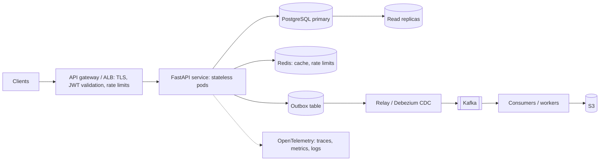
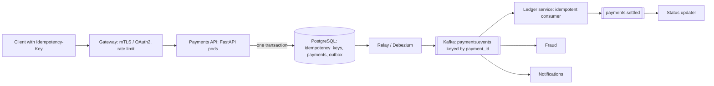
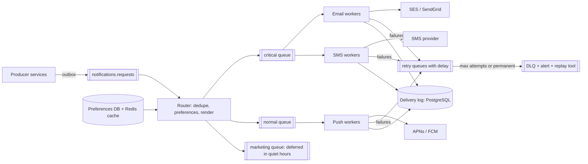
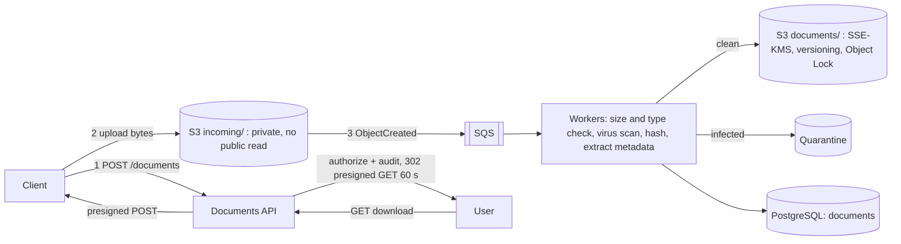
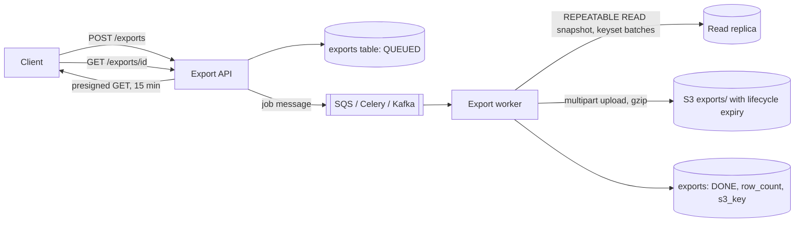

# System design

Six backend design walkthroughs sized for a 30-45 minute round, tuned to a Python (Flask and FastAPI) microservices role at a large financial-services firm.
X1 (payments with idempotency and the outbox) and X5 (breaking up a Flask monolith) are the most likely for this job description; rehearse them out loud with a timer.
The frame below works for any prompt; each walkthrough fills it in with numbers, endpoints, schema, and the failure modes interviewers probe.

Every code sample here was run on 2026-09-29 under Python 3.14.7 with FastAPI 0.142.0, Pydantic 2.13.5, SQLAlchemy 2.1.1, Flask 3.1.3, a2wsgi 1.10.10, boto3 1.43.105, and fakeredis 2.38.0 (with Lua support, standing in for Redis): 38 pytest tests passed.
SQL was run on SQLite; PostgreSQL-only syntax is marked where it appears.

---

## The step frame

Say the steps out loud so the interviewer can follow and steer.

1. **Requirements:** functional (what it does), non-functional (latency, availability, consistency, durability, compliance), and scale; ask, do not assume.
2. **Back-of-envelope numbers:** requests per second (average and peak), storage per day and per year, bandwidth; only as precise as the decision needs.
3. **API contract:** resources, methods, status codes, idempotency, pagination, versioning, auth.
4. **Data model:** tables or documents, keys, indexes, and which store and why.
5. **High-level diagram:** clients, edge, services, data stores, queues.
6. **Deep dives:** the one or two hardest parts, chosen with the interviewer.
7. **Scaling:** stateless services, caching, read replicas, partitioning, async work.
8. **Failure modes:** what breaks, how it is detected, how the system degrades, how it recovers.
9. **Observability:** metrics, logs, traces, alerts, and the SLO.
10. **Security:** authentication, authorization, data protection, audit.
11. **Trade-offs:** what you chose, what you gave up, and what you would change at 10x.

**Time plan for 45 minutes:** requirements and numbers 5-7, API and data model 8, diagram 5, deep dives 15, failure modes, observability, and security 7, wrap-up with trade-offs 3.

**Reference architecture most answers adapt:**



**Numbers worth memorizing:** 1 day is about 86,400 s (use 10^5); 1M requests per day is about 12 per second on average; peak is often 5-10x average for business-hours workloads; one well-indexed PostgreSQL primary handles thousands of simple writes per second and tens of thousands of indexed reads; a Python async worker handles hundreds to low thousands of simple I/O-bound requests per second per core; Redis handles on the order of 100k simple operations per second per node.
Treat these as orders of magnitude to justify a design, not facts to defend; say "I would load-test to confirm."

---

## X1. Design a payments (fund transfer) or order-submission API with exactly-once effect. (must know)

### Requirements

- **Functional:** a client submits a transfer (debit account, credit account, amount, currency); gets a payment ID and status; can query status; downstream systems (ledger, notifications, fraud, reporting) learn about it.
- **Non-functional:** **a retried request must never move money twice**; no lost payments once acknowledged; p99 under 300 ms for the accept path; 99.95%+ availability; full audit trail; strong consistency for balances.
- **Clarify:** synchronous settlement or accept-then-process?
  I assume the API **accepts** the instruction durably and settlement happens asynchronously, which is how most payment and order systems work.

### Numbers

- 5M payments per day: about 58 per second average; plan for 10x peaks (about 600 per second) around cut-off times.
- Storage: payment row about 1 KB, outbox event about 1 KB, idempotency record about 0.5 KB: about 12.5 GB per day, about 4.5 TB per year before indexes; partition by month and archive.
- One PostgreSQL primary handles this write rate comfortably; the design problem is correctness, not throughput.

### API

```text
POST /v1/payments
  Headers: Authorization: Bearer <token>, Idempotency-Key: <client-generated UUID>
  Body:    {"debit_account": "...", "credit_account": "...", "amount_minor": 12500, "currency": "USD"}
  201 Created  {"payment_id": "...", "status": "ACCEPTED", ...}
  201 + Idempotent-Replayed: true   same key, same body: the original response, no new payment
  422          same key, different body; or validation failure
  409          same key still in progress (only in the variant with an external call, below)
GET  /v1/payments/{payment_id}        status: ACCEPTED -> SETTLED | REJECTED
```

- Money as **integer minor units** (or `Decimal` in the API layer), never `float`; currency as ISO 4217.
- `Idempotency-Key` is the de facto standard (Stripe popularized it; an IETF HTTP API draft standardizes the header).
- The client ID comes from the verified OAuth2 token (client credentials flow), not from a header the caller controls; the header in the code below stands in for it.

### Data model and the core code

Three tables written in **one local transaction**: the idempotency record, the payment, and the outbox event.
The unique constraint on `(client_id, key)` is what makes duplicates impossible, including concurrent ones.

```python
import hashlib
import json
import uuid
from typing import Annotated

from fastapi import Depends, FastAPI, Header, HTTPException, Response
from pydantic import BaseModel, Field
from sqlalchemy import JSON, ForeignKey, String, UniqueConstraint, create_engine, select
from sqlalchemy.exc import IntegrityError
from sqlalchemy.orm import DeclarativeBase, Mapped, Session, mapped_column, sessionmaker


class Base(DeclarativeBase):
    pass


class IdempotencyKey(Base):
    __tablename__ = "idempotency_keys"
    __table_args__ = (UniqueConstraint("client_id", "key"),)
    id: Mapped[int] = mapped_column(primary_key=True)
    client_id: Mapped[str] = mapped_column(String(64))
    key: Mapped[str] = mapped_column(String(128))
    request_hash: Mapped[str] = mapped_column(String(64))
    status_code: Mapped[int]
    response_body: Mapped[dict] = mapped_column(JSON)


class Payment(Base):
    __tablename__ = "payments"
    id: Mapped[str] = mapped_column(String(36), primary_key=True)
    client_id: Mapped[str] = mapped_column(String(64))
    debit_account: Mapped[str] = mapped_column(String(34))
    credit_account: Mapped[str] = mapped_column(String(34))
    amount_minor: Mapped[int]            # integer minor units (cents); never float
    currency: Mapped[str] = mapped_column(String(3))
    status: Mapped[str] = mapped_column(String(16))


class Outbox(Base):
    __tablename__ = "outbox"
    seq: Mapped[int] = mapped_column(primary_key=True)
    payment_id: Mapped[str] = mapped_column(ForeignKey("payments.id"))
    event_type: Mapped[str] = mapped_column(String(64))
    payload: Mapped[dict] = mapped_column(JSON)


class PaymentRequest(BaseModel):
    debit_account: str = Field(min_length=1, max_length=34)
    credit_account: str = Field(min_length=1, max_length=34)
    amount_minor: int = Field(gt=0)
    currency: str = Field(pattern=r"^[A-Z]{3}$")


def request_fingerprint(req: PaymentRequest) -> str:
    return hashlib.sha256(json.dumps(req.model_dump(), sort_keys=True).encode()).hexdigest()


def create_payment(db: Session, client_id: str, key: str, req: PaymentRequest) -> tuple[int, dict, bool]:
    """Returns (status_code, body, replayed). One transaction: key row + payment + outbox event."""
    fingerprint = request_fingerprint(req)
    if req.debit_account == req.credit_account:
        raise HTTPException(422, "debit and credit accounts must differ")
    payment_id = str(uuid.uuid4())
    body = {"payment_id": payment_id, "status": "ACCEPTED", **req.model_dump()}
    try:
        with db.begin():
            db.add(IdempotencyKey(client_id=client_id, key=key, request_hash=fingerprint,
                                  status_code=201, response_body=body))
            db.flush()                 # unique (client_id, key) is checked here, first
            db.add(Payment(id=payment_id, client_id=client_id, status="ACCEPTED", **req.model_dump()))
            db.flush()                 # parent row before the outbox row that references it
            db.add(Outbox(payment_id=payment_id, event_type="PaymentAccepted", payload=body))
        return 201, body, False
    except IntegrityError:
        pass                           # the key exists: fall through and replay
    existing = db.scalars(
        select(IdempotencyKey).where(IdempotencyKey.client_id == client_id, IdempotencyKey.key == key)
    ).one()
    if existing.request_hash != fingerprint:
        raise HTTPException(422, "Idempotency-Key was already used with a different request body")
    return existing.status_code, existing.response_body, True


def build_app(database_url: str = "sqlite://") -> FastAPI:
    engine = create_engine(database_url)
    Base.metadata.create_all(engine)
    SessionLocal = sessionmaker(engine)

    def get_db():
        with SessionLocal() as db:
            yield db

    app = FastAPI()
    app.state.engine = engine

    @app.post("/v1/payments", status_code=201)
    def post_payment(
        req: PaymentRequest,
        response: Response,
        db: Annotated[Session, Depends(get_db)],
        idempotency_key: Annotated[str, Header(min_length=8, max_length=128)],
        x_client_id: Annotated[str, Header()],   # in production: from the verified OAuth2 token
    ):
        status_code, body, replayed = create_payment(db, x_client_id, idempotency_key, req)
        response.status_code = status_code
        if replayed:
            response.headers["Idempotent-Replayed"] = "true"
        return body

    return app
```

The tests prove: a retry with the same key returns the identical body with `Idempotent-Replayed: true` and creates no second payment or event; the same key with a different body is rejected; keys are scoped per client; and **eight threads racing with the same key create exactly one payment** (the losers hit the unique constraint and replay).

### Diagram



### Deep dives

- **Why the key row goes first in the same transaction:** a concurrent duplicate blocks on the unique index in PostgreSQL until the first transaction commits, then fails and replays the stored response; no window where both proceed.
- **The variant with an external call** (for example calling a card network or a core banking API that is not in your database): you cannot hold a database transaction open across it.
  Insert the key row with status `IN_PROGRESS` and commit; make the external call **with the same idempotency key passed downstream**; then store the result.
  A second request that finds `IN_PROGRESS` gets 409 (retry later); a crash leaves a stale `IN_PROGRESS` row that a recovery job resolves by querying the downstream system with the key.
- **Exactly-once effect end to end:** exactly-once delivery does not exist across a network; the design is at-least-once everywhere plus idempotency at every hop: client to API (idempotency key), API to Kafka (outbox, event ID), Kafka to ledger (dedupe on event ID in the ledger's transaction).
  See [Microservices and Messaging M7-M9](08-Microservices-and-Messaging.md).
- **Ledger correctness:** double-entry (every transfer is a debit and a credit that sum to zero), append-only entries, balances derived or updated in the same transaction with a check constraint or `SELECT ... FOR UPDATE` on the account rows (lock accounts in a consistent order, for example by account ID, to avoid deadlocks).
- **Idempotency key retention:** keep keys at least as long as clients may retry (24 hours to 7 days is common), then purge by time; document it in the API contract.

### Failure modes

| Failure | Behavior |
| --- | --- |
| Client times out and retries | Same key: stored response replayed, no second payment |
| Client retries with a new key | A genuine duplicate; mitigate with a business-level duplicate check (same accounts and amount within N minutes flagged for review) |
| API pod dies after commit, before responding | Client retries with the key and gets the stored response |
| Kafka is down | Payments are still accepted (the outbox buffers); events flow when Kafka recovers; alert on outbox age |
| Relay publishes twice | Consumers dedupe on event ID |
| Database primary fails | Managed failover (RDS Multi-AZ, Patroni); in-flight transactions fail and clients retry safely because of the key |
| Ledger rejects (insufficient funds) | Status becomes REJECTED via an event; the client polls or receives a webhook |

### Observability, security, trade-offs

- **Metrics:** accept rate, replay rate (a spike means clients are timing out), 422 and 409 rates, outbox lag (age of the oldest unpublished row), consumer lag, settlement latency; reconcile counts between payments and ledger entries daily.
- **Security:** OAuth2 client credentials or mTLS for service clients; authorization that the client may debit that account; no PAN or full account numbers in logs; encryption at rest; an immutable audit trail of every state change with who and when.
- **Trade-off stated:** accepting asynchronously gives availability and resilience but the client sees `ACCEPTED`, not `SETTLED`; if the business needs a synchronous answer, the ledger call moves into the request path with a timeout, and the API becomes as available as the ledger.
- Experience hook: **[fill in: how order or trade submission was made idempotent in the trading services you worked on, if applicable]**.

---

## X2. Design a rate limiter as a service or middleware.

The vault's case study covers the algorithms in depth: [Design a Rate Limiter](../../../04-System-Design/02-Case-Studies/02-Rate-Limiter/design.md).
This walkthrough focuses on how it plugs into Python services.

### Requirements

- Limit per client (API key or OAuth client ID), optionally per endpoint and per user; different tiers; return 429 with `Retry-After`.
- Low overhead (under 1-2 ms added); correct across many API pods; fail-open or fail-closed decided explicitly.
- **Clarify:** protection against abuse (coarse, at the edge) or fair usage quotas (per client, in the app)?

### Numbers

- 50k requests per second at the gateway, 1M active clients: one Redis operation per request is 50k operations per second, within one Redis node's range but with little headroom; shard by client key with Redis Cluster.
- State per bucket: two numbers plus key overhead, about 100 bytes: 1M clients is about 100 MB.

### Algorithm choice

| Algorithm | Behavior | Cost |
| --- | --- | --- |
| Token bucket | Allows bursts up to capacity, sustained rate R | 2 numbers per key |
| Leaky bucket | Smooths output to a fixed rate | Queue per key |
| Fixed window counter | Simple `INCR` + `EXPIRE`; 2x burst at window edges | 1 counter per key |
| Sliding window log | Exact | One entry per request (memory heavy) |
| Sliding window counter | Weighted previous and current window; good approximation | 2 counters per key |

I would pick a **token bucket**: it matches how clients behave (bursty), it is cheap, and the burst and rate map directly to product tiers.

In-process version and FastAPI middleware:

```python
import math
import threading
import time
from collections.abc import Callable
from dataclasses import dataclass

from fastapi import FastAPI, Request
from fastapi.responses import JSONResponse


@dataclass
class Bucket:
    tokens: float
    updated: float


class TokenBucketLimiter:
    """capacity = burst size, rate = sustained tokens per second, one bucket per key.

    In-process version; across many pods the same math runs atomically in Redis (a Lua script).
    """

    def __init__(self, capacity: int, rate: float, clock: Callable[[], float] = time.monotonic):
        self.capacity, self.rate, self.clock = capacity, rate, clock
        self._buckets: dict[str, Bucket] = {}
        self._lock = threading.Lock()

    def acquire(self, key: str, cost: float = 1.0) -> tuple[bool, float, float]:
        """Returns (allowed, tokens_left, retry_after_seconds)."""
        now = self.clock()
        with self._lock:
            b = self._buckets.get(key)
            if b is None:
                b = self._buckets[key] = Bucket(tokens=self.capacity, updated=now)
            b.tokens = min(self.capacity, b.tokens + (now - b.updated) * self.rate)  # lazy refill
            b.updated = now
            if b.tokens >= cost:
                b.tokens -= cost
                return True, b.tokens, 0.0
            return False, b.tokens, (cost - b.tokens) / self.rate


def add_rate_limiting(app: FastAPI, limiter: TokenBucketLimiter,
                      key_func: Callable[[Request], str]) -> None:
    @app.middleware("http")
    async def rate_limit(request: Request, call_next):
        allowed, left, retry_after = limiter.acquire(key_func(request))
        if not allowed:
            return JSONResponse(
                {"detail": "rate limit exceeded"}, status_code=429,
                headers={"Retry-After": str(math.ceil(retry_after)),
                         "RateLimit-Limit": str(limiter.capacity), "RateLimit-Remaining": "0"})
        response = await call_next(request)
        response.headers["RateLimit-Limit"] = str(limiter.capacity)
        response.headers["RateLimit-Remaining"] = str(int(left))
        return response
```

Distributed version: the read-refill-spend-write must be **atomic**, so it runs as one Lua script inside Redis:

```python
import redis

TOKEN_BUCKET_LUA = """
local capacity = tonumber(ARGV[1])
local rate = tonumber(ARGV[2])            -- tokens per second
local cost = tonumber(ARGV[3])
local t = redis.call('TIME')              -- server clock: no skew between API pods
local now = tonumber(t[1]) + tonumber(t[2]) / 1000000
local state = redis.call('HMGET', KEYS[1], 'tokens', 'ts')
local tokens = tonumber(state[1]) or capacity
local ts = tonumber(state[2]) or now
tokens = math.min(capacity, tokens + (now - ts) * rate)
local allowed = 0
if tokens >= cost then
  tokens = tokens - cost
  allowed = 1
end
redis.call('HSET', KEYS[1], 'tokens', tokens, 'ts', now)
redis.call('EXPIRE', KEYS[1], math.ceil(capacity / rate) * 2)
return {allowed, tostring(tokens)}        -- Lua numbers become integers in replies: send a string
"""


class RedisTokenBucket:
    """The whole read-refill-spend-write runs atomically inside Redis: no race between pods."""

    def __init__(self, client: redis.Redis, capacity: int, rate: float):
        self.capacity, self.rate = capacity, rate
        self._script = client.register_script(TOKEN_BUCKET_LUA)

    def acquire(self, key: str, cost: int = 1) -> tuple[bool, float]:
        allowed, tokens = self._script(keys=[f"rl:{key}"], args=[self.capacity, self.rate, cost])
        return bool(allowed), float(tokens)
```

Tested against fakeredis with Lua: a burst of capacity + 1 allows exactly capacity, tokens refill over time, eight threads hammering one key never get more than capacity, and idle keys expire.
Run it against a real Redis before relying on it; fakeredis is a faithful stand-in, not the server.

### Deep dives and failure modes

- **Where it lives:** coarse limits at the gateway (AWS API Gateway usage plans, Kong, Envoy), fine-grained per-client and per-endpoint limits in middleware where the authenticated client ID is known.
- **Redis down:** fail open (allow, log, alert) for general APIs; fail closed for expensive or abuse-prone endpoints (login, OTP, payment initiation); add a local in-process bucket as a backstop so a Redis outage does not remove all protection.
- **Latency:** one round trip per request; use `EVALSHA` (what `register_script` does) and a connection pool; for very hot paths, batch by reserving several tokens locally.
- **Hot keys:** one huge client on one Redis shard; split its limit across N sub-keys.
- **Headers:** `Retry-After` (standard), and `RateLimit-Limit` and `RateLimit-Remaining` style headers (an IETF draft; many APIs still use `X-RateLimit-*`).
- **Python pitfall:** the in-process limiter is per worker process; with 4 gunicorn workers and 10 pods, a "100 per second" in-process limit is really 4,000 per second.
- **Observability:** 429 rate per client and route, Redis latency, fail-open events.

---

## X3. Design a notification service (email, SMS, push) with retries, a DLQ, and user preferences.

### Requirements

- Other services publish "notify user U about event E"; the service renders a template, applies preferences, sends through providers (SES or SendGrid for email, Twilio or SNS for SMS, APNs and FCM for push), and records delivery status.
- User preferences: channels per category, opt-outs (marketing), quiet hours, locale.
- **Critical** notifications (fraud alert, password change, payment failure) must go out even if the user opted out of marketing, and quickly.
- At-least-once sending, no duplicate SMS on retries, auditable.

### Numbers

- 20M notifications per day: about 230 per second average; statement days and market events spike to 10-50x (thousands per second).
- Providers have their own rate limits (per sender, per account); **the queue absorbs the burst and workers drain it at the provider's rate**.
- Storage: a delivery record of about 500 bytes: about 10 GB per day; keep 90 days hot, archive the rest.

### API and events

```text
Kafka topic notifications.requests (key = user_id)
  {"event_id": "...", "user_id": "...", "category": "payment_failed", "priority": "critical",
   "template": "payment_failed_v3", "data": {...}}

GET  /v1/users/{user_id}/notification-preferences
PUT  /v1/users/{user_id}/notification-preferences
GET  /v1/notifications/{notification_id}          # status per channel
POST /v1/providers/{provider}/webhooks            # delivery receipts, bounces, unsubscribes
```

### Diagram



### Core decisions in code

```python
from dataclasses import dataclass, field
from datetime import datetime, time
from enum import Enum


class Priority(Enum):
    CRITICAL = "critical"         # security, fraud, payment failure: ignores quiet hours and opt-outs
    TRANSACTIONAL = "transactional"
    MARKETING = "marketing"


@dataclass
class Preferences:
    enabled: set[str] = field(default_factory=lambda: {"email", "push"})
    quiet_start: time = time(22, 0)
    quiet_end: time = time(7, 0)


def in_quiet_hours(now: time, start: time, end: time) -> bool:
    return start <= now or now < end if start > end else start <= now < end   # window may wrap midnight


def plan(priority: Priority, prefs: Preferences, local_now: datetime) -> tuple[list[str], bool]:
    """Returns (channels, defer). Critical always reaches at least one channel."""
    if priority is Priority.CRITICAL:
        return sorted(prefs.enabled | {"sms"}), False
    channels = sorted(prefs.enabled)
    defer = priority is Priority.MARKETING and in_quiet_hours(local_now.time(), prefs.quiet_start, prefs.quiet_end)
    return channels, defer


PERMANENT = {"invalid_number", "unsubscribed", "bad_token"}   # retrying cannot help


def on_failure(attempt: int, error: str, max_attempts: int = 5, base_s: int = 30) -> tuple[str, int]:
    """Decide ('retry', delay_seconds) or ('dlq', 0) after a failed send."""
    if error in PERMANENT or attempt >= max_attempts:
        return "dlq", 0
    return "retry", min(3600, base_s * 2 ** (attempt - 1))   # 30s, 60s, 120s, ... capped at 1h
```

### Deep dives

- **Kafka or RabbitMQ?**
  Kafka for the inbound request stream (replay, multiple consumers such as analytics and audit, ordering per user); RabbitMQ or SQS for the per-channel work queues, where per-message ack, delayed retry (TTL plus dead-letter exchange), and priorities are native.
  Either alone works; say which trade-off you are making.
- **Separate queues per priority and channel:** a marketing blast must never delay a fraud alert (a bulkhead).
- **No duplicate SMS:** dedupe key `(event_id, channel)` stored before sending (inbox pattern); pass it as the provider's idempotency key where supported; accept that a crash between send and record can still double-send, and make that window small.
- **Retries:** exponential backoff with a cap; classify permanent errors (invalid number, hard bounce, unregistered device token) straight to the DLQ and update the user's contact status; respect provider 429s with their `Retry-After`.
- **Provider failover:** a circuit breaker per provider and a secondary provider for critical channels.
- **Templates:** versioned, rendered with Jinja2 in a sandboxed environment with autoescaping for HTML email; localization by user locale.
- **Compliance:** honor unsubscribes immediately (CAN-SPAM, TCPA for SMS in the US); keep consent records; never put sensitive data (full account numbers, balances) in SMS or push bodies.

### Failure modes

- Provider outage: breaker opens, fail over or queue grows; alert on queue age, not length.
- Poison template (missing variable): permanent error, DLQ, alert the owning team; do not retry forever.
- Preference service down: use the cached preferences; for marketing, fail closed (do not send); for critical, send.
- Duplicate events from producers: dedupe on `event_id`.
- **Observability:** sent, delivered, bounced, failed per channel and provider; end-to-end latency from event to provider acceptance for critical alerts (the SLO, for example p99 under 30 s); DLQ depth.

---

## X4. Design a document upload and processing service (or a URL shortener).

### Requirements

- Clients (web, mobile, partner systems) upload documents up to 50 MB (statements, KYC documents, trade confirmations); the system virus-scans, extracts metadata, stores them durably, and lets authorized users download them.
- Upload must not tie up API workers; downloads must be access-controlled and audited; retention rules apply (financial records often 7 years).

### Numbers

- 100k uploads per day at an average of 2 MB: about 200 GB per day, about 73 TB per year; S3 lifecycle rules move older objects to Infrequent Access and then Glacier.
- Proxying 200 GB a day through Python API pods would waste their CPU and memory and hit request timeouts; **presigned URLs** let clients talk to S3 directly.

### API

```text
POST /v1/documents                  -> 201 {"document_id", "upload": {"url", "fields"}}   (status PENDING_UPLOAD)
  client POSTs the file to S3 with the returned fields
S3 ObjectCreated event -> SQS -> scanner/processor workers        (status SCANNING -> AVAILABLE | REJECTED)
GET  /v1/documents/{id}             -> metadata and status
GET  /v1/documents/{id}/download    -> 302 to a short-lived presigned GET URL (after authorization and audit)
```

### Data model

```text
documents(id PK, owner_id, s3_key UNIQUE, content_type, size_bytes, sha256, status,
          created_at, scanned_at, retention_until, legal_hold BOOLEAN)
document_access_log(id PK, document_id, user_id, action, at)       -- append-only audit
```

### Core code: presigned POST with a policy

```python
import uuid

import boto3
from botocore.config import Config

MAX_BYTES = 50 * 1024 * 1024
ALLOWED_TYPES = {"application/pdf", "image/png", "image/jpeg"}


def presign_upload(s3, bucket: str, owner_id: str, content_type: str, expires: int = 300) -> dict:
    """Client uploads straight to S3; the API never proxies file bytes.

    The policy pins the key, the content type, and a size range, so the URL cannot be
    reused to upload something else or something huge.
    """
    if content_type not in ALLOWED_TYPES:
        raise ValueError(f"unsupported content type {content_type!r}")
    key = f"incoming/{owner_id}/{uuid.uuid4()}"          # server-chosen key: no path tricks
    return s3.generate_presigned_post(
        Bucket=bucket,
        Key=key,
        Fields={"Content-Type": content_type},
        Conditions=[{"Content-Type": content_type}, ["content-length-range", 1, MAX_BYTES]],
        ExpiresIn=expires,
    )


def make_s3_client(region: str = "us-east-1"):
    # Credentials come from the workload's IAM role in production; nothing is hard-coded.
    # Force SigV4: without it this boto3 version signed the presigned POST with legacy SigV2 fields.
    return boto3.client("s3", region_name=region, config=Config(signature_version="s3v4"))
```

- The test decodes the signed policy and checks that the key, the content type, and the `content-length-range` are all pinned.
- **Found while testing:** a default `boto3.client("s3", region_name="us-east-1")` (boto3 1.43.105) produced legacy SigV2 fields (`AWSAccessKeyId`, `signature`) for the presigned POST; forcing `signature_version="s3v4"` produced SigV4 fields (`x-amz-algorithm`, `x-amz-signature`).
  Set it explicitly.
- **Presigned PUT versus POST:** a presigned PUT URL is simpler but cannot enforce a size range; a presigned POST policy can.

### Diagram and processing



### Failure modes and security

- Client never uploads: `PENDING_UPLOAD` rows expire via a sweeper; S3 lifecycle deletes orphaned `incoming/` objects after a day.
- Duplicate S3 events: SQS delivers at least once; the worker is idempotent on `s3_key` (status transitions only move forward).
- Scanner backlog: queue age alarm, autoscale workers on queue depth (KEDA on Kubernetes, or ECS target tracking).
- **Never trust the declared content type:** sniff magic bytes in the worker; reject executables; serve downloads with `Content-Disposition: attachment`.
- Encryption with SSE-KMS; bucket policy denies non-TLS access; Block Public Access on; **Object Lock** (WORM) where regulation requires immutability.
- Every download is authorized in the API (the presigned URL is short-lived and single-object) and logged.

### Variant: URL shortener in one minute

- Write path: `POST /v1/links` creates a unique integer ID (database sequence or Snowflake) and returns its base62 encoding; read path: `GET /{code}` does a cache-first lookup and returns 301 (cacheable, fewer hits) or 302 (every hit counted for analytics).
- Reads dominate (100:1), so Redis or a CDN in front of a key-value store; see the vault case study [Design a URL Shortener](../../../04-System-Design/02-Case-Studies/01-URL-Shortener/design.md).

```python
ALPHABET = "0123456789ABCDEFGHIJKLMNOPQRSTUVWXYZabcdefghijklmnopqrstuvwxyz"


def encode(n: int) -> str:
    """Base62 of a unique integer ID (from a sequence or Snowflake): 7 chars cover 62**7 = 3.5e12."""
    if n < 0:
        raise ValueError("id must be non-negative")
    out = []
    while True:
        n, r = divmod(n, 62)
        out.append(ALPHABET[r])
        if n == 0:
            return "".join(reversed(out))


def decode(s: str) -> int:
    n = 0
    for ch in s:
        n = n * 62 + ALPHABET.index(ch)
    return n
```

- Sequential IDs make codes guessable; if that matters, encrypt or permute the ID (for example a Feistel network over the integer) before encoding.

---

## X5. Break a Flask monolith into FastAPI microservices. (must know)

### Requirements and context

- A large Flask monolith (one PostgreSQL database, shared models, a deploy that takes an hour, teams blocking each other) must be moved to services without a big-bang rewrite and without downtime.
- **Clarify first:** what hurts?
  Release coupling, scaling one hot area, reliability of one module, team ownership?
  The answer decides what to extract first and whether to extract at all (a modular monolith may be enough; see [Microservices and Messaging M1](08-Microservices-and-Messaging.md)).

### The plan (strangler fig)

1. **Put a facade in front** (API gateway, NGINX, or an ASGI app) that routes every path to the monolith; no behavior change, but now routing is a switch you control.
2. **Add the safety net:** contract tests on the endpoints to be moved, request and response logging or shadow traffic, tracing through the monolith, and a baseline of latency and error rates.
3. **Modularize inside the monolith first:** draw the boundary (bounded context), move code behind an internal interface, and stop other modules from touching its tables.
4. **Extract one capability:** pick something with a clear boundary, real value, and low risk (not the core ledger first).
   Build it in FastAPI, with its own database schema.
5. **Migrate the data** (the hard part, below), then **route** a slice of traffic (shadow, then canary 1%, 10%, 100%) to the new service by path, with instant rollback by flipping the route.
6. **Delete** the old code path in the monolith; repeat.

A minimal in-process strangler facade (tested): new routes are served by FastAPI, everything else falls through to the untouched Flask app.

```python
from a2wsgi import WSGIMiddleware
from fastapi import FastAPI
from flask import Flask, jsonify


def create_legacy_app() -> Flask:
    legacy = Flask(__name__)

    @legacy.get("/orders/<int:order_id>")
    def get_order(order_id: int):
        return jsonify({"id": order_id, "served_by": "flask-monolith"})

    @legacy.get("/reports/daily")
    def daily_report():
        return jsonify({"served_by": "flask-monolith"})

    return legacy


def create_facade(migrated: set[str]) -> FastAPI:
    """Strangler facade: new FastAPI routes first, everything else falls through to Flask."""
    app = FastAPI()

    if "orders" in migrated:
        @app.get("/orders/{order_id}")
        async def get_order(order_id: int):
            return {"id": order_id, "served_by": "orders-service"}

    app.mount("/", WSGIMiddleware(create_legacy_app()))   # catch-all: must be registered last
    return app
```

- This is useful as a **first step** (one deployable, the new code in FastAPI, the same database); across the network the facade becomes the gateway or ingress routing by path.
- `starlette.middleware.wsgi.WSGIMiddleware` (re-exported by FastAPI) emits a deprecation warning in Starlette 1.7 pointing to `a2wsgi`, which is why the code imports from `a2wsgi`.

### The shared database problem

- The monolith's modules join each other's tables; the new service cannot own "its" tables while the monolith still writes them.
- **Sequence that works:**
  1. Inside the monolith, route all access to the target tables through one module (no cross-module joins; replace them with API-style calls or views).
  2. Give the new service its own schema or database; **sync data** from the monolith with CDC (Debezium) or dual writes through the outbox, and backfill history.
  3. Switch reads to the new service (verify with shadow reads and a comparison job), then switch writes, then make the old tables read-only and drop them later.
- **Expand and contract** for every schema change, because old and new code run side by side.
- **Reporting** that joined everything moves to a read model or warehouse fed by events or CDC, not back into cross-service joins.
- **Transactions** that spanned modules become sagas or stay inside one service; avoid splitting along a line that cuts a transaction you cannot make eventual.

### Flask to FastAPI specifics

| Flask | FastAPI |
| --- | --- |
| `request.json` plus manual validation or Marshmallow | Pydantic v2 models, automatic 422 errors, generated OpenAPI |
| Blueprints | `APIRouter` |
| `g`, `current_app`, extensions | `Depends` with `Annotated` dependencies, `lifespan` for resources |
| Flask-SQLAlchemy session per request | A session dependency with `yield`; async engine only if the whole path is async |
| WSGI (gunicorn sync or gthread) | ASGI (uvicorn, gunicorn with uvicorn workers) |

- **Do not make everything `async` by default:** a sync SQLAlchemy call inside `async def` blocks the event loop; FastAPI runs plain `def` endpoints in a thread pool, which is the right choice for sync libraries.
- Keep the API contract identical during extraction (same paths, fields, and error shapes), so clients do not notice; change the contract later, versioned.

### Failure modes and risks

- Distributed monolith: the new service calls the monolith synchronously on every request; fix the boundary or replicate the data it needs.
- Data drift between old and new stores during migration: reconciliation jobs with alerts on mismatch counts.
- Latency regression from new network hops: measure with traces before and after.
- Two sources of truth: define the cut-over moment for writes explicitly, and never let both sides accept writes for the same record.
- **Observability:** per-route traffic split, error rate and latency per implementation, comparison mismatches, CDC lag.
- Experience hook: **[fill in: a migration you led or took part in (the Python 3.8 migration of a 1M+ line codebase is on the resume): how you de-risked it, what you measured, what went wrong]**.

---

## X6. Design a reporting and data-export API over a large PostgreSQL table.

### Requirements

- Clients list and export trades or transactions for an account and a date range: an interactive paginated API and CSV export of up to millions of rows.
- Must not hurt the OLTP workload; exports must be complete and consistent; access controlled per account; large exports asynchronous.

### Numbers

- Table of 2 billion rows at about 200 bytes: about 400 GB plus indexes.
- A heavy account exports 1M rows at about 100 bytes of CSV each: about 100 MB; streaming at about 50k rows per second takes about 20 s, which is too long for a synchronous request behind a 30-60 s gateway timeout with any margin.
- **Rule:** stream synchronously below a threshold (for example 100k rows), otherwise create an asynchronous export job.

### API

```text
GET  /v1/accounts/{id}/trades?from=&to=&limit=100&cursor=...   -> {"items": [...], "next_cursor": "..."}
GET  /v1/accounts/{id}/trades.csv?from=&to=                     -> streamed CSV (small ranges)
POST /v1/exports {"account_id", "from", "to", "format": "csv"}  -> 202 {"export_id"}, Location header
GET  /v1/exports/{export_id}                                     -> {"status": "RUNNING|DONE|FAILED", "download_url"}
```

### Data model and indexes

- `trades(id, account_id, executed_at, symbol, quantity, price_minor, ...)` with an index on `(account_id, executed_at, id)`: it serves the filter, the sort, and the keyset comparison.
- **Partition** the table by month on `executed_at` (PostgreSQL declarative partitioning) so date-range queries prune partitions and old partitions can be archived.
- `exports(id, account_id, requested_by, params JSONB, status, row_count, s3_key, error, created_at, finished_at)` (JSONB is PostgreSQL-only).

### Core code: keyset pagination and a streaming CSV

```python
import base64
import csv
import io
import json
from collections.abc import Iterator
from datetime import datetime
from typing import Annotated

from fastapi import FastAPI, HTTPException, Query
from fastapi.responses import StreamingResponse
from sqlalchemy import Engine, String, create_engine, select, tuple_
from sqlalchemy.orm import DeclarativeBase, Mapped, Session, mapped_column


class Base(DeclarativeBase):
    pass


class Trade(Base):
    __tablename__ = "trades"
    id: Mapped[int] = mapped_column(primary_key=True)
    account_id: Mapped[str] = mapped_column(String(32), index=True)
    executed_at: Mapped[datetime] = mapped_column(index=True)
    symbol: Mapped[str] = mapped_column(String(16))
    quantity: Mapped[int]
    price_minor: Mapped[int]
    # PostgreSQL: CREATE INDEX ON trades (account_id, executed_at, id) serves both queries below.


def encode_cursor(executed_at: datetime, trade_id: int) -> str:
    raw = json.dumps([executed_at.isoformat(), trade_id]).encode()
    return base64.urlsafe_b64encode(raw).decode()


def decode_cursor(cursor: str) -> tuple[datetime, int]:
    try:
        ts, trade_id = json.loads(base64.urlsafe_b64decode(cursor.encode()))
        return datetime.fromisoformat(ts), int(trade_id)
    except (ValueError, TypeError) as exc:
        raise HTTPException(400, "invalid cursor") from exc


def page_query(account_id: str, after: tuple[datetime, int] | None, limit: int):
    stmt = select(Trade).where(Trade.account_id == account_id)
    if after is not None:
        # Keyset ("seek") pagination: O(limit) per page at any depth, stable under inserts.
        stmt = stmt.where(tuple_(Trade.executed_at, Trade.id) > after)
    return stmt.order_by(Trade.executed_at, Trade.id).limit(limit)


def csv_rows(engine: Engine, account_id: str, chunk: int = 1000) -> Iterator[str]:
    """Yield CSV text chunk by chunk; memory stays flat however many rows match."""
    buf = io.StringIO()
    writer = csv.writer(buf)
    writer.writerow(["id", "executed_at", "symbol", "quantity", "price_minor"])
    with Session(engine) as db:
        stmt = page_query(account_id, None, 10**9).execution_options(yield_per=chunk)
        for i, t in enumerate(db.scalars(stmt), start=1):
            writer.writerow([t.id, t.executed_at.isoformat(), t.symbol, t.quantity, t.price_minor])
            if i % chunk == 0:
                yield buf.getvalue()
                buf.seek(0)
                buf.truncate()
    yield buf.getvalue()


def build_app(engine: Engine) -> FastAPI:
    app = FastAPI()

    @app.get("/v1/accounts/{account_id}/trades")
    def list_trades(account_id: str, limit: Annotated[int, Query(ge=1, le=500)] = 100,
                    cursor: str | None = None):
        after = decode_cursor(cursor) if cursor else None
        with Session(engine) as db:
            rows = db.scalars(page_query(account_id, after, limit + 1)).all()   # one extra: has_more
        items, has_more = rows[:limit], len(rows) > limit
        return {
            "items": [{"id": t.id, "executed_at": t.executed_at.isoformat(), "symbol": t.symbol}
                      for t in items],
            "next_cursor": encode_cursor(items[-1].executed_at, items[-1].id) if has_more else None,
        }

    @app.get("/v1/accounts/{account_id}/trades.csv")
    def export_trades(account_id: str):
        return StreamingResponse(
            csv_rows(engine, account_id), media_type="text/csv",
            headers={"Content-Disposition": f'attachment; filename="trades-{account_id}.csv"'})

    return app


def make_engine(url: str = "sqlite://") -> Engine:
    engine = create_engine(url)
    Base.metadata.create_all(engine)
    return engine
```

The tests walk 2,500 rows (five per timestamp, so ties must be broken by `id`) in pages of 333 and see every row exactly once in order; a row inserted mid-scan does not shift the next page (offset paging would); a malformed cursor returns 400; and the CSV arrives in three chunks with all 2,500 rows.

- **Why keyset over `OFFSET`:** `OFFSET 1000000` makes the database read and discard a million rows per page, and rows shift when new data arrives; keyset seeks the index directly.
  Cost: no "jump to page 57," which reports rarely need.
- The row-value comparison `(executed_at, id) > (:ts, :id)` works in PostgreSQL and SQLite; it needs the unique `id` as a tie-breaker, or rows with equal timestamps are skipped or repeated.
- **`yield_per`** makes the ORM fetch in batches; on PostgreSQL with psycopg it also uses a server-side cursor (`stream_results`), so the driver does not load the whole result into memory.
- `StreamingResponse` iterates a sync generator in a thread pool, so the event loop is not blocked; a client that disconnects stops the iteration.

### Async export job



- **Consistency:** run the export in one `REPEATABLE READ` (snapshot) transaction so the file reflects one point in time, or define the export as "as of" a timestamp and filter on it.
- **Read replica** for exports so the primary serves OLTP; replica lag means "as of a few seconds ago," which is acceptable for reports; long queries on a hot-standby replica can be cancelled by replication conflicts, so set `max_standby_streaming_delay` or `hot_standby_feedback` deliberately (PostgreSQL settings).
- **Idempotent jobs:** a retried job overwrites the same S3 key; the status only moves forward.
- **Limits:** per-client concurrency limits on exports, a maximum date range, and statement timeouts on the reporting role.

### Failure modes, security, trade-offs

- Worker dies mid-export: the job's visibility timeout expires and another worker restarts it from scratch (or from a checkpointed cursor for very large exports).
- Replica lag spikes: surface "data as of" in the response; alert on lag.
- A giant export blocks others: separate queues and worker pools by size.
- **Security:** authorize account access on every request and in the worker (never trust the job message alone); exports contain sensitive data, so encrypt at rest, expire objects after N days, short-lived download URLs, and audit who exported what.
- **At 10x:** move reporting to a columnar store or warehouse (Redshift, Snowflake, BigQuery) fed by CDC, and keep the API as a thin layer over it.

---

## Go deeper

Vault notes:

- [Design a Rate Limiter](../../../04-System-Design/02-Case-Studies/02-Rate-Limiter/design.md)
- [Design a URL Shortener](../../../04-System-Design/02-Case-Studies/01-URL-Shortener/design.md)
- [Design a Real-Time Chat](../../../04-System-Design/02-Case-Studies/03-Real-Time-Chat/design.md)
- [System Design Basics](../../../04-System-Design/00-Concepts/system_design_basics.md)
- [Top 20 system design questions](../../../04-System-Design/top-20-questions.md)
- [Saga Pattern](../../../08-Distinguished-Engineering/05-Distributed-Transactions/saga_pattern.md)
- [Microservices vs Monolith](../../../08-Distinguished-Engineering/04-Architecture-Patterns/microservices_vs_monolith.md)
- [Microservices and gRPC in Python](../Python_Zero_to_Godhood/Chapter_63_Microservices_and_gRPC_in_Python.md)
- [Message Brokers: Kafka and RabbitMQ](../Python_Zero_to_Godhood/Chapter_76_Message_Brokers_Kafka_and_RabbitMQ.md)
- [Distributed Databases and the CAP Theorem](../Python_Zero_to_Godhood/Chapter_74_Distributed_Databases_Python_and_the_CAP_Theorem.md)

Pack siblings: [REST API Design](05-REST-API-Design.md), [SQL and SQLAlchemy](06-SQL-and-SQLAlchemy.md), [Auth and Security](07-Auth-and-Security.md), [Microservices and Messaging](08-Microservices-and-Messaging.md), [Docker, Kubernetes, CI/CD, Cloud](09-Docker-Kubernetes-CICD-Cloud.md).

Official docs and references:

- [Stripe idempotent requests](https://docs.stripe.com/api/idempotent_requests) and the [IETF Idempotency-Key header draft](https://datatracker.ietf.org/doc/draft-ietf-httpapi-idempotency-key-header/)
- [IETF RateLimit header fields draft](https://datatracker.ietf.org/doc/draft-ietf-httpapi-ratelimit-headers/)
- [S3 presigned URLs](https://docs.aws.amazon.com/AmazonS3/latest/userguide/using-presigned-url.html), [boto3 presigned URLs and POSTs](https://boto3.amazonaws.com/v1/documentation/api/latest/guide/s3-presigned-urls.html)
- [Strangler Fig Application (Martin Fowler)](https://martinfowler.com/bliki/StranglerFigApplication.html)
- [SQLAlchemy ORM querying and yield_per](https://docs.sqlalchemy.org/en/21/orm/queryguide/api.html), [FastAPI custom responses](https://fastapi.tiangolo.com/advanced/custom-response/)
- [Redis scripting with Lua](https://redis.io/docs/latest/develop/programmability/eval-intro/)
