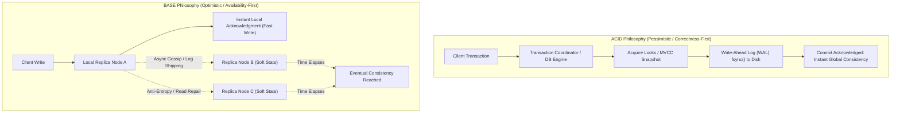
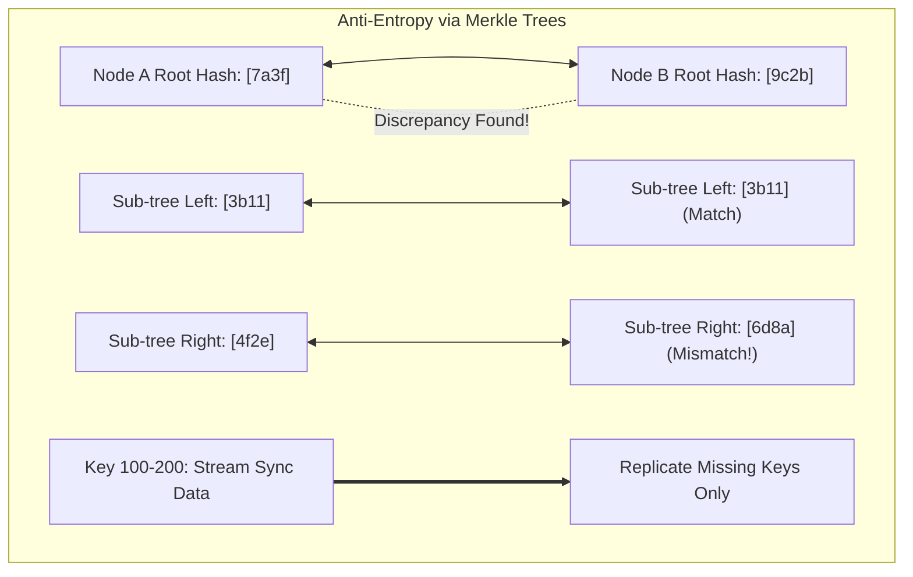

# ACID vs BASE

## TL;DR
ACID and BASE represent two opposing philosophies for managing data consistency and availability in database systems.
ACID guarantees strict transactional correctness: Atomicity (all-or-nothing), Consistency (invariants preserved), Isolation (concurrent transactions do not interfere), and Durability (committed writes survive crashes).
BASE prioritizes scale and availability in distributed environments: Basically Available (system remains functional despite node failures), Soft state (data states can shift without user input), and Eventual consistency (replicas converge over time).
ACID systems rely on Write-Ahead Logging (WAL) and multi-version concurrency control (MVCC) or two-phase locking (2PL), which introduces synchronization latency and scalability bottlenecks.
BASE systems accept temporary inconsistencies to maximize write throughput and resilience, shifting conflict resolution to asynchronous background gossip, read-repair, or application code.

## Mental Model
Think of an ACID database as a safety deposit bank vault.
When you open a box, an armed guard locks the gate behind you, inspects every item, and ensures the logbook is updated before unlocking the door.
If the guard's radio drops connection or the ink pen runs out, the transaction is rejected immediately.
Think of a BASE database as a decentralized social media feed.
You post an update from your phone in London; your friend in Tokyo sees the post 500 milliseconds later, and your friend in Sydney sees it after two seconds due to CDN replication delays.
The system never halted your post, even though the world temporarily held different perceptions of reality.



## How It Works (Internals)

### ACID Internals

#### 1. Atomicity
Atomicity ensures that a transaction containing multiple discrete operations is treated as a single indivisible unit of work.
If any step fails, all prior operations are rolled back.
- **Write-Ahead Logging (WAL)**: Before any data page is modified in RAM or written to table files, a log record describing the delta is appended sequentially to disk.
- **ARIES Recovery Algorithm**:
  1. *Analysis Pass*: Scans the WAL forward from the latest checkpoint to reconstruct the state of dirty page tables and active transactions at the time of the crash.
  2. *Redo Pass*: Repeats history forward, reapplying all logged operations (including those of uncommitted transactions) to return the database to the exact crash state.
  3. *Undo Pass*: Scans backward to roll back every transaction that was active and uncommitted at crash time, writing Compensation Log Records (CLRs) to ensure idempotency during re-crashes.

```mermaid
sequenceDiagram
    autonumber
    participant App as Application
    participant Engine as RDBMS Engine
    participant Buffer as Buffer Pool (RAM)
    participant WAL as Write-Ahead Log (Disk)
    participant Storage as Data Pages (Disk)

    App->>Engine: BEGIN TRANSACTION; UPDATE accounts SET balance = balance - 100;
    Engine->>Buffer: Modify data page in RAM (Dirty Page)
    Engine->>WAL: Append WAL Record (LSN 101, Undo/Redo info)
    WAL-->>Engine: Sequential Disk Append (Fast)
    App->>Engine: COMMIT;
    Engine->>WAL: Append COMMIT Record & fsync()
    WAL-->>Engine: fsync() Confirmed to Physical Platter/NVM
    Engine-->>App: Transaction Committed Successfully
    Note over Buffer,Storage: Asynchronous Checkpointer flushes Dirty Pages to Data Files later
```

#### 2. Consistency
In ACID, Consistency means **Application Invariant Preservation**:
- Declared schema rules, `CHECK` constraints, foreign keys, and unique indices must hold true before and after every committed transaction.
- If a constraint is violated, the transaction aborts.
*(Contrast this with Consistency in [[CAP-Theorem-and-PACELC|CAP]], which refers to Linearizability of reads across nodes).*

#### 3. Isolation
Isolation governs how concurrently executing transactions observe modifications made by one another.
The ANSI SQL-92 isolation levels were defined around three specific anomalies:
1. **Dirty Read (G1)**: Transaction $T_2$ reads uncommitted modifications made by $T_1$.
2. **Non-Repeatable Read (G2a)**: $T_1$ reads a row, $T_2$ updates or deletes that row and commits, and $T_1$ re-reads the row to find altered values.
3. **Phantom Read (A3)**: $T_1$ queries rows matching a predicate; $T_2$ inserts a new row matching that predicate and commits; $T_1$ re-executes the predicate and observes a new phantom row.

| Isolation Level | Dirty Read | Non-Repeatable Read | Phantom Read | Implementation Mechanism |
| :--- | :--- | :--- | :--- | :--- |
| **Read Uncommitted** | Permitted | Permitted | Permitted | Reads acquire zero locks; reads raw buffer pages |
| **Read Committed** | Prevented | Permitted | Permitted | Read locks released immediately after statement, or MVCC read-view per statement |
| **Repeatable Read** | Prevented | Prevented | Prevented* | Read locks held until transaction ends, or MVCC read-view frozen at transaction start |
| **Serializable** | Prevented | Prevented | Prevented | Strict Two-Phase Locking (SS2PL) or Serializable Snapshot Isolation (SSI) |

*\*Note: In MySQL InnoDB, Repeatable Read prevents phantoms using Next-Key Locking. In PostgreSQL, Repeatable Read is implemented via Snapshot Isolation, which prevents phantoms but permits **Write Skew**.*

#### 4. Durability
Durability guarantees that once a transaction commits, its effects survive power outages, operating system crashes, and reboots.
Durability requires flushing the WAL buffer to non-volatile storage using operating system sync primitives (`fsync()` or `fdatasync()`) before the commit call returns to the client.

### BASE Internals

#### 1. Basically Available
The system guarantees availability across failures by decomposing monolithic data dependencies:
- Requests for partition $A$ succeed even if partition $B$ is offline.
- When an individual node fails, routing layers dynamically redirect read and write operations to neighboring replica nodes.
- Degradation is graceful: if personal profile data cannot be retrieved, the system serves cached data or a generic template rather than failing the entire page load.

#### 2. Soft State
Soft state indicates that the stored data state can shift over time even without external user intervention.
Due to asynchronous replication pipelines, eventual consistency algorithms, and time-to-live (TTL) expiration policies, data values continuously evolve toward convergence.

#### 3. Eventual Consistency
Replicas in a BASE data store are permitted to diverge temporarily.
If no further updates are applied to a specific key, all replicas will eventually yield identical values.
BASE systems rely on three primary reconciliation mechanisms:
1. **Read Repair**: During a read operation with quorum $R > 1$, the client or coordinator node compares version timestamps returned by multiple replicas.
If a discrepancy is detected, the coordinator returns the freshest version to the client and asynchronously dispatches a background write to update the lagging replica.
2. **Hinted Handoff**: If a write coordinator discovers that a replica target is temporarily unreachable due to network partition or reboot, the coordinator stores a "hint" locally in a temporary directory.
Once heartbeats indicate the target node has recovered, the coordinator streams the buffered hints to catch the replica up.
3. **Anti-Entropy via Merkle Trees**: In the background, nodes exchange cryptographic hash trees (Merkle Trees) of their key ranges.
Comparing top-level root hashes allows nodes to identify and synchronize diverging sub-ranges in $O(\log N)$ network message complexity.



## Trade-offs and When to Use

| Architectural Property | ACID (Relational Paradigm) | BASE (Distributed NoSQL Paradigm) |
| :--- | :--- | :--- |
| **Consistency Guarantee** | Immediate, deterministic, linearizable | Eventual, probabilistic, monotonic read |
| **Availability Under Partitions** | Degrades or rejects writes (CP) | High availability preserved (AP) |
| **Scalability Dimension** | Primarily vertical; horizontal sharding requires distributed 2PC | Horizontally scalable across hundreds of commodity nodes |
| **Write Latency** | Bounded by synchronous disk `fsync()` and quorum consensus | Low latency bounded by memory buffer append or single replica commit |
| **Data Modeling** | Normalized schemas, foreign keys, declarative joins | Denormalized document/key-value models, application-level joins |
| **Concurrency Mechanism** | Pessimistic locks or multi-version snapshot isolation | Optimistic concurrency, CRDTs, or Last-Write-Wins (LWW) |

### Decision Framework
1. **Choose ACID when:**
   - Financial balances, double-entry accounting ledgers, and payment processing demand zero mathematical error tolerance.
   - Operations require cross-entity multi-row transactional coordination (e.g., deducting an inventory unit while simultaneously issuing an invoice).
   - The query workload heavily leverages complex multi-table SQL joins and aggregate grouping.
2. **Choose BASE when:**
   - Write throughput exceeds 100,000 IOPS and must scale horizontally without multi-node lock stalls.
   - The business domain tolerates temporary discrepancies (e.g., social feed likes, video view counters, shopping cart drafts, chat message histories).
   - Systems operate across geographically dispersed datacenters with high network latencies where synchronous multi-datacenter 2PC would cripple performance.

## Failure Modes and Pitfalls

### 1. Write Skew Anomaly (ACID Repeatable Read Pitfall)
- *Failure*: Two doctors are on call at a hospital.
The hospital rules state that at least one doctor must remain on call.
Both doctors simultaneously submit transactions to take leave under Snapshot Isolation (Repeatable Read).
Both transactions read that two doctors are on call.
Both transactions proceed to remove their respective doctor and commit.
Result: Zero doctors are on call!
- *Mitigation*: Promote the query to full **Serializable** isolation, or apply explicit pessimistic locks using `SELECT ... FOR UPDATE`.

```mermaid
sequenceDiagram
    autonumber
    participant T1 as Dr. Alice (Txn 1)
    participant DB as PostgreSQL (Repeatable Read)
    participant T2 as Dr. Bob (Txn 2)

    T1->>DB: BEGIN; SELECT COUNT(*) FROM doctors WHERE on_call = true;
    DB-->>T1: Returns 2 (Rule requires >= 1)
    T2->>DB: BEGIN; SELECT COUNT(*) FROM doctors WHERE on_call = true;
    DB-->>T2: Returns 2 (Rule requires >= 1)
    T1->>DB: UPDATE doctors SET on_call = false WHERE name = 'Alice';
    T2->>DB: UPDATE doctors SET on_call = false WHERE name = 'Bob';
    T1->>DB: COMMIT;
    T2->>DB: COMMIT;
    Note over DB: Write Skew Occurred: on_call count is now 0!
```

### 2. The BASE Tombstone Avalanche
- *Failure*: In an LSM-tree eventual consistency store (like Cassandra), deleting a record writes a "tombstone" marker with a timestamp.
If an application executes millions of deletes, read queries traversing that key range must scan and filter millions of tombstones from disk before finding live data, triggering memory exhaustion, massive GC pauses, and node crashes.
- *Mitigation*: Tune `tombstone_failure_threshold` and schedule aggressive table compaction during low-traffic windows.

### 3. Distributed Two-Phase Commit (2PC) Blocking
- *Failure*: An ACID system attempts to span multiple nodes using distributed 2PC.
The coordinator prepares all participants, but crashes before sending the `COMMIT` message.
All participant nodes remain blocked indefinitely holding table locks, stalling all subsequent transactions across the entire cluster.
- *Mitigation*: Replace 2PC with consensus-backed transaction engines (e.g., Spanner Paxos or CockroachDB Raft) or adopt the asynchronous [[saga_pattern|Saga Pattern]].

## Hands-On

### 1. Demonstrating Write Skew in PostgreSQL
To observe the classic Write Skew anomaly under Repeatable Read:

```sql
-- Setup test table
DROP TABLE IF EXISTS doctors;
CREATE TABLE doctors (
    id SERIAL PRIMARY KEY,
    name VARCHAR(50),
    on_call BOOLEAN NOT NULL
);

INSERT INTO doctors (name, on_call) VALUES ('Alice', true), ('Bob', true);

-- Terminal Session 1:
BEGIN TRANSACTION ISOLATION LEVEL REPEATABLE READ;
SELECT COUNT(*) FROM doctors WHERE on_call = true; -- Returns 2

-- Terminal Session 2:
BEGIN TRANSACTION ISOLATION LEVEL REPEATABLE READ;
SELECT COUNT(*) FROM doctors WHERE on_call = true; -- Returns 2

-- Session 1 executes update:
UPDATE doctors SET on_call = false WHERE name = 'Alice';
COMMIT;

-- Session 2 executes update:
UPDATE doctors SET on_call = false WHERE name = 'Bob';
COMMIT;

-- Inspect outcome:
SELECT * FROM doctors;
-- BOTH doctors are now on_call = false! Anomaly reproduced.
```

### 2. Python Lab: Eventual Consistency Convergence via Vector Clocks
Run this self-contained script to observe how divergent distributed writes converge using vector clocks:

```python
"""
Educational implementation of Vector Clock conflict resolution in a BASE data store.
No external dependencies required (Python 3.10+).
"""
from dataclasses import dataclass, field
from typing import Dict, Any, Tuple

@dataclass
class VersionedValue:
    val: Any
    vclock: Dict[str, int] = field(default_factory=dict)

class Node:
    def __init__(self, node_id: str):
        self.node_id = node_id
        self.store: Dict[str, VersionedValue] = {}

    def write(self, key: str, value: Any) -> VersionedValue:
        current = self.store.get(key, VersionedValue(val=None, vclock={}))
        new_vclock = dict(current.vclock)
        new_vclock[self.node_id] = new_vclock.get(self.node_id, 0) + 1
        entry = VersionedValue(val=value, vclock=new_vclock)
        self.store[key] = entry
        return entry

    def sync_from(self, peer_node: 'Node', key: str):
        if key not in peer_node.store:
            return
        local = self.store.get(key)
        remote = peer_node.store[key]

        if local is None:
            self.store[key] = remote
            return

        relation = self._compare_clocks(local.vclock, remote.vclock)
        if relation == "OLDER":
            self.store[key] = remote
        elif relation == "CONCURRENT":
            # Conflict detected: Application-level merge (e.g., combine items)
            merged_clock = {
                k: max(local.vclock.get(k, 0), remote.vclock.get(k, 0))
                for k in set(local.vclock) | set(remote.vclock)
            }
            merged_val = f"MERGED({local.val}, {remote.val})"
            self.store[key] = VersionedValue(val=merged_val, vclock=merged_clock)

    def _compare_clocks(self, c1: Dict[str, int], c2: Dict[str, int]) -> str:
        keys = set(c1.keys()) | set(c2.keys())
        c1_greater = any(c1.get(k, 0) > c2.get(k, 0) for k in keys)
        c2_greater = any(c2.get(k, 0) > c1.get(k, 0) for k in keys)

        if c1_greater and not c2_greater:
            return "NEWER"
        elif c2_greater and not c1_greater:
            return "OLDER"
        elif not c1_greater and not c2_greater:
            return "EQUAL"
        return "CONCURRENT"

def main():
    node_us = Node("US-East")
    node_eu = Node("EU-West")

    # Initial synchronized write
    v1 = node_us.write("cart:101", ["Laptop"])
    node_eu.sync_from(node_us, "cart:101")
    print(f"Synced state: US={node_us.store['cart:101'].val}, EU={node_eu.store['cart:101'].val}")

    # Concurrent disconnected writes during network partition
    print("\n--- Network Partition Active ---")
    node_us.write("cart:101", ["Laptop", "Mouse"])
    node_eu.write("cart:101", ["Laptop", "Headphones"])
    print(f"Diverged US: {node_us.store['cart:101'].val} {node_us.store['cart:101'].vclock}")
    print(f"Diverged EU: {node_eu.store['cart:101'].val} {node_eu.store['cart:101'].vclock}")

    # Network partition heals -> Sync occurs
    print("\n--- Partition Heals: Running Anti-Entropy Sync ---")
    node_us.sync_from(node_eu, "cart:101")
    print(f"Merged US State: {node_us.store['cart:101'].val}")
    print(f"Merged Vector Clock: {node_us.store['cart:101'].vclock}")

if __name__ == "__main__":
    main()
```

## Performance and Capacity
- **WAL fsync Latency Tax**:
  - Mechanical Hard Drive (HDD) rotational latency: $10\text{ ms}$ per sequential flush ($\approx 100\text{ commits/sec}$).
  - NVMe SSD: $20\text{ - }50\text{ }\mu\text{s}$ per flush ($\approx 20,000\text{ - }50,000\text{ commits/sec}$ single-threaded).
  - Group Commit optimization: Bundling multiple concurrent transaction commits into a single `fsync()` batch increases throughput by 10x to 50x under high concurrency.
- **Distributed Coordination Latency**:
  - Synchronous ACID across 3 cloud availability zones: $2\text{ - }5\text{ ms}$ round trip overhead per commit.
  - BASE local-write acknowledge: $< 0.5\text{ ms}$ write latency, independent of cross-region network status.

## In Production
- **Fintech Ledgers (Stripe, Square)**: Built on heavily audited ACID databases (primarily partitioned PostgreSQL and CockroachDB).
Every ledger balance modification is captured as a debit and credit entry within a strict transaction.
If the database cannot guarantee ACID properties, the payment API rejects the charge.
- **Amazon Retail Shopping Cart**: The original case study for BASE.
Amazon noticed that under extreme load or network disconnects, an unavailable shopping cart led to abandoned purchases.
They replaced their ACID cart database with Dynamo (a BASE precursor), enabling concurrent updates to shopping carts across multiple datacenters and merging conflicts via vector clocks at checkout time.

### Operational Checklist
- [ ] For relational ACID systems, audit slow queries for lock contention using `pg_stat_activity` or `sys.innodb_lock_waits`.
- [ ] Ensure WAL disk volume is mounted on dedicated high-IOPS storage with `writeback` cache backed by battery or enterprise capacitors.
- [ ] For BASE systems, establish automated monitoring on replication lag metrics (e.g., Kafka consumer group lag or Cassandra hinted handoff counts).

## Interview Questions

> [!question]
> **Question 1 (Junior):** What does each letter in ACID stand for, and what does Atomicity guarantee?
> [!success]- Answer
> ACID stands for Atomicity, Consistency, Isolation, and Durability. Atomicity guarantees that all operations within a transaction either succeed completely or fail completely, leaving the database state unaffected if an abort or crash occurs midway through execution.

> [!question]
> **Question 2 (Mid-Level):** Explain the difference between Consistency in ACID and Consistency in the CAP theorem.
> [!success]- Answer
> Consistency in ACID refers to application-defined invariant preservation: ensuring data satisfies declared rules, foreign keys, unique constraints, and schema checks. Consistency in the CAP theorem refers to Linearizability (atomic recency): ensuring that every read across all distributed nodes returns the most recently written value, eliminating stale reads.

> [!question]
> **Question 3 (Mid-Level):** What is the ARIES recovery algorithm and how does it guarantee durability after an unexpected crash?
> [!success]- Answer
> ARIES (Algorithm for Recovery and Isolation Exploiting Semantics) uses Write-Ahead Logging to restore system state after a crash through three sequential passes: (1) Analysis pass reconstructs the state of active transactions and dirty buffer pages at the time of the crash; (2) Redo pass reapplies all logged operations forward to return data files to the exact state at failure; and (3) Undo pass reverses operations executed by transactions that were uncommitted at crash time, logging Compensation Log Records (CLRs) to ensure crash-recovery idempotency.

> [!question]
> **Question 4 (Senior):** What is the Write Skew anomaly, and why does Snapshot Isolation fail to prevent it?
> [!success]- Answer
> Write Skew occurs when two concurrent transactions read overlapping data sets satisfying a shared invariant, and then make disjoint updates that individually preserve the invariant but collectively violate it (e.g., two on-call doctors both signing off simultaneously). Snapshot Isolation fails to prevent Write Skew because it only detects write-write conflicts on identical rows (First-Committer-Wins); because the two transactions updated different rows, both are permitted to commit.

> [!question]
> **Question 5 (Senior):** How does a BASE database like Cassandra achieve eventual consistency when replicas temporarily hold conflicting data?
> [!success]- Answer
> Cassandra uses a combination of three asynchronous techniques: (1) Read Repair, where read operations querying multiple replicas detect timestamp discrepancies and issue background updates to stale nodes; (2) Hinted Handoff, where coordinators buffer writes intended for temporarily dead nodes and replay them upon node recovery; and (3) Anti-Entropy Repair, where background processes compute and compare Merkle trees representing data ranges to identify and synchronize diverging keys.

> [!question]
> **Question 6 (Staff):** How would you design a distributed microservices workflow requiring ACID-like guarantees across multiple distinct database instances without using distributed 2PC?
> [!success]- Answer
> Implement the **Saga Pattern** combined with the **Transactional Outbox Pattern**: (1) Decompose the workflow into a series of local ACID transactions across participating microservices. (2) Each service commits its local transaction and atomically appends an event to an `outbox` table within the same local transaction. (3) A reliable change-data-capture agent (e.g., Debezium) streams outbox events to a broker (e.g., Kafka). (4) Subsequent services consume events and execute downstream local transactions. (5) If any intermediate step fails, an orchestrator or choreographing event chain invokes compensating transactions in reverse order to undo earlier changes.

> [!question]
> **Question 7 (Staff):** What are the hidden performance trade-offs of using Serializable Snapshot Isolation (SSI) compared to strict Two-Phase Locking (2PL)?
> [!success]- Answer
> 2PL is pessimistic: readers and writers block each other, leading to high lock-wait queues, thread context switching, and deadlock vulnerability under high contention. SSI is optimistic: readers never block writers, and transactions run using snapshot isolation while the engine tracks rw-antidependency cycles in a serialization graph (SIREAD locks). Under low to moderate contention, SSI achieves vastly superior throughput. However, under high write contention on hot data, SSI suffers from high transaction abort rates, forcing application-level retries that waste CPU and IO bandwidth.

> [!question]
> **Question 8 (Staff):** How do Conflict-Free Replicated Data Types (CRDTs) allow BASE databases to merge concurrent updates without data loss?
> [!success]- Answer
> CRDTs structure data using mathematical semi-lattices where concurrent update operations are guaranteed to be commutative, associative, and idempotent. In state-based CRDTs (CvRDTs), any two replica states can be merged via a monotonic join operator $\sqcup$ that yields an identical converged result regardless of message delivery order, packet duplication, or network interleaving, completely eliminating the need for destructive Last-Write-Wins (LWW) timestamp overwrites.

## Related
- [[03-normalisation-acid|DBMS Normalisation and ACID Notes]]: Foundations of relational normalization and ACID.
- [[CAP-Theorem-and-PACELC|CAP Theorem and PACELC]]: The distributed trade-offs governing ACID (CP) vs BASE (AP).
- [[saga_pattern|Saga Pattern]]: Distributed transaction management across microservices.
- [[PostgreSQL-Architecture|PostgreSQL Architecture]]: Deep dive into MVCC and WAL implementation.
- [[MySQL-and-InnoDB|MySQL and InnoDB]]: InnoDB redo/undo logs and transaction isolation.

## Further Reading
- Haerder, Theo, and Andreas Reuter. "Principles of transaction-oriented database recovery." *ACM Computing Surveys (CSUR)* 15.4 (1983): 287-317.
- Pritchett, Dan. "BASE: An ACID alternative." *ACM Queue* 6.3 (2008): 48-55.
- Berenson, Hal, et al. "A critique of ANSI SQL isolation levels." *ACM SIGMOD Record* 24.2 (1995): 1-10.
- Mohan, C., et al. "ARIES: a transaction recovery method supporting fine-granularity locking and partial rollbacks using write-ahead logging." *ACM TODS* 17.1 (1992): 94-162.
