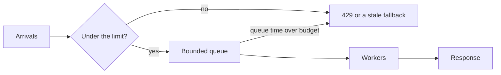

# Backpressure and Tail Latency

## TL;DR

A system falls over when it accepts more work than it can finish.
Backpressure tells the caller to slow down while the queue is still bounded.
Load shedding rejects work you already know you cannot finish inside the SLO.
Tail latency is the slow fraction of requests, and it dominates any user request that fans out.

## Little's law and the queue

Little's law says the average number of items in the system is arrival rate times average time in the system.
If the service handles 1,000 requests per second and each takes 50 ms of residence, about 50 requests are in flight.
If arrivals jump to 2,000 per second and the residence time stays 50 ms, you need 100 slots.
If you do not have them, residence time grows, and the law still holds with a worse latency.
An unbounded queue hides the overload until memory dies and every request is slow.

Put the bound at the edge, not only inside one library.
[[Load-Balancing]] that keeps sending to a sick instance defeats a local limit.
A token bucket or a concurrency limit per instance is the usual mechanism.
[[02-Rate-Limiter/design|The rate limiter]] is the shared version of the same idea.
[[Circuit-Breaker]] stops you from spending your budget on a dependency that is already failing.

## Why the tail owns the page

A user request that calls 100 shards waits for the slowest shard.
If one shard is slow on 1 percent of calls, the page is slow far more often than 1 percent.
Dean and Barroso's formula is the reason fan-out designs feel fragile.
Hedged requests send a second copy when the first exceeds a short percentile, and they cancel the loser.
Hedging without a tight cap doubles load during the incident you were trying to survive.
Retries need jitter, a budget, and a deadline that shrinks as the request moves downstream.
A retry of a non-idempotent write is a duplicate.
See [[Idempotency-and-Delivery]].

## Worked fan-out

Assume each shard answers in under 20 ms for 99 percent of calls, and the page needs all 50 shards.
The page is not a 99 percent, 20 ms page.
The chance every shard is fast is `0.99^50`, about 0.605.
About 40 percent of pages wait on at least one slow shard.
That is why a scatter-gather search box needs hedging, caching, or a smaller fan-out.

## Pitfalls

- A timeout that is longer than the client's timeout still occupies a worker.
  Cancel the downstream call.
- Shedding load with a generic HTTP 500 teaches clients to retry immediately.
  Use a distinct status and a `Retry-After` when you want them back.
- Autoscaling on CPU reacts after the queue is already deep.
  Scale on queue wait or concurrency, or shed first.
- CoDel and adaptive limits target queue delay, not queue length.
  A short queue of huge items can be healthier than a long queue of tiny ones.

## Interview questions

1. Your p50 is 15 ms and your p99 is 800 ms. Where do you look first.
2. Why can a 1 percent shard tail become a 40 percent page tail.
3. When is a retry harmful.
4. What do you drop first when the cluster is saturated: accepts, comments, or health checks.

## Further reading

- The Tail at Scale, CACM 2013.
- [[SLOs-and-Observability]] for the burn rate that should page you.
- [[Multi-Region-Active-Active]] for the extra tail a cross-region quorum adds.
