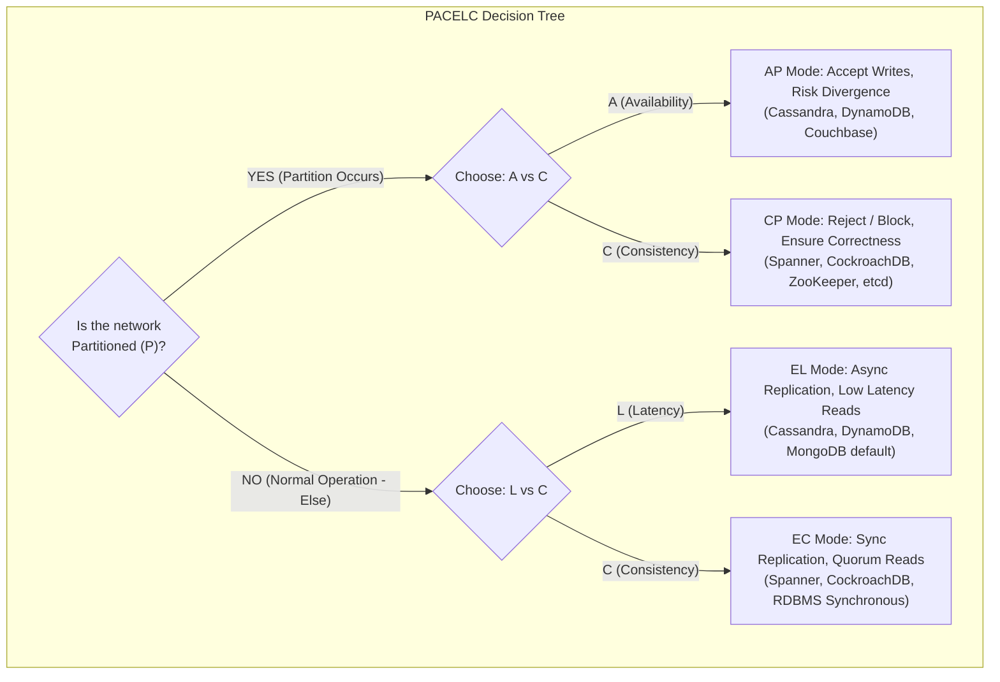
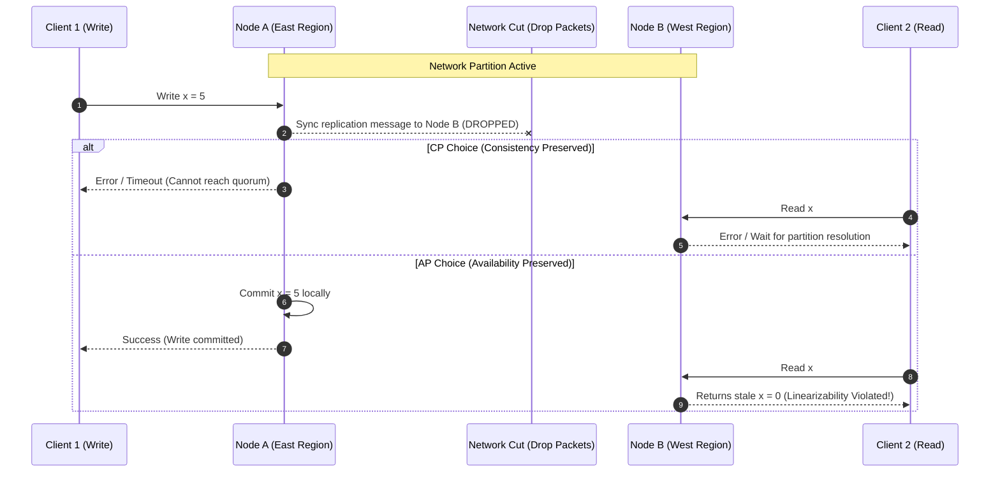

# CAP Theorem and PACELC

## TL;DR
The CAP theorem states that in the event of an asynchronous network partition, a distributed data store can guarantee either Linearizable Consistency (CP) or High Availability (AP), but not both.
The common colloquial formulation "pick two out of three" is a misleading myth because network partitions are physical certainties caused by switch failures, cable cuts, or GC pauses, making partition tolerance non-negotiable.
Daniel Abadi extended CAP to the PACELC theorem: If there is a **P**artition, trade off **A**vailability versus **C**onsistency; **E**lse (under normal operations), trade off **L**atency versus **C**onsistency.
CP systems (such as [[CockroachDB-Distributed-SQL|CockroachDB]] or Google Spanner) reject or stall writes when quorums cannot be reached, preserving correctness.
AP systems (such as [[Apache-Cassandra|Cassandra]] or Amazon DynamoDB) accept divergent concurrent writes across partitioned islands, deferring conflict resolution to read time.

## Mental Model
Imagine two bank branches in New York and London connected by a transatlantic undersea fiber cable.
A client deposits $1,000 in New York, and simultaneously another client attempts to withdraw $1,000 in London.
If the undersea cable is severed (a network partition), the London teller faces a binary dilemma.
If London rejects the withdrawal because it cannot confirm account balances with New York, the system chooses **Consistency (CP)** at the expense of Availability.
If London permits the withdrawal, both branches stay operational, but the bank risks double-spending, choosing **Availability (AP)** at the expense of Consistency.



## How It Works (Internals)

### Formal Proof Mechanics (Gilbert and Lynch, 2002)
The formal proof of Eric Brewer's conjecture relies on an asynchronous network model where message propagation delays are unbounded.
- **Consistency ($C$)**: Formally defined as *Linearizability* (atomic consistency).
Every read operation must return the value of the most recent write operation or throw an error.
All operations appear to execute instantaneously on a single globally ordered timeline.
- **Availability ($A$)**: Formally defined as *every non-failing node must return a non-error response to every received request*.
Returning an HTTP 500 Internal Server Error, a timeout, or a retry exception violates Availability under the CAP proof.
- **Partition Tolerance ($P$)**: The network is permitted to drop or delay an arbitrary number of messages transmitted between nodes.



If Node A and Node B cannot communicate, Node A cannot inform Node B of the update $x = 5$.
If Client 2 queries Node B, Node B can either:
1. Return its current local value ($x = 0$), violating Linearizability because a subsequent read did not reflect the completed write on Node A (AP).
2. Refuse to answer or block indefinitely, violating Availability because a healthy, non-failing node failed to return a successful response (CP).

### The PACELC Theorem Deep Dive
The CAP theorem only analyzes system behavior during rare network partitions.
In the real world, enterprise networks run without partitions 99.9% of the time.
Daniel Abadi demonstrated that distributed storage architectures are fundamentally shaped by the trade-off made during **normal operations**: Latency ($L$) versus Consistency ($C$).

| PACELC Classification | Partition Behavior | Normal Operation Behavior | Archetypal Databases |
| :--- | :--- | :--- | :--- |
| **PC / EC** | Consistency over Availability | Consistency over Latency | Google Spanner, [[CockroachDB-Distributed-SQL\|CockroachDB]], [[Apache-ZooKeeper\|ZooKeeper]], etcd |
| **PA / EL** | Availability over Consistency | Latency over Consistency | [[Apache-Cassandra\|Apache Cassandra]], Amazon DynamoDB, Couchbase |
| **PA / EC** | Availability over Consistency | Consistency over Latency | MongoDB (with writeConcern `majority`, readPreference `primary`) |
| **PC / EL** | Consistency over Availability | Latency over Consistency | Megastore (historical), Yahoo! PNUTS (relaxing master lock latency) |

In a **PC/EC** system, every normal write must traverse synchronous two-phase commit or Paxos/Raft rounds across a majority quorum before acknowledging the client.
This incurs a latency penalty equal to the slowest round-trip time among the quorum nodes, but guarantees linearizability.
In a **PA/EL** system, normal writes acknowledge as soon as local memory/WAL commits on the primary or local node, replicating asynchronously to replicas in the background.
This achieves single-digit millisecond latency, but leaves a window where replica reads yield stale data.

## Trade-offs and When to Use

| Dimension | CP / PC-EC Systems | AP / PA-EL Systems |
| :--- | :--- | :--- |
| **Data Integrity** | Absolute; zero data anomalies, no dirty reads, no phantom overwrites | Eventual; requires conflict resolution (LWW, CRDTs, or vector clocks) |
| **System Behavior in Partition** | Nodes reject operations with exceptions, backpressure, or timeouts | Nodes continue accepting reads and writes locally |
| **Write Latency** | High; bounded by multi-node network round trips ($2 \times \text{RTT}$) | Ultra-low; bounded by local disk write or in-memory ring buffer |
| **Read Latency** | Low to medium; reads must consult leader or verify lease validity | Ultra-low; reads can be served by any local node replica |
| **Architectural Complexity** | Concentrated in consensus state machines (Raft/Paxos, lease management) | Concentrated in application-tier reconciliation and divergent write merging |

### Decision Guide
1. **Choose CP (PC/EC) when:**
   - Business invariants cannot tolerate divergence (e.g., banking ledgers, stock trading order matching, inventory decrementing, flight seat reservations).
   - The cost of an incorrect read or phantom update exceeds the cost of a temporary 30-second service unavailability during leader re-election.
   - You need strong coordination primitives like distributed locks, leader leases, or configuration registries (e.g., Kubernetes etcd, Consul).
2. **Choose AP (PA/EL) when:**
   - Availability directly drives business revenue and user retention (e.g., social media feeds, IoT telemetry ingestion, shopping cart additions, product review views).
   - Data can be modeled as append-only or idempotent operations where commutative conflict resolution (CRDTs) can automatically merge diverging histories.
   - Operations must succeed in disconnected, edge, or intermittently connected environments (e.g., mobile offline sync, point-of-sale terminals).

## Failure Modes and Pitfalls

### 1. Split-Brain Syndrome (Improper Quorum Handling)
- *Failure*: An AP system or a misconfigured CP cluster with an even number of nodes partitions into two equal halves.
Both halves believe the other is dead, elect independent leaders, and accept conflicting writes for the same keys.
- *Mitigation*: Strictly mandate odd node cluster counts ($2F + 1$) and require strict majority quorums ($Q = \lfloor N/2 \rfloor + 1$).
A minority partition cannot form a quorum and must refuse writes immediately.

### 2. The Fallacy of "Last-Write-Wins" (LWW)
- *Failure*: AP stores relying on wall-clock timestamps (like Cassandra LWW) drop valid business updates due to clock drift (NTP skew).
A node whose clock is 50 ms fast will silently overwrite updates from a node with an accurate clock, causing silent data loss.
- *Mitigation*: Avoid LWW for critical business entities; use Conflict-Free Replicated Data Types (CRDTs) or version vectors to capture concurrent updates.

### 3. False Availability Claims
- *Failure*: An engineering team claims their microservice is "100% available" because it returns an HTTP 200 with an empty JSON array `{ "data": [] }` during database partitions.
- *Mitigation*: Classify degraded fallback payloads as partial outages; measure *Semantic Availability* rather than pure HTTP status codes.

## Hands-On

### 1. Simulating Network Partitions with Linux Network Namespaces and `iptables`
This script creates two isolated network namespaces running HTTP servers and simulates a network partition by blocking packet flow across the virtual veth bridge.

```bash
#!/usr/bin/env bash
set -euo pipefail

# 1. Setup isolated network namespaces for Node A and Node B
sudo ip netns add node_a
sudo ip netns add node_b

# 2. Create virtual ethernet link between nodes
sudo ip link add veth_a type veth peer name veth_b
sudo ip link set veth_a netns node_a
sudo ip link set veth_b netns node_b

# 3. Assign IP addresses
sudo ip netns exec node_a ip addr add 10.0.0.1/24 dev veth_a
sudo ip netns exec node_a ip link set veth_a up
sudo ip netns exec node_b ip addr add 10.0.0.2/24 dev veth_b
sudo ip netns exec node_b ip link set veth_b up

# 4. Verify connectivity before partition
echo "Testing connectivity before partition..."
sudo ip netns exec node_a ping -c 2 10.0.0.2

# 5. INJECT NETWORK PARTITION: Drop all traffic between Node A and Node B
echo "Injecting network partition via iptables..."
sudo ip netns exec node_a iptables -A OUTPUT -d 10.0.0.2 -j DROP
sudo ip netns exec node_b iptables -A OUTPUT -d 10.0.0.1 -j DROP

# 6. Verify partition (this should fail / timeout)
echo "Verifying partition (ping should now drop packets)..."
sudo ip netns exec node_a ping -c 2 -W 1 10.0.0.2 || echo "Packets dropped successfully: Partition simulated."

# 7. TEAR DOWN / HEAL PARTITION
sudo ip netns exec node_a iptables -F
sudo ip netns exec node_b iptables -F
sudo ip netns del node_a
sudo ip netns del node_b
echo "Cleanup complete."
```

### 2. Python Simulation: CP vs AP Behavior Under Partition
Run this self-contained script to observe how CP versus AP nodes handle partition events:

```python
"""
Self-contained educational simulator comparing CP vs AP stores during a partition.
No external dependencies required (Python 3.10+).
"""
import time
from dataclasses import dataclass, field
from typing import Optional, Dict

@dataclass
class Node:
    name: str
    store: Dict[str, str] = field(default_factory=dict)
    peers: list['Node'] = field(default_factory=list)
    isolated: bool = False

    def write_cp(self, key: str, value: str) -> bool:
        # CP: Requires majority acknowledgment
        if self.isolated:
            raise RuntimeError(f"[{self.name}] CP Write Failed: Node cannot reach consensus majority.")
        self.store[key] = value
        for peer in self.peers:
            if not peer.isolated:
                peer.store[key] = value
        return True

    def write_ap(self, key: str, value: str) -> bool:
        # AP: Writes succeed locally regardless of partition
        self.store[key] = value
        for peer in self.peers:
            if not peer.isolated:
                peer.store[key] = value
        return True

    def read(self, key: str) -> Optional[str]:
        return self.store.get(key)

def run_simulation():
    node1 = Node(name="East-Node")
    node2 = Node(name="West-Node")
    node1.peers = [node2]
    node2.peers = [node1]

    # Baseline write under normal conditions
    node1.write_cp("balance", "100")
    print(f"Normal State: East={node1.read('balance')}, West={node2.read('balance')}")

    # Introduce network partition: Isolate West-Node
    print("\n--- Network Partition Injected: West-Node is severed ---")
    node1.isolated = True
    node2.isolated = True

    # 1. Test CP Mode
    print("\nAttempting CP write on isolated West-Node...")
    try:
        node2.write_cp("balance", "200")
    except RuntimeError as e:
        print(f"CP Enforcement: {e}")

    # 2. Test AP Mode
    print("\nAttempting AP write on both isolated nodes...")
    node1.write_ap("balance", "500")  # East accepts write
    node2.write_ap("balance", "900")  # West accepts write
    print(f"AP Result (Divergent State!): East={node1.read('balance')}, West={node2.read('balance')}")
    print("Linearizability broken: Divergence must be merged when partition heals.")

if __name__ == "__main__":
    run_simulation()
```

## Performance and Capacity
- **Quorum Intersection Math**:
  In a cluster of $N$ replicas, if write quorum is $W$ and read quorum is $R$:
  - When $R + W > N$, the read set and write set must overlap by at least one node containing the latest version ($Q_{overlap} = R + W - N \ge 1$).
  - When $R + W \le N$, reads may query nodes that missed the latest write, allowing stale reads.
- **Latency Calculations (Paxos/Raft Round Trips)**:
  - Local DC Paxos: $2 \times \text{RTT} \approx 2 \times 0.5\text{ ms} = 1.0\text{ ms}$ overhead per write.
  - Cross-Region Paxos (e.g., Virginia to California, RTT $\approx 70\text{ ms}$):
    Each CP write incurs $2 \times 70\text{ ms} = 140\text{ ms}$ minimum latency overhead.
  - In an AP store using asynchronous replication, local writes return in $< 2\text{ ms}$, with cross-region sync running out-of-band.

## In Production
- **Google Cloud Spanner**: Provides external consistency (strict serializability) globally while operating as a CP system under partitions.
To minimize the consistency latency tax under normal operations (the "E-C" in PACELC), Spanner uses **TrueTime**, an API backed by synchronized GPS receivers and atomic clocks with bounded uncertainty ($\epsilon \approx 1-7\text{ ms}$).
Instead of waiting for multi-round global consensus on reads, transactions wait out the clock uncertainty ($\text{wait } 2\epsilon$) to establish monotonic commit timestamps.
- **Amazon DynamoDB**: Designed explicitly as an AP/EL store for retail shopping carts.
During an infrastructure partition, Amazon decided that dropping an "Add to Cart" request resulted in lost revenue, whereas showing a slightly stale cart or merging items later was completely acceptable to customers.

### Operational Checklist
- [ ] Ensure all CP distributed clusters (etcd, ZooKeeper, CockroachDB) are provisioned with an odd number of nodes (3, 5, or 7).
- [ ] In multi-datacenter CP deployments, never place an even number of nodes across two regions; always place an arbiter or third node in a distinct third availability zone or region.
- [ ] For AP data stores, verify that client drivers are explicitly configured with bounded timeouts and read-repair/anti-entropy jobs (e.g., Cassandra `nodetool repair`).

## Interview Questions

> [!question]
> **Question 1 (Junior):** What does each letter in the CAP theorem stand for, and can you choose all three in a distributed system?
> [!success]- Answer
> C stands for Consistency (linearizability), A stands for Availability (every non-failing node returns a non-error response), and P stands for Partition Tolerance (tolerance of dropped or delayed network messages). You cannot choose all three because network partitions are physical phenomena that cannot be eliminated. When a partition occurs, a system must choose between serving potentially stale data (AP) or rejecting requests to maintain correctness (CP).

> [!question]
> **Question 2 (Mid-Level):** What is the core limitation of the CAP theorem that the PACELC theorem resolves?
> [!success]- Answer
> The CAP theorem only describes system trade-offs when an active network partition exists, which represents less than 0.1% of operational lifetime. The PACELC theorem extends this by analyzing system behavior during normal (non-partitioned) execution: If there is a Partition (P), trade off Availability (A) versus Consistency (C); Else (E), trade off Latency (L) versus Consistency (C). This explains why systems like Cassandra choose low latency over strong consistency even when networks are healthy.

> [!question]
> **Question 3 (Mid-Level):** If an AP database returns an HTTP 500 error during a network partition, has it maintained Availability according to CAP?
> [!success]- Answer
> No. Under the formal Gilbert and Lynch definition, Availability requires every non-failing node to return a successful, non-error response. Returning an HTTP 500, a timeout, or a custom error code violates Availability just as much as dropping the connection entirely.

> [!question]
> **Question 4 (Senior):** Explain how quorum intersection ($R + W > N$) guarantees strong consistency in an AP-capable database like Cassandra.
> [!success]- Answer
> In a cluster of $N$ replicas, configuring read quorum $R$ and write quorum $W$ such that $R + W > N$ ensures by the Pigeonhole Principle that at least one replica in the read set was part of the successful write set. As long as each write is tagged with a strictly monotonic timestamp or version number, the reading client can identify and return the latest version, synthesizing strong consistency on top of a peer-to-peer distributed architecture.

> [!question]
> **Question 5 (Senior):** Is Google Cloud Spanner a CA database? Why or why not?
> [!success]- Answer
> No. Spanner is strictly a CP database. Eric Brewer noted that while Spanner achieves "five nines" (99.999%) availability in practice due to Google's redundant private fiber network, if a true network partition isolates a minority region, Spanner nodes in that region will refuse writes and block until partition resolution to maintain strict serializability, proving it is fundamentally a CP/PC-EC system.

> [!question]
> **Question 6 (Staff):** How does network asymmetry (where Node A can talk to Node B, but Node B cannot talk to Node A) challenge simple CAP assumptions, and how do modern consensus algorithms handle it?
> [!success]- Answer
> Real-world partitions are rarely clean bipartite cuts; asymmetric partitions, packet corruption, and unidirectional drops create complex split states. In naive Raft implementations, an isolated node that can receive heartbeats but cannot reply might continuously trigger elections and increment the term counter, disrupting the healthy cluster when reconnected. Modern implementations add a **Pre-Vote phase**, where a candidate node must solicit speculative approval from a quorum before incrementing its term, preventing partition flappings from destabilizing the leader.

> [!question]
> **Question 7 (Staff):** How would you design a distributed financial ledger that requires CP semantics for account balance updates but AP semantics for audit logging?
> [!success]- Answer
> Implement a polyglot, dual-tier persistence architecture: (1) Route ledger debit/credit transactions to a strictly CP database (e.g., CockroachDB or PostgreSQL with synchronous replication) using strict serializable isolation to prevent double spending. (2) Upon transaction commit, emit an asynchronous event via an outbox pattern to a distributed log (e.g., Kafka). (3) Stream audit log entries into an AP/EL data store (e.g., Cassandra or S3) optimized for high write throughput and append-only availability. If the audit store experiences a network partition, ledger transactions continue committing while audit entries buffer locally.

> [!question]
> **Question 8 (Staff):** What is the difference between Linearizability (CAP Consistency) and Serializability (ACID Consistency)?
> [!success]- Answer
> Linearizability is a real-time recency guarantee on single operations applied to individual objects: once a write completes in physical time, all subsequent reads across all nodes must observe that write or a later one. Serializability is a multi-operation, multi-object transactional isolation guarantee: transactions execute concurrently such that the outcome is equivalent to some sequential execution, but with no guarantee regarding real-world wall-clock order. A system offering both is termed **Strictly Serializable** (External Consistency).

## Related
- [[Consistency-Models|Consistency Models]]: Detailed hierarchy of consistency from linearizable to eventual.
- [[ACID-vs-BASE|ACID vs BASE]]: Transactional philosophy contrasts between relational and distributed databases.
- [[Apache-Cassandra|Apache Cassandra]]: Deep dive into an archetypal PA/EL distributed database.
- [[CockroachDB-Distributed-SQL|CockroachDB]]: Deep dive into a modern PC/EC distributed SQL database.
- [[Chapter_74_Distributed_Databases_Python_and_the_CAP_Theorem|Chapter 74 Distributed Databases and CAP]]: Python implementations of distributed databases and CAP.

## Further Reading
- Brewer, Eric. "CAP twelve years later: How the 'rules' have changed." *Computer* 45.2 (2012): 23-29.
- Gilbert, Seth, and Nancy Lynch. "Brewer's conjecture and the feasibility of consistent, available, partition-tolerant web services." *ACM SIGACT News* 33.2 (2002): 51-59.
- Abadi, Daniel J. "Consistency tradeoffs in modern distributed database system design: CAP is only part of the story." *Computer* 45.2 (2012): 37-42.
- Kleppmann, Martin. "A Critique of the CAP Theorem." *arXiv preprint arXiv:1509.05393* (2015).
