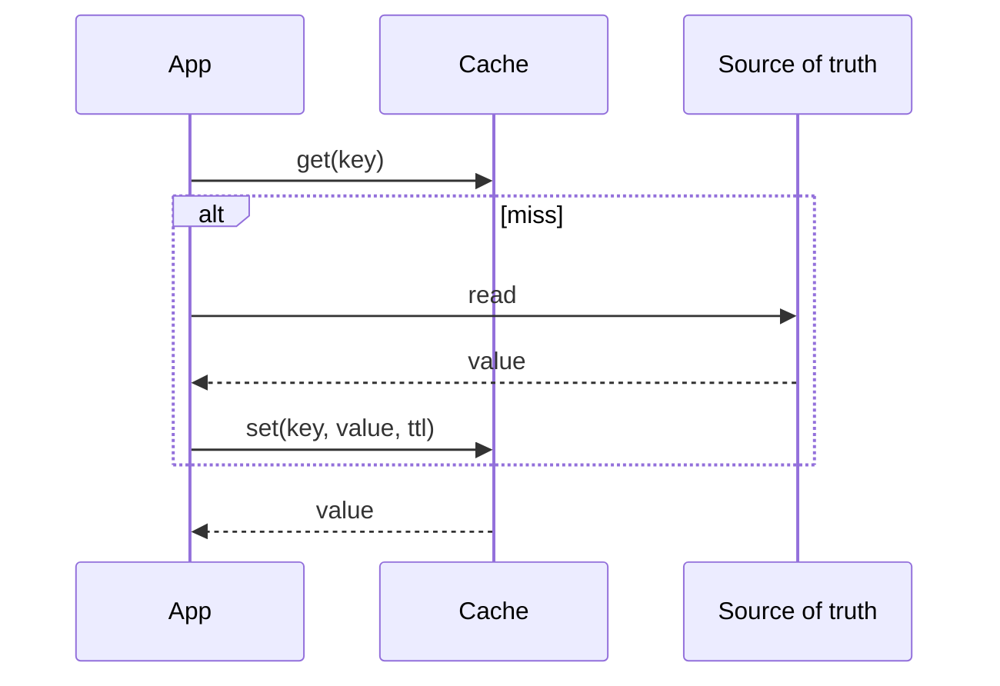

# Caching and Invalidation

## TL;DR

A cache stores a computed answer closer to the reader than the source of truth.
It is fast because it is allowed to be wrong for a bounded time, or until an explicit invalidation lands.
The design problem is not the lookup.
It is who is allowed to fill the cache, and how a write becomes visible.

## Patterns

Cache-aside means the application reads the cache, and on a miss reads the database and fills the cache.
The cache does not know the query.
Read-through hides that miss inside the cache process.
Write-through updates the cache and the database before the write returns.
Write-back acknowledges the write from the cache and flushes later.
Write-back is a durability feature pretending to be a cache.
Treat a write-back tier as a database, with its own replication, or do not use it for data you cannot lose.

Invalidation has three practical tools.
A TTL forgets the value after a deadline.
An explicit delete drops the key when the write commits.
A versioned key (`user:42:v17`) makes the old entry unreachable, and the old entry expires on its own.
Explicit delete races with a stale fill.
The sequence is: writer deletes the key, an in-flight reader misses, the reader loads the old row, the reader writes the old row back into the cache.
Leases, or filling only if the database version is still current, close that race.
Facebook's memcache paper is the reference for leases at this scale.

## Stampede and hot keys

A stampede happens when a popular key expires and thousands of requests miss together.
They all hit the database.
One of them should recompute.
The rest should wait for that result or serve a slightly stale value.

- Singleflight coalesces concurrent misses for the same key in one process.
- A short lock in [[Redis-Architecture]] does the same across a fleet, and the lock holder must have a timeout.
- Probabilistic early expiration recomputes before the TTL, with probability rising as the deadline approaches.
- Stale-while-revalidate returns the expired value and refreshes in the background.

A hot key melts one cache shard even when the data fits in memory.
Replicate that key to every application process, or shard the key into `key:{0..k}` and read a random shard.
[[Consistent-Hashing]] spreads cold keys.
It concentrates a celebrity key on one node on purpose.
[[10-E-Commerce-Flash-Sale/design|The flash-sale study]] shows the same problem for inventory.

## Worked bound

A cache of the newest 20 million URL records, at 200 bytes each, is 4 GB of payload before overhead.
At a 95 percent hit rate and 4,000 reads per second, the database sees about 200 reads per second.
The hit rate, not the cache product name, is the number that sizes the database.

## Pitfalls

- Caching a missing row without a short TTL turns a delete into a permanent miss.
- A cache that is required for correctness is no longer a cache.
- Invalidating by a broad prefix on every write erases the hit rate you sized for.
- Two caches in series (CDN, then Redis, then the database) each have their own TTL.
  The user-visible staleness is the sum, unless every layer honors an explicit purge.

## Interview questions

1. Walk the race between delete and a stale refill.
2. Why does a write-back cache need a replication story.
3. How do you protect the database when one key is requested 50,000 times a second.
4. Where does [[DNS-and-CDN]] sit relative to an application cache.

## Further reading

- Scaling Memcache at Facebook, NSDI 2013.
- [[Redis-Architecture]] and [[Memcached-Architecture]] for the two usual implementations.
- [[Replication-and-Quorums]] for why the database under the cache can also be stale.
