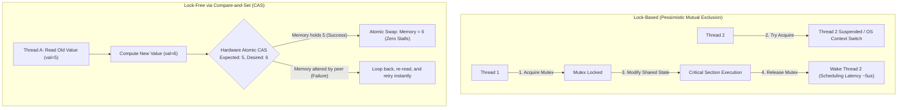
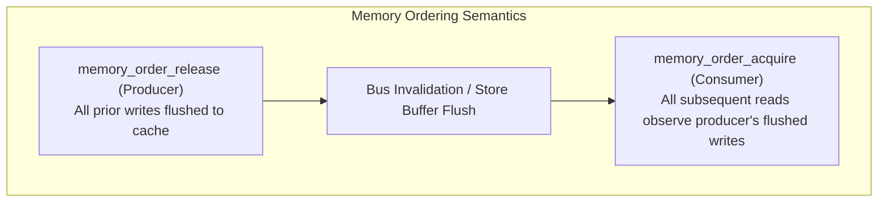
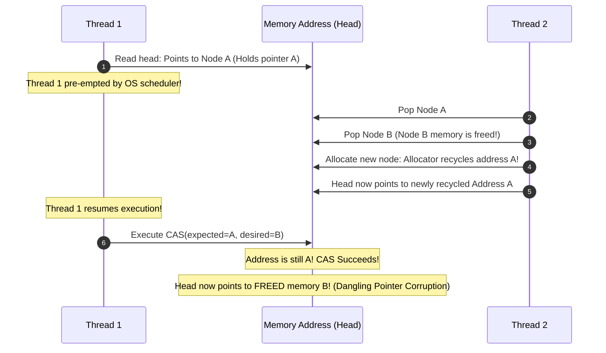

# Concurrency, Synchronization, and Compare-and-Set (CAS)

## TL;DR
Concurrency controls access to shared state across multiple execution contexts (threads, processes, or distributed nodes).
Traditional synchronization relies on **Lock-Based Primitives** (mutexes, semaphores, read-write locks) that enforce mutual exclusion by putting contending threads to sleep via operating system context switches.
**Lock-Free Synchronization** eliminates blocking by leveraging hardware atomic instructions, predominantly **Compare-and-Swap (CAS)** (`CMPXCHG` on x86, `LL/SC` on ARM).
CAS atomically verifies whether a memory location holds an expected value; if true, it writes a new value and returns success, enabling optimistic lock-free loops.
At the distributed tier, CAS translates into conditional atomic updates, fencing tokens, and versioned entity writes.
For operating system kernel scheduling, thread primitives, and futex internals, see [[P2L2-Threads-and-Concurrency|GIOS Threads and Concurrency]] and [[P3L4-Synchronization-Constructs|GIOS Synchronization Constructs]].

## Mental Model
Think of a traditional Mutex as a single-stall restroom with an indicator lock.
When someone enters, the lock turns red.
Anyone else wishing to use the restroom must sit on a bench and wait.
If the person inside falls asleep or suffers a heart attack, everyone outside remains blocked indefinitely.
Think of Compare-and-Swap (CAS) as an auctioneer holding a whiteboard.
The whiteboard displays the current highest bid: "$100".
A bidder calls out: "If the board still says $100, erase it and write $110."
If two bidders call out simultaneously, the auctioneer executes the first statement, changing the board to $110.
The second bidder's condition ("If the board says $100") fails immediately; the second bidder is not put to sleep, but simply reads the new board ($110) and decides whether to bid $120.



## How It Works (Internals)

### 1. Hardware Foundations of Atomic CAS

#### A. Hardware Instructions: `CMPXCHG` vs `LL/SC`
- **x86 Architecture (`LOCK CMPXCHG`)**:
  x86 provides a single complex instruction `CMPXCHG` (Compare and Exchange).
  When prefixed with the `LOCK` signal, the CPU asserts exclusive ownership of the target cache line via the MESI/MOESI cache coherence protocol, ensuring no other core can read or write that 64-byte line during the instruction.
- **ARM / RISC-V Architecture (`LL / SC`)**:
  ARM implements load-free atomics via two paired instructions:
  1. `LDREX` (Load-Linked): Loads the value from memory and registers an exclusive hardware monitor on that physical address.
  2. `STREX` (Store-Conditional): Writes the new value **only** if the exclusive monitor has not been cleared by a competing write from another core. Returns a status bit indicating success or failure.

#### B. Memory Ordering and Barriers
Modern superscalar processors reorder instructions out-of-order to maximize pipeline utilization.
Hardware atomic operations require explicit **Memory Fences**:
1. **Sequentially Consistent (`memory_order_seq_cst`)**:
   Enforces a single globally agreed total order of all atomic operations across all cores.
   Highest safety, but flushes CPU store buffers, incurring a latency tax.
2. **Acquire-Release Semantics**:
   - `memory_order_acquire`: Prevents subsequent reads and writes from being reordered *before* the acquire point (used when acquiring locks).
   - `memory_order_release`: Ensures all prior reads and writes are flushed and visible to other cores *before* the release point (used when publishing updates).
3. **Relaxed (`memory_order_relaxed`)**:
   Guarantees atomicity of the single operation, but permits arbitrary hardware reordering relative to other memory accesses.
   Ideal for independent performance counters.



### 2. Lock-Free Guarantees
Multiprocessor algorithms are categorized by their progress guarantees:
1. **Blocking**: If a thread holding a lock is pre-empted by the operating system, no other thread can make progress.
2. **Obstruction-Free**: A thread is guaranteed to make progress if all other competing threads are suspended.
3. **Lock-Free**: At least one thread in the system is guaranteed to make forward progress in a finite number of steps, regardless of other threads being paused or delayed.
*(Individual threads may experience starvation, but the system as a whole never deadlocks).*
4. **Wait-Free**: **Every** thread is guaranteed to make forward progress in a bounded number of execution steps, regardless of contention.
*(The gold standard for real-time and safety-critical avionics).*

### 3. The ABA Problem

The fundamental vulnerability of pointer-based CAS is the **ABA Problem**:
1. Thread 1 reads a shared pointer referencing memory address $A$.
2. Thread 1 prepares to execute CAS: `CAS(&head, expected=A, new=B)`.
3. Thread 1 is pre-empted by the operating system scheduler.
4. Thread 2 wakes up, pops $A$ from the stack, and pops the subsequent node $B$.
5. Thread 2 frees node $B$ to the memory allocator.
6. A third operation allocates a new node, and the operating system's `malloc` happens to recycle the exact same virtual memory address $A$!
7. Thread 1 resumes execution, inspects the memory address, finds address $A$ unchanged, and concludes no modification occurred.
8. Thread 1's CAS succeeds, linking node $B$ (which was already freed!) back into the active data structure, causing memory corruption or segmentation faults.



#### Mitigations for ABA
1. **Tagged Pointers / Versioned References**:
   Pair the pointer with a monotonic integer version stamp.
   On 64-bit systems, pack a 48-bit pointer with a 16-bit version counter, or use 128-bit double-word CAS (`CMPXCHG16B` on x86, `AtomicStampedReference` in Java).
   The state transition from $A$ to $B$ and back to $A$ becomes $(A, 1) \to (B, 2) \to (A, 3)$.
   Thread 1's CAS fails because version $1 \neq 3$.
2. **Hazard Pointers**:
   Threads register references they are actively reading into thread-local hazard pointer arrays.
   Memory deallocation threads must verify no hazard pointer references a node before freeing its memory.
3. **Read-Copy-Update (RCU)**:
   Readers access data without locks.
   Writers produce a private copy, update it, and swap pointers via atomic CAS.
   Memory reclamation of the old structure is deferred until all readers have exited a "quiescent state" (grace period).

### 4. Distributed Compare-and-Set
At the distributed system tier, CAS is the fundamental coordination primitive:
1. **Redis**: Uses optimistic transactions via `WATCH key`, followed by `MULTI` and `EXEC`.
If another client modifies the watched key before `EXEC`, the transaction aborts (Distributed CAS).
Alternatively, single-threaded Redis Lua scripts execute atomic test-and-set operations directly in memory.
2. **Apache ZooKeeper**: Updates enforce CAS via node version numbers:
`zooKeeper.setData(path, data, expectedVersion)`.
If `expectedVersion` does not match the znode's internal `version`, the call throws `BadVersionException`.
3. **Consul / etcd**: Built on Raft consensus; key-value modifications support Compare-and-Swap based on the key's modification index (`mod_revision`).

## Trade-offs and When to Use

| Characteristic | Mutex / Lock-Based | Spinlocks | Lock-Free CAS | Distributed CAS |
| :--- | :--- | :--- | :--- | :--- |
| **Progress Guarantee** | Blocking (Vulnerable to priority inversion) | Blocking (Burns CPU while waiting) | Lock-Free (System-wide progress guaranteed) | Optimistic / Abort on conflict |
| **Overhead Under Zero Contention** | Low ($10\text{ - }25\text{ ns}$) | Very low ($5\text{ ns}$) | Ultra-low ($2\text{ - }5\text{ ns}$) | Medium ($1\text{ - }3\text{ ms}$ network RTT) |
| **Overhead Under High Contention** | OS context switch stalls ($2\text{ - }5\text{ }\mu\text{s}$) | Severe CPU burn (100% core saturation) | Cache-line bounce / retry storms | High transaction abort rate |
| **Implementation Complexity** | Simple | Simple | Extremely complex (ABA, memory ordering) | Medium |
| **Fault Tolerance** | Thread crash inside lock hangs all threads | Thread crash hangs all threads | Safe against individual thread pre-emption | Safe against client crashes |

## Failure Modes and Pitfalls

### 1. Cache-Line Ping-Pong (False Sharing)
- *Failure*: Two threads running on separate CPU cores execute CAS operations on distinct variables that happen to reside within the same 64-byte cache line.
Every successful write invalidates the cache line across all other CPU cores via the MESI protocol, forcing continuous bus snooping and degrading throughput by 10x to 50x.
- *Mitigation*: Apply cache-line alignment padding (e.g., `alignas(64)` in C++ or `@Contended` in Java) to ensure atomic variables occupy dedicated cache lines.

### 2. Priority Inversion
- *Failure*: A low-priority thread acquires a mutex.
A high-priority thread attempts to acquire the mutex and is blocked.
A medium-priority thread (which does not need the mutex) preempts the low-priority thread because its priority is higher.
Result: The high-priority thread is indirectly blocked by the medium-priority thread indefinitely!
- *Mitigation*: Use **Priority Inheritance Protocols** (where the low-priority thread temporarily inherits the high-priority thread's priority), or replace locks with lock-free CAS data structures.

### 3. The Live-Lock Retry Storm
- *Failure*: 64 threads concurrently execute a lock-free CAS loop on a shared head pointer.
Because only one thread can succeed per cycle, 63 threads fail and loop immediately.
The memory bus is saturated with invalidation broadcasts, causing aggregate throughput to drop below that of a standard mutex.
- *Mitigation*: Introduce **Exponential Backoff** or randomized yield intervals inside the CAS failure loop.

## Hands-On

### 1. Python Demonstration: The ABA Problem and Versioned Reference Resolution
Run this self-contained script demonstrating the ABA problem and its mitigation using a Versioned Reference (Tagged Pointer):

```python
"""
Educational demonstration of the ABA Problem in concurrent data structures
and its resolution using Tagged Pointers / Versioned References.
No external dependencies required (Python 3.10+).
"""
from dataclasses import dataclass
from typing import Any

@dataclass
class VersionedReference:
    value: Any
    version: int

class AtomicVersionedReference:
    def __init__(self, initial_value: Any, initial_version: int = 0):
        self._ref = VersionedReference(value=initial_value, version=initial_version)

    def get(self) -> VersionedReference:
        return self._ref

    def compare_and_set(self, expected_val: Any, expected_ver: int, new_val: Any) -> bool:
        # Atomic CAS simulation
        if self._ref.value == expected_val and self._ref.version == expected_ver:
            self._ref = VersionedReference(value=new_val, version=expected_ver + 1)
            return True
        return False

def demonstrate_aba_resolution():
    print("=== Demonstrating ABA Mitigation via Versioned CAS ===")
    
    # Initial state: Resource A at Version 1
    shared_resource = AtomicVersionedReference("Resource_A", initial_version=1)
    
    # Thread 1 reads initial snapshot
    t1_snapshot = shared_resource.get()
    print(f"Thread 1 reads: Value='{t1_snapshot.value}', Version={t1_snapshot.version}")

    # Thread 1 gets paused... Thread 2 intervenes:
    print("\n[Thread 2 Intervenes]")
    # Modifies A -> B
    shared_resource.compare_and_set("Resource_A", 1, "Resource_B")
    print("  Thread 2 changed A -> B")
    # Modifies B -> A (ABA transition occurs!)
    shared_resource.compare_and_set("Resource_B", 2, "Resource_A")
    print("  Thread 2 changed B -> A (Value is back to A, but version incremented)")

    print(f"Current State: Value='{shared_resource.get().value}', Version={shared_resource.get().version}")

    # Thread 1 resumes and attempts CAS using its stale snapshot
    print("\n[Thread 1 Resumes]")
    success = shared_resource.compare_and_set(
        expected_val=t1_snapshot.value,
        expected_ver=t1_snapshot.version,
        new_val="Resource_C"
    )
    
    if not success:
        print("ABA Detected & Prevented! Thread 1 CAS was REJECTED because version changed from 1 to 3.")
    else:
        print("ERROR: ABA corruption occurred!")

if __name__ == "__main__":
    demonstrate_aba_resolution()
```

### 2. High-Performance Lock-Free Stack Reference
For a complete, thread-safe C++17 lock-free stack implementation utilizing atomic CAS and exponential backoff, inspect the vault's internal reference file:
`[[08-Distinguished-Engineering/01-Advanced-Concurrency/lock_free_stack.cpp|Lock-Free Stack in C++]]`.

## Performance and Capacity
- **Hardware Instruction Latency**:
  - L1 CPU Cache Hit: $\approx 1.0\text{ ns}$ (4 clock cycles).
  - Uncontended Atomic `LOCK CMPXCHG`: $\approx 8\text{ - }15\text{ ns}$.
  - Contended Atomic CAS across multi-socket NUMA bus: $\approx 40\text{ - }100\text{ ns}$.
  - Operating System Mutex context switch (stalling thread, saving registers, scheduling next process): $\approx 1,500\text{ - }5,000\text{ ns}$ ($1.5\text{ - }5.0\text{ }\mu\text{s}$).
- **Throughput Scaling**:
  When a lock is held for $< 50\text{ ns}$, a lock-free CAS algorithm delivers 10x to 20x higher throughput than an OS mutex.
  However, if critical section execution exceeds several microseconds, OS mutexes are superior because sleeping threads free CPU cores to execute other processes.

## In Production
- **LMAX Disruptor**: A high-frequency financial trading architecture capable of processing 6,000,000 orders per second with sub-microsecond latency.
The Disruptor replaces blocking queues with an in-memory lock-free ring buffer utilizing memory pre-allocation, cache-line padding, and CAS sequence barriers.
- **Java `ConcurrentHashMap`**: Uses fine-grained CAS operations to initialize hash table bins atomically without locks, acquiring synchronized blocks only when modifying existing hash collision linked lists or red-black trees.
- **Linux Kernel RCU (Read-Copy-Update)**: The Linux kernel routing tables, file descriptor tables, and IPC namespaces use RCU to achieve near-zero-overhead concurrent reads without lock contention.

### Operational Checklist
- [ ] In high-concurrency C++ or Go services, profile cache-line contention using Linux `perf c2c` (cache-to-cache) to eliminate false sharing.
- [ ] For lock-free loops, ensure a yield (`std::this_thread::yield()`) or backoff is included to prevent core thermal throttling under high contention.
- [ ] For distributed CAS operations in Redis or ZooKeeper, always implement retry limits with exponential backoff to prevent network retry storms.

## Interview Questions

> [!question]
> **Question 1 (Junior):** What is Compare-and-Swap (CAS), and how does it differ from a standard assignment?
> [!success]- Answer
> A standard assignment overwrites a memory location unconditionally. Compare-and-Swap (CAS) is an atomic hardware instruction that takes an expected value and a new value. It compares the current memory content with the expected value; only if they match does it update the location to the new value, returning true. If the content differs, memory is left untouched and it returns false, all executed as an indivisible atomic step.

> [!question]
> **Question 2 (Mid-Level):** Explain the ABA problem in lock-free data structures.
> [!success]- Answer
> The ABA problem occurs when a thread reads value $A$ from a shared location, prepares to execute CAS, and is pre-empted. While it is paused, other threads modify the location from $A$ to $B$, and then back to $A$ (often recycling the same memory address). When the original thread resumes, it sees $A$, assumes nothing changed, and succeeds in its CAS. In pointer-based structures, this can link previously freed and corrupted memory back into active lists.

> [!question]
> **Question 3 (Mid-Level):** How do Tagged Pointers / Versioned References resolve the ABA problem?
> [!success]- Answer
> Tagged pointers attach a monotonically increasing integer version counter to the pointer. Instead of inspecting just the memory address $A$, the CAS inspects the composite tuple $(A, \text{version})$. Even if the address transitions from $A$ to $B$ and back to $A$, the version counter increments monotonically: $(A, 1) \to (B, 2) \to (A, 3)$. The original thread's CAS expecting $(A, 1)$ fails because the version is now $3$, preventing corrupt execution.

> [!question]
> **Question 4 (Senior):** What is the difference between Lock-Free and Wait-Free concurrency guarantees?
> [!success]- Answer
> Lock-Free guarantees that **at least one** thread in the system makes forward progress in a finite number of steps; individual threads may starve or loop indefinitely under high contention, but the system as a whole never blocks. Wait-Free is a strictly stronger guarantee: **every** thread is guaranteed to make forward progress in a bounded number of execution steps regardless of contention or other threads' actions, eliminating thread starvation completely.

> [!question]
> **Question 5 (Senior):** Explain Acquire and Release memory ordering semantics and how they prevent CPU instruction reordering bugs.
> [!success]- Answer
> In modern CPUs, instructions are executed out of order. `memory_order_release` guarantees that all prior memory writes in the executing thread are committed and visible before the atomic write takes effect. `memory_order_acquire` guarantees that all subsequent memory reads in the observing thread occur after the atomic read. Together, they form a synchronization barrier: a consumer acquiring a flag is mathematically guaranteed to observe all data written by the producer before it released that flag.

> [!question]
> **Question 6 (Staff):** How does False Sharing degrade performance on multi-core systems, and how do you detect and fix it?
> [!success]- Answer
> False Sharing occurs when two independent threads running on different CPU cores modify distinct variables that reside within the same 64-byte hardware cache line. Whenever one core updates its variable, the MESI protocol invalidates the entire cache line across all other cores, forcing expensive cache reloads across the interconnect bus. It is detected using hardware performance counters (e.g., Linux `perf c2c`). It is fixed by adding memory padding (e.g., `alignas(64)` in C++ or `@Contended` in Java) to align variables to separate cache lines.

> [!question]
> **Question 7 (Staff):** How does Read-Copy-Update (RCU) achieve lock-free reads with deterministic memory reclamation in high-performance systems?
> [!success]- Answer
> RCU separates read access from update and reclamation: (1) Readers execute concurrently without acquiring locks or executing atomic bus operations, enjoying raw L1 memory speeds. (2) Writers do not mutate data in-place; they allocate a private copy of the structure, apply changes, and execute a single atomic pointer swap to publish the new version. (3) The old structure cannot be freed immediately because concurrent readers may still be traversing it. The writer defers memory reclamation until a "Grace Period" has passed - meaning every CPU core has completed a context switch (quiescent state), ensuring all pre-existing readers have finished.

> [!question]
> **Question 8 (Staff):** How would you implement a distributed, high-throughput rate limiter using CAS in Redis without suffering race conditions?
> [!success]- Answer
> Implement a sliding window counter using Redis single-threaded Lua scripts or atomic pipelined commands: (1) Inside a Lua script, use a Redis Sorted Set (`ZSET`) keyed by client ID. (2) Remove entries older than the current window: `ZREMRANGEBYSCORE key 0 (now - window)`. (3) Count active entries: `ZCARD key`. (4) If count is below the threshold, append the current request timestamp: `ZADD key now now` and set a TTL on the set. (5) Return allow (1) or block (0). Because Redis executes Lua scripts atomically in a single-threaded event loop, this provides guaranteed distributed CAS semantics with zero multi-client race conditions or lock overhead.

## Related
- [[Optimistic-vs-Pessimistic-Locking|Optimistic vs Pessimistic Locking]]: Application-level transaction locking strategies.
- [[P2L2-Threads-and-Concurrency|GIOS Threads and Concurrency]]: Operating system thread models and race conditions.
- [[P3L4-Synchronization-Constructs|GIOS Synchronization Constructs]]: Operating system mutexes, spinlocks, and futexes.
- [[08-Distinguished-Engineering/01-Advanced-Concurrency/lock_free_stack.cpp|Lock-Free Stack C++ Implementation]]: Vault code reference.

## Further Reading
- Herlihy, Maurice, and Nir Shavit. *The Art of Multiprocessor Programming*. Morgan Kaufmann, 2012.
- Williams, Anthony. *C++ Concurrency in Action*. Manning Publications, 2019.
- McKenney, Paul E. "Is parallel programming hard, and, if so, what can you do about it?" (2014).
- Thompson, Martin, et al. "Disruptor: High performance alternative to bounded queues for exchanging data between concurrent threads." *LMAX Whitepaper* (2011).
