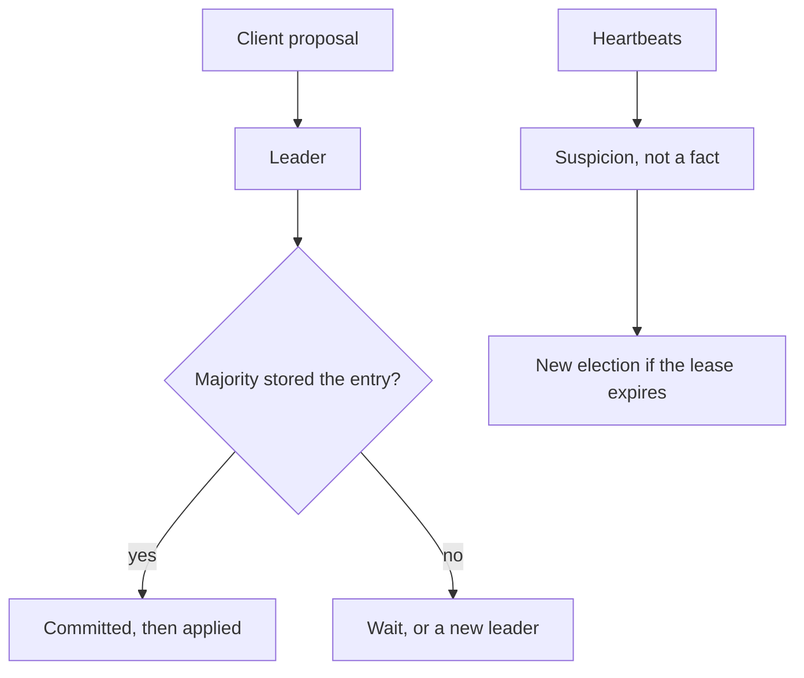

# Consensus and Failure Detection

## TL;DR

Consensus lets a set of machines agree one value, or one log, even when some of them crash.
The FLP result says you cannot guarantee that agreement in a fully asynchronous system if even one process can crash and you must always terminate.
Production protocols assume the network is only mostly asynchronous, they elect a leader, and they treat a timeout as a suspicion rather than as a proof of death.

## What you agree on

Raft, Multi-Paxos, and Zab all build a replicated log.
A leader appends.
A majority must store the entry before it is committed.
Two majorities intersect, so two leaders cannot commit two different entries at the same index.
That intersection is the same idea as [[Replication-and-Quorums]], applied to a log rather than to a single key.
[[Raft-Consensus]] is the lab, and it leaves out persistence, membership changes, and the prev-log checks a production Raft uses.
[[Apache-ZooKeeper]] runs Zab.
[[Kubernetes-Architecture]] stores its desired state in etcd, which runs Raft.
[[CockroachDB-Distributed-SQL]] runs Raft per range, not one Raft for the whole cluster.
One log for every key in the world would put the entire cluster behind one leader's NIC.

## Failure detectors

A heartbeat that stops is evidence, not proof.
The process can be dead, paused for garbage collection, or behind a partition.
Phi-accrual detectors turn the inter-arrival history into a suspicion score.
Cassandra uses that idea so a slow node is not declared dead on one missed packet.
A lease is a promise that expires.
The holder must renew it.
If the holder pauses longer than the lease, another node may take over while the holder still believes it is in charge.
That overlap is why a lock service issues a fencing token.
[[18-Distributed-Lock/design|The lock study]] is the consequence.

## Pitfalls

- A timeout that is shorter than a GC pause will flap leadership and stall the cluster.
- Consensus does not make a disk flush unnecessary.
  A committed entry that lived only in memory is not committed after power loss.
- Changing the set of voters is its own consensus problem.
  Joint consensus, or an equivalent membership log, is required.
  Adding a node by editing a config file on one machine is how split brains start.
- Using a consensus group for data that did not need a total order.
  A counter of likes does not need Raft if the product accepts a commutative increment.

## Interview questions

1. State FLP in one sentence, and say what production systems assume instead.
2. Why can two majorities not commit different commands at the same log index.
3. What is the difference between a lease and a lock.
4. Why is Raft-per-range different from one Raft group for a whole database.

## Further reading

- Fischer, Lynch, and Paterson, JACM 1985.
- Ongaro and Ousterhout, USENIX ATC 2014.
- [[Time-Clocks-and-Ordering]] for the order you can get without a log, and the order you cannot.
