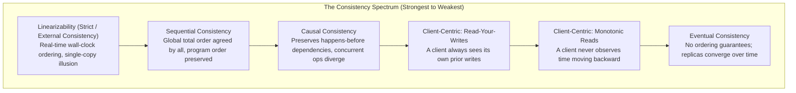
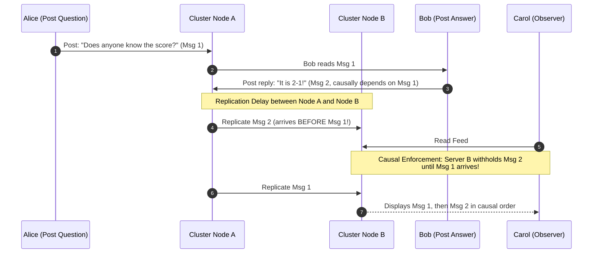
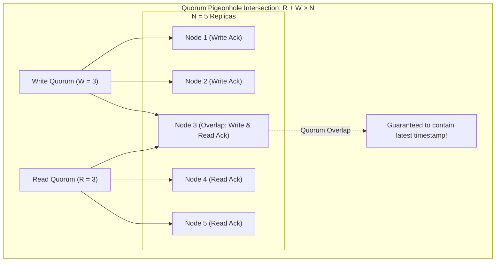

# Consistency Models

## TL;DR
Consistency models define the contract between a distributed data store and its client applications regarding the order and recency of read and write operations.
At the top of the hierarchy sits **Linearizability** (Strong Consistency), which guarantees that operations appear to execute instantaneously on a single globally ordered real-time timeline.
**Sequential Consistency** relaxes wall-clock time constraints, guaranteeing that all nodes observe an identical global interleaving of operations that preserves per-process program order.
**Causal Consistency** preserves ordering only for operations causally linked by Lamport's happens-before relation ($\to$), allowing concurrent operations to be observed in differing orders.
**Eventual Consistency** provides the weakest guarantee, ensuring only that if no further updates occur, all replicas will eventually converge to identical values.
Balancing consistency against latency is governed by quorum mathematics ($R + W > N$) and coordination overhead.

## Mental Model
Imagine a live soccer match broadcast to spectators around the world.
**Linearizability** is sitting physically on the stadium bench: you observe the ball crossing the goal line at the exact physical speed-of-light instant it happens.
**Sequential Consistency** is watching a delayed broadcast on television: you see the kickoff, then the pass, then the goal, in the exact correct sequence, even though the broadcast is delayed by 30 seconds compared to physical reality.
**Causal Consistency** is reading a text message thread: you are guaranteed to read Alice's question before Bob's reply, but two unrelated questions asked by Charlie and Diana simultaneously may appear in different orders on different phones.
**Eventual Consistency** is reading the morning newspaper: hours after the match ends, every newspaper prints the identical final score, but during the match you had zero real-time insight.



## How It Works (Internals)

### 1. The Strict Hierarchy of Consistency Models

#### A. Linearizability (Strong / Atomic Consistency)
Formalized by Herlihy and Wing (1990).
- **Definition**: Every operation takes effect atomically at a discrete serialization point between its invocation time $t_{inv}$ and response time $t_{resp}$ on a global physical wall-clock timeline.
- **Invariant**: If Operation $B$ is invoked after Operation $A$ successfully completes ($t_{inv}(B) > t_{resp}(A)$), then Operation $B$ must observe the state left by Operation $A$ or a later operation.
- **Cost**: Requires multi-node network coordination (e.g., Paxos, Raft, or TrueTime commit waits). Under network partitions, linearizable registers cannot remain available (the CP in CAP).

```mermaid
sequenceDiagram
    autonumber
    participant W as Writer Client
    participant R1 as Node 1 (Storage)
    participant R2 as Node 2 (Storage)
    participant C1 as Reader Client 1
    participant C2 as Reader Client 2

    W->>R1: Write x = 1 (Invoked)
    R1->>R2: Sync Write to Quorum
    R2-->>R1: Acknowledged
    R1-->>W: Write Complete (Responded at t = 10ms)
    
    Note over C1,C2: Global Serialization Point: x is definitively 1
    C1->>R1: Read x (Invoked at t = 11ms)
    R1-->>C1: Returns x = 1
    C2->>R2: Read x (Invoked at t = 12ms)
    R2-->>C2: Returns x = 1 (CANNOT return 0; Linearizability Enforced)
```

#### B. Sequential Consistency
Formalized by Leslie Lamport (1979).
- **Definition**: The result of any execution is the same as if the operations of all processors were executed in some sequential order, and the operations of each individual processor appear in this sequence in the order specified by its program.
- **Difference from Linearizability**: Sequential consistency does **not** enforce real-time physical wall-clock constraints.
If Client $A$ writes $x = 1$ at 12:00:00 PM, and Client $B$ reads $x$ at 12:00:05 PM, sequential consistency permits Client $B$ to read the old value $x = 0$, provided that **all** readers in the cluster observe $x = 0$ before observing $x = 1$.

#### C. Causal Consistency
- **Definition**: Operations that are causally related must be observed by every node in the same order. Operations that are not causally related (concurrent operations) may be observed in different orders by different nodes.
- **Happens-Before ($\to$) Relation**:
  1. If operation $a$ precedes operation $b$ in the same process, then $a \to b$.
  2. If operation $a$ is a write and operation $b$ is a read returning the value written by $a$, then $a \to b$.
  3. Transitivity: if $a \to b$ and $b \to c$, then $a \to c$.
- **Mechanism**: Enforced using **Vector Clocks** or **Lamport Timestamps** attached to network payloads.



### 2. Client-Centric Consistency Models
When full global consistency is too expensive, systems provide guarantees scoped to an individual client session:

1. **Read-Your-Writes (RYW)**:
   - A client that updates a value is guaranteed to always observe that updated value (or a newer one) on subsequent reads.
   - *Implementation*: Client session affinity (pinning reading connections to the master for 5 seconds after a write), or including client write version tokens in subsequent read requests.
2. **Monotonic Reads**:
   - If a client reads value $v_1$ at time $t_1$, the client will never subsequently observe an older value $v_0$ at time $t_2$.
   - *Pitfall prevented*: Moving backward in time when a load balancer routes consecutive HTTP requests to an asynchronously lagging replica.
3. **Monotonic Writes**:
   - A system guarantees that a given client's writes are processed and applied in the exact order the client issued them.
4. **Writes-Follow-Reads (Causal Writes)**:
   - If a client reads version $v_1$ and subsequently writes version $v_2$, any other process that observes $v_2$ is guaranteed to also observe $v_1$.

### 3. Quorum Mathematics and Strict Consistency
In a leaderless distributed data store (such as Cassandra or DynamoDB):
- $N$ = Number of replicas storing the data item (Replication Factor).
- $W$ = Number of replicas that must acknowledge a write before it is declared successful.
- $R$ = Number of replicas that must be queried during a read operation.



#### The Pigeonhole Condition
$$\text{Strong Consistency} \iff R + W > N$$
- If $N = 3$, setting $W = 2$ and $R = 2$ gives $R + W = 4 > 3$.
By the Pigeonhole Principle, the read set and write set must overlap on at least one replica ($4 - 3 = 1$).
The reading client receives multiple values, compares version timestamps, and returns the freshest record.

#### Why $R + W > N$ Can Still Fail Linearizability
Even when $R + W > N$, systems can violate linearizability in real-world conditions:
1. **Sloppy Quorums and Hinted Handoff**: If network partitions isolate the primary replicas, writes are accepted by temporary neighboring nodes outside the standard $N$ set. Subsequent reads querying the standard replicas miss the write entirely.
2. **Concurrent Write Overwrites (LWW Skew)**: If two clients write concurrently, clocks drift. A node with an inaccurate future clock overwrites a later real-time write.
3. **Unfinished Write Reads**: If a write fails midway after updating 1 out of $W$ replicas and returns an error to the writer, subsequent quorum reads may still observe the half-written value, creating non-deterministic reads.

## Trade-offs and When to Use

| Consistency Model | Latency | Availability Under Partition | Coordination Cost | Ideal Use Case |
| :--- | :--- | :--- | :--- | :--- |
| **Linearizability** | High ($2 \times \text{RTT}$ to quorum) | CP (Rejects requests during partition) | Consensus algorithms (Paxos, Raft) | Banking ledgers, distributed locks, leader leases |
| **Sequential** | High (Global sync required) | CP | Total order broadcast | Distributed memory, multi-core CPU caching |
| **Causal** | Medium (Local commit, async gossip) | Available under partitions | Vector clock tracking metadata | Collaborative document editing, social comment threads |
| **Read-Your-Writes** | Low ($< 5\text{ms}$ write commit) | High | Client session tokens / master routing | User profile updates, shopping cart additions |
| **Eventual** | Minimal ($< 1\text{ms}$ local write) | AP (Fully available) | Zero write-time coordination | Metric telemetry, DNS, social media feed likes |

## Failure Modes and Pitfalls

### 1. Moving Backward in Time (Lack of Monotonic Reads)
- *Failure*: A user refreshes their social feed and sees a comment posted 5 seconds ago (routed to an up-to-date replica).
They refresh again 1 second later; the load balancer routes to a replica lagging by 10 seconds.
The comment vanishes, confusing the user.
- *Mitigation*: Implement monotonic session sticky routing, or store the highest observed transaction LSN in the client's cookie/token, forcing replicas to await that LSN before replying.

### 2. Causality Inversion in Microservices
- *Failure*: Service $A$ updates user status in Database $A$ and sends an asynchronous message to Service $B$ via RabbitMQ.
Service $B$ processes the message and queries Database $A$ via a read replica that has not yet replicated Service $A$'s write.
Service $B$ fails with "Entity Not Found".
- *Mitigation*: Service $B$ must read with strong consistency (`ConsistentRead=true`), or the message payload must carry the complete entity snapshot instead of just an ID.

### 3. Clock Skew Breaking "Last-Write-Wins" (LWW)
- *Failure*: An AP database uses NTP timestamps for conflict resolution.
Node $A$'s clock is skewed 100 ms fast.
Node $B$'s write at 12:00:00.050 is stamped with 12:00:00.050.
Node $A$'s write at 12:00:00.000 was stamped with 12:00:00.100.
Node $A$'s older write permanently overwrites Node $B$'s newer write.
- *Mitigation*: Use Lamport logical clocks, Hybrid Logical Clocks (HLC), or vector clocks instead of raw physical wall-clock timestamps.

## Hands-On

### 1. Python Simulation: Linearizable vs Eventual Consistency and Time-Reversal Anomaly
Run this self-contained script to observe how an asynchronous read-replica pool causes a client to observe "time moving backward" (violating monotonic reads):

```python
"""
Educational simulator demonstrating consistency anomalies:
Linearizable read vs Stale Replica Read (Time-Reversal Violation).
No external dependencies required (Python 3.10+).
"""
import time
from dataclasses import dataclass
from typing import List

@dataclass
class Replica:
    id: str
    data: dict
    replication_delay_sec: float

class ReplicatedStore:
    def __init__(self):
        self.primary = {"status": "offline"}
        self.replicas: List[Replica] = [
            Replica("rep-fast", {"status": "offline"}, replication_delay_sec=0.0),
            Replica("rep-slow", {"status": "offline"}, replication_delay_sec=0.5)
        ]

    def write(self, key: str, value: str):
        # Synchronous write to primary and fast replica
        self.primary[key] = value
        self.replicas[0].data[key] = value
        print(f"[Primary] Committed: {key} = '{value}'")

    def sync_slow_replica(self, key: str):
        # Delayed asynchronous replication to slow replica
        self.replicas[1].data[key] = self.primary[key]
        print(f"[Slow Replica] Catch-up sync complete: {key} = '{self.primary[key]}'")

    def read_eventual(self, client_request_num: int, key: str) -> str:
        # Load balancer alternates round-robin between fast and slow replicas
        target_replica = self.replicas[client_request_num % len(self.replicas)]
        val = target_replica.data.get(key, "null")
        print(f"[Read Request {client_request_num}] Routed to {target_replica.id} -> Returned: '{val}'")
        return val

def main():
    store = ReplicatedStore()
    
    # 1. User updates their status
    print("--- Step 1: User updates status to 'online' ---")
    store.write("status", "online")

    # 2. User immediately refreshes browser (Hit Fast Replica)
    print("\n--- Step 2: First read immediately after update ---")
    read1 = store.read_eventual(client_request_num=0, key="status")
    assert read1 == "online"

    # 3. User refreshes again 50ms later (Load balancer hits Slow Replica)
    print("\n--- Step 3: Second read 50ms later (Anomalous Stale Route) ---")
    read2 = store.read_eventual(client_request_num=1, key="status")
    
    if read2 == "offline":
        print("\nANOMALY DETECTED: Monotonic Reads Violated!")
        print("User saw status 'online', but subsequent refresh returned 'offline' (Time reversed).")

    # 4. Background replication completes
    time.sleep(0.1)
    store.sync_slow_replica("status")

    # 5. Subsequent read
    print("\n--- Step 4: Third read after slow replica catches up ---")
    read3 = store.read_eventual(client_request_num=2, key="status")
    assert read3 == "online"
    print("Cluster has reached Eventual Consistency.")

if __name__ == "__main__":
    main()
```

### 2. Client-Side Read-Your-Writes Pinning Pattern
In web applications, prevent time reversal by pinning users to the primary database for a cooldown window following any write:

```python
import time

class ReadYourWritesSessionManager:
    def __init__(self, write_cooldown_seconds: float = 5.0):
        self.cooldown = write_cooldown_seconds
        self.user_last_write: dict[str, float] = {}

    def record_user_write(self, user_id: str):
        self.user_last_write[user_id] = time.time()

    def select_database_connection(self, user_id: str) -> str:
        last_write = self.user_last_write.get(user_id, 0.0)
        elapsed = time.time() - last_write
        
        # If user recently wrote, route reads to Primary to ensure Read-Your-Writes
        if elapsed < self.cooldown:
            return "PRIMARY_DB_CONNECTION"
        
        # Safe to read from asynchronous read replica pool
        return "READ_REPLICA_POOL"
```

## Performance and Capacity
- **Latency Cost of Strong Consistency**:
  - Eventual consistency write (local memory/WAL commit): $< 1.0\text{ ms}$.
  - Linearizable write across 3 availability zones: $2\text{ round trips} \approx 4\text{ - }10\text{ ms}$.
  - Linearizable write across continents (e.g., Virginia to Frankfurt, RTT $\approx 90\text{ ms}$):
    Requires at least $2 \times 90\text{ ms} = 180\text{ ms}$ latency overhead.
- **Throughput Penalties**:
  - A database enforcing linearizability through a single Raft/Paxos leader is bounded by the CPU and network bandwidth of that single leader node ($\approx 10,000\text{ - }50,000\text{ writes/sec}$).
  - An eventual consistency store using peer-to-peer masterless writes (Cassandra) scales write throughput linearly with node count ($100\text{ nodes} \times 20,000\text{ writes/sec} = 2,000,000\text{ writes/sec}$).

## In Production
- **Google Spanner**: Implements **External Consistency** (Linearizability + Serializability globally) using TrueTime.
Instead of passing synchronization messages for every read operation, readers query an exact timestamp $T$.
Because Spanner guarantees that no transaction committed after $T$ could have a timestamp $\le T$, reads execute across local replicas with zero lock acquisition or network coordination.
- **Facebook TAO**: Provides **Read-Your-Writes** consistency for social graphs.
When a user likes a post, the web tier writes directly to the primary database and pins that user's subsequent reads to the primary tier for a short lease, while the rest of the world observes the like via asynchronously replicated caches.

### Operational Checklist
- [ ] For DynamoDB applications, explicitly specify `ConsistentRead=true` only on workflows requiring real-time accuracy (e.g., balance verification), leaving the default `false` for feed displays to cut latency and cost in half.
- [ ] Verify that Cassandra keyspaces have $R + W > N$ (e.g., `QUORUM` reads and writes on RF=3) if business requirements mandate strong consistency.
- [ ] For microservices consuming event streams, include the entity's source version counter in message payloads to detect and discard out-of-order events.

## Interview Questions

> [!question]
> **Question 1 (Junior):** What is the difference between Linearizability and Eventual Consistency?
> [!success]- Answer
> Linearizability guarantees that every read operation returns the value of the most recent write on a global, real-time wall-clock timeline, giving the illusion of a single centralized system. Eventual Consistency guarantees only that if no new updates occur, all replicas will eventually synchronize and return identical values, but reads may return stale data in the interim.

> [!question]
> **Question 2 (Mid-Level):** Explain the condition $R + W > N$ in leaderless replication. Why does it guarantee strong consistency?
> [!success]- Answer
> In a cluster with replication factor $N$, $W$ is the number of replicas required to acknowledge a write, and $R$ is the number required for a read. If $R + W > N$, the Pigeonhole Principle guarantees that the read replica set and write replica set must overlap on at least one replica node. That overlapping node is guaranteed to hold the latest write. As long as records carry version numbers or timestamps, the client can identify and return the freshest value.

> [!question]
> **Question 3 (Mid-Level):** What is Monotonic Read consistency, and what user-facing bug occurs when a system fails to provide it?
> [!success]- Answer
> Monotonic Reads guarantees that if a client reads a certain version of data, subsequent reads by that client will never return an older version. If a system lacks this guarantee, a user querying an asynchronously replicated cluster behind a round-robin load balancer can observe "time moving backward": reading a new post on an updated replica on request 1, and seeing the post disappear on request 2 because the request routed to a lagging replica.

> [!question]
> **Question 4 (Senior):** What is the difference between Linearizability and Sequential Consistency?
> [!success]- Answer
> Sequential Consistency guarantees that all operations appear to execute in some sequential order that all nodes agree upon, and that operations from each process match their program order. However, Sequential Consistency does not enforce physical wall-clock time constraints. Linearizability adds that real-time constraint: if Operation B begins in physical time after Operation A finishes, Operation B must observe Operation A. Sequential consistency allows a read to observe an older value as long as all observers see the same order of events.

> [!question]
> **Question 5 (Senior):** Even if a cluster satisfies $R + W > N$, how can a Sloppy Quorum violate strong consistency?
> [!success]- Answer
> In a Sloppy Quorum, if the designated $N$ primary replicas for a key are unreachable due to a network partition, the coordinator accepts writes on alternative "fallback" nodes outside the primary $N$ set (storing them as hinted handoffs). When a reader later issues a quorum read ($R$) to the original $N$ primary nodes, those nodes have not yet received the hinted handoffs, returning stale data and violating strong consistency.

> [!question]
> **Question 6 (Staff):** How does Causal Consistency handle concurrent writes that have no causal relationship, and how can an application detect this concurrency?
> [!success]- Answer
> In Causal Consistency, concurrent writes (operations where neither happens-before the other: $a \not\to b$ and $b \not\to a$) are considered independent and can be applied in different orders on different nodes. Systems detect concurrency using **Vector Clocks**: each replica maintains an integer vector of updates. When comparing two vector clocks $V_A$ and $V_B$, if $V_A$ contains higher values for some nodes and $V_B$ contains higher values for others, the updates are mathematically concurrent. The application must either merge them (e.g., using CRDTs) or invoke application conflict resolution.

> [!question]
> **Question 7 (Staff):** Explain how Google Spanner uses TrueTime to provide Linearizability without cross-datacenter two-phase read locking.
> [!success]- Answer
> Traditional linearizable systems require readers to acquire read locks or consult a leader lease across a quorum to verify freshness. Spanner assigns transactions monotonic commit timestamps using TrueTime, which bounds physical clock error to $\epsilon$ ($1-7\text{ms}$). Before committing a write with timestamp $t$, Spanner deliberately pauses the commit return until physical time is guaranteed to have passed $t$ (Commit Wait: $2\epsilon$). As a result, any transaction started in real-world time after that commit is guaranteed to receive a timestamp $> t$, allowing readers to perform completely lock-free snapshot reads at timestamp $t$ from any local replica holding an up-to-date log.

> [!question]
> **Question 8 (Staff):** How would you architect an e-commerce platform to ensure Read-Your-Writes consistency for shoppers without paying the latency penalty of strong consistency across all database queries?
> [!success]- Answer
> Use a tiered hybrid strategy: (1) **Read from Asynchronous Replicas by Default**: Serve 95% of catalog browsing, product reviews, and recommendations from low-cost, low-latency read replicas. (2) **Session-Based Write Leases**: When a user updates their profile, cart, or shipping address, record a cookie or JWT claim containing `last_write_timestamp` or the database WAL sequence number (LSN). (3) **Smart Routing**: For the next 10 seconds following a write, the API gateway routes that user's read requests directly to the primary database or to a replica that has caught up to that specific LSN. (4) **Critical Operations**: For final checkout and payment, bypass replicas entirely and execute within an ACID transaction on the primary.

## Related
- [[CAP-Theorem-and-PACELC|CAP Theorem and PACELC]]: The foundational trade-off theorem governing consistency models.
- [[ACID-vs-BASE|ACID vs BASE]]: Transactional semantics across relational and distributed databases.
- [[Apache-Cassandra|Apache Cassandra]]: Tunable consistency and quorum parameter configurations.
- [[P4L3-Distributed-Shared-Memory|DSM Consistency Models]]: Shared memory consistency models in operating systems.

## Further Reading
- Herlihy, Maurice P., and Jeannette M. Wing. "Linearizability: A correctness condition for concurrent objects." *ACM Transactions on Programming Languages and Systems (TOPLAS)* 12.3 (1990): 463-492.
- Lamport, Leslie. "How to make a multiprocessor computer that correctly executes multiprocess programs." *IEEE Transactions on Computers* C-28.9 (1979): 690-691.
- Vogels, Werner. "Eventually consistent." *Communications of the ACM* 52.1 (2009): 40-44.
- Shapiro, Marc, et al. "Conflict-free replicated data types." *Symposium on Self-Stabilizing Systems*. Springer, Berlin, Heidelberg, 2011.
