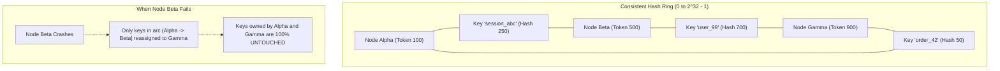
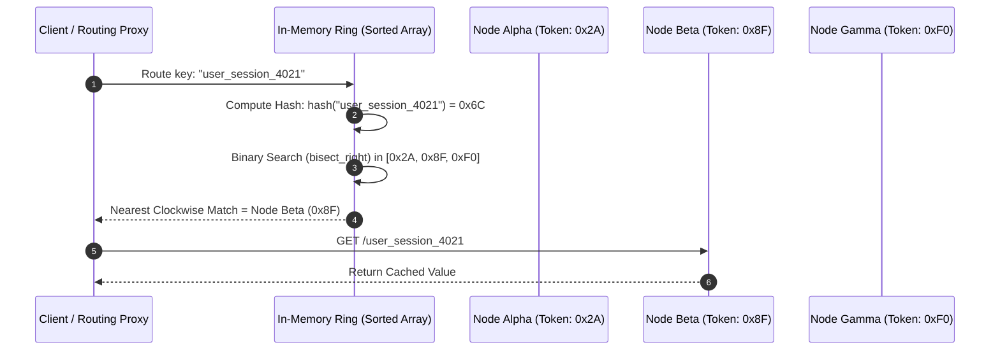
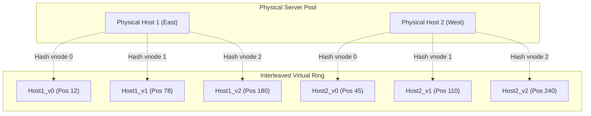

# Consistent Hashing

## TL;DR
Consistent Hashing is a distributed hashing technique where changing the number of storage nodes moves only $K/N$ keys on average, where $K$ is the total key count and $N$ is the number of nodes.
In traditional modulo hashing ($\text{hash}(\text{key}) \pmod N$), adding or removing a single node invalidates nearly 100% ($\frac{N}{N+1}$) of all cache keys, causing catastrophic cache stampedes and database collapse.
Consistent hashing maps both servers and data keys onto a continuous circular coordinate space (the "hash ring").
A key is routed to the first server encountered moving clockwise from the key's position on the ring.
Virtual nodes (vnodes) assign multiple pseudo-random tokens per physical machine to smooth out statistical variance, ensuring uniform load distribution and proportional failover sharing.

## Mental Model
Picture a 360-degree analog clock face.
Instead of numbering hours, the circle represents a continuous hash space from $0$ to $2^{32}-1$.
Three server nodes (Alpha, Beta, Gamma) are hashed by IP address and placed at distinct degree marks around the rim.
Incoming data keys are hashed using the same function and placed on the rim.
To find which server owns a key, you drop the key onto the rim and walk clockwise until you strike the first server.
If Beta catches fire and is removed, only the keys that were sitting between Alpha and Beta slide over to Gamma.
Alpha's keys and Gamma's keys remain completely undisturbed.



## How It Works (Internals)

### 1. The Modulo Hash Flaw
In naive horizontal load balancing, key assignment uses modulo arithmetic:
$$\text{Node Index} = \text{hash}(\text{key}) \pmod N$$
Suppose $N = 4$.
A key with hash value $53$ routes to node $53 \pmod 4 = 1$.
If traffic surges and you scale up to $N = 5$, the same key now maps to $53 \pmod 5 = 3$.
The fraction of keys that must be reshuffled when changing from $N$ to $N+1$ nodes is:
$$\text{Reshuffle Fraction} = \frac{N}{N + 1}$$
When expanding from 9 to 10 nodes, $90\%$ of all cached entries are instantly evicted or re-routed to the wrong server.
In a production caching tier (e.g., Memcached or Redis), this triggers a **Cache Stampede** (Thundering Herd) that overwhelms downstream primary databases.

### 2. The Consistent Hash Ring Mechanics
Consistent hashing maps both keys and node identifiers onto the same fixed range of integers, typically $[0, 2^{32} - 1]$ or $[0, 2^{64} - 1]$:
1. **Hash the Nodes**: Each physical node's unique ID (IP address, hostname, or UUID) is hashed, producing an integer position on the ring:
$$P_{node} = \text{hash}(\text{NodeID})$$
2. **Hash the Keys**: Each data item's key is hashed using the identical hash function:
$$P_{key} = \text{hash}(\text{Key})$$
3. **Clockwise Traversal**: To assign a key to a node, locate the key's position $P_{key}$ on the ring.
Walk clockwise (increasing integer order) until encountering the first node whose position $P_{node} \ge P_{key}$.
If $P_{key}$ exceeds all node positions, wrap around to the smallest node position on the ring.
4. **Node Removal / Addition**:
- When Node $B$ is added between Node $A$ and Node $C$, only keys located in the arc $(A, B]$ are migrated from Node $C$ to Node $B$.
- No other nodes in the cluster participate in data movement.



### 3. Virtual Nodes (Tokens)
Basic consistent hashing with one token per physical server suffers from two critical flaws:
1. **Non-Uniform Key Distribution**: Because random hash placement does not guarantee equidistant spacing, some nodes own massive arc segments while others own tiny slivers, creating severe load imbalance.
2. **Cascade Failover Storm**: When Node $B$ fails, **all** of its keys are dumped onto its immediate clockwise neighbor Node $C$.
Node $C$ suddenly absorbs double its normal traffic, frequently triggering a cascading crash that propagates around the entire ring.

**Solution: Virtual Nodes (Vnodes)**:
Instead of placing each physical server once, the system hashes each physical server $V$ times (typically $V = 100 \dots 256$) using distinct seed suffixes:
$$\text{Token}_{i, k} = \text{hash}(\text{NodeID} + \text{"#"} + k) \quad \text{for } k \in [0, V-1]$$
- The tokens for all physical nodes are interleaved across the ring.
- As $V$ increases, the standard deviation of load across physical nodes decreases according to the Central Limit Theorem:
$$\sigma \approx \frac{1}{\sqrt{V}}$$
- When a physical node fails, its $V$ virtual nodes disappear from across the entire perimeter of the ring.
Its load is distributed evenly across **all** surviving physical nodes in the cluster, completely eliminating cascading neighbor collapse.



### 4. Advanced Algorithmic Variants

#### A. Rendezvous Hashing (Highest Random Weight - HRW)
Developed by Thaler and Ravishankar (1998).
- **Mechanism**: For a given key, compute a hash combining the key and every available node:
$$W(k, n_i) = \text{hash}(k, n_i)$$
The node that yields the highest weight is selected:
$$\text{Node} = \arg\max_{n_i} W(k, n_i)$$
- **Trade-offs**: Requires zero ring data structures or memory overhead.
Adding/removing a node shifts only $1/N$ keys.
However, lookup complexity is $O(N)$ across all nodes, making it ideal for small to medium node counts (e.g., proxy caches routing to 20 backends).

#### B. Jump Consistent Hash (Google, 2014)
Developed by John Lamping and Eric Veach.
- **Mechanism**: A fast, minimal-memory algorithm that maps a 64-bit key directly to a bucket index in range $[0, N-1]$ using only a few lines of code:
```python
def jump_consistent_hash(key: int, num_buckets: int) -> int:
    b, j = -1, 0
    while j < num_buckets:
        b = j
        key = ((key * 2862933555777941757) + 1) & 0xFFFFFFFFFFFFFFFF
        j = int((b + 1) * (float(1 << 31) / float((key >> 33) + 1)))
    return b
```
- **Trade-offs**: Requires $O(1)$ memory (no ring storage) and executes in $O(\ln N)$ time with near-perfect distribution.
- **Critical Limitation**: Buckets must be numbered consecutively from $0$ to $N-1$.
It supports adding or removing buckets only at the **tail**; it cannot handle arbitrary interior node removals without remapping.

## Trade-offs and When to Use

| Characteristic | Traditional Modulo | Consistent Hash Ring (with Vnodes) | Rendezvous Hashing (HRW) | Jump Consistent Hash |
| :--- | :--- | :--- | :--- | :--- |
| **Keys Moved on Reshard** | $\approx 100\%$ ($\frac{N}{N+1}$) | $\approx \frac{K}{N}$ (Minimal) | $\approx \frac{K}{N}$ (Minimal) | $\approx \frac{K}{N}$ (Minimal) |
| **Lookup Time Complexity** | $O(1)$ | $O(\log(N \times V))$ (Binary Search) | $O(N)$ | $O(\ln N)$ |
| **Memory Footprint** | $O(1)$ | $O(N \times V)$ in RAM | $O(1)$ | $O(1)$ |
| **Arbitrary Node Removal** | Yes (Destructive) | Yes (Graceful) | Yes (Graceful) | No (Tail-only) |
| **Load Balancing Quality** | Perfect | Tunable via $V$ ($\sigma \propto \frac{1}{\sqrt{V}}$) | Near-Perfect | Mathematically Perfect |

## Failure Modes and Pitfalls

### 1. Inadequate Virtual Node Count
- *Failure*: Deploying consistent hashing with $V = 1$ or $V = 5$.
Due to hash variance, one physical host ends up with a ring segment 4x larger than the median, resulting in severe CPU and memory saturation.
- *Mitigation*: Configure at least $V = 150 \dots 256$ virtual nodes per physical host.

### 2. Client-Side Ring Desynchronization
- *Failure*: In a decentralized architecture, client applications maintain local copies of the hash ring.
If Node $X$ joins and the notification is delayed to half the client fleet, different clients route writes for the same key to different physical nodes, generating split-brain duplicate records.
- *Mitigation*: Broadcast ring membership updates via a reliable coordination engine (e.g., Apache ZooKeeper, etcd) or use a gossip protocol with generation epoch counters.

### 3. Hot Range Clumping on Bulk Inserts
- *Failure*: A batch processing job inserts millions of keys sharing a common prefix (e.g., `audit_log_2026_01_...`).
If the hash algorithm does not exhibit strong avalanche properties, keys cluster in a narrow arc on the ring.
- *Mitigation*: Use a cryptographically sound or high-entropy non-cryptographic hash function with strong avalanche characteristics (e.g., MurmurHash3, CityHash, or Blake3).

## Hands-On

### 1. Production-Grade Consistent Hash Ring in Python
Save and run this complete, production-grade implementation featuring virtual nodes, binary search routing, and node churn tracking:

```python
"""
Production-grade Consistent Hash Ring with Virtual Nodes.
Cross-references: 08-Distinguished-Engineering/02-Distributed-Systems-Internals/consistent_hashing.py
No external dependencies required (Python 3.10+).
"""
import bisect
import hashlib
from typing import Dict, List, Optional, Set

class ConsistentHashRing:
    def __init__(self, vnodes: int = 150, hash_func=None):
        self.vnodes = vnodes
        self.hash_func = hash_func or self._default_hash
        self.ring: List[int] = []                    # Sorted token list
        self.token_to_node: Dict[int, str] = {}      # Token -> Physical Node ID
        self.physical_nodes: Set[str] = set()

    def _default_hash(self, key: str) -> int:
        # MD5 digest truncated to 32-bit unsigned integer
        digest = hashlib.md5(key.encode('utf-8')).digest()
        return int.from_bytes(digest[:4], byteorder='big')

    def add_node(self, node: str) -> None:
        if node in self.physical_nodes:
            return
        self.physical_nodes.add(node)
        for i in range(self.vnodes):
            token = self.hash_func(f"{node}#vnode{i}")
            idx = bisect.bisect_left(self.ring, token)
            self.ring.insert(idx, token)
            self.token_to_node[token] = node

    def remove_node(self, node: str) -> None:
        if node not in self.physical_nodes:
            return
        self.physical_nodes.remove(node)
        for i in range(self.vnodes):
            token = self.hash_func(f"{node}#vnode{i}")
            idx = bisect.bisect_left(self.ring, token)
            if idx < len(self.ring) and self.ring[idx] == token:
                del self.ring[idx]
                del self.token_to_node[token]

    def get_node(self, key: str) -> Optional[str]:
        if not self.ring:
            return None
        token = self.hash_func(key)
        idx = bisect.bisect_right(self.ring, token)
        # Clockwise wrap-around
        if idx == len(self.ring):
            idx = 0
        return self.token_to_node[self.ring[idx]]

def test_ring_churn():
    ring = ConsistentHashRing(vnodes=150)
    nodes = ["node-us-east-1", "node-us-west-1", "node-eu-central-1"]
    for n in nodes:
        ring.add_node(n)

    # Generate 100,000 keys and record initial placement
    total_keys = 100_000
    initial_placement = {f"session_{i}": ring.get_node(f"session_{i}") for i in range(total_keys)}

    # Add a 4th node to simulate cluster scale-out
    new_node = "node-ap-south-1"
    ring.add_node(new_node)

    # Measure how many keys moved
    moved_keys = 0
    new_node_keys = 0
    for key, old_node in initial_placement.items():
        curr_node = ring.get_node(key)
        if curr_node != old_node:
            moved_keys += 1
            if curr_node == new_node:
                new_node_keys += 1

    moved_pct = (moved_keys / total_keys) * 100
    expected_pct = (1.0 / 4.0) * 100

    print("=== Consistent Hashing Churn Evaluation ===")
    print(f"Total Keys: {total_keys}")
    print(f"Keys Moved after adding 4th node: {moved_keys} ({moved_pct:.2f}%)")
    print(f"Theoretical Optimum: {expected_pct:.2f}% (1/N)")
    print(f"Keys claimed by new node: {new_node_keys}")
    assert abs(moved_pct - expected_pct) < 3.0, "Load movement deviates significantly from 1/N optimum!"
    print("Verification Successful: Only ~25% of keys moved, preserving 75% of cache state.")

if __name__ == "__main__":
    test_ring_churn()
```

## Performance and Capacity
- **Lookup Complexity**:
  Using binary search (`std::upper_bound` in C++ or `bisect_right` in Python), the lookup time across the ring is:
  $$T_{lookup} = O(\log(N \times V))$$
  For a cluster of $N = 100$ nodes with $V = 200$ vnodes each, the ring holds $20,000$ tokens.
  Binary search completes in $\lceil \log_2(20,000) \rceil = 15$ comparisons, executing in under $100\text{ nanoseconds}$ in RAM.
- **Memory Footprint**:
  Each token requires an integer ($4\text{ - }8\text{ bytes}$) and a pointer to the physical node string.
  A 20,000-token ring consumes less than $1\text{ MB}$ of memory, allowing every client or proxy to cache the entire ring topology locally in L2/L3 CPU cache.

## In Production
- **Amazon Dynamo**: The pioneering commercial architecture combining consistent hashing with virtual nodes and vector clocks.
Dynamo used consistent hashing to partition key-value data across physical storage racks in AWS datacenters, allowing nodes to join or leave without centralized coordination.
- **Discord**: Uses consistent hashing for routing millions of concurrent WebSocket connections to Discord Guild (server) worker processes.
Consistent hashing ensures that all voice and text events for a specific guild converge on the same Elixir/Erlang BEAM process.
- **Akamai and Fastly (CDNs)**: Edge proxy servers use consistent hashing to determine which internal cache parent server owns a requested media URL, minimizing duplicate origin fetches.

### Operational Checklist
- [ ] Profile virtual node count; benchmark standard deviation of key count across nodes to ensure $\sigma < 5\%$.
- [ ] Implement grace periods on node departures: do not trigger full data migration immediately if a node misses a single heartbeat (preventing churn from transient reboots).
- [ ] For multi-zone deployments, implement topology-aware token placement: ensure virtual replicas for a given partition key reside on nodes in distinct availability zones or failure domains.

## Interview Questions

> [!question]
> **Question 1 (Junior):** Why does standard modulo hashing ($\text{hash}(\text{key}) \pmod N$) fail when building a distributed caching system?
> [!success]- Answer
> In standard modulo hashing, changing the number of nodes from $N$ to $N+1$ or $N-1$ changes the denominator for every key. This causes almost all keys ($\frac{N}{N+1}$, or 90% when moving from 9 to 10 nodes) to remap to different nodes. In a caching system, this invalidates nearly the entire cache simultaneously, unleashing a devastating cache stampede on primary databases.

> [!question]
> **Question 2 (Mid-Level):** How does consistent hashing solve the remapping problem when adding or removing a node?
> [!success]- Answer
> Consistent hashing maps both nodes and keys to a shared circular space (the hash ring). A key is assigned to the first node encountered moving clockwise. When a node is added or removed, only keys located in the immediate adjacent ring segment between that node and its predecessor are affected. On average, only $K/N$ keys move (where $K$ is total keys and $N$ is node count), leaving the remaining $\frac{N-1}{N}$ keys untouched.

> [!question]
> **Question 3 (Mid-Level):** What are "Virtual Nodes" (vnodes), and what two critical problems do they solve?
> [!success]- Answer
> Virtual nodes map each physical server to multiple distinct locations (tokens) on the hash ring (typically 100-256 tokens per host). They solve two issues: (1) **Non-uniform load distribution**: with single tokens, random placement creates unbalanced arc lengths; vnodes smooth out distribution so each node receives an equal share. (2) **Cascading failover storms**: when a node with one token fails, 100% of its load dumps onto its immediate clockwise neighbor; with vnodes, its tokens are distributed across the entire ring, spreading the failover load evenly across all surviving nodes.

> [!question]
> **Question 4 (Senior):** What is Rendezvous Hashing (Highest Random Weight), and when would you choose it over a consistent hash ring?
> [!success]- Answer
> In Rendezvous Hashing, a client computes $W = \text{hash}(\text{key}, \text{node}_i)$ for every node in the cluster and picks the node with the highest weight. It moves only $1/N$ keys on node changes and requires zero memory for ring data structures ($O(1)$ space). You choose Rendezvous Hashing when: (1) The node count is small to moderate (e.g., $N < 100$) where $O(N)$ lookup overhead is negligible; (2) Memory footprint is constrained; or (3) Multiple independent clients must route identically without synchronizing a shared ring structure.

> [!question]
> **Question 5 (Senior):** Explain Google's Jump Consistent Hash algorithm and identify its primary architectural constraint.
> [!success]- Answer
> Jump Consistent Hash is an extremely fast, $O(1)$-memory, $O(\ln N)$-time algorithm that outputs a bucket integer in $[0, N-1]$ with mathematically optimal uniformity. Its primary architectural constraint is that buckets must be numbered consecutively and can only be added or removed at the **tail** (index $N-1$). It cannot support arbitrary interior node failures or departures without triggering massive remapping, making it suitable for memory caches and sharded data warehouses with static node counts, but unsuitable for dynamic peer-to-peer rings like Cassandra.

> [!question]
> **Question 6 (Staff):** How do you combine consistent hashing with data replication to achieve high availability across multiple availability zones?
> [!success]- Answer
> In a replicated system with replication factor $R$, when a key lands on the ring at primary node $N_0$, the system walks clockwise to select the next $R-1$ distinct physical nodes. To ensure fault tolerance across availability zones (AZs), the ring walk must be **topology-aware**: the coordinator skips subsequent virtual nodes belonging to the same physical host or the same AZ until it collects $R$ replicas residing in completely independent failure domains.

> [!question]
> **Question 7 (Staff):** In a consistent hash ring where clients calculate routes locally, what happens if network latency causes clients to have divergent views of ring membership? How do you prevent split-brain writes?
> [!success]- Answer
> Divergent ring views cause different clients to send writes for the same key to different nodes, causing split-brain updates and data divergence. Mitigations include: (1) **Node-level proxying**: clients send requests to any node, and cluster nodes (which maintain authoritative membership via Paxos/Raft or gossip epochs) forward the request to the true owner; (2) **Version vectors / Vector clocks**: tagging records with causal metadata so that concurrent divergent writes can be detected and resolved via application logic or CRDTs; and (3) **Fencing tokens**: requiring write operations to carry the cluster's monotonic membership epoch counter, causing stale storage nodes to reject writes from out-of-date clients.

> [!question]
> **Question 8 (Staff):** How would you handle a massive "Celebrity Key" on a consistent hash ring where a single key receives 1,000,000 requests per second, exceeding the NIC bandwidth of the single node owning that key?
> [!success]- Answer
> Because consistent hashing maps a single key to a single point on the ring, consistent hashing alone cannot distribute load for a single hot key. The architectural solution is **Key Salting with Read Scatter**: (1) Append a random salt suffix to the key on write: $\text{key} + \text{"#" } + \text{random}(0, M-1)$, where $M = 10 \dots 50$. (2) Each salted variation hashes to a completely different location on the ring, spreading the celebrity key across $M$ distinct physical nodes. (3) For read-heavy keys, write once to the primary and have the primary fan out updates to all $M$ virtual shards, while readers query a random salt variant $\text{key} + \text{"#" } + \text{random}(0, M-1)$ to load-balance across all $M$ nodes.

## Related
- [[Partitioning-and-Sharding|Partitioning and Sharding]]: General data partitioning methodologies.
- [[Apache-Cassandra|Apache Cassandra]]: Complete implementation of consistent hashing with vnodes.
- [[Memcached-Architecture|Memcached Architecture]]: Client-side consistent hashing using twemproxy / ketama.
- [[08-Distinguished-Engineering/02-Distributed-Systems-Internals/consistent_hashing.py|Distinguished Engineering Consistent Hashing]]: Vault internal reference script.

## Further Reading
- Karger, David, et al. "Consistent hashing and random trees: Distributed caching protocols for relieving hot spots on the World Wide Web." *Proceedings of the twenty-ninth annual ACM symposium on Theory of computing*. 1997.
- DeCandia, Giuseppe, et al. "Dynamo: Amazon's highly available key-value store." *ACM SIGOPS Operating Systems Review* 41.6 (2007): 205-220.
- Lamping, John, and Eric Veach. "A fast, minimal memory, consistent hash algorithm." *arXiv preprint arXiv:1406.2294* (2014).
- Thaler, David G., and Chinya V. Ravishankar. "Using name-based mappings to increase hit rates." *IEEE/ACM Transactions on Networking* 6.1 (1998): 1-14.
