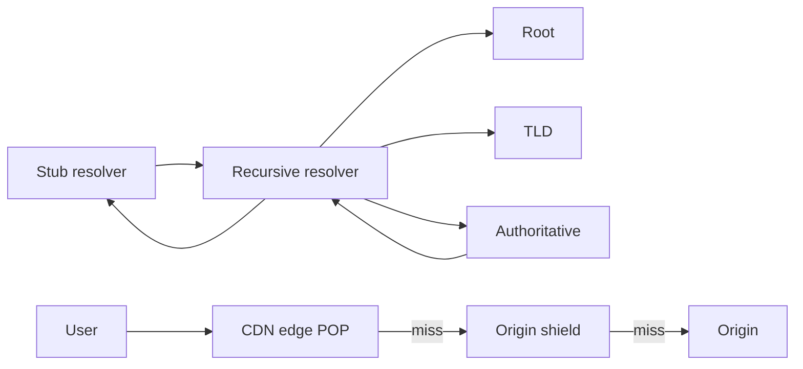

# DNS and the CDN Edge

## TL;DR

DNS answers a name with an address, and every answer is cached for a TTL you chose.
A CDN answers the bytes for that name from a location near the user, and it is a cache with a geography.
Both are part of your recovery time and your staleness budget.

## Resolution

The stub resolver on the laptop asks a recursive resolver.
The recursive resolver walks root, TLD, and authoritative servers unless a cache hits.
The record it caches is the one you published, for the TTL you published.
A long TTL makes you cheap and makes failover slow.
A short TTL makes failover faster and makes your authoritative servers part of the hot path.
Anycast steers the recursive query, or the HTTP request, to a nearby site without a DNS change.
[[Multi-Region-Active-Active]] depends on which of these you actually use.

Negative caching remembers that a name does not exist.
A typo during a migration can stick.
Plan the TTL for the NXDOMAIN too.

## The edge cache

The cache key is not "the URL" unless you define the URL.
Host, path, query string, and selected headers (`Accept-Encoding`, cookies, `Authorization`) all change the object.
A cache that includes a session cookie caches one copy per user and saves nothing.
A cache that ignores a query string serves the wrong variant.

Origin shield collapses misses from many edge sites into one fetch.
Without it, a popular purge or a cold object becomes a stampede on the origin.
The same stampede as [[Caching-and-Invalidation]], one tier earlier.
Video uses range requests and short segments so one viewer does not pin a whole file.
[[08-Video-Streaming-Platform/design|The video study]] is that design.

Purge is eventual.
A legal takedown that requires a hard bound needs a short TTL or a signed URL that expires, not hope.

## Pitfalls

- Health-checking the origin from one city and steering the world on that result.
- Forgetting that mobile resolvers ignore low TTLs and pin an old address.
- Terminating TLS at the edge and sending the origin cleartext across a network you do not control.
- Caching personalized HTML because the response forgot `Cache-Control: private`.

## Interview questions

1. Your database fails over in 20 seconds and your users still write to the old region for 5 minutes. What is caching the address.
2. What belongs in a CDN cache key for an image, and what must not.
3. Why does a purge API not give you a synchronous global delete.
4. Where does origin shield sit, and what failure does it absorb.

## Further reading

- RFC 1034 and RFC 1035 for the lookup model.
- [[Load-Balancing]] for what happens after the name resolves inside one region.
- [[Amazon-S3-and-Object-Storage]] for the origin behind most of these edges.
