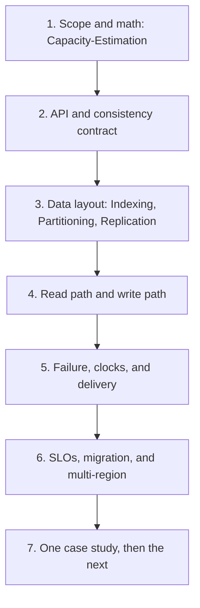

# Distinguished System Design Path

## TL;DR

This folder is the theory.
The case studies are the same theory applied to a product.
A design is finished when you can name the invariant, the failure that breaks it, the latency you pay to protect it, and the operation that repairs it at 3 a.m.

## How the module is built

Read in this order.
Do not start from a product diagram.

| Layer | What you are learning | Where it lives |
|---|---|---|
| Contract | What must be true after a crash | [[Consistency-Models]], [[ACID-vs-BASE]], [[CAP-Theorem-and-PACELC]] |
| Placement | Where bytes live | [[Partitioning-and-Sharding]], [[Consistent-Hashing]], [[Indexing-and-Access-Paths]] |
| Copies | How updates spread | [[Replication-and-Quorums]], [[Time-Clocks-and-Ordering]], [[Consensus-and-Failure-Detection]] |
| Speed | What you keep off the disk | [[Caching-and-Invalidation]], [[DNS-and-CDN]], [[Probabilistic-Structures]] |
| Coupling | How services talk without lying | [[Idempotency-and-Delivery]], [[Outbox-CDC-and-Event-Sourcing]], [[Backpressure-and-Tail-Latency]] |
| Change | How the system evolves | [[Schema-Evolution-and-Migration]], [[Multi-Region-Active-Active]], [[SLOs-and-Observability]] |

[[04-System-Design/01-LLD/README|Low-level design]] is the same standard inside one process: types, invariants, and threads.
The technology notes under data stores, messaging, and infrastructure are implementations of these ideas.
[[System-Design-Concept-Map]] is the bridge from the idea to the product that ships it.
[[Raft-Consensus]], [[LSM-Tree]], [[Write-Ahead-Log]], and [[saga_pattern]] are the labs.
The labs are teaching code.
The notes name the production hazards those labs leave out.

## What changes at each level

An L4 design names the boxes and the main table.
An L5 design shards that table, caches the hot read, and puts a queue in front of the slow write.
An L6 design states the quorum, the replication lag, the idempotency key, and the failover.
An L7 design states the clock, the conflict, the region topology, the error budget, and the migration that does not stop writes.

The interview and the production review use the same questions.

1. What is the user-visible invariant.
2. What is the write path, in order, including the disk flush.
3. What is the read path, and which replica is it allowed to see.
4. What happens when the leader dies between the append and the ack.
5. What is the hot key, and what is the mitigation that is not "add a cache".
6. What number did you estimate, and which term dominates.
7. What do you page a human for.

## How to read a case study

Each case study in [[04-System-Design/02-Case-Studies/README|the case study hub]] is one product.
Steal the failure section before you memorize the diagram.
Then redo the capacity math with your own peak factor.
If you cannot change one assumption and recompute storage and bandwidth, you do not own the design.

The ten original studies cover redirect, rate limit, chat, ids, feed, dispatch, crawl, video, tickets, and flash sale.
The later studies cover a Dynamo-style store, typeahead, notifications, a collaborative document, a payment ledger, a metrics platform, file sync, and a lock service.
Together they are the designs a staff loop actually asks for.

## Interview shape

Spend the first minutes on scope, not on product names.
Write the API and the one invariant on the board before you draw a box.
Estimate with powers of ten from [[Capacity-Estimation]].
Draw one write path and one read path.
Deep-dive the component that can lose or double the user's data.
Close with the SLO, the dashboard, and the migration.

## Further reading

- Designing Data-Intensive Applications, Martin Kleppmann.
- The Datacenter as a Computer, and The Tail at Scale, Barroso, Clidaras, and Dean.
- The Dynamo paper, and the Spanner paper, for two opposite answers to the same replication problem.
