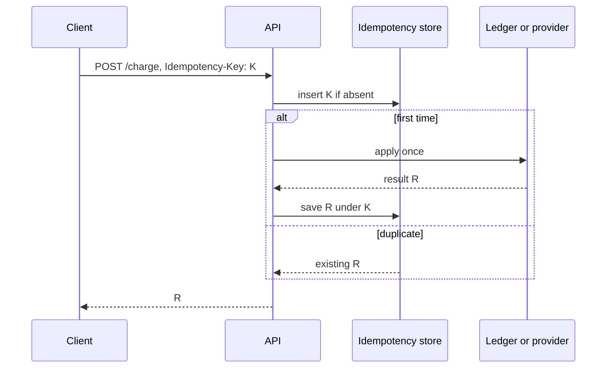

# Idempotency and Delivery Guarantees

## TL;DR

Networks deliver a message zero times, one time, or more than once.
They do not deliver it exactly once.
Exactly-once is a property of the effect the user sees, built from at-least-once delivery plus an idempotent handler.

## The three words

At-most-once means the sender does not retry.
A timeout is a lost request.
At-least-once means the sender retries until it sees an ack.
A lost ack becomes a duplicate.
Exactly-once, as a product claim, means a retry does not apply the effect twice.



The idempotency record and the effect have to commit together, or you will ack a charge you did not post.
The practical shape is one database transaction that inserts the key and the ledger row.
If the effect is an external provider, store the key as "in progress", call the provider with the same key, and record the result.
A crash in the middle must resume, not start a second charge.
[[15-Payment-Ledger/design|The payment study]] is this protocol with money.

## Effectively once in a log

[[Apache-Kafka]] can deduplicate producer retries inside a session with a producer id and a sequence number.
That stops the broker from appending the same batch twice.
It does not stop your consumer from applying a message twice after a crash between the side effect and the offset commit.
Commit the offset in the same transaction as the effect, or make the effect idempotent and accept at-least-once.
Kafka transactions across a consume-transform-produce flow are real, and they have a coordinator, a timeout, and a read-committed consumer.
Say that, instead of saying "Kafka is exactly-once".

## Worked record

```python
def apply_once(store: dict, key: str, effect) -> object:
    if key in store:
        return store[key]
    store[key] = "in-progress"
    result = effect()
    store[key] = result
    return result
```

This sketch is correct only when `store` and `effect` share a failure domain.
If `effect` can succeed and the process dies before `store[key] = result`, the next call runs `effect` again.
That is the whole bug.
A real store writes "in progress" durably first, and `effect` itself takes the same key.

## Pitfalls

- Dedup keys need a retention window longer than the retry window.
  A key that expires while a client is still retrying will double-apply.
- Hashing the entire request body is a bad key when two intentional payments have the same body.
  The client must send a key that means "this attempt".
- At-least-once plus a handler that sends email will send two emails unless the handler records the send.
- Reordering is a separate problem from duplication.
  Partition by the aggregate id if the consumer needs per-entity order.

## Interview questions

1. The provider charged the card and the HTTP response was lost. What do you store so the retry does not charge again.
2. Why is "exactly-once delivery" the wrong sentence, and what sentence replaces it.
3. Where do you put the idempotency row relative to the outbox row.
4. How long do you keep the key, and what goes wrong if you keep it for five minutes.

## Further reading

- Helland, Life beyond Distributed Transactions, CIDR 2007.
- [[Outbox-CDC-and-Event-Sourcing]] for the dual-write problem next to this one.
- [[saga_pattern]] when the effect spans several services and must be undone rather than deduplicated.
