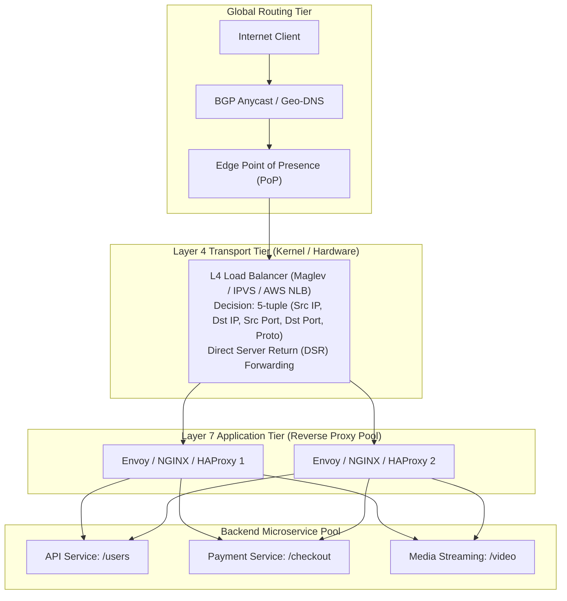
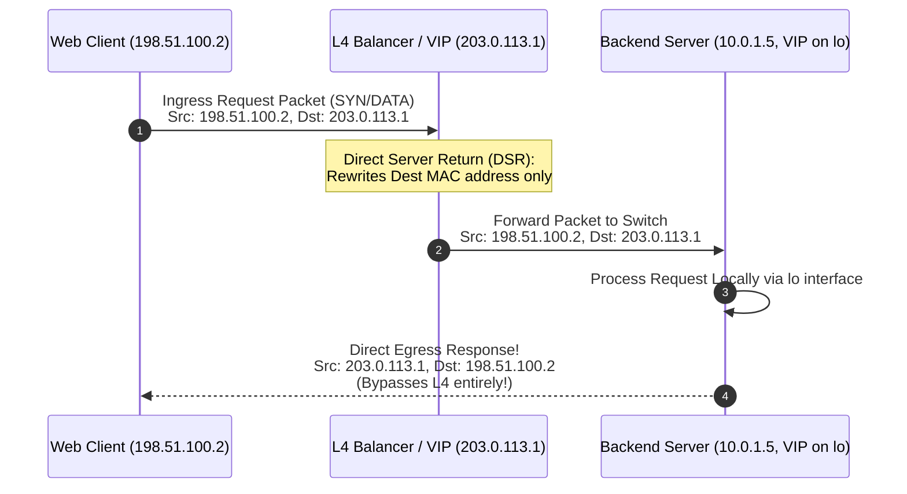

# Load Balancing

## TL;DR
Load balancing distributes incoming network traffic across a pool of backend compute instances to maximize throughput, minimize latency, and prevent overload on individual servers.
Load balancers operate primarily at two layers: **Layer 4 (L4)**, which makes routing decisions based on network/transport headers (IP and TCP/UDP ports) without inspecting payload content; and **Layer 7 (L7)**, which terminates connections, decrypts TLS, and routes traffic based on application-level semantics (HTTP paths, headers, cookies, and gRPC methods).
Routing algorithms range from stateless Round Robin and IP Hash to adaptive, state-aware strategies like Weighted Least Connections and the **Power of Two Random Choices (P2C)** with Peak-EWMA.
At global scale, Global Server Load Balancing (GSLB) leverages BGP Anycast and Geo-DNS to direct users to the nearest regional datacenter edge.

## Mental Model
Think of Layer 4 load balancing as a highway interchange.
Vehicles are routed to different highway lanes based solely on the vehicle category and license plate without opening the trunk or checking passenger passports.
Traffic moves at full speed with minimal processing delay.
Think of Layer 7 load balancing as customs inspection at an international airport.
Every traveler's passport is examined, baggage is scanned, visa stamps are verified, and travelers are routed to specific immigration lines depending on their flight origin, residency status, and purpose of travel.
Inspection takes more time and processing power, but allows precise security screening, translation, and prioritization.



## How It Works (Internals)

### 1. Layer 4 vs Layer 7 Internals

#### Layer 4 Load Balancing (Transport Layer)
Operates at the OSI transport layer (TCP, UDP).
- **Packet-Level Inspection**: Inspects only the IP header and TCP/UDP header (the 5-tuple: Source IP, Source Port, Destination IP, Destination Port, Protocol).
- **Zero Payload Buffering**: Does not decrypt TLS or parse HTTP payloads.
- **Packet Forwarding Modes**:
  1. *Network Address Translation (NAT / DNAT)*: The load balancer rewrites the packet's destination IP to the selected backend IP. Return packets must flow back through the load balancer so it can rewrite the source IP.
  2. *Direct Server Return (DSR)*: The load balancer rewrites only the destination MAC address (or encapsulates the packet in a GRE/IP-in-IP tunnel).
  Backends share the same virtual IP (VIP) on a loopback interface (`lo`).
  Crucially, backends reply **directly to the client**, bypassing the load balancer entirely.
  Because response traffic (video, images, JSON) is typically 10x to 100x larger than request traffic, DSR achieves massive throughput scaling.



#### Layer 7 Load Balancing (Application Layer)
Operates at the OSI application layer (HTTP, HTTPS, HTTP/2, HTTP/3, gRPC, WebSocket).
- **Dual TCP Termination**: Terminates the client's TCP handshake and TLS session. Reads the complete HTTP request line, headers, and body. Opens a separate, persistent connection pool to backend servers.
- **Intelligent Routing**:
  - Path routing: `/api/v1/auth` routes to Auth Service, `/stream` routes to Media Cluster.
  - Header inspection: `Accept-Encoding: gzip`, `User-Agent: Mobile`, or `X-Beta-Cohort: true` (Canary deployments).
  - Cookie stickiness: Routes requests containing `session_id=XYZ` to the same backend host.
  - Rate limiting and WAF: Inspects SQL injection patterns and enforces token-bucket limits before passing traffic to compute.

### 2. Load Balancing Algorithms

| Algorithm | Mechanism | Best Use Case | Downside |
| :--- | :--- | :--- | :--- |
| **Round Robin** | Sequential cyclic rotation ($i = (i + 1) \pmod N$) | Homogeneous servers and identical request processing times | Poor when request processing times vary by orders of magnitude |
| **Weighted Round Robin** | Rotation proportional to assigned capacity weights | Heterogeneous hardware with differing CPU/RAM allocations | Static; does not react to dynamic latency spikes or memory leaks |
| **Least Connections** | Routes to server with smallest count of active open connections | Long-lived transactions, SQL queries, or WebSocket connections | Ignores request complexity; an idle connection counts same as heavy query |
| **Power of Two Choices (P2C)** | Selects two random nodes, picks the one with lower load/latency | High-scale distributed clusters, microservice meshes (Finagle, Envoy) | Near-optimal with zero global state synchronization overhead |
| **Consistent Hashing** | Hashes request attribute (IP or Session ID) onto a ring | Caching tiers (Redis/Memcached), stateful in-memory game servers | Vulnerable to hot-spotting on high-traffic keys |

#### The Power of Two Random Choices (P2C) with Peak-EWMA
Michael Mitzenmacher proved that picking the best of two randomly selected nodes dramatically reduces maximum queue lengths compared to pure random routing.
Modern service meshes (like Twitter Finagle and Envoy) combine P2C with **Peak Exponentially Weighted Moving Average (Peak-EWMA)** latency tracking:
1. When routing a request, pick two candidate nodes $A$ and $B$ uniformly at random.
2. Calculate the estimated latency cost:
$$\text{Cost}_i = \text{ActiveRequests}_i \times \text{PeakEWMA}_i$$
3. Route the request to the candidate with the lower cost.
This avoids the herd collapse of "Least Connections" (where all clients simultaneously dump thousands of requests onto a newly booted node) while adapting dynamically to background CPU degradation.

### 3. Health Checking Mechanics

1. **Active Health Checks**:
   - The load balancer periodically issues synthetic probes (e.g., an HTTP GET to `/healthz` or a TCP three-way handshake every 5 seconds).
   - If a backend fails $K$ consecutive probes (e.g., returns 503 or times out), it is pulled from the active pool.
2. **Passive Health Checks (Outlier Detection)**:
   - The load balancer monitors real user traffic.
   - If an instance returns five consecutive HTTP 500 errors to user requests within a 10-second window, it is temporarily ejected for an ejection cooldown period (e.g., 30 seconds).

## Trade-offs and When to Use

| Architectural Dimension | Layer 4 Load Balancing (L4) | Layer 7 Load Balancing (L7) |
| :--- | :--- | :--- |
| **Throughput / Packet Rate** | Ultra-high ($10M+$ packets/sec per node) | Medium to high ($50K\text{ - }200K$ RPS per node) |
| **CPU / Resource Cost** | Low; minimal memory copies, kernel bypass | High; TLS cryptography, HTTP parsing, header manipulation |
| **Routing Capability** | IP and Port only | Path, query parameters, headers, cookies, gRPC methods |
| **TLS Termination** | Pass-through only (backends must manage certs) | Terminated at edge; offloads certificate management |
| **Connection Multiplexing** | 1:1 client-to-backend TCP connection ratio | HTTP/2 multiplexing; pools backend keep-alive connections |

### Decision Framework
- **Deploy L4 at the Edge (Ingress Tier)**: Use L4 (e.g., AWS NLB, Linux IPVS, or Maglev) to receive public Internet traffic on public VIPs, handling DDoS packet floods, syn-cookies, and routing directly to a fleet of L7 proxies via DSR.
- **Deploy L7 behind L4 (Application Gateway Tier)**: Use L7 (e.g., Envoy, NGINX, HAProxy) to terminate TLS, apply path-based microservice routing, validate authentication tokens, enforce rate limits, and provide canary traffic splitting.

## Failure Modes and Pitfalls

### 1. Herd Collapse on Server Revival (The Thundering Herd)
- *Failure*: A new or recovered node joins a pool managed by a "Least Connections" load balancer.
Because its connection count is $0$, the load balancer dumps thousands of incoming requests onto this single node simultaneously.
The newly booted JVM or Python worker has unprimed caches and cold JIT compilers; its queues overflow immediately, crashing the instance again.
- *Mitigation*: Configure **Slow Start (Warm-up)** intervals in the load balancer (e.g., HAProxy `slowstart 60s`), ramping traffic linearly from 0% to 100% over several minutes.

### 2. Flapping and Cascading Health Check Death Spirals
- *Failure*: Under heavy load, backend servers experience CPU starvation.
Health check probes to `/healthz` begin timing out.
The load balancer marks 30% of nodes unhealthy and evicts them.
The remaining 70% of nodes now absorb 100% of the traffic, driving their CPU even higher.
Their health checks fail, leading to total cluster eviction and complete outage.
- *Mitigation*:
  1. Enforce a **Minimum Healthy Fraction** (e.g., panic threshold: if $> 50\%$ of nodes are reported dead, the load balancer ignores health checks and routes across all nodes).
  2. Implement shallow health checks (`/livez` checking simple process liveliness, separate from `/readyz` checking database dependencies).

### 3. Sticky Session Memory Imbalance
- *Failure*: Using source-IP hash or cookie-based session stickiness in enterprise environments.
All 10,000 employees of a large corporate client browse through a single outbound corporate NAT gateway IP.
The load balancer maps that single IP to one backend server, severely overwhelming that node while neighboring nodes sit idle.
- *Mitigation*: Avoid source-IP hashing for public web apps; use encrypted HTTP session cookies or push state into an external Redis cluster.

## Hands-On

### 1. Production HAProxy Configuration (L4 vs L7)
Save this configuration as `haproxy.cfg`:

```haproxy
global
    maxconn 50000
    log stdout format raw local0

defaults
    log     global
    mode    http
    timeout connect 5000ms
    timeout client  50000ms
    timeout server  50000ms

# --- LAYER 4 TCP FORWARDING (e.g., Database or Raw Stream) ---
frontend l4_db_in
    bind *:3306
    mode tcp
    default_backend db_cluster

backend db_cluster
    mode tcp
    balance roundrobin
    server db1 10.0.1.10:3306 check
    server db2 10.0.1.11:3306 check backup

# --- LAYER 7 HTTP ROUTING WITH HEALTH CHECKS & WARMUP ---
frontend l7_web_in
    bind *:80
    bind *:443 ssl crt /etc/ssl/certs/site.pem
    mode http

    # Path-based routing rules
    acl is_api path_beg /api/
    acl is_checkout path_beg /checkout/

    use_backend api_pool if is_api
    use_backend checkout_pool if is_checkout
    default_backend web_pool

backend api_pool
    mode http
    balance roundrobin
    # Slowstart ramps traffic to revived nodes over 60 seconds
    server api1 10.0.2.1:8080 check slowstart 60s
    server api2 10.0.2.2:8080 check slowstart 60s

backend checkout_pool
    mode http
    balance leastconn
    cookie SRV_ID insert indirect nocache
    server pay1 10.0.3.1:8443 check cookie p1
    server pay2 10.0.3.2:8443 check cookie p2
```

### 2. Python Simulator: Power of Two Choices (P2C) vs Round Robin
Run this script to observe how P2C prevents queue imbalances compared to Round Robin when request processing times vary:

```python
"""
Educational simulator comparing Load Balancing Algorithms:
Round Robin vs Power of Two Random Choices (P2C) under variable service times.
No external dependencies required (Python 3.10+).
"""
import random
from dataclasses import dataclass

@dataclass
class Server:
    id: int
    queue_length: int = 0

def simulate_round_robin(servers: list[Server], requests: list[int]):
    rr_idx = 0
    for req_work in requests:
        servers[rr_idx].queue_length += req_work
        rr_idx = (rr_idx + 1) % len(servers)

def simulate_p2c(servers: list[Server], requests: list[int]):
    num_servers = len(servers)
    for req_work in requests:
        # Pick two servers uniformly at random
        idx1, idx2 = random.sample(range(num_servers), 2)
        s1, s2 = servers[idx1], servers[idx2]
        # Choose the server with the smaller queue
        chosen = s1 if s1.queue_length <= s2.queue_length else s2
        chosen.queue_length += req_work

def main():
    num_servers = 10
    total_requests = 100_000

    # Request workloads are heavily skewed: 95% fast (1 unit), 5% heavy (20 units)
    workloads = [20 if random.random() < 0.05 else 1 for _ in range(total_requests)]

    # 1. Evaluate Round Robin
    rr_servers = [Server(i) for i in range(num_servers)]
    simulate_round_robin(rr_servers, workloads)
    rr_queues = [s.queue_length for s in rr_servers]

    # 2. Evaluate P2C
    p2c_servers = [Server(i) for i in range(num_servers)]
    simulate_p2c(p2c_servers, workloads)
    p2c_queues = [s.queue_length for s in p2c_servers]

    print("=== Load Balancing Algorithm Evaluation ===")
    print(f"Total Requests Processed: {total_requests}")
    print(f"Round Robin Queues: {rr_queues}")
    print(f"  Max Queue: {max(rr_queues)}, Min Queue: {min(rr_queues)}, Spread: {max(rr_queues) - min(rr_queues)}")
    print(f"P2C Queues:         {p2c_queues}")
    print(f"  Max Queue: {max(p2c_queues)}, Min Queue: {min(p2c_queues)}, Spread: {max(p2c_queues) - min(p2c_queues)}")
    print(f"Spread reduction: {((max(rr_queues)-min(rr_queues)) - (max(p2c_queues)-min(p2c_queues))) / (max(rr_queues)-min(rr_queues)) * 100:.1f}% tighter distribution with P2C!")

if __name__ == "__main__":
    main()
```

## Performance and Capacity
- **Direct Server Return (DSR) Throughput Advantage**:
  In standard NAT proxying, both ingress (request) and egress (response) traffic pass through the load balancer.
  If average request is $2\text{ KB}$ and average response is $100\text{ KB}$, the load balancer requires $102\text{ KB}$ of bandwidth per transaction.
  With DSR, only the $2\text{ KB}$ ingress packet traverses the load balancer; the $100\text{ KB}$ response streams directly from backend NIC to client gateway.
  A single 40 Gbps L4 DSR load balancer can easily manage an application fleet delivering $500\text{ Gbps}$ of aggregate egress traffic.
- **Connection Table Memory**:
  Stateful L4 balancers maintain connection tracking tables (`conntrack`):
  Each TCP session requires $\approx 128\text{ bytes}$ of kernel memory.
  Maintaining $10,000,000$ concurrent TCP connections consumes:
  $$10^7 \times 128\text{ bytes} \approx 1.28\text{ GB RAM}$$

## In Production
- **Google Maglev**: Google's software network load balancer deployed at every edge point-of-presence.
Maglev runs on commodity Linux servers without hardware ASIC switches.
It uses kernel-bypass networking (receiving raw Ethernet packets directly into user space memory buffers) and consistent hashing with Direct Server Return to forward packets at line rate (over 10 million packets per second per server).
- **Cloudflare (Unimog)**: Uses BGP Anycast to announce the same IP address from hundreds of cities globally.
Routers deliver the packet to the geographically nearest datacenter, where Unimog uses L4 XDP/eBPF packet processing to distribute traffic across physical server racks.

### Operational Checklist
- [ ] Configure graceful connection draining (deregistration delay) with adequate timeouts (e.g., 30-60 seconds) so inflight requests complete before a server is terminated.
- [ ] Ensure health check endpoints are lightweight, return HTTP 200 fast, and do not execute heavy recursive database queries.
- [ ] Configure keep-alive connection pooling between L7 reverse proxies and backend servers to eliminate TCP handshake latency.

## Interview Questions

> [!question]
> **Question 1 (Junior):** What is the fundamental difference between Layer 4 and Layer 7 load balancing?
> [!success]- Answer
> Layer 4 load balancing operates at the transport layer (TCP/UDP), routing traffic based strictly on IP addresses and port numbers without inspecting or decrypting the packet payload. Layer 7 load balancing operates at the application layer (HTTP/HTTPS/gRPC), terminating the TCP connection and TLS session, inspecting headers, cookies, URL paths, and query parameters to execute intelligent, content-based routing.

> [!question]
> **Question 2 (Mid-Level):** What is Direct Server Return (DSR), and why is it used in high-throughput architectures?
> [!success]- Answer
> In Direct Server Return (DSR), incoming client request packets pass through the Layer 4 load balancer to a backend server (via MAC rewriting or IP tunneling), but backend servers send their response packets directly back to the client, bypassing the load balancer completely. Because web responses (HTML, video, images) are typically 50x to 100x larger than request payloads, DSR eliminates the load balancer as an egress bandwidth bottleneck, allowing a single load balancer to front massive traffic volumes.

> [!question]
> **Question 3 (Mid-Level):** Explain the "Power of Two Random Choices" (P2C) load balancing algorithm.
> [!success]- Answer
> Instead of picking a single node sequentially (Round Robin) or scanning all nodes to find the absolute minimum load ($O(N)$ overhead), P2C picks two candidate nodes uniformly at random and routes the request to whichever of the two has lower load or active connection count. Mathematically, this simple randomized selection achieves near-optimal load distribution ($O(\log \log N)$ maximum queue length) with zero centralized state synchronization.

> [!question]
> **Question 4 (Senior):** What is the "Panic Threshold" in load balancer health checking, and why is it critical during major outages?
> [!success]- Answer
> The Panic Threshold is a fail-safe configuration (common in Envoy) where, if the percentage of healthy hosts drops below a specific threshold (e.g., below 50%), the load balancer ignores all health check failures and routes traffic across 100% of the hosts in the pool. This prevents a cascading failure where an initial overload causes a few hosts to fail health checks, which then dumps more traffic on the survivors, causing all remaining hosts to fail health checks in a death spiral.

> [!question]
> **Question 5 (Senior):** How does BGP Anycast work for global load balancing, and what happens to active TCP connections if routing changes?
> [!success]- Answer
> In BGP Anycast, multiple geographically distributed datacenters announce the exact same IP address to upstream Internet transit providers via Border Gateway Protocol (BGP). The Internet routing mesh naturally routes each client packet to the topologically closest datacenter. However, because BGP routes can change mid-session, packets belonging to an active TCP connection can suddenly be routed to a different datacenter that has no record of the TCP state. To handle this, modern edge networks (like Google Maglev or Cloudflare) use distributed consistent hashing and IP-in-IP forwarding tunnels between datacenters to forward misplaced packets to the original handling host.

> [!question]
> **Question 6 (Staff):** How would you design a zero-downtime blue-green deployment routing architecture using a Layer 7 load balancer?
> [!success]- Answer
> Configure the L7 proxy (e.g., Envoy or NGINX) with weighted upstream clusters: (1) Maintain `v1_blue` (current production, 100% weight) and deploy `v2_green` (new release, 0% weight). (2) Send synthetic internal test traffic to `v2_green` by setting a custom header rule (`X-Canary-Test: true`). (3) Initiate canary rollout by shifting weights: 95% blue / 5% green. (4) Monitor error rates, latency (p99), and crash metrics on `v2_green`. (5) Incrementally shift traffic: 25%, 50%, 100%. (6) Keep `v1_blue` running at 0% weight for a 15-minute bake window for instant rollback capability before tearing down the old containers.

> [!question]
> **Question 7 (Staff):** How does gRPC load balancing differ fundamentally from HTTP/1.1 load balancing, and why does an L4 load balancer break gRPC scaling?
> [!success]- Answer
> HTTP/1.1 opens new TCP connections periodically or multiplexes requests sequentially. An L4 load balancer distributes those distinct TCP connections across backends. In contrast, gRPC runs over HTTP/2, which establishes a single long-lived TCP connection and multiplexes hundreds of concurrent RPC streams over that single connection. An L4 load balancer routes the entire TCP connection to a single backend server, meaning **all** subsequent RPCs from that client hit the same server forever, causing catastrophic load imbalance. gRPC requires either: (1) An L7 load balancer (Envoy) that understands HTTP/2 frames and balances RPCs stream-by-stream; or (2) Client-side load balancing (e.g., gRPC Lookaside / xDS) where clients maintain connection pools to all backends and balance RPCs locally.

> [!question]
> **Question 8 (Staff):** Explain how consistent hashing with bounded loads (Mirrokni et al.) resolves the hot-spot vulnerability in cache load balancing.
> [!success]- Answer
> Standard consistent hashing maps keys to the nearest node on the ring. If a single key or key cluster receives massive traffic, that single node is overwhelmed while others remain idle. Consistent hashing with bounded loads defines a strict capacity ceiling for each node: $C = (1 + \epsilon) \frac{\text{Total Load}}{N}$, where $\epsilon$ is a balance factor (e.g., 0.25). When a key hashes to node $A$, the router checks if node $A$'s current load is $< C$. If so, it routes to $A$. If $A$ is full, the router walks clockwise to the next node whose load is below the ceiling. This mathematically bounds the maximum load of any node to at most $1 + \epsilon$ times the average while preserving high cache locality.

## Related
- [[NGINX-Architecture|NGINX Architecture]]: Deep dive into an event-driven L7 reverse proxy.
- [[HAProxy-Architecture|HAProxy Architecture]]: High-performance L4/L7 load balancer configuration.
- [[Vertical-vs-Horizontal-Scaling|Vertical vs Horizontal Scaling]]: The scaling needs driving load balancer deployment.
- [[Consistent-Hashing|Consistent Hashing]]: Core algorithm for stateful and cache-aware load balancing.

## Further Reading
- Eisenbud, Daniel E., et al. "Maglev: A fast and reliable software network load balancer." *13th USENIX Symposium on Networked Systems Design and Implementation (NSDI 16)*. 2016.
- Mitzenmacher, Michael. "The power of two choices in randomized load balancing." *IEEE Transactions on Parallel and Distributed Systems* 12.10 (2001): 1094-1104.
- Mirrokni, Vahab, Mikkel Thorup, and Morteza Zadimoghaddam. "Consistent hashing with bounded loads." *arXiv preprint arXiv:1608.01350* (2016).
- Beyer, Betsy, et al. *The Site Reliability Workbook: Practical Ways to Implement SRE*. O'Reilly Media, 2018.
