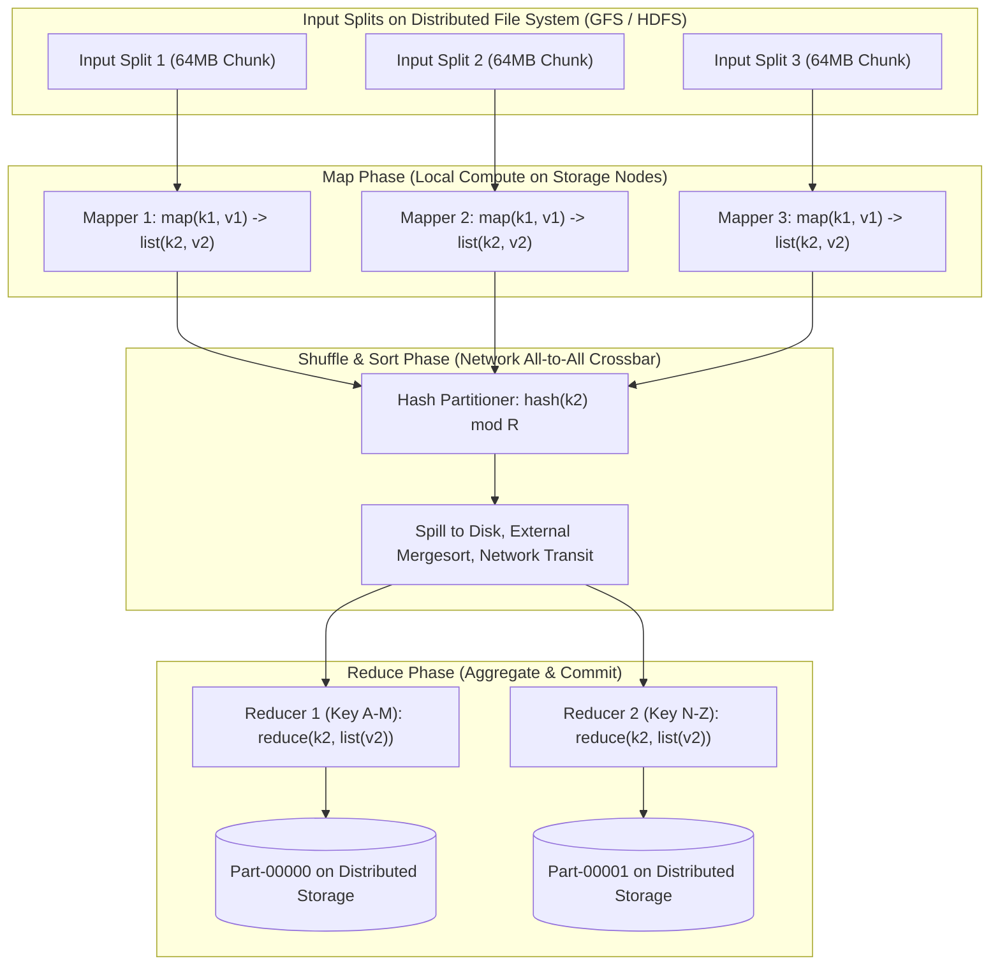
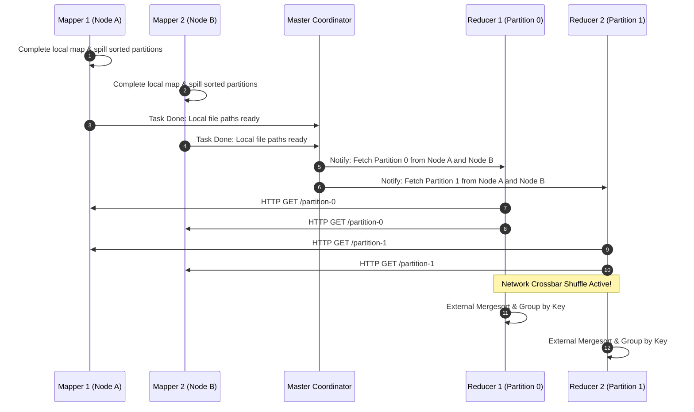

# MapReduce Architecture

## TL;DR
MapReduce is a distributed batch processing programming model and execution framework designed to process multi-terabyte and petabyte datasets in parallel on large clusters of commodity hardware.
The model abstracts parallel computation into two functional primitives: **Map**, which transforms raw input records into intermediate key-value pairs; and **Reduce**, which aggregates and merges all intermediate values associated with each unique key.
Between Map and Reduce lies the **Shuffle and Sort Phase**, a distributed all-to-all network transposition where data is partitioned, transferred, and merged by key.
The architectural genius of MapReduce lies in its automatic fault tolerance: computation is moved to the data (data locality), pure functional tasks can be deterministically re-executed upon worker failure, and slow stragglers are mitigated through speculative backup tasks.
For detailed paper analysis and lab benchmarks, see [[01-CS-Foundations/Operating-Systems/AOS/Part-5-Internet-Scale-Real-Time-and-Security/L09b-MapReduce|AOS MapReduce Paper Analysis]].

## Mental Model
Think of MapReduce as conducting a census across a country with 100,000,000 residents.
Instead of bringing all 100,000,000 citizens to a central sports stadium in the capital city, you dispatch thousands of local census workers (Mappers) to every neighborhood.
Each worker counts the professions in their assigned street, producing intermediate tallies: `("doctor", 2)`, `("engineer", 5)`.
Next, regional postal sorting centers (The Shuffle) aggregate all tallies: all doctor slips from across the entire country are routed to Desk 1, while all engineer slips route to Desk 2.
Finally, a dedicated specialist at Desk 1 (The Reducer) sums all doctor slips, producing the single national total.



## How It Works (Internals)

### 1. The Core Lifecycle Phases

#### Phase 1: Input Splitting and Data Locality
- Input files stored on a distributed file system (Google File System or HDFS) are divided into fixed-size chunks, typically 64 MB to 128 MB.
- **Data Locality Principle**: Moving computation to data is orders of magnitude cheaper than streaming terabytes of data across datacenter switches.
The Master / Coordinator assigns Map tasks to physical machines that already hold a local replica of that specific 64 MB chunk on local disk.
If local execution is impossible, it schedules the task on a node within the same network rack to minimize inter-switch traversal.

#### Phase 2: The Map Phase
- Each Mapper parses its assigned input split sequentially, passing records to the user-defined `map` function:
$$\text{map}(k_1, v_1) \to \text{list}(k_2, v_2)$$
- Intermediate output is **not** written to the distributed file system; it is buffered in an in-memory ring buffer (e.g., 100 MB).
- When the buffer reaches capacity (e.g., 80%), a background thread partitions the entries by target Reducer ($\text{hash}(k_2) \pmod R$), sorts them by key in RAM, and spills them sequentially to local disk.
- **Combiner Optimization (Mini-Reducer)**: To reduce network egress during shuffle, an optional Combiner executes locally on the Mapper node, pre-aggregating values for identical keys (e.g., merging ten thousand `("the", 1)` entries into a single `("the", 10000)` record).

#### Phase 3: The Shuffle and Sort Phase
The shuffle is the architectural bottleneck of MapReduce.
It is an $M \times R$ all-to-all communication mesh:
- Each Reducer pulls its assigned partition slices over HTTP from the local disks of all $M$ Mappers.
- As intermediate partitions stream into the Reducer, the Reducer merges them using a multi-way **External Merge Sort**, grouping identical keys together:
$$(k_2, [v_{2,1}, v_{2,2}, v_{2,3}, \dots])$$



#### Phase 4: The Reduce Phase
- The Reducer iterates over each unique key and its grouped list of values:
$$\text{reduce}(k_2, \text{list}(v_2)) \to \text{list}(k_3, v_3)$$
- The user logic outputs final aggregated results, appending them directly to a durable file on GFS/HDFS (`part-r-00000`).
- Writes use the distributed file system's atomic rename mechanism to guarantee idempotent completion.

### 2. Fault Tolerance and Straggler Mitigation
In a cluster of 5,000 commodity servers, hardware faults, disk bad blocks, and network stalls are daily constants.

1. **Worker Crash Recovery**:
   - The Master periodically pings every worker via heartbeats.
   - If a worker misses heartbeats, the Master marks it dead.
   - Any Map tasks completed by that worker must be **re-executed from scratch**, because their intermediate outputs sat on the dead worker's local disk and are now unreachable.
   - Completed Reduce tasks do **not** need re-execution, because their outputs were written durably to GFS/HDFS with 3x replication.
2. **Deterministic Re-Execution**:
   - Because `map` and `reduce` are functional, stateless operations, re-executing a task produces identical outputs.
3. **Speculative Execution (Backup Tasks)**:
   - The overall completion time of a job is dictated by the slowest machine in the cluster (the **Straggler**).
   - Stragglers occur due to degraded disk heads, memory leaks, or bad CPU cooling that throttles clock speeds.
   - When a job approaches 95% completion, the Master identifies the remaining in-progress tasks and spawns duplicate "speculative" backup instances on other idle nodes.
   - Whichever instance finishes first commits its output, and the Master kills the duplicate, cutting total job runtimes by 30% to 50%.

## Trade-offs and When to Use

| Dimension | Google / Hadoop MapReduce | Apache Spark | Presto / Trino / Impala |
| :--- | :--- | :--- | :--- |
| **Execution Model** | Disk-based, batch, staged execution | In-memory Directed Acyclic Graph (DAG) | In-memory pipelined streaming |
| **Intermediate State** | Spilled to local disk after every Map phase | Cached in RAM across stages (RDDs / DataFrames) | Streamed over network; zero disk spillage |
| **Iterative ML Workloads** | Unusable (each iteration reads/writes to disk) | Excellent (10x - 100x faster than MapReduce) | Not designed for multi-stage ML |
| **Fault Recovery Cost** | Minimal; resumes from last spilled disk stage | Reconstructs lost partitions via RDD lineage | Query fails and must be re-executed from start |
| **Resource Efficiency** | High on constrained RAM; runs on commodity scrap | Requires massive RAM clusters to avoid disk thrashing | Memory-bound; fails if query exceeds memory pool |

## Failure Modes and Pitfalls

### 1. The Reducer Data Skew Problem
- *Failure*: In a word-count job, the partition key is the word.
Words like "the", "a", and "and" represent 30% of all occurrences.
While 99 reducers finish in 2 minutes, the single reducer assigned to common stop words grinds for 4 hours, bottlenecking the entire job.
- *Mitigation*:
  1. Filter out stop words in the Mapper.
  2. Implement a custom Partitioner with **Salting**: append a random salt to hot keys (`"the_1"`, `"the_2"`), run a two-phase MapReduce aggregation.
  3. Aggressively leverage Combiners to pre-aggregate frequencies on the Mapper nodes.

### 2. Shuffle Network Saturation
- *Failure*: An unoptimized MapReduce job emits massive intermediate payloads with no Combiner.
During the shuffle phase, thousands of Reducers initiate simultaneous HTTP connections across rack switches, saturating core datacenter links and triggering packet drops.
- *Mitigation*: Compress intermediate Map outputs using fast compression algorithms (Snappy or LZ4) and optimize Combiner functions.

### 3. Out-Of-Memory (OOM) in In-Memory Map Buffer
- *Failure*: Mappers process individual records that contain multi-megabyte strings, or the Map in-memory buffer limit is set too high relative to the JVM heap size.
The worker experiences violent garbage collection pauses, misses heartbeats, is declared dead by the Master, and restarts in an endless loop.
- *Mitigation*: Rightsize `mapreduce.task.io.sort.mb` to no more than 40% of worker JVM heap, and enforce record streaming rather than loading entire objects in RAM.

## Hands-On

### 1. Python MapReduce Framework with Multiprocessing
Run this self-contained script demonstrating the complete MapReduce lifecycle: input splitting, parallel mapping, partitioning, external shuffle grouping, and reduce aggregation:

```python
"""
Educational implementation of the MapReduce Architecture.
Simulates parallel Map workers, Shuffle/Partitioning, and Reduce workers.
No external dependencies required (Python 3.10+).
"""
import multiprocessing as mp
from collections import defaultdict
import re

# --- USER DEFINED FUNCTIONS ---
def mapper(document_id: str, text: str) -> list[tuple[str, int]]:
    # Word count mapper: tokenize words and emit (word, 1)
    tokens = re.findall(r'\b[a-zA-Z]+\b', text.lower())
    return [(word, 1) for word in tokens]

def reducer(key: str, values: list[int]) -> tuple[str, int]:
    # Sum occurrences
    return (key, sum(values))

# --- FRAMEWORK ENGINE ---
def partition_key(key: str, num_reducers: int) -> int:
    return hash(key) % num_reducers

def map_worker(split: tuple[str, str], num_reducers: int) -> dict[int, list[tuple[str, int]]]:
    doc_id, content = split
    intermediate = mapper(doc_id, content)
    
    # Partition locally by reducer target
    partitioned = defaultdict(list)
    for k, v in intermediate:
        r_id = partition_key(k, num_reducers)
        partitioned[r_id].append((k, v))
    return dict(partitioned)

def reduce_worker(key_values_pairs: list[tuple[str, list[int]]]) -> list[tuple[str, int]]:
    results = []
    for key, values in key_values_pairs:
        results.append(reducer(key, values))
    return results

def main():
    dataset = [
        ("doc1", "Distributed systems scale out horizontally across commodity hardware."),
        ("doc2", "Commodity hardware experiences frequent failures in modern datacenters."),
        ("doc3", "MapReduce abstracts distributed computing into map and reduce phases.")
    ]
    num_reducers = 2

    print(f"Starting MapReduce Job: {len(dataset)} Input Splits, {num_reducers} Reducers")

    # 1. PARALLEL MAP PHASE
    with mp.Pool(processes=len(dataset)) as pool:
        map_outputs = pool.starmap(map_worker, [(doc, num_reducers) for doc in dataset])

    # 2. SHUFFLE AND SORT PHASE
    # Group all pairs for Reducer 0 and Reducer 1 across all mapper outputs
    shuffle_buckets = defaultdict(lambda: defaultdict(list))
    for mapper_result in map_outputs:
        for r_id, pairs in mapper_result.items():
            for k, v in pairs:
                shuffle_buckets[r_id][k].append(v)

    # Convert to sorted list of (key, list(values)) per reducer
    sorted_reducer_inputs = []
    for r_id in range(num_reducers):
        grouped_items = sorted(shuffle_buckets[r_id].items())
        sorted_reducer_inputs.append(grouped_items)

    print("\n--- Shuffle & Sort Complete ---")
    for r_id, items in enumerate(sorted_reducer_inputs):
        print(f"Reducer {r_id} received {len(items)} unique keys.")

    # 3. PARALLEL REDUCE PHASE
    with mp.Pool(processes=num_reducers) as pool:
        final_outputs = pool.map(reduce_worker, sorted_reducer_inputs)

    # 4. FINAL OUTPUT COMMIT
    print("\n=== Final Aggregated Results ===")
    for r_id, output in enumerate(final_outputs):
        print(f"\n--- Output Part-{r_id:05d} ---")
        for k, total in output[:5]:
            print(f"  {k:15s} : {total}")

if __name__ == "__main__":
    main()
```

## Performance and Capacity
- **Combinatorial Shuffle Complexity**:
  A job with $M = 10,000$ Mappers and $R = 1,000$ Reducers produces:
  $$10,000 \times 1,000 = 10,000,000\text{ intermediate partition files}$$
  Managing 10 million small files creates severe disk seek latency and metadata overhead on the cluster file system, which is why Combiners and intermediate segment spill coalescing are essential.
- **Data Locality Efficiency**:
  Google reported that under normal operations, over 95% of all Map input data is read directly from the local disk of the executing machine, saving petabytes of switch transit bandwidth.

## In Production
- **Google Search Indexing (2004-2010)**: Google used multi-stage MapReduce pipelines to parse raw web crawls, generate link graphs (PageRank), build inverted search indexes, and compute spelling correction dictionaries.
Jobs scaled to thousands of servers and petabytes of data per run.
- **Transition to Modern DAG Engines**: By 2014, Google largely retired MapReduce in favor of **FlumeJava** and **Apache Beam / Cloud Dataflow**, and the broader industry migrated to **Apache Spark**.
The fundamental limitation of MapReduce was its rigid two-stage structure: multi-step algorithms (such as machine learning gradient descent or multi-table joins) were forced to execute as separate MapReduce jobs, writing intermediate state to disk after every step, incurring devastating I/O and serialization penalties.

### Operational Checklist
- [ ] Always implement a Combiner whenever the reduce operation is associative and commutative ($\sum$, $\max$, $\min$, counts).
- [ ] Monitor reducer progress percentiles to detect data skew stragglers early.
- [ ] Enable intermediate compression using Snappy to reduce shuffle network bandwidth.

## Interview Questions

> [!question]
> **Question 1 (Junior):** What are the core responsibilities of the Map phase and the Reduce phase?
> [!success]- Answer
> The Map phase takes raw input splits (records) and applies a transformation function to emit intermediate key-value pairs (`(k2, v2)`). The Reduce phase accepts an intermediate key along with all aggregated values emitted for that key (`(k2, list(v2))`) and merges or aggregates them to produce the final output records.

> [!question]
> **Question 2 (Mid-Level):** What is the "Data Locality Principle" in MapReduce, and how does the coordinator enforce it?
> [!success]- Answer
> The Data Locality Principle states that moving compute code to the node where data resides is far cheaper than streaming large data chunks across network switches. The coordinator reads the distributed file system metadata (GFS/HDFS) to find which physical machines store replicas of the target 64MB chunk, and attempts to schedule the Map task on one of those exact machines. If all replica nodes are busy, it schedules the task on a machine in the same rack.

> [!question]
> **Question 3 (Mid-Level):** What is a "Combiner" in MapReduce, and under what mathematical condition can it be safely used?
> [!success]- Answer
> A Combiner is a "mini-reducer" that runs locally on the Mapper node before the shuffle phase. It pre-aggregates intermediate key-value pairs produced by the local Map task, drastically reducing the volume of data that must be serialized and sent across the network. A Combiner can only be safely used if the reduction operation is mathematically **associative** and **commutative** (e.g., addition, maximum, minimum). It cannot be used directly for non-associative operations like calculating an average (mean).

> [!question]
> **Question 4 (Senior):** If a worker node crashes midway through a MapReduce job, why must completed Map tasks be re-executed, while completed Reduce tasks do not?
> [!success]- Answer
> Completed Map tasks write their intermediate output to the worker's **local disk**. If that worker crashes, its local disk becomes inaccessible, making those intermediate partitions unavailable for subsequent reducers. Therefore, completed Map tasks must be rescheduled and re-executed on another healthy node. In contrast, completed Reduce tasks write their final output directly to the **distributed file system** (GFS/HDFS), which is replicated (typically 3x) across multiple other physical servers, ensuring the data survives the worker crash.

> [!question]
> **Question 5 (Senior):** What is "Speculative Execution" in MapReduce, and what problem does it mitigate?
> [!success]- Answer
> Speculative Execution mitigates the **Straggler Problem**, where a small fraction of machines run significantly slower than normal due to faulty hardware, bad disk sectors, or background CPU contention, dragging out total job completion time. Near the end of a job, the coordinator identifies remaining long-running tasks and launches redundant "speculative" copies on idle machines. Whichever instance finishes first commits its output, and the duplicate is terminated, dramatically reducing p99 job duration.

> [!question]
> **Question 6 (Staff):** How do you detect and resolve severe Reducer Data Skew in a MapReduce or Spark batch job?
> [!success]- Answer
> Reducer data skew is detected by observing task execution metrics: one or two reducers process gigabytes of data and take hours, while others finish in seconds. Mitigations include: (1) **Salting the Key**: append a pseudo-random integer suffix ($0 \dots K-1$) to the hot key in the Mapper, scattering the hot key across $K$ distinct reducers, followed by a second aggregation phase that merges the $K$ salted sums. (2) **Custom Partitioner**: write a partitioner that isolates hot keys into dedicated reducers or uses range partitioning based on input sampling. (3) **Map-Side Join (Broadcast Join)**: if skew occurs during a join, replicate the small table entirely to all mappers, performing the join in memory during the Map phase and eliminating the shuffle/reduce stages completely.

> [!question]
> **Question 7 (Staff):** Why did modern data engineering largely abandon pure MapReduce in favor of Apache Spark and DAG engines?
> [!success]- Answer
> MapReduce enforces a rigid, two-phase Map $\to$ Reduce architecture that forces all intermediate state to be spilled to local disk and read back across network barriers. Real-world workflows (iterative graph processing, machine learning training loops, multi-table joins) require multi-stage pipelines. In MapReduce, chaining requires separate sequential jobs, incurring massive disk I/O, serialization, and coordination overhead. Spark introduced in-memory **Resilient Distributed Datasets (RDDs)** and Directed Acyclic Graph (DAG) query planners, keeping intermediate pipeline data in RAM across stages, achieving 10x to 100x speedups over MapReduce.

> [!question]
> **Question 8 (Staff):** How does the Shuffle phase implement multi-way External Merge Sort when intermediate partition data exceeds available worker RAM?
> [!success]- Answer
> When the partition data streamed from mappers exceeds the Reducer's memory buffer, the reducer spills sorted runs of key-value pairs to local temporary files on disk. Once all mapper partitions have been fetched, the reducer executes a **Multi-Way External Merge Sort**: it initializes an in-memory Min-Heap (or Priority Queue) containing the smallest key from each on-disk run. It continuously pops the minimum key from the heap, emits it to the reduce iterator, and reads the next key from the corresponding disk run into the heap. This allows sorting terabytes of intermediate data using only a fixed, minimal RAM footprint ($O(K)$ where $K$ is the number of spilled runs).

## Related
- [[Hadoop-and-HDFS|Hadoop and HDFS]]: The open-source storage and compute implementation of MapReduce.
- [[Apache-Spark|Apache Spark]]: The in-memory successor to MapReduce.
- [[01-CS-Foundations/Operating-Systems/AOS/Part-5-Internet-Scale-Real-Time-and-Security/L09b-MapReduce|AOS MapReduce Paper Analysis]]: Graduate-level paper review and system internals.

## Further Reading
- Dean, Jeffrey, and Sanjay Ghemawat. "MapReduce: Simplified data processing on large clusters." *Communications of the ACM* 51.1 (2008): 107-113.
- Ghemawat, Sanjay, Howard Gobioff, and Shun-Tak Leung. "The Google file system." *ACM SIGOPS Operating Systems Review* 37.5 (2003): 29-43.
- Zaharia, Matei, et al. "Resilient distributed datasets: A fault-tolerant abstraction for in-memory cluster computing." *9th USENIX Symposium on Networked Systems Design and Implementation (NSDI 12)*. 2012.
- Chambers, Craig, et al. "FlumeJava: easy, efficient data-parallel pipelines." *ACM SIGPLAN Notices* 45.6 (2010): 363-375.
