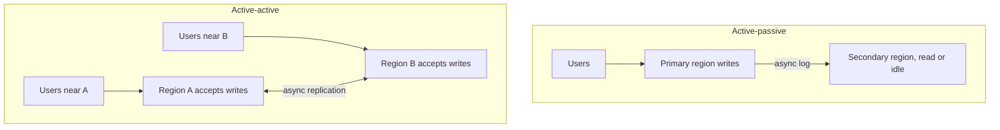

# Multi-Region and Active-Active

## TL;DR

A second region is a latency and failure-domain decision, not a checkbox on a diagram.
Active-passive keeps one region writable and pays failover time.
Active-active keeps two regions writable and pays conflict resolution on every overlapping key.

## Topologies

Active-passive has a recovery point and a recovery time.
The recovery point is how much acked data you can lose.
It is the unreplicated tail.
The recovery time is how long until the secondary accepts writes.
It includes detection, promotion, cache warm, and DNS or anycast cutover.
[[DNS-and-CDN]] TTLs are part of that number.
A 5-minute DNS TTL is a 5-minute recovery unless you have a shorter steering mechanism.

Active-active removes the cross-region round trip from the write.
Two writers will conflict.
You need one of: a single writer per key (home region, or sharding the keyspace so each key has one region), a CRDT or a documented merge, or a global consensus that brings back the round trip you tried to avoid.
Spanner can serialize globally because it pays commit wait and Paxos.
Most product databases should not put a quorum across three continents for a request that promised 20 ms.

## Data placement

Put the write next to the user who owns the row, when the row has an owner.
A chat partition, a user's mailbox, and a regional ledger work this way.
A globally unique name, a payment that two regions might capture, and a flash-sale stock counter do not.
Those want a single writer or a consensus group.
[[Replication-and-Quorums]] still applies inside the region.
Cross-region replication is usually asynchronous on purpose.

Data-residency rules can forbid the "copy everything everywhere" diagram.
Design the partition so a European user's bytes have a legal home, and say which metadata still has to be global.

## Pitfalls

- "Active-active" drawn as two leaders with no conflict rule is a split brain.
- Failing over while the old primary can still accept writes creates two writers.
  Fencing, or a lease held in a store the old primary must obey, is the fix.
  See [[18-Distributed-Lock/design|the lock study]].
- A global unique index is a hidden single region.
  Name it.
- Testing failover by stopping a process is not testing a partition where both sides still think they are primary.

## Interview questions

1. What is RPO and RTO for your secondary region, in seconds, and which mechanism sets each.
2. Which keys are allowed to be written in two regions, and how is a conflict represented to the user.
3. Why is a 3-region quorum a poor fit for a chat send button.
4. How do you fence the old primary.

## Further reading

- Spanner, OSDI 2012, for the design that does pay for global order.
- [[Time-Clocks-and-Ordering]] for why the clock shows up in this diagram.
- [[CAP-Theorem-and-PACELC]] for the latency you pay even when the network is healthy.
