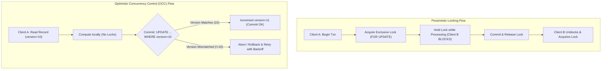
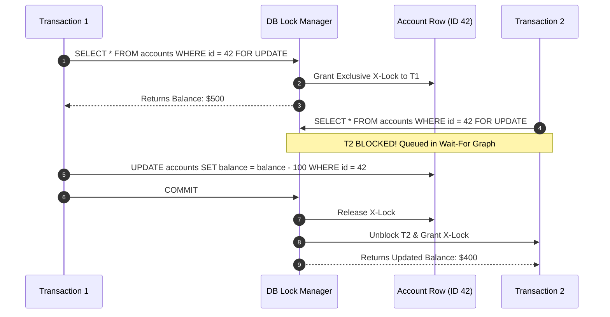
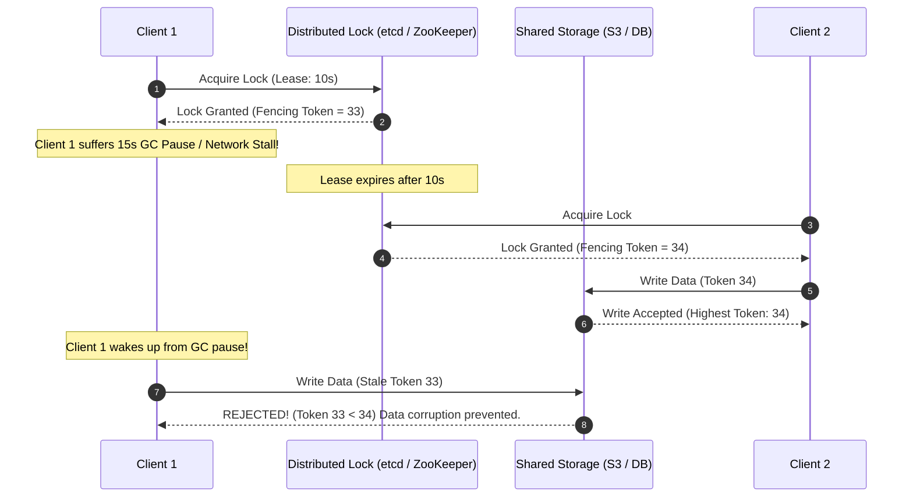

# Optimistic vs Pessimistic Locking

## TL;DR
Optimistic and Pessimistic Locking are concurrency control strategies designed to prevent lost updates, write skew, and data corruption in concurrent multi-client systems.
**Pessimistic Locking** assumes conflicts are frequent; it prevents concurrency by acquiring exclusive locks on target records (`SELECT ... FOR UPDATE`) before modification, forcing competing transactions to block until the lock is released.
**Optimistic Concurrency Control (OCC)** assumes conflicts are rare; it allows multiple transactions to read and modify data concurrently without locking, validating at commit time via a version number, timestamp, or hash whether the data was altered by another process.
In distributed environments, locks require distributed coordinators (ZooKeeper, etcd, Redis), which are susceptible to process pauses and network partitions unless strictly guarded by **Monotonic Fencing Tokens**.

## Mental Model
Think of Pessimistic Locking as a physical hotel room key card.
When you enter the room, the door latches from the inside.
No other guest or housekeeper can enter until you vacate the room and return the key to the front desk.
If you take a three-hour nap, everyone else waits outside in the hallway.
Think of Optimistic Locking as editing a Wikipedia page or a Google Doc revision.
Anyone can open and edit their own local draft without blocking other writers.
When you click "Publish", the server checks if anyone else submitted an update while you were typing.
If someone beat you to the commit, your submission is rejected, and you must review the diff, merge changes, and retry.



## How It Works (Internals)

### 1. Pessimistic Locking Internals
Pessimistic locking relies on the database storage engine's lock manager to enforce mutual exclusion.

#### A. Database Row and Table Locks
- **Shared Lock (S-Lock)**: Acquired for read operations (`SELECT ... FOR SHARE`). Multiple transactions can hold S-locks on the same row concurrently, but writers are blocked.
- **Exclusive Lock (X-Lock)**: Acquired for write operations or explicit locking (`SELECT ... FOR UPDATE`). Only one transaction can hold an X-lock; all other readers and writers are blocked.
- **Intent Locks (IS / IX)**: Acquired at the table level before locking individual rows, allowing the lock manager to detect table-level lock conflicts without scanning millions of individual rows.

#### B. Two-Phase Locking (2PL)
Strict Two-Phase Locking (SS2PL) guarantees serializability through two strict phases:
1. **Growing Phase**: The transaction acquires locks as it accesses data items; it cannot release any locks.
2. **Shrinking Phase**: At transaction commit or abort, all locks are released simultaneously.
- **Deadlock Vulnerability**: If Transaction 1 holds Lock $A$ and requests Lock $B$, while Transaction 2 holds Lock $B$ and requests Lock $A$, a circular wait occurs.
The database engine runs a background **Deadlock Detection** thread that inspects the directed **Wait-For Graph**, choosing a victim transaction to abort and roll back.



### 2. Optimistic Concurrency Control (OCC) Internals
OCC structures transaction processing into three distinct phases:
1. **Read Phase**: The transaction reads data without acquiring locks. It reads a tracking column: either an integer `version`, an updated timestamp, or an ETag.
2. **Validation (Check) Phase**: The transaction computes changes locally in application memory. At commit time, it checks whether any other transaction modified the record since the read phase.
3. **Write Phase**: If validation passes, changes and the incremented version are committed atomically. If validation fails, the transaction aborts.

#### The Atomic Version Check Pattern
```sql
-- Read Phase:
SELECT id, balance, version FROM accounts WHERE id = 42;
-- (Application reads: balance = 500, version = 7)

-- Locally compute: new_balance = 500 - 100 = 400

-- Validation & Write Phase:
UPDATE accounts
SET balance = 400, version = version + 1
WHERE id = 42 AND version = 7;
```
If another transaction updated the account in the interim, the `version` in the database is already $8$.
The `UPDATE` statement finds 0 matching rows (`rows_affected == 0`).
The application layer detects that zero rows were updated, rolls back the local unit of work, and executes an application retry.

### 3. Distributed Locking and the Fencing Token Problem
When locking across multiple independent microservices, local database locks are insufficient.
Systems use distributed lock managers like Redis (Redlock) or ZooKeeper/etcd ephemeral nodes.

#### The Fallacy of Distributed Leases Without Fencing
Martin Kleppmann proved that distributed locks relying solely on time leases (TTLs) are fundamentally unsafe in asynchronous networks.
Consider this catastrophic sequence:
1. Client 1 acquires a distributed lock with a 10-second TTL from Redis.
2. Client 1 encounters a Stop-The-World (STW) JVM Garbage Collection pause or OS paging stall that lasts for 15 seconds.
3. While Client 1 is paused, the 10-second lock lease expires.
4. Client 2 requests and acquires the lock, and safely writes to shared storage.
5. Client 1 wakes up from the GC pause, believes it still holds the lock, and issues its write to shared storage, silently corrupting Client 2's data!



#### The Solution: Monotonic Fencing Tokens
Every time the lock manager grants a lock, it returns a strictly increasing integer counter: the **Fencing Token**.
The storage service must reject any write request carrying a fencing token lower than the highest token it has already observed.
Even if Client 1 wakes up from a pause and attempts to write, its stale token ($33$) is rejected because storage has already processed token $34$.

## Trade-offs and When to Use

| Architectural Dimension | Pessimistic Locking | Optimistic Locking (OCC) |
| :--- | :--- | :--- |
| **Contention Profile** | Optimal under **High Contention** | Optimal under **Low to Moderate Contention** |
| **Transaction Duration** | Must be ultra-short; long locks cause cascading thread starvation | Can tolerate longer user think-time or multi-step validation |
| **Resource Utilization** | Consumes database lock memory and thread pool connections | Consumes CPU on application retries when conflicts occur |
| **Deadlock Risk** | High; requires active deadlock detection or ordered lock acquisition | Zero deadlock risk; transactions never hold blocking locks |
| **Implementation Complexity** | Simple (`SELECT ... FOR UPDATE`) | Requires retry loops, exponential backoff, and idempotent logic |
| **Throughput Under Load** | Degrades gracefully into a queue | Collapses into an abort storm under extreme hot-spot writes |

### Decision Rules
1. **Choose Pessimistic Locking when:**
   - Contention on the target record is exceptionally high (e.g., ticket seat reservations during a stadium concert sale, flash sales with limited inventory).
   - The cost of rolling back and retrying a transaction is high (e.g., irreversible multi-system RPCs or complex credit card authorizations).
   - Locking duration is predictable and sub-millisecond.
2. **Choose Optimistic Locking when:**
   - The probability of two users modifying the same record concurrently is low (e.g., user profile updates, CMS article publishing, collaborative wikis).
   - User interactions span seconds or minutes (e.g., an analyst reviewing a form in a web browser before saving).
   - Read throughput vastly exceeds write throughput (e.g., 99:1 read-to-write ratio).

## Failure Modes and Pitfalls

### 1. The OCC Abort Storm (Livelock)
- *Failure*: 100 concurrent workers attempt to increment a shared counter using OCC.
Every time one worker succeeds, 99 workers fail validation, rollback, and retry simultaneously.
Under extreme contention, total system throughput drops to near zero as CPU cycles burn exclusively on failed validations and retries.
- *Mitigation*: Switch to pessimistic row locking, or apply **Exponential Backoff with Full Jitter** to the retry loop, or use atomic hardware CAS operations (`UPDATE counter SET val = val + 1`).

### 2. Lock Escalation Stalls
- *Failure*: In systems like Microsoft SQL Server, if a transaction acquires thousands of fine-grained row locks, the engine escalates them to an exclusive table lock, halting all concurrent access across unrelated rows.
- *Mitigation*: Batch modifications into smaller transaction chunks (e.g., 500 rows per transaction) to keep lock manager memory below escalation thresholds.

### 3. Orphaned Distributed Locks
- *Failure*: A worker acquires a distributed lock in Redis with no TTL, and crashes before releasing it.
The lock remains held forever, permanently blocking all subsequent workflows.
- *Mitigation*: Mandate strict TTL leases on all distributed locks, coupled with background watchdog threads (e.g., Redisson lock renewal) that extend the lease only while the holding process remains healthy.

## Hands-On

### 1. PostgreSQL Demonstration: Pessimistic vs Optimistic Locking

#### Pessimistic Row Lock:
```sql
-- Session 1:
BEGIN;
SELECT balance FROM accounts WHERE id = 1 FOR UPDATE;
-- (Holds exclusive lock on row 1)

-- Session 2 (Concurrent terminal):
BEGIN;
SELECT balance FROM accounts WHERE id = 1 FOR UPDATE;
-- (Session 2 blocks immediately and waits for Session 1)

-- Session 1 completes:
UPDATE accounts SET balance = balance - 50 WHERE id = 1;
COMMIT;
-- (Session 2 unblocks instantly and reads updated balance)
```

#### Optimistic Lock via Version Column:
```sql
-- Schema setup:
CREATE TABLE inventory (
    item_id INT PRIMARY KEY,
    quantity INT NOT NULL,
    version INT NOT NULL DEFAULT 1
);
INSERT INTO inventory (item_id, quantity, version) VALUES (101, 20, 1);

-- Application Worker 1:
SELECT quantity, version FROM inventory WHERE item_id = 101; -- Reads qty=20, ver=1

-- Application Worker 2:
SELECT quantity, version FROM inventory WHERE item_id = 101; -- Reads qty=20, ver=1

-- Worker 1 commits first:
UPDATE inventory
SET quantity = quantity - 1, version = version + 1
WHERE item_id = 101 AND version = 1; -- 1 row updated (SUCCESS!)

-- Worker 2 attempts commit with stale version:
UPDATE inventory
SET quantity = quantity - 1, version = version + 1
WHERE item_id = 101 AND version = 1; -- 0 rows updated! (CONFLICT DETECTED)
```

### 2. Production Python OCC Retry Loop with Exponential Backoff
Run this self-contained script demonstrating an optimistic locking update engine with conflict detection and jittered backoff:

```python
"""
Educational implementation of Optimistic Concurrency Control with exponential backoff and jitter.
No external dependencies required (Python 3.10+).
"""
import random
import time
from dataclasses import dataclass
from typing import Optional

@dataclass
class Account:
    id: int
    balance: int
    version: int

class MockDatabase:
    def __init__(self):
        self.accounts = {1: Account(id=1, balance=1000, version=1)}

    def get(self, account_id: int) -> Account:
        acc = self.accounts[account_id]
        # Return a copy to simulate reading a snapshot
        return Account(id=acc.id, balance=acc.balance, version=acc.version)

    def update_occ(self, account_id: int, new_balance: int, expected_version: int) -> bool:
        current = self.accounts[account_id]
        if current.version != expected_version:
            return False  # Conflict: Version altered by another transaction
        
        # Atomic commit
        current.balance = new_balance
        current.version += 1
        return True

def transfer_money_occ(db: MockDatabase, account_id: int, amount: int, max_retries: int = 5) -> bool:
    base_backoff = 0.05  # 50 ms
    
    for attempt in range(max_retries):
        snapshot = db.get(account_id)
        if snapshot.balance < amount:
            raise ValueError("Insufficient funds")

        new_balance = snapshot.balance - amount
        
        # Simulate small concurrent processing delay
        time.sleep(random.uniform(0.01, 0.03))

        success = db.update_occ(account_id, new_balance, snapshot.version)
        if success:
            print(f"[Worker] Commit succeeded on attempt {attempt + 1}. New version: {snapshot.version + 1}")
            return True

        # Conflict encountered -> Apply Full Jitter Backoff
        sleep_duration = random.uniform(0, base_backoff * (2 ** attempt))
        print(f"[Worker] Conflict on attempt {attempt + 1}. Retrying in {sleep_duration*1000:.1f}ms...")
        time.sleep(sleep_duration)

    raise RuntimeError(f"OCC Transaction aborted after {max_retries} attempts due to high contention.")

if __name__ == "__main__":
    db = MockDatabase()
    print("Initial State:", db.get(1))
    
    # Simulate successful transaction
    transfer_money_occ(db, account_id=1, amount=100)
    print("Final State:", db.get(1))
```

## Performance and Capacity
- **Lock Acquisition Overhead**:
  - In-memory database lock manager: $0.2\text{ - }1.0\text{ }\mu\text{s}$ per row lock.
  - Networked distributed lock (e.g., Redis `SET NX EX` or ZooKeeper znodes): $0.5\text{ - }2.0\text{ ms}$ network RTT per lock acquisition.
- **Contention Throughput Curves**:
  - At conflict rates $< 5\%$, Optimistic Locking yields 2x to 5x higher throughput than 2PL by eliminating lock manager contention.
  - At conflict rates $> 25\%$, Optimistic Locking throughput plummets due to retry thrashing; Pessimistic Locking maintains predictable linear queuing throughput.

## In Production
- **Amazon DynamoDB**: Provides native Optimistic Concurrency Control using **Conditional Writes**.
Callers supply `ConditionExpression = "attribute_exists(id) AND version = :expected_ver"`.
If the condition fails, DynamoDB returns `ConditionalCheckFailedException` in sub-10ms without holding server locks.
- **HTTP / REST APIs**: Web standards implement optimistic locking natively using HTTP headers.
Servers issue an `ETag: "hash_v12"` response header.
Clients modifying the resource supply `If-Match: "hash_v12"`.
If another client altered the resource, the server rejects the request with HTTP `412 Precondition Failed`.

### Operational Checklist
- [ ] For pessimistic locking, always enforce a strict `lock_timeout` (e.g., `SET lock_timeout = '2s'`) to prevent stalled queries from freezing connection pools.
- [ ] To avoid deadlocks under pessimistic locking, always acquire multi-row locks in a deterministic order (e.g., sorted ascending by primary key ID).
- [ ] For distributed locks, always pass a monotonic fencing token to storage to invalidate stale lock holders.

## Interview Questions

> [!question]
> **Question 1 (Junior):** What is the core difference between optimistic locking and pessimistic locking?
> [!success]- Answer
> Pessimistic locking acquires exclusive locks on data records before modifying them, blocking any concurrent readers or writers until the transaction completes. Optimistic locking does not acquire locks during read and computation; instead, it checks a version number or timestamp at commit time to verify no other transaction updated the record, rolling back and retrying if a conflict is detected.

> [!question]
> **Question 2 (Mid-Level):** How does an application implement optimistic locking in a SQL database that has no built-in OCC keyword?
> [!success]- Answer
> Add an integer `version` column to the table. When reading a row, read its current version (e.g., `version = 5`). When updating, write an update statement with the version in the `WHERE` clause while incrementing it: `UPDATE items SET val = :new_val, version = version + 1 WHERE id = :id AND version = 5;`. Check the database driver's `rows_affected` return value. If `rows_affected == 1`, the update succeeded; if `rows_affected == 0`, a concurrent transaction modified the row, and the application must abort and retry.

> [!question]
> **Question 3 (Mid-Level):** What is a deadlock in pessimistic locking, and how do database engines resolve it?
> [!success]- Answer
> A deadlock occurs when two or more transactions hold locks that the other transactions need to proceed, forming a circular dependency (e.g., T1 holds A, waits for B; T2 holds B, waits for A). Database engines resolve deadlocks using a background thread that continuously inspects the lock manager's **Wait-For Graph**. When a directed cycle is detected, the engine selects a "victim" transaction (usually the one that did the least work or has run the shortest time) and aborts it with a deadlock error, releasing its locks and allowing the surviving transaction to proceed.

> [!question]
> **Question 4 (Senior):** Explain Martin Kleppmann's critique of distributed lock managers (like Redlock) and how Fencing Tokens solve the issue.
> [!success]- Answer
> Distributed locks relying on time-to-live leases (TTLs) are vulnerable to process pauses (e.g., Stop-The-World GC pauses, OS swapping, or network delays). If Client 1 acquires a lock with a 10s lease and pauses for 15s, the lease expires, and Client 2 safely acquires the lock and writes to storage. When Client 1 resumes, it mistakenly believes it still holds the lock and issues its write, silently corrupting storage. **Fencing Tokens** solve this: the lock manager issues a strictly monotonic increasing counter with each lock grant. Storage services record the highest token processed and reject any incoming write carrying a lower token, safely blocking stale clients.

> [!question]
> **Question 5 (Senior):** Under what specific workload characteristics does Optimistic Locking perform worse than Pessimistic Locking?
> [!success]- Answer
> Optimistic Locking degrades severely under **high write contention on hot records** (e.g., decrementing inventory for a flash sale product). When dozens or hundreds of concurrent transactions compete for the same row, nearly all fail validation and retry. This creates an **Abort Storm** (livelock) where CPU and database IO are saturated by continuous rollbacks and retries, collapsing system throughput. In contrast, Pessimistic Locking forces transactions into an orderly lock-wait queue, completing each transaction with zero retries.

> [!question]
> **Question 6 (Staff):** How would you design a distributed booking system for airline seats that avoids both high lock contention and double-booking?
> [!success]- Answer
> Implement a tiered reservation architecture: (1) **Short-lived In-Memory Reservation**: Use Redis with atomic Lua scripts or single-threaded commands (`SET seat:12A:hold user_id NX EX 600`) to hold a seat for 10 minutes. If the key exists, the seat is held, failing fast without hitting the database. (2) **Payment Processing**: The client proceeds to payment while holding the temporary Redis lease. (3) **Final Database Commit**: Upon payment confirmation, execute an atomic SQL update using optimistic locking: `UPDATE seats SET status = 'BOOKED', user_id = :uid, version = version + 1 WHERE seat_id = '12A' AND status = 'AVAILABLE' AND version = :v;`. (4) **Reconciliation**: If payment fails or the 10-minute lease expires, a background worker or TTL expiration releases the seat back to the available pool.

> [!question]
> **Question 7 (Staff):** How does Next-Key Locking in MySQL InnoDB prevent phantom reads under Repeatable Read, and how does it relate to pessimistic locking?
> [!success]- Answer
> Next-Key Locking combines an exclusive index-row lock with a **Gap Lock** that locks the gap before the index record. When a transaction executes `SELECT * FROM accounts WHERE balance > 1000 FOR UPDATE;`, InnoDB locks not only all existing index records where `balance > 1000`, but also locks the gaps between and after those records. Any concurrent transaction attempting to `INSERT` a new row with `balance = 1500` is blocked by the gap lock until the first transaction commits, pessimistically preventing phantom insertions.

> [!question]
> **Question 8 (Staff):** Compare the architectural trade-offs of using etcd/ZooKeeper versus Redis for distributed locking in mission-critical banking infrastructure.
> [!success]- Answer
> etcd and ZooKeeper are **CP systems** governed by distributed consensus (Raft/ZAB). They use heartbeats and ephemeral nodes/leases. If a leader network partition occurs, the cluster guarantees that at most one leader can grant locks, and fencing tokens (Znode `cversion` or etcd `mod_revision`) are guaranteed to be monotonic. Redis is typically an **AP system** (asynchronous master-replica replication); if a primary grants a lock and crashes before replicating to the replica, the promoted replica can grant the same lock to another client, causing double-lock acquisition. For mission-critical banking infrastructure, etcd/ZooKeeper is the strictly correct architectural choice because correctness and linearizability outweigh raw Redis memory throughput.

## Related
- [[Concurrency-Synchronization-and-CAS|Concurrency, Synchronization, and CAS]]: Low-level hardware atomics and mutual exclusion.
- [[ACID-vs-BASE|ACID vs BASE]]: Transactional isolation levels and consistency models.
- [[Apache-ZooKeeper|Apache ZooKeeper]]: Implementation of distributed lock recipes and fencing tokens.
- [[Redis-Architecture|Redis Architecture]]: In-memory locks and Redlock algorithm analysis.

## Further Reading
- Kleppmann, Martin. "How to do distributed locking." *Martin Kleppmann's blog* (2016).
- Bernstein, Philip A., and Nathan Goodman. "Concurrency control in distributed database systems." *ACM Computing Surveys (CSUR)* 13.2 (1981): 185-221.
- Kung, Hsiang-Tsung, and John T. Robinson. "On optimistic methods for concurrency control." *ACM Transactions on Database Systems (TODS)* 6.2 (1981): 213-226.
- Gray, Jim, and Andreas Reuter. *Transaction processing: concepts and techniques*. Elsevier, 1992.
