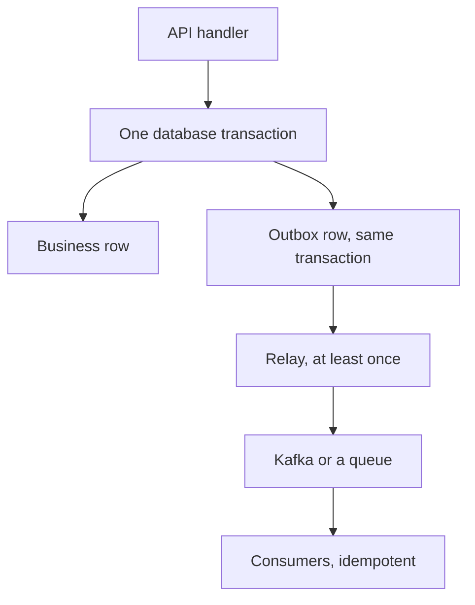

# Outbox, Change Data Capture, and Event Sourcing

## TL;DR

A service that writes a row and then publishes an event will eventually crash between those two steps.
The outbox pattern and change data capture make the publish a consequence of the same log as the row.
Event sourcing goes further and makes the log the only source of truth.

## The dual write

Insert the business change and the outbox row in one transaction.
A relay reads the outbox in order and publishes to [[Apache-Kafka]] or [[RabbitMQ]].
The publish is at least once.
Consumers dedupe with the event id.
See [[Idempotency-and-Delivery]].
If the relay publishes and crashes before marking the outbox row done, the consumer sees a duplicate, which it must tolerate.
If you mark the row done before the publish ack, you lose the event.

Change data capture reads the database log instead of an outbox table.
The relay is a log reader such as Debezium.
You do not maintain a second row, and you inherit the database's order.
You also inherit its schema, including deletes and updates that your event model may not want verbatim.
CDC still does not make the consumer exactly-once.
It makes the capture reliable.

## Event sourcing and CQRS

Event sourcing stores the sequence of facts, not the current row.
The current row is a fold of the facts.
A snapshot is an optimization of that fold, and it must be rebuildable.
CQRS means the write model and the read model are different structures.
You can do CQRS with a normal database and a projection.
You do not have to event-source to have CQRS.
Event sourcing is the right tool when the history is the product: an audit, a ledger, a collaborative document.
It is the wrong tool when you only needed a queue.

[[15-Payment-Ledger/design|The payment ledger]] is a constrained event source.
Corrections are new entries.
Rows are not updated in place.
[[14-Collaborative-Editor/design|The collaborative editor]] is an operation log with a merge function.

## Pitfalls

- An outbox without a partition key publishes events for one aggregate out of order once you add relay concurrency.
  Relay one aggregate at a time, or publish to a partition keyed by the aggregate.
- Consumers that update a projection and then crash will update it twice.
  Store the last applied event id in the projection.
- Event schemas are forever.
  Add fields in a compatible way, as in [[Schema-Evolution-and-Migration]].
- Rebuilding a projection is part of the design.
  If you cannot rebuild it, the projection has become a second source of truth.

## Interview questions

1. Draw the crash window in a dual write, and the row that closes it.
2. Why can the relay still deliver twice after the outbox is correct.
3. When is CDC preferable to an outbox table, and what do you lose.
4. What is the difference between CQRS and event sourcing.

## Further reading

- Helland, CIDR 2007, for entities and activities as the unit of atomicity.
- [[saga_pattern]] when the user action spans more than one service's transaction.
- [[Apache-Kafka]] for the log the relay writes.
