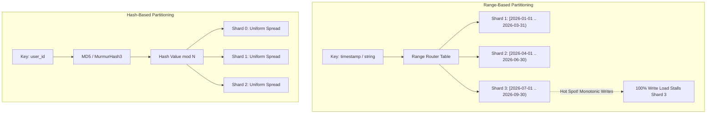
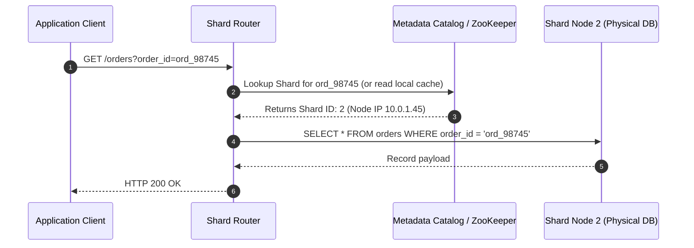
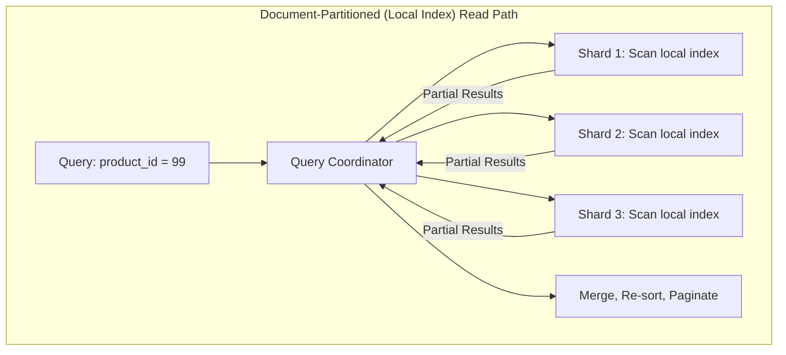

# Partitioning and Sharding

## TL;DR
Partitioning (often called sharding in database systems) splits a massive dataset into smaller, independent subsets called partitions or shards.
Each shard holds a disjoint slice of the total data and is hosted on a separate compute and storage node.
The primary goal is horizontal scalability: allowing read, write, and storage capacities to scale linearly by distributing query execution across multiple machines.
Key partitioning strategies include Range Partitioning, Hash Partitioning, and Directory-Based Partitioning, each balancing query flexibility against hot-spot vulnerability.
Secondary indexes must be managed either as Document-Partitioned (local index, fast writes, scatter-gather reads) or Term-Partitioned (global index, fast reads, distributed write overhead).

## Mental Model
Imagine an encyclopedia containing 10,000,000 articles.
If bound into a single colossal book, no person can lift it, and only one reader can view it at a time.
Under **Range Partitioning**, you divide the encyclopedia into alphabetical volumes: Vol 1 (A-B), Vol 2 (C-D), and so on.
Finding all articles starting with "Apple" requires reading only Volume 1, but if the world suddenly obsesses over topics starting with "C", Volume 2 gets crushed while other volumes sit idle.
Under **Hash Partitioning**, you pass each article title through a hash function and assign it to Volume 1 through 100 uniformly.
Traffic distributes evenly across all volumes, but finding all articles starting with "Apple" now requires inspecting every single volume in the library.



## How It Works (Internals)

### 1. Partitioning Strategies

#### A. Range-Based Partitioning
Data is partitioned by assigning continuous ranges of keys (from minimum to maximum) to specific shards.
- **Mechanism**: The system maintains an ordered index or range map.
For example, Shard 1 holds keys `[0, 1000)`, Shard 2 holds `[1000, 2000)`.
- **Advantages**: Efficient range queries.
Executing `SELECT * FROM metrics WHERE timestamp BETWEEN '10:00' AND '10:05'` routes directly to the single shard containing that interval.
- **Vulnerabilities**: Extreme hot-spotting on monotonically increasing keys (such as auto-increment IDs or timestamps).
All writes hit the single shard responsible for the latest time window, rendering other shards idle.
- **Used by**: Google Bigtable, Apache HBase, [[CockroachDB-Distributed-SQL|CockroachDB]].

#### B. Hash-Based Partitioning
A cryptographic or pseudo-random hash function (e.g., MurmurHash3, CityHash, MD5) is applied to the partition key, and the resulting integer determines shard placement.
- **Mechanism**: $\text{Shard ID} = \text{hash}(\text{key}) \pmod N$, or mapped onto a consistent hash ring.
- **Advantages**: Destroys spatial clustering, spreading sequential keys uniformly across the physical cluster.
- **Vulnerabilities**: Range scans are destroyed.
A query asking for `user_id BETWEEN 100 AND 200` cannot be localized; it must execute a **Scatter-Gather** query across every shard in the cluster.
- **Used by**: [[Apache-Cassandra|Cassandra]], Amazon DynamoDB, MongoDB (Hashed Sharding).

#### C. Directory-Based (Lookup) Partitioning
A centralized directory service or lookup table maps partition keys or tenant IDs to specific physical shards.
- **Mechanism**: Routers query a metadata service (e.g., Apache ZooKeeper or an internal catalog database) to determine where an entity resides: `lookup_table.get(tenant_id) -> shard_ip`.
- **Advantages**: Flexibility.
Individual tenants can be migrated dynamically between shards (e.g., moving an enterprise tenant to a dedicated physical host) without altering the global hashing scheme.
- **Vulnerabilities**: The directory lookup can become a latency bottleneck and single point of failure if not aggressively cached at the client/router tier.



### 2. Secondary Index Partitioning

When data is partitioned by primary key, querying by a secondary attribute (e.g., searching for orders by `product_id` when the table is partitioned by `user_id`) presents an architectural challenge.

#### Document-Partitioned (Local) Indexes
Each shard maintains its own independent secondary index covering only the documents stored locally on that shard.
- **Write Path**: Extremely fast.
Writing a new row updates the local data table and local secondary index in a single local atomic transaction.
- **Read Path**: Expensive **Scatter-Gather**.
The query router must broadcast the secondary index query to **all** shards in the cluster, await all responses, merge the results, and sort them before returning.

#### Term-Partitioned (Global) Indexes
The secondary index itself is partitioned globally across all shards, partitioned by the indexed term.
- **Write Path**: Expensive distributed transaction.
Inserting a single document requires writing to the document's primary shard and issuing an asynchronous or 2PC write to the remote shard holding that term's global index partition.
- **Read Path**: Fast and localized.
Queries targeting a specific term route directly to the single shard hosting that term's index partition.



### 3. Re-sharding and Dynamic Rebalancing

As dataset size grows, shards must be split or redistributed across new physical hardware.
1. **Fixed Number of Partitions**:
   The database creates a large fixed number of logical partitions (e.g., 1024) at genesis.
   Initially, each physical node hosts 100 logical partitions.
   When a new physical node is added, logical partitions are migrated from existing nodes until the cluster reaches equilibrium.
   *(Used by Elasticsearch, Couchbase, Redis Cluster)*.
2. **Dynamic Range Splitting**:
   When a partition exceeds a configured size threshold (e.g., 64 GB in CockroachDB or 10 GB in Bigtable), the storage engine automatically splits the range into two equal halves at the midpoint key, updating the cluster routing catalog.
3. **Partition Count Proportional to Nodes**:
   The number of partitions is a fixed multiple of physical nodes (e.g., Cassandra default of 128 virtual nodes per physical host).
   Adding a node allocates fresh virtual tokens across the ring, rebalancing proportional disk slices.

## Trade-offs and When to Use

| Architectural Attribute | Range Partitioning | Hash Partitioning | Directory Partitioning |
| :--- | :--- | :--- | :--- |
| **Range Queries** | Native and performant; localized to single or contiguous shards | Prohibitively expensive; requires scatter-gather across all nodes | Variable; depends on directory indexing rules |
| **Hot-Spot Resistance** | Poor; vulnerable to monotonic sequential write storms | Superior; cryptographic hash distributes entropy uniformly | High; hot tenants can be dynamically isolated |
| **Resharding Complexity** | Low to medium; split range boundaries dynamically | High; changing modulo requires full cluster data reshuffle* | Low; update mapping pointer in directory catalog |
| **Routing Overhead** | Low; binary search over small in-memory range descriptor table | Minimal; client executes local hash function in nanoseconds | Medium; cache misses require remote lookup RPC |

*\*Note: Modern hash-partitioned databases use [[Consistent-Hashing|Consistent Hashing]] to mitigate the full-reshuffle problem.*

## Failure Modes and Pitfalls

### 1. The Celebrity (Hot Key) Problem
- *Failure*: In a social network partitioned by `user_id`, an account with 100,000,000 followers receives millions of likes or comments per minute.
All writes for that user target a single shard, driving its CPU and disk queues to 100% while neighboring shards remain 99% idle.
- *Mitigation*: **Key Salting**.
Append a random two-digit salt (e.g., `user_1234_#0` through `user_1234_#99`) to writes, distributing incoming traffic across 100 distinct shards.
Read paths must scatter-gather across all 100 salted shards and aggregate.

### 2. Tail Latency Amplification in Scatter-Gather
- *Failure*: A query requires broadcasting to 50 shards.
If a single shard experiences a 500 ms garbage collection pause or disk stall, the client observes a 500 ms latency spike, even if the other 49 shards replied in 2 ms.
The 99th-percentile latency of a scatter-gather query is governed by the worst-case tail latency of the slowest shard in the pool.
- *Mitigation*: Restrict scatter-gather queries with tight timeouts, hedged requests (duplicate requests dispatched to replica nodes after 95th percentile delay), and materialized denormalized views.

### 3. Distributed Deadlocks Across Cross-Shard Joins
- *Failure*: Transaction $A$ locks Row 1 on Shard 1 and requests Row 2 on Shard 2.
Concurrently, Transaction $B$ locks Row 2 on Shard 2 and requests Row 1 on Shard 1.
Neither local database engine can detect the cycle because lock tables are partitioned.
- *Mitigation*: Design application schemas around a **Tenant / Entity Group Key** so that 99% of transactions remain localized to a single shard, eliminating distributed locking.

## Hands-On

### 1. Declarative Hash and Range Partitioning in PostgreSQL
PostgreSQL supports native table partitioning.
Observe how query plans isolate shards (Partition Pruning):

```sql
-- 1. Create Range-Partitioned Table
CREATE TABLE orders_range (
    order_id BIGSERIAL,
    order_date DATE NOT NULL,
    amount NUMERIC(10, 2),
    PRIMARY KEY (order_id, order_date)
) PARTITION BY RANGE (order_date);

-- Create individual child partitions
CREATE TABLE orders_2026_q1 PARTITION OF orders_range
    FOR VALUES FROM ('2026-01-01') TO ('2026-04-01');
CREATE TABLE orders_2026_q2 PARTITION OF orders_range
    FOR VALUES FROM ('2026-04-01') TO ('2026-07-01');

-- 2. Verify Partition Pruning via EXPLAIN
EXPLAIN SELECT * FROM orders_range WHERE order_date = '2026-02-15';
-- Output confirms: "Seq Scan on orders_2026_q1" (orders_2026_q2 is pruned completely!)

-- 3. Create Hash-Partitioned Table
CREATE TABLE users_hash (
    user_id UUID NOT NULL,
    email VARCHAR(255) NOT NULL,
    PRIMARY KEY (user_id)
) PARTITION BY HASH (user_id);

-- Create 4 modulo partitions
CREATE TABLE users_h0 PARTITION OF users_hash FOR VALUES WITH (MODULUS 4, REMAINDER 0);
CREATE TABLE users_h1 PARTITION OF users_hash FOR VALUES WITH (MODULUS 4, REMAINDER 1);
CREATE TABLE users_h2 PARTITION OF users_hash FOR VALUES WITH (MODULUS 4, REMAINDER 2);
CREATE TABLE users_h3 PARTITION OF users_hash FOR VALUES WITH (MODULUS 4, REMAINDER 3);
```

### 2. Python Lab: Range vs Hash Partitioning and Hot-Spot Simulation
Run this self-contained script to observe how sequential monotonically increasing IDs create hot spots under Range Partitioning, whereas Hash Partitioning distributes keys uniformly:

```python
"""
Educational simulator demonstrating key distribution differences:
Range Partitioning vs Hash Partitioning under monotonic sequential writes.
No external dependencies required (Python 3.10+).
"""
import hashlib
from collections import Counter

def hash_key(key: str, num_shards: int) -> int:
    digest = hashlib.md5(key.encode('utf-8')).hexdigest()
    return int(digest, 16) % num_shards

def range_key(val: int, num_shards: int, max_val: int) -> int:
    bucket_size = max_val // num_shards
    shard_id = val // bucket_size
    return min(shard_id, num_shards - 1)

def run_simulation():
    num_shards = 4
    total_records = 100_000
    
    range_counts = Counter()
    hash_counts = Counter()

    print(f"Simulating {total_records} monotonic sequential inserts across {num_shards} shards...")

    # Phase 1: Simulate normal uniform write distribution
    for i in range(total_records):
        s_hash = hash_key(f"user_{i}", num_shards)
        hash_counts[s_hash] += 1
        
        s_range = range_key(i, num_shards, total_records)
        range_counts[s_range] += 1

    print("\n--- Final Key Distribution Across Shards ---")
    print("Hash Partitioning Distribution:")
    for s in range(num_shards):
        pct = (hash_counts[s] / total_records) * 100
        print(f"  Shard {s}: {hash_counts[s]:6d} keys ({pct:5.2f}%)")

    print("\nRange Partitioning Distribution (Total Final):")
    for s in range(num_shards):
        pct = (range_counts[s] / total_records) * 100
        print(f"  Shard {s}: {range_counts[s]:6d} keys ({pct:5.2f}%)")

    # Phase 2: Demonstrate temporal hot-spot during the last 5,000 inserts
    print("\n--- Temporal Write Intensity During Last 5,000 Inserts ---")
    recent_range = Counter()
    recent_hash = Counter()
    for i in range(total_records - 5_000, total_records):
        recent_range[range_key(i, num_shards, total_records)] += 1
        recent_hash[hash_key(f"user_{i}", num_shards)] += 1

    print("Hash Partitioning (Last 5k writes):", dict(recent_hash))
    print("Range Partitioning (Last 5k writes):", dict(recent_range))
    print("Notice: 100% of Range writes hit Shard 3 (Hot Spot Vulnerability)!")

if __name__ == "__main__":
    run_simulation()
```

## Performance and Capacity
- **Scatter-Gather Latency Math**:
  Assume each shard has an independent probability $p = 0.01$ (1%) of experiencing a tail latency spike $> 100\text{ ms}$.
  If a scatter-gather query must contact $S$ shards and wait for all to reply, the probability that the entire query experiences a tail latency spike is:
  $$P(\text{Tail Latency}) = 1 - (1 - p)^S$$
  - For $S = 1$ shard: $P = 1 - (0.99)^1 = 1.0\%$.
  - For $S = 10$ shards: $P = 1 - (0.99)^{10} \approx 9.56\%$.
  - For $S = 100$ shards: $P = 1 - (0.99)^{100} \approx 63.4\%$.
  This proves why scatter-gather queries across large shard counts must be avoided for latency-critical user-facing paths.
- **Shard Capacity Sizing Rule of Thumb**:
  - Keep individual shard disk footprints between $500\text{ GB}$ and $2\text{ TB}$.
  - Shards larger than 2 TB become operationally brittle: snapshot backups, restore operations, and rebalancing file transfers across VPC links take hours or days to complete, violating recovery time objectives (RTO).

## In Production
- **Instagram**: Sharded PostgreSQL from day one.
They partitioned data into thousands of logical shards mapped across a smaller set of physical database servers.
They designed custom **Snowflake IDs** composed of:
`41 bits timestamp | 13 bits logical shard ID | 10 bits auto-increment sequence`.
Given an ID, the application router immediately extracts the shard ID with bitwise shifts (`id >> 10 & 0x1FFF`), eliminating lookup directory round trips entirely.
- **Slack**: Sharded their database architecture by **Team / Workspace ID**.
Because users within a workspace collaborate heavily with each other but almost never query across different workspaces, 99.9% of database transactions run entirely within a single physical shard, completely avoiding distributed joins and cross-shard transactions.

### Operational Checklist
- [ ] Ensure shard keys exhibit high cardinality (e.g., UUIDs or account IDs; avoid low-cardinality keys like Country or Gender).
- [ ] Audit application SQL queries to ensure all critical queries include the shard key in the `WHERE` clause to enable partition pruning.
- [ ] Set automated disk and CPU utilization alarms per shard; trigger rebalancing at 70% threshold.

## Interview Questions

> [!question]
> **Question 1 (Junior):** What is the difference between database partitioning and database sharding?
> [!success]- Answer
> While often used interchangeably, partitioning is the generic term for dividing a database's objects (tables, indexes) into distinct parts. Sharding specifically refers to horizontal partitioning where each partition is hosted on an independent physical or virtual database server with its own CPU, memory, and disk (a shared-nothing architecture).

> [!question]
> **Question 2 (Mid-Level):** Why does choosing an auto-incrementing ID or timestamp as a shard key in range partitioning cause severe production issues?
> [!success]- Answer
> Because auto-incrementing IDs and timestamps are strictly monotonically increasing, every new write operation has a key greater than all existing keys. Under range partitioning, all current writes will continuously target the single shard responsible for the highest range interval. This causes a severe write hot spot, leaving all other shards idle and reducing cluster write capacity to that of a single machine.

> [!question]
> **Question 3 (Mid-Level):** Explain the difference between Document-Partitioned (local) secondary indexes and Term-Partitioned (global) secondary indexes.
> [!success]- Answer
> In Document-Partitioned secondary indexes, each shard indexes only the documents stored locally on that shard. Writes are fast and require no cross-shard coordination, but reads on the secondary index must execute a scatter-gather query across all shards in the cluster. In Term-Partitioned secondary indexes, the secondary index is partitioned by the indexed term across the cluster. Reads for a term route directly to a single shard, but writes require distributed transactions across multiple shards to update both the document and the remote term index.

> [!question]
> **Question 4 (Senior):** What is the "Celebrity Problem" (Hot Key Problem) in sharding, and how do you mitigate it architecturally?
> [!success]- Answer
> The Celebrity Problem occurs when a single partition key (e.g., an influencer with tens of millions of followers) receives a disproportionately massive volume of read or write traffic compared to other keys, saturating the physical host holding that shard. Mitigations include: (1) Key Salting: appending a random suffix ($0 \dots K-1$) to the key on write, scattering writes across $K$ distinct shards, and scatter-gathering across those $K$ shards on read; (2) Aggressive multi-tier caching with local memory caches or Redis clusters fronting hot keys; and (3) Read-replica pools dedicated to high-traffic entities.

> [!question]
> **Question 5 (Senior):** How does dynamic range splitting work in distributed databases like Google Bigtable or CockroachDB?
> [!success]- Answer
> Bigtable and CockroachDB partition data into contiguous key ranges (called Tablets or Ranges) of bounded size (e.g., 64MB to 512MB). When writes cause a range to exceed its upper boundary, the storage engine identifies a split key (usually the median key) and executes an atomic metadata update in the cluster directory (e.g., Chubby or RangeDescriptor table). The single range becomes two smaller sibling ranges, which can subsequently be migrated independently to different physical nodes to balance CPU and disk load.

> [!question]
> **Question 6 (Staff):** Describe the end-to-end zero-downtime re-sharding process for a live production database transitioning from $N$ to $2N$ shards.
> [!success]- Answer
> The process requires four coordinated phases: (1) **Dual-Writing**: Update the application or CDC pipeline to write new updates to both the existing $N$ shards and the new $2N$ target shards, using idempotent upserts. (2) **Historical Backfill**: Run background ETL batch jobs to copy historical records from the old shards to the new shards for keys written prior to dual-writing, ignoring keys with fresher timestamps. (3) **Verification / Shadow Reads**: Compare read outputs between old and new shards asynchronously, measuring data consistency and latency parity. (4) **Cutover**: Switch primary read traffic to the $2N$ shards, disable dual-writes to the old shards, and decommission the old cluster after a bake period.

> [!question]
> **Question 7 (Staff):** How does scatter-gather query execution affect 99th-percentile (p99) latency as a cluster grows to hundreds of shards?
> [!success]- Answer
> The probability of a scatter-gather query experiencing high tail latency grows exponentially with shard count: $P(\text{Tail}) = 1 - (1 - p)^S$, where $p$ is single-node tail probability and $S$ is shard count. In a cluster of 100 shards where each has a 1% probability of a 500ms GC pause, over 63% of scatter-gather queries will suffer the 500ms delay. To protect p99 latency, systems must: bound fan-out by forcing queries to supply the partition key, employ hedged requests (speculatively dispatching duplicate requests to replica shards), and maintain pre-aggregated global indexes.

> [!question]
> **Question 8 (Staff):** In a multi-tenant SaaS application, how do you evaluate whether to shard by Tenant ID versus sharding by User ID or Entity ID?
> [!success]- Answer
> Sharding by **Tenant ID** is optimal when inter-tenant collaboration is zero and transactions operate entirely within an organization. It guarantees that multi-row transactions, joins, and cascading deletes execute locally on a single shard with high cache locality, and allows trivial isolation of large enterprise tenants onto dedicated hardware. Sharding by **User ID** or **Entity ID** is necessary when tenant sizes exhibit extreme variance (e.g., one enterprise tenant has 5,000,000 users while others have 10), which would cause a single tenant to exceed the physical capacity of a single shard. In hyper-scale multi-tenant systems, a hierarchical key is used: shard by Tenant ID for small/medium tenants, while sharding large enterprise tenants across multiple sub-shards using a composite key (`tenant_id:entity_id`).

## Related
- [[Consistent-Hashing|Consistent Hashing]]: The mathematical mechanism for mapping hash keys to dynamic nodes.
- [[Vertical-vs-Horizontal-Scaling|Vertical vs Horizontal Scaling]]: The overarching system dynamics motivating data partitioning.
- [[CockroachDB-Distributed-SQL|CockroachDB]]: Case study of dynamic range-partitioned distributed SQL.
- [[Apache-Cassandra|Apache Cassandra]]: Case study of consistent hash-partitioned wide-column store.

## Further Reading
- Kleppmann, Martin. "Chapter 6: Partitioning." *Designing Data-Intensive Applications*. O'Reilly Media.
- Corbett, James C., et al. "Spanner: Google’s globally distributed database." *ACM Transactions on Computer Systems (TOCS)* 31.3 (2013): 1-22.
- Chang, Fay, et al. "Bigtable: A distributed storage system for structured data." *ACM Transactions on Computer Systems (TOCS)* 26.2 (2008): 4-es.
- Lakshman, Avinash, and Prashant Malik. "Cassandra: a decentralized structured storage system." *ACM SIGOPS Operating Systems Review* 44.2 (2010): 35-40.
