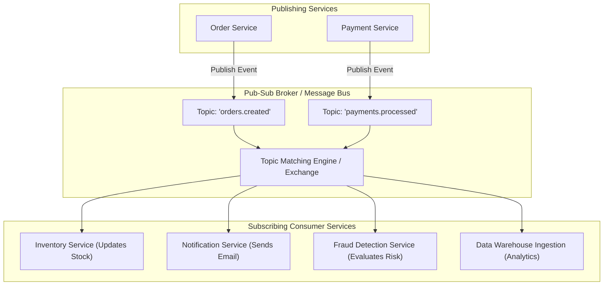
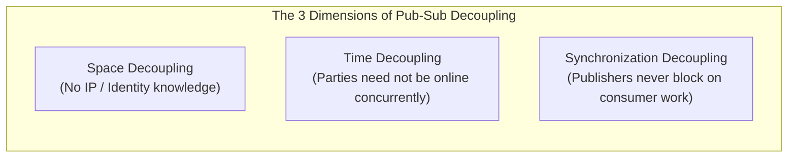
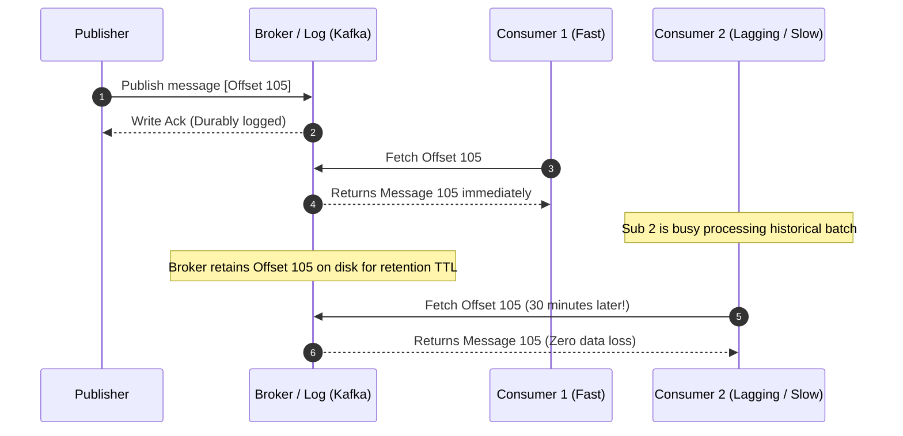

# Publish-Subscribe (Pub-Sub) Architecture

## TL;DR
Publish-Subscribe (Pub-Sub) is an asynchronous messaging paradigm where message senders (publishers) do not target specific receivers (subscribers).
Instead, publishers classify published messages into topics, categories, or channels without knowledge of what subscribers exist.
Subscribers register interest in one or more topics and asynchronously receive all matching messages.
Pub-Sub provides full decoupling across three distinct dimensions: space decoupling (parties do not know each other's network addresses), time decoupling (parties do not need to be online concurrently), and synchronization decoupling (publishers do not block on receipt).
Architectures range from high-throughput distributed commit logs ([[Apache-Kafka|Apache Kafka]]) and smart-broker AMQP systems ([[RabbitMQ|RabbitMQ]]) to lightweight in-memory and brokerless protocols ([[ZeroMQ|ZeroMQ]]).

## Mental Model
Think of Pub-Sub as a daily newspaper publishing house.
Journalists write and publish articles to specific sections: "Sports", "Politics", "Technology", or "Business".
The journalists have zero knowledge of individual readers' home addresses, daily routines, or whether anyone is awake to read them.
Readers subscribe to the specific sections they care about.
The delivery logistics network routes and drops the printed sections onto subscribers' porches.
Adding 10,000 new subscribers to the "Sports" section requires zero changes to the journalist's writing workflow.



## How It Works (Internals)

### 1. The Three Decoupling Dimensions (Eugster et al., 2003)
1. **Space Decoupling**: Publishers and subscribers do not hold direct socket pointers or IP addresses of one another.
Publishers only know the topic name; subscribers only know the topic name.
Either tier can be relocated, scaled, or refactored without breaking the other.
2. **Time Decoupling**: Publishers and subscribers do not need to participate in the interaction simultaneously.
A publisher can emit an event when zero subscribers are active; the broker buffers the event until subscribers boot up.
3. **Synchronization Decoupling**: Publishers are not blocked while messages are being delivered and consumed.
Publishing is an asynchronous event emission, allowing publishers to maintain line-rate throughput.



### 2. Subscription Matching Paradigms

#### A. Topic-Based Pub-Sub
Messages are published to named channels or topics (e.g., `orders.europe.electronics`).
- **Exact Matching**: Subscribers listen to a specific literal topic.
- **Hierarchical Wildcards**: Subscribers use wildcard tokens (e.g., in AMQP or MQTT: `orders.*.electronics` or `orders.europe.#`).
- **Broker Matching**: The broker uses high-speed trie (prefix tree) data structures in memory to evaluate matching subscriptions in $O(L)$ time, where $L$ is topic path length.

#### B. Content-Based Pub-Sub
Subscribers specify predicate filters based on the internal payload attributes of the message rather than just a topic name.
- *Example Filter*: `event_type == 'trade' AND symbol == 'AAPL' AND volume > 10000`.
- *Mechanism*: The broker parses and evaluates predicates against the message payload.
- *Trade-off*: Maximum routing flexibility, but introduces high CPU overhead on the broker, limiting throughput compared to topic-based routing.

#### C. Type-Based Pub-Sub
Subscribers register interest in specific object classes or schema types.
Common in strongly typed systems (e.g., Java JMS or C++ ROS for robotics).

### 3. Broker-Centric vs Brokerless Architectures

| Dimension | Broker-Centric (Kafka, RabbitMQ, Google Pub/Sub) | Brokerless (ZeroMQ, nanomsg, ROS) |
| :--- | :--- | :--- |
| **Topology** | Central cluster coordinates all message exchanges | Peer-to-peer TCP / PGM multicast sockets |
| **Durability** | High; messages persisted to disk/WAL on broker nodes | Transient; messages live only in network buffers and memory |
| **Latency** | Medium ($1\text{ - }10\text{ ms}$ round trip through broker) | Sub-microsecond (direct peer-to-peer memory copy) |
| **Single Point of Failure** | Broker cluster must be scaled and managed for HA | Zero centralized broker to fail; each node is self-contained |
| **Time Decoupling** | Full; messages buffer on disk if consumer is down | Poor; if subscriber is offline during broadcast, message is lost |



### 4. Message Delivery Semantics

1. **At-Most-Once Delivery**:
   - Messages are dispatched without retries.
   - If a network blip or consumer crash occurs, the message is lost.
   - Used in real-time telemetry, IoT sensor pings, and video gaming state synchronization where speed matters more than durability.
2. **At-Least-Once Delivery**:
   - The publisher awaits an acknowledgment ($ACK$) from the broker, and the broker awaits an $ACK$ from the consumer.
   - If an $ACK$ times out, the message is redelivered.
   - Guarantees zero message loss, but duplicate deliveries occur whenever $ACK$ packets are dropped.
   - **Requirement**: Consumers must be strictly idempotent.
3. **Exactly-Once Processing (Effectively Once)**:
   - Achieved through a combination of:
     1. Idempotent producers (deduplicating retried produces via producer IDs and sequence numbers).
     2. Transactional log commits (atomic write across input offset and output state).
     3. Idempotent consumer writes or deduplication filters at destination datastores.

## Trade-offs and When to Use

| Architectural Attribute | Point-to-Point Queue | Pub-Sub Event Bus |
| :--- | :--- | :--- |
| **Consumer Relationship** | 1:1 (One producer to exactly one consumer) | 1:N (One publisher to multiple independent consumers) |
| **Coupling** | Producer knows the processing contract | Publisher simply announces an event occurred |
| **Adding New Consumers** | Competes with existing consumers for work items | Automatically receives full stream of events without affecting peers |
| **Use Case** | Asynchronous task execution (e.g., render this image) | Domain event broadcasting (e.g., user signed up) |

## Failure Modes and Pitfalls

### 1. The Slow Subscriber Problem (Head-of-Line Blocking)
- *Failure*: In a push-based broker (like RabbitMQ or Redis Pub/Sub), if one subscriber processes messages slowly, the broker's in-memory egress buffer for that client fills up.
The broker must either drop messages, disconnect the client, or block the publisher, stalling healthy consumers.
- *Mitigation*: Use **Pull-based Log Brokers** (like [[Apache-Kafka|Kafka]]), where consumers read at their own independent pace by tracking their own committed offset, completely isolating slow consumers from publishers and fast peers.

### 2. Fan-Out Bandwidth Amplification
- *Failure*: A publisher emits a high-frequency stream of 10 MB payload messages to a topic with 50 subscribers.
The broker must transmit $10\text{ MB} \times 50 = 500\text{ MB}$ of egress data across its network interface for every single published message, quickly saturating physical NIC bandwidth.
- *Mitigation*: Publish lightweight event notifications containing only metadata and an entity ID (e.g., `{ "event": "video_uploaded", "id": "v123" }`), having consumers fetch large payload data directly from shared object storage (Amazon S3) on demand (Claim Check Pattern).

### 3. Out-of-Order Delivery Across Partitions
- *Failure*: An e-commerce platform publishes `OrderCreated` and `OrderCancelled` events.
If the events hash to different partitions or different queues, `OrderCancelled` can be processed by a worker before `OrderCreated` arrives, leaving the system in an invalid state.
- *Mitigation*: Mandate deterministic partition keys (e.g., partitioning by `order_id`) so that all lifecycle events for a specific business entity are strictly serialized within the same partition log.

## Hands-On

### 1. Python In-Memory Pub-Sub Engine with Topic Wildcards
Run this complete, self-contained implementation supporting hierarchical wildcard matching and asynchronous subscriber dispatch:

```python
"""
Educational in-memory Pub-Sub Engine with Topic Wildcard Matching.
No external dependencies required (Python 3.10+).
"""
import re
from collections import defaultdict
from typing import Callable, Dict, List

class PubSubEngine:
    def __init__(self):
        # Maps compiled regex pattern -> list of handler callbacks
        self.subscriptions: List[tuple[re.Pattern, Callable]] = []

    def _topic_to_regex(self, pattern: str) -> re.Pattern:
        # Convert MQTT/AMQP-style wildcards:
        # '*' matches exactly one level (e.g., orders.*.eu)
        # '#' matches zero or more levels (e.g., orders.#)
        parts = pattern.split('.')
        regex_parts = []
        for p in parts:
            if p == '*':
                regex_parts.append(r'[^.]+')
            elif p == '#':
                regex_parts.append(r'.*')
            else:
                regex_parts.append(re.escape(p))
        regex_str = '^' + r'\.'.join(regex_parts) + '$'
        return re.compile(regex_str)

    def subscribe(self, topic_pattern: str, handler: Callable):
        pattern_re = self._topic_to_regex(topic_pattern)
        self.subscriptions.append((pattern_re, handler))
        print(f"[Subscribed] Handler registered for pattern: '{topic_pattern}'")

    def publish(self, topic: str, payload: dict):
        match_count = 0
        for pattern_re, handler in self.subscriptions:
            if pattern_re.match(topic):
                match_count += 1
                handler(topic, payload)
        return match_count

def main():
    bus = PubSubEngine()

    # Handlers
    def inventory_handler(topic, data):
        print(f"  [Inventory Svc] Received event on '{topic}': Stock decremented for Item {data['item_id']}")

    def analytics_handler(topic, data):
        print(f"  [Analytics Svc] Logged event on '{topic}': User {data.get('user_id', 'anon')}")

    def all_orders_handler(topic, data):
        print(f"  [Audit Svc] Global Order Auditor captured: '{topic}'")

    # Register subscriptions with wildcards
    bus.subscribe("orders.*.electronics", inventory_handler)
    bus.subscribe("orders.#", all_orders_handler)
    bus.subscribe("analytics.#", analytics_handler)

    print("\n--- Publishing Event 1: orders.us.electronics ---")
    bus.publish("orders.us.electronics", {"item_id": 901, "price": 499.99, "user_id": "usr_42"})

    print("\n--- Publishing Event 2: orders.eu.apparel ---")
    bus.publish("orders.eu.apparel", {"item_id": 305, "price": 29.99, "user_id": "usr_88"})

    print("\n--- Publishing Event 3: analytics.page_view ---")
    bus.publish("analytics.page_view", {"path": "/home", "user_id": "usr_42"})

if __name__ == "__main__":
    main()
```

### 2. Redis Pub/Sub vs Redis Streams CLI Comparison

```bash
# Terminal 1: Subscribe to a channel
redis-cli SUBSCRIBE orders.created

# Terminal 2: Publish a message
redis-cli PUBLISH orders.created '{"order_id": 101, "total": 45.00}'
# (Message delivered in memory; NOT stored on disk. If Terminal 1 was closed, message is lost forever.)

# --- FOR DURABLE LOG PUB-SUB, USE REDIS STREAMS ---
# Add an event to a durable stream
redis-cli XADD stream:orders * order_id 101 total 45.00

# Create a consumer group to enable durable tracking
redis-cli XGROUP CREATE stream:orders order_processors $ MKSTREAM

# Read event from group (guarantees delivery + explicit ack via XACK)
redis-cli XREADGROUP GROUP order_processors worker_1 COUNT 1 STREAMS stream:orders >
```

## Performance and Capacity
- **Egress Bandwidth Formula**:
  $$\text{Broker Egress Bandwidth} = \sum_{i=1}^{T} \left( \text{Rate}(T_i) \times \text{Size}(T_i) \times \text{Subscribers}(T_i) \right)$$
  If an API emits 2,000 events/second with an average payload of 5 KB to a topic consumed by 10 downstream microservices:
  $$\text{Egress Bandwidth} = 2,000 \times 5\text{ KB} \times 10 = 100,000\text{ KB/sec} = 100\text{ MB/sec} = 800\text{ Mbps}$$
- **Broker Trie Routing Latency**:
  Evaluating in-memory topic prefix tries requires $< 5\text{ }\mu\text{s}$ per message, easily sustaining 200,000+ routed messages per second per core.

## In Production
- **LinkedIn**: Originated Apache Kafka to handle their internal Pub-Sub messaging architecture.
Every user profile click, invitation send, and search query is published as a domain event to Kafka topics, feeding downstream search indexes, fraud algorithms, and real-time social analytics across thousands of consumer applications.
- **Discord**: Uses Pub-Sub to propagate user online presence status (online, idle, in-game).
When a user updates their game status, a presence event is published and fanned out via distributed Erlang/Elixir nodes to the mutual friends and active servers sharing that user.

### Operational Checklist
- [ ] For high-volume fan-out topics, strip heavy payloads and publish reference pointers (Claim Check Pattern) to avoid NIC saturation.
- [ ] For Kafka/Pulsar clusters, set alert thresholds on **Consumer Lag** ($(\text{Latest Offset}) - (\text{Committed Offset})$).
- [ ] Enforce schema governance (e.g., Confluent Schema Registry with Avro or Protobuf) to prevent publishers from breaking subscribers with unannounced schema changes.

## Interview Questions

> [!question]
> **Question 1 (Junior):** What is the core difference between a message queue and a publish-subscribe system?
> [!success]- Answer
> In a message queue (point-to-point), each message is delivered to and processed by exactly one consumer worker. In a publish-subscribe system (one-to-many / fan-out), a published message is delivered to every subscriber that has registered interest in that topic, allowing multiple independent systems to react to the same event.

> [!question]
> **Question 2 (Mid-Level):** Explain the three dimensions of decoupling provided by Pub-Sub architectures according to Eugster et al.
> [!success]- Answer
> The three dimensions are: (1) **Space Decoupling**: publishers and subscribers do not know each other's identity, IP address, or process location; (2) **Time Decoupling**: publishers and subscribers do not need to be online at the same time; and (3) **Synchronization Decoupling**: publishers do not block or wait while subscribers process the message; event emission is asynchronous.

> [!question]
> **Question 3 (Mid-Level):** What is the "Slow Subscriber Problem" in push-based brokers, and how do pull-based log brokers solve it?
> [!success]- Answer
> In push-based brokers, the broker pushes messages directly into consumer TCP connections. If a consumer processes slowly, the broker's in-memory socket buffers fill up, forcing the broker to drop messages, disconnect the client, or throttle publishers. Pull-based log brokers (like Kafka) solve this by having consumers pull messages at their own pace, reading sequentially from an append-only disk log. A slow consumer only falls behind in its committed offset, with zero impact on the broker's memory or other consumers.

> [!question]
> **Question 4 (Senior):** What is the Claim Check Pattern in Pub-Sub, and what architectural problem does it solve?
> [!success]- Answer
> In high-fan-out Pub-Sub systems, publishing large payloads (e.g., 50 MB raw images or video files) across 20 subscribers creates massive network egress amplification ($50\text{ MB} \times 20 = 1\text{ GB}$). The Claim Check Pattern solves this: the publisher uploads the large payload to high-capacity object storage (Amazon S3), and publishes an event containing only the metadata and a reference URL ("claim check"). Subscribers receive the lightweight event and fetch the full payload from S3 only if their specific business logic requires it.

> [!question]
> **Question 5 (Senior):** How do you guarantee message ordering in a horizontally partitioned Pub-Sub system like Kafka?
> [!success]- Answer
> Total global ordering across all messages is impossible at horizontal scale. Instead, systems guarantee **per-key ordering**: publishers supply a Partition Key (e.g., `user_id` or `order_id`). The producer hashes the key to deterministically route all messages with that key to the same partition. Because each partition is an append-only commit log consumed by a single worker within a consumer group, messages sharing the same key are guaranteed to be processed in strict sequential order.

> [!question]
> **Question 6 (Staff):** How would you design a schema evolution strategy for a company-wide Pub-Sub event bus so publishers never break subscribers?
> [!success]- Answer
> Implement centralized **Schema Governance** using a Schema Registry with Protobuf or Avro: (1) Schemas are stored and versioned in a centralized registry (e.g., Confluent Schema Registry). (2) Producers serialize payloads using binary schemas and attach a 4-byte schema ID to the message header. (3) Enforce **Full Compatibility Rules**: new fields must always be marked optional or supply default values; fields can never be removed or renamed. (4) Consumers fetch the schema once, cache it locally, and safely decode messages even if the producer has migrated to a newer schema version.

> [!question]
> **Question 7 (Staff):** Compare the architectural trade-offs of Content-Based Pub-Sub versus Topic-Based Pub-Sub at enterprise scale.
> [!success]- Answer
> **Topic-Based Pub-Sub** matches messages using simple string tokens or hierarchical wildcards. The broker routes messages using fast in-memory prefix trees (tries) without parsing message bodies, achieving sub-millisecond latencies and millions of messages per second. **Content-Based Pub-Sub** evaluates complex boolean predicates against payload attributes. It provides maximum routing granularity, eliminating the proliferation of thousands of niche topics. However, the broker must parse, deserialize, and inspect every message payload, increasing CPU utilization by orders of magnitude and creating an architectural bottleneck at high throughput.

> [!question]
> **Question 8 (Staff):** How do you achieve Exactly-Once Processing (EOP) end-to-end across a distributed Pub-Sub pipeline?
> [!success]- Answer
> EOP requires coordinated guarantees across all three pipeline stages: (1) **Producer Tier**: Enable idempotent producers using monotonic sequence numbers and producer IDs (PID) so network retries do not create duplicate log entries. (2) **Broker Tier**: Use transactional writes to atomically commit consumer offsets and outgoing produced messages within a single two-phase commit transaction (e.g., Kafka Streams `read-process-write`). (3) **Consumer / Sink Tier**: Either ensure sink operations are inherently idempotent (upserts keyed by unique business ID), or write the outgoing state mutation and the consumed offset atomically into the destination datastore within a single local ACID transaction.

## Related
- [[Synchronous-vs-Asynchronous-Communication|Synchronous vs Asynchronous Communication]]: Foundational communication trade-offs.
- [[Apache-Kafka|Apache Kafka]]: Deep dive into partitioned log-based Pub-Sub.
- [[RabbitMQ|RabbitMQ]]: AMQP topic exchanges and routing keys.
- [[ZeroMQ|ZeroMQ]]: Brokerless pub-sub socket patterns.

## Further Reading
- Eugster, Patrick Th., et al. "The many faces of publish/subscribe." *ACM Computing Surveys (CSUR)* 35.2 (2003): 114-131.
- Kreps, Jay, Neha Narkhede, and Jun Rao. "Kafka: A distributed messaging system for log processing." *Proceedings of the NetDB*. 2011.
- Hohpe, Gregor, and Bobby Woolf. *Enterprise Integration Patterns*. Addison-Wesley, 2003.
- Carzaniga, Antonio, David S. Rosenblum, and Alexander L. Wolf. "Design and evaluation of a wide-area event notification service." *ACM Transactions on Computer Systems (TOCS)* 19.3 (2001): 332-383.
