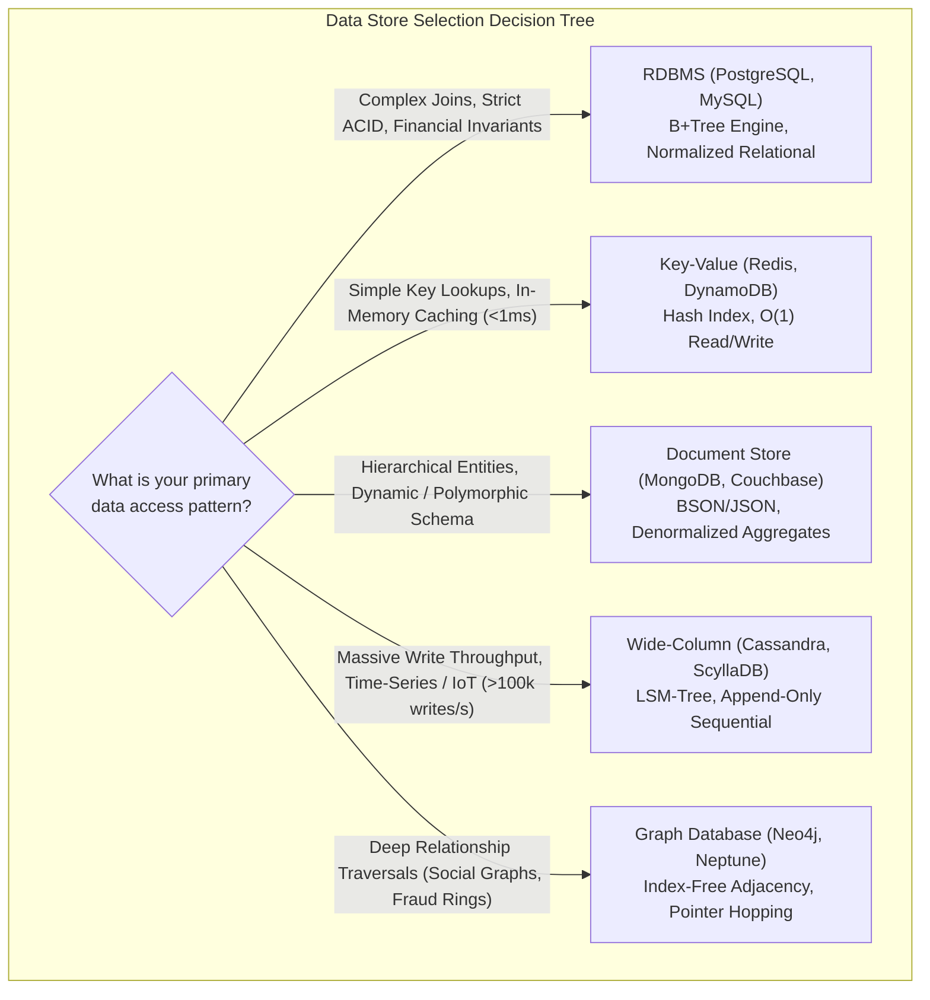
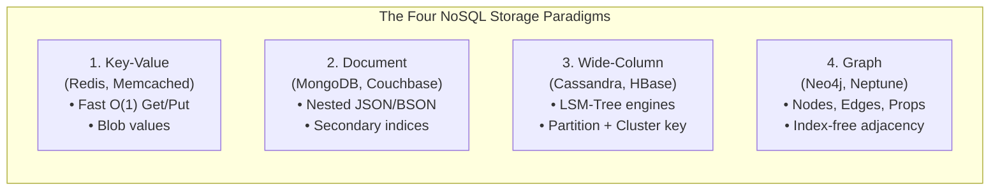
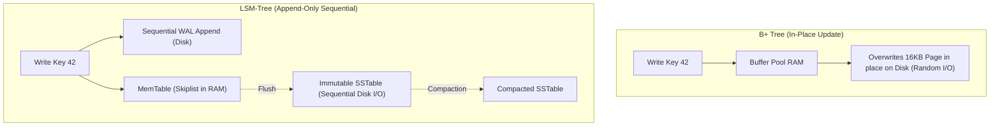

# RDBMS vs NoSQL: Decision Framework

## TL;DR
The choice between Relational Database Management Systems (RDBMS) and Non-Relational (NoSQL) data stores represents an architectural trade-off between structured relational integrity and elastic horizontal scalability.
RDBMS models data in rigid, normalized tables governed by relational algebra, declarative SQL, and ACID transactional guarantees, optimizing for data consistency, complex multi-table joins, and ad-hoc analytical queries.
NoSQL represents a family of specialized non-relational storage paradigms (Key-Value, Document, Wide-Column, and Graph) that sacrifice arbitrary joins and immediate global consistency in exchange for horizontal partitioning, schema flexibility, and ultra-high write/read throughput.
Modern system design rejects the binary dogma of "SQL vs NoSQL" in favor of **Polyglot Persistence**: deploying specialized datastores matched precisely to distinct domain access patterns across a microservices ecosystem.

## Mental Model
Think of an RDBMS as a centralized county clerk's archive.
Documents are filed in standardized binders with strict legal schemas, cross-referenced with notarized stamps (foreign keys).
If you want to marry two citizens or transfer land ownership, the clerk verifies every cross-reference before stamping the ledger.
The filing cabinet cannot be easily chopped into 10 pieces and sent to different towns without clerks constantly traveling back and forth to verify stamps.
Think of NoSQL as an automated shipping logistics warehouse.
Packages come in different shapes and sizes (Documents), items are retrieved by scanning a barcode in 2 milliseconds (Key-Value), high-velocity freight is stacked in continuous shipping containers without inspection (Wide-Column), and relationship maps track flight routes (Graph).
Each zone operates independently with localized rules, sacrificing global synchronized ledgers to move millions of packages an hour.



## How It Works (Internals)

### 1. The RDBMS Architectural Foundation
Formulated by Edgar F. Codd in 1970.
- **Data Model**: Relational calculus.
Data is partitioned into relations (tables) composed of tuples (rows) and attributes (columns).
- **Normalization (3NF / BCNF)**: Decomposes data into atomic attributes to eliminate redundancy and update anomalies.
A user's address is stored once in an `addresses` table and linked via foreign keys.
- **Storage Engine**: Predominantly **B+Trees**.
Inner nodes act as routing guides; leaf nodes form a doubly linked list on disk storing sorted records.
Provides $O(\log N)$ search, insert, and delete operations, and exceptional range scan performance.
- **Query Processing**: The SQL query engine parses declarative SQL, compiles it into an abstract syntax tree, evaluates alternative execution plans using a Cost-Based Optimizer (CBO), and executes joins (Nested Loop, Hash Join, or Merge Join).

### 2. The Four Archetypal NoSQL Paradigms



#### A. Key-Value Stores (Redis, Memcached, Amazon DynamoDB)
- **Internals**: An in-memory or on-disk hash table.
- **Access Pattern**: Opaque byte blobs retrieved exclusively by primary key (`GET key`, `PUT key value`).
- **Use Case**: Session state, caching, shopping carts, rate-limiting counters.

#### B. Document Stores (MongoDB, Couchbase)
- **Internals**: Stores semi-structured documents (JSON, BSON, XML).
Documents contain nested arrays and sub-objects, embedding child entities directly inside the parent record (e.g., an Order document contains its Line Items directly).
- **Access Pattern**: Queried by primary key or by indexing nested attributes (`orders.customer.address.zipcode`).
- **Use Case**: Content management, e-commerce product catalogs with polymorphic attributes, mobile app backends.

#### C. Wide-Column / Column-Family Stores (Apache Cassandra, ScyllaDB, Bigtable)
- **Internals**: Log-Structured Merge-Trees (LSM-Trees).
Data is stored as a multi-dimensional sorted map:
$$(RowKey, ColumnKey, Timestamp) \to Value$$
Writes are appended sequentially to a memory buffer (MemTable) and a sequential WAL, completely eliminating expensive random disk writes.
Background compaction merges sorted disk files (SSTables).
- **Access Pattern**: Extremely fast sequential writes and range queries along pre-sorted clustering keys.
Arbitrary cross-partition joins are forbidden.
- **Use Case**: High-velocity IoT sensor metrics, financial time-series telemetry, user activity feeds, messaging history.

#### D. Graph Databases (Neo4j, Amazon Neptune)
- **Internals**: **Index-Free Adjacency**.
Each node stores direct physical memory pointers to its adjacent incoming and outgoing edges.
Traversing a relationship requires following a memory pointer ($O(1)$ per hop) rather than executing an index seek across a join table ($O(\log N)$).
- **Access Pattern**: Deep traversals across interconnected networks (e.g., "Find all friends-of-friends who purchased a product recommended by a colleague within 3 hops").
- **Use Case**: Social networks, fraud detection networks, knowledge graphs, identity management.

### 3. Storage Engine Comparison: B+ Tree vs LSM-Tree

| Storage Characteristic | B+ Tree (Traditional RDBMS) | LSM-Tree (High-Scale NoSQL) |
| :--- | :--- | :--- |
| **Write Mechanism** | In-place overwrite of fixed-size (8KB/16KB) disk pages | Append-only sequential append to MemTable and WAL |
| **Write Amplification** | High; updating 10 bytes dirtying an entire 16KB disk page | Low to medium; batched sequential writes, but incurred during compaction |
| **Read Performance** | Predictable $O(\log N)$ with high page cache locality | Variable; must check MemTable, Bloom filters, and multiple SSTables |
| **Storage Fragmentation** | High; deleted rows leave internal page fragmentation | Low; SSTables are immutable; deletes are tombstones purged during compaction |
| **Random Write Throughput** | Bounded by disk IOPS ($\approx 10K\text{ - }50K\text{ writes/s}$) | Saturated by sequential disk bus ($\approx 100K\text{ - }500K\text{ writes/s}$) |



## Trade-offs and When to Use

| Architectural Dimension | Relational (RDBMS) | NoSQL (Document / Wide-Column / KV) |
| :--- | :--- | :--- |
| **Schema Strictness** | Strict Schema-on-Write (DDL migrations required) | Dynamic Schema-on-Read (Heterogeneous objects allowed) |
| **Data Relationships** | Normalized; first-class relational foreign keys and joins | Denormalized; relationships embedded or joined in app tier |
| **Transactional Guarantees** | Strict multi-row, multi-table ACID transactions | Single-row atomicity; distributed transactions via BASE/Sagas |
| **Scalability Scaling Model** | Vertical scale-up; horizontal sharding requires complex middleware | Built-in native horizontal partitioning and sharding |
| **Query Flexibility** | High; arbitrary ad-hoc SQL queries, aggregations, groupings | Low to medium; queries must align to pre-designed partition keys |
| **Developer Velocity** | Slower initial modeling; rigorous schema design required | Rapid prototyping; easily maps to programming language objects |

### Decision Framework
1. **Choose RDBMS (PostgreSQL, MySQL) when:**
   - The data model is inherently relational with dense entity interconnections (e.g., Customers $\to$ Orders $\to$ Invoices $\to$ LineItems $\to$ Taxes).
   - Strict transactional atomicity is non-negotiable (e.g., banking systems, billing engines, inventory management).
   - Query patterns are dynamic, unpredictable, or heavily analytical, requiring ad-hoc joins and aggregations.
   - Total dataset size is under 2 TB and can comfortably fit within an enterprise cloud instance.
2. **Choose NoSQL when:**
   - Write throughput exceeds the physical IOPS capabilities of a single server ($> 50,000\text{ writes/sec}$).
   - The data model is naturally denormalized (e.g., an entire document is always read and written together as an aggregate).
   - The schema is volatile, polymorphic, or user-defined (e.g., dynamic product catalogs with varying custom attributes).
   - High availability across global regions mandates multi-master active-active replication with eventual consistency ([[CAP-Theorem-and-PACELC|AP mode]]).

## Failure Modes and Pitfalls

### 1. The Relational NoSQL Anti-Pattern (Application Joins)
- *Failure*: An engineering team selects MongoDB for a project because "it scales easily".
Six months later, the business requirements introduce complex relational links between entities.
Because MongoDB cannot efficiently join distributed collections, the backend application executes dozens of sequential round-trip queries in a loop ($N+1$ query problem), causing API latency to surge from 15 ms to 2,500 ms.
- *Mitigation*: If entity relationships are dense and frequently traversed together, use a relational database; do not emulate an RDBMS engine inside application code.

### 2. Unbounded Document Growth (MongoDB 16MB Ceiling)
- *Failure*: In a Document store, comments are embedded directly into a Post document.
A viral post receives 500,000 comments.
The document exceeds MongoDB's strict 16 MB BSON document size limit, crashing writes and throwing unhandled driver exceptions.
- *Mitigation*: Avoid embedding unbounded one-to-many relationships; separate high-cardinality child entities into a distinct collection and reference the parent by ID.

### 3. Schema Drift in Schema-Less Datastores
- *Failure*: Over 3 years, 15 different developers commit code writing to a Document database without schema enforcement.
The database ends up containing 12 different variations of the `address` field (`addr`, `Address`, `shipping_address`, string vs nested JSON).
Every read query must maintain defensive legacy parsing ladders, creating massive maintenance debt and silent bugs.
- *Mitigation*: Enforce JSON Schema validation rules directly at the database tier (e.g., MongoDB Schema Validation), or mandate strict serialization models in application code (e.g., Pydantic or Protobuf).

## Hands-On

### 1. Database Selection Engine in Python
Run this self-contained script demonstrating an architectural heuristic evaluation engine that recommends a database paradigm based on workload constraints:

```python
"""
Educational architectural evaluation script:
Recommends optimal database paradigm based on workload constraints.
No external dependencies required (Python 3.10+).
"""
from dataclasses import dataclass
from typing import List

@dataclass
class WorkloadProfile:
    write_qps: int
    read_qps: int
    data_size_gb: int
    requires_cross_table_acid: bool
    requires_adhoc_joins: bool
    is_schema_volatile: bool
    is_graph_traversal: bool
    latency_sla_ms: float

def recommend_database(p: WorkloadProfile) -> dict:
    recommendation = {}
    
    if p.is_graph_traversal:
        recommendation["primary"] = "Graph Database (e.g., Neo4j, Amazon Neptune)"
        recommendation["rationale"] = "Workload requires index-free adjacency for deep multi-hop traversals."
        return recommendation

    if p.requires_cross_table_acid or p.requires_adhoc_joins:
        if p.write_qps > 50_000 or p.data_size_gb > 10_000:
            recommendation["primary"] = "Distributed NewSQL (e.g., CockroachDB, Google Spanner)"
            recommendation["rationale"] = "Requires relational ACID and joins, but scale exceeds single-node RDBMS bounds."
        else:
            recommendation["primary"] = "Relational RDBMS (e.g., PostgreSQL, MySQL)"
            recommendation["rationale"] = "Standard ACID transactional requirements, complex joins, and dataset fits on single node."
        return recommendation

    if p.latency_sla_ms < 2.0 and not p.is_schema_volatile:
        recommendation["primary"] = "In-Memory Key-Value Store (e.g., Redis, Dragonfly)"
        recommendation["rationale"] = "Sub-2ms SLA mandates in-memory hash indexing."
        return recommendation

    if p.write_qps > 100_000:
        recommendation["primary"] = "Wide-Column LSM Store (e.g., Apache Cassandra, ScyllaDB)"
        recommendation["rationale"] = "High write volume requires LSM-tree append-only sequential disk architecture."
        return recommendation

    if p.is_schema_volatile:
        recommendation["primary"] = "Document Store (e.g., MongoDB, Couchbase)"
        recommendation["rationale"] = "Dynamic or nested polymorphic data structures require flexible JSON/BSON schema-on-read."
        return recommendation

    recommendation["primary"] = "PostgreSQL (Default Safe Choice)"
    recommendation["rationale"] = "General-purpose workload: PostgreSQL handles structured relational, JSONB documents, and high throughput."
    return recommendation

def main():
    print("=== Database Architectural Decision Evaluator ===")
    
    # Case 1: Core Banking Ledger
    banking = WorkloadProfile(
        write_qps=2_000, read_qps=5_000, data_size_gb=500,
        requires_cross_table_acid=True, requires_adhoc_joins=True,
        is_schema_volatile=False, is_graph_traversal=False, latency_sla_ms=20.0
    )
    rec1 = recommend_database(banking)
    print(f"Banking Ledger:     {rec1['primary']} -> {rec1['rationale']}")

    # Case 2: IoT Telemetry Fleet
    iot = WorkloadProfile(
        write_qps=250_000, read_qps=10_000, data_size_gb=50_000,
        requires_cross_table_acid=False, requires_adhoc_joins=False,
        is_schema_volatile=False, is_graph_traversal=False, latency_sla_ms=10.0
    )
    rec2 = recommend_database(iot)
    print(f"IoT Sensor Fleet:   {rec2['primary']} -> {rec2['rationale']}")

    # Case 3: Fraud Ring Detection
    fraud = WorkloadProfile(
        write_qps=500, read_qps=1_000, data_size_gb=200,
        requires_cross_table_acid=False, requires_adhoc_joins=False,
        is_schema_volatile=False, is_graph_traversal=True, latency_sla_ms=30.0
    )
    rec3 = recommend_database(fraud)
    print(f"Fraud Detection:    {rec3['primary']} -> {rec3['rationale']}")

if __name__ == "__main__":
    main()
```

## Performance and Capacity
- **Query Cost Models**:
  - Primary Key Seek in B+Tree: $O(\log_B N)$ where $B \approx 100 \dots 200$.
    For $10,000,000$ rows, a B+Tree has height $3$ to $4$, requiring $3\text{ - }4$ page accesses ($\approx 0.1\text{ ms}$ in buffer pool, $4\text{ ms}$ on cold disk).
  - Primary Key Seek in Key-Value (Hash Table): $O(1)$ memory lookup ($< 0.1\text{ ms}$).
  - LSM-Tree Write: $O(1)$ sequential append to MemTable in RAM, with zero disk seek latency during write path.
  - Multi-Table Join Complexity in RDBMS:
    Joining Table $A$ ($N$ rows) with Table $B$ ($M$ rows) using a Hash Join requires $O(N + M)$ memory, but requires loading both working sets into RAM, which degrades severely if memory overflows to temporary disk spill partitions.

## In Production
- **Amazon.com Polyglot Architecture**:
  - Relational (PostgreSQL / Aurora): Financial order settlement, accounting ledgers, seller payout balances.
  - DynamoDB (NoSQL Key-Value / Document): Product catalog browsing, session state, customer shopping cart.
  - OpenSearch / Elasticsearch: Product search bar, keyword indexing, faceted filtering.
  - Amazon S3: Product images, video reviews, data warehouse raw archives.
- **Uber**:
  - Uses **Schemaless** (a sharded key-value store built on top of MySQL InnoDB engines) to store trip records, treating MySQL as an append-only B+Tree storage engine and disabling foreign keys, triggers, and secondary indexes at the engine level to achieve high write throughput.

### Operational Checklist
- [ ] If choosing an RDBMS, ensure all foreign key columns have explicit indexes to prevent full table locks during cascading operations.
- [ ] For Document stores, configure strict JSON Schema validation to prevent silent schema corruption.
- [ ] For Wide-Column stores, design table schemas strictly around queries: each query must map to a single table with an optimal partition key.

## Interview Questions

> [!question]
> **Question 1 (Junior):** What is the fundamental difference between an RDBMS and a NoSQL database?
> [!success]- Answer
> An RDBMS organizes data into rigid, pre-defined tables governed by relational algebra, foreign keys, and ACID transactional guarantees, using SQL for querying. NoSQL databases are non-relational, distributed data stores (Key-Value, Document, Wide-Column, Graph) that offer flexible or dynamic schemas, scale horizontally across clusters, and prioritize high write/read throughput over complex relational joins and global ACID transactions.

> [!question]
> **Question 2 (Mid-Level):** Explain the trade-off between normalized data modeling (RDBMS) and denormalized data modeling (NoSQL).
> [!success]- Answer
> Normalized modeling eliminates data redundancy by storing each entity once and using foreign keys to establish relationships, optimizing for data integrity and write simplicity (updating an address updates one row). However, reading requires multi-table SQL joins that can be slow at scale. Denormalized modeling embeds related data directly within the parent document or record, optimizing for read performance (a single lookup retrieves the complete object). However, updates require modifying multiple redundant copies across the database, increasing write complexity and risking data inconsistency.

> [!question]
> **Question 3 (Mid-Level):** What are the four primary families of NoSQL databases, and what is one ideal use case for each?
> [!success]- Answer
> (1) **Key-Value** (Redis, DynamoDB): In-memory caching and session state. (2) **Document** (MongoDB, Couchbase): E-commerce product catalogs with polymorphic attributes. (3) **Wide-Column** (Cassandra, ScyllaDB): High-velocity IoT telemetry and time-series event logs. (4) **Graph** (Neo4j, Amazon Neptune): Social network connection graphs and real-time fraud ring detection.

> [!question]
> **Question 4 (Senior):** What is the core difference between a B+Tree storage engine and an LSM-Tree storage engine?
> [!success]- Answer
> B+Trees perform in-place updates: modifying a row rewrites an existing 8KB/16KB page on disk, providing fast, predictable reads ($O(\log N)$) but causing high write amplification and random disk I/O. LSM-Trees perform append-only sequential writes: updates are appended to an in-memory MemTable and a sequential WAL, delivering exceptional write throughput with zero random disk seeks. However, reads in LSM-Trees must check multiple levels of immutable SSTables and Bloom filters, and background compaction consumes CPU and disk bandwidth.

> [!question]
> **Question 5 (Senior):** What is "Polyglot Persistence", and how would you apply it to an e-commerce platform?
> [!success]- Answer
> Polyglot Persistence is the architectural practice of utilizing different data storage technologies within the same system, matching each datastore to the specific access patterns of each microservice. In an e-commerce platform: (1) **PostgreSQL** handles checkout, payments, and financial ledgers where ACID guarantees are mandatory; (2) **Redis** caches user sessions and shopping cart drafts for sub-millisecond lookups; (3) **MongoDB** stores the flexible product catalog with varying item specifications; (4) **Elasticsearch** powers full-text search and faceted filtering; and (5) **Kafka** acts as the durable event bus streaming orders to analytics data lakes.

> [!question]
> **Question 6 (Staff):** How would you handle a technical team demanding to migrate a core banking application from PostgreSQL to MongoDB to "move faster without migrations"?
> [!success]- Answer
> Challenge the proposition based on risk and correctness: (1) **Financial Invariants**: Core banking requires double-entry accounting ledgers where multi-row debit and credit operations must commit atomically with strict serializable isolation; while MongoDB supports distributed transactions, its performance degrades severely under high-contention multi-document locking. (2) **Foreign Key Integrity**: Banking compliance mandates referential integrity (e.g., accounts must link to verified KYC records); in MongoDB, maintaining referential integrity requires brittle, custom application code. (3) **Auditability**: RDBMS triggers, temporal tables, and declarative schema migrations (Flyway/Liquibase) provide deterministic audit trails required by banking regulators. Recommend keeping the transactional ledger in PostgreSQL, while offering MongoDB or Redis for non-critical features like UI notification logs or user preference caching.

> [!question]
> **Question 7 (Staff):** Explain why Graph Databases use "Index-Free Adjacency" and why relational databases suffer a combinatorial join explosion on deep graph queries.
> [!success]- Answer
> In an RDBMS, traversing a relationship requires querying a Join Table: the engine performs an index lookup ($O(\log N)$) to find foreign keys, requiring repeated B+Tree traversals for every hop. For an $H$-hop traversal, execution time scales exponentially ($O(B^H)$ where $B$ is branching factor), saturating buffer pools and causing join explosions. Graph databases implement **Index-Free Adjacency**: each node record stores direct memory or disk pointers to its neighboring nodes. Traversing an edge consists of simply dereferencing a physical pointer ($O(1)$ per edge), allowing deep traversals (e.g., 6 hops across millions of nodes) to execute in milliseconds without index lookups.

> [!question]
> **Question 8 (Staff):** When does a modern NewSQL database (like CockroachDB or Google Spanner) make an RDBMS vs NoSQL decision obsolete?
> [!success]- Answer
> NewSQL databases bridge the historical divide by providing both: (1) The relational data model, standard declarative SQL, and strict serializable ACID transactions of traditional RDBMS; and (2) The horizontal scaling, automatic range sharding, and multi-datacenter fault tolerance (via Raft or Paxos consensus) of NoSQL systems. A team no longer has to trade off relational integrity for horizontal scale. However, NewSQL introduces new trade-offs: higher write latency due to distributed consensus round trips ($2\times \text{RTT}$), higher operational complexity, and significant infrastructure costs compared to a single-node PostgreSQL instance.

## Related
- [[ACID-vs-BASE|ACID vs BASE]]: Transactional guarantees underlying RDBMS and NoSQL.
- [[CAP-Theorem-and-PACELC|CAP Theorem and PACELC]]: Distributed trade-offs governing database clustering.
- [[PostgreSQL-Architecture|PostgreSQL Architecture]]: Deep dive into an enterprise RDBMS.
- [[Apache-Cassandra|Apache Cassandra]]: Deep dive into a wide-column NoSQL database.
- [[MongoDB-and-Couchbase|MongoDB and Couchbase]]: Deep dive into document stores.

## Further Reading
- Codd, Edgar F. "A relational model of data for large shared data banks." *Communications of the ACM* 13.6 (1970): 377-387.
- Stonebraker, Michael, et al. "The end of an architectural era: (it's time for a complete rewrite)." *Proceedings of the 33rd international conference on Very large data bases*. 2007.
- O’Neil, Patrick, et al. "The log-structured merge-tree (LSM-tree)." *Acta Informatica* 33.4 (1996): 351-385.
- Sadalage, Pramod J., and Martin Fowler. *NoSQL distilled: a brief guide to the emerging world of polyglot persistence*. Pearson Education, 2012.
