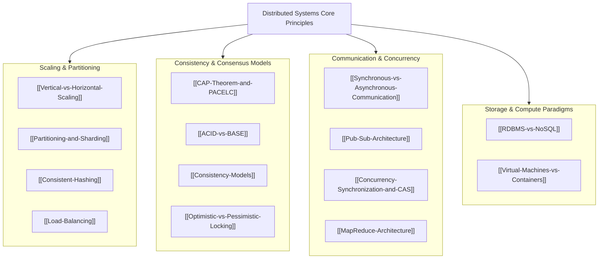

# System Design Core Concepts and Foundations

## Map of Content

Distributed systems design requires navigating fundamental architectural trade-offs across consistency, availability, latency, partitioning, concurrency, and compute virtualization.
This module establishes the theoretical foundations and design patterns necessary to architect, analyze, and scale production systems.

## Foundational Knowledge Areas

### 1. Scalability and Partitioning
- [[Vertical-vs-Horizontal-Scaling]]: Theoretical bounds (Amdahl's Law, Universal Scalability Law), stateful vs stateless scaling, and cost efficiency inflection points.
- [[Partitioning-and-Sharding]]: Horizontal partitioning strategies (Range, Hash, Directory-based), rebalancing algorithms, and cross-shard transaction coordination.
- [[Consistent-Hashing]]: Distributed hash rings, virtual nodes, Murmur3 hashing, and minimal key redistribution under cluster topology changes.
- [[Load-Balancing]]: Layer 4 transport vs Layer 7 application load balancing, health check algorithms, and session persistence.

### 2. Consistency, Transactions, and Consensus
- [[CAP-Theorem-and-PACELC]]: Brewer's conjecture, FLP impossibility, trade-offs between consistency and availability under network partitions, and PACELC latency bounds under normal operation.
- [[ACID-vs-BASE]]: Strict relational ACID guarantees compared to BASE (Basically Available, Soft state, Eventual consistency) distributed paradigms.
- [[Consistency-Models]]: The consistency hierarchy spanning Linearizability, Sequential Consistency, Causal Consistency, Read-Your-Writes, Monotonic Reads, and Eventual Consistency.
- [[Optimistic-vs-Pessimistic-Locking]]: Comparison of two-phase locking (2PL) versus optimistic concurrency control (OCC), MVCC versioning, and fencing tokens.

### 3. Communication, Concurrency, and Parallelism
- [[Synchronous-vs-Asynchronous-Communication]]: Tight temporal coupling vs loose message-driven decoupling, backpressure mechanisms, and circuit breakers.
- [[Pub-Sub-Architecture]]: Event-driven fan-out topologies, message broker architectures, subscriber filtering models, and at-least-once delivery semantics.
- [[Concurrency-Synchronization-and-CAS]]: Hardware-level atomic primitives (CMPXCHG, LL/SC), memory barriers, ABA problem mitigation, and lock-free data structures.
- [[MapReduce-Architecture]]: Split-Map-Shuffle-Sort-Reduce distributed computational model, data locality principles, and failure recovery.

### 4. Storage and Compute Paradigms
- [[RDBMS-vs-NoSQL]]: Detailed comparison of Relational, Key-Value, Document, Wide-Column, and Graph database storage structures.
- [[Virtual-Machines-vs-Containers]]: Hypervisor hardware virtualization vs Linux kernel isolation (Namespaces, cgroups v2, OverlayFS).

### 5. Architectural Navigation Hubs
- [[System-Design-Concept-Map]]: Interactive Mermaid map connecting theoretical concepts to real-world infrastructure implementations.
- [[Technology-Comparison-Matrix]]: Master reference matrix comparing 20 primary distributed databases, brokers, caches, and runtimes across consistency, partitioning, and storage engines.
- [[Distinguished-Design-Path]]: The order to read this folder, and the questions a design has to answer before it is finished.

### 6. Distinguished Foundations
These notes are the layer under the case studies.
Each one names an invariant, the failure that breaks it, and the cost of protecting it.
- [[Capacity-Estimation]]: QPS, storage, bandwidth, and the peak factor that changes the diagram.
- [[Replication-and-Quorums]]: Single-leader, multi-leader, and leaderless copies, and what R + W > N does and does not prove.
- [[Time-Clocks-and-Ordering]]: Wall clocks, Lamport clocks, vector clocks, hybrid clocks, and TrueTime.
- [[Consensus-and-Failure-Detection]]: Majority logs, FLP, leases, and suspicion.
- [[Indexing-and-Access-Paths]]: B+ trees, LSM trees, inverted indexes, and sharded secondary indexes.
- [[Caching-and-Invalidation]]: Cache-aside, write-back, stampedes, and the stale-fill race.
- [[DNS-and-CDN]]: Name TTLs, cache keys, and origin shield.
- [[Probabilistic-Structures]]: Bloom filters, count-min sketches, and HyperLogLog.
- [[Idempotency-and-Delivery]]: At-least-once delivery and an effect that still happens once.
- [[Outbox-CDC-and-Event-Sourcing]]: Dual writes, the outbox, change data capture, and when the log is the database.
- [[Backpressure-and-Tail-Latency]]: Bounded queues, load shedding, and fan-out tails.
- [[Multi-Region-Active-Active]]: RPO, RTO, and what active-active does to conflicts.
- [[Schema-Evolution-and-Migration]]: Expand, migrate, and contract while two versions run.
- [[SLOs-and-Observability]]: SLIs, error budgets, burn rates, and the three signals.

## Study and Interview Roadmap

1. Begin by understanding how [[Vertical-vs-Horizontal-Scaling]] and [[Virtual-Machines-vs-Containers]] dictate system architecture boundaries.
2. Master the core theoretical trade-offs in [[CAP-Theorem-and-PACELC]], [[ACID-vs-BASE]], and [[Consistency-Models]].
3. Study data distribution mechanisms via [[Partitioning-and-Sharding]] and [[Consistent-Hashing]].
4. Learn concurrency and synchronization primitives in [[Optimistic-vs-Pessimistic-Locking]] and [[Concurrency-Synchronization-and-CAS]].
5. Review the [[Technology-Comparison-Matrix]] to prepare for high-level technology selection questions in Staff+ system design interviews.
6. Read [[Replication-and-Quorums]], [[Time-Clocks-and-Ordering]], [[Idempotency-and-Delivery]], and [[Backpressure-and-Tail-Latency]] before you add a second region or a queue.
7. Apply the theory in the [[04-System-Design/02-Case-Studies/README|Case Studies Master Hub]], starting with [[01-URL-Shortener/design|URL Shortener]] and [[11-Distributed-Key-Value-Store/design|the key-value store]], then the product studies.

<!-- moc:start (generated by tools/build_mocs.py; edits inside are overwritten) -->
## Also in this folder

**Notes**

- [System Design Fundamentals and Architecture Cheatsheet](system_design_basics.md)

<!-- moc:end -->
