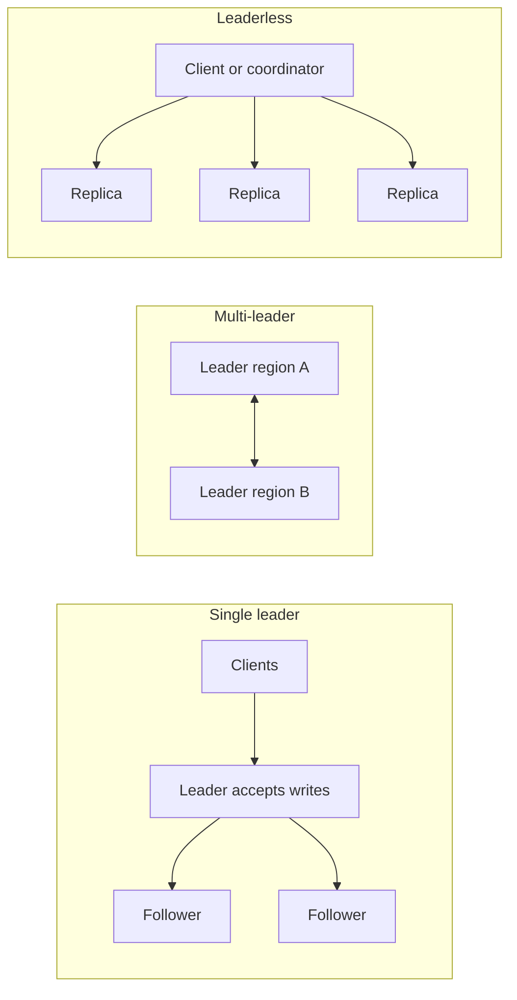

# Replication and Quorums

## TL;DR

Replication keeps a copy of the same data on more than one machine so a disk or a node can die without losing the write you already acknowledged.
The copy protocol decides whether a read is allowed to see a stale value, and how long a write waits before the client is told the write happened.
A quorum is the smallest set of replicas that must agree before that decision is final.

## Core model

Three topologies cover almost every store you will design.



Single-leader replication sends every write to one primary.
Followers apply the same log in order.
Synchronous followers are part of the commit.
The client ack waits for them, so a crash of the primary does not lose that write, and the write's latency includes the follower.
Asynchronous followers are not part of the commit.
Failover can lose the writes that were acked at the primary and not yet shipped.
That window is the replication lag, and it is also your recovery point if you promote a follower.

Multi-leader replication lets more than one node accept writes.
It exists so a region can write without a cross-ocean round trip.
Two leaders can accept conflicting updates for the same key.
Last-write-wins on a wall clock drops one of them silently.
A vector clock or a CRDT keeps both and merges them.
See [[Time-Clocks-and-Ordering]] and the collaborative editor study.

Leaderless replication lets the client write to any W of N replicas.
There is no single order unless you add a consensus log.
Dynamo, Cassandra, and Riak are this family.
[[Apache-Cassandra]] is the worked system.
[[CockroachDB-Distributed-SQL]] is the opposite choice: a Raft leader per range.

## Quorums

N is the number of replicas that should hold the key.
W is the number that must ack a write.
R is the number that must answer a read.

If R + W > N, every read quorum and every write quorum share at least one replica.
That replica can return the version the write stored, if three extra conditions hold.
The write went to the key's real N replicas, not to temporary stand-ins.
The reader compares versions and keeps the newest, instead of trusting the first reply.
"Newest" is defined by a version the replicas agree on, not by an unsynchronized wall clock.

R + W > N is not linearizability.
Concurrent writes can both succeed.
A reader can still observe an older value if it does not reconcile versions, or if a sloppy quorum accepted the write on nodes that are not in the key's preferred set.
Sloppy quorum preserves availability by writing to reachable nodes.
Hinted handoff later ships those copies home.
Until the handoff finishes, a strict quorum read can miss the write.

| Choice | Latency | Stale read | Lost acked write |
|---|---|---|---|
| W = N, R = 1 | Slow writes | No, if you read a replica that acked | No, if the ack waited for every replica |
| W = 1, R = 1 | Fast | Yes | Yes, if that replica dies |
| W = R = quorum, R + W > N | One slow replica in the quorum | Only with sloppy quorum or bad versioning | No, for the preferred replicas |

A common production pick is N = 3, W = 2, R = 2.
The write survives one replica death.
The read still overlaps the write.
The client waits for the slower of two replicas, which is the tail-latency cost.

## Worked check

```python
def quorums_intersect(n: int, r: int, w: int) -> bool:
    """True when every read set must share a replica with every write set."""
    if not (1 <= r <= n and 1 <= w <= n):
        raise ValueError("R and W must lie in 1..N")
    return r + w > n
```

`quorums_intersect(3, 2, 2)` is true.
`quorums_intersect(3, 1, 1)` is false.
The function does not prove linearizability.
It only proves set intersection.

## Replication mechanisms

Statement shipping re-executes SQL on the follower.
Non-deterministic statements (`now()`, a random value, a trigger) diverge the replica.
Write-ahead log shipping copies the bytes the leader appended.
The follower applies the same physical log, so the result matches.
Logical replication ships row changes.
It is the right tool for a version upgrade or a subset of tables, and it is not a byte-identical crash replica.
[[Write-Ahead-Log]] is the mechanism underneath log shipping.
[[MySQL-and-InnoDB]] and [[PostgreSQL-Architecture]] both ship a log.
They do not ship the same log format.

## Pitfalls

- Promoting an async follower drops the unshipped tail.
  The application must tolerate that, or the commit must wait for a sync replica.
- Read-your-writes fails when the read goes to a lagging follower.
  Sticky sessions and "read your own writes from the leader" are the usual repairs.
- A quorum read that returns the first response, and ignores the other versions, is not a quorum read.
- Adding a replica increases durability only after it has caught up.
  A new empty replica must not count toward W.

## Interview questions

1. A user writes a profile and immediately reads it from another tab. Why can the read miss, and which replica policy fixes it.
2. Why is R + W > N not the same statement as linearizability.
3. When would you refuse multi-leader replication for a payments ledger.
4. What does hinted handoff protect, and what does it not protect.

## Further reading

- Dynamo, SOSP 2007, for N, R, W, sloppy quorum, and Merkle repair.
- Designing Data-Intensive Applications, chapters 5 and 7.
- [[Consistency-Models]] for the contract a quorum is trying to meet.
- [[Partitioning-and-Sharding]] for how the key chooses which N replicas.
