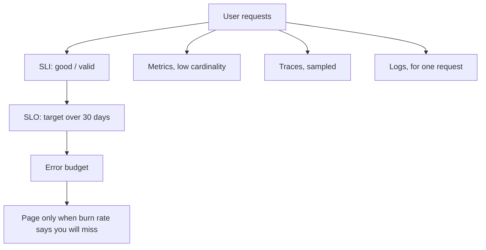

# SLOs and Observability

## TL;DR

An SLI is the fraction of real user events that were good.
An SLO is the target for that fraction over a window.
The error budget is what remains before you miss the target.
Logs, metrics, and traces are how you debug.
They are not the SLO.

## The objects

A useful SLI for an API is the fraction of requests that returned a non-5xx status, or a successful business code, inside the latency bound.
Availability and latency are one SLI when the user experiences them as one event.
A slow success is not good if the SLO said 300 ms.
[[Backpressure-and-Tail-Latency]] is the engineering that protects the latency half.

The error budget for a 99.9 percent SLO over 30 days is 0.1 percent of requests, about 43 minutes if you think in time and the traffic is flat.
Do not page a human because one minute burned a little budget.
Page when the burn rate says the monthly budget will be gone in days, or hours.
The SRE workbook's multi-window burn rates exist so a short spike pages quickly and a slow leak still pages.

## Signals

Metrics are counters, gauges, and histograms, aggregated.
A label that includes user id or full URL will explode the time-series database.
[[16-Metrics-Platform/design|The metrics study]] is that system.
Histograms and percentiles are the latency instrument.
An average hides the tail you promised not to have.

A trace is a tree of spans with one trace id.
Head sampling keeps a fraction of all traces and misses the rare failure.
Tail sampling keeps the slow and the failed ones, and it needs a buffer before the decision.
Logs are for the one request you already identified.
They are the wrong store for a rate.

## Pitfalls

- An SLO on CPU utilization.
  The user does not experience CPU.
- Alerting on a 100 percent error rate for one error from one canary, with no traffic floor.
- Sampling traces at the leaf, so one request has half its spans.
  Sample at the root and propagate the decision.
- A dashboard that nobody can use to decide whether to ship.
  That is the error budget's job.

## Interview questions

1. Define an SLI for a URL redirect service. Say what "good" means.
2. Your budget is 0.1 percent and you are burning 2 percent of requests. When do you page, and when do you stop shipping.
3. Why is an average latency the wrong graph.
4. What is the difference between head sampling and tail sampling.

## Further reading

- Google SRE book, the chapters on SLOs.
- The SRE workbook, chapter on alerting on SLOs.
- [[Capacity-Estimation]] for the traffic number the budget multiplies.
