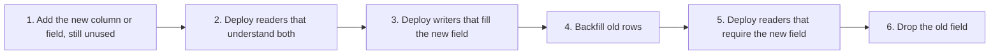

# Schema Evolution and Online Migration

## TL;DR

A schema change is a distributed deploy.
Old code and new code run at the same time, and both must read the data the other writes.
Expand, then migrate, then contract.
Never drop a column in the same release that stops writing it.

## Expand and contract

The database steps are the same shape as the event steps.
Protobuf and Avro call the middle compatibility backward or forward.
Backward compatible means new code can read old data.
Forward compatible means old code can read new data.
A rolling deploy needs both, because the fleet is briefly mixed.
Adding an optional field is usually safe.
Renaming a field, changing a type, or reusing a tag number is how you corrupt a log you cannot rewrite.

[[PostgreSQL-Architecture]] can add a nullable column as a catalog change.
It cannot rewrite every row for a new default without a backfill you planned.
An index build that locks writes is an outage with a progress bar.
Concurrent index creation has two phases: build, then catch up the writes that landed during the build, then publish the index.
[[Indexing-and-Access-Paths]] is why that catch-up exists.

## Moving the bytes

A shard move and a storage-engine move use the same idea.
Copy, then tail the changelog, then compare, then cut writes, then compare again.
The tail is [[Outbox-CDC-and-Event-Sourcing]] or the database log.
Checksums or row counts that ignore the tail will tell you the copy is fine while it is already wrong.
Dual writes during the overlap must be idempotent.
[[Idempotency-and-Delivery]] is the overlap protocol.

## Pitfalls

- A migration that assumes one version of the application is running.
- Backfilling with an unbounded `UPDATE` that takes a lock the write path needs.
- Reusing a protobuf field number.
- Cutting DNS to a new database before the replication lag is inside your error budget.

## Interview questions

1. You need to split `name` into `given` and `family` on a table that takes 20,000 writes per second. Order the deploys.
2. Why must readers land before writers.
3. What do you compare before the cutover, and why is a row count not enough.
4. A consumer rebuilt from a year of events crashes on a new field. Which compatibility did you break.

## Further reading

- Sadalage and Fowler, on evolutionary database design.
- [[Multi-Region-Active-Active]] when the expand/contract has to finish in more than one region before you contract.
