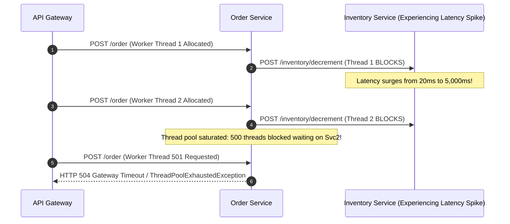
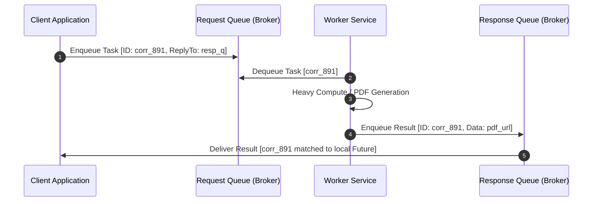

# Synchronous vs Asynchronous Communication

## TL;DR
Synchronous communication couples caller and receiver in time: the caller issues a request (via HTTP/REST or gRPC) and blocks or pauses execution until the recipient returns a response.
Asynchronous communication uncouples caller and receiver in time: the sender dispatches a message or event to an intermediary buffer (message broker or durable log) and immediately resumes execution without waiting for the consumer to finish processing.
Synchronous models provide immediate feedback, simple control flow, and deterministic debugging, but create fragile dependency chains where a single slow downstream service exhausts upstream thread pools and triggers cascading outages.
Asynchronous models provide temporal decoupling, elasticity, and backpressure buffering against traffic spikes, but introduce eventual consistency, message deduplication overhead, and complex asynchronous failure handling.

## Mental Model
Think of Synchronous Communication as a live telephone conversation.
You dial customer support, hold the phone to your ear, and wait for an agent to answer.
While holding, you cannot start an unrelated conversation, and if the support agent steps away to search the warehouse, you remain stuck listening to hold music.
If the phone line is disconnected, your communication aborts entirely.
Think of Asynchronous Communication as dropping a stamped letter into a neighborhood mailbox.
You drop the letter and immediately continue with your day.
The postal service buffers the letter, transports it across logistics hubs, and delivers it to the recipient's mailbox hours or days later.
The recipient reads the letter whenever they are available, even if you are asleep.

```mermaid
graph TD
    subgraph SynchronousFlow ["Synchronous Request-Response (Temporal Coupling)"]
        Client1[Client] -->|1. HTTP Request (Blocks)| SvcA[Service A]
        SvcA -->|2. gRPC Call (Blocks)| SvcB[Service B]
        SvcB -->|3. SQL Query (Blocks)| DB[(Database)]
        DB -.->|4. Result| SvcB
        SvcB -.->|5. Result| SvcA
        SvcA -.->|6. HTTP Response| Client1
    end

    subgraph AsynchronousFlow ["Asynchronous Event-Driven (Temporal Decoupling)"]
        Client2[Client] -->|1. Dispatch Job| Svc1[Ingestion API]
        Svc1 -->|2. Fast Ack (HTTP 202 Accepted)| Client2
        Svc1 -->|3. Publish Event| Broker[(Message Broker / Queue)]
        Broker -.->|4. Buffer Spikes / Backpressure| Broker
        Broker -->|5. Pull / Push Task| Worker1[Worker Pool 1]
        Broker -->|6. Pull / Push Task| Worker2[Worker Pool 2]
    end
```

## How It Works (Internals)

### 1. Synchronous Communication Internals
In synchronous interactions, both endpoints must be online and available simultaneously (Temporal Coupling).

#### A. Connection Mechanics and Thread Exhaustion
- **Protocol Foundations**: HTTP/1.1, HTTP/2, gRPC, and standard socket connections.
- **The Little's Law Trap**:
$$L = \lambda \times W$$
Where $L$ is the number of concurrent in-flight requests, $\lambda$ is arrival rate, and $W$ is average response latency.
- Suppose a web service receives $\lambda = 1,000\text{ RPS}$ with normal downstream latency $W = 50\text{ ms}$ ($0.05\text{ s}$).
The system requires $L = 1000 \times 0.05 = 50$ concurrent worker threads.
- If downstream Database $B$ encounters lock contention and latency degrades to $W = 3.0\text{ seconds}$, the in-flight concurrency surges to:
$$L = 1000 \times 3.0 = 3,000\text{ threads}$$
- Web server thread pools (Tomcat, Gunicorn, Puma) saturate their maximum thread limit (typically 200 to 500 threads).
Incoming requests queue up and time out, crashing the upstream service.



#### B. Synchronous Resilience Mechanics
To survive synchronous coupling, systems mandate defensive patterns:
1. **Strict Deadlines and Timeouts**: Every network call must define explicit connect timeouts (e.g., 200 ms) and read timeouts (e.g., 1,000 ms).
2. **Circuit Breakers**: When error/timeout rates cross a threshold (e.g., 50% failures over 10 seconds), the circuit trips open, immediately fast-failing subsequent calls without consuming threads.
3. **Bulkheads**: Isolate thread pools per downstream service so a stall in the Payment Service cannot exhaust threads needed for the Catalog Service.

### 2. Asynchronous Communication Internals
Asynchronous systems rely on an intermediary durable storage layer - a message broker (RabbitMQ) or distributed append-only commit log (Apache Kafka).

#### A. Message Queue Mechanics (Point-to-Point)
- **Work Queue Pattern**: Multiple worker instances listen to a single queue.
- **Fair Dispatching**: The broker delivers each message to exactly one available worker.
- **Acknowledgment ($ACK$)**: The worker processes the message and sends an explicit $ACK$ back to the broker.
If the worker crashes midway, the TCP socket closes; the broker redelivers the message to another healthy worker.

#### B. Asynchronous Request-Reply (Correlation ID Pattern)
When an asynchronous system requires a response back to the original caller, it uses **Correlation IDs**:
1. Client generates a unique UUID `correlation_id = "corr_984"`.
2. Client places the request on `request_queue`, specifying header `reply_to: "response_queue_client_1"` and `correlation_id: "corr_984"`.
3. Worker processes the request and places the result on `response_queue_client_1`, tagging it with `correlation_id: "corr_984"`.
4. Client consumes its response queue, correlates the ID to its pending future/promise, and fulfills the caller.



## Trade-offs and When to Use

| Architectural Attribute | Synchronous (RPC / HTTP) | Asynchronous (Messaging / Events) |
| :--- | :--- | :--- |
| **Temporal Coupling** | High; both services must be active simultaneously | Zero; sender and receiver operate independently |
| **Latency** | Immediate ($< 50\text{ ms}$ round trip) | Variable; message transit + queue wait time |
| **System Complexity** | Low; familiar sequential programming control flow | High; requires idempotent consumers, outbox tables, DLQs |
| **Failure Blast Radius** | High; failure propagates upstream across call chain | Isolated; failures are absorbed and buffered by queue |
| **Backpressure / Throttling** | Difficult; requires rate limiters and load shedding | Native; workers pull messages at their own sustainable rate |
| **Data Consistency** | Real-time immediate consistency | Eventual consistency; requires compensation logic |

### Decision Guide
1. **Use Synchronous Communication when:**
   - The user interface is blocked awaiting an immediate answer (e.g., verifying user login credentials, querying current stock prices, checking flight seat availability).
   - The operation is a read-only query that cannot be deferred.
   - Operations require atomic distributed consistency within a tightly bounded failure domain.
2. **Use Asynchronous Communication when:**
   - The task involves heavy computation, I/O, or third-party external APIs (e.g., video transcoding, generating monthly PDF invoices, sending push notifications, processing credit card settlements).
   - Traffic exhibits massive unpredictable spikes (e.g., flash sale order ingestion, ticket drops).
   - Multiple independent subsystems need to react to a single business occurrence ([[Pub-Sub-Architecture|Pub-Sub Architecture]]).

## Failure Modes and Pitfalls

### 1. Poison Pill Messages
- *Failure*: A client submits a malformed message containing unexpected JSON syntax that crashes the worker's deserializer with an unhandled exception.
The worker crashes without sending an ACK.
The broker detects the crash and redelivers the poison message to a second worker, which promptly crashes.
The poison message cycles through every worker in the fleet, crashing the entire consumer pool.
- *Mitigation*: **Dead Letter Queues (DLQ)**.
Configure a maximum retry count (e.g., 3 retries).
After 3 consecutive failures, the broker routes the poison message to an isolated DLQ for inspection and continues processing normal messages.

### 2. Message Duplication and Non-Idempotent Consumers
- *Failure*: A worker completes a bank debit, but a network blip drops its ACK packet to the broker.
The broker assumes the worker died and redelivers the message to another worker, which executes the debit a second time, double-charging the customer.
- *Mitigation*: **Consumer Idempotency**.
Every message must carry a unique `idempotency_key`.
Workers check an atomic cache (Redis `SET NX`) or a relational table (`INSERT ... ON CONFLICT DO NOTHING`) before executing business logic.

### 3. Queue Explosion / Memory Exhaustion
- *Failure*: An upstream service generates 50,000 events/second while downstream workers process only 5,000 events/second.
The message queue buffers millions of messages in RAM, exhausting broker memory and crashing the messaging cluster.
- *Mitigation*: Enforce queue length limits with drop-oldest or drop-newest policies, deploy dynamic consumer autoscaling (KEDA based on queue lag), and alert on consumer lag thresholds.

## Hands-On

### 1. Python Async Lab: Synchronous Blocking vs Asynchronous Queued Processing
Run this self-contained script demonstrating how synchronous blocking cascades into thread starvation, while an asynchronous queue with workers absorbs load smoothly:

```python
"""
Educational simulator comparing Synchronous Blocking vs Asynchronous Queued Execution.
No external dependencies required (Python 3.10+).
"""
import asyncio
import time
import random

async def simulate_slow_downstream(request_id: int) -> str:
    # Downstream service takes 200ms to process
    await asyncio.sleep(0.2)
    return f"Response_{request_id}"

# --- 1. SYNCHRONOUS BLOCKING MODEL (Bounded Worker Pool) ---
async def synchronous_runner(total_requests: int, concurrency_limit: int):
    sem = asyncio.Semaphore(concurrency_limit)
    
    async def handle_request(req_id: int):
        async with sem:
            return await simulate_slow_downstream(req_id)

    start = time.perf_counter()
    tasks = [handle_request(i) for i in range(total_requests)]
    results = await asyncio.gather(*tasks)
    duration = time.perf_counter() - start
    print(f"Synchronous Pool (Limit {concurrency_limit}): Completed {len(results)} requests in {duration:.2f}s")

# --- 2. ASYNCHRONOUS EVENT QUEUE MODEL (Decoupled Ingestion & Workers) ---
async def asynchronous_runner(total_requests: int, num_workers: int):
    queue = asyncio.Queue()
    completed = []

    # Worker task pulling from queue
    async def worker(worker_id: int):
        while True:
            req_id = await queue.get()
            res = await simulate_slow_downstream(req_id)
            completed.append(res)
            queue.task_done()

    # Start worker pool
    workers = [asyncio.create_task(worker(i)) for i in range(num_workers)]

    start = time.perf_counter()
    # Producer enqueues all requests instantly (Fast Acknowledgment)
    for i in range(total_requests):
        await queue.put(i)
    ingestion_time = time.perf_counter() - start
    print(f"Asynchronous Producer: Ingested {total_requests} tasks in {ingestion_time*1000:.2f}ms (Client unblocked instantly)")

    # Wait for queue drain
    await queue.join()
    total_time = time.perf_counter() - start
    print(f"Asynchronous Workers ({num_workers} workers): Drained queue in {total_time:.2f}s")

    for w in workers:
        w.cancel()

async def main():
    total_reqs = 30
    concurrency = 5
    
    print("=== Evaluating Communication Architectures ===")
    await synchronous_runner(total_reqs, concurrency_limit=concurrency)
    print("\n---")
    await asynchronous_runner(total_reqs, num_workers=concurrency)

if __name__ == "__main__":
    asyncio.run(main())
```

### 2. Circuit Breaker Implementation Pattern
```python
import time

class CircuitBreakerOpenException(Exception):
    pass

class CircuitBreaker:
    def __init__(self, failure_threshold: int = 5, recovery_timeout_sec: float = 10.0):
        self.threshold = failure_threshold
        self.recovery_timeout = recovery_timeout_sec
        self.failure_count = 0
        self.last_failure_time = 0.0
        self.state = "CLOSED"  # CLOSED, OPEN, HALF_OPEN

    def call(self, func, *args, **kwargs):
        now = time.time()
        if self.state == "OPEN":
            if now - self.last_failure_time > self.recovery_timeout:
                self.state = "HALF_OPEN"
            else:
                raise CircuitBreakerOpenException("Circuit is OPEN: Fast-failing downstream call.")

        try:
            result = func(*args, **kwargs)
            if self.state == "HALF_OPEN":
                self.state = "CLOSED"
                self.failure_count = 0
            return result
        except Exception as e:
            self.failure_count += 1
            self.last_failure_time = now
            if self.failure_count >= self.threshold:
                self.state = "OPEN"
            raise e
```

## Performance and Capacity
- **Backpressure and Rate Smoothing**:
  Suppose a payment partner API enforces a strict rate limit of $100\text{ requests/sec}$.
  During a Black Friday spike, customers place $2,000\text{ orders/sec}$.
  - Under a synchronous architecture, 95% of orders are rejected by the payment gateway with HTTP 429 Too Many Requests errors.
  - Under an asynchronous architecture, all 2,000 orders/sec are buffered in RabbitMQ in $< 2\text{ ms}$, and a pool of 20 worker threads drains the queue at exactly $100\text{ requests/sec}$, ensuring 100% of orders succeed without hitting rate limit errors.
- **Queue Memory Overhead**:
  Buffering 1,000,000 messages in memory where average message size is $2\text{ KB}$ requires:
  $$10^6 \times 2\text{ KB} = 2\text{ GB RAM}$$

## In Production
- **Uber**: Migrated payment processing and trip lifecycle management from synchronous microservice RPCs to asynchronous orchestration using **Cadence (Temporal)**.
Instead of relying on fragile multi-service HTTP chains, trip workflows execute as durable asynchronous state machines that survive process restarts, network outages, and datacenter migrations.
- **Netflix**: Video encoding pipelines run 100% asynchronously.
When an artist uploads a 4K movie file, the ingestion service generates a job ID, returns HTTP 202 Accepted, and enqueues tasks into Apache Kafka.
Thousands of distributed GPU instances consume chunks of the video, encode them in parallel, and update a metadata catalog upon completion.

### Operational Checklist
- [ ] For all synchronous HTTP clients, verify that connect and read timeouts are explicitly set (never leave default infinite timeouts).
- [ ] Ensure all asynchronous message consumers are idempotent, verifying messages against an idempotency store before execution.
- [ ] Configure Dead Letter Queues (DLQ) with automated alerting when message count $> 0$.

## Interview Questions

> [!question]
> **Question 1 (Junior):** What is the core trade-off between synchronous and asynchronous communication in microservices?
> [!success]- Answer
> Synchronous communication is simpler to reason about and provides immediate responses, but it tightly couples services in time, making the system vulnerable to cascading failures and thread starvation when downstream services slow down. Asynchronous communication uncouples services, absorbs traffic spikes, and provides fault isolation, but introduces eventual consistency, increased architectural complexity, and requires mechanisms for handling out-of-order and duplicate messages.

> [!question]
> **Question 2 (Mid-Level):** Explain Little's Law ($L = \lambda W$) and how it explains cascading failures in synchronous architectures.
> [!success]- Answer
> Little's Law states that the average number of concurrent requests in a system ($L$) equals the arrival rate ($\lambda$) multiplied by average response latency ($W$). When a downstream service slows down, $W$ increases significantly. To maintain the same arrival rate $\lambda$, the number of concurrent in-flight requests $L$ must increase proportionally. In synchronous architectures, each in-flight request holds a worker thread, rapidly exhausting the upstream service's thread pool and causing incoming requests to queue, time out, and crash upstream components.

> [!question]
> **Question 3 (Mid-Level):** What is a "Poison Pill" message in a message queue, and how do you protect workers from it?
> [!success]- Answer
> A Poison Pill is a malformed or invalid message that triggers an unhandled crash or exception in consumer processing logic. When the consumer crashes without acknowledging the message, the broker redelivers it to another consumer, crashing that consumer as well, until all consumers in the fleet are knocked offline. Systems protect against this using **Dead Letter Queues (DLQs)**: configuring a maximum retry count (e.g., 3 retries), after which the broker routes the failing message to a separate DLQ for operator inspection without crashing workers.

> [!question]
> **Question 4 (Senior):** How do you implement a synchronous Request-Reply pattern over an asynchronous message broker?
> [!success]- Answer
> The client attaches two pieces of metadata to the message header: a unique `correlation_id` (UUID) and a `reply_to` queue name (either a shared reply queue or a client-specific temporary queue). The client publishes the request to the work queue and waits on its local reply queue. The consumer processes the message and publishes the response to the specified `reply_to` queue, preserving the `correlation_id`. The client consumes the reply queue, matches the correlation ID to its pending asynchronous promise or future, and unblocks the caller.

> [!question]
> **Question 5 (Senior):** What is the Circuit Breaker pattern, and what are its three operational states?
> [!success]- Answer
> The Circuit Breaker protects systems from cascading failure by preventing calls to a failing downstream service. Its three states are: (1) **CLOSED**: Normal operation; calls pass through to downstream. Failures increment an error counter. (2) **OPEN**: Error threshold is breached; the breaker trips open, immediately fast-failing subsequent calls without invoking the downstream service or holding threads. (3) **HALF-OPEN**: After a cooldown timer expires, the breaker permits a limited trial number of requests through; if they succeed, it resets to CLOSED; if any fail, it trips back to OPEN.

> [!question]
> **Question 6 (Staff):** How does the Transactional Outbox Pattern guarantee atomic message publishing in an asynchronous microservice?
> [!success]- Answer
> When a microservice modifies business state and must publish an event, executing a database commit followed by a message broker publish is unsafe (dual-write problem: the broker publish can fail after DB commit, or vice versa). The **Transactional Outbox Pattern** solves this: (1) The application writes both the business entity update and an event record into an `outbox` table within the same local ACID database transaction. (2) A separate, dedicated background process or Change Data Capture (CDC) engine (e.g., Debezium tailing the database WAL) reads committed events from the outbox table and streams them to the broker. (3) Upon verified broker delivery, the outbox record is marked sent or deleted, guaranteeing at-least-once event publication without distributed two-phase commit.

> [!question]
> **Question 7 (Staff):** How would you handle backpressure in a high-throughput streaming pipeline when producers overwhelm consumers?
> [!success]- Answer
> Backpressure can be handled at multiple tiers: (1) **Reactive Streams / Pull-based Consumption**: Use pull-based consumers (like Kafka consumer groups) where consumers request only as many records as their internal buffers can accommodate, leaving excess data buffered durably in the broker's commit log. (2) **Rate-Limiting / Token Bucket at Ingress**: Apply client-side throttling at the API gateway tier to slow down producers. (3) **Load Shedding**: Reject low-priority traffic (e.g., analytics pings) while preserving high-priority transactional traffic. (4) **Dynamic Autoscaling**: Use Kubernetes Event-driven Autoscaling (KEDA) to scale consumer pods based on queue length or consumer lag metrics.

> [!question]
> **Question 8 (Staff):** Compare the failure domains and operational complexities of an orchestrator-based Saga versus a choreography-based Saga in asynchronous workflows.
> [!success]- Answer
> In a **Choreographed Saga**, services listen to domain events and execute local transactions without a central controller. Advantages: decentralized, no single point of failure, loose coupling for simple workflows. Disadvantages: cyclic event dependencies, difficult to track workflow state, hard to reason about overall system progress. In an **Orchestrated Saga**, a centralized state machine (e.g., Temporal or AWS Step Functions) explicitly commands each participant service to execute local transactions and coordinates compensating transactions on failure. Advantages: centralized visibility, explicit error handling, simpler testing. Disadvantages: requires maintaining and scaling the orchestrator infrastructure, and risks concentrating too much business logic in the coordinator.

## Related
- [[Pub-Sub-Architecture|Pub-Sub Architecture]]: Fan-out event-driven asynchronous messaging.
- [[Apache-Kafka|Apache Kafka]]: Distributed streaming log for asynchronous systems.
- [[RabbitMQ|RabbitMQ]]: AMQP message broker for task queues and routing.
- [[saga_pattern|Saga Pattern]]: Managing distributed transactions in asynchronous environments.

## Further Reading
- Hohpe, Gregor, and Bobby Woolf. *Enterprise Integration Patterns: Designing, Building, and Deploying Messaging Solutions*. Addison-Wesley, 2003.
- Newman, Sam. *Building Microservices: Designing Fine-Grained Systems*. O'Reilly Media, 2021.
- Nygard, Michael T. *Release It!: Design and Deploy Production-Ready Software*. Pragmatic Bookshelf, 2018.
- Kleppmann, Martin. "Chapter 11: Stream Processing." *Designing Data-Intensive Applications*. O'Reilly Media.
