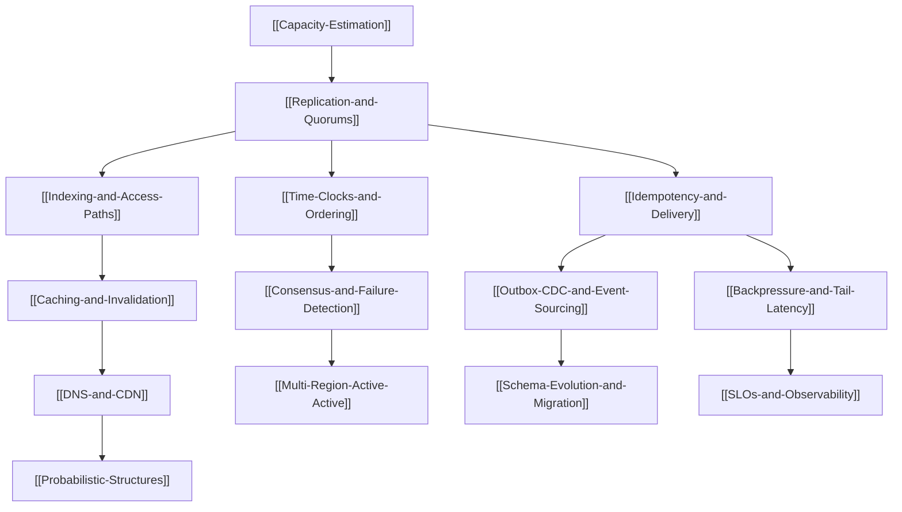

# System Design Concept and Technology Map

## Map of Content

Distributed systems engineering bridges abstract computer science theory with concrete infrastructure implementations.
This concept map diagrams how theoretical foundations (concurrency, consensus, partitioning, replication, CAP/PACELC) materialize directly into real-world storage engines, message brokers, caching tiers, and container orchestration platforms across this knowledge base.

```mermaid
graph TD
    subgraph TheoreticalFoundations["Distributed Systems Foundations"]
        CAP["[[CAP-Theorem-and-PACELC]]"]
        ACIDBASE["[[ACID-vs-BASE]]"]
        PartSharding["[[Partitioning-and-Sharding]]"]
        ConsHash["[[Consistent-Hashing]]"]
        Locking["[[Optimistic-vs-Pessimistic-Locking]]"]
        ConsistModel["[[Consistency-Models]]"]
        ConcurCAS["[[Concurrency-Synchronization-and-CAS]]"]
    end
    
    subgraph StorageImplementations["Data Storage Implementations"]
        MySQL["[[MySQL-and-InnoDB]] (ACID, Clustered B+ Tree, Undo MVCC)"]
        PG["[[PostgreSQL-Architecture]] (ACID, Append-only Heap, HOT)"]
        CRDB["[[CockroachDB-Distributed-SQL]] (CP, Multi-Raft, HLC, Range Splits)"]
        Cassandra["[[Apache-Cassandra]] (AP, Dynamo Ring, Murmur3, LSM SSTables)"]
        Mongo["[[MongoDB-and-Couchbase]] (Document B-Tree / vBucket DCP)"]
        Redis["[[Redis-Architecture]] (In-Memory, Event Loop, 16k Slots)"]
        Memcache["[[Memcached-Architecture]] (Slab Allocator, Client-Side Ketama)"]
        S3["[[Amazon-S3-and-Object-Storage]] (Flat Namespace, Erasure Coding)"]
        ZK["[[Apache-ZooKeeper]] (CP, In-Memory Tree, ZAB Broadcast)"]
    end
    
    CAP --> CRDB
    CAP --> Cassandra
    ACIDBASE --> MySQL
    ACIDBASE --> PG
    ConsHash --> Cassandra
    ConsHash --> Memcache
    ConsHash --> Redis
    PartSharding --> CRDB
    PartSharding --> Cassandra
    PartSharding --> S3
    Locking --> MySQL
    Locking --> Memcache
    ConsistModel --> CRDB
    ConsistModel --> Cassandra
    ConcurCAS --> Redis
    ConcurCAS --> ZK

    subgraph MessagingImplementations["Messaging & Streaming Systems"]
        Kafka["[[Apache-Kafka]] (Partitioned Commit Log, Zero-Copy sendfile)"]
        Rabbit["[[RabbitMQ]] (AMQP Smart Broker, Quorum Queues Raft)"]
        ZMQ["[[ZeroMQ]] (Brokerless Embedded Sockets, inproc/ipc/tcp)"]
    end
    
    PartSharding --> Kafka
    ConsistModel --> Kafka
    ConsistModel --> Rabbit

    subgraph InfrastructureImplementations["Infrastructure & Orchestration"]
        Docker["[[Docker-and-Container-Runtimes]] (Namespaces, cgroups v2, runc)"]
        K8s["[[Kubernetes-Architecture]] (kube-apiserver, etcd Raft, Controllers)"]
        Helm["[[Helm-Package-Manager]] (Client-side 3-Way Merge, OCI)"]
        Mesos["[[Apache-Mesos]] (Two-Level Scheduling, DRF Fair Sharing)"]
    end
    
    ConcurCAS --> K8s
    ZK --> Mesos
```

## Mapping Concepts to Real-World Technologies

### 1. Partitioning and Consistent Hashing
- Theory: [[Partitioning-and-Sharding]] and [[Consistent-Hashing]]
- Technologies:
  - **Dynamic Range Splitting**: [[CockroachDB-Distributed-SQL]] (64MB - 512MB ranges).
  - **Token Ring Hashing**: [[Apache-Cassandra]] (Murmur3Partitioner across $[-2^{63}, 2^{63}-1]$ with vnodes).
  - **Fixed Hash Slots**: [[Redis-Architecture]] (16,384 slots via CRC16).
  - **Fixed Virtual Buckets**: [[MongoDB-and-Couchbase]] (Couchbase 1,024 vBuckets via CRC32).
  - **Client-Side Continuum**: [[Memcached-Architecture]] (Ketama consistent hash ring).
  - **Automated Prefix Partitioning**: [[Amazon-S3-and-Object-Storage]] (3.5k writes / 5.5k reads per prefix).
  - **Partitioned Commit Log**: [[Apache-Kafka]] (Topic partition assignment and hash key routing).

### 2. Consistency Models and CAP/PACELC Trade-Offs
- Theory: [[CAP-Theorem-and-PACELC]] and [[Consistency-Models]]
- Technologies:
  - **CP (Consistency + Partition Tolerance)**:
    - [[CockroachDB-Distributed-SQL]] (Multi-Raft consensus, HLC serializability).
    - [[Apache-ZooKeeper]] (ZAB atomic broadcast, majority quorums).
    - [[Kubernetes-Architecture]] (`etcd` Raft key-value store).
  - **AP (Availability + Partition Tolerance)**:
    - [[Apache-Cassandra]] (Masterless ring, tunable quorums, Last-Write-Wins timestamps).
  - **Strong Read-After-Write Consistency**:
    - [[Amazon-S3-and-Object-Storage]] (Immediate visibility for PUT, LIST, and DELETE).
  - **Tunable Trade-offs**:
    - [[MongoDB-and-Couchbase]] (Write concerns `w: "majority"` vs `w: 1`; read concerns `majority` vs `local`).
    - [[Apache-Kafka]] (`acks=all` with `min.insync.replicas` vs `acks=1`).

### 3. Concurrency Control and Locking
- Theory: [[Optimistic-vs-Pessimistic-Locking]] and [[Concurrency-Synchronization-and-CAS]]
- Technologies:
  - **Row-Level & Gap Locking (Pessimistic)**: [[MySQL-and-InnoDB]] (Record, Gap, and Next-Key locking).
  - **Tuple Versioning (MVCC)**: [[PostgreSQL-Architecture]] (In-heap `xmin`/`xmax` tuple versioning) and [[MySQL-and-InnoDB]] (Undo log rollback segments).
  - **Compare-And-Swap (CAS)**:
    - [[Memcached-Architecture]] (64-bit CAS tokens).
    - [[Redis-Architecture]] (`WATCH` / `MULTI` / `EXEC` optimistic execution).
  - **Distributed Locking Recipes**:
    - [[Apache-ZooKeeper]] (Ephemeral sequential znodes with predecessor watching).
    - [[Redis-Architecture]] (Redlock algorithm analysis and fencing token requirements).
  - **ResourceVersion Optimistic Locking**:
    - [[Kubernetes-Architecture]] (`metadata.resourceVersion` backed by `etcd` 64-bit revisions).

### 4. Communication Paradigms and Messaging
- Theory: [[Synchronous-vs-Asynchronous-Communication]] and [[Pub-Sub-Architecture]]
- Technologies:
  - **Request-Reply RPC**: [[gRPC-and-Protocol-Buffers]] (HTTP/2 binary framing) and [[REST-APIs]].
  - **Query-Driven Graph Interfaces**: [[GraphQL]] (Resolvers, AST execution, DataLoader).
  - **Persistent Distributed Commit Logs**: [[Apache-Kafka]] (High-throughput zero-copy streaming).
  - **Smart Broker Task Queuing**: [[RabbitMQ]] (AMQP exchanges, Quorum Queues, Dead Letter Exchanges).
  - **Brokerless Low-Latency Sockets**: [[ZeroMQ]] (Inproc, IPC, TCP, ROUTER/DEALER topologies).

### 5. Compute, Virtualization, and Scheduling
- Theory: [[Virtual-Machines-vs-Containers]] and [[Vertical-vs-Horizontal-Scaling]]
- Technologies:
  - **Operating System Isolation**: [[Docker-and-Container-Runtimes]] (Linux Namespaces, cgroups v2, OverlayFS, OCI runc).
  - **Declarative Reconciliation Scheduling**: [[Kubernetes-Architecture]] (Control plane, kube-scheduler, kubelet).
  - **Two-Level Fair-Share Scheduling**: [[Apache-Mesos]] (Resource offers, Dominant Resource Fairness DRF).
  - **Distributed Package Delivery**: [[Helm-Package-Manager]] (Client-side rendering, 3-way strategic merge patch).
  - **In-Memory Distributed Batch & Stream Processing**: [[Apache-Spark]] (RDD lineage DAGs, Catalyst, Tungsten) and [[Hadoop-and-HDFS]] (MapReduce, YARN).

### 6. Real-World Case Studies (Composite Architectures)
How foundational theories and technology blocks combine into end-to-end architectures:
- **[[01-URL-Shortener/design|URL Shortener (TinyURL)]]**: Base62 encoding, KGS token leasing, Redis caching, HTTP 301/302 routing.
- **[[02-Rate-Limiter/design|Distributed Rate Limiter]]**: Sliding window counter, atomic Redis Lua scripts, edge/gateway enforcement.
- **[[03-Real-Time-Chat/design|Real-Time Chat (Discord/WhatsApp)]]**: Stateful WebSockets, Redis session registry, ScyllaDB/Cassandra message logging.
- **[[04-Distributed-ID-Generator/design|Distributed ID Generator (Snowflake)]]**: 64-bit time-ordered integers, monotonic clocks, ZooKeeper worker leasing.
- **[[05-Social-Media-Feed/design|Social Media Feed (Twitter/Instagram)]]**: Hybrid fan-out (Push/Pull), Redis ZSET timelines, cursor pagination, ML ranking.
- **[[06-Ride-Sharing-Service/design|Ride-Sharing Service (Uber/Lyft)]]**: Real-time GPS ingestion, Uber H3 hexagonal spatial indexing, batch bipartite dispatch.
- **[[07-Distributed-Web-Crawler/design|Distributed Web Crawler (Googlebot)]]**: Mercator URL Frontier, asynchronous DNS cache, Bloom filter seen check, SimHash.
- **[[08-Video-Streaming-Platform/design|Video Streaming (YouTube/Netflix)]]**: Resumable multipart upload, parallel DAG transcoding, Adaptive Bitrate (HLS/DASH), multi-tier CDN.
- **[[09-Ticket-Booking-System/design|Ticket Booking (Ticketmaster)]]**: Zero double-booking, 10-minute temporary seat hold leases via Redis Lua, Saga transactions.
- **[[10-E-Commerce-Flash-Sale/design|E-Commerce Flash Sale (Amazon/Alibaba)]]**: Zero overselling under 200k QPS, stock pre-warming, stock sharding, Kafka queue leveling.
- **[[11-Distributed-Key-Value-Store/design|Distributed Key-Value Store]]**: N/R/W, sloppy quorum, vector clocks, Merkle repair.
- **[[12-Typeahead-Search/design|Typeahead]]**: Precomputed prefix top-K, separate from the inverted index.
- **[[13-Notification-System/design|Notifications]]**: Outbox fan-out, per-device idempotency, inbox as the record.
- **[[14-Collaborative-Editor/design|Collaborative Document]]**: OT or CRDT, op log, presence off to the side.
- **[[15-Payment-Ledger/design|Payment Ledger]]**: Balanced postings, one writer per account, reconciler.
- **[[16-Metrics-Platform/design|Metrics]]**: Cardinality budget, histogram buckets, burn-rate reads.
- **[[17-File-Sync/design|File Sync]]**: Content-defined chunks, metadata compare-and-swap.
- **[[18-Distributed-Lock/design|Distributed Lock]]**: Lease, fencing token, consensus service.

## Staff Foundations

[[Distinguished-Design-Path]] is the reading order for this graph.
