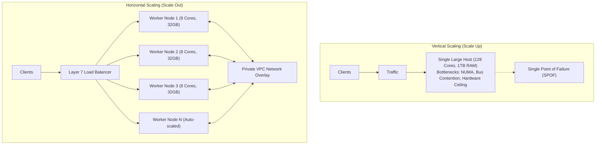
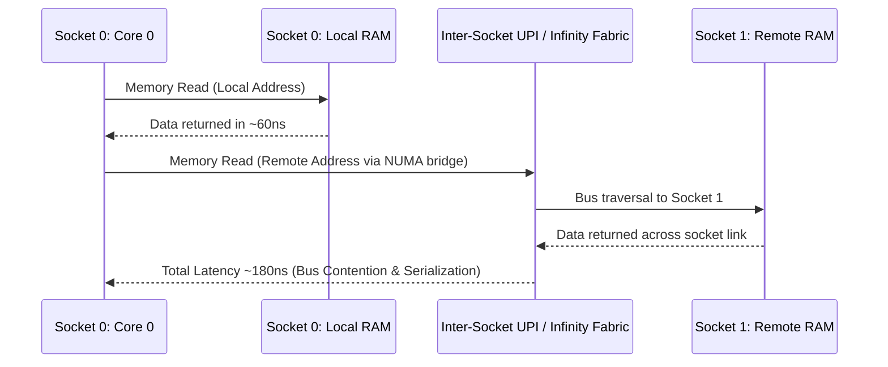
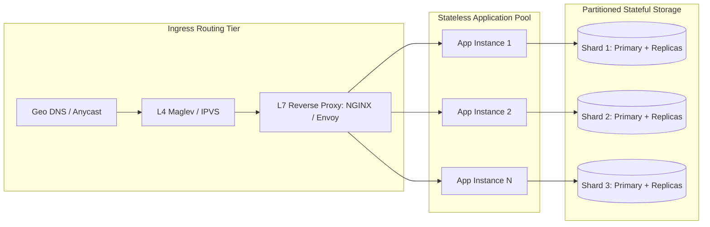

# Vertical vs Horizontal Scaling

## TL;DR
Vertical scaling (scaling up) increases the compute, memory, or storage capacity of a single machine.
Horizontal scaling (scaling out) distributes workloads across multiple independent commodity nodes connected over a local network.
Scaling up requires zero architectural code changes for concurrency beyond thread management, but encounters hard hardware ceilings and single-point-of-failure vulnerabilities.
Scaling out provides near-linear aggregate throughput and resilient redundancy, but shifts the architectural burden to distributed coordination, data partitioning, and network latency.
Modern production systems adopt a hybrid tiering model: scale-out for stateless application servers and partitioned data stores, paired with judicious vertical rightsizing of individual nodes to minimize distributed consensus overhead.

## Mental Model
Think of vertical scaling as replacing a delivery bicycle with a high-capacity cargo truck.
The truck carries exponentially more load without changing routes or dispatch logistics, but when the engine fails, the entire delivery route halts, and no truck can exceed highway clearance limits.
Think of horizontal scaling as dispatching a coordinated fleet of 100 delivery vans.
The fleet scales dynamically to handle city-wide surges, and single breakdowns cause negligible service disruption.
However, you now require sophisticated fleet management, automated routing protocols, and traffic collision avoidance.



## How It Works (Internals)

### Vertical Scaling Hardware Internals and Bottlenecks
Vertical scaling relies on SMP (Symmetric Multiprocessing) and NUMA (Non-Uniform Memory Access) architectures.
As CPU core counts grow beyond 16 to 32 cores on a single motherboard, memory bus contention degrades performance.
CPUs are partitioned into NUMA nodes, where each socket accesses local memory controllers with low latency (~50-80 ns) and remote socket memory over high-speed interconnects (Intel UPI or AMD Infinity Fabric) with higher latency (~120-250 ns).



Three physical laws govern vertical scaling boundaries:
1. **Amdahl's Law**: The speedup of a program utilizing multiple parallel processors is strictly bounded by the serial fraction $s$ of the program:
$$S(N) = \frac{1}{s + \frac{1 - s}{N}}$$
Even on a machine with 256 physical cores, if 5% of the codebase requires synchronized serialized access (such as mutexes or global WAL flush locks), the theoretical maximum system speedup cannot exceed 20x.
2. **Cache Coherency Storms**: MESI/MOESI cache invalidation protocols require CPU cores to broadcast invalidations over shared buses when modifying shared cache lines.
High core counts trigger bus saturation, where cores spend more cycles stalling on cache line snooping than executing instructions.
3. **Hardware Cost Nonlinearity**: Cloud providers and hardware vendors price enterprise-grade giant instances with super-linear cost curves.
A 128-core, 1TB RAM bare-metal server frequently costs 4x to 6x more per compute unit than sixteen 8-core, 64GB instances due to specialized motherboards, multi-socket interconnects, and enterprise thermal engineering.

### Horizontal Scaling Distributed Mechanics
Horizontal scaling splits work across autonomous processing nodes that share nothing (Shared-Nothing Architecture).
Nodes communicate exclusively through explicit network messaging over TCP/IP or RDMA.



Distributed scaling is formalized by Neil Gunther's **Universal Scalability Law (USL)**:
$$C(N) = \frac{N}{1 + \alpha(N - 1) + \beta N(N - 1)}$$
Where:
- $N$ is the number of concurrent nodes or worker threads.
- $\alpha$ is the concurrency contention parameter (serialization overhead, queuing for shared locks).
- $\beta$ is the crosstalk coherency penalty (point-to-point gossip, two-phase commit consensus, or state broadcast).

When $\beta > 0$, the system experiences a retrograde throughput curve: adding nodes beyond a critical threshold $N_{max} = \sqrt{\frac{1 - \alpha}{\beta}}$ actually decreases total aggregate throughput.
Stateless architectures strive for $\alpha \approx 0$ and $\beta \approx 0$ by pushing state entirely down to specialized distributed storage engines.

## Trade-offs and When to Use

| Architectural Attribute | Vertical Scaling (Scale Up) | Horizontal Scaling (Scale Out) |
| :--- | :--- | :--- |
| **System Complexity** | Low; single operating system image, standard IPC and local file descriptors | High; requires service discovery, load balancing, consensus, and RPC frameworks |
| **Hardware Boundary** | Hard ceiling bounded by commercial silicon capabilities | Arbitrarily high bound limited by network topology and coordination latency |
| **Failure Domain** | Single point of failure; motherboard or kernel panic halts entire system | Isolated blast radius; individual node failures are absorbed via failover |
| **Data Consistency** | Strict ACID guarantees trivial via local shared memory locks and OS page cache | Eventual consistency or expensive distributed consensus ([[CAP-Theorem-and-PACELC\|CAP/PACELC]]) |
| **Deployment Overhead** | In-place upgrades often mandate scheduled downtime or active-passive pairs | Rolling deployments, blue-green, and canary rollouts possible without downtime |
| **Network Overhead** | 0 ns network transit; sub-microsecond intra-process RAM and L3 cache access | 0.2 ms - 2.0 ms VPC network transit per hop; serialization and deserialization tax |
| **Cost Profile** | Linear initially, exponentially expensive at the extreme upper tier | Linear commodity hardware cost curve, but requires engineering infrastructure investment |

### Decision Framework
1. **Choose Vertical Scaling when:**
   - The dataset fits comfortably within the RAM footprint of an enterprise instance (e.g., < 2TB).
   - Relational joins across complex relational schemas are critical to business operations and cannot be naturally partitioned by a tenant key.
   - Engineering resources are constrained, and operational simplicity is prioritized over zero-downtime scaling ceilings.
   - The system is in early prototype or growth stages, where developer velocity outweighs multi-region durability.
2. **Choose Horizontal Scaling when:**
   - Transaction volume, write IOPS, or storage volume exceeds the physical limitations of single-node storage controllers.
   - High availability SLAs mandate 99.99% or higher uptime where single-node hardware maintenance cannot be tolerated.
   - Traffic patterns exhibit massive diurnal or seasonal swings requiring elastic dynamic autoscaling to avoid idle cloud spend.
   - Geographic distribution is necessary to satisfy low-latency regulatory or data residency requirements.

## Failure Modes and Pitfalls

### Vertical Scaling Failures
1. **The Capacity Cliff**:
   - *Failure*: An application grows until the largest commercially available cloud instance (e.g., AWS `u-24tb1.112xlarge` or GCP `m2-ultramem-416`) reaches 100% saturation.
   - *Mitigation*: Establish strict capacity monitoring triggers at 60% saturation to begin architectural partitioning months before hardware ceilings are struck.
2. **Catastrophic Hardware Downtime**:
   - *Failure*: Kernel panics, bit-rot memory ECC failures, or hypervisor hardware faults instantly drop all active user sessions.
   - *Mitigation*: Deploy warm standby replicas with automated heartbeat-based DNS or virtual IP failover (e.g., Pacemaker, Keepalived, AWS Multi-AZ RDS).

### Horizontal Scaling Failures
1. **The Retrograde Coherency Trap ($\beta$ Contention)**:
   - *Failure*: A cluster of 50 microservices communicates via full-mesh RPC or synchronous broadcast.
   - As new instances are added to absorb high load, total network message overhead grows as $O(N^2)$, causing widespread timeouts and system collapse.
   - *Mitigation*: Decouple nodes using partitioned asynchronous message brokers ([[Pub-Sub-Architecture\|Pub-Sub]]) and gossip protocols with logarithmic convergence limits.
2. **Cascading Retry Storms**:
   - *Failure*: One node experiences brief memory pressure and responds with latency spikes.
   - Upstream clients retry aggressively, propagating queue saturation across the entire fleet of horizontal workers.
   - *Mitigation*: Enforce exponential backoff with full jitter, strict request deadlines, and client-side circuit breakers.

## Hands-On

### 1. Inspecting NUMA Topology and Hardware Scaling Limits

On Linux:
```bash
# Check CPU cores, sockets, and NUMA node topology
lscpu | grep -E "Socket|Thread|NUMA|Model name"

# Inspect detailed memory latency and allocation per NUMA domain
numactl --hardware

# View real-time memory allocations across NUMA nodes
numastat -c
```

On macOS (Apple Silicon Unified Memory Architecture):
```bash
# View CPU topology (Performance vs Efficiency cores)
sysctl -a | grep -E "machdep.cpu.core_count|hw.perflevel"

# Profile memory bandwidth and power distribution
sudo powermetrics --samplers cpu_power,gpu_power -n 1 -i 1000
```

On Windows (PowerShell):
```powershell
# Get physical processor, core count, and logical processor distribution
Get-CimInstance Win32_Processor | Select-Object Name, NumberOfCores, NumberOfLogicalProcessors, SocketDesignation

# Query NUMA nodes via WMI
Get-CimInstance Win32_PerfFormattedData_PerfOS_NUMANodeMemory
```

### 2. Apple Silicon Compatible Docker Compose Lab
This lab demonstrates horizontal scaling of a stateless Python application fronted by an NGINX load balancer.

Save the following as `docker-compose.yml`:
```yaml
version: '3.8'

services:
  loadbalancer:
    image: nginx:alpine
    ports:
      - "8080:80"
    volumes:
      - ./nginx.conf:/etc/nginx/nginx.conf:ro
    depends_on:
      - app

  app:
    image: python:3.11-alpine
    command: >
      sh -c "pip install --no-cache-dir flask && python -c '
      import socket, os
      from flask import Flask
      app = Flask(__name__)
      hostname = socket.gethostname()
      @app.route(\"/work\")
      def work():
          return f\"Processed by worker container: {hostname}\n\"
      if __name__ == \"__main__\":
          app.run(host=\"0.0.0.0\", port=5000)
      '"
    deploy:
      replicas: 3
```

Create `nginx.conf`:
```nginx
events { worker_connections 1024; }

http {
    upstream backend_pool {
        server app:5000;
    }

    server {
        listen 80;
        location / {
            proxy_pass http://backend_pool;
            proxy_set_header Host $host;
            proxy_set_header X-Real-IP $remote_addr;
        }
    }
}
```

Run and scale dynamically:
```bash
# Start cluster with 3 backend replicas
docker compose up -d

# Verify traffic is balanced across distinct worker hostnames
for i in $(seq 1 6); do curl -s http://localhost:8080/work; done

# Horizontally scale the app service from 3 to 6 containers on demand
docker compose up -d --scale app=6

# Tear down lab
docker compose down
```

## Performance and Capacity
Consider an application processing 50,000 read queries per second (QPS) with an average payload size of 4 KB.
- Total network ingress/egress: $50,000 \times 4\text{ KB} = 200\text{ MB/sec} = 1.6\text{ Gbps}$.
- Single high-end vertical host network interface: 10 Gbps or 25 Gbps NIC can easily sustain 1.6 Gbps without saturation.
- CPU calculation: If each request requires 1.5 ms of single-threaded compute time, total core-seconds required per second is $50,000 \times 0.0015 = 75\text{ core-seconds/sec}$.
- Vertical approach: A single 96-core instance can sustain this load with ~78% utilization.
- Horizontal approach: Ten 8-core instances provide 80 cores total, sustaining the load at ~93% utilization while offering N+2 redundancy against node crashes.

## In Production
- **Stack Overflow**: Known for successfully relying on scale-up architecture for its primary relational database.
For years, the entire platform ran on a small cluster of extremely powerful Microsoft SQL Server enterprise machines equipped with multi-terabyte RAM and PCIe SSDs.
This eliminated distributed transaction complexity and maintained sub-millisecond query execution.
- **Google / Meta**: Pioneered extreme scale-out architecture.
Because search indexes and social graphs encompass exabytes of unstructured data, no physical server could ever store the index.
Systems like Google Web Search and Meta TAO split data across hundreds of thousands of low-cost commodity servers using custom RPC frameworks and consensus algorithms.

### Operational Checklist
- [ ] Measure application serialize ratio $s$ using load tests before purchasing upgraded single-node hardware.
- [ ] Ensure stateless services store zero local disk state outside of temporary scratch directories.
- [ ] Configure auto-scaling groups with cooldown intervals to avoid thrashing under fluctuating burst traffic.
- [ ] Monitor CPU Steal Time (`%st` in `top`) on virtualized horizontal instances to detect noisy neighbor contention.

## Interview Questions

> [!question]
> **Question 1 (Junior):** What is the core difference between vertical scaling and horizontal scaling?
> [!success]- Answer
> Vertical scaling adds more compute resources (CPU, RAM, disk) to an existing machine, whereas horizontal scaling adds more individual machines to the resource pool. Vertical scaling is simpler because the software architecture remains single-node, but horizontal scaling provides superior fault tolerance and avoids physical hardware capacity limits.

> [!question]
> **Question 2 (Mid-Level):** Explain how Amdahl's Law impacts the efficacy of vertical scaling on modern multi-core servers.
> [!success]- Answer
> Amdahl's Law states that the theoretical speedup of a parallel workload is bounded by the proportion of the task that must be executed sequentially ($s$). If 10% of a database transaction must be executed serially due to lock acquisition or WAL synchronization, no amount of vertical core additions can ever achieve more than a 10x speedup, leading to severe diminishing returns as instance sizes increase.

> [!question]
> **Question 3 (Mid-Level):** Why is horizontal scaling typically easier to implement for application servers than for database servers?
> [!success]- Answer
> Application servers can be designed to be completely stateless: each incoming HTTP request contains all required session tokens or state parameters, allowing any node in the fleet to handle any request interchangeably. Databases are stateful and must maintain ACID transactional guarantees, requiring complex distributed consensus, replication logs, data partitioning, and consistency synchronization when scaled across multiple nodes.

> [!question]
> **Question 4 (Senior):** What is Gunther's Universal Scalability Law (USL), and how does it explain systems that slow down when more nodes are added?
> [!success]- Answer
> USL models system throughput as a function of concurrency ($N$), serialization contention ($\alpha$), and crosstalk coherency delay ($\beta$). While Amdahl's law asymptotically approaches a plateau when $\beta = 0$, USL accounts for the $O(N^2)$ pairwise communication penalty incurred in distributed systems (such as cache coherence, distributed locking, or 2PC). When $\beta > 0$, the throughput curve reverses direction past an optimal concurrency point, causing total system throughput to degrade as more nodes join.

> [!question]
> **Question 5 (Senior):** You have a relational database suffering from read and write latency during peak traffic. How would you determine whether to scale vertically or horizontally?
> [!success]- Answer
> First, profile the bottleneck using metrics: determine if the system is bound by CPU, memory buffer hit ratio, disk IOPS, or lock contention. If the read-to-write ratio is heavily skewed toward reads (e.g., 90% reads), horizontal read replicas can alleviate pressure without sharding. If writes dominate and the current machine is under-provisioned (e.g., 8 cores, 32GB RAM), vertical scaling is the fastest, lowest-risk mitigation. If the database is already running on top-tier instances and IOPS or storage limits are exhausted, horizontal sharding by a tenant or entity key is mandatory.

> [!question]
> **Question 6 (Staff):** Describe the architectural challenges of migrating a vertically scaled monolith database to a horizontally sharded architecture.
> [!success]- Answer
> Key challenges include: (1) Choosing an optimal shard key to prevent hot-spotting; (2) Loss of cross-shard foreign keys and ACID transactions, which necessitates distributed sagas or two-phase commit; (3) Cross-shard joins become distributed scatter-gather queries that introduce massive network latency; (4) Dynamic re-sharding and data rebalancing during cluster growth without taking downtime; and (5) Distributed global unique ID generation (e.g., Snowflake IDs) since auto-incrementing primary keys no longer work.

> [!question]
> **Question 7 (Staff):** How does NUMA architecture affect performance on large vertically scaled database servers, and how can the operating system mitigate it?
> [!success]- Answer
> In multi-socket servers, accessing memory attached to a remote CPU socket incurs significant latency penalties compared to local memory. If a database process is scheduled on Socket 0 but its memory pages are allocated on Socket 1, execution stalls on interconnect bus hops. Mitigations include: pinning database worker threads to specific sockets and memory nodes using `numactl --interleave` or `numactl --cpunodebind`, tuning Linux kernel `vm.zone_reclaim_mode`, and structuring database engines to allocate thread-local buffer pools partitioned by NUMA domain.

> [!question]
> **Question 8 (Staff):** In a horizontally scaled microservice architecture, how do you prevent cascading failures when a sudden traffic surge overwhelms downstream nodes?
> [!success]- Answer
> Implement a defense-in-depth resilience strategy: (1) Adaptive rate limiting and load shedding at the API gateway tier using token bucket or concurrency-limiting algorithms; (2) Client-side circuit breakers that fast-fail when error rates cross a threshold, preventing retry queues from building up; (3) Exponential backoff with full jitter on all client retries; (4) Deadlines and cancellation propagation (e.g., gRPC contexts) so upstream dropped requests immediately abort downstream work; and (5) Horizontal Pod Autoscaling (HPA) driven by proactive metrics like queue depth rather than lagging metrics like CPU utilization.

## Related
- [[Partitioning-and-Sharding|Partitioning and Sharding]]: Methods for dividing stateful data across horizontally scaled nodes.
- [[Load-Balancing|Load Balancing]]: Traffic distribution mechanisms across horizontally scaled application pools.
- [[CAP-Theorem-and-PACELC|CAP Theorem and PACELC]]: Theoretical trade-offs in distributed horizontal architectures.
- [[P2L1-Processes-and-Process-Management|Processes and Process Management]]: Operating system process models and resource limits.

## Further Reading
- Abbott, Martin L., and Michael T. Fisher. *The Art of Scalability: Scalable Web Architecture, Processes, and Organizations for the Modern Enterprise*. Addison-Wesley.
- Gunther, Neil J. *Guerrilla Capacity Planning: A Tactical Approach to Planning for Highly Scalable Applications and Services*. Springer.
- Kleppmann, Martin. *Designing Data-Intensive Applications*. O'Reilly Media.
- Amdahl, Gene M. "Validity of the single processor approach to achieving large scale computing capabilities." *AFIPS Conference Proceedings*, 1967.
