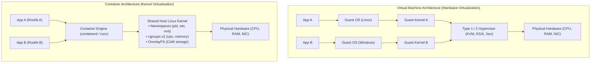
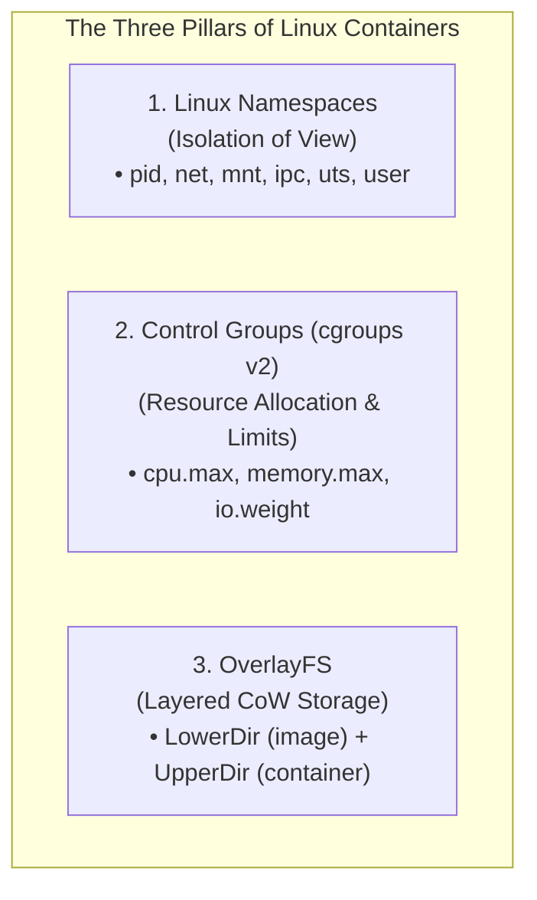
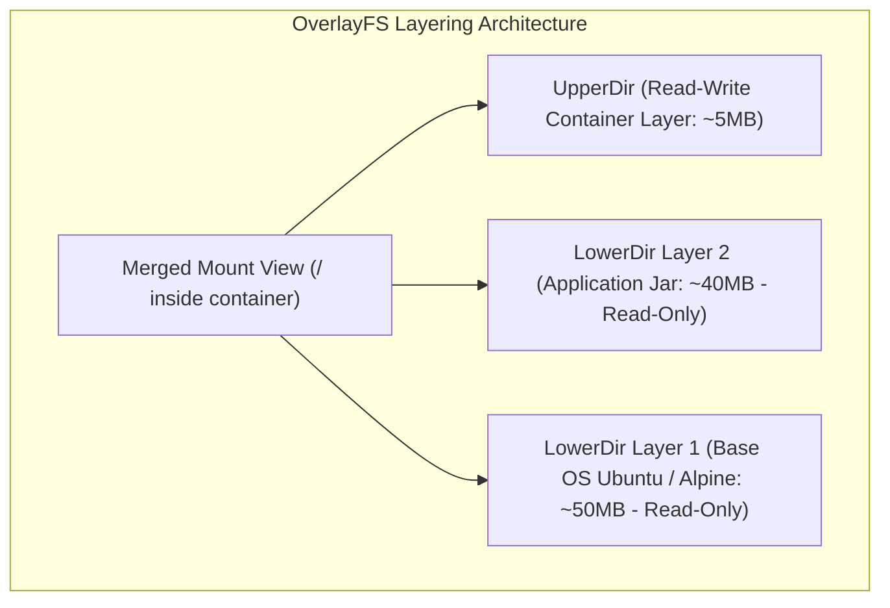

# Virtual Machines vs Containers

## TL;DR
Virtual Machines (VMs) and Containers represent two distinct paradigms for workload isolation and resource virtualization.
**Virtual Machines** virtualize physical hardware via a Hypervisor: each VM packages a complete guest operating system, independent kernel, virtual device drivers, and dedicated memory, providing absolute cryptographic and hardware-enforced isolation.
**Containers** virtualize the operating system kernel: all containers share the single underlying host OS kernel, leveraging three core Linux kernel primitives: **Namespaces** (isolating what a process can see), **Control Groups (cgroups)** (enforcing what a process can use), and **OverlayFS** (layering copy-on-write root filesystems).
Containers achieve sub-second cold starts and near-zero CPU/memory virtualization overhead, but share a common kernel vulnerability blast radius.
For academic hardware virtualization mechanisms and Popek-Goldberg proofs, see [[P3L6-Virtualization|GIOS Virtualization]].

## Mental Model
Think of a Virtual Machine as an independent detached single-family home in a suburban subdivision.
Each house has its own private plumbing pipes, independent electric generator, foundation, roof, and locked front door.
If one house catches fire or suffers a sewage flood, neighboring houses are completely unaffected.
However, building 100 detached homes consumes vast acreage, building materials, and maintenance resources.
Think of a Container as a rented studio apartment inside a shared high-rise residential building.
Every apartment has private drywall walls and a private lock (Namespaces), but all units share the same building water mains, electrical grid, elevator shafts, and foundation (The Shared Host Kernel).
The building landlord enforces strict quotas on heating and water usage per unit (Control Groups).
Building 100 apartments takes a fraction of the physical footprint and builds in minutes, but if the main building water pipe bursts, every tenant is affected.



## How It Works (Internals)

### 1. Virtual Machine Internals

#### A. Hypervisor Architectures
- **Type 1 (Bare-Metal)**: Executes directly on physical server hardware (e.g., VMware ESXi, KVM, Xen).
KVM turns the Linux kernel itself into a Type 1 hypervisor via kernel modules (`kvm.ko`).
- **Type 2 (Hosted)**: Executes as an application process inside a host operating system (e.g., VirtualBox, VMware Workstation).

#### B. Hardware-Assisted Virtualization
Modern hypervisors rely on silicon virtualization extensions (Intel VT-x, AMD-V, ARM EL2):
- **Ring Deprivileging & VMX Modes**: The physical CPU operates in two modes: VMX Root (where the hypervisor executes) and VMX Non-Root (where guest OS kernels execute).
- **Sensitive Instructions & VM-Exits**: When a guest OS attempts to execute a sensitive privileged instruction (e.g., modifying control registers or page tables), the CPU halts guest execution and triggers a **VM-Exit**, returning control to the hypervisor.
The hypervisor emulates the hardware effect and resumes the guest via `VMENTRY`.
- **Nested Page Tables (Intel EPT / AMD NPT)**: The hardware Memory Management Unit (MMU) performs two-dimensional page table translation:
$$\text{Guest Virtual Address (GVA)} \to \text{Guest Physical Address (GPA)} \to \text{Host Physical Address (HPA)}$$
This hardware translation eliminates the massive overhead of early software shadow page tables.

### 2. Container Internals: The Three Linux Kernel Pillars

Containers do not exist as physical or kernel objects in the Linux source code.
A "container" is simply a standard Linux user-space process configured with three specific kernel features:



#### Pillar 1: Linux Namespaces (Isolation of View)
Namespaces wrap global system resources in abstractions so that processes inside the namespace believe they possess their own dedicated instance:
1. **pid (Process ID)**: The container process believes it is PID 1 (init), with its own independent process hierarchy, while appearing as a normal PID (e.g., PID 8492) in the host's root namespace.
2. **net (Network)**: Dedicated virtual network stack: private network loopback (`lo`), virtual ethernet pair (`veth`), routing table, and `iptables` rules.
3. **mnt (Mount)**: Private filesystem mount points; isolates the root filesystem (`/`).
4. **ipc (Inter-Process Communication)**: Isolates System V IPC and POSIX message queues.
5. **uts (UNIX Timesharing System)**: Isolates the system hostname and domain name.
6. **user (User ID)**: Maps UID 0 (root) inside the container to a non-privileged unmapped UID (e.g., UID 10001) on the host, preventing host root escalation.
7. **cgroup**: Isolates visibility of the cgroup root directory.

#### Pillar 2: Control Groups (cgroups v2)
Control groups meter, limit, and prioritize physical hardware utilization across processes:
- **Memory (`memory.max`)**: Hard ceiling on RAM usage.
If a container attempts to allocate memory beyond its limit, the kernel OOM (Out-Of-Memory) killer invokes `kill -9` on the container's primary process.
- **CPU (`cpu.max`)**: CFS (Completely Fair Scheduler) quota enforcement.
Setting `cpu.max: 50000 100000` restricts the container to 50 ms of CPU compute time per 100 ms period (equivalent to 0.5 CPU cores).
- **I/O (`io.weight`, `io.max`)**: Bounds disk read/write bandwidth and IOPS to prevent I/O starvation.
- **pids (`pids.max`)**: Limits total forkable processes, neutralizing `fork` bomb denial-of-service attacks.

#### Pillar 3: OverlayFS (Layered Storage Engine)
Docker and OCI container images use Union Filesystems (OverlayFS):
- **LowerDir (Read-Only)**: The base container image layers stacked on top of each other.
- **UpperDir (Read-Write)**: A thin, ephemeral writable layer allocated when the container boots.
- **MergedDir (Unified View)**: The unified mount path visible to container processes.
- **Copy-on-Write (CoW)**: When a container reads a file, it reads directly from LowerDir.
When it modifies a file, OverlayFS copies the file from LowerDir to UpperDir before modifying it, preserving the immutable base image.



### 3. Modern MicroVMs: The Hybrid Paradigm
Modern cloud infrastructure (such as AWS Lambda, AWS Fargate, and Fly.io) deploys **MicroVMs** (using **AWS Firecracker**):
- Strips legacy PC device emulations (no floppy drives, no IDE controllers, no BIOS).
- Boots directly using a minimalist Linux kernel in under $5\text{ ms}$.
- Combines the security boundary of hardware virtualization with the rapid cold-start speed and density of containers.

## Trade-offs and When to Use

| Architectural Property | Virtual Machines (VMs) | Containers (OCI / Docker) | MicroVMs (AWS Firecracker) |
| :--- | :--- | :--- | :--- |
| **Isolation Barrier** | Strong; hardware-enforced silicon boundary | Weak/Medium; shared kernel system call interface | Strong; minimalist hardware virtualization |
| **Startup Latency** | Slow ($30\text{ - }90\text{ seconds}$) | Near-instant ($< 200\text{ ms}$) | Ultra-fast ($5\text{ - }50\text{ ms}$) |
| **Memory Footprint** | Heavy ($1\text{ - }4\text{ GB}$ minimum for OS image) | Lightweight ($10\text{ - }50\text{ MB}$ overhead) | Lightweight ($5\text{ MB}$ overhead) |
| **Kernel Flexibility** | Heterogeneous (Run Windows on Linux host) | Homogeneous (Host kernel governs all containers) | Homogeneous Linux guest kernels |
| **I/O Performance** | Virtualized drivers with slight tax ($2\text{ - }5\%$) | Native bare-metal kernel performance ($< 0.5\%$) | Near bare-metal virtio performance |
| **Density (per Host)** | Tens of VMs | Thousands of containers | Hundreds to thousands of MicroVMs |

### Decision Framework
1. **Choose Virtual Machines when:**
   - Workloads run untrusted multi-tenant customer code (e.g., executing arbitrary user-submitted Python/C++ scripts).
   - Compliance or regulatory standards require dedicated cryptographic hardware isolation.
   - You must run heterogeneous guest operating systems (e.g., Windows legacy services on Linux cloud servers).
2. **Choose Containers when:**
   - Deploying microservices in modern CI/CD pipelines requiring rapid auto-scaling and high density.
   - Packaging application code with all user-space dependencies for reproducible environments across macOS, Windows, and Linux.
   - Running distributed big data workers (Spark, Kubernetes pods) where fast cold-starts are essential.

## Failure Modes and Pitfalls

### 1. Shared Kernel Panic Blast Radius
- *Failure*: An unprivileged container executes a flawed system call that triggers a null-pointer dereference inside a host kernel driver.
The host Linux kernel panics and halts immediately.
All 500 containers running on that physical server crash simultaneously.
- *Mitigation*: Restrict system calls using **seccomp profiles** (blocking dangerous syscalls like `ptrace` and `sys_chroot`), apply Linux Security Modules (AppArmor / SELinux), or run untrusted workloads inside MicroVMs (Firecracker or gVisor).

### 2. The Noisy Neighbor Problem (Unconstrained Memory / CPU)
- *Failure*: A container is launched without explicit cgroup memory limits.
Due to a memory leak, the container consumes 60 GB of RAM.
The Linux kernel OOM killer wakes up and kills the most memory-intensive process on the machine - which happens to be the primary database running in a neighboring container!
- *Mitigation*: Always configure explicit requests and limits for both CPU and memory in container orchestration manifests (e.g., Kubernetes `resources.limits.memory`).

### 3. Container Root Escalation (Privileged Mode Danger)
- *Failure*: A developer launches a container using `docker run --privileged`.
This flag disables all namespace security protections and grants full host device access.
An attacker compromising the container application executes an exploit to escape the container rootfs and gains complete root access to the physical host.
- *Mitigation*: Strictly forbid the `--privileged` flag in production; drop unnecessary Linux capabilities (`--cap-drop=ALL --cap-add=NET_BIND_SERVICE`) and enforce rootless container runtimes.

## Hands-On

### 1. Building a Container from Scratch Using Linux Kernel Primitives
On a Linux host, run these raw shell commands to build and run an isolated container without Docker:

```bash
#!/usr/bin/env bash
# Requires Linux with root privileges

# 1. Create a minimal rootfs folder
mkdir -p /tmp/my_container/rootfs
cd /tmp/my_container/rootfs

# 2. Extract a minimal Alpine Linux root filesystem
curl -sL http://dl-cdn.alpinelinux.org/alpine/v3.18/releases/x86_64/alpine-minirootfs-3.18.0-x86_64.tar.gz | tar -xz

# 3. Create a cgroups v2 resource restriction directory
sudo mkdir -p /sys/fs/cgroup/sandbox_container
# Limit container to 50MB RAM and 20% of 1 CPU core
echo "52428800" | sudo tee /sys/fs/cgroup/sandbox_container/memory.max
echo "20000 100000" | sudo tee /sys/fs/cgroup/sandbox_container/cpu.max

# 4. Launch the process with isolated Namespaces (PID, Mount, UTS, IPC, Network)
# Attach process to the cgroup and chroot into the isolated rootfs
sudo cgexec -g cpu,memory:sandbox_container \
  unshare --pid --uts --ipc --mount --fork \
  chroot /tmp/my_container/rootfs /bin/sh -c "
    mount -t proc proc /proc
    hostname container-sandbox
    echo 'Successfully running inside an isolated Linux container!'
    echo 'Process list inside container:'
    ps aux
    echo 'Host hostname is completely hidden: hostname is ' \$(hostname)
    umount /proc
  "

# Cleanup cgroup directory
sudo rmdir /sys/fs/cgroup/sandbox_container
```

### 2. Inspecting Container cgroups v2 on Modern Linux
```bash
# View active cgroups v2 hierarchy
mount | grep cgroup2

# Inspect memory usage of a running container via cgroup interface
cat /sys/fs/cgroup/system.slice/docker-<CONTAINER_ID>.scope/memory.current

# View CPU throttle statistics
cat /sys/fs/cgroup/system.slice/docker-<CONTAINER_ID>.scope/cpu.stat
```

## Performance and Capacity
- **Cold Start Latency**:
  - Full Virtual Machine (AWS EC2 m5.large): $30\text{ - }60\text{ seconds}$ (BIOS initialization, kernel boot, systemd daemon loading).
  - AWS Firecracker MicroVM: $\approx 5\text{ ms}$ kernel boot time.
  - OCI Container (Docker / containerd): $\approx 50\text{ - }150\text{ ms}$ (process `fork`, namespace unshare, OverlayFS mount).
- **Memory Overhead**:
  - A blank Linux VM requires $512\text{ MB} \dots 1\text{ GB}$ of RAM solely to sustain the guest OS kernel and background daemons before application code executes.
  - A container incurs $< 500\text{ KB}$ of kernel struct memory overhead, allowing a physical server with 64 GB RAM to host 1,000+ active containers versus 20-30 VMs.

## In Production
- **AWS Firecracker**: Developed by Amazon Web Services to power AWS Lambda and AWS Fargate.
Firecracker is written in Rust, provides extreme minimalist device emulation via KVM, and executes untrusted multi-tenant customer functions with full hardware isolation at container-level cold-start speeds.
- **Google Cloud Platform (Borg)**: Google has run 100% of its production applications (Search, Gmail, YouTube) in containers since 2004.
Google contributed Linux cgroups to the mainline Linux kernel in 2007 to provide the resource accounting necessary to co-locate latency-critical search queries with background batch jobs on shared physical servers.

### Operational Checklist
- [ ] For container security, mandate `readOnlyRootFilesystem: true` in Kubernetes pod security contexts.
- [ ] Enforce non-root execution inside container images (`USER 10001`).
- [ ] Configure both `requests` and `limits` in container definitions to give the scheduler predictable placement guidance.

## Interview Questions

> [!question]
> **Question 1 (Junior):** What is the fundamental architectural difference between a Virtual Machine and a Container?
> [!success]- Answer
> A Virtual Machine virtualizes physical hardware through a hypervisor, running a complete guest operating system with its own independent kernel on virtualized devices. A Container virtualizes the operating system, running as an isolated user-space process sharing the host operating system's single kernel via Linux Namespaces and Control Groups (cgroups).

> [!question]
> **Question 2 (Mid-Level):** Explain the three core Linux kernel features that make containers possible.
> [!success]- Answer
> (1) **Namespaces**: Provide isolation of view, giving the process private virtual instances of system resources (e.g., `pid` isolates process IDs, `net` isolates network interfaces, `mnt` isolates filesystems). (2) **Control Groups (cgroups)**: Enforce resource metering and limits, capping CPU shares, memory usage, disk IOPS, and process counts to prevent resource starvation. (3) **OverlayFS (Union Filesystem)**: Merges multiple immutable read-only image layers (`LowerDir`) with a single thin read-write container layer (`UpperDir`) using Copy-on-Write semantics.

> [!question]
> **Question 3 (Mid-Level):** Why are containers generally considered less secure than virtual machines in multi-tenant environments?
> [!success]- Answer
> Because all containers share the single host operating system kernel. If a containerized application exploits a zero-day vulnerability in a Linux kernel system call or driver, the attacker can cause a host kernel panic or escape to the host root context, compromising every other container running on that physical machine. In contrast, virtual machines are separated by hardware-assisted silicon boundaries (Intel VT-x / AMD-V), requiring an attacker to break out of hypervisor hardware emulation to breach isolation.

> [!question]
> **Question 4 (Senior):** What is the difference between cgroups v1 and cgroups v2, and why was the unified hierarchy necessary?
> [!success]- Answer
> In cgroups v1, each resource controller (cpu, memory, blkio) operated in an independent, disjoint hierarchy. This caused severe design flaws: for example, page cache writeback could not be correctly throttled because buffered I/O accounted to the memory controller could not coordinate with the `blkio` controller. cgroups v2 introduced a single **Unified Hierarchy** where processes belong to a single tree where all resource controllers (cpu, memory, io, pids) coordinate together, enabling accurate writeback tracking, OOM kill groupings, and eliminating resource leaks.

> [!question]
> **Question 5 (Senior):** What is an OCI Runtime, and how do `containerd` and `runc` interact when starting a container?
> [!success]- Answer
> The Open Container Initiative (OCI) defines standard specifications for container formats and runtimes. `containerd` is a high-level container management daemon that manages container lifecycles, pulls images from registries, unpacks OverlayFS layers, and supervises networking. When instructed to start a container, `containerd` invokes `runc`, a low-level OCI reference runtime. `runc` executes the low-level Linux system calls (`clone`, `unshare`, `setns`, `chroot`), configures cgroups and namespaces, starts the container entrypoint process, and immediately exits, leaving a lightweight `containerd-shim` to monitor the running container.

> [!question]
> **Question 6 (Staff):** What are MicroVMs (e.g., AWS Firecracker), and what architectural dilemma did they resolve for serverless platforms?
> [!success]- Answer
> Serverless platforms (like AWS Lambda) faced a dilemma: traditional VMs provided safe multi-tenant security but suffered unacceptable cold starts ($10-30\text{ seconds}$) and high memory overhead; containers provided sub-second cold starts but unsafe shared-kernel security for multi-tenant customer code. MicroVMs resolved this by building a hypervisor stripped of all legacy PC hardware emulations (no PCI buses, ACPI, or IDE). Running directly on KVM with virtio devices, Firecracker launches a fully isolated, secure hardware-virtualized guest kernel in under $5\text{ milliseconds}$ with only $5\text{ MB}$ of memory overhead, achieving both VM security and container agility.

> [!question]
> **Question 7 (Staff):** How does gVisor provide sandboxed container execution, and what is its performance trade-off compared to native runc?
> [!success]- Answer
> gVisor (developed by Google) replaces the direct Linux system call interface with **Sentry**, a user-space application kernel written in memory-safe Go that implements the Linux system call interface. When a container executes a syscall, it traps into Sentry rather than the host Linux kernel. Sentry validates and handles the call in user space, issuing only a tiny, safe subset of syscalls to the real host kernel. Trade-off: gVisor provides near-VM security without hardware hypervisors, but intercepting and emulating every system call introduces significant CPU latency penalties for syscall-heavy workloads (e.g., high-frequency socket I/O or disk operations).

> [!question]
> **Question 8 (Staff):** How would you design a multi-tenant Kubernetes platform that allows developers to run untrusted third-party code while protecting cluster nodes?
> [!success]- Answer
> Implement a defense-in-depth isolation architecture: (1) Use **RuntimeClass** to configure pod sandboxing: route untrusted pods to sandboxed runtimes like Kata Containers (QEMU/Firecracker MicroVMs) or gVisor (`runsc`), keeping trusted internal services on native `runc`. (2) Enforce **Kubernetes NetworkPolicies** with default-deny ingress and egress, preventing compromised pods from scanning internal cluster VPCs or cloud metadata APIs (`169.254.169.254`). (3) Restrict node placement using dedicated worker node pools tainted with node taints, ensuring untrusted pods never share physical silicon with internal database or payment pods. (4) Enforce Pod Security Standards (PSS) at the `Restricted` profile, forbidding root users, host mounts, and privilege escalation.

## Related
- [[Docker-and-Container-Runtimes|Docker and Container Runtimes]]: Deep dive into image builds, containerd, and runc.
- [[Kubernetes-Architecture|Kubernetes Architecture]]: Orchestration of containers across multi-node clusters.
- [[P3L6-Virtualization|GIOS Virtualization]]: Graduate OS fundamentals of hypervisors and hardware virtualization.

## Further Reading
- Arpaci-Dusseau, Remzi H., and Andrea C. Arpaci-Dusseau. "Operating Systems: Three Easy Pieces." *Arpaci-Dusseau Books* (2018).
- Agache, Alexandru, et al. "Firecracker: Lightweight virtualization for serverless applications." *17th USENIX Symposium on Networked Systems Design and Implementation (NSDI 20)*. 2020.
- Rice, Liz. *Container Security: Fundamental Technology Concepts that Protect Containerized Applications*. O'Reilly Media, 2020.
- Poulton, Nigel. *Docker Deep Dive*. Independently published, 2020.
