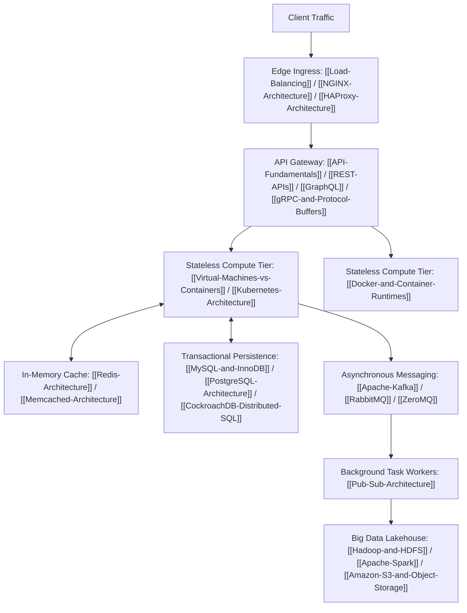

# System Design Fundamentals and Architecture Cheatsheet

## Overview

System design is the process of defining the architecture, components, modules, interfaces, and data for a system to satisfy specified operational and functional requirements.
This high-level hub provides an executive overview and rapid reference for core system design patterns, linking directly to deep architectural guides across the knowledge base.

## Core Architectural Primitives

### 1. Scaling Paradigms
- **Vertical Scaling (Scale-Up)**: Expanding processing power by adding CPU, RAM, or NVMe storage to a single physical server.
  - *Deep Dive*: [[Vertical-vs-Horizontal-Scaling]] (Amdahl's Law, Universal Scalability Law).
- **Horizontal Scaling (Scale-Out)**: Distributing compute and storage across a fleet of commodity machines behind load balancers.
  - *Deep Dive*: [[Partitioning-and-Sharding]], [[Consistent-Hashing]].

### 2. Traffic Routing and Load Distribution
- **Layer 4 vs Layer 7 Routing**: Direct transport-layer packet forwarding versus application-layer HTTP header, cookie, and path-based inspection.
  - *Deep Dive*: [[Load-Balancing]], [[HAProxy-Architecture]], [[NGINX-Architecture]].
- **Consistent Hashing**: Minimizing key remapping during cluster additions and removals using virtual node hash rings.
  - *Deep Dive*: [[Consistent-Hashing]].

### 3. Consistency, Transactions, and Consensus
- **CAP Theorem and PACELC**: Choosing between Consistency ($C$) and Availability ($A$) under Network Partitions ($P$), and balancing Latency ($L$) versus Consistency ($C$) under normal operation ($E$).
  - *Deep Dive*: [[CAP-Theorem-and-PACELC]], [[Consistency-Models]].
- **ACID vs BASE**: Strict relational ACID transactional guarantees versus distributed BASE (Basically Available, Soft-state, Eventual consistency) models.
  - *Deep Dive*: [[ACID-vs-BASE]], [[RDBMS-vs-NoSQL]].
- **Concurrency Control**: Managing race conditions through Multi-Version Concurrency Control (MVCC), pessimistic locking (2PL), and optimistic locking (CAS).
  - *Deep Dive*: [[Optimistic-vs-Pessimistic-Locking]], [[Concurrency-Synchronization-and-CAS]].

### 4. Communication and Messaging
- **Synchronous vs Asynchronous**: Tight temporal coupling (RPC, REST) versus loose message-driven decoupling.
  - *Deep Dive*: [[Synchronous-vs-Asynchronous-Communication]], [[Pub-Sub-Architecture]].
- **API Paradigms**: REST, GraphQL, and gRPC with Protocol Buffers.
  - *Deep Dive*: [[API-Fundamentals]], [[REST-APIs]], [[GraphQL]], [[gRPC-and-Protocol-Buffers]], [[HTTP-Evolution-HTTP1-HTTP2-HTTP3]].
- **Message Brokers and Streaming**: Distributed append-only commit logs versus smart-broker AMQP queues.
  - *Deep Dive*: [[Apache-Kafka]], [[RabbitMQ]], [[ZeroMQ]].

### 5. Data Persistence and Caching
- **Relational and NewSQL**: [[MySQL-and-InnoDB]], [[PostgreSQL-Architecture]], [[CockroachDB-Distributed-SQL]].
- **NoSQL and Document Stores**: [[Apache-Cassandra]], [[MongoDB-and-Couchbase]].
- **In-Memory Caching**: [[Redis-Architecture]], [[Memcached-Architecture]].
- **Search Engines**: [[Elasticsearch-and-Apache-Solr]].
- **Object Storage**: [[Amazon-S3-and-Object-Storage]].
- **Distributed Coordination**: [[Apache-ZooKeeper]].

### 6. Containerization, Orchestration, and Big Data
- **Container Isolation**: [[Docker-and-Container-Runtimes]] (Linux namespaces, cgroups v2, OverlayFS).
- **Cluster Orchestration**: [[Kubernetes-Architecture]], [[Helm-Package-Manager]], [[Apache-Mesos]].
- **Big Data Analytics**: [[Hadoop-and-HDFS]], [[Apache-Spark]], [[MapReduce-Architecture]].

## System Design Framework and Strategy

### The 4-Step Interview Framework
1. **Scope the Problem (Requirements Clarification - 5 mins)**:
   - Functional requirements (user actions, core APIs).
   - Non-functional requirements (throughput QPS, read-to-write ratio, latency SLA, durability, data retention).
   - Capacity estimation (DAU, bandwidth ingress/egress, storage footprint).
2. **High-Level Architectural Design (10-15 mins)**:
   - Draw end-to-end data flow: Client -> Load Balancer -> API Gateway -> Application Microservices -> Cache -> Database.
   - Define database schema and primary keys early.
3. **Deep Dive on Core Components (15-20 mins)**:
   - Identify system bottlenecks: database scaling (sharding keys, replication lag), caching invalidation strategies, network protocol trade-offs.
   - Walk through failure modes: split-brain scenarios, thundering herds, and circuit breakers.
4. **Wrap-up and Operational Rigor (5 mins)**:
   - Observability (Distributed tracing, Prometheus metrics, structured logging).
   - Security boundaries (TLS termination, mTLS, OAuth2/OIDC, rate limiting).
   - Bottlenecks and future scaling inflection points.

## Master Reference Links

- [[System-Design-Concept-Map]] - Visual Mermaid relationship map connecting concepts to concrete tools.
- [[Technology-Comparison-Matrix]] - Master reference matrix comparing 20 primary technologies across consistency, partitioning, and storage models.
- [[04-System-Design/00-Concepts/README]] - Foundational concepts directory.
- [[04-System-Design/04-APIs-and-Protocols/README]] - Communication protocols directory.
- [[04-System-Design/05-Data-Stores/README]] - Storage systems directory.
- [[04-System-Design/06-Messaging-and-Streaming/README]] - Event streaming and message broker directory.
- [[04-System-Design/07-Infrastructure-and-Orchestration/README]] - Container runtimes and orchestration directory.
- [[04-System-Design/08-Big-Data/README]] - Large-scale distributed analytics directory.
