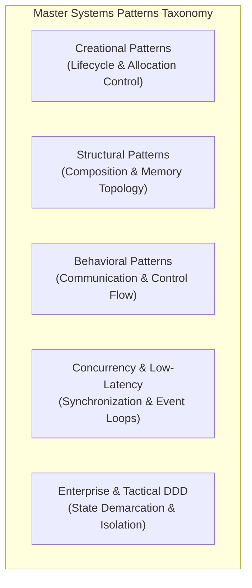
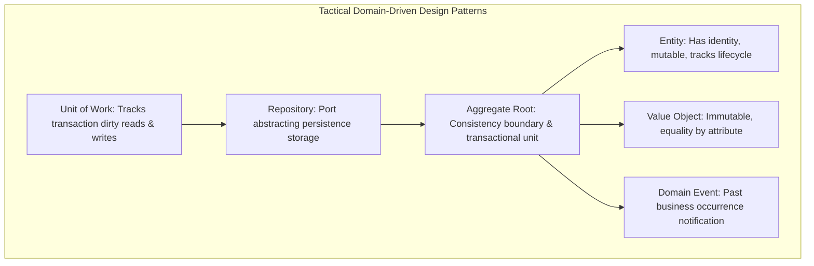

# Design Patterns Master Catalog: Staff-Plus Systems Reference

## 1. Overview and Systems Perspective

Design patterns are documented architectural micro-structures that resolve recurring software design tensions.
At the Staff and Distinguished level, patterns are not academic templates to be applied indiscriminately.
Every pattern imposes concrete trade-offs: heap allocations, cache locality degradation, pointer chasing, vtable indirection, and cognitive complexity.
Applying a pattern prematurely is as harmful as failing to introduce one when structural rigidity demands it.

This catalog establishes a systems-first taxonomy covering:
1. The 23 Gang of Four (GoF) Patterns (Creational, Structural, Behavioral).
2. Critical Concurrency & Systems Patterns (Active Object, Disruptor, Reactor, Work-Stealing).
3. Enterprise Architectural Patterns (Repository, Unit of Work, Circuit Breaker, CQRS).



---

## 2. Creational Patterns (Object Lifecycle and Allocation Management)

| Pattern | Architectural Intent | Systems / Memory Trade-offs | Anti-Pattern Warning | Modern Language Alternatives |
| :--- | :--- | :--- | :--- | :--- |
| **Factory Method** | Delegate instantiation to subclasses or polymorphic callables. | Virtual dispatch penalty during instantiation; adds class hierarchy depth. | Creating single-subclass factories that add indirection without polymorphism. | Python first-class callables; C++ template specialization. |
| **Abstract Factory** | Create families of related or dependent objects without specifying concrete classes. | Two-level indirection; requires coordinated updates across entire factory family. | Rigid factory interfaces when product families frequently add new product types. | Dependency Injection modules; C++ compile-time traits factories. |
| **Builder** | Construct complex objects step-by-step; enforce immutability upon construction. | Temporary builder object allocation; memory overhead during fluent chaining. | Writing builders for simple DTOs with 2-3 fields (bloat). | Python keyword arguments with defaults; Rust builder with move semantics. |
| **Prototype** | Clone existing objects to avoid expensive initialization or constructor logic. | Requires deep-copy semantics; object graph circular references risk infinite loops. | Cloning complex objects that hold external network or database handles. | Copy-on-write (`std::shared_ptr` / COW structures); serialization cloning. |
| **Singleton** | Ensure a class has only one instance and provide a global point of access. | Global mutable state; concurrency bottleneck; creates severe testing coupling. | Using Singleton to hide global mutable variables or bypass DI. | Dependency Injection singleton scope; C++ Meyers thread-safe static. |
| **Object Pool** | Reuse expensive-to-create objects (such as database connections or threads). | Contention on pool lock; risk of leaking dirty state or corrupted resources across clients. | Pooling lightweight memory objects in modern garbage-collected runtimes (churn). | Channel-based resource tokens (Go); HikariCP connection pools (Java). |

---

## 3. Structural Patterns (Object Composition and Memory Topology)

| Pattern | Architectural Intent | Systems / Memory Trade-offs | Anti-Pattern Warning | Modern Language Alternatives |
| :--- | :--- | :--- | :--- | :--- |
| **Adapter** | Convert the interface of an existing class into another interface clients expect. | Extra indirection wrapper object; minor call dispatch overhead. | Nesting adapters inside adapters (wrapping spaghetti). | Go structural interface satisfaction; Rust `From` / `Into` traits. |
| **Bridge** | Decouple an abstraction from its implementation so both can vary independently. | Multiple pointer dereferences; cache line splits between abstraction and implementation. | Using bridge when implementation variants are static and known at compile time. | C++ PIMPL (Pointer to Implementation) idiom; policy-based class templates. |
| **Composite** | Compose objects into tree structures to represent part-whole hierarchies uniformly. | Pointer chasing across tree nodes; destroys CPU cache prefetching. | Forcing leaf nodes to implement nonsensical container operations (like `add()`). | Recursive algebraic data types; visitor-traversed data structures. |
| **Decorator** | Attach additional responsibilities to an object dynamically without subclassing. | Chain of pointers; stack trace explosion; difficult object identity (`this`) equality. | Stacking dozens of decorators causing unbounded call-stack frames. | Python `@decorator` syntax; functional composition pipelines. |
| **Facade** | Provide a unified, high-level interface to a complex subsystem of classes. | Can become an unmaintainable God-class facade if responsibilities leak. | Bypassing facade to touch subsystems directly, defeating the abstraction. | API Gateway; module root export packages. |
| **Flyweight** | Support large numbers of fine-grained objects by sharing common intrinsic state. | Intrinsic vs extrinsic state separation overhead; computational cost to reconstruct state. | Creating flyweights for mutable data or when object counts do not exceed memory limits. | String interning tables; ECS (Entity-Component-System) DOD layouts. |
| **Proxy** | Provide a surrogate or placeholder for another object to control access to it. | Latency overhead; virtual dispatch; hidden remote network calls posing as local. | Virtual proxies masking synchronous blocking disk/network I/O as transparent calls. | Smart pointers (`std::shared_ptr`); dynamic bytecode proxies (CGLIB/ByteBuddy). |

---

## 4. Behavioral Patterns (Communication and Control Flow)

| Pattern | Architectural Intent | Systems / Memory Trade-offs | Anti-Pattern Warning | Modern Language Alternatives |
| :--- | :--- | :--- | :--- | :--- |
| **Chain of Responsibility** | Pass requests along a chain of handlers until one handles it. | Unbounded latency; request can fall off the end unhandled; stack depth. | Hardcoding rigid handler chains that cannot be reconfigured or monitored. | HTTP middleware pipelines (Express/Koa/Go chi); interceptor chains. |
| **Command** | Encapsulate a request as an object, enabling parameterization, queues, and undo. | Heap allocation per command instance; memory bloat in long undo/redo histories. | Wrapping trivial method calls as commands when queues or undo are not needed. | First-class closures / lambdas; CQRS command envelopes. |
| **Iterator** | Provide a way to access elements of an aggregate object sequentially without exposure. | Extra iterator allocation; invalidation hazards if underlying collection mutates. | Writing custom iterators instead of standard language iterator protocols. | Python `yield` generators; C++20 ranges; Rust `Iterator` trait. |
| **Mediator** | Define an object that encapsulates how a set of objects interact to prevent direct mesh coupling. | Mediator easily degenerates into an unmaintainable centralized God class. | Routing every trivial call through mediator, destroying modular locality. | Event bus / Pub-Sub brokers; UI controllers. |
| **Memento** | Capture and externalize an object's internal state without violating encapsulation. | Memory explosion when capturing full state snapshots; copy overhead. | Storing uncompressed, deep mementos on every minor state change. | Copy-on-Write snapshots; Git-style content-addressed state trees. |
| **Observer** | Define a one-to-many dependency so that state changes notify all dependents automatically. | "Lapsed Listener" memory leaks; nondeterministic notification order; cascading storms. | Synchronous observers performing heavy blocking I/O on the publisher's thread. | Reactive Streams (RxJava, Project Reactor); Async Channels (Go). |
| **State** | Allow an object to alter its behavior when its internal state changes via polymorphic classes. | Heap allocation per state transition; proliferation of small state classes. | Using State pattern for binary boolean states (`flag == true`). | State machine tables; Rust enum matching with transitions. |
| **Strategy** | Define a family of algorithms, encapsulate each one, and make them interchangeable. | Additional object allocation; pointer dereference per invocation. | Creating single-implementation strategies that will never vary. | First-class function arguments / lambdas; C++ policy templates. |
| **Template Method** | Define the skeleton of an algorithm in an operation, deferring steps to subclasses. | Inversion of control ("Hollywood Principle"); subclass tightly coupled to superclass steps. | Deep inheritance hierarchies with dozens of obscure template hooks. | Strategy pattern with composition; higher-order functions. |
| **Visitor** | Represent an operation to be performed on elements of an object structure without modifying classes. | Cyclic dependency between visitor and elements; double dispatch complexity. | Using Visitor when element class hierarchies are volatile and change frequently. | Pattern matching on algebraic sum types (Rust, Scala, Modern C++ `std::visit`). |
| **Interpreter** | Given a language, define a representation for its grammar with an interpreter. | High memory consumption for parse trees; inefficient execution compared to bytecode VMs. | Writing an Interpreter pattern for complex languages (use lexer/parser generators). | Domain-specific language (DSL) combinators; recursive descent AST evaluators. |

---

## 5. Concurrency and Low-Latency Systems Patterns

### 5.1 Active Object Pattern
Decouples method execution from method invocation.
Calls are enqueued as messages into an internal thread-safe queue (mailbox) and executed asynchronously by a dedicated private thread.
Prevents lock contention on shared resources by serializing execution onto a single worker.

### 5.2 LMAX Disruptor / Lock-Free Ring Buffer
Replaces traditional blocking queues with a pre-allocated bounded ring buffer.
Uses circular memory arrays, power-of-two modulo masking, cache-line padding to eliminate false sharing, and atomic sequence barriers.
Delivers tens of millions of operations per second with predictable microsecond tail latencies.

### 5.3 Reactor and Proactor Patterns
- **Reactor (Synchronous Event Demultiplexing)**: An event loop monitors multiple I/O channels using `epoll` or `kqueue`. When a channel is ready, it synchronously dispatches the event to registered handlers (used by Node.js, NGINX, Redis, Netty).
- **Proactor (Asynchronous Completion Handling)**: I/O operations are initiated asynchronously by the operating system kernel. When completed, the OS pushes completion events to the event loop (used by Windows IOCP, Linux `io_uring`).

---

## 6. Enterprise and Tactical Domain-Driven Design (DDD) Patterns



---

## 7. Complete Production-Grade Simulation in Python

The following script implements a composable enterprise pipeline uniting Strategy, Observer, Decorator, and Active Object concurrency.

```python
"""
Design Patterns Master Simulation.
Demonstrates:
1. Strategy: Configurable payment fee calculation.
2. Decorator: Transparent telemetry and retry wrapping.
3. Observer: Event publishing with weak-reference-style listener safety.
4. Active Object: Mailbox-backed asynchronous execution.
"""

from abc import ABC, abstractmethod
import queue
import threading
import time
from typing import Callable, List, Optional


# =====================================================================
# 1. STRATEGY PATTERN
# =====================================================================

class FeeStrategy(ABC):
    @abstractmethod
    def calculate_fee(self, amount: float) -> float:
        pass


class StandardFeeStrategy(FeeStrategy):
    def calculate_fee(self, amount: float) -> float:
        return round(amount * 0.029 + 0.30, 2)


class EnterpriseTierFeeStrategy(FeeStrategy):
    def calculate_fee(self, amount: float) -> float:
        return round(amount * 0.015 + 0.10, 2)


# =====================================================================
# 2. OBSERVER PATTERN
# =====================================================================

class PaymentEvent:
    def __init__(self, payment_id: str, amount: float, fee: float, status: str):
        self.payment_id = payment_id
        self.amount = amount
        self.fee = fee
        self.status = status


class PaymentObserver(ABC):
    @abstractmethod
    def on_payment_processed(self, event: PaymentEvent) -> None:
        pass


class AuditLogObserver(PaymentObserver):
    def __init__(self):
        self.events: List[PaymentEvent] = []

    def on_payment_processed(self, event: PaymentEvent) -> None:
        self.events.append(event)


# =====================================================================
# 3. DECORATOR PATTERN
# =====================================================================

class PaymentProcessor(ABC):
    @abstractmethod
    def execute_payment(self, payment_id: str, amount: float) -> PaymentEvent:
        pass


class CorePaymentProcessor(PaymentProcessor):
    def __init__(self, fee_strategy: FeeStrategy):
        self._strategy = fee_strategy

    def execute_payment(self, payment_id: str, amount: float) -> PaymentEvent:
        fee = self._strategy.calculate_fee(amount)
        return PaymentEvent(payment_id, amount, fee, status="SUCCESS")


class TelemetryDecorator(PaymentProcessor):
    """Decorator transparently measuring processing execution."""
    def __init__(self, wrapped: PaymentProcessor):
        self._wrapped = wrapped
        self.execution_count = 0

    def execute_payment(self, payment_id: str, amount: float) -> PaymentEvent:
        self.execution_count += 1
        event = self._wrapped.execute_payment(payment_id, amount)
        return event


# =====================================================================
# 4. ACTIVE OBJECT PATTERN (CONCURRENCY)
# =====================================================================

class ActivePaymentDispatcher:
    """Asynchronous actor executing payments via thread-safe mailbox queue."""
    def __init__(self, processor: PaymentProcessor):
        self._processor = processor
        self._mailbox: queue.Queue = queue.Queue()
        self._observers: List[PaymentObserver] = []
        self._running = True
        self._worker_thread = threading.Thread(target=self._run_event_loop, daemon=True)
        self._worker_thread.start()

    def subscribe(self, observer: PaymentObserver) -> None:
        self._observers.append(observer)

    def submit_payment_async(self, payment_id: str, amount: float) -> None:
        self._mailbox.put((payment_id, amount))

    def _run_event_loop(self) -> None:
        while self._running:
            try:
                task = self._mailbox.get(timeout=0.1)
            except queue.Empty:
                continue

            payment_id, amount = task
            event = self._processor.execute_payment(payment_id, amount)

            for obs in self._observers:
                obs.on_payment_processed(event)

            self._mailbox.task_done()

    def shutdown(self) -> None:
        self._mailbox.join()
        self._running = False
        self._worker_thread.join()


# =====================================================================
# VERIFICATION SUITE
# =====================================================================

def main():
    print("Executing Design Patterns Master Catalog Verification...")

    # Strategy tests
    std_strat = StandardFeeStrategy()
    ent_strat = EnterpriseTierFeeStrategy()
    assert std_strat.calculate_fee(100.0) == 3.20
    assert ent_strat.calculate_fee(100.0) == 1.60
    print("Strategy Pattern: Passed.")

    # Decorator & Core Processor assembly
    core = CorePaymentProcessor(ent_strat)
    decorated = TelemetryDecorator(core)

    # Active Object & Observer integration
    audit = AuditLogObserver()
    active_dispatcher = ActivePaymentDispatcher(decorated)
    active_dispatcher.subscribe(audit)

    # Dispatch asynchronous batches
    for i in range(5):
        active_dispatcher.submit_payment_async(f"PAY-{i}", 200.0)

    # Graceful shutdown awaiting mailbox drainage
    active_dispatcher.shutdown()

    assert decorated.execution_count == 5
    assert len(audit.events) == 5
    assert audit.events[0].fee == 3.10
    print(f"Active Object & Observer: Processed {len(audit.events)} asynchronous events successfully.")

    print("All Design Pattern Catalog validations completed successfully.")


if __name__ == "__main__":
    main()
```

---

## 8. Active Recall Interview Questions

<details>
<summary>1. What is the fundamental difference between the Strategy pattern and the State pattern?</summary>
Both share a similar class diagram (composition of a polymorphic interface).
However, their architectural intent is entirely different:
In Strategy, the client or context selects a specific interchangeable algorithm to accomplish a task; the strategy rarely changes during execution.
In State, the context's internal state changes dynamically as events occur; states manage their own transitions to subsequent states polymorphically.
</details>

<details>
<summary>2. What is the 'Lapsed Listener' problem in the Observer pattern, and how is it resolved in production?</summary>
When an observer subscribes to a long-lived subject, the subject holds a strong reference to the observer.
Even if the observer falls out of client scope, the garbage collector cannot reclaim it because the subject retains an active reference path.
This causes memory leaks.
Production systems resolve this using Weak References (`std::weak_ptr` in C++, `WeakReference` in Java/Python) or explicit unregistration lifecycles.
</details>

<details>
<summary>3. Why is the Visitor pattern considered a double-dispatch mechanism?</summary>
In single-dispatch languages, method invocation depends only on the runtime type of the receiver object.
Visitor achieves dispatch based on two types:
First dispatch: The client calls `element.accept(visitor)` (dispatches on concrete Element type).
Second dispatch: Inside `accept`, the element calls `visitor.visit(this)` (dispatches on concrete Visitor type passing `this`).
This allows adding new operations across an object hierarchy without modifying element classes.
</details>

<details>
<summary>4. What are the key performance hazards of the Decorator pattern at the CPU hardware level?</summary>
Each decorator adds a layer of pointer indirection.
Calling a deeply nested decorator chain triggers multiple virtual method table lookups and disrupts CPU instruction cache locality.
Furthermore, allocating numerous small wrapper objects increases heap fragmentation and garbage collection pressure.
</details>

<details>
<summary>5. How does the Active Object pattern eliminate multithreaded lock contention?</summary>
Traditional multithreaded objects use mutual exclusion locks (mutexes) around shared state, leading to lock contention, context switches, and deadlock risks.
The Active Object pattern gives the shared resource its own dedicated execution thread and a thread-safe message queue (mailbox).
Clients enqueue asynchronous requests without blocking, and the active object processes them sequentially, eliminating shared-memory locking.
</details>

<details>
<summary>6. Explain the difference between the Reactor pattern and the Proactor pattern.</summary>
Reactor uses synchronous event demultiplexing: an event loop monitors sockets (`epoll`) until they are ready to be read/written, and then synchronously executes the read/write handler.
Proactor uses asynchronous completion handling: the application initiates asynchronous I/O with the OS kernel and immediately proceeds; the OS executes the I/O in the background and notifies the application when the data buffer has already been populated.
</details>

<details>
<summary>7. What is the Flyweight pattern's intrinsic state versus extrinsic state?</summary>
Intrinsic state is invariant, context-independent data shared among all occurrences of the object (stored internally inside the flyweight instance, for example, the font typeface glyph shape).
Extrinsic state is variant, context-dependent data that changes per occurrence (passed into the flyweight by the client during method invocation, for example, the (x, y) coordinates on a page).
</details>

<details>
<summary>8. In Tactical Domain-Driven Design (DDD), what is the difference between an Entity and a Value Object?</summary>
An Entity has a persistent unique identity that spans across time and attribute changes (two bank accounts with identical balances are different entities).
A Value Object has no identity; it is defined entirely by its attributes, is strictly immutable, and two value objects with identical attributes are considered equal (for example, Currency/Money, PostalAddress).
</details>

<details>
<summary>9. What is the Unit of Work pattern and how does it optimize database transactions?</summary>
The Unit of Work maintains a list of objects affected by a business transaction and coordinates writing out changes.
Instead of immediately issuing database UPDATE/INSERT statements on every domain change, Unit of Work tracks clean, dirty, new, and deleted entities in memory, batching writes into a single atomic database transaction at commit time to minimize connection holds and round trips.
</details>

<details>
<summary>10. When should you avoid using the Builder pattern?</summary>
When constructing simple objects with only 2 to 4 mandatory fields where constructor overloading or language-native keyword arguments suffice.
Creating a Builder class for simple DTOs doubles the class count and introduces redundant object allocations without providing any immutability or validation benefit.
</details>
