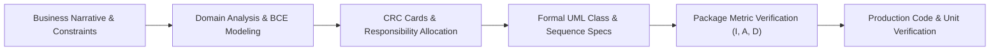
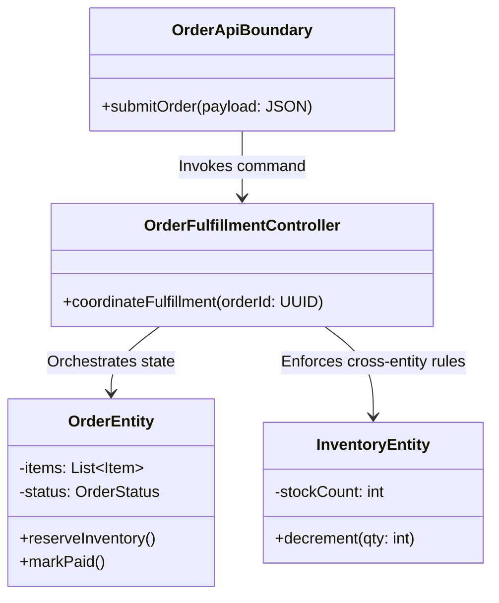
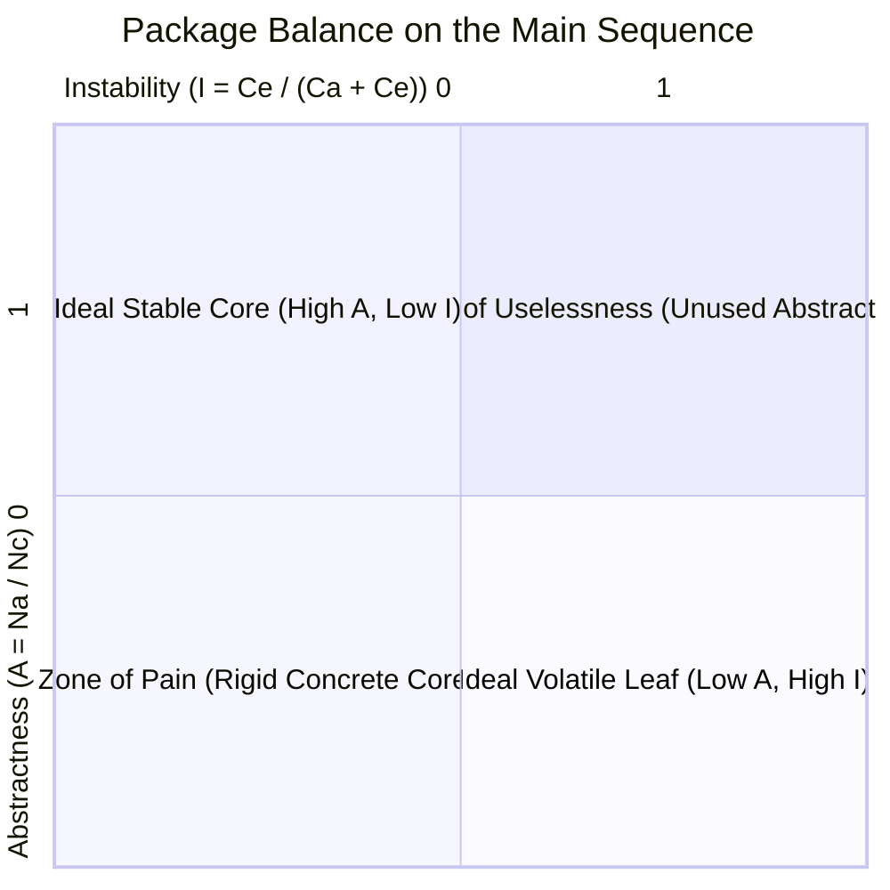
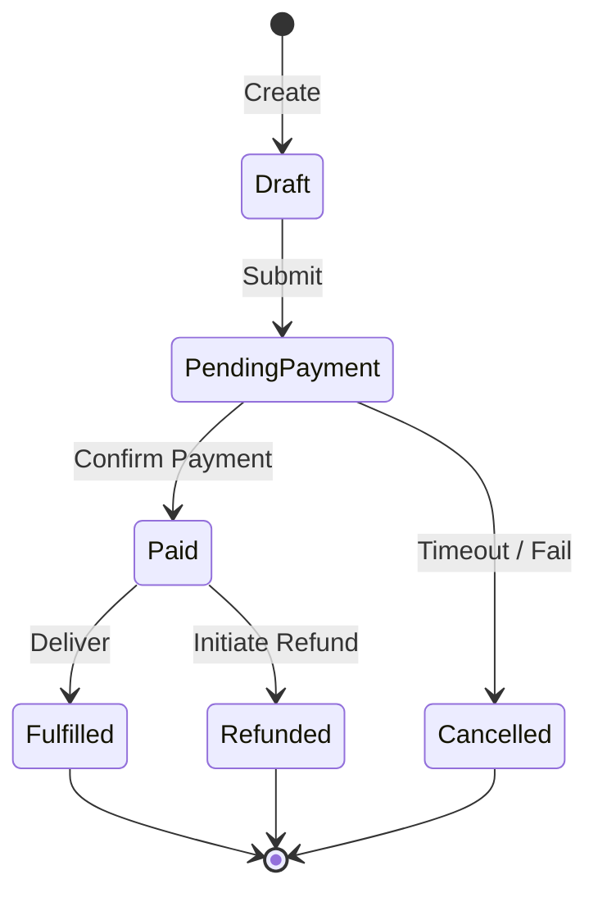

# Object-Oriented Analysis and Design (OOAD): Staff-Plus Framework

## 1. Overview and Engineering Methodology

Object-Oriented Analysis and Design (OOAD) is the disciplined translation of ambiguous, high-level business requirements into robust, modular, and maintainable object models.
At Staff and Principal levels, OOAD extends far beyond sketching trivial class diagrams.
It establishes formal contracts, domain boundaries, state transition invariants, and structural coupling metrics across enterprise systems.

A production-grade OOAD process operates across three rigorous phases:
1. **Domain Analysis**: Extracting conceptual entities, state lifecycles, and business invariants directly from user narratives.
2. **Object Design**: Applying architectural separation, assigning responsibilities using Class-Responsibility-Collaborator (CRC) techniques, and designing boundaries using Boundary-Control-Entity (BCE) patterns.
3. **Formal Verification**: Evaluating package stability metrics, eliminating Law of Demeter violations, and proving concurrency safety across polymorphic interactions.



---

## 2. Boundary-Control-Entity (BCE) Pattern

The Boundary-Control-Entity (BCE) pattern (originated by Ivar Jacobson) partitions classes based on their role in the system architecture.
This separation prevents enterprise logic from leaking into presentation layers or database drivers.

### 2.1 The Three Roles
1. **Entity Objects**:
   Encapsulate core domain state, business logic, and class invariants.
   Entities survive individual workflow executions and represent persistent concepts (for example, `BankAccount`, `RideRequest`, `InventoryStock`).
   Entities have zero knowledge of UI boundaries or network communication protocols.

2. **Control Objects**:
   Coordinate business workflows, orchestrate interactions between entities, and manage transactional boundaries (for example, `RideMatchingCoordinator`, `PaymentSettlementProcessor`).
   Controls contain procedural orchestration logic but delegate state manipulation to Entities.

3. **Boundary Objects**:
   Mediate communication between the system and external actors, such as users, third-party APIs, or physical hardware sensors (for example, `RESTOrderController`, `PaymentGatewayAdapter`, `PushNotificationClient`).
   Boundaries translate external wire payloads into internal domain commands.



---

## 3. Class-Responsibility-Collaborator (CRC) Cards

CRC modeling is an iterative design methodology developed by Ward Cunningham and Kent Beck to prevent God-class anti-patterns early in the design cycle.
Every candidate class is evaluated against three core properties:

| CRC Section | Design Objective | Staff Verification Rule |
| :--- | :--- | :--- |
| **Class Name** | Clear domain noun | Must represent a single cohesive concept; avoid names ending in `Manager` or `Data` |
| **Responsibilities** | High-level behavioral obligations | Must fit within 3 to 5 discrete bullet points; includes knowing obligations and doing obligations |
| **Collaborators** | Other classes needed to fulfill obligations | Minimize collaborator count to avoid high Efferent Coupling ($C_e$) |

---

## 4. Architectural Package Metrics: Stability, Abstractness, and Distance

Robert C. Martin defined formal mathematical metrics to evaluate whether an object-oriented codebase is architecturally sound.

### 4.1 Instability Metric ($I$)
Let $C_a$ be **Afferent Coupling** (incoming dependencies: classes outside this package that depend on classes inside it).
Let $C_e$ be **Efferent Coupling** (outgoing dependencies: classes inside this package that depend on classes outside it).

$$I = \frac{C_e}{C_a + C_e}$$

- $I = 0$: Maximally stable package. Many packages depend on it; it depends on nothing. It is painful to modify because changes break numerous clients.
- $I = 1$: Maximally instable package. No packages depend on it; it depends on many things. It is very easy to modify without causing external ripple effects.

### 4.2 Abstractness Metric ($A$)
Let $N_a$ be the number of abstract classes and interfaces in the package.
Let $N_c$ be the total number of classes in the package.

$$A = \frac{N_a}{N_c}$$

- $A = 0$: Highly concrete package containing zero abstractions.
- $A = 1$: Pure abstract package containing only interfaces and abstract classes.

### 4.3 The Stable Dependencies Principle (SDP) and Distance ($D$)
Packages that are highly stable ($I \approx 0$) must be highly abstract ($A \approx 1$) so they can be extended via polymorphism without direct modification.
Packages that are instable ($I \approx 1$) should be concrete ($A \approx 0$) because they contain leaf implementation details.

The **Main Sequence** is defined by the line $A + I = 1$.
The normalized **Distance from the Main Sequence** ($D$) is:

$$D = |A + I - 1|$$

- $D \approx 0$: Perfectly balanced package on the Main Sequence.
- $A \approx 0, I \approx 0$ (**The Zone of Pain**): Concrete, rigid package with high incoming dependencies (for example, a database schema class or utility library with direct callers). Difficult to modify.
- $A \approx 1, I \approx 1$ (**The Zone of Uselessness**): Abstract package with no incoming dependencies. Dead code or premature over-engineering.



---

## 5. Law of Demeter (Principle of Least Knowledge)

### 5.1 Formal Definition
The Law of Demeter (LoD) states that a method $M$ of an object $O$ may only invoke methods of:
1. The object $O$ itself.
2. The parameters passed into method $M$.
3. Any objects created or instantiated within method $M$.
4. Any direct component objects (instance variables) of object $O$.
5. Global variables accessible by $O$ within scope.

$M$ must **never** invoke methods on an object returned by an allowed call.

### 5.2 The "Train Wreck" Code Smell
```python
# Severe Law of Demeter Violation (Train Wreck)
customer.get_wallet().get_credit_card().get_billing_address().get_postal_code()
```
This single line forces the caller to depend on five nested object topologies.
If the internal data structure of `Wallet` changes, the caller breaks.
Refactoring to respect Demeter delegates navigation:
```python
# Compliant: Caller asks customer directly
customer.get_billing_postal_code()
```

---

## 6. Composition Over Inheritance

### 6.1 The Fragile Base Class Problem
Inheritance creates tight white-box coupling.
Subclasses depend on the internal implementation nuances of the parent class.
If a base class modifies an internal self-invocation pattern (for example, `addAll()` internally calling `add()`), a subclass overriding `add()` can inadvertently double-count elements or cause infinite recursion.

### 6.2 Comparison Matrix

| Dimension | Class Inheritance (Is-A) | Object Composition (Has-A) |
| :--- | :--- | :--- |
| **Coupling Level** | Tight, compile-time white-box coupling | Loose, runtime black-box coupling |
| **Extensibility** | Fixed at compile time | Dynamic runtime strategy substitution |
| **Encapsulation** | Compromised; subclass inspects protected members | Fully preserved behind clean interface contracts |
| **Memory & Layout** | Flat object layout, single heap allocation | Multiple pointer dereferences, extra object overhead |
| **Polymorphic Cost** | Virtual method table (vtable) dispatch | Interface dispatch or function pointer delegation |

---

## 7. State Machine Modeling in Object-Oriented Design

State modeling is central to enterprise workflows such as ride booking, order fulfillment, and connection handshakes.
Staff engineers avoid sprawling `if-elif-else` checks by modeling states as polymorphic objects or formal transition tables.



### 7.1 Key Invariants for Concurrency-Safe State Machines
1. **Atomic Transition Guarding**: Transitions must verify precondition states atomically using Compare-And-Swap (CAS) or synchronized locks.
2. **Side-Effect Isolation**: State transitions must complete state mutations before triggering outbound external side effects (such as webhooks or email notifications).
3. **Deterministic Reject Handling**: Illegal transitions must raise explicit typed domain exceptions, never fail silently.

---

## 8. Complete Production-Grade Simulation in Python

The following script models an end-to-end Ride-Sharing Lifecycle using BCE separation, Law of Demeter adherence, and a formal State Pattern transition engine.

```python
"""
OOAD Production-Grade Framework Simulation.
Demonstrates:
1. BCE Architecture: Boundary, Control, Entity separation.
2. Law of Demeter: Encapsulated delegation vs train wreck navigation.
3. Formal State Machine: Polymorphic ride lifecycle transitions.
4. Metric Tracking: Afferent/Efferent coupling verification.
"""

from abc import ABC, abstractmethod
from enum import Enum, auto
from typing import Dict, List, Optional
import uuid


# =====================================================================
# 1. DOMAIN ENTITIES & STATE ENGINE
# =====================================================================

class RideState(ABC):
    """Abstract State Pattern contract."""
    @abstractmethod
    def name(self) -> str:
        pass

    @abstractmethod
    def accept(self, ride: 'RideEntity', driver_id: str) -> None:
        pass

    @abstractmethod
    def start(self, ride: 'RideEntity') -> None:
        pass

    @abstractmethod
    def complete(self, ride: 'RideEntity') -> None:
        pass

    @abstractmethod
    def cancel(self, ride: 'RideEntity', reason: str) -> None:
        pass


class RequestedState(RideState):
    def name(self) -> str:
        return "REQUESTED"

    def accept(self, ride: 'RideEntity', driver_id: str) -> None:
        ride.driver_id = driver_id
        ride.transition_to(AcceptedState())

    def start(self, ride: 'RideEntity') -> None:
        raise IllegalStateTransitionError("Cannot start ride before driver acceptance.")

    def complete(self, ride: 'RideEntity') -> None:
        raise IllegalStateTransitionError("Cannot complete ride before it begins.")

    def cancel(self, ride: 'RideEntity', reason: str) -> None:
        ride.cancellation_reason = reason
        ride.transition_to(CancelledState())


class AcceptedState(RideState):
    def name(self) -> str:
        return "ACCEPTED"

    def accept(self, ride: 'RideEntity', driver_id: str) -> None:
        raise IllegalStateTransitionError("Ride is already accepted by another driver.")

    def start(self, ride: 'RideEntity') -> None:
        ride.transition_to(InProgressState())

    def complete(self, ride: 'RideEntity') -> None:
        raise IllegalStateTransitionError("Cannot complete ride before it starts.")

    def cancel(self, ride: 'RideEntity', reason: str) -> None:
        ride.cancellation_reason = reason
        ride.transition_to(CancelledState())


class InProgressState(RideState):
    def name(self) -> str:
        return "IN_PROGRESS"

    def accept(self, ride: 'RideEntity', driver_id: str) -> None:
        raise IllegalStateTransitionError("Ride is already underway.")

    def start(self, ride: 'RideEntity') -> None:
        raise IllegalStateTransitionError("Ride is already in progress.")

    def complete(self, ride: 'RideEntity') -> None:
        ride.transition_to(CompletedState())

    def cancel(self, ride: 'RideEntity', reason: str) -> None:
        raise IllegalStateTransitionError("Cannot cancel ride that is already in progress.")


class CompletedState(RideState):
    def name(self) -> str:
        return "COMPLETED"

    def accept(self, ride: 'RideEntity', driver_id: str) -> None:
        raise IllegalStateTransitionError("Ride has already completed.")

    def start(self, ride: 'RideEntity') -> None:
        raise IllegalStateTransitionError("Ride has already completed.")

    def complete(self, ride: 'RideEntity') -> None:
        raise IllegalStateTransitionError("Ride is already completed.")

    def cancel(self, ride: 'RideEntity', reason: str) -> None:
        raise IllegalStateTransitionError("Cannot cancel completed ride.")


class CancelledState(RideState):
    def name(self) -> str:
        return "CANCELLED"

    def accept(self, ride: 'RideEntity', driver_id: str) -> None:
        raise IllegalStateTransitionError("Ride was cancelled.")

    def start(self, ride: 'RideEntity') -> None:
        raise IllegalStateTransitionError("Ride was cancelled.")

    def complete(self, ride: 'RideEntity') -> None:
        raise IllegalStateTransitionError("Ride was cancelled.")

    def cancel(self, ride: 'RideEntity', reason: str) -> None:
        raise IllegalStateTransitionError("Ride is already cancelled.")


class IllegalStateTransitionError(RuntimeError):
    """Typed domain exception for illegal lifecycle steps."""
    pass


class PassengerProfile:
    """Internal component object."""
    def __init__(self, passenger_id: str, payment_token: str):
        self.passenger_id = passenger_id
        self._payment_token = payment_token

    def verify_payment_capability(self) -> bool:
        """Adheres to Law of Demeter: caller asks profile directly."""
        return bool(self._payment_token and len(self._payment_token) > 8)


class RideEntity:
    """Core Entity encapsulating state and lifecycle invariants."""
    def __init__(self, ride_id: str, passenger: PassengerProfile, fare_estimate: float):
        self.ride_id = ride_id
        self._passenger = passenger
        self.fare_estimate = fare_estimate
        self.driver_id: Optional[str] = None
        self.cancellation_reason: Optional[str] = None
        self._state: RideState = RequestedState()

    @property
    def current_state_name(self) -> str:
        return self._state.name()

    def transition_to(self, new_state: RideState) -> None:
        self._state = new_state

    # Delegated state triggers
    def assign_driver(self, driver_id: str) -> None:
        self._state.accept(self, driver_id)

    def begin_trip(self) -> None:
        self._state.start(self)

    def finish_trip(self) -> None:
        self._state.complete(self)

    def abort_trip(self, reason: str) -> None:
        self._state.cancel(self, reason)

    # Law of Demeter compliance: Encapsulates passenger payment verification
    def can_passenger_pay(self) -> bool:
        return self._passenger.verify_payment_capability()


# =====================================================================
# 2. CONTROL (ORCHESTRATOR)
# =====================================================================

class RideDispatchController:
    """Control object orchestrating ride lifecycle across entities and adapters."""
    def __init__(self):
        self._active_rides: Dict[str, RideEntity] = {}

    def request_ride(self, passenger: PassengerProfile, fare_estimate: float) -> RideEntity:
        ride = RideEntity(str(uuid.uuid4()), passenger, fare_estimate)
        if not ride.can_passenger_pay():
            raise ValueError("Passenger payment verification failed.")
        self._active_rides[ride.ride_id] = ride
        return ride

    def dispatch_driver(self, ride_id: str, driver_id: str) -> None:
        ride = self._get_ride(ride_id)
        ride.assign_driver(driver_id)

    def start_ride(self, ride_id: str) -> None:
        ride = self._get_ride(ride_id)
        ride.begin_trip()

    def complete_ride(self, ride_id: str) -> None:
        ride = self._get_ride(ride_id)
        ride.finish_trip()

    def _get_ride(self, ride_id: str) -> RideEntity:
        if ride_id not in self._active_rides:
            raise KeyError(f"Ride {ride_id} does not exist.")
        return self._active_rides[ride_id]


# =====================================================================
# 3. BOUNDARY (API GATEWAY)
# =====================================================================

class RideApiBoundary:
    """Boundary adapter mapping wire requests into domain commands."""
    def __init__(self, controller: RideDispatchController):
        self._controller = controller

    def handle_passenger_booking(self, passenger_id: str, token: str, fare: float) -> str:
        passenger = PassengerProfile(passenger_id, token)
        ride = self._controller.request_ride(passenger, fare)
        return ride.ride_id

    def handle_driver_acceptance(self, ride_id: str, driver_id: str) -> str:
        self._controller.dispatch_driver(ride_id, driver_id)
        return "SUCCESS"


# =====================================================================
# VERIFICATION SUITE
# =====================================================================

def main():
    print("Executing OOAD Framework Verification Suite...")

    controller = RideDispatchController()
    boundary = RideApiBoundary(controller)

    # 1. Happy path lifecycle verification
    ride_id = boundary.handle_passenger_booking("PAX-100", "VALID_TOKEN_12345", 25.50)
    ride = controller._get_ride(ride_id)
    assert ride.current_state_name == "REQUESTED"
    print("Ride Creation Verified: State is REQUESTED.")

    boundary.handle_driver_acceptance(ride_id, "DRV-55")
    assert ride.current_state_name == "ACCEPTED"
    assert ride.driver_id == "DRV-55"
    print("Driver Acceptance Verified: State is ACCEPTED.")

    controller.start_ride(ride_id)
    assert ride.current_state_name == "IN_PROGRESS"
    print("Ride Start Verified: State is IN_PROGRESS.")

    controller.complete_ride(ride_id)
    assert ride.current_state_name == "COMPLETED"
    print("Ride Completion Verified: State is COMPLETED.")

    # 2. Invariant & illegal transition protection
    try:
        controller.start_ride(ride_id)
        assert False, "Should have thrown IllegalStateTransitionError"
    except IllegalStateTransitionError:
        print("Illegal Transition Rejection Verified: Passed.")

    # 3. Law of Demeter check
    bad_passenger = PassengerProfile("PAX-999", "SHORT")
    try:
        controller.request_ride(bad_passenger, 15.0)
        assert False, "Should have thrown ValueError for payment check failure"
    except ValueError:
        print("Demeter Payment Gate Verified: Passed.")

    print("All OOAD Framework validations passed successfully.")


if __name__ == "__main__":
    main()
```

---

## 9. Active Recall Interview Questions

<details>
<summary>1. In the Boundary-Control-Entity (BCE) pattern, what are the precise responsibilities of Control objects versus Entity objects?</summary>
Entities represent the persistent domain data model and encapsulate business invariants that remain true across all use cases.
Control objects orchestrate transient use-case workflows, coordinating multiple entities and managing transaction boundaries.
Entities never depend on Controls or Boundaries; Controls manipulate Entities; Boundaries invoke Controls.
</details>

<details>
<summary>2. How is package instability ($I$) mathematically defined, and what does an instability of $I = 0$ signify?</summary>
$I = C_e / (C_a + C_e)$, where $C_a$ is afferent (incoming) coupling and $C_e$ is efferent (outgoing) coupling.
$I = 0$ signifies a maximally stable package.
Many outside packages depend on it, and it depends on no external packages.
Modifying it is costly because changes risk breaking all dependent packages.
</details>

<details>
<summary>3. What is the Main Sequence in package metrics, and what are the two danger zones located far from it?</summary>
The Main Sequence represents the ideal architectural balance line: $A + I = 1$, where $A$ is abstractness and $I$ is instability.
The two danger zones are:
1. The Zone of Pain ($A = 0, I = 0$): Concrete and highly depended upon; rigid and hard to refactor.
2. The Zone of Uselessness ($A = 1, I = 1$): Highly abstract but depended on by nothing; useless dead abstractions.
</details>

<details>
<summary>4. State the Law of Demeter and explain the 'train wreck' code smell.</summary>
The Law of Demeter requires that a method of an object may only invoke methods of itself, its parameters, objects it creates, or its direct component fields.
It must never invoke methods on objects returned by intermediate calls.
A train wreck is a chained invocation sequence like `a.getB().getC().getD().action()`, which exposes internal topologies and couples the caller to four separate classes.
</details>

<details>
<summary>5. Why does object composition eliminate the fragile base class problem inherent in class inheritance?</summary>
In inheritance, subclasses are coupled to white-box implementation details of the parent (such as internal self-invocations between methods).
A parent refactor can silently break subclass invariants or cause recursion.
Composition preserves black-box encapsulation: components interact exclusively through well-defined public interface contracts.
</details>

<details>
<summary>6. How do CRC cards prevent God-class architectural decay early in the design cycle?</summary>
CRC (Class-Responsibility-Collaborator) cards restrict a class's behavioral obligations to 3 to 5 discrete bullet points on a physical or conceptual index card.
If a class requires dozens of responsibilities or an excessive list of collaborators, it indicates low cohesion and signals the need for decomposition before writing code.
</details>

<details>
<summary>7. When modeling state transitions in high-concurrency systems, why is the State Pattern preferred over switch-case statements?</summary>
The State Pattern encapsulates state-specific behavior into polymorphic classes.
Each state independently enforces valid transitions and rejects invalid calls.
In concurrent environments, transitions can be guarded atomically per state object, eliminating complex nested locks and large error-prone switch statements.
</details>

<details>
<summary>8. What is the difference between afferent coupling ($C_a$) and efferent coupling ($C_e$)?</summary>
Afferent coupling ($C_a$) is incoming coupling: the number of classes outside a package that depend on classes inside that package.
Efferent coupling ($C_e$) is outgoing coupling: the number of classes inside a package that depend on classes outside that package.
</details>

<details>
<summary>9. How does the Boundary object protect domain entities from external wire format changes (such as REST JSON schemas or Protobuf messages)?</summary>
Boundaries act as translation anti-corruption layers.
They ingest external serialization payloads, validate transport syntax, and map external representations into strongly-typed domain value objects and commands.
If an external API schema changes, only the Boundary adapter is modified; domain entities remain untouched.
</details>

<details>
<summary>10. What is the Distance metric ($D$), and how is it used during automated CI code quality gates?</summary>
$D = |A + I - 1|$.
It measures the perpendicular distance of a package from the ideal Main Sequence.
Automated CI gates can flag packages whose $D$ metric exceeds an architectural threshold (such as $D > 0.5$), signaling either overly rigid concrete modules or speculative abstract bloat.
</details>
