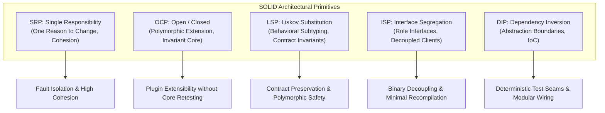
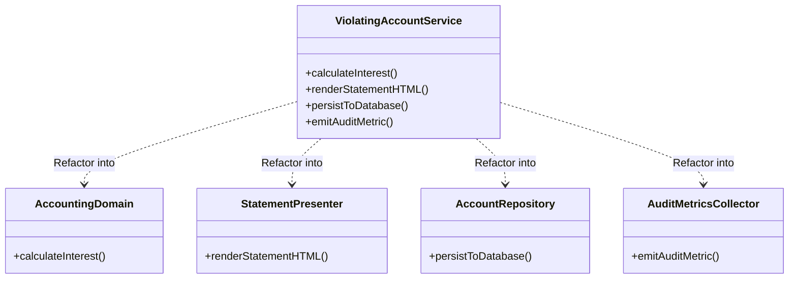
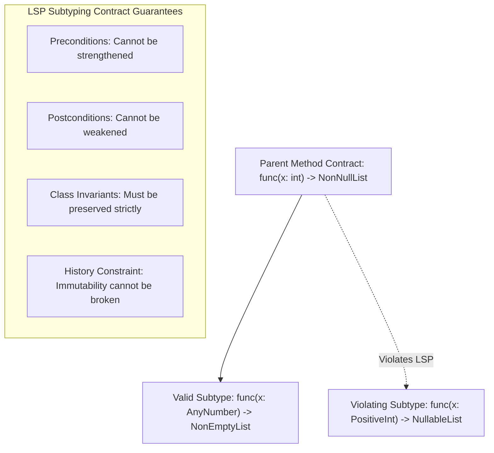
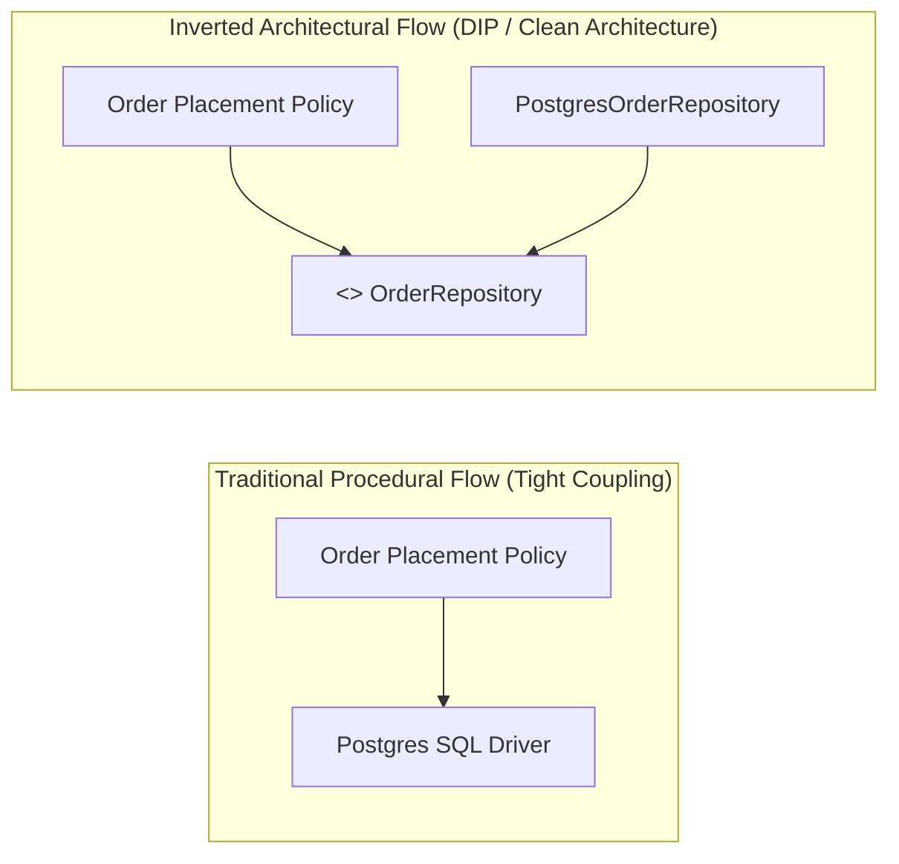

# SOLID Principles: Staff-Plus Systems Deep Dive

## 1. Overview and Core Philosophy

In production-grade software engineering, the SOLID design principles are frequently taught through trivial textbook metaphors such as shapes, animals, or employee payrolls.
At Staff and Distinguished levels, SOLID represents a rigorous framework for managing complexity, binary compatibility, compilation boundaries, and concurrency isolation.
Software decay is caused by four structural ailments: rigidity, fragility, immobility, and viscosity.
Rigidity is the tendency for software to be difficult to change because every modification forces a cascade of downstream edits.
Fragility is the tendency of software to break in places that have no conceptual relationship to the area being modified.
Immobility is the inability to reuse software from other projects or modules because it cannot be disentangled from surrounding baggage.
Viscosity occurs when the design-preserving path of modification is significantly harder to execute than a hack.

The SOLID principles provide formal mechanisms to eliminate these four design pathologies.
They govern how classes, modules, and compilation units interact across process and thread boundaries.



---

## 2. Deep Dive: Single Responsibility Principle (SRP)

### 2.1 The Real Definition
The common phrase "a class should do only one thing" is a misinterpretation.
Robert C. Martin formally defines SRP: **A module should be responsible to one, and only one, actor.**
An actor is a single user, department, or business stakeholder representing a distinct source of change requirements.
When a class encapsulates logic driven by different stakeholders, modifications requested by one stakeholder risk silently destabilizing the operational requirements of another.

### 2.2 Mathematical Metric: Lack of Cohesion in Methods (LCOM)
Cohesion measures the degree to which methods in a class operate on the same subset of instance variables.
The LCOM4 metric calculates the number of connected components in an undirected graph where:
- Nodes represent the class methods.
- An edge exists between method $M_1$ and method $M_2$ if both methods access at least one common instance attribute.
If $\text{LCOM4} = 1$, the class is fully cohesive.
If $\text{LCOM4} > 1$, the class consists of multiple disconnected sub-responsibilities and must be split into separate classes.

### 2.3 Systems Consequences of SRP Violations
1. **Merge Conflicts**: Multiple developers working on disparate user stories frequently collide on the same god-class file.
2. **Blast Radius and Deployment Coupling**: Bug fixes in audit logging trigger regressions in core transaction accounting.
3. **Cache Pollution**: Large classes with numerous fields suffer from poor CPU data-cache locality when traversing objects.



---

## 3. Deep Dive: Open/Closed Principle (OCP)

### 3.1 Formal Definition and Philosophy
**Software entities should be open for extension, but closed for modification.**
When business requirements change, developers should add new behavior by writing new code rather than modifying tested, deployed binary units.
Modifying existing code incurs high verification costs: all existing unit, integration, and regression suites must be re-run, and hot deployment paths are disrupted.

### 3.2 Mechanisms of Open/Closed Architecture
1. **Polymorphic Abstraction**: Define abstract base contracts or protocols representing the invariant workflow.
2. **Plugin Registries and Factory Dispatch**: Use dynamic maps of strategy handlers indexed by metadata keys.
3. **PIMPL Idiom / Compilation Firewalls**: In compiled languages like C++, decouple implementation headers from public API boundaries to avoid recompilation cascades.

### 3.3 The Core Failure Mode: Type Discrimination Switches
The classic sign of an OCP violation is an `if-else` or `switch` block inspecting enum types or concrete classes.
Every time a new type is introduced, the engineer must locate and modify every switch statement throughout the codebase.
Missing even one switch branch causes silent production bugs or fallback errors.

---

## 4. Deep Dive: Liskov Substitution Principle (LSP)

### 4.1 Formal Mathematical Formulation
Introduced by Barbara Liskov and Jeannette Wing in 1994, behavioral subtyping states:
Let $\phi(x)$ be a property provable about objects $x$ of type $T$.
Then $\phi(y)$ should be true for objects $y$ of type $S$ where $S$ is a subtype of $T$.

```
S <: T  =>  ∀ φ,  φ(T) holds  =>  φ(S) holds
```

### 4.2 The Four Concrete Behavioral Contract Rules
Subtyping must satisfy four specific constraints:

1. **Precondition Weakening Only**:
   A subclass method may weaken the preconditions required of the caller, but cannot strengthen them.
   If the parent accepts any integer, the subclass cannot require that the integer be strictly positive.

2. **Postcondition Strengthening Only**:
   A subclass method may strengthen the guarantees promised upon return, but cannot weaken them.
   If the parent guarantees returning a non-null list, the subclass cannot return null or raise an unexpected empty-state exception.

3. **Class Invariant Preservation**:
   All invariant constraints maintained by the parent class must remain preserved before and after any subclass method execution.

4. **History Constraint (Immutability Violation)**:
   A subclass must not allow state mutations that the parent class prohibited.
   If a parent represents an immutable object, a subclass cannot expose mutating operations.



### 4.3 Classic Systems Violation: The Rectangle-Square Trap
A `Square` class inheriting from `Rectangle` violates LSP when `Rectangle` exposes independent `setWidth(w)` and `setHeight(h)` setters.
Callers holding a `Rectangle` reference reasonably assume that setting width leaves height unchanged.
In `Square`, changing width modifies height as a side effect, breaking caller expectations and invariant assumptions.

---

## 5. Deep Dive: Interface Segregation Principle (ISP)

### 5.1 Formal Definition
**Clients should not be forced to depend upon methods that they do not use.**
Fat interfaces create artificial coupling between otherwise independent consumers.
When an interface contains thirty methods serving ten different clients, a change to method signatures needed by client A forces recompilation, redeployment, and retesting of clients B through J.

### 5.2 Role Interfaces vs Header Interfaces
A header interface blindly reflects all public methods of a concrete implementation.
A role interface represents a specific role or contract defined from the consumer's perspective.
In Go, standard library design embodies ISP: `io.Reader` and `io.Writer` each declare exactly one method.
Composed interfaces such as `io.ReadWriter` are assembled from smaller single-responsibility role interfaces.

### 5.3 Memory and Cache Impacts of Interface Bloat
In compiled languages with virtual dispatch tables (vtables), gigantic interfaces enlarge vtable footprints and increase instruction cache misses during indirect call dispatch.
In environments with mock testing, fat interfaces necessitate hundreds of mock stubs that do nothing, inflating test maintenance overhead.

---

## 6. Deep Dive: Dependency Inversion Principle (DIP)

### 6.1 Formal Definition
1. **High-level modules should not depend on low-level modules. Both should depend on abstractions.**
2. **Abstractions should not depend on details. Details should depend on abstractions.**

Traditional procedural architectures enforce top-down dependency flow:
High-Level Policy $\rightarrow$ Mid-Level Mechanism $\rightarrow$ Low-Level I/O and Drivers.
In this hierarchy, high-level business logic is held hostage to low-level database schemas, file system APIs, and network protocols.
Dependency Inversion flips the dependency arrow using polymorphism.



### 6.2 Inversion of Control (IoC) and Dependency Injection (DI)
Dependency Inversion is the architectural principle.
Inversion of Control (IoC) is the runtime mechanism where framework control replaces procedural execution.
Dependency Injection (DI) is the concrete pattern where dependencies are supplied to a component via constructor, method, or property parameters rather than being instantiated internally using `new`.

---

## 7. Comparative Architecture Matrix

| Principle | Primary Problem Solved | Core Smell When Violated | Systems / Performance Penalty | Refactoring Pattern |
| :--- | :--- | :--- | :--- | :--- |
| **SRP** | High blast radius, team merge collisions | God class with disparate method clusters | CPU cache eviction, shared state contention | Facade, Extract Class, Command |
| **OCP** | Fragile recompilation cascades | Type discrimination `switch(obj.type)` | Re-testing hot code paths, downtime on deploy | Strategy, Factory Registry, Decorator |
| **LSP** | Runtime exceptions on polymorphic calls | `isinstance` checks, unsupported method throws | Broken invariants, silent logic corruption | Composition, Split Hierarchies |
| **ISP** | Unnecessary coupling across disparate clients | Dummy mock methods, bloated vtables | Large vtables, unnecessary recompilation | Role Interfaces, Multiple Inheritance |
| **DIP** | Business logic tied to concrete storage/network | Direct `new DbConnection()` in business logic | Zero testability, vendor lock-in | Dependency Injection, Hexagonal Ports |

---

## 8. Complete Production-Grade Simulation in Python

The following standalone script demonstrates violating patterns versus pristine, production-grade Staff-level SOLID architectures.

```python
"""
SOLID Principles Staff-Plus Architecture Simulation.
Demonstrates:
1. SRP: Separate business billing, statement formatting, and persistence.
2. OCP: Pluggable tax strategy registry without switch-case modifications.
3. LSP: Strict behavioral subtyping respecting preconditions and invariants.
4. ISP: Granular role protocols (Readable, Writable, Serializable).
5. DIP: Order processing depending exclusively on abstract domain ports.
"""

from abc import ABC, abstractmethod
from typing import Dict, List, Protocol, Type
import math


# =====================================================================
# 1. SINGLE RESPONSIBILITY PRINCIPLE (SRP)
# =====================================================================

class OrderEntity:
    """Pure domain entity containing state and invariant checks."""
    def __init__(self, order_id: str, customer_id: str, base_amount: float):
        if base_amount < 0:
            raise ValueError("Base amount cannot be negative")
        self.order_id = order_id
        self.customer_id = customer_id
        self.base_amount = base_amount


class OrderCalculator:
    """Actor: Finance Department."""
    def calculate_total(self, order: OrderEntity, tax_rate: float, discount: float) -> float:
        subtotal = order.base_amount - discount
        subtotal = max(0.0, subtotal)
        return round(subtotal * (1.0 + tax_rate), 2)


class OrderStatementFormatter:
    """Actor: Customer Communications Department."""
    def format_as_text(self, order: OrderEntity, total: float) -> str:
        return f"[INVOICE {order.order_id}] Customer: {order.customer_id} | Total: ${total:.2f}"


# =====================================================================
# 2. OPEN / CLOSED PRINCIPLE (OCP)
# =====================================================================

class TaxCalculationStrategy(ABC):
    """Abstract strategy open for extension."""
    @abstractmethod
    def compute_tax(self, taxable_amount: float) -> float:
        pass


class USTaxStrategy(TaxCalculationStrategy):
    def compute_tax(self, taxable_amount: float) -> float:
        return round(taxable_amount * 0.0825, 2)


class EUTaxStrategy(TaxCalculationStrategy):
    def compute_tax(self, taxable_amount: float) -> float:
        return round(taxable_amount * 0.20, 2)


class TaxStrategyRegistry:
    """Registry pattern enabling extension without modifying existing code."""
    def __init__(self):
        self._strategies: Dict[str, TaxCalculationStrategy] = {}

    def register(self, jurisdiction_code: str, strategy: TaxCalculationStrategy) -> None:
        self._strategies[jurisdiction_code.upper()] = strategy

    def get_strategy(self, jurisdiction_code: str) -> TaxCalculationStrategy:
        strategy = self._strategies.get(jurisdiction_code.upper())
        if not strategy:
            raise KeyError(f"No tax strategy registered for jurisdiction: {jurisdiction_code}")
        return strategy


# =====================================================================
# 3. LISKOV SUBSTITUTION PRINCIPLE (LSP)
# =====================================================================

class BankAccount(ABC):
    """Base class defining formal contract invariants."""
    def __init__(self, account_id: str, balance: float):
        self.account_id = account_id
        self._balance = balance

    @property
    def balance(self) -> float:
        return self._balance

    @abstractmethod
    def withdraw(self, amount: float) -> None:
        """
        Precondition: amount > 0.
        Postcondition: self.balance decreases by amount.
        Invariant: self.balance >= 0.
        """
        pass


class StandardCheckingAccount(BankAccount):
    def withdraw(self, amount: float) -> None:
        if amount <= 0:
            raise ValueError("Withdrawal amount must be strictly positive")
        if self._balance - amount < 0:
            raise RuntimeError("Insufficient funds: balance cannot become negative")
        self._balance -= amount


class HighYieldSavingsAccount(BankAccount):
    """
    Subtype conforming to LSP:
    Preconditions are identical (amount > 0).
    Postconditions and invariants are preserved (balance >= 0).
    """
    def __init__(self, account_id: str, balance: float, min_reserve: float = 100.0):
        super().__init__(account_id, balance)
        self.min_reserve = min_reserve

    def withdraw(self, amount: float) -> None:
        if amount <= 0:
            raise ValueError("Withdrawal amount must be strictly positive")
        if self._balance - amount < self.min_reserve:
            raise RuntimeError(f"Withdrawal denied: must maintain reserve of ${self.min_reserve:.2f}")
        self._balance -= amount


# =====================================================================
# 4. INTERFACE SEGREGATION PRINCIPLE (ISP)
# =====================================================================

class ReadableRepository(Protocol):
    def find_by_id(self, entity_id: str) -> OrderEntity: ...


class WritableRepository(Protocol):
    def save(self, entity: OrderEntity) -> None: ...


class AuditableRepository(Protocol):
    def record_audit_trail(self, entity_id: str, action: str) -> None: ...


# =====================================================================
# 5. DEPENDENCY INVERSION PRINCIPLE (DIP)
# =====================================================================

class OrderRepository(ReadableRepository, WritableRepository, Protocol):
    """Domain port interface combining required repository operations."""
    pass


class InMemoryOrderRepository:
    """Low-level infrastructure adapter implementing the domain port."""
    def __init__(self):
        self._storage: Dict[str, OrderEntity] = {}

    def find_by_id(self, entity_id: str) -> OrderEntity:
        if entity_id not in self._storage:
            raise KeyError(f"Order {entity_id} not found")
        return self._storage[entity_id]

    def save(self, entity: OrderEntity) -> None:
        self._storage[entity.order_id] = entity


class OrderFulfillmentService:
    """
    High-level policy class depending strictly on abstractions.
    Zero coupling to concrete databases or network protocols.
    """
    def __init__(self, repository: OrderRepository, tax_registry: TaxStrategyRegistry):
        self._repository = repository
        self._tax_registry = tax_registry
        self._calculator = OrderCalculator()

    def process_order(self, order_id: str, jurisdiction: str, discount: float) -> float:
        order = self._repository.find_by_id(order_id)
        tax_strategy = self._tax_registry.get_strategy(jurisdiction)
        tax = tax_strategy.compute_tax(order.base_amount - discount)
        total = round(order.base_amount - discount + tax, 2)
        return total


# =====================================================================
# VERIFICATION SUITE
# =====================================================================

def main():
    print("Executing SOLID Principles Staff Verification Suite...")

    # 1. Test SRP
    order = OrderEntity("ORD-101", "CUST-99", 500.0)
    calc = OrderCalculator()
    formatter = OrderStatementFormatter()
    total = calc.calculate_total(order, tax_rate=0.0825, discount=50.0)
    statement = formatter.format_as_text(order, total)
    assert "Total: $487.12" in statement
    print("SRP Verification: Passed.")

    # 2. Test OCP
    registry = TaxStrategyRegistry()
    registry.register("US", USTaxStrategy())
    registry.register("EU", EUTaxStrategy())
    assert registry.get_strategy("US").compute_tax(100.0) == 8.25
    assert registry.get_strategy("EU").compute_tax(100.0) == 20.00
    print("OCP Verification: Passed.")

    # 3. Test LSP
    accounts: List[BankAccount] = [
        StandardCheckingAccount("CHK-1", 200.0),
        HighYieldSavingsAccount("SAV-1", 500.0, min_reserve=100.0)
    ]
    for acc in accounts:
        acc.withdraw(50.0)
    assert accounts[0].balance == 150.0
    assert accounts[1].balance == 450.0
    print("LSP Verification: Passed.")

    # 4. Test DIP & ISP
    repo = InMemoryOrderRepository()
    repo.save(order)
    fulfillment = OrderFulfillmentService(repo, registry)
    final_amount = fulfillment.process_order("ORD-101", jurisdiction="US", discount=50.0)
    assert math.isclose(final_amount, 487.12, rel_tol=1e-3)
    print("DIP and ISP Verification: Passed.")

    print("All SOLID principle validations completed successfully.")


if __name__ == "__main__":
    main()
```

---

## 9. Active Recall Interview Questions

<details>
<summary>1. How does Robert C. Martin's definition of Single Responsibility Principle differ from the colloquial 'do one thing' rule?</summary>
The colloquial rule conflates function-level decomposition with architectural cohesion.
Martin defines SRP as: A module should be responsible to one, and only one, actor.
An actor represents a cohesive group of stakeholders requesting changes.
A class that calculates employee pay (Finance actor) and formats reporting HTML (HR actor) violates SRP even if both methods are well-written, because changes mandated by HR can inadvertently alter payroll calculations or cause merge conflicts across distinct engineering teams.
</details>

<details>
<summary>2. Explain the Liskov Substitution Principle mathematically using pre-conditions, post-conditions, and class invariants.</summary>
Given a supertype T and subtype S:
1. Preconditions cannot be strengthened: if method T.m(x) requires x > 0, subtype S.m(x) cannot demand x > 10.
2. Postconditions cannot be weakened: if T.m() guarantees returning a list where len >= 1, S.m() cannot return an empty list or null.
3. Invariants must be preserved: any invariant constraint true for all states of T must remain true for S.
4. History constraint: mutable state transitions not permitted by T cannot be introduced by S.
</details>

<details>
<summary>3. Why is the classic Rectangle-Square inheritance model a violation of LSP?</summary>
In a Rectangle base class with independent setters `setWidth(w)` and `setHeight(h)`, callers rely on the postcondition that calling `setWidth` leaves `height` invariant.
If Square inherits from Rectangle, setting width must change height to maintain squareness, violating the postcondition expected by consumers operating polymorphically on Rectangle references.
</details>

<details>
<summary>4. What is the concrete hardware and compilation penalty of violating the Interface Segregation Principle?</summary>
In compiled languages such as C++, giant interfaces create massive virtual method tables (vtables).
This inflates memory footprints and causes instruction cache misses during indirect call dispatches.
Furthermore, changing any unused method on a bloated interface header triggers recompilation cascades across dozens of downstream translation units that never invoke that method.
</details>

<details>
<summary>5. What is the fundamental difference between Dependency Inversion and Dependency Injection?</summary>
Dependency Inversion Principle (DIP) is a high-level architectural principle stating that business policies must depend on abstractions rather than low-level details.
Dependency Injection (DI) is a structural implementation pattern and mechanism whereby dependencies are supplied (injected) into a consumer from the outside, rather than being constructed internally.
</details>

<details>
<summary>6. How does the Open/Closed Principle relate to the Strategy pattern and dynamic plugin registries?</summary>
OCP requires that new behavior can be introduced without editing existing code.
The Strategy pattern satisfies this by defining an invariant interface for an algorithm.
A dynamic registry maintains a map of strategy instances keyed by identifier.
When a new business variant is created, developers register a new strategy class without touching existing orchestration code.
</details>

<details>
<summary>7. What metric quantitatively measures a class's adherence to Single Responsibility, and how is it calculated?</summary>
The Lack of Cohesion in Methods (LCOM) metric.
LCOM4 constructs an undirected graph where nodes are class methods and edges represent shared instance variable accesses.
If the graph contains more than one connected component (LCOM4 > 1), the class possesses multiple disparate responsibilities and should be split.
</details>

<details>
<summary>8. How do role interfaces differ from header interfaces, and how do they enforce ISP?</summary>
A header interface blindly mirrors all public methods of an underlying concrete class, resulting in high client coupling.
A role interface declares only the specific subset of operations required by a specific consumer role.
By defining role interfaces from the caller's perspective (e.g., `Reader`, `Writer`), callers are insulated from changes to unrelated capabilities.
</details>

<details>
<summary>9. Why do type-discrimination switches (`switch(item.getType())`) indicate an OCP violation?</summary>
Because adding a new variant requires manually searching and modifying every switch block across the repository.
If an engineer misses one switch statement, the system exhibits runtime fall-through bugs or unexpected exceptions, violating the principle of being closed for modification.
</details>

<details>
<summary>10. Under the Liskov Substitution Principle, can a subclass throw an exception that the parent class does not throw?</summary>
No, unless the new exception is a subclass of an exception already declared in the parent method's checked contract, or an unpreventable unchecked runtime exception.
Throwing a novel checked exception strengthens the postcondition failure mode, forcing callers that handle the parent interface to encounter unhandled exceptions.
</details>
