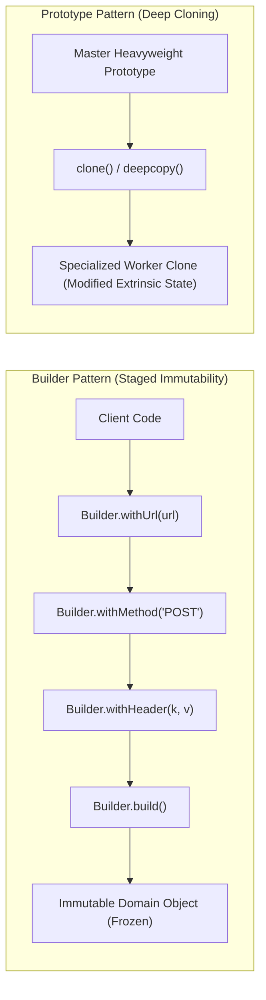
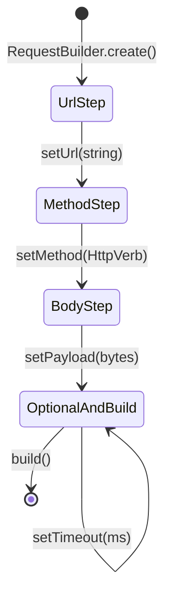
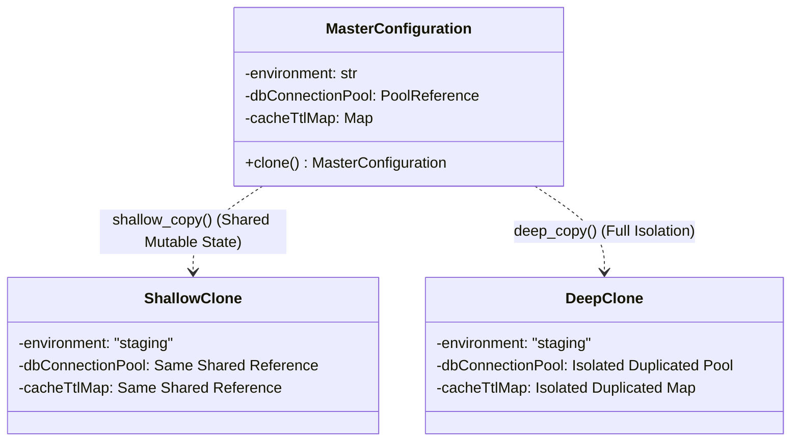

# Builder and Prototype Patterns: Staff-Plus Deep Dive

## 1. Overview and Problem Space

Constructing complex, immutable domain objects presents fundamental trade-offs between API safety, cognitive load, and memory allocation.
When an object requires numerous configuration parameters, developers historically resort to two flawed paradigms:
1. **The Telescoping Constructor Anti-Pattern**: Creating multiple overloaded constructors with increasing parameter counts (`Foo(a)`, `Foo(a, b)`, `Foo(a, b, c)`). This pattern is error-prone when adjacent parameters share primitive types (for example, consecutive integer timeouts or string tokens).
2. **The JavaBeans / Mutator Anti-Pattern**: Instantiating an empty object with a default constructor and calling setter methods. This exposes partially constructed objects to other threads, creating race conditions and completely eliminating object immutability.

The **Builder Pattern** eliminates both issues by decoupling staged construction from the resulting immutable object.
The **Prototype Pattern** addresses the complementary problem: generating new objects by cloning an existing prototype, avoiding costly constructor logic, database fetches, or external configuration parses.



---

## 2. Builder Pattern: Staff-Plus Mechanics

### 2.1 The Staged / Step Builder Pattern
A standard fluent builder allows methods to be called in arbitrary order, which cannot prevent a caller from invoking `.build()` before mandatory fields are populated.
The **Staged Builder** (or Step Builder) uses interface chaining to guide the developer through mandatory steps in strict order at compile time.
Only after all mandatory steps are executed does the builder expose optional methods and the terminal `.build()` method.



### 2.2 Invariant Validation at the Build Boundary
The terminal `.build()` method acts as a strict security and invariant firewall.
All cross-field consistency checks (such as verifying that a `POST` request contains a non-empty payload or valid `Content-Type`) are evaluated atomically before instantiation.
Once built, the resulting domain object exposes only read-only getters, guaranteeing thread safety.

---

## 3. Prototype Pattern: Deep vs Shallow Copy Semantics

### 3.1 The Object Graph Problem
Cloning an object is not simply copying its memory footprint.
Objects exist within complex object graphs containing nested references, collections, and circular dependencies.

1. **Shallow Copy**: Copies the immediate fields of the object. Primitive fields are duplicated, but reference fields copy memory pointers, causing the clone and original to share nested mutable state.
2. **Deep Copy**: Recursively duplicates the object and all referenced objects down the hierarchy. Must handle circular reference graphs using identity tracking maps (`visited_map`) to prevent infinite recursion and stack overflow errors.



### 3.2 Copy-on-Write (COW) Prototype Optimizations
In high-throughput systems, deep copying massive memory structures is prohibitively expensive.
Copy-on-Write prototypes share underlying memory buffers via reference counting or immutable data structures (such as HAMTs: Hash Array Mapped Tries).
A physical memory allocation occurs only when a clone attempts to mutate a specific leaf property.

---

## 4. Hardware and Systems Implications

1. **Memory Allocations in Fluent Chaining**:
   In languages without escape analysis, each intermediate step in a builder might allocate temporary heap wrappers.
   Staff engineers ensure the builder itself is a single heap-allocated (or stack-allocated) mutable workspace that returns `this`, allocating only the final immutable instance.
2. **Serialization vs Manual Copy Constructors**:
   Cloning via serialization (JSON, Protobuf, Java Serializable) incurs substantial CPU overhead (reflection, byte copying, deserialization validation).
   Manual deep-copy constructors or clone methods are orders of magnitude faster because they execute direct field-to-field assignments without reflection.

---

## 5. Complete Production-Grade Simulation in Python

The following script implements:
1. A **Staged (Step) HTTP Request Builder** enforcing mandatory fields in strict order before permitting optional configurations and final build.
2. A **Deep Copy Prototype Engine** featuring circular reference detection and isolation.

```python
"""
Builder and Prototype Patterns Production Simulation.
Demonstrates:
1. Type-safe Staged Builder enforcing mandatory sequential configuration.
2. Cross-field invariant validation upon build().
3. Deep-copy prototype engine handling nested structures and cyclic references.
"""

from abc import ABC, abstractmethod
from typing import Any, Dict, List, Optional, Set
import copy


# =====================================================================
# 1. IMMUTABLE DOMAIN ENTITY
# =====================================================================

class ImmutableHttpRequest:
    """Immutable product object constructed exclusively by HttpRequestBuilder."""
    def __init__(self, url: str, method: str, headers: Dict[str, str], body: Optional[bytes], timeout_ms: int):
        self._url = url
        self._method = method
        self._headers = dict(headers)  # Defensive copy
        self._body = body
        self._timeout_ms = timeout_ms
        self._frozen = True

    @property
    def url(self) -> str:
        return self._url

    @property
    def method(self) -> str:
        return self._method

    @property
    def headers(self) -> Dict[str, str]:
        return dict(self._headers)

    @property
    def body(self) -> Optional[bytes]:
        return self._body

    @property
    def timeout_ms(self) -> int:
        return self._timeout_ms

    def __setattr__(self, key: str, value: Any) -> None:
        if getattr(self, "_frozen", False):
            raise TypeError("Cannot modify immutable HttpRequest instance")
        super().__setattr__(key, value)


# =====================================================================
# 2. STAGED (STEP) BUILDER INTERFACES
# =====================================================================

class UrlStep(ABC):
    @abstractmethod
    def with_url(self, url: str) -> 'MethodStep':
        pass


class MethodStep(ABC):
    @abstractmethod
    def with_method(self, method: str) -> 'OptionalConfigStep':
        pass


class OptionalConfigStep(ABC):
    @abstractmethod
    def with_header(self, key: str, value: str) -> 'OptionalConfigStep':
        pass

    @abstractmethod
    def with_body(self, body: bytes) -> 'OptionalConfigStep':
        pass

    @abstractmethod
    def with_timeout(self, timeout_ms: int) -> 'OptionalConfigStep':
        pass

    @abstractmethod
    def build(self) -> ImmutableHttpRequest:
        pass


class HttpRequestBuilder(UrlStep, MethodStep, OptionalConfigStep):
    """Concrete staged builder implementing step interfaces."""
    def __init__(self):
        self._url: Optional[str] = None
        self._method: Optional[str] = None
        self._headers: Dict[str, str] = {}
        self._body: Optional[bytes] = None
        self._timeout_ms: int = 5000

    @classmethod
    def start(cls) -> UrlStep:
        return cls()

    def with_url(self, url: str) -> MethodStep:
        if not url or not (url.startswith("http://") or url.startswith("https://")):
            raise ValueError(f"Invalid URL format: '{url}'")
        self._url = url
        return self

    def with_method(self, method: str) -> OptionalConfigStep:
        valid_methods = {"GET", "POST", "PUT", "DELETE", "PATCH"}
        upper_method = method.upper()
        if upper_method not in valid_methods:
            raise ValueError(f"Unsupported HTTP method: '{method}'")
        self._method = upper_method
        return self

    def with_header(self, key: str, value: str) -> OptionalConfigStep:
        if not key:
            raise ValueError("Header key cannot be empty")
        self._headers[key] = value
        return self

    def with_body(self, body: bytes) -> OptionalConfigStep:
        self._body = body
        return self

    def with_timeout(self, timeout_ms: int) -> OptionalConfigStep:
        if timeout_ms <= 0:
            raise ValueError("Timeout must be strictly positive")
        self._timeout_ms = timeout_ms
        return self

    def build(self) -> ImmutableHttpRequest:
        # Cross-field invariant validation
        if self._method in {"POST", "PUT", "PATCH"} and not self._body:
            raise ValueError(f"{self._method} requests require a non-empty payload body")

        if self._body and "Content-Type" not in self._headers:
            self._headers["Content-Type"] = "application/octet-stream"

        assert self._url is not None
        assert self._method is not None

        return ImmutableHttpRequest(
            url=self._url,
            method=self._method,
            headers=self._headers,
            body=self._body,
            timeout_ms=self._timeout_ms
        )


# =====================================================================
# 3. PROTOTYPE PATTERN (DEEP CLONING WITH CYCLE DETECTION)
# =====================================================================

class ClonablePrototype(ABC):
    @abstractmethod
    def clone(self) -> 'ClonablePrototype':
        pass


class NodeConfig(ClonablePrototype):
    """Complex configuration object containing nested state and parent cycle."""
    def __init__(self, node_id: str, tags: List[str]):
        self.node_id = node_id
        self.tags = list(tags)
        self.neighbors: List['NodeConfig'] = []

    def add_neighbor(self, neighbor: 'NodeConfig') -> None:
        self.neighbors.append(neighbor)

    def clone(self) -> 'NodeConfig':
        """Deep clone using memoized identity dictionary to resolve cyclic graphs."""
        memo: Dict[int, Any] = {}
        return self._deep_clone_internal(memo)

    def _deep_clone_internal(self, memo: Dict[int, Any]) -> 'NodeConfig':
        obj_id = id(self)
        if obj_id in memo:
            return memo[obj_id]

        new_node = NodeConfig(self.node_id, list(self.tags))
        memo[obj_id] = new_node

        for neighbor in self.neighbors:
            new_node.neighbors.append(neighbor._deep_clone_internal(memo))

        return new_node


# =====================================================================
# VERIFICATION SUITE
# =====================================================================

def main():
    print("Executing Builder and Prototype Verification Suite...")

    # 1. Staged Builder Happy Path
    req = (HttpRequestBuilder.start()
           .with_url("https://api.gateway.internal/v1/orders")
           .with_method("POST")
           .with_header("Authorization", "Bearer secret-token")
           .with_body(b'{"order_id": "9921"}')
           .with_timeout(3000)
           .build())

    assert req.url == "https://api.gateway.internal/v1/orders"
    assert req.method == "POST"
    assert req.headers["Content-Type"] == "application/octet-stream"
    assert req.timeout_ms == 3000
    print("Staged Builder Construction: Passed.")

    # 2. Immutability verification
    try:
        req.timeout_ms = 99999
        assert False, "Should have raised TypeError on immutable attribute mutation"
    except TypeError:
        print("Product Immutability Guard: Passed.")

    # 3. Invariant validation failure check
    try:
        (HttpRequestBuilder.start()
         .with_url("https://api.gateway.internal/v1/fail")
         .with_method("POST")
         .build())  # Missing mandatory body for POST
        assert False, "Should have failed invariant validation for empty POST body"
    except ValueError:
        print("Builder Invariant Firewall: Passed.")

    # 4. Prototype with Cyclic Dependency Deep Cloning
    node_a = NodeConfig("Cluster-A", ["primary", "us-east"])
    node_b = NodeConfig("Cluster-B", ["replica", "us-west"])
    # Create circular reference: A -> B and B -> A
    node_a.add_neighbor(node_b)
    node_b.add_neighbor(node_a)

    cloned_a = node_a.clone()

    # Verify deep isolation
    assert cloned_a is not node_a
    assert cloned_a.node_id == node_a.node_id
    assert cloned_a.neighbors[0] is not node_b
    # Verify cyclic relationship holds in cloned graph
    assert cloned_a.neighbors[0].neighbors[0] is cloned_a
    print("Cyclic Prototype Deep Cloning: Passed.")

    # Mutate clone and verify original is untouched
    cloned_a.tags.append("mutated-flag")
    assert "mutated-flag" not in node_a.tags
    print("Prototype Isolation Verification: Passed.")

    print("All Builder and Prototype validations completed successfully.")


if __name__ == "__main__":
    main()
```

---

## 6. Active Recall Interview Questions

<details>
<summary>1. How does the Staged (Step) Builder differ from a traditional fluent Builder?</summary>
A traditional fluent builder permits chaining configuration methods in any arbitrary order, which cannot prevent clients from invoking `.build()` before mandatory fields are initialized.
A Staged Builder uses interface segregation to enforce a strict sequence of mandatory configuration steps: method `withUrl()` returns an interface exposing only `withMethod()`, which returns an interface exposing optional configurations and `build()`.
Invalid construction sequences are caught at compile time.
</details>

<details>
<summary>2. Why are JavaBeans-style setters considered an anti-pattern for concurrent domain objects?</summary>
Setters encourage temporal coupling and mutability.
An object constructed via setters exists in an invalid, partially initialized state between the zero-arg constructor and the final setter call.
If another thread reads the object during this window, it observes partial data, leading to subtle race conditions.
</details>

<details>
<summary>3. What is the fundamental difference between a Shallow Copy and a Deep Copy?</summary>
A Shallow Copy creates a new object and copies the bitwise values of all fields.
For reference types, it copies memory pointers, meaning both original and clone share the same underlying referenced objects.
A Deep Copy recursively clones all referenced objects down the entire object graph, creating fully isolated, independent copies.
</details>

<details>
<summary>4. How must a Deep Copy implementation handle circular references within an object graph?</summary>
It must maintain a visited memoization map (`memo: Dict[int, Any]`) mapping original object memory identities (`id(obj)`) to their cloned instances.
When traversing an object already present in the memo map, it returns the existing clone instead of recursively cloning again, preventing infinite recursion and stack overflow.
</details>

<details>
<summary>5. What is the role of the Director class in the classic GoF Builder pattern?</summary>
The Director defines the sequence in which builder steps are executed to assemble specific variations of a complex object (for example, `Director.constructStandardReport(builder)` vs `Director.constructExecutiveSummary(builder)`).
It separates the assembly recipe from the underlying builder implementation.
</details>

<details>
<summary>6. How does Copy-on-Write (COW) optimize prototype creation in low-latency environments?</summary>
Deep copying large memory buffers on every clone is expensive.
Copy-on-Write shares the underlying immutable memory between original and clones via reference counters.
Physical memory allocation and copying are deferred until a clone explicitly executes a write mutation on a page or field.
</details>

<details>
<summary>7. Why should you avoid cloning objects by serializing and deserializing them (e.g., via JSON or binary serialization)?</summary>
Serialization introduces massive performance overhead.
It requires runtime reflection, intermediate byte buffer allocations, schema validation, and character encoding conversions.
A dedicated copy constructor or manual `clone()` method directly assigns fields in memory, executing orders of magnitude faster.
</details>

<details>
<summary>8. In Java and C++, why can a Builder return an immutable class while still performing incremental validation?</summary>
Because the Builder acts as a mutable staging workspace.
It accumulates parameters, verifies cross-field invariant constraints atomically in its `.build()` method, and passes verified arguments to a private constructor of the target class, which marks all its fields as `final` or `const`.
</details>

<details>
<summary>9. What is a telescoping constructor, and what specific bug does it frequently cause in production?</summary>
A telescoping constructor is a series of overloaded constructors where each constructor delegates to another with one additional parameter.
When adjacent parameters have identical types (for example, `int readTimeoutMs, int writeTimeoutMs`), callers easily transpose the arguments without compiler warnings, causing silent operational bugs.
</details>

<details>
<summary>10. Under what architectural condition should you prefer the Prototype pattern over the Factory Method pattern?</summary>
When object creation involves expensive external operations (such as loading 100 MB of configuration from disk, performing expensive cryptographic handshakes, or querying remote databases), and subsequent objects require only minor mutations to that baseline configuration.
</details>
