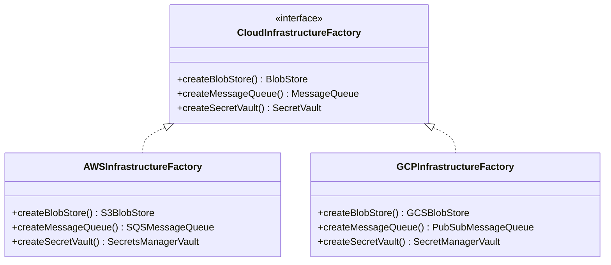
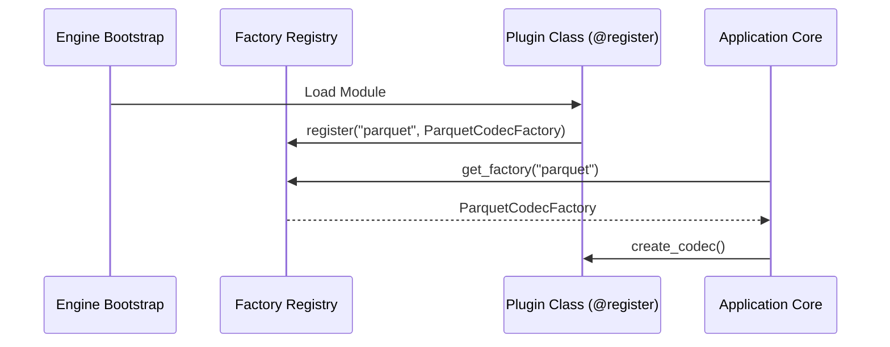

# Factory Method and Abstract Factory: Staff-Plus Deep Dive

## 1. Overview and Core Taxonomy

Creational patterns decouple object construction from business execution.
At Staff and Principal levels, factory patterns provide architectural boundaries that insulate core business domains from volatile third-party SDKs, operating system primitives, and cloud provider APIs.
Failing to isolate instantiation leaks concrete types into domain layers, destroying the Open/Closed Principle and severely restricting testability.

There are three distinct factory variants:
1. **Static Factory Method (Simple Factory)**: A single class with static methods returning instances based on arguments. Not an official GoF pattern, but widely used for clean constructor ergonomics.
2. **Factory Method (GoF)**: Defines an interface for creating an object, but lets subclasses decide which class to instantiate. Relies on inheritance or polymorphic delegation.
3. **Abstract Factory (GoF)**: Provides an interface for creating families of related or dependent objects without specifying their concrete classes. Relies on object composition.



---

## 2. Factory Method Pattern: Deep Dive

### 2.1 Intent and Structure
The Factory Method encapsulates object instantiation into a dedicated polymorphic method.
The client interacts exclusively with the product interface and the creator interface.
When a new product variant is needed, the engineer introduces a new creator subclass without modifying the core business processing loop.

### 2.2 The Self-Registering Plugin Pattern
In enterprise frameworks, hardcoding creator subclasses violates the Open/Closed Principle.
Instead, Staff engineers implement dynamic plugin registries where product types register themselves at module load or initialization time.
In C++, this is implemented using static initialization structs.
In Python, this is implemented using class decorators.
In Java, this is backed by the `ServiceLoader` (SPI) mechanism.



---

## 3. Abstract Factory Pattern: Deep Dive

### 3.1 Intent and Family Invariants
Abstract Factory is used when a system must configure multiple related products that belong to the same environmental family.
Mixing products across families introduces critical runtime failures (for example, attempting to authenticate an AWS S3 client using GCP Service Account credentials).
The Abstract Factory enforces a compile-time or runtime guarantee that all instantiated components originate from the same family.

### 3.2 Systems Comparison

| Dimension | Factory Method | Abstract Factory |
| :--- | :--- | :--- |
| **Instantiation Mechanism** | Inheritance (subclass overrides `create()`) | Composition (factory passed to client) |
| **Object Scope** | Manages a single polymorphic product | Manages an entire family of related products |
| **Extension Vector** | Easily add new product subtypes | Easily add new entire product families |
| **Modification Penalty** | Low; only creates a new subclass | High; adding a new product method changes all factory implementations |
| **Indirection Cost** | One virtual dispatch call | Two virtual dispatch calls (factory + product) |

---

## 4. Hardware and Performance Implications

1. **Virtual Dispatch and Inlining**:
   Both patterns introduce indirect virtual method calls via vtables.
   Compilers cannot inline virtual method calls unless Devirtualization optimizations can statically prove the concrete type at the callsite.
2. **Heap Allocation Overhead**:
   Factories commonly allocate products dynamically on the heap (`new` or `malloc`).
   In high-frequency trading or low-latency systems, allocating through polymorphic factories in hot loops causes cache line misses and garbage collection spikes.
   In these domains, static factory templates or placement-new memory pools are preferred.

---

## 5. Complete Production-Grade Simulation in Python

The following script implements a self-registering factory registry and an Abstract Factory suite provisioning multi-cloud cloud infrastructure (AWS vs GCP) with complete family invariant validation.

```python
"""
Factory Method and Abstract Factory Production Simulation.
Demonstrates:
1. Dynamic self-registering factory registry using class decorators.
2. Abstract Factory creating coordinated multi-cloud product families.
3. Invariant validation preventing cross-cloud family contamination.
"""

from abc import ABC, abstractmethod
from typing import Callable, Dict, Type


# =====================================================================
# 1. ABSTRACT PRODUCT DEFINITIONS
# =====================================================================

class BlobStorage(ABC):
    @abstractmethod
    def upload_blob(self, key: str, payload: bytes) -> str:
        pass


class MessageQueue(ABC):
    @abstractmethod
    def publish_message(self, topic: str, body: str) -> str:
        pass


class SecretVault(ABC):
    @abstractmethod
    def get_secret(self, secret_name: str) -> str:
        pass


# =====================================================================
# 2. CONCRETE PRODUCT FAMILIES
# =====================================================================

# AWS Family
class S3BlobStorage(BlobStorage):
    def upload_blob(self, key: str, payload: bytes) -> str:
        return f"s3://production-bucket/{key} (size={len(payload)})"


class SQSMessageQueue(MessageQueue):
    def publish_message(self, topic: str, body: str) -> str:
        return f"sqs.us-east-1.amazonaws.com/{topic} -> {body}"


class AWSSecretsManager(SecretVault):
    def get_secret(self, secret_name: str) -> str:
        return f"aws-secret-token-for-{secret_name}"


# GCP Family
class GCSBlobStorage(BlobStorage):
    def upload_blob(self, key: str, payload: bytes) -> str:
        return f"gs://gcp-prod-bucket/{key} (size={len(payload)})"


class PubSubMessageQueue(MessageQueue):
    def publish_message(self, topic: str, body: str) -> str:
        return f"projects/prod/topics/{topic} -> {body}"


class GCPSecretManager(SecretVault):
    def get_secret(self, secret_name: str) -> str:
        return f"gcp-secret-token-for-{secret_name}"


# =====================================================================
# 3. ABSTRACT FACTORY CONTRACT & CONCRETE FACTORIES
# =====================================================================

class CloudInfrastructureFactory(ABC):
    """Abstract Factory guaranteeing product family consistency."""
    @abstractmethod
    def cloud_name(self) -> str:
        pass

    @abstractmethod
    def create_blob_storage(self) -> BlobStorage:
        pass

    @abstractmethod
    def create_message_queue(self) -> MessageQueue:
        pass

    @abstractmethod
    def create_secret_vault(self) -> SecretVault:
        pass


# =====================================================================
# 4. DYNAMIC REGISTRATION SYSTEM
# =====================================================================

class CloudFactoryRegistry:
    """Dynamic registry allowing registration without modifying core code."""
    _registry: Dict[str, Type[CloudInfrastructureFactory]] = {}

    @classmethod
    def register(cls, provider_name: str) -> Callable[[Type[CloudInfrastructureFactory]], Type[CloudInfrastructureFactory]]:
        def decorator(subclass: Type[CloudInfrastructureFactory]) -> Type[CloudInfrastructureFactory]:
            cls._registry[provider_name.lower()] = subclass
            return subclass
        return decorator

    @classmethod
    def create_factory(cls, provider_name: str) -> CloudInfrastructureFactory:
        factory_cls = cls._registry.get(provider_name.lower())
        if not factory_cls:
            raise ValueError(f"Unknown cloud provider '{provider_name}'. Available: {list(cls._registry.keys())}")
        return factory_cls()


@CloudFactoryRegistry.register("aws")
class AWSInfrastructureFactory(CloudInfrastructureFactory):
    def cloud_name(self) -> str:
        return "AWS"

    def create_blob_storage(self) -> BlobStorage:
        return S3BlobStorage()

    def create_message_queue(self) -> MessageQueue:
        return SQSMessageQueue()

    def create_secret_vault(self) -> SecretVault:
        return AWSSecretsManager()


@CloudFactoryRegistry.register("gcp")
class GCPInfrastructureFactory(CloudInfrastructureFactory):
    def cloud_name(self) -> str:
        return "GCP"

    def create_blob_storage(self) -> BlobStorage:
        return GCSBlobStorage()

    def create_message_queue(self) -> MessageQueue:
        return PubSubMessageQueue()

    def create_secret_vault(self) -> SecretVault:
        return GCPSecretManager()


# =====================================================================
# 5. HIGH-LEVEL CLIENT ORCHESTRATION
# =====================================================================

class CloudIngestionPipeline:
    """Client operating strictly against Abstract Factory contracts."""
    def __init__(self, factory: CloudInfrastructureFactory):
        self.factory = factory
        self.storage = factory.create_blob_storage()
        self.queue = factory.create_message_queue()
        self.vault = factory.create_secret_vault()

    def ingest_payload(self, file_name: str, raw_data: bytes, topic: str) -> Dict[str, str]:
        # Authenticate via vault
        token = self.vault.get_secret("storage-credentials")
        # Store blob
        blob_uri = self.storage.upload_blob(file_name, raw_data)
        # Notify queue
        msg_receipt = self.queue.publish_message(topic, f"Stored {file_name}")

        return {
            "provider": self.factory.cloud_name(),
            "blob_uri": blob_uri,
            "queue_receipt": msg_receipt,
            "auth_token": token
        }


# =====================================================================
# VERIFICATION SUITE
# =====================================================================

def main():
    print("Executing Factory Method and Abstract Factory Verification Suite...")

    # 1. Test Factory Registry
    aws_factory = CloudFactoryRegistry.create_factory("aws")
    gcp_factory = CloudFactoryRegistry.create_factory("gcp")
    assert isinstance(aws_factory, AWSInfrastructureFactory)
    assert isinstance(gcp_factory, GCPInfrastructureFactory)
    print("Factory Registry Lookup: Passed.")

    # 2. Test AWS Ingestion Pipeline
    aws_pipeline = CloudIngestionPipeline(aws_factory)
    aws_result = aws_pipeline.ingest_payload("data.parquet", b"01010101", "raw-uploads")
    assert "s3://production-bucket/data.parquet" in aws_result["blob_uri"]
    assert "sqs.us-east-1.amazonaws.com" in aws_result["queue_receipt"]
    assert aws_result["provider"] == "AWS"
    print("AWS Product Family Integrity: Passed.")

    # 3. Test GCP Ingestion Pipeline
    gcp_pipeline = CloudIngestionPipeline(gcp_factory)
    gcp_result = gcp_pipeline.ingest_payload("metrics.csv", b"1,2,3", "metrics-topic")
    assert "gs://gcp-prod-bucket/metrics.csv" in gcp_result["blob_uri"]
    assert "projects/prod/topics" in gcp_result["queue_receipt"]
    assert gcp_result["provider"] == "GCP"
    print("GCP Product Family Integrity: Passed.")

    # 4. Test error handling for unregistered providers
    try:
        CloudFactoryRegistry.create_factory("azure")
        assert False, "Should have thrown ValueError for unknown provider"
    except ValueError:
        print("Unregistered Provider Rejection: Passed.")

    print("All Factory Method and Abstract Factory validations completed successfully.")


if __name__ == "__main__":
    main()
```

---

## 6. Active Recall Interview Questions

<details>
<summary>1. What is the fundamental structural difference between Factory Method and Abstract Factory?</summary>
Factory Method uses class inheritance: a creator superclass declares an abstract creation method, and subclasses override it to instantiate a single product.
Abstract Factory uses object composition: a factory object exposes multiple factory methods to instantiate a family of related products, and this factory instance is injected into the client.
</details>

<details>
<summary>2. Why does the Abstract Factory pattern enforce product family invariants?</summary>
In multi-tenant or multi-platform systems, products within a family (for example, S3 Storage and SQS Queue) are designed to work together.
By requiring the client to instantiate all products through a single injected Abstract Factory instance, the system prevents accidental cross-family mixing (such as attempting to route GCP Pub/Sub events into AWS credentials).
</details>

<details>
<summary>3. What is the primary weakness of the Abstract Factory pattern when the product family must evolve?</summary>
Abstract Factory is rigid with respect to adding new product types.
If the product family expands to require a new product (for example, `createDatabaseConnection()`), every existing concrete factory implementation in the codebase must be updated to implement the new method.
</details>

<details>
<summary>4. How does a dynamic self-registering factory registry satisfy the Open/Closed Principle?</summary>
A hardcoded factory requires modifying a central `switch-case` block whenever a new product type is created.
A self-registering registry allows new product classes to register their constructors in a shared map upon module initialization (via decorators, static blocks, or reflection).
New products can be added without modifying existing factory code.
</details>

<details>
<summary>5. How does virtual dispatch in factory patterns affect CPU instruction pipelining?</summary>
Polymorphic factories rely on virtual method tables (vtables), requiring an indirect branch at the CPU level.
Indirect branches cannot be easily predicted by hardware branch target buffers (BTB) if the concrete factory type varies dynamically, causing pipeline flushes and preventing compiler function inlining.
</details>

<details>
<summary>6. How can C++ templates eliminate the runtime vtable overhead of Factory patterns?</summary>
By using compile-time policy-based design or Curiously Recurring Template Pattern (CRTP).
Instead of virtual methods, the client accepts a template parameter `template <typename FactoryT> class IngestionPipeline`.
The compiler resolves method calls at compile time, enabling full function inlining and zero runtime dispatch overhead.
</details>

<details>
<summary>7. When should a Static Factory Method be used instead of a standard public constructor?</summary>
1. When constructors require descriptive names to clarify creation logic (for example, `BigInteger.probablePrime()` vs `BigInteger()`).
2. When constructor logic should not necessarily allocate a new object on every invocation (such as returning cached or pooled flyweights).
3. When the method can return a subtype of the declared return type.
</details>

<details>
<summary>8. In Java, what standard JDK mechanism provides an out-of-the-box self-registering Abstract Factory?</summary>
The Java Service Provider Interface (SPI) via `java.util.ServiceLoader`.
Providers package implementations with a metadata configuration file in `META-INF/services/`, allowing the runtime to dynamically discover and instantiate concrete factories without compile-time coupling.
</details>

<details>
<summary>9. What is the difference between a Simple Factory and the GoF Factory Method pattern?</summary>
A Simple Factory is a single concrete class containing a conditional switch statement that returns various product types.
The GoF Factory Method pattern relies on polymorphism: it defines an abstract creator interface, deferring the choice of concrete product creation to individual subclasses.
</details>

<details>
<summary>10. How does the Abstract Factory pattern interact with Dependency Injection frameworks (such as Spring or Guice)?</summary>
In modern DI frameworks, the framework container itself functions as an ambient Abstract Factory.
Rather than manually writing concrete factory classes, developers bind interfaces to implementations within DI modules, and the container injects coordinated product graphs into client components.
</details>
