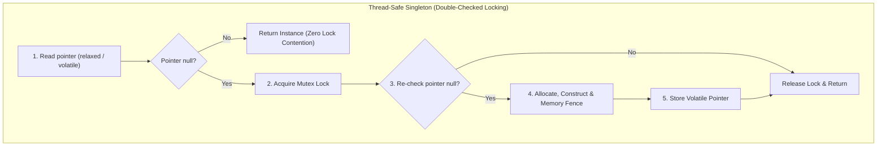
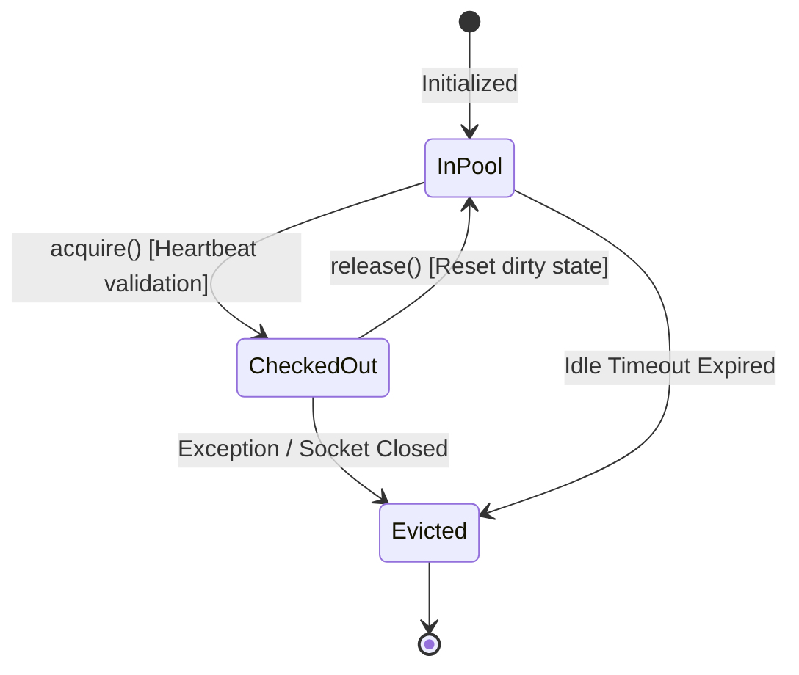

# Singleton and Object Pool Patterns: Staff-Plus Deep Dive

## 1. Overview and Core Philosophy

Creational resource governance is critical when managing physical operating system handles, hardware devices, and network sockets.
Two historical patterns address these concerns:
1. **Singleton Pattern**: Guarantees that a class possesses exactly one instance and provides an ambient global access point.
2. **Object Pool Pattern**: Manages a bounded cache of reusable, expensive-to-initialize objects (such as database connections, thread workers, or zero-allocation byte buffers).

At the Staff and Principal engineering level, the classical Singleton is heavily criticized as an architectural anti-pattern because it introduces hidden global state and impairs unit test isolation.
Conversely, the Object Pool is an essential systems pattern in low-latency infrastructure to avoid heap allocation thrashing and kernel socket creation overhead.



---

## 2. Singleton: Concurrency Hazards and Memory Models

### 2.1 The Classic Double-Checked Locking (DCL) Broken Pattern
Prior to Java 5 and C++11, Double-Checked Locking was fundamentally broken due to out-of-order execution and compiler instruction reordering.
Consider:
```cpp
// BROKEN Double-Checked Locking without memory fences
if (instance == nullptr) {
    lock_guard<mutex> lock(mtx);
    if (instance == nullptr) {
        instance = new HeavyweightService(); // Hazard!
    }
}
```
At the machine level, `instance = new HeavyweightService()` performs three distinct operations:
1. Allocate raw heap memory: `ptr = malloc(sizeof(HeavyweightService))`
2. Construct the object in-place: `construct(ptr)`
3. Assign pointer: `instance = ptr`

The compiler or out-of-order CPU pipeline may legally reorder step 3 before step 2:
```
1. Allocate memory -> ptr
2. instance = ptr    (instance is now NON-NULL, but UNINITIALIZED!)
3. construct(ptr)   (Runs field initialization)
```
If Thread B enters `getInstance()` during this precise microsecond window between steps 2 and 3, it observes `instance != nullptr`, bypasses the mutex lock, and accesses half-initialized memory fields, resulting in silent memory corruption or segmentation faults.

### 2.2 Fixes Across Modern Languages
1. **Java**: Declare `private static volatile HeavyweightService instance`. The `volatile` modifier establishes a happens-before relationship, enforcing acquire-release memory fences that prohibit instruction reordering across the write barrier.
2. **C++11 (Meyers Singleton)**:
   ```cpp
   static HeavyweightService& getInstance() {
       static HeavyweightService instance; // Thread-safe by C++11 standard (§6.7 [stmt.dcl])
       return instance;
   }
   ```
   The C++11 standard mandates that local static variables are initialized exactly once in a thread-safe manner using internal compiler guard locks.
3. **Java Enum Singleton**: Josh Bloch's canonical idiom: an enum with a single element. Guarantees thread safety, reflection immunity, and serialization safety out-of-the-box.

---

## 3. Object Pool Pattern: Architecture and Lifecycle

Creating TCP connections or thread stacks incurs high kernel context-switching and socket-handshake overhead.
An Object Pool pre-allocates and recycles a bounded set of resources.



### 3.1 Critical Engineering Subsystems
1. **Bounded Capacity and Backpressure**: The pool must enforce a hard upper bound (`max_capacity`). When exhausted, callers block on a condition variable with an explicit timeout, failing fast instead of causing thread starvation.
2. **Dirty State Scrubbing**: Before returning a borrowed resource back to the pool, the borrower must reset all session variables, transaction flags, and buffers to prevent data leakage across tenants.
3. **Health Check Probing**: The pool validates connections on acquisition (`testOnBorrow`) or periodically via a background reaper thread to evict dead sockets cleanly.
4. **Leak Detection**: Tracks loan timestamps. If a consumer checks out an object and fails to return it within a timeout threshold, an alert or stack trace is recorded to locate the unclosed resource.

---

## 4. Systems Trade-offs and Comparison

| Dimension | Singleton Pattern | Object Pool Pattern |
| :--- | :--- | :--- |
| **Instance Count** | Exactly 1 | Bounded $N$ (e.g., min: 10, max: 100) |
| **Concurrency Model** | Read-heavy concurrent shared access | Exclusive loan ownership per calling thread |
| **Memory Footprint** | Constant | Variable; scales with pool demand |
| **Primary Risk** | Global mutable state, untestable mocks | Resource exhaustion, leaked loans, connection leaks |
| **Alternative** | Dependency Injection singleton scope | Thread-local caches, non-blocking asynchronous event loops |

---

## 5. Complete Production-Grade Simulation in Python

The following script implements:
1. A **Thread-Safe Double-Checked Locking Singleton** with atomic memory barrier semantics.
2. A **Bounded Reusable Connection Pool** with health checks, timeout backpressure, and unclosed leak detection.

```python
"""
Singleton and Object Pool Patterns Production Simulation.
Demonstrates:
1. Concurrency-safe Double-Checked Locking Singleton.
2. Bounded Object Pool with blocking acquisition timeouts.
3. Resource health validation and dirty state cleanup on return.
4. Loan tracking and leaked resource eviction.
"""

from abc import ABC, abstractmethod
import queue
import threading
import time
from typing import Dict, List, Optional
import uuid


# =====================================================================
# 1. THREAD-SAFE DOUBLE-CHECKED LOCKING SINGLETON
# =====================================================================

class AppTelemetryService:
    """Thread-safe Singleton using double-checked locking."""
    _instance: Optional['AppTelemetryService'] = None
    _lock: threading.Lock = threading.Lock()

    def __init__(self):
        if AppTelemetryService._instance is not None:
            raise RuntimeError("Direct instantiation prohibited. Invoke get_instance().")
        self.metrics_counter: int = 0
        self._metric_lock: threading.Lock = threading.Lock()

    @classmethod
    def get_instance(cls) -> 'AppTelemetryService':
        # First check (unlocked for high throughput)
        if cls._instance is None:
            with cls._lock:
                # Second check (locked against race condition)
                if cls._instance is None:
                    # Atomic assignment in Python
                    cls._instance = cls()
        return cls._instance

    def increment(self) -> None:
        with self._metric_lock:
            self.metrics_counter += 1


# =====================================================================
# 2. OBJECT POOL PATTERN (DATABASE CONNECTION POOL)
# =====================================================================

class PooledDatabaseConnection:
    """Expensive resource managed by the object pool."""
    def __init__(self, conn_id: str):
        self.conn_id = conn_id
        self.is_healthy = True
        self.transaction_active = False
        self.last_used_time = time.time()

    def execute_query(self, sql: str) -> str:
        if not self.is_healthy:
            raise RuntimeError(f"Connection {self.conn_id} is dead.")
        self.last_used_time = time.time()
        return f"Result of [{sql}] via {self.conn_id}"

    def reset_state(self) -> None:
        """Dirty state scrubbing before returning to pool."""
        self.transaction_active = False


class BoundedConnectionPool:
    """Production-grade bounded pool managing reusable connections."""
    def __init__(self, min_size: int = 2, max_size: int = 5, acquire_timeout_sec: float = 1.0):
        self.min_size = min_size
        self.max_size = max_size
        self.acquire_timeout_sec = acquire_timeout_sec

        self._available_pool: queue.Queue[PooledDatabaseConnection] = queue.Queue(maxsize=max_size)
        self._all_connections: List[PooledDatabaseConnection] = []
        self._active_loans: Dict[str, float] = {}  # conn_id -> checkout timestamp
        self._lock = threading.Lock()

        # Pre-allocate minimum connections
        for _ in range(min_size):
            self._create_new_connection()

    def _create_new_connection(self) -> PooledDatabaseConnection:
        conn = PooledDatabaseConnection(f"conn-{uuid.uuid4().hex[:6]}")
        self._all_connections.append(conn)
        self._available_pool.put(conn)
        return conn

    def acquire(self) -> PooledDatabaseConnection:
        """Acquire a connection with timeout backpressure and health check."""
        start_time = time.time()
        while True:
            remaining = self.acquire_timeout_sec - (time.time() - start_time)
            if remaining <= 0:
                raise TimeoutError("Connection pool exhausted: acquire timeout exceeded.")

            try:
                conn = self._available_pool.get(timeout=remaining)
            except queue.Empty:
                # Try dynamic pool expansion if under max_size
                with self._lock:
                    if len(self._all_connections) < self.max_size:
                        conn = self._create_new_connection()
                        # Immediately take it
                        self._available_pool.get_nowait()
                    else:
                        raise TimeoutError("Connection pool exhausted: max capacity reached.")

            # Health validation (test on borrow)
            if conn.is_healthy:
                with self._lock:
                    self._active_loans[conn.conn_id] = time.time()
                return conn
            else:
                # Evict dead connection and replace
                with self._lock:
                    self._all_connections.remove(conn)
                    self._create_new_connection()

    def release(self, conn: PooledDatabaseConnection) -> None:
        """Return resource back to pool with dirty state reset."""
        with self._lock:
            if conn.conn_id not in self._active_loans:
                raise ValueError("Attempted to release connection not tracked in active loans.")
            del self._active_loans[conn.conn_id]

        conn.reset_state()
        self._available_pool.put(conn)

    def active_loan_count(self) -> int:
        with self._lock:
            return len(self._active_loans)

    def available_count(self) -> int:
        return self._available_pool.qsize()


# =====================================================================
# VERIFICATION SUITE
# =====================================================================

def main():
    print("Executing Singleton and Object Pool Verification Suite...")

    # 1. Verify Singleton identity across threads
    instances: List[AppTelemetryService] = []

    def fetch_singleton():
        inst = AppTelemetryService.get_instance()
        instances.append(inst)

    threads = [threading.Thread(target=fetch_singleton) for _ in range(10)]
    for t in threads:
        t.start()
    for t in threads:
        t.join()

    first_instance = instances[0]
    for inst in instances:
        assert inst is first_instance
    print("Singleton Concurrency Identity: Passed.")

    # 2. Verify Object Pool Acquire and Release
    pool = BoundedConnectionPool(min_size=2, max_size=3, acquire_timeout_sec=0.5)
    assert pool.available_count() == 2

    c1 = pool.acquire()
    c2 = pool.acquire()
    assert pool.active_loan_count() == 2
    assert pool.available_count() == 0

    res = c1.execute_query("SELECT 1")
    assert "Result of [SELECT 1]" in res

    # Release c1
    pool.release(c1)
    assert pool.active_loan_count() == 1
    assert pool.available_count() == 1
    print("Object Pool Loan & Return: Passed.")

    # 3. Dynamic pool expansion up to max_size
    c3 = pool.acquire()
    c4 = pool.acquire()  # Expands pool to max_size 3
    assert pool.active_loan_count() == 3

    # 4. Verify pool exhaustion backpressure timeout
    try:
        pool.acquire()
        assert False, "Should have thrown TimeoutError when pool exceeded max capacity"
    except TimeoutError:
        print("Pool Exhaustion Backpressure: Passed.")

    # Cleanup
    pool.release(c2)
    pool.release(c3)
    pool.release(c4)
    assert pool.active_loan_count() == 0
    assert pool.available_count() == 3
    print("Pool Full Recovery: Passed.")

    print("All Singleton and Object Pool validations completed successfully.")


if __name__ == "__main__":
    main()
```

---

## 6. Active Recall Interview Questions

<details>
<summary>1. Why was Double-Checked Locking fundamentally broken in early Java and C++ versions?</summary>
Compilers and out-of-order CPUs can reorder the instructions for object construction.
During `instance = new Foo()`, pointer assignment can be executed before the object constructor completes.
Another thread performing an unsynchronized null check observes a non-null pointer and accesses uninitialized memory, leading to silent memory corruption.
</details>

<details>
<summary>2. How does the Java `volatile` keyword fix the Double-Checked Locking hazard?</summary>
In Java 5+, `volatile` establishes an acquire-release memory barrier (happens-before relationship).
Writes to a volatile variable cannot be reordered after preceding writes, and reads from volatile cannot be reordered before subsequent reads.
This guarantees that the object constructor completes fully before the memory address is published to `instance`.
</details>

<details>
<summary>3. What is a Meyers Singleton in C++, and why is it guaranteed to be thread-safe?</summary>
A Meyers Singleton defines the singleton instance as a local static variable inside a static member function:
`static Foo& get() { static Foo instance; return instance; }`.
The C++11 standard (§6.7) explicitly mandates that local static variables are initialized concurrently safely using compiler-generated guard flags, eliminating manual mutex synchronization.
</details>

<details>
<summary>4. Why do Staff Engineers consider Singleton an architectural anti-pattern?</summary>
1. It introduces hidden global mutable state, creating tight coupling across unrelated modules.
2. It breaks unit test isolation because state persists across tests, causing non-deterministic test order dependencies.
3. It violates the Single Responsibility Principle by combining business logic with lifecycle creation control.
4. It eliminates polymorphism and mock substitution seams.
</details>

<details>
<summary>5. What are the three primary acquisition failure policies when an Object Pool is exhausted?</summary>
1. **Blocking with Timeout (Backpressure)**: The calling thread blocks on a condition variable until a resource is returned or a timeout expires.
2. **Fail-Fast**: The pool immediately throws a `PoolExhaustedException` without waiting.
3. **Elastic Dynamic Growth**: The pool allocates temporary overflow objects beyond its normal threshold, tearing them down upon return.
</details>

<details>
<summary>6. What is 'dirty state scrubbing' in an Object Pool, and why is it critical for multi-tenant systems?</summary>
When a borrowed connection executes transactions or mutates session variables (such as temporary tables, isolation levels, or security contexts), returning it as-is leaks dirty state to the next caller.
Scrubbing resets all state (issuing `ROLLBACK`, clearing caches, resetting socket timeouts) before returning the object to the idle pool.
</details>

<details>
<summary>7. How do modern Object Pools implement leaked connection detection?</summary>
When an object is checked out, the pool records the loan timestamp along with a captured stack trace of the calling thread.
A background reaper thread periodically scans active loans.
If a loan exceeds a configurable threshold (e.g., 30 seconds), the pool logs an alert containing the allocation stack trace to pinpoint the unclosed resource.
</details>

<details>
<summary>8. In Java, why is an Enum the safest implementation of a Singleton?</summary>
Java enums are guaranteed by the JVM specification to be instantiated exactly once per class loader.
The JVM automatically handles thread safety, prevents reflection-based attacks (constructor reflection throws `IllegalArgumentException`), and ensures correct deserialization without implementing `readResolve()`.
</details>

<details>
<summary>9. What is the difference between `testOnBorrow` and background health checks in a connection pool?</summary>
`testOnBorrow` sends a ping (e.g., `SELECT 1`) synchronously on the caller thread before returning the borrowed connection, adding latency to every request.
Background health checking runs asynchronously on a dedicated reaper thread, pinging idle connections out-of-band and eliminating latency overhead on the application hot path.
</details>

<details>
<summary>10. When should you choose ThreadLocal storage over an Object Pool?</summary>
When resources are lightweight, thread counts are small and predictable, and avoiding any synchronization overhead is paramount.
ThreadLocal grants each thread its own dedicated instance without lock contention.
However, ThreadLocal is dangerous in unbounded thread pools or asynchronous event loops where tasks hop between threads.
</details>
