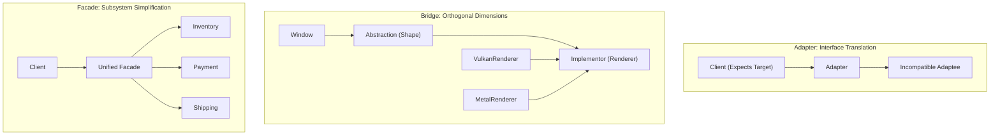
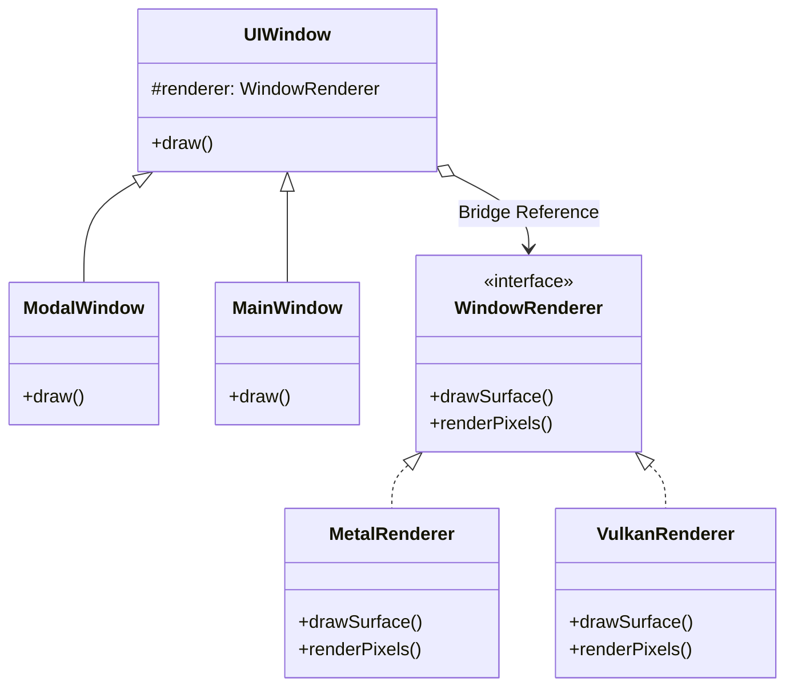
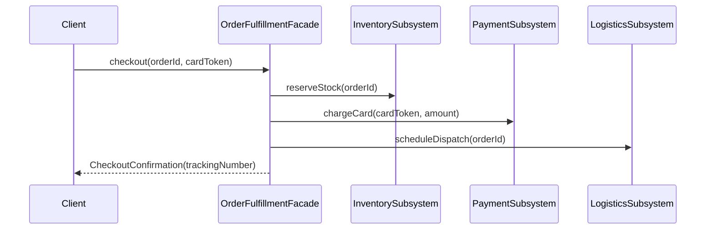

# Adapter, Bridge, and Facade Patterns: Staff-Plus Deep Dive

## 1. Overview and Structural Philosophy

Structural design patterns govern how classes and objects are composed into larger, resilient systems.
In large-scale enterprise architectures, systems inevitably interface with legacy APIs, multi-platform runtime drivers, and sprawling subsystems.
Three foundational patterns address these structural boundaries:
1. **Adapter Pattern**: Converts the interface of an existing incompatible class into an expected target interface.
2. **Bridge Pattern**: Decouples an abstraction from its implementation so both can vary independently, eliminating combinatorial class explosions.
3. **Facade Pattern**: Provides a simplified, high-level entry point over a complex cluster of subsystem interfaces.



---

## 2. Adapter Pattern: Class vs Object Adapter

### 2.1 The Two Adapter Variants
1. **Class Adapter**: Uses multiple inheritance to inherit both the expected target interface and the existing adaptee class. Rigid; couples the adapter directly to the adaptee's concrete implementation.
2. **Object Adapter**: Uses object composition. The adapter implements the target interface and holds an internal reference to the adaptee instance. Flexible; can adapt any subclass of the adaptee.

### 2.2 Two-Way and Plug-In Adapters
A Two-Way Adapter implements both interfaces simultaneously, allowing an object to be consumed transparently by both legacy and modern client subsystems.
In systems integration, adapters frequently act as Anti-Corruption Layers (ACL), translating external third-party DTOs into domain value objects while stripping external quirks.

---

## 3. Bridge Pattern: Eliminating Combinatorial Class Explosions

### 3.1 The $M \times N$ Class Explosion Problem
Consider a cross-platform graphics library supporting 3 GUI abstractions (`Dialog`, `Button`, `Window`) across 3 rendering APIs (`DirectX`, `Metal`, `Vulkan`).
Using standard inheritance requires $3 \times 3 = 9$ distinct leaf classes: `DirectXDialog`, `MetalDialog`, `VulkanDialog`, `DirectXButton`, and so on.
Adding a 4th renderer requires creating 3 new classes; adding a 4th GUI abstraction requires creating 4 new classes.

The Bridge pattern splits the design into two independent hierarchies:
- **Abstraction Hierarchy**: High-level domain logic (`Dialog`, `Window`).
- **Implementor Hierarchy**: Low-level platform primitives (`DirectXRenderer`, `MetalRenderer`).
The Abstraction holds a composition bridge pointer to the Implementor, reducing the class count to $M + N$ ($3 + 3 = 6$ classes).



### 3.2 The C++ PIMPL Idiom (Pointer to Implementation)
In C++, the PIMPL idiom is a concrete application of the Bridge pattern to establish compilation firewalls.
By placing private member variables inside an opaque forward-declared implementation struct (`struct Impl; std::unique_ptr<Impl> pImpl;`), changing internal class fields does not modify the public header file.
This prevents rebuilding hundreds of downstream compilation translation units when private details change.

---

## 4. Facade Pattern: Subsystem Encapsulation

### 4.1 Intent and Boundaries
The Facade provides a cohesive, unified interface over complex subsystems without hiding the underlying subsystem from power users.
Unlike an Adapter (which changes an interface to match an existing specification), a Facade creates a completely new, simplified interface.
Unlike a Mediator (which centralizes bidirectional communication among subsystem peers), a Facade handles unidirectional high-level client requests down to the subsystem.



---

## 5. Comparative Systems Matrix

| Feature | Adapter Pattern | Bridge Pattern | Facade Pattern |
| :--- | :--- | :--- | :--- |
| **Primary Intent** | Make incompatible interfaces work together. | Decouple abstraction from implementation. | Provide a simple entry point to a subsystem. |
| **Timing of Use** | Applied retroactively after systems exist. | Designed proactively up-front. | Applied when subsystems grow complex. |
| **Interface Change** | Adapts an existing interface to an expected one. | Connects two separate interface hierarchies. | Introduces a new simplified high-level interface. |
| **Object Multiplicity** | Typically 1-to-1 (adapter wraps adaptee). | 1-to-1 composition (abstraction has implementor). | 1-to-Many (facade wraps multiple subsystems). |

---

## 6. Complete Production-Grade Simulation in Python

The following script implements:
1. An **Object Adapter** bridging an old XML-based payment gateway to a modern JSON domain interface.
2. A **Cross-Platform Bridge** separating UI Windows from hardware rendering engines (Vulkan vs Metal).
3. An **Order Fulfillment Facade** coordinating inventory, billing, and logistics subsystems atomically.

```python
"""
Adapter, Bridge, and Facade Patterns Production Simulation.
Demonstrates:
1. Object Adapter: Converting legacy XML payloads to modern domain requests.
2. Bridge Pattern: Decoupling UI Abstraction from Hardware Renderers.
3. Facade Pattern: Orchestrating complex order checkout across 3 subsystems.
"""

from abc import ABC, abstractmethod
from typing import Dict, List, Optional
import xml.etree.ElementTree as ET


# =====================================================================
# 1. ADAPTER PATTERN (LEGACY XML TO MODERN DOMAIN)
# =====================================================================

class ModernPaymentGateway(ABC):
    """Target domain interface expected by modern application."""
    @abstractmethod
    def process_transaction(self, account_id: str, amount_cents: int) -> Dict[str, str]:
        pass


class LegacySoapXmlPaymentService:
    """Adaptee: Third-party legacy service accepting raw XML strings."""
    def send_xml_payload(self, raw_xml: str) -> str:
        root = ET.fromstring(raw_xml)
        acc = root.find("account").text  # type: ignore
        amt = root.find("amount").text   # type: ignore
        return f"<response><status>APPROVED</status><tx_id>TX-XML-9988</tx_id><account>{acc}</account></response>"


class LegacyPaymentAdapter(ModernPaymentGateway):
    """Object adapter bridging ModernPaymentGateway to LegacySoapXmlPaymentService."""
    def __init__(self, legacy_service: LegacySoapXmlPaymentService):
        self._legacy = legacy_service

    def process_transaction(self, account_id: str, amount_cents: int) -> Dict[str, str]:
        # Transform domain parameters into legacy XML format
        xml_request = (
            f"<paymentRequest>"
            f"<account>{account_id}</account>"
            f"<amount>{amount_cents / 100:.2f}</amount>"
            f"</paymentRequest>"
        )

        xml_response = self._legacy.send_xml_payload(xml_request)

        # Parse legacy response back to domain dictionary
        root = ET.fromstring(xml_response)
        status = root.find("status").text or "FAILED"  # type: ignore
        tx_id = root.find("tx_id").text or "UNKNOWN"   # type: ignore

        return {"status": status, "transaction_id": tx_id}


# =====================================================================
# 2. BRIDGE PATTERN (CROSS-PLATFORM RENDERING)
# =====================================================================

class RenderEngineImplementor(ABC):
    """Implementor hierarchy: Hardware graphics driver primitives."""
    @abstractmethod
    def render_primitive(self, shape_name: str, width: int, height: int) -> str:
        pass


class MetalRenderer(RenderEngineImplementor):
    def render_primitive(self, shape_name: str, width: int, height: int) -> str:
        return f"[Apple Metal API] Drawing {shape_name} ({width}x{height}) on GPU pipeline"


class VulkanRenderer(RenderEngineImplementor):
    def render_primitive(self, shape_name: str, width: int, height: int) -> str:
        return f"[Khronos Vulkan API] Drawing {shape_name} ({width}x{height}) via CommandBuffer"


class WindowAbstraction(ABC):
    """Abstraction hierarchy: High-level UI Window concepts."""
    def __init__(self, renderer: RenderEngineImplementor):
        self._renderer = renderer  # Bridge link

    @abstractmethod
    def display(self) -> str:
        pass


class DesktopWindow(WindowAbstraction):
    def __init__(self, renderer: RenderEngineImplementor, width: int, height: int):
        super().__init__(renderer)
        self.width = width
        self.height = height

    def display(self) -> str:
        return self._renderer.render_primitive("DesktopWindow", self.width, self.height)


class ModalDialog(WindowAbstraction):
    def __init__(self, renderer: RenderEngineImplementor, title: str):
        super().__init__(renderer)
        self.title = title

    def display(self) -> str:
        return f"Modal '{self.title}' -> " + self._renderer.render_primitive("DialogBox", 400, 200)


# =====================================================================
# 3. FACADE PATTERN (ORDER FULFILLMENT SUBSYSTEM)
# =====================================================================

class InventorySubsystem:
    def reserve_stock(self, sku: str, quantity: int) -> bool:
        return quantity <= 100  # Stock availability simulation


class BillingSubsystem:
    def charge_account(self, account_id: str, amount: float) -> str:
        return "CHARGE_OK_REF_441"


class LogisticsSubsystem:
    def schedule_courier(self, sku: str, destination_address: str) -> str:
        return "TRACKING-XYZ-7789"


class OrderFulfillmentFacade:
    """Unified Facade orchestrating disparate subsystems atomically."""
    def __init__(self):
        self._inventory = InventorySubsystem()
        self._billing = BillingSubsystem()
        self._logistics = LogisticsSubsystem()

    def place_order(self, sku: str, quantity: int, account_id: str, address: str) -> Dict[str, str]:
        # Step 1: Inventory check
        if not self._inventory.reserve_stock(sku, quantity):
            raise RuntimeError(f"Insufficient stock for SKU: {sku}")

        # Step 2: Payment billing
        payment_ref = self._billing.charge_account(account_id, 49.99 * quantity)

        # Step 3: Courier dispatch
        tracking_num = self._logistics.schedule_courier(sku, address)

        return {
            "order_status": "CONFIRMED",
            "payment_reference": payment_ref,
            "tracking_number": tracking_num
        }


# =====================================================================
# VERIFICATION SUITE
# =====================================================================

def main():
    print("Executing Adapter, Bridge, and Facade Verification Suite...")

    # 1. Adapter Verification
    legacy_soap = LegacySoapXmlPaymentService()
    adapter = LegacyPaymentAdapter(legacy_soap)
    payment_result = adapter.process_transaction("ACC-883", 5000)
    assert payment_result["status"] == "APPROVED"
    assert payment_result["transaction_id"] == "TX-XML-9988"
    print("Object Adapter XML Translation: Passed.")

    # 2. Bridge Verification
    metal = MetalRenderer()
    vulkan = VulkanRenderer()

    desktop_on_metal = DesktopWindow(metal, 1920, 1080)
    modal_on_vulkan = ModalDialog(vulkan, "Confirm Delete")

    assert "Apple Metal API" in desktop_on_metal.display()
    assert "Khronos Vulkan API" in modal_on_vulkan.display()
    assert "Modal 'Confirm Delete'" in modal_on_vulkan.display()
    print("Bridge Decoupled Hierarchy: Passed.")

    # 3. Facade Verification
    facade = OrderFulfillmentFacade()
    order_receipt = facade.place_order("LAPTOP-PRO-16", 1, "CUST-44", "100 Silicon Way")
    assert order_receipt["order_status"] == "CONFIRMED"
    assert order_receipt["tracking_number"] == "TRACKING-XYZ-7789"
    assert order_receipt["payment_reference"] == "CHARGE_OK_REF_441"
    print("Unified Subsystem Facade: Passed.")

    # Facade error path
    try:
        facade.place_order("LAPTOP-PRO-16", 9999, "CUST-44", "Nowhere")
        assert False, "Should have failed on stock reservation"
    except RuntimeError:
        print("Facade Exception Isolation: Passed.")

    print("All Adapter, Bridge, and Facade validations completed successfully.")


if __name__ == "__main__":
    main()
```

---

## 7. Active Recall Interview Questions

<details>
<summary>1. What is the fundamental design difference between the Adapter and Facade patterns?</summary>
An Adapter converts an existing incompatible interface into a specific target interface expected by a client, preserving a 1-to-1 relationship with the adaptee.
A Facade introduces a brand-new, simplified high-level interface over a cluster of multiple complex subsystems (1-to-many relationship).
</details>

<details>
<summary>2. How does the Bridge pattern prevent a combinatorial $M \times N$ class hierarchy explosion?</summary>
By separating two orthogonal dimensions of variation into two independent hierarchies: an Abstraction hierarchy and an Implementor hierarchy.
The Abstraction holds a bridge pointer to the Implementor.
New abstractions or implementors can be added independently, reducing the total class count from $M \times N$ to $M + N$.
</details>

<details>
<summary>3. What is the difference between a Class Adapter and an Object Adapter?</summary>
A Class Adapter uses multiple inheritance (inherits both the Target interface and the Adaptee class), coupling it to a single concrete adaptee.
An Object Adapter uses composition (implements the Target interface and holds an internal reference to the Adaptee), allowing it to adapt any subclass of the adaptee polymorphically.
</details>

<details>
<summary>4. How does the C++ PIMPL idiom use the Bridge pattern to establish compilation firewalls?</summary>
The public class header declares only an opaque forward-declared pointer to an implementation struct (`struct Impl; std::unique_ptr<Impl> pImpl;`).
All private fields and implementation headers live exclusively in the `.cpp` file.
Modifying private fields never alters the public header, preventing recompilation cascades across consuming translation units.
</details>

<details>
<summary>5. Can a client bypass a Facade and interact with the underlying subsystem classes directly?</summary>
Yes.
A Facade provides a convenient, simplified view for standard use cases, but does not strictly encapsulate or forbid access to the underlying subsystems if power users require granular control.
</details>

<details>
<summary>6. What is an Anti-Corruption Layer (ACL) in Domain-Driven Design, and which pattern underpins it?</summary>
An Anti-Corruption Layer is an architectural boundary that translates between two disparate domain models (for example, between a legacy monolith and a modern microservice).
It is implemented using the Adapter and Facade patterns to sanitize external data models and ensure domain model purity.
</details>

<details>
<summary>7. What is the performance overhead of using the Bridge pattern at the CPU hardware level?</summary>
Each call through a bridge requires dereferencing the implementor pointer and invoking a virtual method through its vtable.
This adds pointer chasing overhead, potential cache line misses (if the abstraction and implementor reside in separate memory pages), and prevents compiler function inlining.
</details>

<details>
<summary>8. In what way does an Adapter differ from a Decorator?</summary>
An Adapter changes the interface of an object to make it compatible with another interface, but does not intend to enhance behavior.
A Decorator preserves the exact interface of an object, adding new dynamic behaviors or responsibilities transparently.
</details>

<details>
<summary>9. What is a Two-Way Adapter, and when is it required?</summary>
A Two-Way Adapter implements two distinct interfaces simultaneously (for example, both `OldPaymentInterface` and `NewPaymentInterface`).
It allows a single adapted object to be passed interchangeably to legacy consumers and modern consumers during incremental system migration.
</details>

<details>
<summary>10. Under what conditions should you avoid using the Facade pattern?</summary>
When the subsystem is already small, cohesive, and easy to use directly.
Creating a Facade for a subsystem with only one or two simple classes introduces redundant boilerplate without providing any decoupling benefits.
</details>
