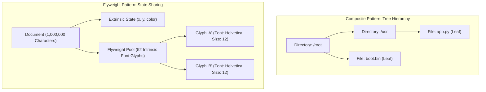
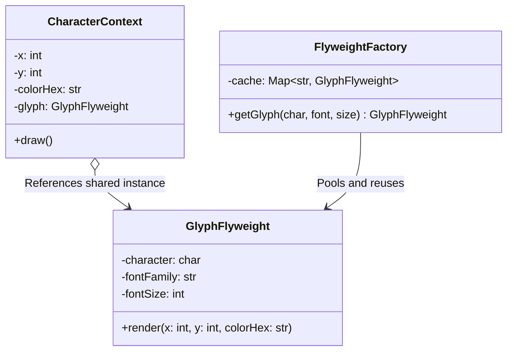

# Composite and Flyweight Patterns: Staff-Plus Deep Dive

## 1. Overview and Memory Architecture

The **Composite** and **Flyweight** patterns represent two opposing yet complementary approaches to managing large-scale object structures:
- **Composite Pattern**: Organizes objects into recursive tree hierarchies to represent part-whole structures, allowing clients to treat individual leaf objects and compound branches uniformly.
- **Flyweight Pattern**: Compresses memory consumption when millions of fine-grained objects must be maintained, sharing immutable intrinsic state while passing mutable extrinsic state externally.

At Staff and Principal levels, both patterns sit at the intersection of object-oriented design and hardware mechanical sympathy.
Composite navigates complex topologies at the cost of pointer chasing; Flyweight achieves massive RAM reductions by eliminating redundant object state.



---

## 2. Composite Pattern: Deep Dive

### 2.1 Uniformity vs Safety: The Classic Design Tension
When designing a Composite hierarchy, engineers face a core design trade-off:
1. **Transparency (Uniform Interface)**:
   Every method (`add()`, `remove()`, `getChild()`) is declared on the root Component interface.
   Leaves and composites share the exact same API.
   However, this sacrifices type safety: calling `leaf.add(child)` must either fail silently or throw a runtime exception.
2. **Safety (Type-Segregated Interface)**:
   Management methods (`add()`, `remove()`) are declared exclusively on the `Composite` class, not on `Component` or `Leaf`.
   Leaves cannot be called with invalid container methods at compile time.
   However, clients must perform downcasts (`instanceof` / dynamic casting) to invoke child management operations, losing transparent uniformity.

### 2.2 Cache Locality Penalties in Tree Traversal
In a classic pointer-linked Composite tree, nodes are independently allocated across disparate regions of the heap.
Traversing a large composite tree triggers frequent CPU cache line misses and pointer dereferences.
For performance-critical systems (such as high-performance UI scene graphs or game game-object trees), Data-Oriented Design (DOD) replaces pointer trees with contiguous flat arrays storing node indices.

---

## 3. Flyweight Pattern: Intrinsic vs Extrinsic State

### 3.1 Formal State Decomposition
The Flyweight pattern divides an object's data into two distinct categories:

| State Category | Definition | Storage Location | Mutability | Example |
| :--- | :--- | :--- | :--- | :--- |
| **Intrinsic State** | Invariant, independent of context; identical across all occurrences. | Stored internally inside the Flyweight instance. | Strictly Immutable. | Font family, character glyph vector paths, texture bitmaps. |
| **Extrinsic State** | Variant, context-dependent; unique to each individual occurrence. | Stored externally by the client context. | Passed as parameters during method invocation. | Screen (X, Y) coordinates, color tint, scale factor, selection state. |



### 3.2 Real-World Flyweights in Standard Runtimes
1. **Java `Integer.valueOf(int)`**:
   Caches and reuses flyweight `Integer` instances for values between -128 and 127.
2. **String Interning (`String.intern()`)**:
   Maintains a global hash table of distinct string values. All references to identical string literals share the same immutable underlying char array.

---

## 4. Complete Production-Grade Simulation in Python

The following script implements:
1. A **Transparent Composite File System** supporting uniform size calculation and recursive tree traversal.
2. A **Flyweight Character Rendering Engine** proving that 100,000 document characters share fewer than 30 unique flyweight instances in memory.

```python
"""
Composite and Flyweight Patterns Production Simulation.
Demonstrates:
1. Composite Pattern: Recursive tree hierarchy representing a virtual file system.
2. Uniform operation execution (calculating total recursive byte size).
3. Flyweight Pattern: Intrinsic vs extrinsic state separation for document glyphs.
4. Memory optimization proof verifying massive reference sharing.
"""

from abc import ABC, abstractmethod
from typing import Dict, List, Optional
import sys


# =====================================================================
# 1. COMPOSITE PATTERN: VIRTUAL FILE SYSTEM
# =====================================================================

class FileSystemItem(ABC):
    """Component interface defining uniform operations for files and folders."""
    def __init__(self, name: str):
        self.name = name

    @abstractmethod
    def get_size_bytes(self) -> int:
        pass

    @abstractmethod
    def display(self, indent: int = 0) -> str:
        pass


class FileLeaf(FileSystemItem):
    """Leaf node: Represents individual file holding payload data."""
    def __init__(self, name: str, size_bytes: int):
        super().__init__(name)
        self._size_bytes = size_bytes

    def get_size_bytes(self) -> int:
        return self._size_bytes

    def display(self, indent: int = 0) -> str:
        return f"{'  ' * indent}- File: {self.name} ({self._size_bytes} bytes)\n"


class DirectoryComposite(FileSystemItem):
    """Composite node: Holds children (both files and subdirectories)."""
    def __init__(self, name: str):
        super().__init__(name)
        self._children: List[FileSystemItem] = []

    def add(self, item: FileSystemItem) -> 'DirectoryComposite':
        self._children.append(item)
        return self

    def remove(self, item: FileSystemItem) -> None:
        self._children.remove(item)

    def get_size_bytes(self) -> int:
        # Uniform recursive aggregation
        return sum(child.get_size_bytes() for child in self._children)

    def display(self, indent: int = 0) -> str:
        output = f"{'  ' * indent}+ Directory: {self.name}/\n"
        for child in self._children:
            output += child.display(indent + 1)
        return output


# =====================================================================
# 2. FLYWEIGHT PATTERN: DOCUMENT GLYPH RENDERING
# =====================================================================

class GlyphFlyweight:
    """
    Flyweight: Contains invariant Intrinsic State only.
    Shared among thousands of character occurrences.
    """
    def __init__(self, char: str, font_family: str, font_size_pt: int):
        self.char = char
        self.font_family = font_family
        self.font_size_pt = font_size_pt

    def render(self, x: int, y: int, color_hex: str) -> str:
        """Extrinsic state (x, y, color_hex) passed by caller at runtime."""
        return f"Render '{self.char}' [{self.font_family} {self.font_size_pt}pt] at ({x},{y}) color={color_hex}"


class GlyphFactory:
    """Factory pooling and returning shared flyweight instances."""
    _pool: Dict[str, GlyphFlyweight] = {}

    @classmethod
    def get_glyph(cls, char: str, font_family: str, font_size_pt: int) -> GlyphFlyweight:
        key = f"{char}:{font_family}:{font_size_pt}"
        if key not in cls._pool:
            cls._pool[key] = GlyphFlyweight(char, font_family, font_size_pt)
        return cls._pool[key]

    @classmethod
    def pool_size(cls) -> int:
        return len(cls._pool)


class CharacterContext:
    """Context object storing Extrinsic State and holding a flyweight reference."""
    def __init__(self, x: int, y: int, color_hex: str, glyph: GlyphFlyweight):
        self.x = x
        self.y = y
        self.color_hex = color_hex
        self.glyph = glyph  # Shared pointer

    def draw(self) -> str:
        return self.glyph.render(self.x, self.y, self.color_hex)


# =====================================================================
# VERIFICATION SUITE
# =====================================================================

def main():
    print("Executing Composite and Flyweight Verification Suite...")

    # 1. Composite File System Verification
    root = DirectoryComposite("root")
    etc = DirectoryComposite("etc")
    var = DirectoryComposite("var")
    logs = DirectoryComposite("log")

    root.add(etc)
    root.add(var)
    var.add(logs)

    etc.add(FileLeaf("hosts", 120))
    etc.add(FileLeaf("nginx.conf", 850))
    logs.add(FileLeaf("app.log", 5000))
    logs.add(FileLeaf("audit.log", 12000))

    # Calculate uniform size across entire hierarchy
    total_size = root.get_size_bytes()
    expected_size = 120 + 850 + 5000 + 12000
    assert total_size == expected_size
    print(f"Composite Recursive Aggregation: Verified {total_size} bytes.")

    tree_view = root.display()
    assert "+ Directory: root/" in tree_view
    assert "- File: audit.log (12000 bytes)" in tree_view
    print("Composite Tree Rendering: Passed.")

    # 2. Flyweight Memory Sharing Verification
    document_chars: List[CharacterContext] = []
    text_corpus = "The quick brown fox jumps over the lazy dog. " * 2000  # ~90,000 characters

    col, row = 0, 0
    for char in text_corpus:
        # Request shared flyweight
        glyph = GlyphFactory.get_glyph(char, font_family="JetBrains Mono", font_size_pt=11)
        # Store extrinsic coordinates
        document_chars.append(CharacterContext(x=col, y=row, color_hex="#FFFFFF", glyph=glyph))
        col += 8
        if col > 800:
            col = 0
            row += 14

    # Verify: 90,000 characters exist, but unique flyweight pool is miniscule (< 35 unique characters)
    assert len(document_chars) == 90000
    unique_flyweights = GlyphFactory.pool_size()
    assert unique_flyweights <= 35
    print(f"Flyweight Compression Verified: 90,000 characters mapped to {unique_flyweights} shared glyph objects.")

    # Verify first character render output
    assert "Render 'T' [JetBrains Mono 11pt] at (0,0)" in document_chars[0].draw()

    print("All Composite and Flyweight validations completed successfully.")


if __name__ == "__main__":
    main()
```

---

## 5. Active Recall Interview Questions

<details>
<summary>1. In the Composite pattern, what is the trade-off between transparency and safety?</summary>
Transparency defines child management methods (`add()`, `remove()`) on the base `Component` interface, treating leaves and composites identically, but sacrifices type safety because leaves must throw runtime errors if called.
Safety declares child management methods only on the concrete `Composite` class, preventing compile-time misuse on leaves, but forces callers to downcast or check types before mutating containers.
</details>

<details>
<summary>2. What is the fundamental difference between intrinsic state and extrinsic state in the Flyweight pattern?</summary>
Intrinsic state is invariant, context-independent data shared among all object occurrences (stored inside the Flyweight and immutable).
Extrinsic state is context-dependent data that changes per occurrence (stored externally by the client context and passed into Flyweight methods at invocation time).
</details>

<details>
<summary>3. Why do large Composite trees pose performance hazards on modern CPU hardware?</summary>
Each node in a classic pointer-based Composite tree is independently allocated on the heap.
Traversing the tree requires chasing pointers across disparate memory locations, causing CPU data cache misses and stalling execution pipelines compared to contiguous array layouts.
</details>

<details>
<summary>4. How does the Java Virtual Machine leverage the Flyweight pattern in its standard library?</summary>
`Integer.valueOf(int)` caches `Integer` flyweight instances for values between -128 and 127.
Similarly, `String.intern()` stores unique string literals in a shared native pool, ensuring identical string literals reference the exact same memory address.
</details>

<details>
<summary>5. How does the Flyweight pattern differ from the Singleton pattern?</summary>
A Singleton ensures a class has exactly one instance globally.
A Flyweight maintains a pool of multiple shared instances (e.g., 50 distinct characters or font styles); multiple instances exist, but identical contextual instances are reused rather than duplicated.
</details>

<details>
<summary>6. Under what specific conditions does applying the Flyweight pattern degrade performance?</summary>
When the number of objects is small, or when the CPU cost of calculating, passing, and unpacking extrinsic state exceeds the RAM savings gained from sharing intrinsic data.
</details>

<details>
<summary>7. How does the Visitor pattern complement the Composite pattern?</summary>
Composite provides a unified tree data structure.
The Visitor pattern allows engineers to execute new operations across the composite tree (e.g., syntax validation, rendering, serialization) without polluting component and leaf classes with new methods.
</details>

<details>
<summary>8. In a game engine, how do Data-Oriented Design (DOD) particle systems improve on the Flyweight pattern?</summary>
Classic Flyweight still allocates lightweight context objects with pointers to flyweights.
DOD uses Struct-of-Arrays (SoA) layout: positions, velocities, and lifetimes are stored in contiguous parallel primitive arrays (`x[]`, `y[]`, `v[]`), achieving hardware SIMD vectorization and zero pointer dereference overhead.
</details>

<details>
<summary>9. Can a Composite node contain other Composite nodes, and how is infinite recursion prevented?</summary>
Yes, Composite structures are recursively nested by design.
Infinite recursion is prevented by enforcing a Directed Acyclic Graph (DAG) or tree invariant: a composite node cannot add an ancestor node as its child.
</details>

<details>
<summary>10. What role does a Factory play in the Flyweight pattern?</summary>
The Flyweight Factory manages the shared instance pool.
It intercepts client requests, checks if a flyweight with the requested intrinsic state already exists, returns the cached instance if present, or instantiates and stores a new one if not.
</details>
