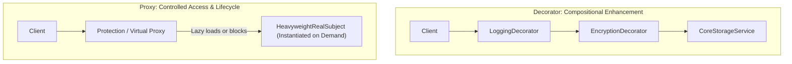
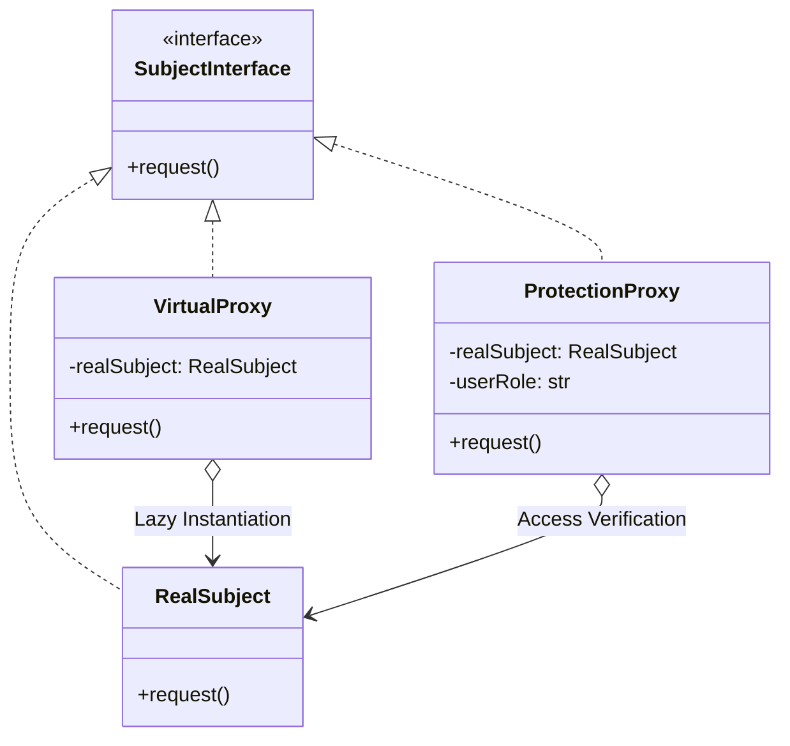

# Decorator and Proxy Patterns: Staff-Plus Deep Dive

## 1. Overview and Core Distinction

The **Decorator** and **Proxy** patterns share an identical structural composition: both wrap a target object behind an identical interface and forward method invocations.
However, at Staff and Principal levels, confusing them leads to severe architectural blurring.
Their architectural intents, lifecycle relationships, and execution models are fundamentally distinct.

- **Decorator Pattern**: Extends an object's behavior dynamically at runtime without subclassing. The client constructs the target object and wraps it with arbitrary layers of decorators. The decorator enhances capabilities (for example, adding encryption, compression, or telemetry).
- **Proxy Pattern**: Controls access to a target object, manages its lifecycle, or abstracts its physical location. The client usually interacts directly with the proxy, and the proxy manages when, how, or whether the underlying target object is instantiated or accessed.



---

## 2. Decorator Pattern: Deep Dive

### 2.1 The Classic I/O Pipeline Architecture
The canonical GoF Decorator is exemplified by standard library I/O streams in Java and C++.
Instead of creating static subclasses for every combination (`CompressedEncryptedFileInputStream`), small single-responsibility decorator classes wrap an underlying stream:

```java
InputStream stream = new BufferedInputStream(
                         new GZIPInputStream(
                             new CipherInputStream(
                                 new FileInputStream("data.bin"), cipher)));
```
Each layer processes a chunk of bytes, delegating down the chain.
Behavior is composed dynamically at runtime via Lego-like assembly.

### 2.2 Systems Pitfalls of Deep Decorator Chains
1. **Object Identity Confusion**: Calling `equals()` or inspecting `this` inside an inner object breaks because `this` refers to the inner unadorned subject, not the outermost decorator.
2. **Stack Depth and Inlining**: Deep chains (e.g., 10+ layers) generate deep call stacks, increasing instruction cache pressure and making debugging difficult when exceptions originate deep within the wrapper hierarchy.

---

## 3. Proxy Pattern: The Four Major Variants



### 3.1 The Four Canonical Variants
1. **Virtual Proxy (Lazy Loading)**:
   Defers the instantiation of expensive resources (such as 1 GB high-resolution images or machine learning model weights) until a method is explicitly invoked.
2. **Protection Proxy (Access Control)**:
   Verifies caller credentials, roles, or rate limits before delegating to the sensitive underlying domain service.
3. **Remote Proxy (RPC Stubs)**:
   Provides a local object facade representing a service residing in a different process or remote server (such as gRPC stubs or RMI proxies). The proxy handles serialization, network transmission, and deserialization transparently.
4. **Smart Reference / Copy-on-Write Proxy**:
   Performs ancillary housekeeping when an object is accessed, such as incrementing reference counts, tracking lock acquisitions, or initiating copy-on-write buffer duplications.

---

## 4. Architectural Comparison

| Dimension | Decorator Pattern | Proxy Pattern |
| :--- | :--- | :--- |
| **Primary Intent** | Dynamically augment or enhance behavior. | Control access, manage lifecycle, or abstract location. |
| **Lifecycle Control** | Client creates target object and wraps it. | Proxy typically creates and manages target object lifecycle. |
| **Interface Preservation** | Strictly implements the exact same interface. | Implements the exact same interface (or a subset for protection). |
| **Nesting Multiplicity** | Composed of multiple recursive wrapping layers. | Typically a single proxy layer in front of the real subject. |
| **Knowledge of Subject** | Enhances any object implementing the interface. | Frequently tied to a specific real subject lifecycle. |

---

## 5. Complete Production-Grade Simulation in Python

The following script implements:
1. A **Composed Stream Storage Decorator** adding transparent AES-style encryption and zlib compression.
2. A **Protection and Virtual Proxy** that lazily loads a heavy database model and guards access via role-based checks.

```python
"""
Decorator and Proxy Patterns Production Simulation.
Demonstrates:
1. Decorator: Chained transparent compression and encryption pipelines.
2. Virtual Proxy: Deferred lazy instantiation of expensive resources.
3. Protection Proxy: Role-based access control (RBAC) gateway.
"""

from abc import ABC, abstractmethod
import base64
import time
from typing import Dict, Optional
import zlib


# =====================================================================
# 1. DECORATOR PATTERN: STREAM STORAGE PIPELINE
# =====================================================================

class StorageStream(ABC):
    """Component interface for data stream persistence."""
    @abstractmethod
    def write_payload(self, raw_data: bytes) -> str:
        pass

    @abstractmethod
    def read_payload(self, locator: str) -> bytes:
        pass


class RawDiskStorage(StorageStream):
    """Concrete Component: Raw disk storage mechanism."""
    def __init__(self):
        self._disk: Dict[str, bytes] = {}
        self._seq = 0

    def write_payload(self, raw_data: bytes) -> str:
        self._seq += 1
        key = f"block-{self._seq}"
        self._disk[key] = raw_data
        return key

    def read_payload(self, locator: str) -> bytes:
        if locator not in self._disk:
            raise KeyError(f"Storage block {locator} not found")
        return self._disk[locator]


class StorageDecorator(StorageStream):
    """Base Decorator holding component reference."""
    def __init__(self, wrapped: StorageStream):
        self._wrapped = wrapped

    def write_payload(self, raw_data: bytes) -> str:
        return self._wrapped.write_payload(raw_data)

    def read_payload(self, locator: str) -> bytes:
        return self._wrapped.read_payload(locator)


class CompressionDecorator(StorageDecorator):
    """Concrete Decorator: Applies transparent zlib compression."""
    def write_payload(self, raw_data: bytes) -> str:
        compressed = zlib.compress(raw_data)
        return self._wrapped.write_payload(compressed)

    def read_payload(self, locator: str) -> bytes:
        compressed = self._wrapped.read_payload(locator)
        return zlib.decompress(compressed)


class EncryptionDecorator(StorageDecorator):
    """Concrete Decorator: Applies transparent XOR/Base64 masking."""
    def __init__(self, wrapped: StorageStream, secret_key: int = 0xAA):
        super().__init__(wrapped)
        self._secret_key = secret_key

    def _cipher(self, data: bytes) -> bytes:
        return bytes([b ^ self._secret_key for b in data])

    def write_payload(self, raw_data: bytes) -> str:
        encrypted = self._cipher(raw_data)
        return self._wrapped.write_payload(encrypted)

    def read_payload(self, locator: str) -> bytes:
        encrypted = self._wrapped.read_payload(locator)
        return self._cipher(encrypted)


# =====================================================================
# 2. PROXY PATTERN: VIRTUAL & PROTECTION PROXIES
# =====================================================================

class HeavyMLModelService(ABC):
    """Subject interface."""
    @abstractmethod
    def predict(self, feature_vector: list) -> float:
        pass


class RealHeavyMLModel(HeavyMLModelService):
    """Real Subject: Very expensive to instantiate (simulates multi-second load)."""
    def __init__(self):
        self.weights_loaded = True
        self.load_timestamp = time.time()

    def predict(self, feature_vector: list) -> float:
        return sum(feature_vector) * 0.42


class LazyAndProtectedModelProxy(HeavyMLModelService):
    """
    Combines:
    1. Virtual Proxy: Defers heavy model instantiation until first prediction.
    2. Protection Proxy: Enforces role-based permissions before execution.
    """
    def __init__(self, user_role: str):
        self._user_role = user_role
        self._real_subject: Optional[RealHeavyMLModel] = None

    def predict(self, feature_vector: list) -> float:
        # Step 1: Protection Proxy authorization check
        if self._user_role not in {"ADMIN", "DATA_SCIENTIST"}:
            raise PermissionError(f"User role '{self._user_role}' denied prediction access.")

        # Step 2: Virtual Proxy lazy initialization
        if self._real_subject is None:
            self._real_subject = RealHeavyMLModel()

        return self._real_subject.predict(feature_vector)

    def is_instantiated(self) -> bool:
        return self._real_subject is not None


# =====================================================================
# VERIFICATION SUITE
# =====================================================================

def main():
    print("Executing Decorator and Proxy Verification Suite...")

    # 1. Test Decorator Chain: RawDisk -> Compressed -> Encrypted
    raw_storage = RawDiskStorage()
    pipeline = EncryptionDecorator(CompressionDecorator(raw_storage), secret_key=0x55)

    original_text = b"Staff-level system design requires deep mechanical sympathy." * 20
    locator = pipeline.write_payload(original_text)

    # Verify that raw disk stored compressed/encrypted bytes, not plaintext
    stored_bytes = raw_storage.read_payload(locator)
    assert stored_bytes != original_text
    assert len(stored_bytes) < len(original_text)  # Compression succeeded

    # Read back through decorator pipeline
    restored_text = pipeline.read_payload(locator)
    assert restored_text == original_text
    print("Decorator Pipeline Compression & Encryption: Passed.")

    # 2. Test Protection Proxy Rejection
    guest_proxy = LazyAndProtectedModelProxy(user_role="GUEST")
    try:
        guest_proxy.predict([1.0, 2.0, 3.0])
        assert False, "Guest role should be rejected by protection proxy"
    except PermissionError:
        print("Protection Proxy Access Guard: Passed.")

    # 3. Test Virtual Proxy Lazy Loading
    auth_proxy = LazyAndProtectedModelProxy(user_role="DATA_SCIENTIST")
    assert not auth_proxy.is_instantiated()  # Not yet loaded

    prediction = auth_proxy.predict([10.0, 20.0, 30.0])
    assert auth_proxy.is_instantiated()     # Loaded on demand
    assert prediction == 60.0 * 0.42
    print("Virtual Proxy Lazy Loading: Passed.")

    print("All Decorator and Proxy validations completed successfully.")


if __name__ == "__main__":
    main()
```

---

## 6. Active Recall Interview Questions

<details>
<summary>1. What is the fundamental difference in intent between the Decorator and Proxy patterns?</summary>
A Decorator adds new functional responsibilities or behaviors to an object dynamically at runtime; the client creates the target object and controls the composition chain.
A Proxy controls access to an object, manages its lifecycle (such as lazy instantiation), or abstracts its physical location without changing its core business functionality.
</details>

<details>
<summary>2. What is a Virtual Proxy, and what real-world performance problem does it solve?</summary>
A Virtual Proxy defers the creation of an expensive, memory-intensive object until a method on that object is actually invoked.
This prevents startup latency spikes and avoids allocating memory for heavyweight objects (such as high-res images, machine learning models, or database connections) that might never be needed in a given execution path.
</details>

<details>
<summary>3. What is the 'this' aliasing (or object identity) problem in the Decorator pattern?</summary>
When a method inside the concrete wrapped object invokes another method on `this`, the call does not pass through the outer decorator chain.
Similarly, `equals()` and hash code checks can fail if clients mistakenly compare the decorator wrapper to the inner wrapped instance.
</details>

<details>
<summary>4. How does a Protection Proxy differ from a standard API Gateway or firewall?</summary>
A Protection Proxy operates at the object and programming language interface level, implementing the exact domain interface of the subject.
It inspects security tokens or permissions directly at method invocation boundaries, throwing language exceptions if unauthorized, whereas firewalls operate on network packet or HTTP transport boundaries.
</details>

<details>
<summary>5. What is a Remote Proxy, and how does it relate to gRPC client stubs?</summary>
A Remote Proxy provides a local object representation for a subject residing in a different address space or remote machine.
In gRPC, the generated client stub is a Remote Proxy: client code invokes methods locally like a regular function call, while the stub handles marshaling, network I/O, and unmarshaling transparently.
</details>

<details>
<summary>6. How do Python language-level function decorators (`@decorator`) differ from the GoF Decorator pattern?</summary>
Python function decorators are syntactic sugar that wrap a function callable with another callable at definition time (`foo = dec(foo)`).
The GoF Decorator pattern is an object-oriented structural pattern where a decorator class implements an interface and wraps another object instance dynamically at runtime via composition.
</details>

<details>
<summary>7. What is a Smart Reference (or Smart Pointer) Proxy?</summary>
A Smart Reference proxy performs ancillary operations whenever an underlying object is accessed, such as reference counting (`std::shared_ptr`), logging resource locks, or ensuring an object is pinned in memory during disk swapping.
</details>

<details>
<summary>8. How can deeply nested Decorator chains degrade CPU instruction cache locality?</summary>
Each decorator layer adds an indirect virtual function call via a vtable and requires chasing another object pointer in memory.
When decorators reside in different cache lines, every call in the chain triggers an instruction cache miss and pointer dereference, degrading throughput.
</details>

<details>
<summary>9. What is dynamic proxy generation in Java (e.g., `java.lang.reflect.Proxy`), and what is its performance cost?</summary>
Dynamic proxies generate bytecode at runtime to implement interfaces without requiring manual proxy classes.
Calls are routed through an `InvocationHandler.invoke()` method.
This incurs reflection overhead, unboxing/boxing of primitive arguments, and prevents JIT compiler inlining.
</details>

<details>
<summary>10. Can a Decorator act as a Protection Proxy?</summary>
Technically yes, but doing so violates the Single Responsibility Principle and confuses design intent.
A Decorator is intended to enhance capabilities; using it to restrict access blurs the boundary between behavioral augmentation and security governance.
</details>
