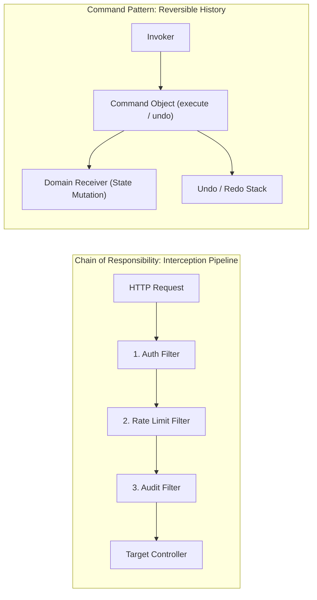
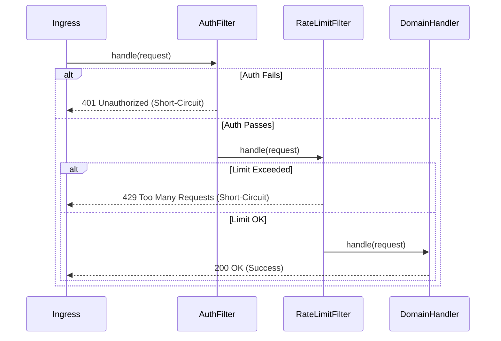

# Command and Chain of Responsibility Patterns: Staff-Plus Deep Dive

## 1. Overview and Problem Space

Managing workflow execution, auditing, transactional rollback, and interception pipelines requires decoupling the initiator of an operation from its execution logic.
Two architectural patterns provide this decoupling:
1. **Command Pattern**: Encapsulates a request as a standalone object containing all required context, parameters, and execution logic. This transforms an action into a first-class value, enabling undo/redo histories, background queuing, and distributed task dispatch.
2. **Chain of Responsibility Pattern**: Passes a request along a sequence of potential handlers. Each handler decides whether to process the request, reject it, or pass it to the next handler in the chain.



---

## 2. Command Pattern: Staff-Plus Mechanics

### 2.1 Reversible Operations: Inverse Commands vs Memento Snapshots
Implementing an undo mechanism can be achieved in two ways:
1. **Inverse Command (Symmetric Compensation)**:
   The command stores the inverse operation (e.g., `DepositCommand.undo()` executes `withdraw()`).
   Memory-efficient because it stores only parameter deltas.
   However, it fails if state was overwritten destructively or if precision is lost.
2. **Memento Snapshot (Asymmetric State Capture)**:
   Before execution, the command captures a snapshot of the receiver's state.
   `undo()` restores the previous snapshot directly.
   Guarantees 100% fidelity even on non-linear transformations, but consumes more memory.

### 2.2 Command Queuing and CQRS Integration
In Command Query Responsibility Segregation (CQRS), commands are immutable serialized envelopes representing business intent (`CreateOrderCommand`, `TransferFundsCommand`).
These commands are submitted to a durable message queue or event bus, validated by domain command handlers, and persisted to write-ahead logs, cleanly separating write workflows from read models.

---

## 3. Chain of Responsibility: Interceptors and Middleware

### 3.1 Two Execution Paradigms
1. **Pure CoR (Single Handler Termination)**:
   The request travels down the chain until exactly one handler handles it, at which point processing terminates (e.g., exception handler blocks, GUI event bubblers).
2. **Filter / Interceptor Pipeline (Full Traversal with Short-Circuit)**:
   Every handler processes the request sequentially before passing it downstream (e.g., HTTP middleware: Auth $\rightarrow$ RateLimit $\rightarrow$ Tracing).
   Any handler can abort the chain immediately (e.g., returning HTTP 401 Unauthorized or 429 Too Many Requests).



---

## 4. Architectural Comparison

| Dimension | Command Pattern | Chain of Responsibility Pattern |
| :--- | :--- | :--- |
| **Primary Intent** | Encapsulate an action and its parameters as an object. | Decouple sender of request from receivers via a handler chain. |
| **Execution Cardinality** | Exactly one receiver per command execution. | Zero, one, or multiple handlers may inspect the request. |
| **Time Decoupling** | High; command can be created now and executed later. | Low; usually executed synchronously along the chain. |
| **State Reversibility** | Explicitly supports undo, redo, and compensation. | Rarely reversible; focuses on forward processing. |
| **Typical Use Case** | Transactional ledger, GUI actions, CQRS write paths. | HTTP middleware, security filters, approval workflows. |

---

## 5. Complete Production-Grade Simulation in Python

The following script implements:
1. An **HTTP Middleware Interceptor Chain** (Authentication $\rightarrow$ Rate Limiting $\rightarrow$ Schema Validation) with short-circuit failure paths.
2. A **Transactional Bank Ledger** with a reversible **Undo / Redo Command Stack**.

```python
"""
Command and Chain of Responsibility Production Simulation.
Demonstrates:
1. Chain of Responsibility: HTTP Middleware pipeline with short-circuiting.
2. Command Pattern: Bank ledger transactions supporting Undo and Redo.
3. Invariant validation and state restoration integrity.
"""

from abc import ABC, abstractmethod
from typing import Dict, List, Optional


# =====================================================================
# 1. CHAIN OF RESPONSIBILITY: HTTP MIDDLEWARE PIPELINE
# =====================================================================

class HttpRequest:
    def __init__(self, path: str, token: Optional[str], client_ip: str, body: dict):
        self.path = path
        self.token = token
        self.client_ip = client_ip
        self.body = body


class HttpResponse:
    def __init__(self, status_code: int, message: str):
        self.status_code = status_code
        self.message = message


class MiddlewareHandler(ABC):
    """Abstract Chain of Responsibility link."""
    def __init__(self):
        self._next_handler: Optional['MiddlewareHandler'] = None

    def set_next(self, handler: 'MiddlewareHandler') -> 'MiddlewareHandler':
        self._next_handler = handler
        return handler

    @abstractmethod
    def handle(self, request: HttpRequest) -> HttpResponse:
        pass

    def _pass_downstream(self, request: HttpRequest) -> HttpResponse:
        if self._next_handler:
            return self._next_handler.handle(request)
        return HttpResponse(200, "Request successfully processed by pipeline.")


class AuthenticationMiddleware(MiddlewareHandler):
    def handle(self, request: HttpRequest) -> HttpResponse:
        if not request.token or request.token != "VALID-BEARER-SECRET":
            # Short-circuit chain
            return HttpResponse(401, "Unauthorized: Invalid or missing bearer token.")
        return self._pass_downstream(request)


class RateLimitingMiddleware(MiddlewareHandler):
    def __init__(self, max_requests_per_ip: int = 2):
        super().__init__()
        self.max_requests_per_ip = max_requests_per_ip
        self._ip_counts: Dict[str, int] = {}

    def handle(self, request: HttpRequest) -> HttpResponse:
        current_count = self._ip_counts.get(request.client_ip, 0)
        if current_count >= self.max_requests_per_ip:
            # Short-circuit chain
            return HttpResponse(429, "Too Many Requests: Rate limit exceeded.")

        self._ip_counts[request.client_ip] = current_count + 1
        return self._pass_downstream(request)


class SchemaValidationMiddleware(MiddlewareHandler):
    def handle(self, request: HttpRequest) -> HttpResponse:
        if "amount" not in request.body or request.body["amount"] <= 0:
            # Short-circuit chain
            return HttpResponse(400, "Bad Request: Positive amount field is required.")
        return self._pass_downstream(request)


# =====================================================================
# 2. COMMAND PATTERN: TRANSACTIONAL LEDGER WITH UNDO/REDO
# =====================================================================

class BankAccountReceiver:
    """Receiver: The domain entity whose state is mutated."""
    def __init__(self, account_id: str, balance: float):
        self.account_id = account_id
        self.balance = balance

    def deposit(self, amount: float) -> None:
        self.balance += amount

    def withdraw(self, amount: float) -> None:
        if self.balance - amount < 0:
            raise RuntimeError("Insufficient funds")
        self.balance -= amount


class TransactionCommand(ABC):
    """Abstract Command interface."""
    @abstractmethod
    def execute(self) -> None:
        pass

    @abstractmethod
    def undo(self) -> None:
        pass


class DepositCommand(TransactionCommand):
    def __init__(self, account: BankAccountReceiver, amount: float):
        self._account = account
        self._amount = amount

    def execute(self) -> None:
        self._account.deposit(self._amount)

    def undo(self) -> None:
        self._account.withdraw(self._amount)


class WithdrawCommand(TransactionCommand):
    def __init__(self, account: BankAccountReceiver, amount: float):
        self._account = account
        self._amount = amount

    def execute(self) -> None:
        self._account.withdraw(self._amount)

    def undo(self) -> None:
        self._account.deposit(self._amount)


class TransactionInvoker:
    """Invoker managing execution, undo, and redo command stacks."""
    def __init__(self):
        self._undo_stack: List[TransactionCommand] = []
        self._redo_stack: List[TransactionCommand] = []

    def execute_command(self, command: TransactionCommand) -> None:
        command.execute()
        self._undo_stack.append(command)
        self._redo_stack.clear()  # Clear redo history on new action

    def undo(self) -> bool:
        if not self._undo_stack:
            return False
        cmd = self._undo_stack.pop()
        cmd.undo()
        self._redo_stack.append(cmd)
        return True

    def redo(self) -> bool:
        if not self._redo_stack:
            return False
        cmd = self._redo_stack.pop()
        cmd.execute()
        self._undo_stack.append(cmd)
        return True


# =====================================================================
# VERIFICATION SUITE
# =====================================================================

def main():
    print("Executing Command and Chain of Responsibility Verification Suite...")

    # 1. Chain of Responsibility Pipeline Assembly
    auth = AuthenticationMiddleware()
    rate = RateLimitingMiddleware(max_requests_per_ip=2)
    schema = SchemaValidationMiddleware()
    auth.set_next(rate).set_next(schema)

    # Test 1A: Auth failure short-circuit
    req_bad_auth = HttpRequest("/transfer", token="WRONG", client_ip="10.0.0.1", body={"amount": 100})
    resp_1 = auth.handle(req_bad_auth)
    assert resp_1.status_code == 401
    print("CoR Auth Short-Circuit: Passed.")

    # Test 1B: Schema failure short-circuit
    req_bad_schema = HttpRequest("/transfer", token="VALID-BEARER-SECRET", client_ip="10.0.0.2", body={"amount": -50})
    resp_2 = auth.handle(req_bad_schema)
    assert resp_2.status_code == 400
    print("CoR Schema Validation Short-Circuit: Passed.")

    # Test 1C: Happy path
    req_ok_1 = HttpRequest("/transfer", token="VALID-BEARER-SECRET", client_ip="10.0.0.3", body={"amount": 50})
    req_ok_2 = HttpRequest("/transfer", token="VALID-BEARER-SECRET", client_ip="10.0.0.3", body={"amount": 75})
    assert auth.handle(req_ok_1).status_code == 200
    assert auth.handle(req_ok_2).status_code == 200

    # Test 1D: Rate limit exceeded short-circuit (3rd request from same IP 10.0.0.3)
    req_rate_limit = HttpRequest("/transfer", token="VALID-BEARER-SECRET", client_ip="10.0.0.3", body={"amount": 10})
    resp_3 = auth.handle(req_rate_limit)
    assert resp_3.status_code == 429
    print("CoR Rate Limiter Short-Circuit: Passed.")

    # 2. Command Pattern Reversible Ledger Verification
    account = BankAccountReceiver("ACC-101", balance=500.0)
    invoker = TransactionInvoker()

    # Deposit 200 -> 700
    invoker.execute_command(DepositCommand(account, 200.0))
    assert account.balance == 700.0

    # Withdraw 150 -> 550
    invoker.execute_command(WithdrawCommand(account, 150.0))
    assert account.balance == 550.0
    print("Command Execution: Passed.")

    # Undo withdrawal -> 700
    invoker.undo()
    assert account.balance == 700.0

    # Undo deposit -> 500
    invoker.undo()
    assert account.balance == 500.0
    print("Command Reversible Undo: Passed.")

    # Redo deposit -> 700
    invoker.redo()
    assert account.balance == 700.0
    print("Command Redo Re-Execution: Passed.")

    print("All Command and Chain of Responsibility validations completed successfully.")


if __name__ == "__main__":
    main()
```

---

## 6. Active Recall Interview Questions

<details>
<summary>1. What is the fundamental difference between the Command pattern and the Chain of Responsibility pattern?</summary>
Command encapsulates an action, its arguments, and its execution/undo logic into a standalone object; it has a known receiver and guarantees execution.
Chain of Responsibility routes a request along a sequence of potential handlers without the sender knowing which handler (if any) will ultimately process it.
</details>

<details>
<summary>2. How does the Command pattern support transactional rollbacks in banking systems?</summary>
By implementing symmetric inverse operations (`command.undo()`) or restoring Memento state snapshots captured prior to execution.
If a multi-step transaction fails midway, the transaction manager iterates backwards through the executed command stack, invoking `undo()` on each command to revert all partial mutations cleanly.
</details>

<details>
<summary>3. In web frameworks (such as Express, Django, or Go Chi), how is HTTP middleware an application of Chain of Responsibility?</summary>
Each middleware function acts as a link in the chain.
It receives the request, performs an orthogonal concern (authentication, tracing, rate limiting), and either delegates to `next()` or short-circuits the pipeline by returning an error response (e.g., HTTP 401 or 429) directly.
</details>

<details>
<summary>4. What is the difference between an inverse command and a Memento snapshot for implementing Undo?</summary>
An inverse command computes the mathematical opposite action (e.g., deposit inverse is withdraw), saving memory by only storing parameters.
A Memento snapshot captures the full serialized state of the receiver, consuming more RAM but ensuring perfect restoration even when operations are non-invertible or destructive.
</details>

<details>
<summary>5. How does the Command pattern integrate with asynchronous task queuing systems like Celery or BullMQ?</summary>
Commands serialize cleanly into JSON or Protobuf messages containing the task name, parameters, and metadata.
The producer puts the command onto a queue; remote worker nodes deserialize the command and invoke `execute()` in a separate thread or machine without needing the original caller context.
</details>

<details>
<summary>6. What is a 'pure' Chain of Responsibility versus an interceptor pipeline?</summary>
In a pure CoR, request traversal halts immediately when the first eligible handler processes it (exactly one handler executes).
In an interceptor pipeline, every handler in the chain processes the request sequentially unless a filter explicitly decides to abort early.
</details>

<details>
<summary>7. What happens to the redo stack in a Command Invoker when a brand-new command is executed?</summary>
The redo stack must be completely cleared.
Executing a new command creates a new timeline branch, invalidating previously undone operations.
</details>

<details>
<summary>8. How can a Chain of Responsibility degrade performance if misconfigured?</summary>
If the chain contains dozens of handlers and the request must traverse all of them to find an eligible handler (or fall off unhandled), each step incurs method call overhead, context copying, and memory allocations.
Furthermore, placing heavy database operations early in the chain blocks fast-reject filters (like rate limiting) from dropping invalid traffic quickly.
</details>

<details>
<summary>9. What is Macro Command (or Composite Command)?</summary>
A Macro Command is a composite object that holds an ordered sequence of multiple commands.
Invoking `macro.execute()` runs all contained commands sequentially; invoking `macro.undo()` rolls them back in reverse order.
</details>

<details>
<summary>10. Under what condition should you use a function pointer or lambda instead of a dedicated Command class?</summary>
When the action is simple, stateless, does not require serialization over a network, and does not require an `undo()` operation.
In modern languages, a closure `() -> void` satisfies lightweight execution needs without class bloat.
</details>
