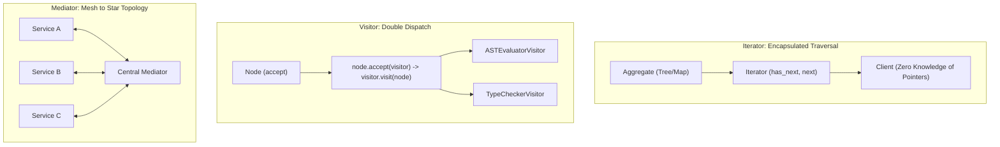
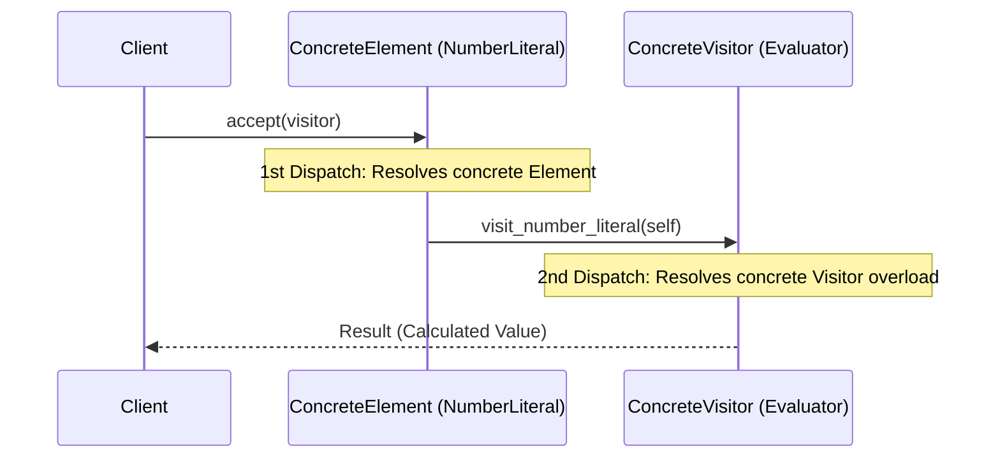

# Iterator, Visitor, and Mediator Patterns: Staff-Plus Deep Dive

## 1. Overview and Problem Space

Managing traversals, operations across heterogeneous class hierarchies, and many-to-many object communication represents three distinct challenges in object-oriented architecture:
1. **Iterator Pattern**: Accesses elements of an aggregate collection sequentially without exposing its internal memory representation (e.g., linked list, B-Tree, hash table).
2. **Visitor Pattern**: Separates an algorithm from the heterogeneous object structure on which it operates, achieving double dispatch without modifying class definitions.
3. **Mediator Pattern**: Centralizes complex communications and control flow between a network of interacting peer objects, transforming an $O(N^2)$ mesh topology into an $O(N)$ star topology.



---

## 2. Iterator Pattern: Concurrency and Invalidation

### 2.1 External vs Internal Iterators
- **External Iterator**: The client explicitly drives the traversal loop by repeatedly calling `hasNext()` and `next()`. The client controls pacing and can pause, interleave, or break early.
- **Internal Iterator**: The aggregate object controls the traversal, accepting a functional callback or lambda (e.g., `collection.forEach(item -> ...)`). Simpler, but cannot easily break or interleave traversals across multiple collections.

### 2.2 Concurrency Hazards: Fail-Fast vs Fail-Safe
1. **Fail-Fast**:
   Maintains a modification count (`modCount`).
   If the underlying collection undergoes structural modification (add/remove) while an iterator is active, the iterator detects `expectedModCount != modCount` on the very next read and immediately throws a `ConcurrentModificationException`.
2. **Fail-Safe / Weakly Consistent**:
   Iterates over a clone, snapshot, or thread-safe concurrent structure (e.g., `CopyOnWriteArrayList` or `ConcurrentHashMap`).
   It never throws concurrent modification exceptions, but may reflect slightly stale data.

---

## 3. Visitor Pattern: The Double-Dispatch Mechanism

### 3.1 Resolving Single-Dispatch Limitations
In single-dispatch languages (C++, Java, Python), the method executed depends solely on the runtime type of the receiver object (`receiver.method()`).
If an operation depends on the runtime types of *both* the receiver and the argument (`operation(node, context)`), single dispatch fails without ugly `isinstance` / `dynamic_cast` ladders.

The Visitor pattern achieves **Double Dispatch** through a two-step handshake:
1. **First Dispatch**: The client invokes `element.accept(visitor)`. The runtime resolves the concrete type of `Element`.
2. **Second Dispatch**: Inside `accept()`, the element invokes `visitor.visit(this)`. Because `this` is statically known within the concrete element class, the runtime resolves the concrete overload on the `Visitor`.



### 3.2 Architectural Costs
The Visitor pattern creates a tight bidirectional compile-time coupling between the visitor interface and all element types.
Adding a new concrete element class requires adding a new `visit()` method to the `Visitor` interface, forcing every existing visitor implementation in the codebase to be updated and recompiled.

---

## 4. Mediator Pattern: Star Topology Coordination

### 4.1 Intent and Failure Modes
When dozens of peer components communicate directly, the system degenerates into a tightly coupled $O(N^2)$ mesh.
The Mediator pattern decouples peers by routing all communications through a central coordinator.
Peers know only the Mediator; the Mediator knows all peers.

**The God-Class Hazard**:
Because the Mediator concentrates all orchestration logic, it easily mutates into a bloated, monolithic God class with hundreds of methods.
Staff engineers mitigate this by decomposing large mediators into domain-specific event brokers or command dispatchers.

---

## 5. Complete Production-Grade Simulation in Python

The following script implements:
1. A **Fail-Safe Concurrent Iterator** over a versioned repository.
2. A **Double-Dispatch AST Expression Evaluator Visitor** compiling and evaluating mathematical expressions.
3. A **Microservice Flight Dispatch Mediator** coordinating flight, hotel, and billing services.

```python
"""
Iterator, Visitor, and Mediator Patterns Production Simulation.
Demonstrates:
1. Fail-Safe Snapshot Iterator handling concurrent modifications.
2. Visitor Pattern: Double-dispatch AST Expression Evaluator.
3. Mediator Pattern: Centralized microservice booking orchestration.
"""

from abc import ABC, abstractmethod
from typing import Any, Dict, Iterator, List, Optional


# =====================================================================
# 1. ITERATOR PATTERN (FAIL-SAFE SNAPSHOT TRAVERSAL)
# =====================================================================

class FailSafeCollection:
    """Collection supporting fail-safe iteration via immutable snapshots."""
    def __init__(self):
        self._items: List[str] = []

    def add(self, item: str) -> None:
        self._items.append(item)

    def remove(self, item: str) -> None:
        self._items.remove(item)

    def __iter__(self) -> Iterator[str]:
        # Return iterator over shallow snapshot copy; safe from concurrent mutation
        snapshot = list(self._items)
        return iter(snapshot)


# =====================================================================
# 2. VISITOR PATTERN (AST EXPRESSION EVALUATOR)
# =====================================================================

class AstVisitor(ABC):
    """Visitor interface declaring visit overloads for all AST node types."""
    @abstractmethod
    def visit_literal(self, node: 'LiteralNode') -> float:
        pass

    @abstractmethod
    def visit_binary_op(self, node: 'BinaryOpNode') -> float:
        pass


class AstNode(ABC):
    """Element interface declaring double-dispatch accept method."""
    @abstractmethod
    def accept(self, visitor: AstVisitor) -> float:
        pass


class LiteralNode(AstNode):
    def __init__(self, value: float):
        self.value = value

    def accept(self, visitor: AstVisitor) -> float:
        # First dispatch lands here; second dispatch calls visit_literal
        return visitor.visit_literal(self)


class BinaryOpNode(AstNode):
    def __init__(self, left: AstNode, operator: str, right: AstNode):
        self.left = left
        self.operator = operator
        self.right = right

    def accept(self, visitor: AstVisitor) -> float:
        # First dispatch lands here; second dispatch calls visit_binary_op
        return visitor.visit_binary_op(self)


class EvaluatorVisitor(AstVisitor):
    """Concrete Visitor evaluating AST mathematical expressions."""
    def visit_literal(self, node: LiteralNode) -> float:
        return node.value

    def visit_binary_op(self, node: BinaryOpNode) -> float:
        left_val = node.left.accept(self)
        right_val = node.right.accept(self)

        if node.operator == "+":
            return left_val + right_val
        elif node.operator == "-":
            return left_val - right_val
        elif node.operator == "*":
            return left_val * right_val
        elif node.operator == "/":
            if right_val == 0:
                raise ZeroDivisionError("Division by zero in AST evaluation.")
            return left_val / right_val
        else:
            raise ValueError(f"Unknown operator: {node.operator}")


# =====================================================================
# 3. MEDIATOR PATTERN (TRAVEL BOOKING ORCHESTRATOR)
# =====================================================================

class TravelServicePeer(ABC):
    def __init__(self, mediator: Optional['TravelBookingMediator'] = None):
        self.mediator = mediator

    def set_mediator(self, mediator: 'TravelBookingMediator') -> None:
        self.mediator = mediator


class FlightBookingService(TravelServicePeer):
    def book_flight(self, origin: str, dest: str) -> str:
        return f"FLIGHT-{origin}-TO-{dest}-CONFIRMED"


class HotelBookingService(TravelServicePeer):
    def reserve_hotel(self, city: str, nights: int) -> str:
        return f"HOTEL-{city}-{nights}NIGHTS-RESERVED"


class PaymentBillingService(TravelServicePeer):
    def charge_customer(self, customer_id: str, amount: float) -> str:
        return f"PAYMENT-OK-${amount:.2f}-REF491"


class TravelBookingMediator:
    """Central Mediator coordinating peer interactions into a unified workflow."""
    def __init__(self, flight: FlightBookingService, hotel: HotelBookingService, billing: PaymentBillingService):
        self.flight = flight
        self.hotel = hotel
        self.billing = billing

        self.flight.set_mediator(self)
        self.hotel.set_mediator(self)
        self.billing.set_mediator(self)

    def book_complete_vacation(self, customer_id: str, destination: str, nights: int) -> Dict[str, str]:
        # Mediator coordinates booking without peers calling each other
        flight_ref = self.flight.book_flight("SFO", destination)
        hotel_ref = self.hotel.reserve_hotel(destination, nights)
        total_cost = 450.0 + (nights * 120.0)
        pay_ref = self.billing.charge_customer(customer_id, total_cost)

        return {
            "status": "VACATION_CONFIRMED",
            "flight": flight_ref,
            "hotel": hotel_ref,
            "payment": pay_ref
        }


# =====================================================================
# VERIFICATION SUITE
# =====================================================================

def main():
    print("Executing Iterator, Visitor, and Mediator Verification Suite...")

    # 1. Fail-Safe Iterator Verification
    collection = FailSafeCollection()
    collection.add("alpha")
    collection.add("beta")

    iterated_items = []
    for item in collection:
        iterated_items.append(item)
        # Concurrent structural mutation during active loop
        collection.add(f"mutated-{item}")

    assert iterated_items == ["alpha", "beta"]
    print("Fail-Safe Concurrent Iterator: Passed.")

    # 2. Visitor AST Evaluation: (10 + 5) * 2 = 30.0
    ast_tree = BinaryOpNode(
        left=BinaryOpNode(left=LiteralNode(10), operator="+", right=LiteralNode(5)),
        operator="*",
        right=LiteralNode(2)
    )
    evaluator = EvaluatorVisitor()
    result = ast_tree.accept(evaluator)
    assert result == 30.0
    print("Visitor Double-Dispatch AST Evaluation: Passed (Result = 30.0).")

    # 3. Mediator Verification
    mediator = TravelBookingMediator(FlightBookingService(), HotelBookingService(), PaymentBillingService())
    booking = mediator.book_complete_vacation("CUST-99", "PARIS", 3)
    assert booking["status"] == "VACATION_CONFIRMED"
    assert "FLIGHT-SFO-TO-PARIS" in booking["flight"]
    assert "HOTEL-PARIS-3NIGHTS" in booking["hotel"]
    print("Mediator Star Topology Orchestration: Passed.")

    print("All Iterator, Visitor, and Mediator validations completed successfully.")


if __name__ == "__main__":
    main()
```

---

## 6. Active Recall Interview Questions

<details>
<summary>1. How does the Visitor pattern achieve Double Dispatch in single-dispatch languages?</summary>
In single-dispatch languages, method calls dispatch only on the runtime type of the receiver.
Visitor uses two calls:
1. `element.accept(visitor)` dynamically dispatches on the concrete type of the Element.
2. Inside `accept()`, `visitor.visit(this)` dynamically dispatches on the concrete Visitor, passing `this` whose static type is known within the concrete element.
This makes the executed code depend on both the Element and Visitor types.
</details>

<details>
<summary>2. What is the fundamental architectural drawback of the Visitor pattern?</summary>
Visitor inverts the dependency direction: adding new operations is easy, but adding new element classes is painful.
Adding a new Element subclass requires adding a new `visit()` method to the Visitor interface, forcing recompilation and edits across all existing concrete visitor classes.
</details>

<details>
<summary>3. What is the difference between a fail-fast iterator and a fail-safe iterator?</summary>
A fail-fast iterator detects structural modifications during iteration via an internal modification counter (`modCount`) and immediately throws a `ConcurrentModificationException`.
A fail-safe iterator iterates over an immutable snapshot or copy-on-write buffer, never throwing concurrent modification exceptions, but potentially returning slightly stale data.
</details>

<details>
<summary>4. How does the Mediator pattern simplify $O(N^2)$ communication meshes into $O(N)$ star topologies?</summary>
When $N$ peers communicate directly with each other, every peer requires $N-1$ dependencies, yielding $N(N-1)/2 \approx O(N^2)$ direct connections.
A Mediator places a central coordinator between them: each peer communicates only with the Mediator, reducing the total connection count to $N$ direct links ($O(N)$).
</details>

<details>
<summary>5. How do modern languages (such as Rust and Modern C++) replace the Visitor pattern?</summary>
Using algebraic sum types (enums / `std::variant`) paired with pattern matching (`match` / `std::visit`).
Pattern matching allows adding new functions over variant types cleanly at the callsite without creating visitor classes or vtable double dispatch.
</details>

<details>
<summary>6. What is the primary difference between the Mediator and Facade patterns?</summary>
A Facade provides a simplified, unidirectional entry point from outside clients into a subsystem (clients call the facade, the facade calls subsystems).
A Mediator coordinates bidirectional, peer-to-peer communication among subsystem components internally (peers communicate with each other via the mediator).
</details>

<details>
<summary>7. What is an internal iterator versus an external iterator?</summary>
An external iterator leaves loop control to the client via methods like `hasNext()` and `next()`.
An internal iterator controls the loop internally, accepting a lambda or function pointer (`forEach(fn)`), executing the callback on each element.
</details>

<details>
<summary>8. How does the Mediator pattern easily degenerate into a God Class?</summary>
Because all communication routing and orchestration between all peers is centralized within the Mediator.
Over time, business logic that belongs inside individual peers tends to migrate into the Mediator, making it thousands of lines long and difficult to test.
</details>

<details>
<summary>9. Why can an Iterator become invalid if elements are deleted directly through the collection rather than through the iterator itself?</summary>
Because the underlying array or tree shifts elements in memory without notifying the iterator.
The iterator's internal cursor index becomes desynchronized, causing it to skip elements or throw index-out-of-bounds errors.
Using `iterator.remove()` updates the iterator's cursor and the collection's modification count simultaneously.
</details>

<details>
<summary>10. When should you choose the Mediator pattern over an asynchronous Publish-Subscribe event bus?</summary>
When communication requires tight, coordinated, synchronous orchestration with transactional return values and compensation logic (e.g., UI dialogs coordinating validation or local multi-service booking workflows).
Pub-Sub is preferred for loose, fire-and-forget, asynchronous decoupled event broadcasting.
</details>
