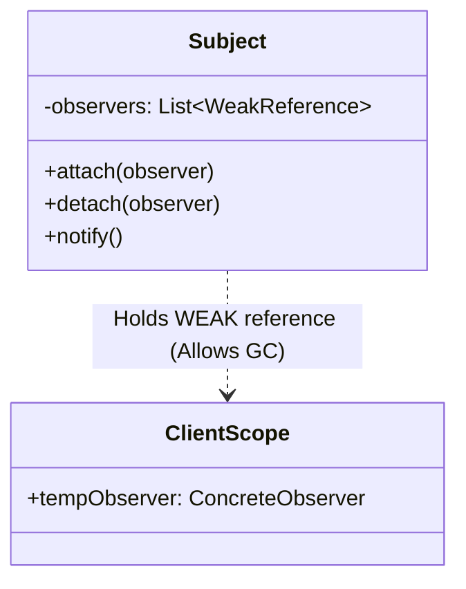

# Observer and Publish-Subscribe Patterns: Staff-Plus Deep Dive

## 1. Overview and Core Architectural Divergence

The **Observer** pattern and the **Publish-Subscribe (Pub-Sub)** pattern are frequently conflated.
At Staff and Principal levels, distinguishing between them is critical for distributed systems and local event architecture.

- **Observer Pattern (GoF)**: Operates within a single process address space. The Subject maintains direct references to a collection of Observers. When the Subject mutates state, it directly invokes the `update()` method on each observer synchronously.
- **Publish-Subscribe Pattern**: Introduces an intermediate **Event Bus / Message Broker**. Publishers have zero knowledge of subscribers; subscribers have zero knowledge of publishers. Communication is mediated entirely through named topics or channels, usually asynchronously.

```mermaid
flowchart TD
    subgraph ObserverPattern["GoF Observer Pattern (Direct Coupling)"]
        Subject["Subject (Stateful)"] -->|Direct Method Call| Obs1["Observer A"]
        Subject -->|Direct Method Call| Obs2["Observer B"]
    end

    subgraph PubSubPattern["Publish-Subscribe Pattern (Brokered Indirection)"]
        Pub1["Publisher 1"] -->|publish(Topic, Event)| Broker["Event Bus / Broker"]
        Pub2["Publisher 2"] -->|publish(Topic, Event)| Broker
        Broker -->|dispatch| Sub1["Subscriber X (Topic A)"]
        Broker -->|dispatch| Sub2["Subscriber Y (Topic B)"]
    end
```

---

## 2. Observer Pattern: Memory and Concurrency Pitfalls

### 2.1 The "Lapsed Listener" Memory Leak
In garbage-collected environments (Java, Python, C#), the Observer pattern is the leading cause of memory leaks.
When an observer subscribes to a long-lived subject, the subject holds a strong reference to the observer.
When the client discards the observer, the garbage collector cannot reclaim it because the subject's listener list maintains a root-accessible path.
The observer continues to live in memory, receiving events and leaking resources.

**Production Solution**: Use **Weak References** (`std::weak_ptr` in C++, `WeakReference` in Java, `weakref` in Python).
The subject stores weak pointers; when an observer is deallocated by the client, its weak pointer automatically becomes invalid without preventing garbage collection.



### 2.2 Synchronous Blocking and Exception Cascades
If a Subject notifies observers synchronously on its main thread:
1. **Latency Stalling**: A slow observer performing network or disk I/O blocks the publisher from completing its core business transaction.
2. **Exception Poisoning**: If Observer A throws an unhandled exception during `update()`, the iteration loop terminates abruptly, preventing subsequent Observers B and C from ever receiving the event.

---

## 3. Publish-Subscribe Pattern: Backpressure and Flow Control

### 3.1 Push vs Pull Event Delivery
- **Push Model**: The broker immediately forces the event into the subscriber's callback. Risky if the subscriber is overloaded (slow consumer problem).
- **Pull Model (Polling / Reactive Streams)**: The subscriber requests $N$ elements (`request(n)`) when it has capacity, establishing true backpressure.

### 3.2 Overflow and Drop Policies
When an asynchronous subscriber's bounded queue fills up, the broker must enforce a deterministic backpressure policy:
1. **Block / Wait**: The publisher thread blocks until the queue drains (propagates backpressure upstream).
2. **Drop Latest**: Discards newly arriving events; preserves historical sequence.
3. **Drop Oldest**: Discards the oldest queued events; prioritizes real-time freshness.
4. **Dead Letter Queue (DLQ)**: Routes discarded or failed events to a dead-letter storage sink for offline analysis.

---

## 4. Architectural Comparison

| Dimension | Observer Pattern (GoF) | Publish-Subscribe Pattern |
| :--- | :--- | :--- |
| **Component Coupling** | Tightly coupled in-process interfaces. | Completely decoupled; mediated via message broker. |
| **Address Space** | Strictly single-process memory. | Single-process, multi-process, or distributed cluster. |
| **Communication Mode** | Typically synchronous method calls. | Asynchronous message queues and event loops. |
| **Filtering Mechanism** | Subject notifies all attached observers. | Topic, channel, or content-based pattern routing. |
| **Memory Risk** | Lapsed listener memory leaks. | Unbounded broker queue memory exhaustion. |

---

## 5. Complete Production-Grade Simulation in Python

The following script implements:
1. A **Weak-Reference Observer** proving automatic garbage collection when client scope exits.
2. A **Multi-Topic Asynchronous Pub-Sub Event Bus** featuring bounded consumer queues, worker threads, and backpressure rejection handling.

```python
"""
Observer and Pub-Sub Patterns Production Simulation.
Demonstrates:
1. Weak-Reference Observer preventing lapsed listener memory leaks.
2. Decoupled Asynchronous Multi-Topic Pub-Sub Event Bus.
3. Bounded subscriber queues with explicit backpressure handling.
"""

from abc import ABC, abstractmethod
import queue
import threading
import time
from typing import Callable, Dict, List, Optional
import weakref


# =====================================================================
# 1. OBSERVER PATTERN WITH WEAK REFERENCES
# =====================================================================

class StockObserver(ABC):
    @abstractmethod
    def on_price_tick(self, symbol: str, price: float) -> None:
        pass


class StockTickerSubject:
    """Subject storing weak references to eliminate lapsed listener memory leaks."""
    def __init__(self, symbol: str):
        self.symbol = symbol
        self._price: float = 0.0
        self._observers: List[weakref.ReferenceType[StockObserver]] = []

    def attach(self, observer: StockObserver) -> None:
        self._observers.append(weakref.ref(observer))

    def set_price(self, new_price: float) -> None:
        self._price = new_price
        self._notify_all()

    def _notify_all(self) -> None:
        alive_observers: List[weakref.ReferenceType[StockObserver]] = []
        for ref in self._observers:
            obs = ref()  # Dereference weak reference
            if obs is not None:
                alive_observers.append(ref)
                try:
                    obs.on_price_tick(self.symbol, self._price)
                except Exception as ex:
                    print(f"Exception suppressed during observer update: {ex}")
        # Prune dead references automatically
        self._observers = alive_observers

    def active_observer_count(self) -> int:
        return sum(1 for ref in self._observers if ref() is not None)


class TraderDashboard(StockObserver):
    def __init__(self, trader_id: str):
        self.trader_id = trader_id
        self.latest_price: Optional[float] = None

    def on_price_tick(self, symbol: str, price: float) -> None:
        self.latest_price = price


# =====================================================================
# 2. ASYNCHRONOUS MULTI-TOPIC PUB-SUB EVENT BUS
# =====================================================================

class EventMessage:
    def __init__(self, topic: str, payload: dict):
        self.topic = topic
        self.payload = payload
        self.timestamp = time.time()


class AsyncSubscriber:
    """Asynchronous subscriber with its own bounded queue and worker thread."""
    def __init__(self, subscriber_id: str, queue_size: int = 5):
        self.subscriber_id = subscriber_id
        self._queue: queue.Queue[EventMessage] = queue.Queue(maxsize=queue_size)
        self.processed_messages: List[EventMessage] = []
        self._running = True
        self._worker = threading.Thread(target=self._event_loop, daemon=True)
        self._worker.start()

    def enqueue(self, message: EventMessage) -> bool:
        """Attempts to enqueue; returns False if queue is saturated (backpressure)."""
        try:
            self._queue.put_nowait(message)
            return True
        except queue.Full:
            return False

    def _event_loop(self) -> None:
        while self._running:
            try:
                msg = self._queue.get(timeout=0.1)
            except queue.Empty:
                continue
            self.processed_messages.append(msg)
            self._queue.task_done()

    def shutdown(self) -> None:
        self._queue.join()
        self._running = False
        self._worker.join()


class PubSubEventBus:
    """Decoupled broker mediating topic-based event routing."""
    def __init__(self):
        self._topics: Dict[str, List[AsyncSubscriber]] = {}
        self._lock = threading.Lock()

    def subscribe(self, topic: str, subscriber: AsyncSubscriber) -> None:
        with self._lock:
            if topic not in self._topics:
                self._topics[topic] = []
            self._topics[topic].append(subscriber)

    def publish(self, topic: str, payload: dict) -> Dict[str, bool]:
        """Publishes event to all subscribers registered for topic."""
        msg = EventMessage(topic, payload)
        delivery_report: Dict[str, bool] = {}

        with self._lock:
            subscribers = list(self._topics.get(topic, []))

        for sub in subscribers:
            accepted = sub.enqueue(msg)
            delivery_report[sub.subscriber_id] = accepted

        return delivery_report


# =====================================================================
# VERIFICATION SUITE
# =====================================================================

def main():
    print("Executing Observer and Pub-Sub Verification Suite...")

    # 1. Verify Weak-Reference Observer garbage collection
    ticker = StockTickerSubject("NVDA")
    dashboard_1 = TraderDashboard("Trader-A")
    dashboard_2 = TraderDashboard("Trader-B")

    ticker.attach(dashboard_1)
    ticker.attach(dashboard_2)
    assert ticker.active_observer_count() == 2

    ticker.set_price(125.50)
    assert dashboard_1.latest_price == 125.50
    assert dashboard_2.latest_price == 125.50

    # Explicitly drop dashboard_2 from client scope
    del dashboard_2
    ticker.set_price(130.00)

    # Verify dead weak reference was automatically pruned
    assert ticker.active_observer_count() == 1
    assert dashboard_1.latest_price == 130.00
    print("Weak-Reference Lapsed Listener Garbage Collection: Passed.")

    # 2. Verify Decoupled Asynchronous Pub-Sub Bus
    bus = PubSubEventBus()
    sub_billing = AsyncSubscriber("BillingService", queue_size=5)
    sub_analytics = AsyncSubscriber("AnalyticsService", queue_size=2)

    bus.subscribe("orders.created", sub_billing)
    bus.subscribe("orders.created", sub_analytics)

    # Publish normal message
    report = bus.publish("orders.created", {"order_id": "ORD-1", "amount": 99.0})
    assert report["BillingService"] is True
    assert report["AnalyticsService"] is True

    # Fill analytics queue to trigger backpressure rejection
    bus.publish("orders.created", {"order_id": "ORD-2", "amount": 10.0})
    bus.publish("orders.created", {"order_id": "ORD-3", "amount": 20.0})
    overflow_report = bus.publish("orders.created", {"order_id": "ORD-4", "amount": 30.0})

    # Billing has queue_size 5, so it accepts; Analytics has queue_size 2, so it rejects
    assert overflow_report["BillingService"] is True
    assert overflow_report["AnalyticsService"] is False
    print("Pub-Sub Backpressure Saturation Guard: Passed.")

    # Graceful shutdown
    sub_billing.shutdown()
    sub_analytics.shutdown()
    assert len(sub_billing.processed_messages) >= 4
    print("Async Pub-Sub Processing: Passed.")

    print("All Observer and Pub-Sub validations completed successfully.")


if __name__ == "__main__":
    main()
```

---

## 6. Active Recall Interview Questions

<details>
<summary>1. What is the fundamental difference between the Observer pattern and the Publish-Subscribe pattern?</summary>
Observer directly couples the Subject to its Observers within the same address space (Subject maintains a list of observer interfaces and invokes them directly).
Publish-Subscribe introduces an independent Message Broker / Event Bus; publishers and subscribers are completely unaware of each other, interacting solely via topic channels asynchronously.
</details>

<details>
<summary>2. Explain the 'Lapsed Listener' problem and how weak references solve it.</summary>
When an observer subscribes to a long-lived subject, the subject holds a strong reference to it.
Even if client code drops all references to the observer, the garbage collector cannot reclaim it because the subject's reference retains reachability, causing a silent memory leak.
Storing Weak References allows the GC to reclaim the observer when external references disappear; the subject automatically cleans up the stale dead pointer.
</details>

<details>
<summary>3. Why is synchronous notification dangerous in production Observer implementations?</summary>
1. A slow or blocking observer (e.g., executing network requests) stalls the publisher thread, adding latency to the core transaction.
2. If an observer throws an unhandled exception, it aborts the loop, preventing subsequent registered observers from receiving the event.
</details>

<details>
<summary>4. What is the difference between the Push and Pull models of event delivery?</summary>
In the Push model, the Subject passes complete event data as method arguments to `update(data)`, forcing all observers to receive the full payload regardless of whether they need it.
In the Pull model, the Subject notifies `update()`, and the observer queries the Subject only for the specific fields it requires.
</details>

<details>
<summary>5. How do Reactive Streams implement backpressure for fast publishers and slow subscribers?</summary>
Subscribers initiate demand signaling: a subscriber issues `subscription.request(n)` requesting at most $n$ items.
The publisher is forbidden from pushing more than $n$ elements until the subscriber explicitly signals further demand, preventing consumer buffer overflow.
</details>

<details>
<summary>6. What are the four primary overflow policies when an asynchronous subscriber queue fills up?</summary>
1. **Block / Suspend**: The publishing thread blocks until space frees up (propagating backpressure).
2. **Drop Latest**: Discards newly arriving events; preserves historical sequence.
3. **Drop Oldest**: Discards the oldest unconsumed events in the buffer; prioritizes fresh data.
4. **Dead Letter Queue (DLQ)**: Diverts overflowed events to a persistent fallback queue for inspection.
</details>

<details>
<summary>7. How does content-based filtering differ from topic-based filtering in Pub-Sub systems?</summary>
Topic-based filtering routes events based on static named channels (e.g., `orders.europe`).
Content-based filtering inspects the message payload attributes (e.g., `amount > 1000 AND currency == 'USD'`) to determine whether a subscriber receives the message.
</details>

<details>
<summary>8. In C++, how is thread-safe observer notification typically implemented to prevent deadlocks during unregistration?</summary>
The subject copies the observer list into a local variable under the lock, releases the lock, and then iterates over the copied list to invoke callbacks.
This prevents deadlocks if an observer's `update()` callback attempts to invoke `detach()` on the subject.
</details>

<details>
<summary>9. What is an Event Bus Dead Letter Queue (DLQ), and why is it essential?</summary>
A Dead Letter Queue is a dedicated secondary destination where an Event Bus routes messages that failed delivery due to consumer errors, schema validation failures, or queue overflow.
It isolates poisonous messages from blocking normal message streams while preserving them for audit and retry.
</details>

<details>
<summary>10. Under what circumstance should you choose the simple GoF Observer pattern over an Asynchronous Pub-Sub Bus?</summary>
When state changes must be handled synchronously in the same thread and database transaction boundary (for example, triggering UI component redraws in response to direct user model inputs, or local domain event handlers enforcing aggregate invariants).
</details>
